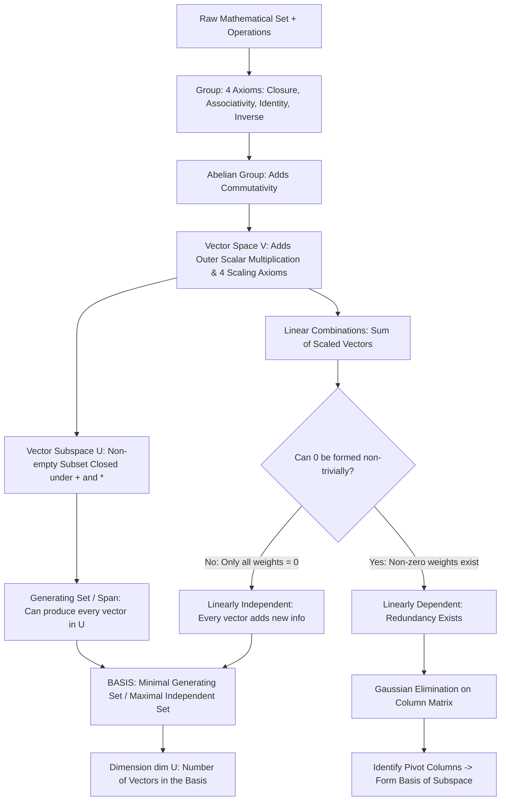
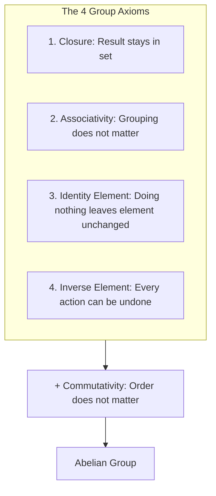
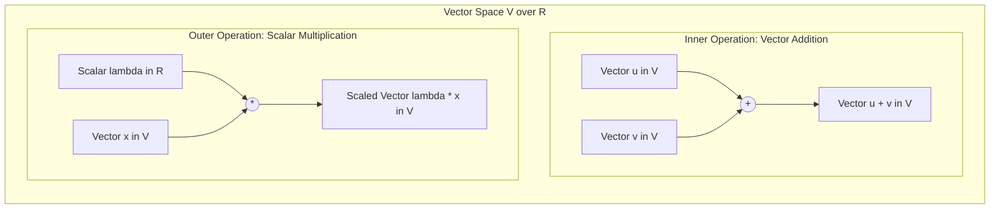
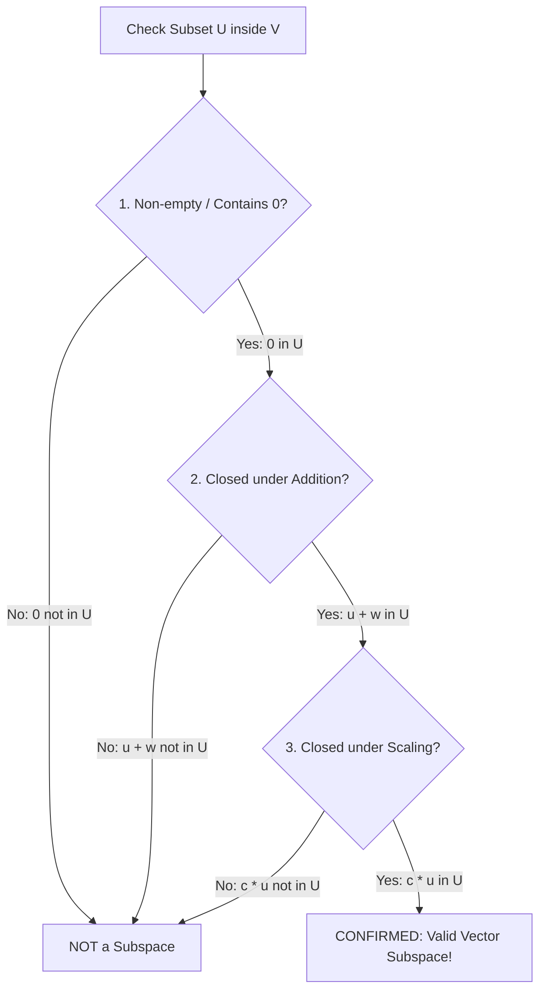
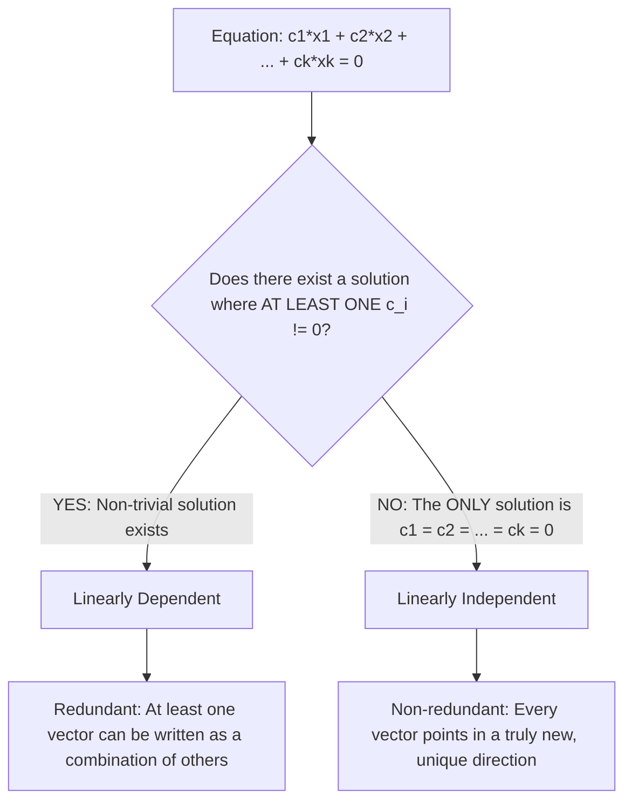
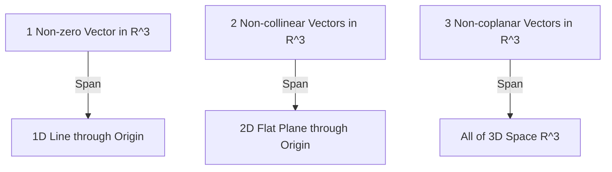
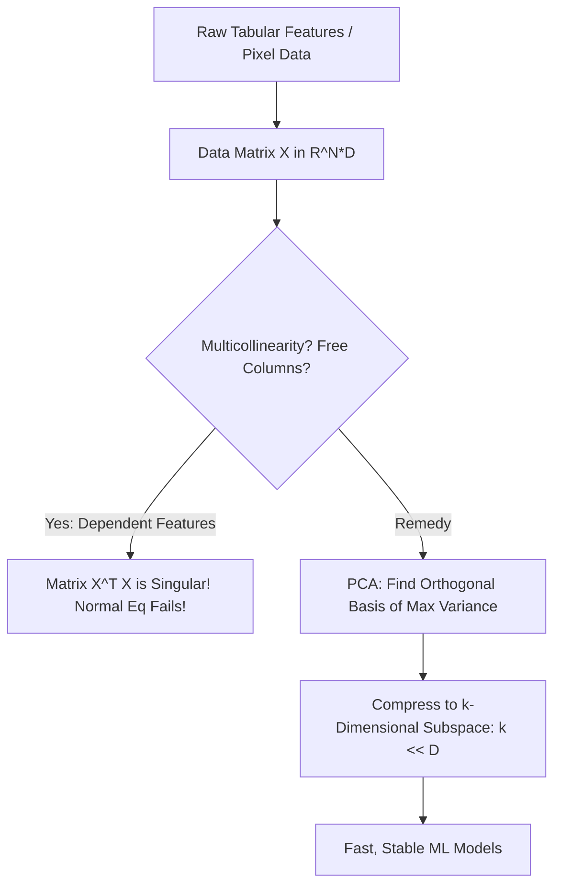

# Comprehensive Master Study Guide: Vector Spaces, Subspaces, Linear Independence, and Bases
**Course:** Mathematical Foundations for Machine Learning & Data Science — Lecture 2  
**Target Audience:** Complete Beginners in Mathematics (Zero Knowledge Assumed $\to$ Path to Mastery)  
**Primary Reference:** Lecture 2 Presentation Slides (*BITS Pilani WILPD - CSIS / MFML & MFDS Team*)

---

## Welcome & Pedagogical Roadmap

In **Lecture 1**, we explored the mechanics of linear equations: how to arrange numbers into matrices, perform Gaussian elimination, and solve systems of the form $A\mathbf{x} = \mathbf{b}$. That was the study of **equations and computation**.

In **Lecture 2**, we step back and explore the **universe in which these equations live**: **Vector Spaces**. 

Instead of asking *"How do we solve this specific matrix equation?"*, modern mathematics and machine learning ask:
* *What is the geometry of the space of all possible data points?*
* *Can we represent an entire dataset using a smaller, non-redundant set of master directions (a **basis**)?*
* *How many truly independent pieces of information exist in our features (the **dimension**)?*
* *If we combine or compress features, do we stay within a well-behaved sub-universe (a **subspace**)?*

Whether you are training Large Language Models (word embeddings living in 4,096-dimensional vector spaces), compressing images (Principal Component Analysis), or analyzing customer behavior, **vector spaces provide the mathematical stage upon which all machine learning algorithms perform**.

This guide is designed with a strict **zero-assumptions pedagogical philosophy**:
1. Every mathematical symbol ($\forall, \exists, \in, \subseteq, \mathbb{R}^n$) is defined upon first appearance.
2. Every abstract concept is accompanied by an intuitive, real-world analogy.
3. Every matrix row operation and algebraic simplification is written out in full detail, with zero intermediate steps skipped.

---

### Visual Learning Flowchart

The concepts in this lecture build strictly upon one another. Below is the learning roadmap showing how foundational algebraic structures lead to vector spaces, subspaces, linear independence, and ultimately the extraction of a minimal coordinate system (a basis).



---

## Part I: The Mathematical Building Blocks — What is an Algebraic Structure?

Before we define a vector space, we must understand what mathematicians mean when they say a space has **"structure"**.

### 1.1 The Anatomy of Mathematical Structure
In ordinary life, a collection of objects is just a pile. If you have a bag of apples, oranges, and books, there are no natural rules that govern how they interact.

In mathematics, an **algebraic structure** consists of two components:
1. A **Set**: A collection of objects (e.g., numbers, arrows, grids, functions).
2. One or more **Operations**: Prescribed rules for combining two objects to produce a third object (e.g., addition, multiplication).

When an operation acts on elements of a set and guarantees that the outcome will always behave predictably according to fundamental laws (axioms), we say the set is **structured**.

### 1.2 Mathematical Symbol Glossary
To ensure you never stumble over notation, here are the symbols used throughout this guide:

| Symbol | Meaning | Example / Read As |
| :---: | :--- | :--- |
| $\forall$ | "For all" or "For every" | $\forall x \in G$ $\to$ "For every element $x$ in the set $G$" |
| $\exists$ or $\ni$ | "There exists" / "Such that there exists" | $\exists e \in G$ $\to$ "There exists an element $e$ in $G$" |
| $\in$ | "Belongs to" or "Is an element of" | $x \in \mathbb{R}$ $\to$ "$x$ is a real number" |
| $\notin$ | "Does not belong to" | $-5 \notin \mathbb{N}$ $\to$ "$-5$ is not a natural number" |
| $\subseteq$ | "Is a subset of" (can be equal) | $U \subseteq V$ $\to$ "$U$ is contained within $V$" |
| $\subset$ | "Is a proper subset of" (strictly smaller) | $\tilde{A} \subset A$ $\to$ "$\tilde{A}$ is strictly inside $A$" |
| $\emptyset$ or $\Phi$ | "The empty set" (a set containing nothing) | $U \neq \emptyset$ $\to$ "$U$ is not empty" |
| $\mathbb{R}$ | The set of all **Real Numbers** | Decimals, fractions, positives, negatives: $\pi, -2.5, 0, 100$ |
| $\mathbb{Z}$ | The set of all **Integers** | Whole numbers: $\{\dots, -3, -2, -1, 0, 1, 2, 3, \dots\}$ |
| $\mathbb{N}_0$ | The set of **Natural Numbers with Zero** | Non-negative integers: $\{0, 1, 2, 3, \dots\}$ |
| $\mathbb{R}^n$ | $n$-dimensional real coordinate space | Column vectors containing $n$ real entries |
| $\mathbb{R}^{m \times n}$ | The set of all $m \times n$ real matrices | Grids with $m$ rows and $n$ columns |

---

### 1.3 Groups: The Foundation of Symmetry and Reversibility

The most fundamental building block in modern algebra is the **Group**. 



#### Formal Definition of a Group
Let $G$ be a non-empty set, and let $\otimes$ denote a binary operation that takes two elements of $G$ and combines them: $\otimes : G \times G \to G$.

The pair $(G, \otimes)$ is called a **Group** if it satisfies the following **four axioms**:

1. **Closure under $\otimes$:**
   $$\forall x, y \in G, \quad x \otimes y \in G$$
   *Plain English:* Combining any two members of the set always produces a result that is still inside the set. You never get kicked out of the set.
   
2. **Associativity:**
   $$\forall x, y, z \in G, \quad (x \otimes y) \otimes z = x \otimes (y \otimes z)$$
   *Plain English:* When combining three elements in sequence, the grouping (parentheses) does not change the outcome.

3. **Neutral (Identity) Element:**
   $$\exists e \in G \quad \text{such that} \quad \forall x \in G, \quad x \otimes e = e \otimes x = x$$
   *Plain English:* There exists a special "do nothing" element $e$ in the set. Combining any element with $e$ leaves that element completely unchanged.

4. **Inverse Element:**
   $$\forall x \in G, \quad \exists y \in G \quad \text{such that} \quad x \otimes y = y \otimes x = e$$
   *Plain English:* Every single element $x$ has an "undo button" (usually written as $x^{-1}$ or $-x$). Combining an element with its inverse brings you right back to the neutral identity element $e$.

---

#### The Abelian (Commutative) Group
If, in addition to the four axioms above, the operation satisfies **commutativity**:
$$\forall x, y \in G, \quad x \otimes y = y \otimes x$$
then the group $(G, \otimes)$ is called an **Abelian Group** (named in honor of the Norwegian mathematician Niels Henrik Abel).

*Plain English:* The order of operands does not matter ($x \otimes y$ is identical to $y \otimes x$).

> [!NOTE]
> **Intuitive Analogy: The Rubik's Cube vs. Walking**
> * **A Non-Abelian Group:** Think of twisting a Rubik's cube. If you turn the Right face clockwise ($R$), then the Top face clockwise ($U$), you get a specific pattern. If you reverse the order—Top face first ($U$), then Right face ($R$)—you end up in a totally different state! Order matters ($R \cdot U \neq U \cdot R$). The moves form a non-abelian group.
> * **An Abelian Group:** Think of walking on a grid. Taking 3 steps East and then 4 steps North lands you at the exact same location as taking 4 steps North and then 3 steps East ($E + N = N + E$). Order does not matter.

---

### 1.4 Detailed Case Studies: Testing Candidate Groups

Let us meticulously test three classic mathematical candidates against the Group axioms to see why some qualify and others fail.

#### Case Study A: The Integers Under Addition $(\mathbb{Z}, +)$
Let $G = \mathbb{Z} = \{\dots, -3, -2, -1, 0, 1, 2, 3, \dots\}$ and let the operation be standard addition $+$.

1. **Closure:** If you add any two integers, say $3 + (-7) = -4$, the result is always an integer.  
   $$\forall x, y \in \mathbb{Z}, \quad x + y \in \mathbb{Z} \quad \checkmark$$
2. **Associativity:** Addition of integers is naturally associative: $(2 + 3) + 4 = 5 + 4 = 9$, and $2 + (3 + 4) = 2 + 7 = 9$.  
   $$\forall x, y, z \in \mathbb{Z}, \quad (x + y) + z = x + (y + z) \quad \checkmark$$
3. **Identity Element:** Does there exist an integer that adds to any number without changing it? Yes, the number $0 \in \mathbb{Z}$:  
   $$\forall x \in \mathbb{Z}, \quad x + 0 = 0 + x = x \quad \checkmark \quad (e = 0)$$
4. **Inverse Element:** For any integer $x$, does there exist an integer that adds to $x$ to yield the identity $0$? Yes, its negative $(-x) \in \mathbb{Z}$:  
   $$x + (-x) = (-x) + x = 0 \quad \checkmark \quad (\text{Inverse of } 5 \text{ is } -5)$$
5. **Commutativity:** $x + y = y + x$ holds for all integers (e.g., $3 + 8 = 8 + 3 = 11$).  
   $$\checkmark$$

**Conclusion:** $(\mathbb{Z}, +)$ satisfies all 5 axioms. **It is an Abelian group.**

---

#### Case Study B: Non-Negative Integers Under Addition $(\mathbb{N}_0, +)$
Let $G = \mathbb{N}_0 = \{0, 1, 2, 3, \dots\}$ with standard addition $+$.

1. **Closure:** $2 + 3 = 5 \in \mathbb{N}_0$. $\checkmark$
2. **Associativity:** Holds. $\checkmark$
3. **Identity Element:** $0 \in \mathbb{N}_0$, and $x + 0 = x$. $\checkmark$
4. **Inverse Element:** Let $x = 5 \in \mathbb{N}_0$. To reach the identity $0$, we need an element $y$ such that $5 + y = 0$.  
   This requires $y = -5$. But **$-5$ is NOT in $\mathbb{N}_0$** (it is a negative number!).

**Conclusion:** Axiom 4 fails. **$(\mathbb{N}_0, +)$ is NOT a group.**

---

#### Case Study C: Integers Under Multiplication $(\mathbb{Z}, \cdot)$
Let $G = \mathbb{Z}$ with standard multiplication $\cdot$.

1. **Closure:** The product of any two integers is an integer (e.g., $3 \times (-4) = -12 \in \mathbb{Z}$). $\checkmark$
2. **Associativity:** $(2 \times 3) \times 4 = 2 \times (3 \times 4) = 24$. $\checkmark$
3. **Identity Element:** Does there exist an integer that multiplies any integer without changing it? Yes, $e = 1 \in \mathbb{Z}$, since $x \times 1 = x$. $\checkmark$
4. **Inverse Element:** Let $x = 3 \in \mathbb{Z}$. What integer $y$ can you multiply by $3$ to get the identity $1$?  
   $$3 \times y = 1 \implies y = \frac{1}{3}$$
   However, **$\frac{1}{3}$ is a fraction, NOT an integer!** $\frac{1}{3} \notin \mathbb{Z}$.  
   The only integers that possess multiplicative inverses in $\mathbb{Z}$ are $1$ (since $1 \times 1 = 1$) and $-1$ (since $(-1) \times (-1) = 1$). All other integers fail to have an inverse.

**Conclusion:** Axiom 4 fails. **$(\mathbb{Z}, \cdot)$ is NOT a group.**

> [!TIP]
> **How to Fix Case C:** If we expand our set from integers $\mathbb{Z}$ to all non-zero real numbers $\mathbb{R} \setminus \{0\}$, then every number $x$ has an inverse $\frac{1}{x} \in \mathbb{R} \setminus \{0\}$. Thus, $(\mathbb{R} \setminus \{0\}, \cdot)$ **is** an Abelian group!

---

## Part II: Vector Spaces — Formal Definition and the 8 Axioms

Now that we understand groups, we can construct a **Vector Space**.

Why is a group by itself not enough to describe vectors?
* A group gives us **one** operation: we can add vectors to vectors ($\mathbf{u} + \mathbf{v}$).
* But in data science, physics, and geometry, we also need to **scale** vectors: stretch them, shrink them, or reverse their direction. This requires multiplying a vector by a regular number (a **scalar** $\lambda \in \mathbb{R}$).

Therefore, a Vector Space requires **two separate operations**:
1. An **Inner Operation** ($+$): Combining two vectors to produce another vector.
   $$+ : V \times V \to V$$
2. An **Outer Operation** ($\cdot$): Scaling a vector by an external real number (scalar).
   $$\cdot : \mathbb{R} \times V \to V$$



---

### 2.1 The Formal Definition of a Real Vector Space
A **real-valued vector space** is a mathematical system $(V, +, \cdot)$ consisting of a set of elements $V$ (called **vectors**), an addition operation $+$, and a scalar multiplication operation $\cdot$, such that:

**Requirement 1:** $(V, +)$ is an **Abelian Group**.  
This guarantees the first four properties:
1. **Additive Closure:** $\forall \mathbf{x}, \mathbf{y} \in V, \; \mathbf{x} + \mathbf{y} \in V$.
2. **Additive Associativity:** $\forall \mathbf{x}, \mathbf{y}, \mathbf{z} \in V, \; (\mathbf{x} + \mathbf{y}) + \mathbf{z} = \mathbf{x} + (\mathbf{y} + \mathbf{z})$.
3. **Additive Identity (Zero Vector):** There exists a vector $\mathbf{0} \in V$ such that $\forall \mathbf{x} \in V, \; \mathbf{x} + \mathbf{0} = \mathbf{x}$.
4. **Additive Inverse:** For every $\mathbf{x} \in V$, there exists a vector $-\mathbf{x} \in V$ such that $\mathbf{x} + (-\mathbf{x}) = \mathbf{0}$.
5. **Additive Commutativity:** $\forall \mathbf{x}, \mathbf{y} \in V, \; \mathbf{x} + \mathbf{y} = \mathbf{y} + \mathbf{x}$.

**Requirement 2:** The outer operation ($\cdot$) interacts harmoniously with addition and real numbers via **four scaling axioms**:

6. **Distributivity over Vector Addition:** Scaling distributes across vector sums:
   $$\forall \lambda \in \mathbb{R}, \; \forall \mathbf{x}, \mathbf{y} \in V, \quad \lambda \cdot (\mathbf{x} + \mathbf{y}) = \lambda \cdot \mathbf{x} + \lambda \cdot \mathbf{y}$$

7. **Distributivity over Scalar Addition:** Adding scalars distributes across a vector:
   $$\forall \lambda, \psi \in \mathbb{R}, \; \forall \mathbf{x} \in V, \quad (\lambda + \psi) \cdot \mathbf{x} = \lambda \cdot \mathbf{x} + \psi \cdot \mathbf{x}$$

8. **Associativity of Scalar Multiplication:** Successive scalings combine naturally:
   $$\forall \lambda, \psi \in \mathbb{R}, \; \forall \mathbf{x} \in V, \quad \lambda \cdot (\psi \cdot \mathbf{x}) = (\lambda \psi) \cdot \mathbf{x}$$

9. **Neutral Element of Scalar Multiplication:** The real number $1$ acts as the identity scaler:
   $$\forall \mathbf{x} \in V, \quad 1 \cdot \mathbf{x} = \mathbf{x}$$

> [!IMPORTANT]
> **Never Confuse the Scalar Zero with the Vector Zero!**
> * $0 \in \mathbb{R}$ is the **scalar zero** (a single regular number).
> * $\mathbf{0} \in V$ is the **zero vector** (e.g., in $\mathbb{R}^3$, it is the column vector $[0, 0, 0]^T$).
> * Notice that multiplying *any* vector by the scalar $0$ gives the zero vector:
>   $$0 \cdot \mathbf{x} = \mathbf{0}$$
> * Multiplying the zero vector by *any* scalar $\lambda$ also gives the zero vector:
>   $$\lambda \cdot \mathbf{0} = \mathbf{0}$$

---

### 2.2 Proving Basic Properties from the Axioms
To appreciate the rigor of mathematics, let us prove a fact that seems obvious: **Why does $0 \cdot \mathbf{x} = \mathbf{0}$?**

In mathematics, you cannot just assume this; you must prove it strictly using the axioms:
1. By the properties of real numbers, we know that $0 + 0 = 0$.
2. Multiply both sides by vector $\mathbf{x}$:
   $$(0 + 0) \cdot \mathbf{x} = 0 \cdot \mathbf{x}$$
3. Apply Axiom 7 (Distributivity of scalar addition):
   $$0 \cdot \mathbf{x} + 0 \cdot \mathbf{x} = 0 \cdot \mathbf{x}$$
4. Since $(V, +)$ is a group, the element $0 \cdot \mathbf{x}$ has an additive inverse $-(0 \cdot \mathbf{x})$. Add this inverse to both sides:
   $$(0 \cdot \mathbf{x} + 0 \cdot \mathbf{x}) + (-(0 \cdot \mathbf{x})) = 0 \cdot \mathbf{x} + (-(0 \cdot \mathbf{x}))$$
5. Using associativity on the left and the inverse property on the right:
   $$0 \cdot \mathbf{x} + \underbrace{(0 \cdot \mathbf{x} + (-(0 \cdot \mathbf{x})))}_{\mathbf{0}} = \mathbf{0}$$
   $$0 \cdot \mathbf{x} + \mathbf{0} = \mathbf{0}$$
6. By the additive identity property ($\mathbf{v} + \mathbf{0} = \mathbf{v}$):
   $$0 \cdot \mathbf{x} = \mathbf{0} \quad \blacksquare$$

Every single intuitive rule in linear algebra is anchored to these fundamental proofs.

---

## Part III: Concrete Examples of Vector Spaces

What kinds of objects can be vectors? Anything that satisfies the 8 axioms!

### 3.1 Example 1: Standard Coordinate Space $\mathbb{R}^n$
This is the most common vector space in data science.
An element $\mathbf{x} \in \mathbb{R}^n$ is an ordered $n$-tuple of real numbers:
$$\mathbf{x} = \begin{bmatrix} x_1 \\ x_2 \\ \vdots \\ x_n \end{bmatrix}, \quad \mathbf{y} = \begin{bmatrix} y_1 \\ y_2 \\ \vdots \\ y_n \end{bmatrix}$$

* **Vector Addition:** Defined component-wise:
  $$\mathbf{x} + \mathbf{y} = \begin{bmatrix} x_1 + y_1 \\ x_2 + y_2 \\ \vdots \\ x_n + y_n \end{bmatrix}$$
* **Scalar Multiplication:** Multiplies each component by $\lambda \in \mathbb{R}$:
  $$\lambda \mathbf{x} = \begin{bmatrix} \lambda x_1 \\ \lambda x_2 \\ \vdots \\ \lambda x_n \end{bmatrix}$$
* **Zero Vector:** The vector where every entry is $0$:
  $$\mathbf{0} = \begin{bmatrix} 0 \\ 0 \\ \vdots \\ 0 \end{bmatrix}$$

---

### 3.2 Example 2: The Space of Matrices $\mathbb{R}^{m \times n}$
Many students believe vectors are only vertical columns of numbers. **This is false.**
The set of all $m \times n$ matrices, denoted $\mathbb{R}^{m \times n}$, forms a completely valid vector space!

Let $A, B \in \mathbb{R}^{m \times n}$:
$$A = \begin{bmatrix} a_{11} & a_{12} & \cdots & a_{1n} \\ a_{21} & a_{22} & \cdots & a_{2n} \\ \vdots & \vdots & \ddots & \vdots \\ a_{m1} & a_{m2} & \cdots & a_{mn} \end{bmatrix}, \quad B = \begin{bmatrix} b_{11} & b_{12} & \cdots & b_{1n} \\ b_{21} & b_{22} & \cdots & b_{2n} \\ \vdots & \vdots & \ddots & \vdots \\ b_{m1} & b_{m2} & \cdots & b_{mn} \end{bmatrix}$$

* **Matrix Addition:** Defined element-wise:
  $$A + B = \begin{bmatrix} a_{11} + b_{11} & a_{12} + b_{12} & \cdots & a_{1n} + b_{1n} \\ a_{21} + b_{21} & a_{22} + b_{22} & \cdots & a_{2n} + b_{2n} \\ \vdots & \vdots & \ddots & \vdots \\ a_{m1} + b_{m1} & a_{m2} + b_{m2} & \cdots & a_{mn} + b_{mn} \end{bmatrix}$$
* **Scalar Multiplication:** Scales every single entry:
  $$\lambda A = \begin{bmatrix} \lambda a_{11} & \lambda a_{12} & \cdots & \lambda a_{1n} \\ \lambda a_{21} & \lambda a_{22} & \cdots & \lambda a_{2n} \\ \vdots & \vdots & \ddots & \vdots \\ \lambda a_{m1} & \lambda a_{m2} & \cdots & \lambda a_{mn} \end{bmatrix}$$
* **Zero Element:** The $m \times n$ matrix of all zeros:
  $$O = \begin{bmatrix} 0 & 0 & \cdots & 0 \\ \vdots & \vdots & \ddots & \vdots \\ 0 & 0 & \cdots & 0 \end{bmatrix}$$

> [!NOTE]
> **Why this matters for Machine Learning:**
> When training a convolutional neural network (CNN), the filters (weights) are matrices (e.g., $3 \times 3$ edge detectors). When optimizer algorithms like Adam or SGD update weights, they do:
> $$W_{\text{new}} = W_{\text{old}} - \eta \nabla L$$
> This formula is nothing other than vector addition and scalar multiplication in the matrix vector space $\mathbb{R}^{m \times n}$!

---

## Part IV: Vector Subspaces — Mini-Universes Inside Vector Spaces

Now that we know what a vector space is, suppose we take a subset of vectors from inside that space. Does that subset form its own self-contained vector space?

### 4.1 Definition of a Vector Subspace
Let $(V, +, \cdot)$ be a vector space, and let $U$ be a non-empty subset of $V$ ($U \subseteq V, U \neq \emptyset$).

$U$ is called a **Vector Subspace** of $V$ (written $U \le V$ or $U \subseteq V$) if $U$ is itself a vector space under the exact same addition and scalar multiplication operations inherited from $V$.

---

### 4.2 The Inheritance Principle: Why You Don't Need to Check 8 Axioms!
Do you need to check all 8 axioms every time you want to prove something is a subspace? **No!**

Because $U$ lives inside $V$, any elements $\mathbf{x}, \mathbf{y}, \mathbf{z} \in U$ are automatically elements of $V$. 
Therefore, properties like:
* Associativity: $(\mathbf{x} + \mathbf{y}) + \mathbf{z} = \mathbf{x} + (\mathbf{y} + \mathbf{z})$
* Commutativity: $\mathbf{x} + \mathbf{y} = \mathbf{y} + \mathbf{x}$
* Distributivity: $\lambda(\mathbf{x} + \mathbf{y}) = \lambda\mathbf{x} + \lambda\mathbf{y}$

are **automatically inherited** for free! They are universally true for everything inside $V$.

The only things that can possibly go wrong are:
1. Did we accidentally leave out the zero vector?
2. If we add two vectors from $U$, does the result stay inside $U$, or does it fly outside?
3. If we scale a vector from $U$, does it stay inside $U$, or does it shoot outside?

---

### 4.3 The 3-Step Subspace Test (The Golden Rule)

A subset $U \subseteq V$ is a vector subspace if and only if it satisfies three strict tests:



$$\begin{aligned}
\text{\textbf{Test 1: Non-emptiness / Zero Vector:}} & \quad \mathbf{0} \in U \quad (\text{or } U \neq \emptyset) \\
\text{\textbf{Test 2: Closure under Addition:}} & \quad \forall \mathbf{u}, \mathbf{w} \in U \implies \mathbf{u} + \mathbf{w} \in U \\
\text{\textbf{Test 3: Closure under Scalar Multiplication:}} & \quad \forall \lambda \in \mathbb{R}, \forall \mathbf{u} \in U \implies \lambda \mathbf{u} \in U
\end{aligned}$$

> [!TIP]
> **The 1-Step Combined Test (Shortcut):**
> You can combine Tests 2 and 3 into a single check:
> $$\mathbf{0} \in U \quad \text{and} \quad \forall \lambda, \mu \in \mathbb{R}, \; \forall \mathbf{u}, \mathbf{w} \in U \implies \lambda \mathbf{u} + \mu \mathbf{w} \in U$$

---

### 4.4 Detailed Case Studies: Subspace Testing

Let us examine the four foundational examples from the lecture slides.

#### Case 1: The $y$-axis in $\mathbb{R}^2$
Let $V = \mathbb{R}^2$, and let $U$ be the set of all points on the $y$-axis:
$$U = \left\{ \begin{bmatrix} 0 \\ y \end{bmatrix} \in \mathbb{R}^2 \;\middle|\; y \in \mathbb{R} \right\}$$

Let us test the three conditions:
1. **Contains Zero Vector:** Set $y = 0$. Then $\begin{bmatrix} 0 \\ 0 \end{bmatrix} \in U$. $\checkmark$
2. **Closure under Addition:** Take two arbitrary vectors in $U$:
   $$\mathbf{u} = \begin{bmatrix} 0 \\ y_1 \end{bmatrix}, \quad \mathbf{w} = \begin{bmatrix} 0 \\ y_2 \end{bmatrix}$$
   Add them:
   $$\mathbf{u} + \mathbf{w} = \begin{bmatrix} 0 + 0 \\ y_1 + y_2 \end{bmatrix} = \begin{bmatrix} 0 \\ y_1 + y_2 \end{bmatrix}$$
   The first coordinate is still $0$, and $y_1 + y_2$ is a real number. Therefore, $\mathbf{u} + \mathbf{w} \in U$. $\checkmark$
3. **Closure under Scalar Multiplication:** Take any scalar $\lambda \in \mathbb{R}$:
   $$\lambda \mathbf{u} = \lambda \begin{bmatrix} 0 \\ y_1 \end{bmatrix} = \begin{bmatrix} \lambda \cdot 0 \\ \lambda \cdot y_1 \end{bmatrix} = \begin{bmatrix} 0 \\ \lambda y_1 \end{bmatrix}$$
   The first coordinate remains $0$. Thus, $\lambda \mathbf{u} \in U$. $\checkmark$

**Verdict:** The $y$-axis is a **valid vector subspace** of $\mathbb{R}^2$.

---

#### Case 2: The Shifted Vertical Line $\{x = 1\}$ in $\mathbb{R}^2$
Let $V = \mathbb{R}^2$, and let $U$ be the vertical line where $x = 1$:
$$U = \left\{ \begin{bmatrix} 1 \\ y \end{bmatrix} \in \mathbb{R}^2 \;\middle|\; y \in \mathbb{R} \right\}$$

Let us test the conditions:
1. **Contains Zero Vector:** The zero vector of $\mathbb{R}^2$ is $\begin{bmatrix} 0 \\ 0 \end{bmatrix}$.  
   Does it belong to $U$? Its first coordinate is $0$, but every element in $U$ must have a first coordinate of $1$.  
   $$\begin{bmatrix} 0 \\ 0 \end{bmatrix} \notin U \quad \implies \quad \textbf{FAILS IMMEDIATELY!}$$

Even if we checked the other properties, they fail too:
* **Addition fails:** $\begin{bmatrix} 1 \\ 2 \end{bmatrix} + \begin{bmatrix} 1 \\ 3 \end{bmatrix} = \begin{bmatrix} 2 \\ 5 \end{bmatrix} \notin U$ (first coordinate became $2$).
* **Scaling fails:** $0 \cdot \begin{bmatrix} 1 \\ 2 \end{bmatrix} = \begin{bmatrix} 0 \\ 0 \end{bmatrix} \notin U$.

**Verdict:** The line $\{x = 1\}$ is **NOT a subspace**.

> [!IMPORTANT]
> **The Golden Geometric Rule of Subspaces:**
> In geometry, a line, plane, or hyper-plane can **only** be a vector subspace if it passes directly through the **origin** $(0,0,\dots,0)$. Any translation or shift away from the origin destroys subspace status!

---

#### Case 3: The Closed Square Around the Origin in $\mathbb{R}^2$
Let $V = \mathbb{R}^2$, and consider the set representing a square centered at the origin:
$$U = \left\{ \begin{bmatrix} x \\ y \end{bmatrix} \in \mathbb{R}^2 \;\middle|\; -1 \le x \le 1, \; -1 \le y \le 1 \right\}$$

```
          y ^
            |   1 +-------+
            |     |       |
            |     |   0   |
            |     |       |
      ------+-----+-------+-----> x
           -1     |       | 1
               -1 +-------+
```

1. **Contains Zero Vector:** $x = 0, y = 0$ satisfies $-1 \le 0 \le 1$. So $\mathbf{0} \in U$. $\checkmark$
2. **Closure under Scalar Multiplication:**  
   Take the vector $\mathbf{u} = \begin{bmatrix} 0.5 \\ 0.5 \end{bmatrix}$, which is inside the square.  
   Pick scalar $\lambda = 3 \in \mathbb{R}$. Scale the vector:
   $$\lambda \mathbf{u} = 3 \begin{bmatrix} 0.5 \\ 0.5 \end{bmatrix} = \begin{bmatrix} 1.5 \\ 1.5 \end{bmatrix}$$
   Is this inside the square? No! The $x$ and $y$ coordinates ($1.5$) are strictly greater than $1$.
3. **Closure under Addition:**  
   Take $\mathbf{u} = \begin{bmatrix} 0.8 \\ 0.8 \end{bmatrix} \in U$ and $\mathbf{w} = \begin{bmatrix} 0.8 \\ 0.8 \end{bmatrix} \in U$.  
   $$\mathbf{u} + \mathbf{w} = \begin{bmatrix} 1.6 \\ 1.6 \end{bmatrix} \notin U$$

**Verdict:** The square is **NOT a vector subspace**. Subspaces cannot have boundaries or borders; they must extend infinitely in all directions!

---

#### Case 4: The Null Space (Kernel) of a Matrix
Consider an $m \times n$ matrix $A$. The **Null Space** of $A$, denoted $\text{Null}(A)$, is the set of all vectors $\mathbf{x} \in \mathbb{R}^n$ that are mapped to the zero vector:
$$\text{Null}(A) = \{\mathbf{x} \in \mathbb{R}^n \mid A\mathbf{x} = \mathbf{0}\}$$

Why is this subset guaranteed to be a vector subspace of $\mathbb{R}^n$? Let us write out the rigorous proof:

1. **Zero Vector Check:**  
   Multiply matrix $A$ by the zero vector $\mathbf{0} \in \mathbb{R}^n$:
   $$A \mathbf{0} = \mathbf{0}$$
   Since $A\mathbf{0} = \mathbf{0}$, the zero vector satisfies the defining equation. Thus, $\mathbf{0} \in \text{Null}(A)$. $\checkmark$

2. **Closure under Addition:**  
   Let $\mathbf{u}, \mathbf{w} \in \text{Null}(A)$. By definition, this means:
   $$A\mathbf{u} = \mathbf{0} \quad \text{and} \quad A\mathbf{w} = \mathbf{0}$$
   Now test their sum $\mathbf{u} + \mathbf{w}$. Using the distributive law of matrix multiplication:
   $$A(\mathbf{u} + \mathbf{w}) = A\mathbf{u} + A\mathbf{w} = \mathbf{0} + \mathbf{0} = \mathbf{0}$$
   Because $A(\mathbf{u} + \mathbf{w}) = \mathbf{0}$, the sum $\mathbf{u} + \mathbf{w}$ is an element of $\text{Null}(A)$. $\checkmark$

3. **Closure under Scalar Multiplication:**  
   Let $\mathbf{u} \in \text{Null}(A)$ (so $A\mathbf{u} = \mathbf{0}$) and let $\lambda \in \mathbb{R}$.  
   Test the scaled vector $\lambda \mathbf{u}$. Using scalar homogeneity of matrix multiplication:
   $$A(\lambda \mathbf{u}) = \lambda (A\mathbf{u}) = \lambda \mathbf{0} = \mathbf{0}$$
   Because $A(\lambda \mathbf{u}) = \mathbf{0}$, the vector $\lambda \mathbf{u}$ is an element of $\text{Null}(A)$. $\checkmark$

**Conclusion:** The solution set to any homogeneous system of linear equations $A\mathbf{x} = \mathbf{0}$ is **always a vector subspace** of $\mathbb{R}^n$.

---

## Part V: Linear Combinations and Linear (In)dependence

Now we arrive at the central engine of linear algebra: **Linear Combinations** and **Linear Independence**.

### 5.1 Linear Combination: The Recipe Analogy
Let $V$ be a vector space, and let $\{\mathbf{x}_1, \mathbf{x}_2, \dots, \mathbf{x}_k\}$ be a collection of vectors in $V$.

A **linear combination** of these vectors is an expression obtained by scaling each vector by a real number $\lambda_i$ and adding them together:
$$\mathbf{v} = \lambda_1 \mathbf{x}_1 + \lambda_2 \mathbf{x}_2 + \dots + \lambda_k \mathbf{x}_k = \sum_{i=1}^k \lambda_i \mathbf{x}_i$$
The numbers $\lambda_1, \lambda_2, \dots, \lambda_k \in \mathbb{R}$ are called the **coefficients** or **weights**.

> **Analogy (Cooking / Color Mixing):**  
> Imagine you have three primary paints: Red ($\mathbf{x}_1$), Green ($\mathbf{x}_2$), and Blue ($\mathbf{x}_3$).  
> By taking 2 drops of Red, 0.5 drops of Green, and 3 drops of Blue ($2\mathbf{x}_1 + 0.5\mathbf{x}_2 + 3\mathbf{x}_3$), you create a brand-new shade of purple. Every color you can possibly mix using these three paints is a **linear combination** of them.

---

### 5.2 Trivial vs. Non-Trivial Combinations of the Zero Vector
Can we combine our vectors to produce the zero vector $\mathbf{0}$?
$$\lambda_1 \mathbf{x}_1 + \lambda_2 \mathbf{x}_2 + \dots + \lambda_k \mathbf{x}_k = \mathbf{0}$$

Notice that if we set **all coefficients to zero**:
$$\lambda_1 = 0, \quad \lambda_2 = 0, \quad \dots, \quad \lambda_k = 0$$
then the sum is guaranteed to equal $\mathbf{0}$:
$$0 \cdot \mathbf{x}_1 + 0 \cdot \mathbf{x}_2 + \dots + 0 \cdot \mathbf{x}_k = \mathbf{0}$$
This is called the **trivial linear combination**. It is always possible, for *any* set of vectors.

The profound mathematical question is:
> **Can we produce the zero vector in a NON-TRIVIAL way? That is, can we produce $\mathbf{0}$ where AT LEAST ONE coefficient $\lambda_i$ is non-zero ($\lambda_i \neq 0$)?**

---

### 5.3 Formal Definition of Linear Dependence and Independence



#### Definition 1: Linear Dependence
A set of vectors $\{\mathbf{x}_1, \mathbf{x}_2, \dots, \mathbf{x}_k\}$ is **linearly dependent** if there exist scalars $\lambda_1, \lambda_2, \dots, \lambda_k \in \mathbb{R}$, **not all zero**, such that:
$$\sum_{i=1}^k \lambda_i \mathbf{x}_i = \lambda_1 \mathbf{x}_1 + \lambda_2 \mathbf{x}_2 + \dots + \lambda_k \mathbf{x}_k = \mathbf{0}$$

#### Definition 2: Linear Independence
A set of vectors $\{\mathbf{x}_1, \mathbf{x}_2, \dots, \mathbf{x}_k\}$ is **linearly independent** if the **only** choice of scalars that satisfies the equation:
$$\sum_{i=1}^k \lambda_i \mathbf{x}_i = \mathbf{0}$$
is the trivial solution:
$$\lambda_1 = 0, \quad \lambda_2 = 0, \quad \dots, \quad \lambda_k = 0$$

---

### 5.4 What Does Linear Independence Really Capture?
* **Linear Dependence = Redundancy:**  
  If vectors are linearly dependent, at least one vector is "lazy" or redundant. It brings nothing new to the table because it can already be formed by mixing the other vectors.
  $$\mathbf{x}_k = -\frac{\lambda_1}{\lambda_k}\mathbf{x}_1 - \frac{\lambda_2}{\lambda_k}\mathbf{x}_2 - \dots - \frac{\lambda_{k-1}}{\lambda_k}\mathbf{x}_{k-1}$$
* **Linear Independence = Unique Information:**  
  Each vector points into an entirely new dimension that the other vectors cannot replicate. None of them can be synthesized from the rest.

---

### 5.5 Essential Theorems on Linear Independence

#### Theorem 1: The Zero Vector Destroys Independence
> **Theorem:** Any set of vectors containing the zero vector $\mathbf{0}$ is **automatically linearly dependent**.

*Proof:*  
Suppose we have a set containing $\mathbf{0}$: $\{\mathbf{0}, \mathbf{x}_2, \mathbf{x}_3, \dots, \mathbf{x}_k\}$.  
Set $\lambda_1 = 1$ (which is non-zero!), and set all other $\lambda_2 = 0, \dots, \lambda_k = 0$.  
Now evaluate the sum:
$$\lambda_1 \mathbf{0} + \lambda_2 \mathbf{x}_2 + \dots + \lambda_k \mathbf{x}_k = 1 \cdot \mathbf{0} + 0 \cdot \mathbf{x}_2 + \dots + 0 \cdot \mathbf{x}_k = \mathbf{0} + \mathbf{0} + \dots + \mathbf{0} = \mathbf{0}$$
We produced the zero vector with a non-zero coefficient ($\lambda_1 = 1 \neq 0$).  
Therefore, the set is linearly dependent. $\blacksquare$

#### Theorem 2: Two Non-Zero Vectors
> **Theorem:** Two non-zero vectors $\mathbf{u}$ and $\mathbf{v}$ are linearly dependent if and only if one is a scalar multiple of the other ($\mathbf{u} = c \mathbf{v}$). Geometrically, they lie on the exact same line through the origin.

#### Theorem 3: More Vectors Than Dimensions
> **Theorem:** In the space $\mathbb{R}^n$, any collection of $m$ vectors where $m > n$ is **always linearly dependent**.  
> *(For example, any 4 vectors in 3D space $\mathbb{R}^3$ are guaranteed to be linearly dependent!)*

---

## Part VI: Using Gaussian Elimination to Check Linear Independence

How do we algorithmically check whether a given collection of vectors is linearly independent? We use the exact tool mastered in Lecture 1: **Gaussian Elimination**!

### 6.1 The Matrix Column Formulation
To test if $\{\mathbf{x}_1, \mathbf{x}_2, \dots, \mathbf{x}_k\} \subset \mathbb{R}^n$ are independent, write the equation:
$$\lambda_1 \mathbf{x}_1 + \lambda_2 \mathbf{x}_2 + \dots + \lambda_k \mathbf{x}_k = \mathbf{0}$$
This vector equation can be rewritten as a matrix-vector product:
$$A \boldsymbol{\lambda} = \mathbf{0}$$
where:
* Matrix $A = \begin{bmatrix} \mathbf{x}_1 & \mathbf{x}_2 & \cdots & \mathbf{x}_k \end{bmatrix}$ is an $n \times k$ matrix whose **columns are the vectors**.
* Vector $\boldsymbol{\lambda} = \begin{bmatrix} \lambda_1 \\ \lambda_2 \\ \vdots \\ \lambda_k \end{bmatrix}$ is the unknown coefficient vector.
* $\mathbf{0}$ is the zero vector in $\mathbb{R}^n$.

### 6.2 The Pivot Rule for Independence
Row reduce matrix $A$ to its **Row Echelon Form (REF)**:
1. **Every column is a Pivot Column $\implies$ Linearly Independent:**  
   If every single column contains a leading $1$ (pivot), there are **no free variables**. The only solution to $A\boldsymbol{\lambda} = \mathbf{0}$ is $\boldsymbol{\lambda} = \mathbf{0}$.
2. **At least one Non-Pivot Column exists $\implies$ Linearly Dependent:**  
   Any column that does not contain a pivot corresponds to a **free variable**. This proves non-trivial solutions exist! Furthermore, each non-pivot column can be written as an exact linear combination of the pivot columns to its left.

---

### 6.3 Worked Example 1: Redundancy in a $2 \times 3$ Matrix (Slide 20)
Let us analyze the three vectors in $\mathbb{R}^2$:
$$\mathbf{x}_1 = \begin{bmatrix} 1 \\ 2 \end{bmatrix}, \quad \mathbf{x}_2 = \begin{bmatrix} 2 \\ 4 \end{bmatrix}, \quad \mathbf{x}_3 = \begin{bmatrix} 3 \\ 4 \end{bmatrix}$$

#### Step 1: Form the Column Matrix
Place the vectors into the columns of matrix $A$:
$$A = \begin{bmatrix} 1 & 2 & 3 \\ 2 & 4 & 4 \end{bmatrix}$$

#### Step 2: Row Reduce to Row Echelon Form
We want a zero below the first entry of column 1.
Apply Elementary Row Operation (ERO): $R_2 \leftarrow R_2 - 2R_1$.

Let us do the arithmetic step-by-step:
$$\begin{aligned}
\text{Old } R_2: & \quad [2, \quad 4, \quad 4] \\
-2 \times R_1: & \quad -2 \times [1, \quad 2, \quad 3] = [-2, \quad -4, \quad -6] \\
\text{Sum} = \text{New } R_2: & \quad [2 + (-2), \quad 4 + (-4), \quad 4 + (-6)] = [0, \quad 0, \quad -2]
\end{aligned}$$

The matrix in Row Echelon Form is:
$$\text{REF} = \begin{bmatrix} 1 & 2 & 3 \\ 0 & 0 & -2 \end{bmatrix}$$

#### Step 3: Identify Pivots and Classify
* In Row 1, the leading entry is at Column 1 (value $1$). $\implies$ **Column 1 is a Pivot Column.**
* In Row 2, the leading entry is at Column 3 (value $-2$). $\implies$ **Column 3 is a Pivot Column.**
* **Column 2 has NO pivot!** It is a free/non-pivot column.

#### Step 4: Express the Non-Pivot Column in Terms of Pivot Columns
Look at Column 2 of the original matrix:
$$\mathbf{x}_2 = \begin{bmatrix} 2 \\ 4 \end{bmatrix}$$
Look at Column 1:
$$\mathbf{x}_1 = \begin{bmatrix} 1 \\ 2 \end{bmatrix}$$
Clearly:
$$\mathbf{x}_2 = 2 \mathbf{x}_1$$
Subtract $\mathbf{x}_2$ from both sides:
$$2 \mathbf{x}_1 - 1 \mathbf{x}_2 + 0 \mathbf{x}_3 = \begin{bmatrix} 0 \\ 0 \end{bmatrix}$$
We found non-zero coefficients $\lambda_1 = 2, \lambda_2 = -1, \lambda_3 = 0$ that yield the zero vector!

**Conclusion:** The vectors $\{\mathbf{x}_1, \mathbf{x}_2, \mathbf{x}_3\}$ are **Linearly Dependent**.

---

### 6.4 Worked Example 2: Checking Independence in $\mathbb{R}^4$ (Slides 21–22)
Consider three vectors in $\mathbb{R}^4$:
$$\mathbf{x}_1 = \begin{bmatrix} 1 \\ 2 \\ -3 \\ 4 \end{bmatrix}, \quad \mathbf{x}_2 = \begin{bmatrix} 1 \\ 1 \\ 0 \\ 2 \end{bmatrix}, \quad \mathbf{x}_3 = \begin{bmatrix} -1 \\ -2 \\ 1 \\ 1 \end{bmatrix}$$

We want to test if they are linearly independent by setting up:
$$\lambda_1 \mathbf{x}_1 + \lambda_2 \mathbf{x}_2 + \lambda_3 \mathbf{x}_3 = \mathbf{0}$$

#### Step 1: Form the Column Matrix
$$A = \begin{bmatrix} 1 & 1 & -1 \\ 2 & 1 & -2 \\ -3 & 0 & 1 \\ 4 & 2 & 1 \end{bmatrix}$$

#### Step 2: Clear Column 1 Below the First Pivot
The pivot in Row 1 is $1$. Eliminate the entries below it:
* $R_2 \leftarrow R_2 - 2R_1$:
  $$\begin{aligned}
  R_2: & \quad [2, \quad 1, \quad -2] \\
  -2 R_1: & \quad [-2, \quad -2, \quad 2] \\
  \text{New } R_2: & \quad [0, \quad -1, \quad 0]
  \end{aligned}$$
* $R_3 \leftarrow R_3 + 3R_1$:
  $$\begin{aligned}
  R_3: & \quad [-3, \quad 0, \quad 1] \\
  +3 R_1: & \quad [3, \quad 3, \quad -3] \\
  \text{New } R_3: & \quad [0, \quad 3, \quad -2]
  \end{aligned}$$
* $R_4 \leftarrow R_4 - 4R_1$:
  $$\begin{aligned}
  R_4: & \quad [4, \quad 2, \quad 1] \\
  -4 R_1: & \quad [-4, \quad -4, \quad 4] \\
  \text{New } R_4: & \quad [0, \quad -2, \quad 5]
  \end{aligned}$$

The matrix is now:
$$\begin{bmatrix} 1 & 1 & -1 \\ 0 & -1 & 0 \\ 0 & 3 & -2 \\ 0 & -2 & 5 \end{bmatrix}$$

#### Step 3: Normalize and Clear Column 2
Multiply Row 2 by $-1$: $R_2 \leftarrow -1 \cdot R_2$:
$$\text{New } R_2 = [0, \quad 1, \quad 0]$$
The matrix becomes:
$$\begin{bmatrix} 1 & 1 & -1 \\ 0 & 1 & 0 \\ 0 & 3 & -2 \\ 0 & -2 & 5 \end{bmatrix}$$

Now eliminate entries below Row 2, Column 2:
* $R_3 \leftarrow R_3 - 3R_2$:
  $$\begin{aligned}
  R_3: & \quad [0, \quad 3, \quad -2] \\
  -3 R_2: & \quad [0, \quad -3, \quad 0] \\
  \text{New } R_3: & \quad [0, \quad 0, \quad -2]
  \end{aligned}$$
* $R_4 \leftarrow R_4 + 2R_2$:
  $$\begin{aligned}
  R_4: & \quad [0, \quad -2, \quad 5] \\
  +2 R_2: & \quad [0, \quad 2, \quad 0] \\
  \text{New } R_4: & \quad [0, \quad 0, \quad 5]
  \end{aligned}$$

The matrix is now:
$$\begin{bmatrix} 1 & 1 & -1 \\ 0 & 1 & 0 \\ 0 & 0 & -2 \\ 0 & 0 & 5 \end{bmatrix}$$

#### Step 4: Normalize and Clear Column 3
Divide Row 3 by $-2$: $R_3 \leftarrow -\frac{1}{2} R_3$:
$$\text{New } R_3 = [0, \quad 0, \quad 1]$$
Now eliminate the entry in Row 4: $R_4 \leftarrow R_4 - 5R_3$:
$$\begin{aligned}
R_4: & \quad [0, \quad 0, \quad 5] \\
-5 R_3: & \quad [0, \quad 0, \quad -5] \\
\text{New } R_4: & \quad [0, \quad 0, \quad 0]
  \end{aligned}$$

The final Row Echelon Form is:
$$\text{REF} = \begin{bmatrix} 1 & 1 & -1 \\ 0 & 1 & 0 \\ 0 & 0 & 1 \\ 0 & 0 & 0 \end{bmatrix}$$

#### Step 5: Interpretation
* Column 1 has a pivot at Row 1.
* Column 2 has a pivot at Row 2.
* Column 3 has a pivot at Row 3.

**Every single column is a pivot column.** There are zero non-pivot columns (zero free variables).  
The only solution to $A\boldsymbol{\lambda} = \mathbf{0}$ is:
$$\lambda_1 = 0, \quad \lambda_2 = 0, \quad \lambda_3 = 0$$

**Conclusion:** The vectors $\{\mathbf{x}_1, \mathbf{x}_2, \mathbf{x}_3\}$ are **Linearly Independent**.

---

## Part VII: Advanced Linear Independence — Combining Independent Vectors

Now we tackle the deep theoretical question presented on Slides 23–32:
> **If you already have a set of $k$ linearly independent vectors $\{\mathbf{b}_1, \mathbf{b}_2, \dots, \mathbf{b}_k\}$, and you build $m$ new vectors $\{\mathbf{x}_1, \mathbf{x}_2, \dots, \mathbf{x}_m\}$ by linearly combining them, under what conditions are the new vectors $\mathbf{x}_j$ linearly independent?**

### 7.1 The Theoretical Derivation
Let $\{\mathbf{b}_1, \mathbf{b}_2, \dots, \mathbf{b}_k\}$ be a set of linearly independent vectors.
Each new vector $\mathbf{x}_j$ ($j = 1, \dots, m$) is formed as:
$$\mathbf{x}_j = \sum_{i=1}^k \lambda_{ij} \mathbf{b}_i = \lambda_{1j}\mathbf{b}_1 + \lambda_{2j}\mathbf{b}_2 + \dots + \lambda_{kj}\mathbf{b}_k$$

Define the matrix $B$ whose columns are the original independent vectors:
$$B = \begin{bmatrix} \mathbf{b}_1 & \mathbf{b}_2 & \cdots & \mathbf{b}_k \end{bmatrix}$$
Let $\boldsymbol{\lambda}_j$ be the column vector of coefficients for $\mathbf{x}_j$:
$$\boldsymbol{\lambda}_j = \begin{bmatrix} \lambda_{1j} \\ \lambda_{2j} \\ \vdots \\ \lambda_{kj} \end{bmatrix}$$
Then, in matrix notation:
$$\mathbf{x}_j = B \boldsymbol{\lambda}_j$$

Now, to test whether $\{\mathbf{x}_1, \mathbf{x}_2, \dots, \mathbf{x}_m\}$ are linearly independent, we set their linear combination equal to $\mathbf{0}$:
$$\sum_{j=1}^m \psi_j \mathbf{x}_j = \mathbf{0}$$
Substitute $\mathbf{x}_j = B \boldsymbol{\lambda}_j$:
$$\sum_{j=1}^m \psi_j (B \boldsymbol{\lambda}_j) = \mathbf{0}$$
Using the distributive property of matrix multiplication, factor out matrix $B$:
$$B \left( \sum_{j=1}^m \psi_j \boldsymbol{\lambda}_j \right) = \mathbf{0}$$
Let $\mathbf{v} = \sum_{j=1}^m \psi_j \boldsymbol{\lambda}_j$. Then the equation is:
$$B \mathbf{v} = \mathbf{0}$$

Now comes the crucial insight:  
Because the columns of $B$ ($\mathbf{b}_1, \dots, \mathbf{b}_k$) are **linearly independent**, the ONLY linear combination of the columns of $B$ that equals zero is the one where all combining coefficients are zero!
$$B\mathbf{v} = \mathbf{0} \implies \mathbf{v} = \mathbf{0}$$
Therefore:
$$\sum_{j=1}^m \psi_j \boldsymbol{\lambda}_j = \mathbf{0}$$

#### The Fundamental Equivalence Theorem
$$\sum_{j=1}^m \psi_j \mathbf{x}_j = \mathbf{0} \iff \sum_{j=1}^m \psi_j \boldsymbol{\lambda}_j = \mathbf{0}$$

> **Theorem (Independence of Linear Combinations):**  
> The synthesized vectors $\{\mathbf{x}_1, \mathbf{x}_2, \dots, \mathbf{x}_m\}$ are linearly independent **if and only if** their coefficient vectors $\{\boldsymbol{\lambda}_1, \boldsymbol{\lambda}_2, \dots, \boldsymbol{\lambda}_m\} \subset \mathbb{R}^k$ are linearly independent!

This means we don't even need to know what the original vectors $\mathbf{b}_i$ are! We can test independence purely by analyzing the matrix of coefficients $\Lambda = \begin{bmatrix} \boldsymbol{\lambda}_1 & \cdots & \boldsymbol{\lambda}_m \end{bmatrix}$!

---

### 7.2 Worked Example 3: Full Step-by-Step Solution (Slides 27–30)
Let $\{\mathbf{b}_1, \mathbf{b}_2, \mathbf{b}_3, \mathbf{b}_4\}$ be linearly independent vectors.
Consider four synthesized vectors:
$$\begin{aligned}
\mathbf{x}_1 & = 1\mathbf{b}_1 - 2\mathbf{b}_2 + 1\mathbf{b}_3 - 1\mathbf{b}_4 \\
\mathbf{x}_2 & = -4\mathbf{b}_1 - 2\mathbf{b}_2 + 0\mathbf{b}_3 + 4\mathbf{b}_4 \\
\mathbf{x}_3 & = 2\mathbf{b}_1 + 3\mathbf{b}_2 - 1\mathbf{b}_3 - 3\mathbf{b}_4 \\
\mathbf{x}_4 & = 17\mathbf{b}_1 - 10\mathbf{b}_2 + 11\mathbf{b}_3 + 1\mathbf{b}_4
\end{aligned}$$

Are $\{\mathbf{x}_1, \mathbf{x}_2, \mathbf{x}_3, \mathbf{x}_4\}$ linearly independent?

#### Step 1: Extract the Coefficient Vectors
Read the coefficients of $\mathbf{b}_1, \mathbf{b}_2, \mathbf{b}_3, \mathbf{b}_4$ to form the column vectors $\boldsymbol{\lambda}_j$:
$$\boldsymbol{\lambda}_1 = \begin{bmatrix} 1 \\ -2 \\ 1 \\ -1 \end{bmatrix}, \quad \boldsymbol{\lambda}_2 = \begin{bmatrix} -4 \\ -2 \\ 0 \\ 4 \end{bmatrix}, \quad \boldsymbol{\lambda}_3 = \begin{bmatrix} 2 \\ 3 \\ -1 \\ -3 \end{bmatrix}, \quad \boldsymbol{\lambda}_4 = \begin{bmatrix} 17 \\ -10 \\ 11 \\ 1 \end{bmatrix}$$

#### Step 2: Form the Coefficient Matrix $A$
Place these as columns of a $4 \times 4$ matrix:
$$A = \begin{bmatrix}
1 & -4 & 2 & 17 \\
-2 & -2 & 3 & -10 \\
1 & 0 & -1 & 11 \\
-1 & 4 & -3 & 1
\end{bmatrix}$$

#### Step 3: Gaussian Elimination — Step-by-Step Row Operations

**Column 1 Elimination:**  
Pivot is $a_{11} = 1$. Clear below it:
* $R_2 \leftarrow R_2 + 2R_1$:
  $$\begin{aligned}
  R_2: & \quad [-2, \quad -2, \quad 3, \quad -10] \\
  +2R_1: & \quad [2, \quad -8, \quad 4, \quad 34] \\
  \text{New } R_2: & \quad [0, \quad -10, \quad 7, \quad 24]
  \end{aligned}$$
* $R_3 \leftarrow R_3 - R_1$:
  $$\begin{aligned}
  R_3: & \quad [1, \quad 0, \quad -1, \quad 11] \\
  -R_1: & \quad [-1, \quad 4, \quad -2, \quad -17] \\
  \text{New } R_3: & \quad [0, \quad 4, \quad -3, \quad -6]
  \end{aligned}$$
* $R_4 \leftarrow R_4 + R_1$:
  $$\begin{aligned}
  R_4: & \quad [-1, \quad 4, \quad -3, \quad 1] \\
  +R_1: & \quad [1, \quad -4, \quad 2, \quad 17] \\
  \text{New } R_4: & \quad [0, \quad 0, \quad -1, \quad 18]
  \end{aligned}$$

The matrix is now:
$$\begin{bmatrix}
1 & -4 & 2 & 17 \\
0 & -10 & 7 & 24 \\
0 & 4 & -3 & -6 \\
0 & 0 & -1 & 18
\end{bmatrix}$$

**Column 2 Elimination:**  
Notice $R_2$ has $-10$ and $R_3$ has $4$. We can avoid fractions by combining them:  
Perform $R_2 \leftarrow R_2 + 3R_3$:
$$\begin{aligned}
R_2: & \quad [0, \quad -10, \quad 7, \quad 24] \\
+3R_3: & \quad [0, \quad 12, \quad -9, \quad -18] \\
\text{New } R_2: & \quad [0, \quad 2, \quad -2, \quad 6]
\end{aligned}$$
Now divide this new $R_2$ by $2$ ($R_2 \leftarrow \frac{1}{2} R_2$):
$$\text{New } R_2 = [0, \quad 1, \quad -1, \quad 3]$$

Now eliminate the $4$ in $R_3$: $R_3 \leftarrow R_3 - 4R_2$:
$$\begin{aligned}
R_3: & \quad [0, \quad 4, \quad -3, \quad -6] \\
-4R_2: & \quad [0, \quad -4, \quad 4, \quad -12] \\
\text{New } R_3: & \quad [0, \quad 0, \quad 1, \quad -18]
\end{aligned}$$

The matrix is now:
$$\begin{bmatrix}
1 & -4 & 2 & 17 \\
0 & 1 & -1 & 3 \\
0 & 0 & 1 & -18 \\
0 & 0 & -1 & 18
\end{bmatrix}$$

**Column 3 Elimination:**  
Notice $R_3$ is $[0, 0, 1, -18]$ and $R_4$ is $[0, 0, -1, 18]$.  
Perform $R_4 \leftarrow R_4 + R_3$:
$$\begin{aligned}
R_4: & \quad [0, \quad 0, \quad -1, \quad 18] \\
+R_3: & \quad [0, \quad 0, \quad 1, \quad -18] \\
\text{New } R_4: & \quad [0, \quad 0, \quad 0, \quad 0]
\end{aligned}$$

The matrix is now in Row Echelon Form:
$$\text{REF} = \begin{bmatrix}
1 & -4 & 2 & 17 \\
0 & 1 & -1 & 3 \\
0 & 0 & 1 & -18 \\
0 & 0 & 0 & 0
\end{bmatrix}$$

**Back-Substitution to Reduced Row Echelon Form (RREF):**  
Clear the entries above the pivot in Column 3 ($R_3 = [0, 0, 1, -18]$):
* $R_2 \leftarrow R_2 + R_3$:
  $$\text{New } R_2 = [0, \quad 1, \quad 0, \quad 3 + (-18)] = [0, \quad 1, \quad 0, \quad -15]$$
* $R_1 \leftarrow R_1 - 2R_3$:
  $$\text{New } R_1 = [1, \quad -4, \quad 0, \quad 17 - 2(-18)] = [1, \quad -4, \quad 0, \quad 53]$$

Now clear above the pivot in Column 2 ($R_2 = [0, 1, 0, -15]$):
* $R_1 \leftarrow R_1 + 4R_2$:
  $$\text{New } R_1 = [1, \quad 0, \quad 0, \quad 53 + 4(-15)] = [1, \quad 0, \quad 0, \quad 53 - 60] = [1, \quad 0, \quad 0, \quad -7]$$

The final Reduced Row Echelon Form (RREF) is:
$$B = \begin{bmatrix}
1 & 0 & 0 & -7 \\
0 & 1 & 0 & -15 \\
0 & 0 & 1 & -18 \\
0 & 0 & 0 & 0
\end{bmatrix}$$

#### Step 4: Extracting the Exact Linear Dependence Relation
Look at the RREF matrix equation $B \boldsymbol{\psi} = \mathbf{0}$:
$$\begin{aligned}
\text{Row 1:} & \quad \psi_1 - 7 \psi_4 = 0 \implies \psi_1 = 7 \psi_4 \\
\text{Row 2:} & \quad \psi_2 - 15 \psi_4 = 0 \implies \psi_2 = 15 \psi_4 \\
\text{Row 3:} & \quad \psi_3 - 18 \psi_4 = 0 \implies \psi_3 = 18 \psi_4 \\
\text{Row 4:} & \quad 0 = 0 \quad (\psi_4 \text{ is a free variable})
\end{aligned}$$

Choose $\psi_4 = 1$. Then:
$$\psi_1 = 7, \quad \psi_2 = 15, \quad \psi_3 = 18$$

Substitute these coefficients back into our original vectors:
$$7 \mathbf{x}_1 + 15 \mathbf{x}_2 + 18 \mathbf{x}_3 + 1 \mathbf{x}_4 = \mathbf{0}$$

Solving for $\mathbf{x}_4$:
$$\mathbf{x}_4 = -7 \mathbf{x}_1 - 15 \mathbf{x}_2 - 18 \mathbf{x}_3$$

**Conclusion:** The vectors $\{\mathbf{x}_1, \mathbf{x}_2, \mathbf{x}_3, \mathbf{x}_4\}$ are **Linearly Dependent**. Vector $\mathbf{x}_4$ is completely redundant.

---

### 7.3 The Fundamental Dimension Insight (Slides 31–32)
Look at what happened in the previous derivation:
* We started with $k$ independent base vectors ($\mathbf{b}_1, \dots, \mathbf{b}_k$).
* We constructed $m$ vectors ($\mathbf{x}_1, \dots, \mathbf{x}_m$).
* The coefficient matrix $A$ has size $k \times m$ ($k$ rows, $m$ columns).

> **Crucial Insight:**  
> In any $k \times m$ matrix, the maximum possible number of pivots is at most the number of rows $k$.  
> Therefore, **if $m > k$ (more columns than rows)**:
> $$\text{Number of Pivots} \le k < m$$
> This guarantees that **at least $m - k$ columns WILL NOT have pivots**!  
> Those columns will be free variables, meaning **the $m$ vectors are GUARANTEED to be linearly dependent!**

*Rule of Thumb:* You can never have more linearly independent vectors than the dimension of the underlying space.

---

## Part VIII: Generating Sets (Span), Basis, and Dimension

Now we reach the culmination of vector space theory: finding the most compact, perfect set of coordinates for any space.

### 8.1 Generating Sets and the Span
Let $V$ be a vector space, and let $A = \{\mathbf{x}_1, \mathbf{x}_2, \dots, \mathbf{x}_k\} \subseteq V$.

#### Definition of Span
The **Span** of the set $A$, denoted $\text{span}(A)$ or $\text{span}(\mathbf{x}_1, \dots, \mathbf{x}_k)$, is the set of **all possible linear combinations** of the vectors in $A$:
$$\text{span}(A) = \left\{ \sum_{i=1}^k c_i \mathbf{x}_i \;\middle|\; c_i \in \mathbb{R} \right\}$$



#### Definition of a Generating Set
If the span of $A$ reaches every single element in the vector space $V$:
$$\text{span}(A) = V$$
then $A$ is called a **Generating Set** (or Spanning Set) of $V$.

---

### 8.2 The Concept of a Basis: The "Goldilocks" Set
Think of a generating set as a team of workers:
* If a set has **too few** vectors, it cannot reach everywhere in $V$ (it fails to span).
* If a set has **too many** vectors, it spans $V$, but some vectors are redundant (it is linearly dependent).

A **Basis** is the "Goldilocks" sweet spot: it is big enough to span the entire space, but lean enough that not a single vector is redundant.

```mermaid
graph LR
    A[Generating Set: Spans V] + B[Linearly Independent: Zero Redundancy] --> C[BASIS of V]
```

#### Formal Definition of a Basis
Let $V$ be a vector space. A subset $B \subseteq V$ is a **Basis** of $V$ if:
1. $B$ spans $V$ ($\text{span}(B) = V$).
2. $B$ is linearly independent.

---

### 8.3 The Four Equivalent Characterizations of a Basis
The following four mathematical statements are 100% equivalent. If any one is true, all the others are automatically true:

1. **$B$ is a Basis of $V$.**
2. **$B$ is a Minimal Generating Set:**  
   $B$ spans $V$, but if you remove even a single vector from $B$, the remaining set will no longer span $V$.
3. **$B$ is a Maximal Linearly Independent Set:**  
   $B$ is linearly independent, but if you add any other vector from $V$ to $B$, the new set will immediately become linearly dependent.
4. **Unique Representation Property:**  
   Every vector $\mathbf{x} \in V$ can be written as a linear combination of the vectors in $B$ in **one and only one unique way**:
   $$\mathbf{x} = \sum_{i=1}^k \lambda_i \mathbf{b}_i = \sum_{i=1}^k \psi_i \mathbf{b}_i \implies \lambda_i = \psi_i \quad \text{for all } i$$

#### Proof of the Unique Representation Property:
Why must the coordinates be unique? Let us prove it:  
Suppose a vector $\mathbf{x}$ could be written in two ways:
$$\mathbf{x} = \lambda_1 \mathbf{b}_1 + \dots + \lambda_k \mathbf{b}_k \quad \text{and} \quad \mathbf{x} = \psi_1 \mathbf{b}_1 + \dots + \psi_k \mathbf{b}_k$$
Subtract the second equation from the first:
$$\mathbf{x} - \mathbf{x} = (\lambda_1 - \psi_1)\mathbf{b}_1 + (\lambda_2 - \psi_2)\mathbf{b}_2 + \dots + (\lambda_k - \psi_k)\mathbf{b}_k$$
$$\mathbf{0} = (\lambda_1 - \psi_1)\mathbf{b}_1 + (\lambda_2 - \psi_2)\mathbf{b}_2 + \dots + (\lambda_k - \psi_k)\mathbf{b}_k$$
Since $B$ is a basis, its vectors are **linearly independent**.  
By definition of linear independence, the only way a linear combination of them can equal $\mathbf{0}$ is if **every single coefficient is zero**:
$$\lambda_1 - \psi_1 = 0 \implies \lambda_1 = \psi_1$$
$$\lambda_2 - \psi_2 = 0 \implies \lambda_2 = \psi_2$$
$$\vdots$$
$$\lambda_k - \psi_k = 0 \implies \lambda_k = \psi_k$$
Therefore, the representation is strictly unique! $\blacksquare$

---

### 8.4 A Basis is NOT Unique!
While the coordinates of a vector with respect to a *chosen* basis are unique, the **basis itself is not unique**. There are infinitely many different bases for any vector space!

#### Example: Three Different Bases for $\mathbb{R}^3$ (Slide 37)

1. **The Canonical (Standard) Basis:**
   $$\mathbf{e}_1 = \begin{bmatrix} 1 \\ 0 \\ 0 \end{bmatrix}, \quad \mathbf{e}_2 = \begin{bmatrix} 0 \\ 1 \\ 0 \end{bmatrix}, \quad \mathbf{e}_3 = \begin{bmatrix} 0 \\ 0 \\ 1 \end{bmatrix}$$
   This is the familiar $x, y, z$ coordinate system.

2. **An Upper-Triangular Basis:**
   $$\mathbf{b}_1 = \begin{bmatrix} 1 \\ 0 \\ 0 \end{bmatrix}, \quad \mathbf{b}_2 = \begin{bmatrix} 1 \\ 1 \\ 0 \end{bmatrix}, \quad \mathbf{b}_3 = \begin{bmatrix} 1 \\ 1 \\ 1 \end{bmatrix}$$
   These vectors are clearly linearly independent because the matrix formed by them:
   $$\begin{bmatrix} 1 & 1 & 1 \\ 0 & 1 & 1 \\ 0 & 0 & 1 \end{bmatrix}$$
   is already in echelon form with 3 pivots!

3. **An Arbitrary Basis:**
   $$\mathbf{v}_1 = \begin{bmatrix} 0.5 \\ 0.8 \\ 0.4 \end{bmatrix}, \quad \mathbf{v}_2 = \begin{bmatrix} 1.8 \\ 0.3 \\ 0.3 \end{bmatrix}, \quad \mathbf{v}_3 = \begin{bmatrix} -2.2 \\ -3.3 \\ 1.5 \end{bmatrix}$$
   As long as the determinant of their matrix is non-zero (3 pivots), they form a completely valid basis for $\mathbb{R}^3$.

---

### 8.5 What is NOT a Basis? (Slide 38)
> **Question:** Is *any* linearly independent set a basis?  
> **Answer: NO.** A set can be linearly independent, but have **too few vectors** to span the entire space!

Consider these three vectors in $\mathbb{R}^4$:
$$\mathbf{v}_1 = \begin{bmatrix} 1 \\ 2 \\ 3 \\ 4 \end{bmatrix}, \quad \mathbf{v}_2 = \begin{bmatrix} 2 \\ -1 \\ 0 \\ 2 \end{bmatrix}, \quad \mathbf{v}_3 = \begin{bmatrix} 1 \\ 1 \\ 0 \\ 4 \end{bmatrix}$$

Are they linearly independent? Yes (you can check with Gaussian elimination; all 3 columns have pivots).  
**Are they a basis for $\mathbb{R}^4$? NO!**  
*Why?* Because $\mathbb{R}^4$ is a 4-dimensional space. Three vectors can span at most a 3-dimensional "flat slice" (a hyperplane) inside 4D space. They cannot generate any vector pointing into the fourth independent direction!

---

### 8.6 Dimension of a Vector Space
Although a vector space has infinitely many different bases, all of its bases share one invariant property:
> **Fundamental Dimension Theorem:**  
> Every basis of a finite-dimensional vector space $V$ contains the **exact same number of vectors**.

#### Definition of Dimension
The **dimension** of a finite-dimensional vector space $V$, denoted $\dim(V)$, is defined as the **number of vectors in any basis of $V$**.
* If $V = \{\mathbf{0}\}$, $\dim(V) = 0$.
* $\dim(\mathbb{R}^n) = n$.
* $\dim(\mathbb{R}^{m \times n}) = m \times n$.

#### Key Theorems on Dimension
1. **Subspace Inequality:** If $U \subseteq V$ is a vector subspace of $V$, then:
   $$\dim(U) \le \dim(V)$$
2. **Dimension Equality Implies Identity:** If $U \subseteq V$ and $\dim(U) = \dim(V)$, then:
   $$U = V$$

---

### 8.7 Dimension vs. Number of Components (Slide 40)
> [!WARNING]
> **A Classic Beginner Trap: Don't Confuse Vector Length with Dimension!**
> Beginners often think: *"If each vector has $n$ numbers inside it, the dimension must be $n$."* **This is completely wrong!**

Consider the subspace $U \subset \mathbb{R}^2$ defined by:
$$U = \text{span}\left( \begin{bmatrix} 0 \\ 1 \end{bmatrix} \right)$$
* Each vector in $U$ has **two components**: $\begin{bmatrix} 0 \\ y \end{bmatrix}$.
* But how many vectors are in the basis? **Just ONE vector:** $\left\{ \begin{bmatrix} 0 \\ 1 \end{bmatrix} \right\}$.
* Therefore:
  $$\dim(U) = 1$$
$U$ is a **1-dimensional line** living inside a **2-dimensional plane**. 

*Dimension counts the degrees of freedom (independent directions of movement), NOT the number of rows in the vector!*

---

## Part IX: Algorithmic Procedure for Finding a Subspace Basis

Suppose you are given a subspace $U = \text{span}(\mathbf{x}_1, \mathbf{x}_2, \dots, \mathbf{x}_m) \subseteq \mathbb{R}^n$.  
Some of these spanning vectors might be redundant. How do you extract a clean, non-redundant basis for $U$?

### 9.1 The 3-Step Basis Extraction Algorithm
1. **Step 1:** Write the spanning vectors $\mathbf{x}_1, \dots, \mathbf{x}_m$ as the **columns** of a matrix $A$:
   $$A = \begin{bmatrix} \mathbf{x}_1 & \mathbf{x}_2 & \cdots & \mathbf{x}_m \end{bmatrix}$$
2. **Step 2:** Row reduce matrix $A$ to its **Row Echelon Form (REF)** using Gaussian elimination.
3. **Step 3:** Identify the **pivot columns** in the REF.  
   The **ORIGINAL column vectors of $A$** that correspond to these pivot columns form a **Basis** of $U$.  
   The number of pivot columns equals the **dimension** $\dim(U)$.

> [!CAUTION]
> **Critical Rule:** Always pick the basis vectors from the **ORIGINAL matrix $A$**, NOT from the reduced REF matrix!  
> *Reason:* Elementary row operations change the column vectors, but they preserve the exact linear dependency relationships among the columns.

---

### 9.2 The Grand Unsolved Problem: Full Step-by-Step Solution (Slide 42)

On Slide 42 of the lecture, the following problem was presented and left for the student to solve:

> **Problem Statement:**  
> Consider the vector subspace $U \subseteq \mathbb{R}^5$ spanned by the following four vectors:
> $$\mathbf{x}_1 = \begin{bmatrix} 1 \\ 2 \\ -1 \\ -1 \\ -1 \end{bmatrix}, \quad \mathbf{x}_2 = \begin{bmatrix} 2 \\ -1 \\ 1 \\ 2 \\ -2 \end{bmatrix}, \quad \mathbf{x}_3 = \begin{bmatrix} 3 \\ -4 \\ 3 \\ 5 \\ -3 \end{bmatrix}, \quad \mathbf{x}_4 = \begin{bmatrix} -1 \\ 8 \\ -5 \\ -6 \\ 1 \end{bmatrix}$$
> **Task:**
> 1. Check if the vectors $\{\mathbf{x}_1, \mathbf{x}_2, \mathbf{x}_3, \mathbf{x}_4\}$ constitute a basis for the subspace $U$.
> 2. If not, determine a basis for $U$ and find $\dim(U)$.

Let us solve this problem with complete pedagogical transparency, detailing every row operation and arithmetic calculation.

---

#### Step 1: Form the $5 \times 4$ Column Matrix
Place $\mathbf{x}_1, \mathbf{x}_2, \mathbf{x}_3, \mathbf{x}_4$ into the columns of matrix $A$:
$$A = \begin{bmatrix}
1 & 2 & 3 & -1 \\
2 & -1 & -4 & 8 \\
-1 & 1 & 3 & -5 \\
-1 & 2 & 5 & -6 \\
-1 & -2 & -3 & 1
\end{bmatrix}$$

---

#### Step 2: Clear Column 1 Below the First Pivot ($a_{11} = 1$)
* $R_2 \leftarrow R_2 - 2R_1$:
  $$\begin{aligned}
  R_2: & \quad [2, \quad -1, \quad -4, \quad 8] \\
  -2R_1: & \quad [-2, \quad -4, \quad -6, \quad 2] \\
  \text{New } R_2: & \quad [0, \quad -5, \quad -10, \quad 10]
  \end{aligned}$$
* $R_3 \leftarrow R_3 + R_1$:
  $$\begin{aligned}
  R_3: & \quad [-1, \quad 1, \quad 3, \quad -5] \\
  +R_1: & \quad [1, \quad 2, \quad 3, \quad -1] \\
  \text{New } R_3: & \quad [0, \quad 3, \quad 6, \quad -6]
  \end{aligned}$$
* $R_4 \leftarrow R_4 + R_1$:
  $$\begin{aligned}
  R_4: & \quad [-1, \quad 2, \quad 5, \quad -6] \\
  +R_1: & \quad [1, \quad 2, \quad 3, \quad -1] \\
  \text{New } R_4: & \quad [0, \quad 4, \quad 8, \quad -7]
  \end{aligned}$$
* $R_5 \leftarrow R_5 + R_1$:
  $$\begin{aligned}
  R_5: & \quad [-1, \quad -2, \quad -3, \quad 1] \\
  +R_1: & \quad [1, \quad 2, \quad 3, \quad -1] \\
  \text{New } R_5: & \quad [0, \quad 0, \quad 0, \quad 0]
  \end{aligned}$$

The matrix is now:
$$\begin{bmatrix}
1 & 2 & 3 & -1 \\
0 & -5 & -10 & 10 \\
0 & 3 & 6 & -6 \\
0 & 4 & 8 & -7 \\
0 & 0 & 0 & 0
\end{bmatrix}$$

---

#### Step 3: Normalize and Clear Column 2
Divide Row 2 by $-5$ ($R_2 \leftarrow -\frac{1}{5} R_2$):
$$\text{New } R_2 = [0, \quad 1, \quad 2, \quad -2]$$
Now eliminate the entries in Column 2 below Row 2:
* $R_3 \leftarrow R_3 - 3R_2$:
  $$\begin{aligned}
  R_3: & \quad [0, \quad 3, \quad 6, \quad -6] \\
  -3R_2: & \quad [0, \quad -3, \quad -6, \quad 6] \\
  \text{New } R_3: & \quad [0, \quad 0, \quad 0, \quad 0]
  \end{aligned}$$
* $R_4 \leftarrow R_4 - 4R_2$:
  $$\begin{aligned}
  R_4: & \quad [0, \quad 4, \quad 8, \quad -7] \\
  -4R_2: & \quad [0, \quad -4, \quad -8, \quad 8] \\
  \text{New } R_4: & \quad [0, \quad 0, \quad 0, \quad 1]
  \end{aligned}$$

The matrix is now:
$$\begin{bmatrix}
1 & 2 & 3 & -1 \\
0 & 1 & 2 & -2 \\
0 & 0 & 0 & 0 \\
0 & 0 & 0 & 1 \\
0 & 0 & 0 & 0
\end{bmatrix}$$

---

#### Step 4: Row Swap to Form Proper Echelon Form
Notice Row 3 is all zeros, while Row 4 has a non-zero entry ($1$) in Column 4.  
Swap Row 3 and Row 4 ($R_3 \leftrightarrow R_4$):
$$\text{REF} = \begin{bmatrix}
\mathbf{1} & 2 & 3 & -1 \\
0 & \mathbf{1} & 2 & -2 \\
0 & 0 & 0 & \mathbf{1} \\
0 & 0 & 0 & 0 \\
0 & 0 & 0 & 0
\end{bmatrix}$$

---

#### Step 5: (Optional but Illuminating) Reduce to RREF
Let us clear entries above the pivots to find the exact dependency:
* Using pivot $R_3 = [0, 0, 0, 1]$:
  - $R_2 \leftarrow R_2 + 2R_3 \implies [0, 1, 2, 0]$
  - $R_1 \leftarrow R_1 + R_3 \implies [1, 2, 3, 0]$
* Using pivot $R_2 = [0, 1, 2, 0]$:
  - $R_1 \leftarrow R_1 - 2R_2 \implies [1, 0, -1, 0]$

The Reduced Row Echelon Form (RREF) is:
$$\text{RREF} = \begin{bmatrix}
\mathbf{1} & 0 & -1 & 0 \\
0 & \mathbf{1} & 2 & 0 \\
0 & 0 & 0 & \mathbf{1} \\
0 & 0 & 0 & 0 \\
0 & 0 & 0 & 0
\end{bmatrix}$$

---

#### Step 6: Full Analysis and Conclusion
Look at where the pivots are located:
* **Pivot 1:** Row 1, **Column 1**
* **Pivot 2:** Row 2, **Column 2**
* **Pivot 3:** Row 3, **Column 4**
* **Free Column (No Pivot):** **Column 3**

##### 1. Are the original 4 vectors a basis?
**NO.** Because Column 3 has no pivot, the vectors $\{\mathbf{x}_1, \mathbf{x}_2, \mathbf{x}_3, \mathbf{x}_4\}$ are **Linearly Dependent**. A basis must be linearly independent.

##### 2. What is the linear dependence relationship?
Look at Column 3 of the RREF:
$$\begin{aligned}
\text{Row 1:} & \quad c_1 - c_3 = 0 \implies c_1 = c_3 \\
\text{Row 2:} & \quad c_2 + 2c_3 = 0 \implies c_2 = -2c_3 \\
\text{Row 3:} & \quad c_4 = 0
\end{aligned}$$
If we set $c_3 = 1$:
$$c_1 = 1, \quad c_2 = -2, \quad c_4 = 0$$
This translates directly to:
$$1 \cdot \mathbf{x}_1 - 2 \cdot \mathbf{x}_2 + 1 \cdot \mathbf{x}_3 + 0 \cdot \mathbf{x}_4 = \mathbf{0}$$
Rearranging for the non-pivot vector $\mathbf{x}_3$:
$$\mathbf{x}_3 = -\mathbf{x}_1 + 2 \mathbf{x}_2$$

Let us verify this arithmetic:
$$-\mathbf{x}_1 + 2\mathbf{x}_2 = -\begin{bmatrix} 1 \\ 2 \\ -1 \\ -1 \\ -1 \end{bmatrix} + 2 \begin{bmatrix} 2 \\ -1 \\ 1 \\ 2 \\ -2 \end{bmatrix} = \begin{bmatrix} -1 + 4 \\ -2 - 2 \\ 1 + 2 \\ 1 + 4 \\ 1 - 4 \end{bmatrix} = \begin{bmatrix} 3 \\ -4 \\ 3 \\ 5 \\ -3 \end{bmatrix} = \mathbf{x}_3 \quad \checkmark$$
The arithmetic holds. Vector $\mathbf{x}_3$ is entirely redundant.

##### 3. What is the Basis and Dimension of $U$?
The basis is formed by the original vectors corresponding to the **pivot columns** (Columns 1, 2, and 4):
$$\text{Basis}(U) = \left\{ \mathbf{x}_1, \mathbf{x}_2, \mathbf{x}_4 \right\} = \left\{ \begin{bmatrix} 1 \\ 2 \\ -1 \\ -1 \\ -1 \end{bmatrix}, \; \begin{bmatrix} 2 \\ -1 \\ 1 \\ 2 \\ -2 \end{bmatrix}, \; \begin{bmatrix} -1 \\ 8 \\ -5 \\ -6 \\ 1 \end{bmatrix} \right\}$$

The dimension of the subspace is the number of vectors in the basis:
$$\dim(U) = 3$$

*(Notice: $U$ is a 3-dimensional subspace embedded inside a 5-dimensional space $\mathbb{R}^5$!)*

---

## Part X: Machine Learning Connections — Why Does This Matter?

Linear algebra is not just abstract homework—it is the operational language of artificial intelligence.



### 1. Multicollinearity in Regression
When fitting a linear regression model:
$$\hat{\mathbf{y}} = X \mathbf{w}$$
the optimal weight vector is computed via the famous Normal Equation:
$$\mathbf{w}^* = (X^T X)^{-1} X^T \mathbf{y}$$
If two or more features in your data matrix $X$ are **linearly dependent** (e.g., Feature 3 is $2 \times \text{Feature 1} + \text{Feature 2}$):
* The columns of $X$ fail to be linearly independent.
* The square matrix $X^T X$ has no inverse (it is **singular**; determinant is $0$).
* The regression equation blows up or produces wildly unstable weights.

### 2. Principal Component Analysis (PCA)
Real-world datasets often have thousands of features ($D = 10,000$), but most features are noisy combinations of underlying hidden factors.  
PCA finds a new, optimal **orthogonal basis** $\{\mathbf{u}_1, \mathbf{u}_2, \dots, \mathbf{u}_k\}$ that spans a much smaller subspace ($k \ll D$), capturing 99% of the information while discarding redundancy!

### 3. Word Embeddings and Vector Arithmetic
In models like Word2Vec and Transformer latent spaces:
$$\vec{v}_{\text{King}} - \vec{v}_{\text{Man}} + \vec{v}_{\text{Woman}} \approx \vec{v}_{\text{Queen}}$$
Semantic concepts are encoded as directions in a high-dimensional vector space. Linear combinations literally represent reasoning!

---

## Part XI: Comprehensive Summary & Quick Review Cheatsheet

### Master Comparison Table

| Concept | What is it? | Key Requirement / Test | Geometrical Meaning |
| :--- | :--- | :--- | :--- |
| **Group $(G, \otimes)$** | Set + 1 operation | 4 Axioms: Closure, Associativity, Identity, Inverses | Reversible transformations |
| **Abelian Group** | Group with symmetry | Group axioms + Commutativity ($a \otimes b = b \otimes a$) | Direction/order doesn't matter |
| **Vector Space $(V, +, \cdot)$** | Set + Vector Add + Scalar Mul | $(V, +)$ is Abelian group + 4 scalar distribution/associativity axioms | The arena where vectors live |
| **Vector Subspace $U \subseteq V$** | Mini-universe inside $V$ | 1. $\mathbf{0} \in U$<br>2. $\mathbf{u} + \mathbf{w} \in U$<br>3. $\lambda \mathbf{u} \in U$ | Flat slice through the origin |
| **Linear Combination** | Mixing vectors with weights | $\sum_{i=1}^k \lambda_i \mathbf{x}_i$ | Navigation by scaling & adding |
| **Linear Independence** | Zero redundancy | $\sum \lambda_i \mathbf{x}_i = \mathbf{0} \implies \text{all } \lambda_i = 0$ | Every vector adds a brand-new direction |
| **Linear Dependence** | Redundant information | $\sum \lambda_i \mathbf{x}_i = \mathbf{0}$ with some $\lambda_i \neq 0$ | At least one vector can be formed from others |
| **Span / Generating Set** | Reachable territory | $\text{span}(A) = \{\sum c_i \mathbf{x}_i\}$; spans $V$ if $\text{span}(A) = V$ | The full volume accessible by the vectors |
| **Basis** | Optimal coordinate set | Linearly independent AND spans the space | Minimal generating set / Maximal independent set |
| **Dimension $\dim(V)$** | Size of the space | Number of vectors in any basis for $V$ | Degrees of freedom |

---

### Step-by-Step Problem Solving Procedures

#### How to Check if a Subset $U$ is a Subspace:
1. Check if $\mathbf{0} \in U$. If no $\to$ **NOT a subspace**.
2. Pick arbitrary $\mathbf{u}, \mathbf{w} \in U$. Check if $\mathbf{u} + \mathbf{w} \in U$. If no $\to$ **NOT a subspace**.
3. Pick arbitrary scalar $\lambda \in \mathbb{R}$ and $\mathbf{u} \in U$. Check if $\lambda \mathbf{u} \in U$. If no $\to$ **NOT a subspace**.
4. If all three hold $\to$ **Confirmed Subspace**.

#### How to Check Linear Independence of Vectors:
1. Place vectors as columns into matrix $A = [\mathbf{x}_1 \; \mathbf{x}_2 \; \dots \; \mathbf{x}_k]$.
2. Row reduce to Row Echelon Form (REF).
3. Check the columns:
   * Every column has a pivot $\implies$ **Linearly Independent**.
   * One or more columns lack a pivot $\implies$ **Linearly Dependent**.

#### How to Find a Basis and Dimension of $U = \text{span}(\mathbf{x}_1, \dots, \mathbf{x}_m)$:
1. Set up matrix $A$ with $\mathbf{x}_i$ as columns.
2. Row reduce $A$ to REF.
3. Identify pivot columns (e.g., cols 1, 2, 4).
4. Basis = The **original** columns of $A$ corresponding to the pivots: $\{\mathbf{x}_1, \mathbf{x}_2, \mathbf{x}_4\}$.
5. $\dim(U) = \text{number of pivot columns}$.

---

## Part XII: Practice Problems with Complete Step-by-Step Solutions

Test your understanding with these practice problems designed to reinforce every single core concept.

### Problem 1: Subspace Verification
**Prompt:** Determine whether the subset $W \subset \mathbb{R}^3$ defined by:
$$W = \left\{ \begin{bmatrix} x \\ y \\ z \end{bmatrix} \in \mathbb{R}^3 \;\middle|\; 2x - y + 3z = 0 \right\}$$
is a vector subspace of $\mathbb{R}^3$.

#### Solution:
* **Test 1: Zero vector:**  
  Does $\mathbf{0} = [0, 0, 0]^T$ belong to $W$?  
  $$2(0) - (0) + 3(0) = 0 - 0 + 0 = 0$$
  Yes, $\mathbf{0} \in W$. $\checkmark$

* **Test 2: Closure under addition:**  
  Let $\mathbf{u} = [x_1, y_1, z_1]^T \in W$ and $\mathbf{w} = [x_2, y_2, z_2]^T \in W$.  
  This means:
  $$2x_1 - y_1 + 3z_1 = 0 \quad \text{and} \quad 2x_2 - y_2 + 3z_2 = 0$$
  Now consider $\mathbf{u} + \mathbf{w} = [x_1 + x_2, \; y_1 + y_2, \; z_1 + z_2]^T$. Test the defining condition:
  $$2(x_1 + x_2) - (y_1 + y_2) + 3(z_1 + z_2)$$
  Rearrange grouping terms:
  $$= (2x_1 - y_1 + 3z_1) + (2x_2 - y_2 + 3z_2) = 0 + 0 = 0$$
  Therefore, $\mathbf{u} + \mathbf{w} \in W$. $\checkmark$

* **Test 3: Closure under scalar multiplication:**  
  Let $\lambda \in \mathbb{R}$ and $\mathbf{u} \in W$. Consider $\lambda \mathbf{u} = [\lambda x_1, \lambda y_1, \lambda z_1]^T$:
  $$2(\lambda x_1) - (\lambda y_1) + 3(\lambda z_1) = \lambda (2x_1 - y_1 + 3z_1) = \lambda (0) = 0$$
  Therefore, $\lambda \mathbf{u} \in W$. $\checkmark$

**Verdict:** $W$ satisfies all three tests. **$W$ is a valid vector subspace of $\mathbb{R}^3$** (it is a plane passing through the origin).

---

### Problem 2: Linear Independence Check
**Prompt:** Are the vectors $\mathbf{v}_1 = \begin{bmatrix} 1 \\ 2 \\ 1 \end{bmatrix}, \mathbf{v}_2 = \begin{bmatrix} 2 \\ 5 \\ 0 \end{bmatrix}, \mathbf{v}_3 = \begin{bmatrix} 3 \\ 7 \\ 1 \end{bmatrix}$ linearly independent in $\mathbb{R}^3$?

#### Solution:
Form matrix $A$ with vectors as columns and row reduce:
$$A = \begin{bmatrix} 1 & 2 & 3 \\ 2 & 5 & 7 \\ 1 & 0 & 1 \end{bmatrix}$$

* $R_2 \leftarrow R_2 - 2R_1 \implies [0, \; 5 - 4, \; 7 - 6] = [0, 1, 1]$
* $R_3 \leftarrow R_3 - R_1 \implies [0, \; 0 - 2, \; 1 - 3] = [0, -2, -2]$

Matrix is now:
$$\begin{bmatrix} 1 & 2 & 3 \\ 0 & 1 & 1 \\ 0 & -2 & -2 \end{bmatrix}$$

* $R_3 \leftarrow R_3 + 2R_2 \implies [0, \; -2 + 2, \; -2 + 2] = [0, 0, 0]$

Matrix in REF:
$$\begin{bmatrix} \mathbf{1} & 2 & 3 \\ 0 & \mathbf{1} & 1 \\ 0 & 0 & 0 \end{bmatrix}$$

* Column 1 has a pivot.
* Column 2 has a pivot.
* **Column 3 has NO pivot!**

**Verdict:** The vectors are **Linearly Dependent**.  
From Row 2: $c_2 + c_3 = 0 \implies c_2 = -c_3$.  
From Row 1: $c_1 + 2c_2 + 3c_3 = 0 \implies c_1 + 2(-c_3) + 3c_3 = c_1 + c_3 = 0 \implies c_1 = -c_3$.  
Setting $c_3 = 1 \implies c_1 = -1, c_2 = -1, c_3 = 1$.  
Indeed: $-\mathbf{v}_1 - \mathbf{v}_2 + \mathbf{v}_3 = \mathbf{0} \implies \mathbf{v}_3 = \mathbf{v}_1 + \mathbf{v}_2$.  
$\begin{bmatrix} 1 \\ 2 \\ 1 \end{bmatrix} + \begin{bmatrix} 2 \\ 5 \\ 0 \end{bmatrix} = \begin{bmatrix} 3 \\ 7 \\ 1 \end{bmatrix}$.

---

### Problem 3: Basis and Dimension of a Subspace
**Prompt:** Find a basis and the dimension for the subspace $S \subset \mathbb{R}^4$ spanned by:
$$\mathbf{a}_1 = \begin{bmatrix} 1 \\ 0 \\ 1 \\ 0 \end{bmatrix}, \quad \mathbf{a}_2 = \begin{bmatrix} 0 \\ 1 \\ 1 \\ 1 \end{bmatrix}, \quad \mathbf{a}_3 = \begin{bmatrix} 1 \\ 1 \\ 2 \\ 1 \end{bmatrix}$$

#### Solution:
Form matrix $A$:
$$A = \begin{bmatrix} 1 & 0 & 1 \\ 0 & 1 & 1 \\ 1 & 1 & 2 \\ 0 & 1 & 1 \end{bmatrix}$$

Row reduce:
* $R_3 \leftarrow R_3 - R_1 \implies [0, 1, 1, 1]$
* Matrix is now:
  $$\begin{bmatrix} 1 & 0 & 1 \\ 0 & 1 & 1 \\ 0 & 1 & 1 \\ 0 & 1 & 1 \end{bmatrix}$$
* $R_3 \leftarrow R_3 - R_2 \implies [0, 0, 0]$
* $R_4 \leftarrow R_4 - R_2 \implies [0, 0, 0]$

Final REF:
$$\begin{bmatrix} \mathbf{1} & 0 & 1 \\ 0 & \mathbf{1} & 1 \\ 0 & 0 & 0 \\ 0 & 0 & 0 \end{bmatrix}$$

* Column 1 is a Pivot column.
* Column 2 is a Pivot column.
* Column 3 is a Non-Pivot column ($\mathbf{a}_3 = \mathbf{a}_1 + \mathbf{a}_2$).

**Verdict:**
* A basis for $S$ is $\{\mathbf{a}_1, \mathbf{a}_2\} = \left\{ \begin{bmatrix} 1 \\ 0 \\ 1 \\ 0 \end{bmatrix}, \; \begin{bmatrix} 0 \\ 1 \\ 1 \\ 1 \end{bmatrix} \right\}$.
* The dimension of $S$ is $\dim(S) = 2$.

---

*End of Lecture 2 Study Guide. Continue onward to Lecture 3 to master Linear Mappings and Matrix Representations!*

<!--stackedit_data:
eyJoaXN0b3J5IjpbNzUyMjMwMjczXX0=
-->