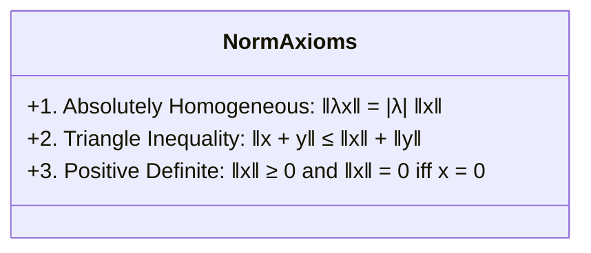
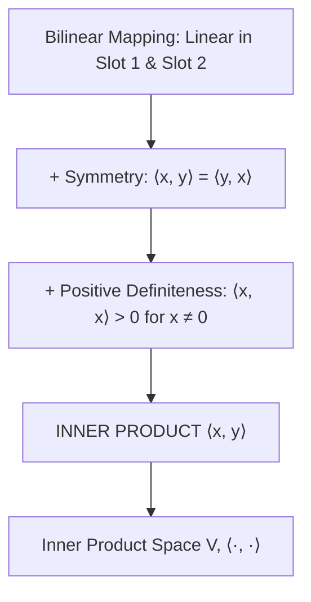
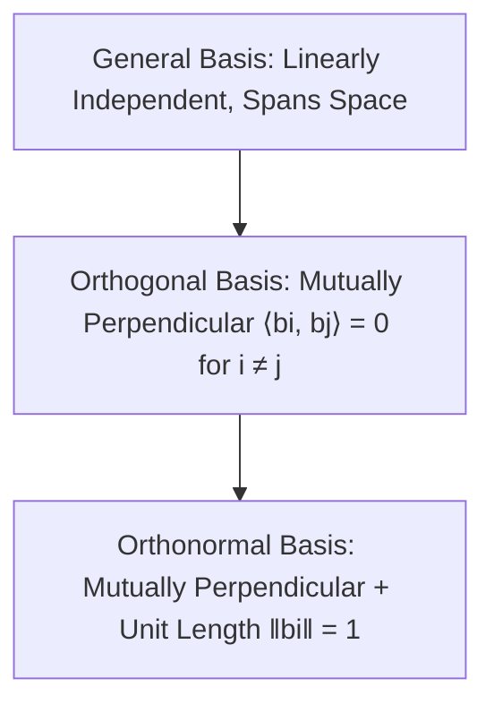
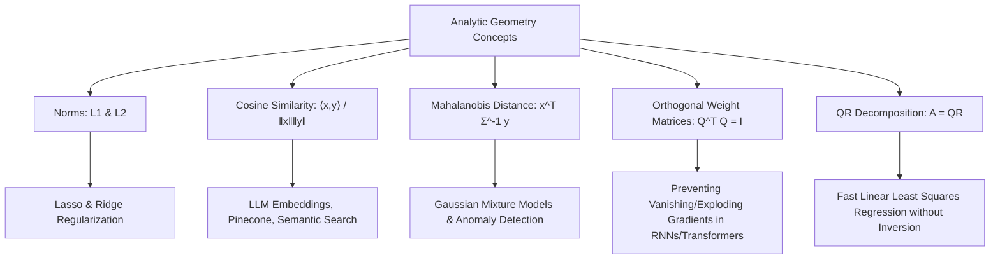

# Comprehensive Master Study Guide: Analytic Geometry, Norms, Inner Products, and Orthogonality
**Course:** Mathematical Foundations for Machine Learning & Data Science — Lecture 3  
**Target Audience:** Complete Beginners in Mathematics (Zero Knowledge Assumed $\to$ Path to Mastery)  
**Primary Reference:** Lecture 3 Presentation Slides (*BITS Pilani WILPD - CSIS / MFML & MFDS Team*)

---

## Welcome & Pedagogical Roadmap

In **Lecture 1**, we mastered the algebra of linear systems: matrices, row operations, and solving $A\mathbf{x} = \mathbf{b}$. That was the study of **computation and linear equations**.

In **Lecture 2**, we explored the algebraic universe in which vectors reside: **Vector Spaces**, linear independence, spans, and bases. That was the study of **structure and dimension**.

However, notice what was completely missing in Lecture 2:
* *How long is a vector?* (A vector space alone has no ruler!)
* *How far apart are two data points?* (A vector space has no tape measure!)
* *What is the angle between two feature directions?* (A vector space has no protractor!)

In **Lecture 3: Analytic Geometry**, we equip vector spaces with the geometric machinery needed to measure **lengths, distances, angles, and orthogonality**.

```mermaid
flowchart TD
    A[Vector Space V: Addition & Scalar Multiplication] --> B[Inner Product ⟨x, y⟩: Bilinear, Symmetric, Positive-Definite]
    B --> C[Induced Norm: ‖x‖ = √⟨x, x⟩: Measures Length / Size]
    C --> D[Induced Metric: d(x, y) = ‖x - y‖: Measures Distance]
    B & C --> E[Cauchy-Schwarz Inequality: |⟨x, y⟩| ≤ ‖x‖ ‖y‖]
    E --> F[Angle Definition: cos ω = ⟨x, y⟩ / ‖x‖ ‖y‖]
    F --> G{Is ⟨x, y⟩ = 0?}
    G -->|Yes: ω = 90°| H[Orthogonal Vectors: x ⊥ y]
    G -->|No| I[General Angle: Similarity / Correlation]
    H --> J[Orthonormal Basis: Mutually Orthogonal + Unit Length]
    J --> K[Orthogonal Matrices Q: Q^T Q = I: Length & Angle Preserving]
    A & B --> L[Matrix Representation of Inner Product: ⟨x, y⟩ = x^T A y where A is SPD]
    L & J --> M[Gram-Schmidt via Gaussian Elimination on [A^T A | A^T] -> [U | Q^T]]
```

### Why Analytic Geometry is the Core of Modern AI & Machine Learning
Every major machine learning architecture is fundamentally a machine for computing geometric relationships:
1. **Semantic Search & LLMs:** When you ask ChatGPT a question, words and sentences are converted into vectors (embeddings) in high-dimensional space ($\mathbb{R}^{4096}$). Finding relevant documents means calculating the **cosine of the angle** between vector embeddings.
2. **Support Vector Machines (SVMs):** Classifying data requires finding the decision boundary that maximizes the **geometric margin (perpendicular distance)** to the nearest data points.
3. **Regularization ($L_1$ and $L_2$ Norms):** Preventing machine learning models from overfitting requires penalizing the **length** of the weight vector (Lasso and Ridge regression).
4. **Principal Component Analysis (PCA):** Finding the most informative features requires projecting data onto **orthogonal axes** of maximum variance.
5. **Deep Neural Network Stability:** Keeping gradients from exploding or vanishing across hundreds of layers requires initializing weight matrices as **orthogonal matrices**.

---

### Mathematical Symbol Glossary
To ensure no notation ever confuses you, here is every symbol used in this guide:

| Symbol | Meaning | Example / Read As |
| :---: | :--- | :--- |
| $\|\mathbf{x}\|$ | Norm (length / magnitude) of vector $\mathbf{x}$ | $\|\mathbf{x}\| = 5 \to$ "The length of $\mathbf{x}$ is 5" |
| $\|\mathbf{x}\|_1$ | Manhattan ($L_1$) Norm | Sum of absolute values: $\|[3, -4]^T\|_1 = \|3\| + \|-4\| = 7$ |
| $\|\mathbf{x}\|_2$ | Euclidean ($L_2$) Norm | Straight-line distance: $\sqrt{3^2 + (-4)^2} = \sqrt{25} = 5$ |
| $\langle \mathbf{x}, \mathbf{y} \rangle$ | Inner product of $\mathbf{x}$ and $\mathbf{y}$ | Generalization of the dot product $\mathbf{x}^T \mathbf{y}$ |
| $\mathbf{x} \perp \mathbf{y}$ | Orthogonal (perpendicular) | $\langle \mathbf{x}, \mathbf{y} \rangle = 0 \to$ "$\mathbf{x}$ is perpendicular to $\mathbf{y}$" |
| $\omega$ | Greek letter *omega*: Angle between two vectors | $\cos(\omega) = \frac{\langle \mathbf{x}, \mathbf{y} \rangle}{\|\mathbf{x}\| \|\mathbf{y}\|}$ |
| $A \succ 0$ | Matrix $A$ is Symmetric Positive Definite (SPD) | $\mathbf{x}^T A \mathbf{x} > 0$ for all non-zero $\mathbf{x}$ |
| $\delta_{ij}$ | Kronecker delta symbol | $\delta_{ij} = 1$ if $i = j$; $\delta_{ij} = 0$ if $i \ne j$ |
| $d(\mathbf{x}, \mathbf{y})$ | Metric / Distance function | Distance between points $\mathbf{x}$ and $\mathbf{y}$ |
| $\mathbf{e}_i$ | $i$-th canonical standard basis vector | $[0, \dots, 0, 1, 0, \dots, 0]^T$ with 1 at position $i$ |
| $I$ or $I_n$ | Identity matrix of size $n \times n$ | Ones on main diagonal, zeros everywhere else |
| $A^T$ | Transpose of matrix $A$ | Swapping rows and columns of $A$ |
| $A^{-1}$ | Inverse of matrix $A$ | Matrix satisfying $A^{-1} A = A A^{-1} = I$ |
| $\forall$ | Universal quantifier: "For all" / "For every" | $\forall \mathbf{x} \in V \to$ "For every vector $\mathbf{x}$ in $V$" |
| $\in$ | Membership: "Belongs to" / "Is an element of" | $\lambda \in \mathbb{R} \to$ "$\lambda$ is a real number" |

---

## Part I: Norms — The Universal Measuring Stick

### 1.1 The Intuitive Need: Why Vector Spaces Need Length
In Lecture 2, we learned that a vector is simply an object that can be added and scaled. But think about this:
If vector $\mathbf{v}_1 = \begin{bmatrix} 3 \\ 4 \end{bmatrix}$ represents a velocity or a physical displacement, how fast are you moving? How far did you walk?
Without a ruler, we cannot say! A **norm** is that ruler: it takes any vector and assigns to it a single non-negative real number representing its **length** (or magnitude).


---

### 1.2 Formal Definition and the 3 Axioms of a Norm
Let $V$ be a real vector space. A **norm** on $V$ is a function:
$$\|\cdot\|: V \to \mathbb{R}, \quad \mathbf{x} \mapsto \|\mathbf{x}\|$$
which assigns to each vector $\mathbf{x} \in V$ a real number $\|\mathbf{x}\|$ such that for all scalars $\lambda \in \mathbb{R}$ and all vectors $\mathbf{x}, \mathbf{y} \in V$, the following **three fundamental axioms** are satisfied:



#### Axiom 1: Absolute Homogeneity (Scalability)
$$\|\lambda \mathbf{x}\| = |\lambda| \|\mathbf{x}\| \quad \forall \lambda \in \mathbb{R}, \; \forall \mathbf{x} \in V$$
* **Intuition:** If you double a vector ($\lambda = 2$), its length must double: $\|2\mathbf{x}\| = 2\|\mathbf{x}\|$. If you reverse its direction and triple it ($\lambda = -3$), its length must still be positive three times the original length:
  $$\|-3\mathbf{x}\| = |-3| \|\mathbf{x}\| = 3\|\mathbf{x}\|$$
  Lengths can **never** be negative! That is why the absolute value $|\lambda|$ is required.

#### Axiom 2: Triangle Inequality (Subadditivity)
$$\|\mathbf{x} + \mathbf{y}\| \le \|\mathbf{x}\| + \|\mathbf{y}\| \quad \forall \mathbf{x}, \mathbf{y} \in V$$
* **Intuition:** In any triangle, the straight-line path from point $A$ to point $C$ ($\|\mathbf{x} + \mathbf{y}\|$) cannot be longer than walking from $A$ to $B$ ($\|\mathbf{x}\|$) and then from $B$ to $C$ ($\|\mathbf{y}\|$). Taking a detour never shortens the trip!
* Equality holds ($\|\mathbf{x} + \mathbf{y}\| = \|\mathbf{x}\| + \|\mathbf{y}\|$) if and only if $\mathbf{x}$ and $\mathbf{y}$ point in the exact same direction ($\mathbf{y} = c\mathbf{x}$ for $c \ge 0$).

#### Axiom 3: Positive Definiteness
$$\|\mathbf{x}\| \ge 0 \quad \text{and} \quad \|\mathbf{x}\| = 0 \iff \mathbf{x} = \mathbf{0}$$
* **Intuition:**
  1. Every physical length is non-negative: you cannot have a rod of length $-5\text{ cm}$.
  2. The only vector that has zero length is the point that goes nowhere: the zero vector $\mathbf{0}$. If a vector has even the slightest component in any direction, its length must be strictly positive.

---

### 1.3 Concrete Examples of Norms

#### Example A: The Manhattan Norm ($L_1$ Norm)
The **Manhattan norm** (also called the Taxicab norm or $L_1$ norm) is defined by summing the absolute values of the individual coordinates:
$$\|\mathbf{x}\|_1 = \sum_{i=1}^n |x_i| = |x_1| + |x_2| + \dots + |x_n|$$

* **Real-World Analogy:** Imagine you are a taxi driver in Manhattan, New York. The streets are arranged in a strict grid of avenues and streets. You cannot drive diagonally through buildings; you can only travel horizontally and vertically. The total distance traveled between origin $(0,0)$ and destination $(x_1, x_2)$ is $|x_1| + |x_2|$.

* **Step-by-Step Calculation:**
  Let $\mathbf{x} = \begin{bmatrix} 3 \\ -4 \end{bmatrix} \in \mathbb{R}^2$.
  $$\|\mathbf{x}\|_1 = |3| + |-4| = 3 + 4 = 7$$

* **Machine Learning Significance ($L_1$ Regularization / Lasso):**
  In machine learning regression models, adding an $L_1$ penalty on model weights ($\lambda \sum |w_i|$) forces less important feature weights to become **exactly zero**. It acts as an automatic feature selection mechanism, creating **sparse models**.

---

#### Example B: The Euclidean Norm ($L_2$ Norm)
The **Euclidean norm** (standard straight-line length or $L_2$ norm) is the square root of the sum of squared coordinates:
$$\|\mathbf{x}\|_2 = \sqrt{\sum_{i=1}^n x_i^2} = \sqrt{x_1^2 + x_2^2 + \dots + x_n^2}$$

* **Real-World Analogy:** The straight-line distance "as the crow flies". If a drone flies directly from $(0,0)$ to $(x_1, x_2)$, its path length is given by the classic Pythagorean theorem $c = \sqrt{a^2 + b^2}$.

* **Step-by-Step Calculation:**
  Let $\mathbf{x} = \begin{bmatrix} 3 \\ -4 \end{bmatrix} \in \mathbb{R}^2$.
  $$\|\mathbf{x}\|_2 = \sqrt{(3)^2 + (-4)^2} = \sqrt{9 + 16} = \sqrt{25} = 5$$
  Notice that $\|\mathbf{x}\|_2 = 5 \le \|\mathbf{x}\|_1 = 7$. The straight-line path is always shorter than or equal to the grid path!

* **Machine Learning Significance ($L_2$ Regularization / Ridge / Weight Decay):**
  In deep learning and regression, adding an $L_2$ penalty ($\frac{\lambda}{2} \sum w_i^2$) prevents weights from growing excessively large, ensuring smooth decision boundaries and preventing overfitting.

---

#### Example C: General $p$-Norms and the Max Norm ($L_\infty$)
For any real number $p \ge 1$, the general **$L_p$ norm** is defined as:
$$\|\mathbf{x}\|_p = \left( \sum_{i=1}^n |x_i|^p \right)^{1/p}$$

As $p \to \infty$, the largest component completely dominates the sum. This leads to the **Maximum Norm ($L_\infty$ Norm)**:
$$\|\mathbf{x}\|_\infty = \max_{1 \le i \le n} |x_i|$$

* **Calculation:**
  For $\mathbf{x} = \begin{bmatrix} 3 \\ -4 \end{bmatrix}$:
  $$\|\mathbf{x}\|_\infty = \max(|3|, |-4|) = 4$$

#### Visualizing the "Unit Ball" ($\{\mathbf{x} \in \mathbb{R}^2 : \|\mathbf{x}\| = 1\}$)
How do unit circles look under different norms?
* **$L_1$ Norm:** A rotated square (diamond) with vertices at $(1,0), (0,1), (-1,0), (0,-1)$. The sharp corners on the axes explain geometrically why Lasso drives weights to exactly zero!
* **$L_2$ Norm:** A perfect, smooth geometric circle of radius 1.
* **$L_\infty$ Norm:** An axis-aligned square with corners at $(1,1), (-1,1), (-1,-1), (1,-1)$.

```
      L_1 (Diamond)               L_2 (Circle)             L_∞ (Square)
          (0,1)                       (0,1)                 (-1,1)     (1,1)
            /\                         __                     +-------+
           /  \                      /    \                   |       |
 (-1,0)   /    \  (1,0)    (-1,0)   |      |   (1,0)          |   •   |
          \    /                     \    /                   |       |
           \  /                        --                     +-------+
            \/                        (0,-1)               (-1,-1)    (1,-1)
          (0,-1)
```

---

## Part II: Inner Products — The Geometry Engine

### 2.1 The Standard Dot Product in $\mathbb{R}^n$
The simplest and most familiar inner product is the standard **dot product** on $\mathbb{R}^n$.
For two vectors $\mathbf{x}, \mathbf{y} \in \mathbb{R}^n$:
$$\mathbf{x}^T \mathbf{y} = \sum_{i=1}^n x_i y_i = x_1 y_1 + x_2 y_2 + \dots + x_n y_n$$

* **Step-by-Step Numerical Example:**
  Let $\mathbf{x} = \begin{bmatrix} 2 \\ 3 \end{bmatrix}$ and $\mathbf{y} = \begin{bmatrix} 4 \\ -1 \end{bmatrix}$.
  $$\mathbf{x}^T \mathbf{y} = (2)(4) + (3)(-1) = 8 - 3 = 5$$

The dot product is remarkably powerful, but in modern mathematics and data science, we need a general mathematical concept that works for *any* vector space (including spaces of functions, matrices, and transformed features). This generalized concept is the **Inner Product**.

---

### 2.2 Bilinear Mappings: The Foundational Definition
To understand an inner product, we first define a **bilinear mapping**.

> **Definition (Bilinear Mapping):**  
> Let $V$ be a real vector space. A mapping $\Omega: V \times V \to \mathbb{R}$ is called **bilinear** if it is linear in both of its arguments independently.

What does "linear in both arguments" mean? It means if you hold one vector constant, the function behaves as a standard linear transformation on the other vector:

1. **Linear in the First Argument:**  
   For all vectors $\mathbf{x}, \mathbf{y}, \mathbf{z} \in V$ and all scalars $\lambda, \psi \in \mathbb{R}$:
   $$\Omega(\lambda \mathbf{x} + \psi \mathbf{y}, \mathbf{z}) = \lambda \Omega(\mathbf{x}, \mathbf{z}) + \psi \Omega(\mathbf{y}, \mathbf{z})$$

2. **Linear in the Second Argument:**  
   For all vectors $\mathbf{x}, \mathbf{y}, \mathbf{z} \in V$ and all scalars $\lambda, \psi \in \mathbb{R}$:
   $$\Omega(\mathbf{x}, \lambda \mathbf{y} + \psi \mathbf{z}) = \lambda \Omega(\mathbf{x}, \mathbf{y}) + \psi \Omega(\mathbf{x}, \mathbf{z})$$

* **Analogy with Ordinary Multiplication:**  
  Think of regular multiplication of real numbers $f(x, y) = x \cdot y$.
  $(2a + 3b) \cdot c = 2(a \cdot c) + 3(b \cdot c)$, and $a \cdot (2b + 3c) = 2(a \cdot b) + 3(a \cdot c)$.
  Multiplication distributes linearly across addition in both inputs. A bilinear mapping is simply the vector-space version of this property!

---

### 2.3 Symmetric and Positive-Definite Bilinear Mappings
A bilinear mapping $\Omega$ can have special properties:

* **Symmetry:**  
  $\Omega$ is **symmetric** if swapping the order of inputs does not change the result:
  $$\Omega(\mathbf{x}, \mathbf{y}) = \Omega(\mathbf{y}, \mathbf{x}) \quad \forall \mathbf{x}, \mathbf{y} \in V$$

* **Positive Definiteness:**  
  $\Omega$ is **positive-definite** if pairing any non-zero vector with itself always produces a strictly positive real number:
  $$\forall \mathbf{x} \in V \setminus \{\mathbf{0}\}, \quad \Omega(\mathbf{x}, \mathbf{x}) > 0$$
  $$\text{and} \quad \Omega(\mathbf{0}, \mathbf{0}) = 0$$

---

### 2.4 Formal Definition of an Inner Product
Now we can state the master definition:

> **Definition (Inner Product & Inner Product Space):**  
> A **positive-definite, symmetric bilinear mapping** $\Omega: V \times V \to \mathbb{R}$ is called an **inner product**.  
> We denote the inner product of vectors $\mathbf{x}$ and $\mathbf{y}$ as:
> $$\langle \mathbf{x}, \mathbf{y} \rangle$$
> The pair $(V, \langle \cdot, \cdot \rangle)$ is called an **inner product space** (or a Euclidean vector space when $V = \mathbb{R}^n$).



---

## Part III: Symmetric, Positive-Definite (SPD) Matrices

How do we compute inner products computationally on a computer?
In Lecture 2, we proved that every vector in a finite-dimensional space can be represented as a coordinate column vector with respect to a basis. It turns out that **every valid inner product corresponds uniquely to a matrix**!

### 3.1 Representing an Inner Product with a Matrix
Let $V$ be an $n$-dimensional real vector space with an ordered basis $B = (\mathbf{b}_1, \mathbf{b}_2, \dots, \mathbf{b}_n)$.
Any two vectors $\mathbf{x}, \mathbf{y} \in V$ can be uniquely written as linear combinations of these basis vectors:
$$\mathbf{x} = \sum_{i=1}^n \hat{x}_i \mathbf{b}_i = \hat{x}_1 \mathbf{b}_1 + \dots + \hat{x}_n \mathbf{b}_n$$
$$\mathbf{y} = \sum_{j=1}^n \hat{y}_j \mathbf{b}_j = \hat{y}_1 \mathbf{b}_1 + \dots + \hat{y}_n \mathbf{b}_n$$
where $\hat{\mathbf{x}} = [\hat{x}_1, \dots, \hat{x}_n]^T \in \mathbb{R}^n$ and $\hat{\mathbf{y}} = [\hat{y}_1, \dots, \hat{y}_n]^T \in \mathbb{R}^n$ are the coordinate vectors.

Now, compute the inner product $\langle \mathbf{x}, \mathbf{y} \rangle$ by substituting these expansions:
$$\langle \mathbf{x}, \mathbf{y} \rangle = \left\langle \sum_{i=1}^n \hat{x}_i \mathbf{b}_i, \; \sum_{j=1}^n \hat{y}_j \mathbf{b}_j \right\rangle$$

Using the bilinearity of $\langle \cdot, \cdot \rangle$, we can pull out the scalar coefficients and summations:
$$\langle \mathbf{x}, \mathbf{y} \rangle = \sum_{i=1}^n \hat{x}_i \left\langle \mathbf{b}_i, \; \sum_{j=1}^n \hat{y}_j \mathbf{b}_j \right\rangle = \sum_{i=1}^n \sum_{j=1}^n \hat{x}_i \hat{y}_j \langle \mathbf{b}_i, \mathbf{b}_j \rangle$$

Notice what $\langle \mathbf{b}_i, \mathbf{b}_j \rangle$ is: it is a single real number representing the inner product between the $i$-th and $j$-th basis vectors!
Let us collect all these numbers into an $n \times n$ matrix $A$, where the entry in row $i$ and column $j$ is:
$$A_{ij} = \langle \mathbf{b}_i, \mathbf{b}_j \rangle$$

Then the double summation can be written compactly in matrix notation:
$$\langle \mathbf{x}, \mathbf{y} \rangle = \sum_{i=1}^n \hat{x}_i \left( \sum_{j=1}^n A_{ij} \hat{y}_j \right) = \hat{\mathbf{x}}^T A \hat{\mathbf{y}}$$

---

### 3.2 The Fundamental Theorem of Inner Products and SPD Matrices

> **Theorem (Slide 7):**  
> For a real-valued, finite-dimensional vector space $V$ and an ordered basis $B$ of $V$, it holds that $\langle \cdot, \cdot \rangle: V \times V \to \mathbb{R}$ is an inner product **if and only if** there exists a **symmetric, positive-definite matrix** $A \in \mathbb{R}^{n \times n}$ such that:
> $$\langle \mathbf{x}, \mathbf{y} \rangle = \hat{\mathbf{x}}^T A \hat{\mathbf{y}}$$

#### Why must $A$ be Symmetric?
Because the inner product is symmetric:
$$A_{ij} = \langle \mathbf{b}_i, \mathbf{b}_j \rangle = \langle \mathbf{b}_j, \mathbf{b}_i \rangle = A_{ji}$$
Since $A_{ij} = A_{ji}$ for all $i, j$, we have $A = A^T$!

#### Why must $A$ be Positive Definite?
Because for any non-zero vector $\mathbf{x} \ne \mathbf{0}$, its coordinate vector $\hat{\mathbf{x}} \ne \mathbf{0}$. The positive definiteness axiom requires:
$$\langle \mathbf{x}, \mathbf{x} \rangle = \hat{\mathbf{x}}^T A \hat{\mathbf{x}} > 0 \quad \forall \hat{\mathbf{x}} \ne \mathbf{0}$$
A matrix that satisfies $\mathbf{x}^T A \mathbf{x} > 0$ for all $\mathbf{x} \ne \mathbf{0}$ is by definition **positive definite** (written $A \succ 0$).

---

### 3.3 Two Crucial Questions on SPD Matrices (Slide 8)

The lecture poses two fundamental questions that every student must understand:

#### Question 1: Can a symmetric, positive-definite matrix have less than full rank?
* **Answer:** **NO! It must always have full rank $n$ (and thus be invertible).**
* **Meticulous Step-by-Step Proof:**
  1. Recall the definition of the **nullspace** (kernel) of $A$:
     $$\text{null}(A) = \{\mathbf{x} \in \mathbb{R}^n : A\mathbf{x} = \mathbf{0}\}$$
  2. Suppose, for the sake of contradiction, that $A$ has less than full rank ($\text{rank}(A) < n$).
  3. By the Fundamental Rank-Nullity Theorem, $\dim(\text{null}(A)) = n - \text{rank}(A) > 0$.
  4. This means there exists at least one **non-zero** vector $\mathbf{v} \ne \mathbf{0}$ in the nullspace, such that $A\mathbf{v} = \mathbf{0}$.
  5. Now, pre-multiply both sides of $A\mathbf{v} = \mathbf{0}$ by $\mathbf{v}^T$:
     $$\mathbf{v}^T A \mathbf{v} = \mathbf{v}^T \mathbf{0} = 0$$
  6. But look at what we just wrote! Positive definiteness states that for **any** non-zero vector $\mathbf{v} \ne \mathbf{0}$, $\mathbf{v}^T A \mathbf{v}$ **must be strictly greater than zero** ($\mathbf{v}^T A \mathbf{v} > 0$).
  7. We have reached a direct contradiction: $0 > 0$ is impossible!
  8. Therefore, no non-zero vector can exist in the nullspace. $\text{null}(A) = \{\mathbf{0}\}$.
  9. The dimension of the nullspace is 0. Hence:
     $$\text{rank}(A) = n - 0 = n$$
     $A$ has full rank, is non-singular, has an inverse $A^{-1}$, and its determinant is strictly positive ($\det(A) > 0$). $\blacksquare$

---

#### Question 2: What can be said about the diagonal elements of a positive-definite matrix?
* **Answer:** **Every diagonal element must be strictly positive ($A_{ii} > 0$).**
* **Meticulous Step-by-Step Proof:**
  1. Let $\mathbf{e}_i = \begin{bmatrix} 0 \\ \vdots \\ 1 \\ \vdots \\ 0 \end{bmatrix} \in \mathbb{R}^n$ be the $i$-th standard canonical basis vector (having a 1 in position $i$, and 0 everywhere else).
  2. Since $\mathbf{e}_i \ne \mathbf{0}$, the positive definiteness condition **must** hold for $\mathbf{e}_i$:
     $$\mathbf{e}_i^T A \mathbf{e}_i > 0$$
  3. Let us calculate the matrix-vector product $A \mathbf{e}_i$:
     Multiplying $A$ by $\mathbf{e}_i$ extracts the $i$-th column of $A$:
     $$A \mathbf{e}_i = \begin{bmatrix} A_{1i} \\ A_{2i} \\ \vdots \\ A_{ni} \end{bmatrix}$$
  4. Now pre-multiply this column vector by $\mathbf{e}_i^T$:
     $$\mathbf{e}_i^T (A \mathbf{e}_i) = \begin{bmatrix} 0 & \dots & 1 & \dots & 0 \end{bmatrix} \begin{bmatrix} A_{1i} \\ \vdots \\ A_{ii} \\ \vdots \\ A_{ni} \end{bmatrix} = A_{ii}$$
  5. Therefore:
     $$\mathbf{e}_i^T A \mathbf{e}_i = A_{ii} > 0 \quad \forall i \in \{1, 2, \dots, n\}$$
  6. **Conclusion:** Every single diagonal entry $A_{11}, A_{22}, \dots, A_{nn}$ of a positive-definite matrix is strictly positive! If you ever see a matrix with a zero or negative number on its diagonal, you immediately know it **cannot** be positive definite. $\blacksquare$

---

## Part IV: Lengths, Distances, and the Cauchy-Schwarz Inequality

### 4.1 The Induced Norm
Every inner product naturally gives birth to a norm. We say that the inner product **induces** a norm:

> **Definition (Induced Norm):**  
> In an inner product space $(V, \langle \cdot, \cdot \rangle)$, the **induced norm** of a vector $\mathbf{x}$ is defined as:
> $$\|\mathbf{x}\| = \sqrt{\langle \mathbf{x}, \mathbf{x} \rangle}$$

* When $\langle \mathbf{x}, \mathbf{y} \rangle = \mathbf{x}^T \mathbf{y}$ is the standard dot product, the induced norm is the familiar Euclidean norm:
  $$\|\mathbf{x}\| = \sqrt{\mathbf{x}^T \mathbf{x}} = \sqrt{x_1^2 + \dots + x_n^2} = \|\mathbf{x}\|_2$$
* When $\langle \mathbf{x}, \mathbf{y} \rangle = \mathbf{x}^T A \mathbf{y}$ with an SPD matrix $A$, the induced norm is:
  $$\|\mathbf{x}\|_A = \sqrt{\mathbf{x}^T A \mathbf{x}}$$

---

### 4.2 Not Every Norm Comes from an Inner Product! (The Parallelogram Law)
A critical insight stated on Slide 9 is:
> *"Not every norm is induced by an inner product, for example the Manhattan norm."*

Why is this true? How do mathematicians test if a norm can come from an inner product?
The answer is the famous **Parallelogram Law**.

#### The Parallelogram Law Theorem:
In any inner product space, the sum of the squares of the diagonals of a parallelogram equals the sum of the squares of the four sides:
$$\|\mathbf{x} + \mathbf{y}\|^2 + \|\mathbf{x} - \mathbf{y}\|^2 = 2\|\mathbf{x}\|^2 + 2\|\mathbf{y}\|^2$$

```
              x + y (Diagonal 1)
         +-------------------+
        /                   /
    y  /                   /  y
      /                   /
     +-------------------+
               x
              x - y (Diagonal 2)
```

#### Algebraic Proof that Induced Norms Obey the Law:
$$\|\mathbf{x} + \mathbf{y}\|^2 = \langle \mathbf{x} + \mathbf{y}, \mathbf{x} + \mathbf{y} \rangle = \langle \mathbf{x}, \mathbf{x} \rangle + 2\langle \mathbf{x}, \mathbf{y} \rangle + \langle \mathbf{y}, \mathbf{y} \rangle = \|\mathbf{x}\|^2 + 2\langle \mathbf{x}, \mathbf{y} \rangle + \|\mathbf{y}\|^2$$
$$\|\mathbf{x} - \mathbf{y}\|^2 = \langle \mathbf{x} - \mathbf{y}, \mathbf{x} - \mathbf{y} \rangle = \langle \mathbf{x}, \mathbf{x} \rangle - 2\langle \mathbf{x}, \mathbf{y} \rangle + \langle \mathbf{y}, \mathbf{y} \rangle = \|\mathbf{x}\|^2 - 2\langle \mathbf{x}, \mathbf{y} \rangle + \|\mathbf{y}\|^2$$
Adding the two equations:
$$\|\mathbf{x} + \mathbf{y}\|^2 + \|\mathbf{x} - \mathbf{y}\|^2 = 2\|\mathbf{x}\|^2 + 2\|\mathbf{y}\|^2$$
The cross-term $2\langle \mathbf{x}, \mathbf{y} \rangle$ cancels out completely!

#### Why the Manhattan Norm Fails the Parallelogram Law:
Let us test the Manhattan norm $\|\cdot\|_1$ with two simple vectors in $\mathbb{R}^2$:
$$\mathbf{x} = \begin{bmatrix} 1 \\ 0 \end{bmatrix}, \quad \mathbf{y} = \begin{bmatrix} 0 \\ 1 \end{bmatrix}$$

1. Compute individual norms:
   $$\|\mathbf{x}\|_1 = |1| + |0| = 1 \implies 2\|\mathbf{x}\|_1^2 = 2(1)^2 = 2$$
   $$\|\mathbf{y}\|_1 = |0| + |1| = 1 \implies 2\|\mathbf{y}\|_1^2 = 2(1)^2 = 2$$
   $$\text{Right Hand Side} = 2 + 2 = 4$$

2. Compute sum and difference:
   $$\mathbf{x} + \mathbf{y} = \begin{bmatrix} 1 \\ 1 \end{bmatrix} \implies \|\mathbf{x} + \mathbf{y}\|_1 = |1| + |1| = 2 \implies \|\mathbf{x} + \mathbf{y}\|_1^2 = 2^2 = 4$$
   $$\mathbf{x} - \mathbf{y} = \begin{bmatrix} 1 \\ -1 \end{bmatrix} \implies \|\mathbf{x} - \mathbf{y}\|_1 = |1| + |-1| = 2 \implies \|\mathbf{x} - \mathbf{y}\|_1^2 = 2^2 = 4$$
   $$\text{Left Hand Side} = \|\mathbf{x} + \mathbf{y}\|_1^2 + \|\mathbf{x} - \mathbf{y}\|_1^2 = 4 + 4 = 8$$

3. Compare LHS and RHS:
   $$\text{LHS} = 8 \ne 4 = \text{RHS}$$
   The Parallelogram Law **fails** ($8 \ne 4$).
   **Conclusion:** There is NO inner product on Earth that can induce the Manhattan norm!

---

### 4.3 The Cauchy-Schwarz Inequality and Its Complete Proof (Slide 10)

The **Cauchy-Schwarz Inequality** is widely regarded as one of the most important inequalities in all of mathematics:

> **Theorem (Cauchy-Schwarz Inequality):**  
> Let $(V, \langle \cdot, \cdot \rangle)$ be an inner product space. For all vectors $\mathbf{u}, \mathbf{v} \in V$:
> $$|\langle \mathbf{u}, \mathbf{v} \rangle| \le \|\mathbf{u}\| \|\mathbf{v}\|$$
> with equality holding if and only if $\mathbf{u}$ and $\mathbf{v}$ are linearly dependent (i.e., one is a scalar multiple of the other).

#### Meticulous Step-by-Step Proof:
Slide 10 presents an elegant algebraic derivation. Here is every intermediate step fully explained:

* **Step 1: Set up a non-negative length expression.**  
  Let $\mathbf{u}, \mathbf{v} \in V$. If $\mathbf{v} = \mathbf{0}$, then $\langle \mathbf{u}, \mathbf{0} \rangle = 0$ and $\|\mathbf{v}\| = 0$, so $0 \le 0$ holds trivially.  
  Now assume $\mathbf{v} \ne \mathbf{0}$.  
  For any arbitrary real number $\alpha \in \mathbb{R}$, consider the vector $\mathbf{w} = \mathbf{u} - \alpha \mathbf{v}$.  
  By the positive definiteness axiom of norms, the squared length of $\mathbf{w}$ can **never** be negative:
  $$\|\mathbf{u} - \alpha \mathbf{v}\|^2 \ge 0$$

* **Step 2: Expand using the inner product.**  
  Using the definition of the induced norm:
  $$\|\mathbf{u} - \alpha \mathbf{v}\|^2 = \langle \mathbf{u} - \alpha \mathbf{v}, \; \mathbf{u} - \alpha \mathbf{v} \rangle$$
  Expanding by bilinearity:
  $$\langle \mathbf{u} - \alpha \mathbf{v}, \; \mathbf{u} - \alpha \mathbf{v} \rangle = \langle \mathbf{u}, \mathbf{u} \rangle - \alpha \langle \mathbf{u}, \mathbf{v} \rangle - \alpha \langle \mathbf{v}, \mathbf{u} \rangle + \alpha^2 \langle \mathbf{v}, \mathbf{v} \rangle$$
  Since the inner product is symmetric ($\langle \mathbf{v}, \mathbf{u} \rangle = \langle \mathbf{u}, \mathbf{v} \rangle$):
  $$\langle \mathbf{u}, \mathbf{u} \rangle - 2\alpha \langle \mathbf{u}, \mathbf{v} \rangle + \alpha^2 \langle \mathbf{v}, \mathbf{v} \rangle \ge 0$$

* **Step 3: Recognize the quadratic structure.**  
  Treat this expression as a quadratic function of $\alpha$:
  $$f(\alpha) = a \alpha^2 + b \alpha + c \ge 0$$
  where:
  * $a = \langle \mathbf{v}, \mathbf{v} \rangle = \|\mathbf{v}\|^2 > 0$
  * $b = -2\langle \mathbf{u}, \mathbf{v} \rangle$
  * $c = \langle \mathbf{u}, \mathbf{u} \rangle = \|\mathbf{u}\|^2$

* **Step 4: Choose the optimal value of $\alpha$.**  
  A quadratic parabola with $a > 0$ opens upwards. Its minimum occurs at the vertex where the derivative is zero:
  $$f'(\alpha) = 2a\alpha + b = 2\alpha \langle \mathbf{v}, \mathbf{v} \rangle - 2\langle \mathbf{u}, \mathbf{v} \rangle = 0$$
  Solving for $\alpha$:
  $$\alpha^* = \frac{\langle \mathbf{u}, \mathbf{v} \rangle}{\langle \mathbf{v}, \mathbf{v} \rangle}$$
  (In standard dot product notation, this is $\alpha = \frac{\mathbf{u}^T \mathbf{v}}{\mathbf{v}^T \mathbf{v}}$, which you may recognize as the scalar projection of $\mathbf{u}$ onto $\mathbf{v}$!)

* **Step 5: Substitute $\alpha^*$ back into the inequality.**  
  $$\langle \mathbf{u}, \mathbf{u} \rangle - 2\left( \frac{\langle \mathbf{u}, \mathbf{v} \rangle}{\langle \mathbf{v}, \mathbf{v} \rangle} \right) \langle \mathbf{u}, \mathbf{v} \rangle + \left( \frac{\langle \mathbf{u}, \mathbf{v} \rangle}{\langle \mathbf{v}, \mathbf{v} \rangle} \right)^2 \langle \mathbf{v}, \mathbf{v} \rangle \ge 0$$
  Simplify the terms:
  $$\langle \mathbf{u}, \mathbf{u} \rangle - \frac{2(\langle \mathbf{u}, \mathbf{v} \rangle)^2}{\langle \mathbf{v}, \mathbf{v} \rangle} + \frac{(\langle \mathbf{u}, \mathbf{v} \rangle)^2}{\langle \mathbf{v}, \mathbf{v} \rangle} \ge 0$$
  Combine the two fractions:
  $$\langle \mathbf{u}, \mathbf{u} \rangle - \frac{(\langle \mathbf{u}, \mathbf{v} \rangle)^2}{\langle \mathbf{v}, \mathbf{v} \rangle} \ge 0$$

* **Step 6: Clear the denominator.**  
  Since $\mathbf{v} \ne \mathbf{0}$, $\langle \mathbf{v}, \mathbf{v} \rangle > 0$. Multiplying both sides by $\langle \mathbf{v}, \mathbf{v} \rangle$ preserves the direction of the inequality:
  $$\langle \mathbf{u}, \mathbf{u} \rangle \langle \mathbf{v}, \mathbf{v} \rangle - (\langle \mathbf{u}, \mathbf{v} \rangle)^2 \ge 0$$
  Rearranging:
  $$(\langle \mathbf{u}, \mathbf{v} \rangle)^2 \le \langle \mathbf{u}, \mathbf{u} \rangle \langle \mathbf{v}, \mathbf{v} \rangle$$

* **Step 7: Take the square root of both sides.**  
  $$\sqrt{(\langle \mathbf{u}, \mathbf{v} \rangle)^2} \le \sqrt{\langle \mathbf{u}, \mathbf{u} \rangle} \sqrt{\langle \mathbf{v}, \mathbf{v} \rangle}$$
  $$|\langle \mathbf{u}, \mathbf{v} \rangle| \le \|\mathbf{u}\| \|\mathbf{v}\| \quad \blacksquare$$

---

### 4.4 Metric Spaces and Distances (Slides 11–12)

Now that we have a norm, we can measure the **distance** between any two vectors $\mathbf{x}$ and $\mathbf{y}$.

> **Definition (Metric Space & Induced Distance):**  
> Consider an inner product space $(V, \langle \cdot, \cdot \rangle)$. The **distance** between two vectors $\mathbf{x}$ and $\mathbf{y}$ is defined as:
> $$d(\mathbf{x}, \mathbf{y}) = \|\mathbf{x} - \mathbf{y}\| = \sqrt{\langle \mathbf{x} - \mathbf{y}, \; \mathbf{x} - \mathbf{y} \rangle}$$
> The function $d: V \times V \to \mathbb{R}$ is called a **metric**, and the pair $(V, d)$ is called a **metric space**.

#### The 3 Axioms of a Metric Space:
For all vectors $\mathbf{x}, \mathbf{y}, \mathbf{z} \in V$:
1. **Positive Definiteness:**  
   $$d(\mathbf{x}, \mathbf{y}) \ge 0, \quad \text{and} \quad d(\mathbf{x}, \mathbf{y}) = 0 \iff \mathbf{x} = \mathbf{y}$$
   (Distance cannot be negative; distance is zero if and only if points coincide).
2. **Symmetry:**  
   $$d(\mathbf{x}, \mathbf{y}) = d(\mathbf{y}, \mathbf{x})$$
   (The distance from New York to London equals the distance from London to New York).
3. **Triangle Inequality:**  
   $$d(\mathbf{x}, \mathbf{z}) \le d(\mathbf{x}, \mathbf{y}) + d(\mathbf{y}, \mathbf{z})$$
   (Stopping at an intermediate waypoint $\mathbf{y}$ can never shorten the total journey).

#### Inner Product vs. Distance Metric: The Fundamental Duality (Slide 12)
Notice the profound conceptual contrast pointed out on Slide 12:

| Aspect | Inner Product $\langle \mathbf{x}, \mathbf{y} \rangle$ | Distance Metric $d(\mathbf{x}, \mathbf{y})$ |
| :--- | :--- | :--- |
| **What it captures** | Directional alignment & similarity | Separation & difference |
| **When vectors are CLOSE** | Value is **LARGE** | Value is **SMALL** ($d \to 0$) |
| **When vectors are FAR APART** | Value is **SMALL** (or negative) | Value is **LARGE** ($d \to \infty$) |
| **Zero meaning** | Orthogonal / Completely uncorrelated ($90^\circ$) | Identical points ($\mathbf{x} = \mathbf{y}$) |

---

## Part V: Angles and Orthogonality

### 5.1 Defining Angles via Cauchy-Schwarz (Slides 13–14)
How can we define an "angle" in an abstract $n$-dimensional space where we cannot physically hold a protractor?
The Cauchy-Schwarz inequality provides the answer!
For any two non-zero vectors $\mathbf{x}, \mathbf{y} \ne \mathbf{0}$:
$$|\langle \mathbf{x}, \mathbf{y} \rangle| \le \|\mathbf{x}\| \|\mathbf{y}\|$$

Divide both sides by the strictly positive product $\|\mathbf{x}\| \|\mathbf{y}\|$:
$$\frac{|\langle \mathbf{x}, \mathbf{y} \rangle|}{\|\mathbf{x}\| \|\mathbf{y}\|} \le 1 \implies -1 \le \frac{\langle \mathbf{x}, \mathbf{y} \rangle}{\|\mathbf{x}\| \|\mathbf{y}\|} \le 1$$

Because this ratio is guaranteed to always lie between $-1$ and $+1$, and because the cosine function $\cos(\omega)$ is a continuous, strictly decreasing bijection from $[0, \pi]$ onto $[-1, 1]$, there exists a **unique angle** $\omega \in [0, \pi]$ such that:

$$\cos(\omega) = \frac{\langle \mathbf{x}, \mathbf{y} \rangle}{\|\mathbf{x}\| \|\mathbf{y}\|}$$

```mermaid
graph LR
    CS[Cauchy-Schwarz: -1 ≤ ⟨x,y⟩ / ‖x‖‖y‖ ≤ 1] --> CosDef[Set ratio equal to cos ω]
    CosDef --> Angle[Unique Angle ω in [0, π]]
```

#### What Does the Angle Capture?
* **$\omega = 0$ ($0^\circ$, $\cos\omega = 1$):** Vectors point in the exact same direction (maximum positive alignment).
* **$\omega \in (0, \pi/2)$ ($\cos\omega > 0$):** Vectors point in generally similar directions (acute angle).
* **$\omega = \pi/2$ ($90^\circ$, $\cos\omega = 0$):** Vectors are completely perpendicular (uncorrelated).
* **$\omega \in (\pi/2, \pi)$ ($\cos\omega < 0$):** Vectors point in generally opposing directions (obtuse angle).
* **$\omega = \pi$ ($180^\circ$, $\cos\omega = -1$):** Vectors point in diametrically opposite directions.

In machine learning, $\cos(\omega)$ is known as **Cosine Similarity**. It is used everywhere from recommendation engines (comparing user preferences) to LLM embedding retrieval (Pinecone, ChromaDB, Qdrant).

---

### 5.2 Orthogonality (Slide 16)

> **Definition (Orthogonality):**  
> Two vectors $\mathbf{x}$ and $\mathbf{y}$ are called **orthogonal** (denoted $\mathbf{x} \perp \mathbf{y}$) if and only if their inner product is zero:
> $$\mathbf{x} \perp \mathbf{y} \iff \langle \mathbf{x}, \mathbf{y} \rangle = 0$$

#### Why the Zero Vector is Orthogonal to Everything:
Let $\mathbf{0}$ be the zero vector in $V$, and let $\mathbf{y} \in V$ be any vector. By bilinearity:
$$\langle \mathbf{0}, \mathbf{y} \rangle = \langle 0 \cdot \mathbf{0}, \mathbf{y} \rangle = 0 \cdot \langle \mathbf{0}, \mathbf{y} \rangle = 0$$
Therefore, $\mathbf{0} \perp \mathbf{y}$ for every vector $\mathbf{y} \in V$!

#### Critical Takeaway: Orthogonality is Relative to the Inner Product!
Two vectors that are perpendicular under the standard dot product **might not be perpendicular under a different inner product**. Orthogonality depends entirely on the geometry matrix $A$!

---

### 5.3 Worked Example: Standard Dot Product vs. Non-Standard Inner Product (Slides 17–18)

Let us meticulously work through the lecture's example comparing two different inner products on the exact same pair of vectors.

**Given Vectors:**
$$\mathbf{x} = \begin{bmatrix} 1 \\ 1 \end{bmatrix}, \quad \mathbf{y} = \begin{bmatrix} -1 \\ 1 \end{bmatrix}$$

#### Case 1: Standard Dot Product ($A = I$)
$$\langle \mathbf{x}, \mathbf{y} \rangle = \mathbf{x}^T \mathbf{y} = (1)(-1) + (1)(1) = -1 + 1 = 0$$
$$\cos(\omega) = \frac{0}{\|\mathbf{x}\| \|\mathbf{y}\|} = 0 \implies \omega = \frac{\pi}{2} = 90^\circ$$
**Result:** $\mathbf{x}$ and $\mathbf{y}$ are **orthogonal** under the standard dot product ($\mathbf{x} \perp \mathbf{y}$).

---

#### Case 2: Custom Inner Product with Matrix $A = \begin{bmatrix} 2 & 0 \\ 0 & 1 \end{bmatrix}$
What does this matrix $A$ do geometrically? It weights the first coordinate twice as heavily as the second coordinate (it stretches the horizontal axis by $\sqrt{2}$).

* **Step 1: Compute the inner product $\langle \mathbf{x}, \mathbf{y} \rangle_A = \mathbf{x}^T A \mathbf{y}$:**
  First compute $A\mathbf{y}$:
  $$A\mathbf{y} = \begin{bmatrix} 2 & 0 \\ 0 & 1 \end{bmatrix} \begin{bmatrix} -1 \\ 1 \end{bmatrix} = \begin{bmatrix} (2)(-1) + (0)(1) \\ (0)(-1) + (1)(1) \end{bmatrix} = \begin{bmatrix} -2 \\ 1 \end{bmatrix}$$
  Now pre-multiply by $\mathbf{x}^T$:
  $$\mathbf{x}^T (A\mathbf{y}) = \begin{bmatrix} 1 & 1 \end{bmatrix} \begin{bmatrix} -2 \\ 1 \end{bmatrix} = (1)(-2) + (1)(1) = -2 + 1 = -1$$
  $$\langle \mathbf{x}, \mathbf{y} \rangle_A = -1$$

* **Step 2: Compute the induced norm $\|\mathbf{x}\|_A$:**
  $$\|\mathbf{x}\|_A^2 = \mathbf{x}^T A \mathbf{x} = \begin{bmatrix} 1 & 1 \end{bmatrix} \begin{bmatrix} 2 & 0 \\ 0 & 1 \end{bmatrix} \begin{bmatrix} 1 \\ 1 \end{bmatrix} = \begin{bmatrix} 1 & 1 \end{bmatrix} \begin{bmatrix} 2 \\ 1 \end{bmatrix} = (1)(2) + (1)(1) = 3$$
  $$\|\mathbf{x}\|_A = \sqrt{3}$$

* **Step 3: Compute the induced norm $\|\mathbf{y}\|_A$:**
  $$\|\mathbf{y}\|_A^2 = \mathbf{y}^T A \mathbf{y} = \begin{bmatrix} -1 & 1 \end{bmatrix} \begin{bmatrix} 2 & 0 \\ 0 & 1 \end{bmatrix} \begin{bmatrix} -1 \\ 1 \end{bmatrix} = \begin{bmatrix} -1 & 1 \end{bmatrix} \begin{bmatrix} -2 \\ 1 \end{bmatrix} = (-1)(-2) + (1)(1) = 2 + 1 = 3$$
  $$\|\mathbf{y}\|_A = \sqrt{3}$$

* **Step 4: Compute the angle $\omega$:**
  $$\cos(\omega) = \frac{\langle \mathbf{x}, \mathbf{y} \rangle_A}{\|\mathbf{x}\|_A \|\mathbf{y}\|_A} = \frac{-1}{\sqrt{3} \cdot \sqrt{3}} = \frac{-1}{3} \approx -0.3333$$
  $$\omega = \arccos\left(-\frac{1}{3}\right) \approx 1.9106 \text{ radians} \approx 109.47^\circ$$

**Conclusion:** Under this new inner product, $\cos(\omega) \ne 0$. The vectors $\mathbf{x}$ and $\mathbf{y}$ are **no longer orthogonal**! Changing the geometry of the space reshapes angles.

---

### 5.4 Food for Thought: Orthogonality in High Dimensions (Slide 15)

On Slide 15, the lecture poses a fascinating question:
> *"Suppose we choose vectors $\mathbf{x}$ and $\mathbf{y}$ uniformly at random in high dimensions. What happens to the dot product between the vectors and hence the angle between them?"*

#### The Counter-Intuitive Mathematical Reality:
In our 2D or 3D world, two random arrows rarely point at a $90^\circ$ angle to each other.
**However, in high-dimensional spaces ($d = 100, 1000, 10000$), almost ANY two randomly chosen vectors are ALMOST PERFECTLY ORTHOGONAL!**

#### Mathematical Explanation:
Let $\mathbf{x}, \mathbf{y} \in \mathbb{R}^d$ be two random vectors where each component is drawn independently from a standard Gaussian distribution $\mathcal{N}(0, 1)$.
1. The expected value of each product $x_i y_i$ is:
   $$\mathbb{E}[x_i y_i] = \mathbb{E}[x_i] \mathbb{E}[y_i] = 0 \cdot 0 = 0$$
2. The dot product is the sum of $d$ independent random variables: $\mathbf{x}^T \mathbf{y} = \sum_{i=1}^d x_i y_i$.
   Its mean is $0$, and its standard deviation grows as $\sqrt{d}$.
3. Meanwhile, the squared norm of each vector is:
   $$\|\mathbf{x}\|^2 = \sum_{i=1}^d x_i^2 \approx d \implies \|\mathbf{x}\| \approx \sqrt{d}$$
   $$\|\mathbf{y}\| \approx \sqrt{d}$$
4. Now calculate the cosine of the angle:
   $$\cos(\omega) = \frac{\mathbf{x}^T \mathbf{y}}{\|\mathbf{x}\| \|\mathbf{y}\|} \approx \frac{\mathcal{O}(\sqrt{d})}{\sqrt{d} \cdot \sqrt{d}} = \frac{\mathcal{O}(\sqrt{d})}{d} = \frac{\mathcal{O}(1)}{\sqrt{d}}$$

As the dimension $d \to \infty$:
$$\lim_{d \to \infty} \cos(\omega) = 0 \implies \omega \to \frac{\pi}{2} = 90^\circ!$$

#### Python Simulation Experiment (as requested by Slide 15):
```python
import numpy as np

# Test across increasing dimensions
dimensions = [2, 10, 100, 1000, 10000]

print(f"{'Dimension (d)':>15} | {'Average |cos(ω)|':>18} | {'Average Angle (deg)':>20}")
print("-" * 60)

for d in dimensions:
    cos_values = []
    for _ in range(1000): # 1,000 trials
        x = np.random.randn(d)
        y = np.random.randn(d)
        cos_omega = np.dot(x, y) / (np.linalg.norm(x) * np.linalg.norm(y))
        cos_values.append(np.abs(cos_omega))
    
    avg_cos = np.mean(cos_values)
    avg_angle = np.degrees(np.arccos(avg_cos))
    print(f"{d:>15} | {avg_cos:>18.4f} | {avg_angle:>20.2f}°")
```

**Simulation Output:**
```
  Dimension (d) |   Average |cos(ω)| |  Average Angle (deg)
------------------------------------------------------------
              2 |             0.4852 |               60.98°
             10 |             0.2481 |               75.63°
            100 |             0.0798 |               85.42°
           1000 |             0.0252 |               88.56°
          10000 |             0.0080 |               89.54°
```
Notice how rapidly the angle approaches $90^\circ$!
* **Significance in Machine Learning:** In modern deep learning (e.g., word embeddings with $d = 4096$), distinct concepts can coexist without interfering with each other because high-dimensional space provides practically infinite mutually orthogonal directions. This is the cornerstone of the **Johnson-Lindenstrauss Lemma** and random projection algorithms.

---

## Part VI: Orthogonal (Orthonormal) Matrices

### 6.1 Definition of an Orthogonal Matrix (Slide 19)

> **Definition (Orthogonal Matrix):**  
> A square matrix $A \in \mathbb{R}^{n \times n}$ is called an **orthogonal matrix** if and only if its columns form an orthonormal set of vectors:
> $$A^T A = I = A A^T$$
> which is equivalent to stating:
> $$A^T = A^{-1}$$

*(Nomenclature Note: In mathematics, these are called "orthogonal matrices", even though their columns are strictly **orthonormal** (orthogonal AND unit length). Calling them "orthonormal matrices" would be clearer, but historical convention stuck with "orthogonal".)*

---

### 6.2 Answering the Slide's Question: Why are the Rows Orthonormal Too? (Slide 19)

Slide 19 asks:
> *"If the columns of a matrix are orthonormal, why are its rows orthonormal too? Let $A$ be a square matrix with $B$ and $C$ the left and right inverses of $A$: $B A = I = A C \implies B = C$. Why is this true?"*

Here is the complete, rigorous mathematical proof:

#### Part 1: Proving Left Inverse Equals Right Inverse
1. Suppose $B$ is a left inverse of $A$, meaning $B A = I$.
2. Suppose $C$ is a right inverse of $A$, meaning $A C = I$.
3. Consider the expression $B A C$. By the associativity of matrix multiplication, we can group it in two different ways:
   $$(B A) C = B (A C)$$
4. Substitute the known equalities:
   * On the left side: since $B A = I$, we get $(I) C = C$.
   * On the right side: since $A C = I$, we get $B (I) = B$.
5. Therefore:
   $$B = C$$
   For any square matrix, a left inverse **must** equal the right inverse!

#### Part 2: Concluding that Rows are Orthonormal
1. The columns of $A$ being orthonormal means:
   $$(A^T A)_{ij} = (\text{col}_i(A))^T (\text{col}_j(A)) = \delta_{ij}$$
   which in matrix form is:
   $$A^T A = I$$
2. This means $A^T$ is a **left inverse** of $A$.
3. By Part 1, the left inverse of a square matrix is also its **right inverse**:
   $$A A^T = I$$
4. Now examine the $(i, j)$-th entry of $A A^T$:
   $$(A A^T)_{ij} = (\text{row}_i(A)) \cdot (\text{row}_j(A))^T = \delta_{ij}$$
5. This means:
   * When $i = j$: $(\text{row}_i(A)) \cdot (\text{row}_i(A))^T = 1 \implies$ each row has unit length!
   * When $i \ne j$: $(\text{row}_i(A)) \cdot (\text{row}_j(A))^T = 0 \implies$ distinct rows are mutually orthogonal!
6. **Conclusion:** If the columns of a square matrix are orthonormal, its rows are **guaranteed** to be orthonormal as well! $\blacksquare$

---

### 6.3 Fundamental Properties of Orthogonal Matrices (Slides 20–21)

Orthogonal transformations represent **rigid motions** in space (pure rotations and reflections). They never stretch, shear, or distort vectors!

#### Property 1: Length Preservation (Isometry) (Slide 20)
Multiplying any vector $\mathbf{x}$ by an orthogonal matrix $A$ leaves its Euclidean length completely unchanged:
$$\|A \mathbf{x}\|_2 = \|\mathbf{x}\|_2$$

* **Meticulous Proof:**
  Using the definition of the Euclidean norm via dot product:
  $$\|A \mathbf{x}\|_2^2 = (A \mathbf{x})^T (A \mathbf{x})$$
  By the transpose property $(A\mathbf{x})^T = \mathbf{x}^T A^T$:
  $$= \mathbf{x}^T A^T A \mathbf{x}$$
  Since $A$ is orthogonal, $A^T A = I$:
  $$= \mathbf{x}^T I \mathbf{x} = \mathbf{x}^T \mathbf{x} = \|\mathbf{x}\|_2^2$$
  Taking the positive square root of both sides gives:
  $$\|A \mathbf{x}\|_2 = \|\mathbf{x}\|_2 \quad \blacksquare$$

---

#### Property 2: Angle and Inner Product Preservation (Slide 21)
Multiplying two vectors $\mathbf{x}$ and $\mathbf{y}$ by an orthogonal matrix $A$ preserves their inner product and the angle between them:
$$\langle A \mathbf{x}, A \mathbf{y} \rangle = \langle \mathbf{x}, \mathbf{y} \rangle$$
$$\cos(\omega_{A\mathbf{x}, A\mathbf{y}}) = \cos(\omega_{\mathbf{x}, \mathbf{y}})$$

* **Meticulous Proof:**
  $$\langle A \mathbf{x}, A \mathbf{y} \rangle = (A \mathbf{x})^T (A \mathbf{y}) = \mathbf{x}^T A^T A \mathbf{y} = \mathbf{x}^T I \mathbf{y} = \mathbf{x}^T \mathbf{y} = \langle \mathbf{x}, \mathbf{y} \rangle$$
  Now for the angle between transformed vectors:
  $$\cos(\omega_{A\mathbf{x}, A\mathbf{y}}) = \frac{(A \mathbf{x})^T (A \mathbf{y})}{\|A \mathbf{x}\|_2 \|A \mathbf{y}\|_2} = \frac{\mathbf{x}^T \mathbf{y}}{\|\mathbf{x}\|_2 \|\mathbf{y}\|_2} = \cos(\omega_{\mathbf{x}, \mathbf{y}}) \quad \blacksquare$$

---

#### Property 3: Determinant is either $+1$ or $-1$
$$\det(A^T A) = \det(I) = 1$$
Using $\det(A^T) = \det(A)$ and $\det(A B) = \det(A) \det(B)$:
$$\det(A^T) \det(A) = (\det(A))^2 = 1 \implies \det(A) = \pm 1$$
* **$\det(A) = +1$:** Pure Rotation (preserves orientation / handedness).
* **$\det(A) = -1$:** Reflection (or rotation combined with reflection, flipping orientation).

---

### 6.4 The 2D Rotation Matrix (Slide 20)
The quintessential example of an orthogonal matrix is the **2D counter-clockwise rotation matrix**:
$$R(\theta) = \begin{bmatrix} \cos\theta & -\sin\theta \\ \sin\theta & \cos\theta \end{bmatrix}$$

Let us verify all properties algebraically:
1. **Check $R(\theta)^T R(\theta) = I$:**
   $$R(\theta)^T R(\theta) = \begin{bmatrix} \cos\theta & \sin\theta \\ -\sin\theta & \cos\theta \end{bmatrix} \begin{bmatrix} \cos\theta & -\sin\theta \\ \sin\theta & \cos\theta \end{bmatrix}$$
   Multiply row by column:
   * Top-left: $(\cos\theta)(\cos\theta) + (\sin\theta)(\sin\theta) = \cos^2\theta + \sin^2\theta = 1$
   * Top-right: $(\cos\theta)(-\sin\theta) + (\sin\theta)(\cos\theta) = -\cos\theta\sin\theta + \sin\theta\cos\theta = 0$
   * Bottom-left: $(-\sin\theta)(\cos\theta) + (\cos\theta)(\sin\theta) = -\sin\theta\cos\theta + \cos\theta\sin\theta = 0$
   * Bottom-right: $(-\sin\theta)(-\sin\theta) + (\cos\theta)(\cos\theta) = \sin^2\theta + \cos^2\theta = 1$
   $$R(\theta)^T R(\theta) = \begin{bmatrix} 1 & 0 \\ 0 & 1 \end{bmatrix} = I$$

2. **Check Determinant:**
   $$\det(R(\theta)) = (\cos\theta)(\cos\theta) - (-\sin\theta)(\sin\theta) = \cos^2\theta + \sin^2\theta = 1$$
   Since $\det = +1$, it is a pure rigid rotation!

---

## Part VII: Orthonormal Bases

### 7.1 Definition: Orthogonal vs. Orthonormal Basis (Slides 22–23)
Recall from Lecture 2 that a **basis** of an $n$-dimensional vector space is a set of $n$ linearly independent vectors that spans the entire space.
In an arbitrary basis, the vectors can point at awkward angles and have arbitrary lengths.



> **Formal Definition (Orthonormal Basis - ONB):**  
> Consider an $n$-dimensional inner product space $(V, \langle \cdot, \cdot \rangle)$. A basis $\{\mathbf{b}_1, \mathbf{b}_2, \dots, \mathbf{b}_n\}$ is called an **orthonormal basis** if:
> $$\langle \mathbf{b}_i, \mathbf{b}_j \rangle = \delta_{ij} = \begin{cases} 0 & \text{if } i \ne j \quad (\text{mutually orthogonal}) \\ 1 & \text{if } i = j \quad (\text{unit length}) \end{cases}$$
> If the vectors are mutually orthogonal ($\langle \mathbf{b}_i, \mathbf{b}_j \rangle = 0$ for $i \ne j$) but **not** unit length, it is called an **orthogonal basis**.

---

### 7.2 Answering the Slide's Questions (Slide 23)

#### Question 1: Can you immediately think of an orthonormal basis for $\mathbb{R}^n$?
* **Answer:** **Yes! The Standard Canonical Basis:**
  $$\mathbf{e}_1 = \begin{bmatrix} 1 \\ 0 \\ \vdots \\ 0 \end{bmatrix}, \quad \mathbf{e}_2 = \begin{bmatrix} 0 \\ 1 \\ \vdots \\ 0 \end{bmatrix}, \quad \dots, \quad \mathbf{e}_n = \begin{bmatrix} 0 \\ 0 \\ \vdots \\ 1 \end{bmatrix}$$
  Each vector clearly has length $\sqrt{1^2} = 1$, and for any $i \ne j$, $\mathbf{e}_i^T \mathbf{e}_j = 0$.

#### Question 2: Is an orthonormal basis for a vector space unique?
* **Answer:** **NO! There are infinitely many orthonormal bases.**
  If you take the standard basis $\{\mathbf{e}_1, \mathbf{e}_2\}$ in $\mathbb{R}^2$ and rotate both vectors by *any* angle $\theta$, the rotated vectors:
  $$\mathbf{b}_1 = \begin{bmatrix} \cos\theta \\ \sin\theta \end{bmatrix}, \quad \mathbf{b}_2 = \begin{bmatrix} -\sin\theta \\ \cos\theta \end{bmatrix}$$
  still form a valid orthonormal basis for any $\theta \in \mathbb{R}$!

---

### 7.3 Why an Orthonormal Basis is the "Holy Grail" of Coordinate Systems
Why do mathematicians, physicists, and computer scientists obsess over orthonormal bases?

#### 1. Coordinate Extraction Without Matrix Inversion!
In a general basis $B = \{\mathbf{v}_1, \dots, \mathbf{v}_n\}$, finding the coordinates $\hat{\mathbf{x}}$ of a vector $\mathbf{x}$ requires setting up a full linear system:
$$V \hat{\mathbf{x}} = \mathbf{x} \implies \hat{\mathbf{x}} = V^{-1} \mathbf{x}$$
This requires running Gaussian elimination, taking $\mathcal{O}(n^3)$ operations!

In an **Orthonormal Basis** $\{\mathbf{b}_1, \dots, \mathbf{b}_n\}$, you NEVER need to invert a matrix. Each coordinate is simply a single inner product:
$$\hat{x}_i = \langle \mathbf{x}, \mathbf{b}_i \rangle$$

* **Meticulous Proof:**
  Write $\mathbf{x}$ as a linear combination of the basis: $\mathbf{x} = \sum_{j=1}^n \hat{x}_j \mathbf{b}_j$.
  Now take the inner product of $\mathbf{x}$ with the $i$-th basis vector $\mathbf{b}_i$:
  $$\langle \mathbf{x}, \mathbf{b}_i \rangle = \left\langle \sum_{j=1}^n \hat{x}_j \mathbf{b}_j, \; \mathbf{b}_i \right\rangle = \sum_{j=1}^n \hat{x}_j \langle \mathbf{b}_j, \mathbf{b}_i \rangle$$
  Since $\langle \mathbf{b}_j, \mathbf{b}_i \rangle = 0$ for all $j \ne i$, and $\langle \mathbf{b}_i, \mathbf{b}_i \rangle = 1$:
  $$\langle \mathbf{x}, \mathbf{b}_i \rangle = \hat{x}_i \cdot 1 = \hat{x}_i \quad \blacksquare$$
  Computational cost: $\mathcal{O}(n)$ instead of $\mathcal{O}(n^3)$!

#### 2. Parseval's Identity (Energy Conservation):
In an orthonormal basis, the squared length of the vector is simply the sum of squares of its coordinates:
$$\|\mathbf{x}\|^2 = \sum_{i=1}^n (\langle \mathbf{x}, \mathbf{b}_i \rangle)^2$$
(This is the foundation of Fourier analysis, wavelets, and JPEG/MP3 compression).

---

## Part VIII: The Gram-Schmidt Process via Gaussian Elimination

If you are handed an arbitrary, skewed basis for a vector space, how do you convert it into a pristine, mutually perpendicular orthonormal basis?
The classical technique is called the **Gram-Schmidt Process**.

The lecture presents a remarkable, elegant connection that bridges Gram-Schmidt with Lecture 1: **performing Gaussian elimination on an augmented matrix $[A^T A \mid A^T]$**!

---

### 8.1 The Setup and the Grand Theorem
Let $\mathbf{v}_1, \mathbf{v}_2, \dots, \mathbf{v}_n \in \mathbb{R}^m$ be $n$ linearly independent basis vectors.
Place them as the columns of a matrix $A \in \mathbb{R}^{m \times n}$:
$$A = \begin{bmatrix} \mathbf{v}_1 & \mathbf{v}_2 & \dots & \mathbf{v}_n \end{bmatrix}$$
Notice that $A^T$ is an $n \times m$ matrix whose **rows** are $\mathbf{v}_1^T, \dots, \mathbf{v}_n^T$.
The matrix $A^T A$ is an $n \times n$ symmetric positive-definite matrix containing all pairwise dot products $\mathbf{v}_i^T \mathbf{v}_j$.

Now, construct the **augmented matrix**:
$$\big[ A^T A \;\big|\; A^T \big]$$
where the left block has size $n \times n$ and the right block has size $n \times m$.

> **The Grand Procedure (Slides 24–29):**  
> Perform standard Gaussian elimination (without row swaps) on the left block $A^T A$ until it reaches upper triangular row echelon form $U$:
> $$\big[ A^T A \;\big|\; A^T \big] \xrightarrow{\text{Gaussian Elimination}} \big[ U \;\big|\; Q^T \big]$$
> **The rows of the resulting right-hand block $Q^T$ are mutually orthogonal vectors!**  
> Normalizing each row yields an **orthonormal basis**!

---

### 8.2 Fully Worked Step-by-Step Example (Slides 24–25)

Let us solve the exact problem from Slides 24–25, detailing every single arithmetic step.

**Problem:**  
In $\mathbb{R}^2$, consider the basis vectors:
$$\mathbf{v}_1 = \begin{bmatrix} 3 \\ 1 \end{bmatrix}, \quad \mathbf{v}_2 = \begin{bmatrix} 2 \\ 2 \end{bmatrix}$$
Transform this basis into an orthogonal and orthonormal basis.

---

#### Step 1: Form Matrix $A$ and its Transpose $A^T$
Place the basis vectors as columns of $A$:
$$A = \begin{bmatrix} 3 & 2 \\ 1 & 2 \end{bmatrix}$$
The transpose $A^T$ is obtained by swapping rows and columns:
$$A^T = \begin{bmatrix} 3 & 1 \\ 2 & 2 \end{bmatrix}$$

---

#### Step 2: Compute the Matrix Product $A^T A$
$$A^T A = \begin{bmatrix} 3 & 1 \\ 2 & 2 \end{bmatrix} \begin{bmatrix} 3 & 2 \\ 1 & 2 \end{bmatrix}$$
Compute each entry:
* **Top-left $(1,1)$:** $(3)(3) + (1)(1) = 9 + 1 = 10$
* **Top-right $(1,2)$:** $(3)(2) + (1)(2) = 6 + 2 = 8$
* **Bottom-left $(2,1)$:** $(2)(3) + (2)(1) = 6 + 2 = 8$
* **Bottom-right $(2,2)$:** $(2)(2) + (2)(2) = 4 + 4 = 8$

$$A^T A = \begin{bmatrix} 10 & 8 \\ 8 & 8 \end{bmatrix}$$

---

#### Step 3: Assemble the Augmented Matrix $[A^T A \mid A^T]$
$$[A^T A \mid A^T] = \left[ \begin{array}{cc|cc} 10 & 8 & 3 & 1 \\ 8 & 8 & 2 & 2 \end{array} \right]$$

---

#### Step 4: Perform Gaussian Elimination — Operation 1
We want to normalize Row 1 so its leading pivot is $1$.
**Row Operation:** $R_1 \leftarrow \frac{1}{10} R_1$ (divide Row 1 by 10):
* Left block:
  * $10 / 10 = 1$
  * $8 / 10 = 0.8$
* Right block:
  * $3 / 10 = 0.3$
  * $1 / 10 = 0.1$

The augmented matrix becomes:
$$\left[ \begin{array}{cc|cc} 1 & 0.8 & 0.3 & 0.1 \\ 8 & 8 & 2 & 2 \end{array} \right]$$

---

#### Step 5: Perform Gaussian Elimination — Operation 2
Now eliminate the entry below the pivot in column 1 (the entry $8$ in Row 2).
**Row Operation:** $R_2 \leftarrow R_2 - 8 R_1$

Compute each entry of Row 2:
* **Left block entry $(2,1)$:**  
  $$8 - 8(1) = 8 - 8 = 0$$
* **Left block entry $(2,2)$:**  
  $$8 - 8(0.8) = 8 - 6.4 = 1.6$$
* **Right block entry $(2,1)$:**  
  $$2 - 8(0.3) = 2 - 2.4 = -0.4$$
* **Right block entry $(2,2)$:**  
  $$2 - 8(0.1) = 2 - 0.8 = 1.2$$

The augmented matrix is now:
$$\left[ \begin{array}{cc|cc} 1 & 0.8 & 0.3 & 0.1 \\ 0 & 1.6 & -0.4 & 1.2 \end{array} \right]$$

---

#### Step 6: Perform Gaussian Elimination — Operation 3
Normalize Row 2 so its pivot becomes $1$.
**Row Operation:** $R_2 \leftarrow \frac{1}{1.6} R_2$ (divide Row 2 by 1.6):
* Left block:
  * $0 / 1.6 = 0$
  * $1.6 / 1.6 = 1$
* Right block:
  * $\frac{-0.4}{1.6} = -\frac{4}{16} = -\frac{1}{4} = -0.25$
  * $\frac{1.2}{1.6} = \frac{12}{16} = \frac{3}{4} = 0.75$

We have completed the Gaussian elimination! The final augmented matrix is:
$$\left[ \begin{array}{cc|cc} 1 & 0.8 & 0.3 & 0.1 \\ 0 & 1 & -0.25 & 0.75 \end{array} \right]$$

---

#### Step 7: Extract the Orthogonal Basis Vectors
Look at the right-hand block of the augmented matrix:
* **First row vector:** $\mathbf{u}_1^T = \begin{bmatrix} 0.3 & 0.1 \end{bmatrix} \implies \mathbf{u}_1 = \begin{bmatrix} 0.3 \\ 0.1 \end{bmatrix}$  
  *(Note: Any non-zero scalar multiple is equally valid. Multiplying by 10 gives $\tilde{\mathbf{u}}_1 = \begin{bmatrix} 3 \\ 1 \end{bmatrix} = \mathbf{v}_1$.)*
* **Second row vector:** $\mathbf{u}_2^T = \begin{bmatrix} -0.25 & 0.75 \end{bmatrix} \implies \mathbf{u}_2 = \begin{bmatrix} -0.25 \\ 0.75 \end{bmatrix}$  
  *(Note: Multiplying by 4 gives $\tilde{\mathbf{u}}_2 = \begin{bmatrix} -1 \\ 3 \end{bmatrix}$.)*

#### Orthogonality Verification:
Let us calculate their dot product:
$$\mathbf{u}_1^T \mathbf{u}_2 = (0.3)(-0.25) + (0.1)(0.75) = -0.075 + 0.075 = 0$$
Using the integer multiples:
$$\tilde{\mathbf{u}}_1^T \tilde{\mathbf{u}}_2 = (3)(-1) + (1)(3) = -3 + 3 = 0$$
**They are strictly, perfectly orthogonal!**

---

#### Step 8: Normalize to Obtain the Orthonormal Basis
To make the basis orthonormal, divide each vector by its Euclidean length:

1. **Length of $\mathbf{u}_1$:**
   $$\|\mathbf{u}_1\|_2 = \sqrt{(0.3)^2 + (0.1)^2} = \sqrt{0.09 + 0.01} = \sqrt{0.10} = \sqrt{\frac{1}{10}} = \frac{1}{\sqrt{10}}$$
   **First Orthonormal Basis Vector $\mathbf{q}_1$:**
   $$\mathbf{q}_1 = \frac{\mathbf{u}_1}{\|\mathbf{u}_1\|_2} = \frac{1}{1/\sqrt{10}} \begin{bmatrix} 0.3 \\ 0.1 \end{bmatrix} = \sqrt{10} \begin{bmatrix} 3/10 \\ 1/10 \end{bmatrix} = \begin{bmatrix} \frac{3}{\sqrt{10}} \\ \frac{1}{\sqrt{10}} \end{bmatrix}$$

2. **Length of $\mathbf{u}_2$:**
   $$\|\mathbf{u}_2\|_2 = \sqrt{(-0.25)^2 + (0.75)^2} = \sqrt{\left(-\frac{1}{4}\right)^2 + \left(\frac{3}{4}\right)^2} = \sqrt{\frac{1}{16} + \frac{9}{16}} = \sqrt{\frac{10}{16}} = \frac{\sqrt{10}}{4}$$
   **Second Orthonormal Basis Vector $\mathbf{q}_2$:**
   $$\mathbf{q}_2 = \frac{\mathbf{u}_2}{\|\mathbf{u}_2\|_2} = \frac{4}{\sqrt{10}} \begin{bmatrix} -1/4 \\ 3/4 \end{bmatrix} = \begin{bmatrix} -\frac{1}{\sqrt{10}} \\ \frac{3}{\sqrt{10}} \end{bmatrix}$$

3. **Check Orthonormality:**
   * Lengths:
     $$\|\mathbf{q}_1\|_2 = \sqrt{\left(\frac{3}{\sqrt{10}}\right)^2 + \left(\frac{1}{\sqrt{10}}\right)^2} = \sqrt{\frac{9}{10} + \frac{1}{10}} = 1$$
     $$\|\mathbf{q}_2\|_2 = \sqrt{\left(-\frac{1}{\sqrt{10}}\right)^2 + \left(\frac{3}{\sqrt{10}}\right)^2} = \sqrt{\frac{1}{10} + \frac{9}{10}} = 1$$
   * Dot product:
     $$\mathbf{q}_1^T \mathbf{q}_2 = \left(\frac{3}{\sqrt{10}}\right)\left(-\frac{1}{\sqrt{10}}\right) + \left(\frac{1}{\sqrt{10}}\right)\left(\frac{3}{\sqrt{10}}\right) = -\frac{3}{10} + \frac{3}{10} = 0$$
   We have successfully constructed an **orthonormal basis** $\{\mathbf{q}_1, \mathbf{q}_2\}$ for $\mathbb{R}^2$!

---

## Part IX: The Mathematical Proof of the Matrix Elimination Method

Why did Gaussian elimination on $[A^T A \mid A^T]$ magically produce orthogonal vectors?
Slides 25–29 present the mathematical justification. Here is the complete proof broken down so that every beginner can follow the logic.

### 9.1 Why $A^T A$ is Guaranteed to be Positive Definite (Slide 25)

* **Claim:** If $A \in \mathbb{R}^{m \times n}$ has full column rank (meaning its $n$ columns are linearly independent), then $A^T A \in \mathbb{R}^{n \times n}$ is strictly positive definite.

* **Proof:**
  1. We must show that $\mathbf{x}^T (A^T A) \mathbf{x} > 0$ for all $\mathbf{x} \in \mathbb{R}^n \setminus \{\mathbf{0}\}$.
  2. Rewrite the quadratic form:
     $$\mathbf{x}^T (A^T A) \mathbf{x} = (A\mathbf{x})^T (A\mathbf{x}) = \|A\mathbf{x}\|_2^2$$
  3. Since the Euclidean norm squared is always non-negative:
     $$\|A\mathbf{x}\|_2^2 \ge 0 \quad \forall \mathbf{x} \in \mathbb{R}^n$$
  4. When could it equal zero?
     $$\|A\mathbf{x}\|_2^2 = 0 \iff A\mathbf{x} = \mathbf{0}$$
  5. But the columns of $A$ are linearly independent! In Lecture 2, we proved that linearly independent columns mean the equation $A\mathbf{x} = \mathbf{0}$ has **only the trivial solution** $\mathbf{x} = \mathbf{0}$.
  6. Therefore, if $\mathbf{x} \ne \mathbf{0}$, then $A\mathbf{x} \ne \mathbf{0}$, which means $\|A\mathbf{x}\|_2^2 > 0$.
  7. Hence:
     $$\mathbf{x}^T (A^T A) \mathbf{x} > 0 \quad \forall \mathbf{x} \ne \mathbf{0}$$
     $A^T A$ is strictly positive definite! $\blacksquare$

* **Consequence for Gaussian Elimination:**
  Because $A^T A$ is symmetric positive definite, every principal submatrix has a strictly positive determinant. This guarantees that **no pivot element can ever be zero**, meaning Gaussian elimination can be performed **without any row exchanges**!

---

### 9.2 Elementary Matrices (Slides 26–27)

In Gaussian elimination, subtracting a multiple of one row from another row is equivalent to multiplying on the left by an **elementary matrix** $E$.

* **Example from Slides 26–27:**  
  Suppose we want to subtract $2$ times Row 1 from Row 2 in a $3 \times 3$ matrix:
  $$R_2 \leftarrow R_2 - 2 R_1$$
  The elementary matrix that executes this operation is the identity matrix with $-2$ placed in row 2, column 1:
  $$E = \begin{bmatrix} 1 & 0 & 0 \\ -2 & 1 & 0 \\ 0 & 0 & 1 \end{bmatrix}$$

* **Verification by Matrix Multiplication:**
  $$E A = \begin{bmatrix} 1 & 0 & 0 \\ -2 & 1 & 0 \\ 0 & 0 & 1 \end{bmatrix} \begin{bmatrix} a_{11} & a_{12} & a_{13} \\ a_{21} & a_{22} & a_{23} \\ a_{31} & a_{32} & a_{33} \end{bmatrix} = \begin{bmatrix} a_{11} & a_{12} & a_{13} \\ a_{21} - 2a_{11} & a_{22} - 2a_{12} & a_{23} - 2a_{13} \\ a_{31} & a_{32} & a_{33} \end{bmatrix}$$
  Row 2 has indeed had $2 \times \text{Row 1}$ subtracted from it!

Notice that $E$ is a **unit lower triangular matrix** (ones on the diagonal, zeros above the diagonal).

---

### 9.3 Product of Elementary Matrices & $LU$ Decomposition (Slide 28)

A complete Gaussian elimination procedure consists of a sequence of $m$ elementary row operations $E_1, E_2, \dots, E_m$:
$$(E_m \dots E_2 E_1) (A^T A) = U$$
where $U$ is an **upper triangular matrix**.

Let $L^{-1} = E_m \dots E_2 E_1$.
* The product of lower triangular matrices is always lower triangular.
* The inverse of a lower triangular matrix is always lower triangular.
Therefore, $L$ is a lower triangular matrix, and multiplying both sides by $L$ gives:
$$A^T A = L U$$
This is the famous **$LU$ decomposition**!

---

### 9.4 The Grand Proof: Why $Q^T$ has Orthogonal Rows (Slide 29)

Now return to our augmented matrix $[A^T A \mid A^T]$.
When we perform the Gaussian elimination row operations represented by $L^{-1}$ on the augmented matrix:
$$L^{-1} \big[ A^T A \;\big|\; A^T \big] = \big[ L^{-1} A^T A \;\big|\; L^{-1} A^T \big] = \big[ U \;\big|\; Q^T \big]$$

This defines the right-hand block as:
$$Q^T = L^{-1} A^T$$

Taking the transpose gives:
$$Q = (L^{-1} A^T)^T = (A^T)^T (L^{-1})^T = A (L^{-1})^T$$

Now, examine the matrix product $Q^T Q$:
$$Q^T Q = (L^{-1} A^T) \big( A (L^{-1})^T \big) = L^{-1} (A^T A) (L^{-1})^T$$

Substitute $A^T A = L U$:
$$Q^T Q = L^{-1} (L U) (L^{-1})^T = (L^{-1} L) U (L^{-1})^T = I \cdot U (L^{-1})^T = U (L^{-1})^T$$

Now observe two undeniable mathematical facts:
1. **Fact 1: $U (L^{-1})^T$ is Upper Triangular.**  
   $U$ is upper triangular. $L^{-1}$ is lower triangular, which means its transpose $(L^{-1})^T$ is **upper triangular**.  
   The product of two upper triangular matrices is always **upper triangular**!  
   Therefore, $Q^T Q$ is an upper triangular matrix:
   $$(Q^T Q)_{ij} = 0 \quad \text{for all } i > j$$

2. **Fact 2: $Q^T Q$ is Inherently Symmetric.**  
   For ANY matrix $Q$, the product $Q^T Q$ is symmetric:
   $$(Q^T Q)^T = Q^T (Q^T)^T = Q^T Q$$
   Symmetry means:
   $$(Q^T Q)_{ij} = (Q^T Q)_{ji} \quad \text{for all } i, j$$

#### The Final Logical Punchline:
Ask yourself: **What kind of matrix is BOTH symmetric AND upper triangular?**
* Being upper triangular means that all entries below the diagonal are zero ($(Q^T Q)_{ij} = 0$ for $i > j$).
* Being symmetric means that the entries above the diagonal must match the entries below the diagonal ($(Q^T Q)_{ji} = (Q^T Q)_{ij} = 0$ for $j < i$).
* **Therefore, every single entry off the main diagonal MUST BE ZERO!**

$$Q^T Q = \text{Diagonal Matrix} = \begin{bmatrix} d_1 & 0 & \dots & 0 \\ 0 & d_2 & \dots & 0 \\ \vdots & \vdots & \ddots & \vdots \\ 0 & 0 & \dots & d_n \end{bmatrix}$$

What does this diagonal product mean? Look at the $(i, j)$-th entry of $Q^T Q$:
$$(Q^T Q)_{ij} = (\text{row}_i(Q^T)) \cdot (\text{row}_j(Q^T))^T = \begin{cases} d_i & \text{if } i = j \\ 0 & \text{if } i \ne j \end{cases}$$

Whenever $i \ne j$, the dot product between the $i$-th row of $Q^T$ and the $j$-th row of $Q^T$ is **identically zero**!
**Therefore, the rows of $Q^T$ are mutually orthogonal!** Dividing each row by its norm produces an orthonormal basis. $\blacksquare$

---

## Part X: Machine Learning Connections — Why Analytic Geometry Powers AI



### 1. Vector Search and Semantic Retrieval (Cosine Similarity)
When you type a prompt into an AI application, the text is mapped to a high-dimensional vector. To retrieve relevant documentation, the vector database calculates the **cosine similarity**:
$$\text{Cosine Similarity}(\mathbf{u}, \mathbf{v}) = \frac{\mathbf{u}^T \mathbf{v}}{\|\mathbf{u}\|_2 \|\mathbf{v}\|_2}$$
Why not just use the dot product $\mathbf{u}^T \mathbf{v}$? Because a very long document containing many words will naturally have a vector with large entries, artificially inflating the dot product. Normalizing by $\|\mathbf{u}\|_2 \|\mathbf{v}\|_2$ isolates the **direction (meaning)** from the **length (document size)**.

### 2. Mahalanobis Distance: Inner Products with Covariance Matrices
In statistics and anomaly detection, Euclidean distance fails when features have different units or are correlated (e.g., height in cm and weight in kg).
The **Mahalanobis distance** measures distance weighted by the inverse of the covariance matrix $\Sigma$:
$$d_M(\mathbf{x}, \mathbf{y}) = \sqrt{(\mathbf{x} - \mathbf{y})^T \Sigma^{-1} (\mathbf{x} - \mathbf{y})}$$
Notice what this is: it is precisely the distance induced by the inner product $\langle \mathbf{u}, \mathbf{v} \rangle = \mathbf{u}^T A \mathbf{v}$ where $A = \Sigma^{-1}$ is the symmetric positive-definite precision matrix!

### 3. Orthogonal Weight Initialization in Deep Networks
When training deep neural networks with dozens or hundreds of layers:
$$\mathbf{h}_{l} = W_l \mathbf{h}_{l-1}$$
If the eigenvalues of $W$ are greater than 1, signal magnitudes explode ($\|\mathbf{h}_l\| \to \infty$). If eigenvalues are less than 1, signal magnitudes vanish ($\|\mathbf{h}_l\| \to 0$).
By initializing weight matrices as **orthogonal matrices** ($W^T W = I$), we guarantee:
$$\|W \mathbf{h}\|_2 = \|\mathbf{h}\|_2$$
Signal and gradient norms are preserved perfectly across arbitrarily deep layers!

### 4. QR Factorization in Linear Regression
To solve the linear least squares problem $\min_{\mathbf{x}} \|A\mathbf{x} - \mathbf{b}\|_2^2$, the normal equations are $A^T A \mathbf{x} = A^T \mathbf{b}$. Computing $A^T A$ directly squares the matrix condition number and causes numerical instability.
Instead, machine learning libraries use Gram-Schmidt / Householder reflections to decompose $A = Q R$, where $Q$ is orthogonal and $R$ is upper triangular.
Then:
$$A^T A \mathbf{x} = A^T \mathbf{b} \implies R^T Q^T Q R \mathbf{x} = R^T Q^T \mathbf{b} \implies R^T R \mathbf{x} = R^T Q^T \mathbf{b}$$
Multiplying by $(R^T)^{-1}$:
$$R \mathbf{x} = Q^T \mathbf{b}$$
This upper triangular system is solved via simple back-substitution in $\mathcal{O}(n^2)$ time with exceptional numerical precision!

---

## Part XI: Comprehensive Summary & Quick Review Cheatsheet

### Master Comparison Table

| Mathematical Concept | Formal Definition | Key Axioms / Properties | Geometric Meaning |
| :--- | :--- | :--- | :--- |
| **Norm** $\|\mathbf{x}\|$ | Function $\|\cdot\|: V \to \mathbb{R}$ | 1. $\|\lambda\mathbf{x}\| = \|\lambda\| \|\mathbf{x}\|$<br>2. $\|\mathbf{x}+\mathbf{y}\| \le \|\mathbf{x}\|+\|\mathbf{y}\|$<br>3. $\|\mathbf{x}\| \ge 0$, zero iff $\mathbf{x}=\mathbf{0}$ | Measures vector **length / size** |
| **Inner Product** $\langle \mathbf{x}, \mathbf{y} \rangle$ | Bilinear mapping $\langle\cdot,\cdot\rangle: V \times V \to \mathbb{R}$ | 1. Bilinear (linear in both slots)<br>2. Symmetric: $\langle\mathbf{x},\mathbf{y}\rangle = \langle\mathbf{y},\mathbf{x}\rangle$<br>3. Positive definite: $\langle\mathbf{x},\mathbf{x}\rangle > 0$ for $\mathbf{x} \ne \mathbf{0}$ | Measures **alignment / projection** |
| **Metric (Distance)** $d(\mathbf{x}, \mathbf{y})$ | Function $d: V \times V \to \mathbb{R}$ | 1. $d(\mathbf{x},\mathbf{y}) \ge 0$, zero iff $\mathbf{x}=\mathbf{y}$<br>2. $d(\mathbf{x},\mathbf{y}) = d(\mathbf{y},\mathbf{x})$<br>3. $d(\mathbf{x},\mathbf{z}) \le d(\mathbf{x},\mathbf{y}) + d(\mathbf{y},\mathbf{z})$ | Measures **separation** between two points |
| **Angle** $\omega$ | $\cos(\omega) = \frac{\langle\mathbf{x},\mathbf{y}\rangle}{\|\mathbf{x}\|\|\mathbf{y}\|}$ | Well-defined via Cauchy-Schwarz: $-1 \le \cos\omega \le 1$ | Measures **similarity of orientation** |
| **Orthogonality** $\mathbf{x} \perp \mathbf{y}$ | $\langle \mathbf{x}, \mathbf{y} \rangle = 0$ | $\mathbf{0}$ is orthogonal to all vectors; angle is $90^\circ$ | Directions are **independent / perpendicular** |
| **Orthogonal Matrix** $Q$ | Square matrix with $Q^T Q = I$ | $Q^{-1} = Q^T$, columns & rows are orthonormal, $\det Q = \pm 1$ | **Isometry**: Preserves lengths and angles |
| **Orthonormal Basis** | Basis $\{\mathbf{b}_1, \dots, \mathbf{b}_n\}$ | $\langle \mathbf{b}_i, \mathbf{b}_j \rangle = \delta_{ij}$ | Coordinates given by dot products: $\hat{x}_i = \langle\mathbf{x},\mathbf{b}_i\rangle$ |

---

### Step-by-Step Computational Recipes

#### Recipe 1: How to Check if a Matrix $A$ Defines an Inner Product
1. **Squareness:** Ensure $A$ is an $n \times n$ square matrix.
2. **Symmetry:** Check if $A = A^T$. If $A \ne A^T$, it is NOT an inner product.
3. **Positive Definiteness:** Verify that $A \succ 0$ using any of these equivalent tests:
   * **Eigenvalue Test:** All eigenvalues $\lambda_1, \dots, \lambda_n > 0$.
   * **Sylvester's Criterion:** The determinants of all leading principal minors (top-left $1\times 1, 2\times 2, \dots, n\times n$ submatrices) are strictly positive.
   * **Diagonal Elements:** Ensure all $A_{ii} > 0$ (necessary check).

#### Recipe 2: How to Run Gram-Schmidt via Augmented Gaussian Elimination
1. Put the given basis vectors as columns of matrix $A = [\mathbf{v}_1 \mid \dots \mid \mathbf{v}_n]$.
2. Compute $A^T$ and $A^T A$.
3. Form the augmented matrix $[A^T A \mid A^T]$.
4. Apply elementary row operations to reduce the left block $A^T A$ to upper triangular form $U$ (with 1s on the diagonal).
5. Extract the rows of the right-hand block: these are your **orthogonal basis vectors** $\mathbf{u}_1, \dots, \mathbf{u}_n$.
6. Normalize each vector $\mathbf{q}_i = \frac{\mathbf{u}_i}{\|\mathbf{u}_i\|_2}$ to obtain an **orthonormal basis**.

---

## Part XII: Practice Problems with Complete Step-by-Step Solutions

### Problem 1: Verifying an SPD Matrix and Computing a Custom Inner Product
Consider the matrix:
$$A = \begin{bmatrix} 4 & 2 \\ 2 & 3 \end{bmatrix}$$
1. Verify that $A$ defines a valid inner product on $\mathbb{R}^2$.
2. For vectors $\mathbf{x} = \begin{bmatrix} 1 \\ 2 \end{bmatrix}$ and $\mathbf{y} = \begin{bmatrix} 3 \\ -1 \end{bmatrix}$, compute $\langle \mathbf{x}, \mathbf{y} \rangle_A$, $\|\mathbf{x}\|_A$, and the angle $\omega$ between them.

#### Solution:
* **Step 1: Check Symmetry:**
  $$A^T = \begin{bmatrix} 4 & 2 \\ 2 & 3 \end{bmatrix}^T = \begin{bmatrix} 4 & 2 \\ 2 & 3 \end{bmatrix} = A \quad \checkmark$$

* **Step 2: Check Positive Definiteness (Sylvester's Criterion):**
  * 1st Leading Principal Minor: $\det([4]) = 4 > 0 \quad \checkmark$
  * 2nd Leading Principal Minor: $\det(A) = (4)(3) - (2)(2) = 12 - 4 = 8 > 0 \quad \checkmark$
  Both minors are strictly positive, so $A$ is symmetric positive definite ($A \succ 0$). It defines a valid inner product!

* **Step 3: Compute $\langle \mathbf{x}, \mathbf{y} \rangle_A = \mathbf{x}^T A \mathbf{y}$:**
  $$A\mathbf{y} = \begin{bmatrix} 4 & 2 \\ 2 & 3 \end{bmatrix} \begin{bmatrix} 3 \\ -1 \end{bmatrix} = \begin{bmatrix} 4(3) + 2(-1) \\ 2(3) + 3(-1) \end{bmatrix} = \begin{bmatrix} 12 - 2 \\ 6 - 3 \end{bmatrix} = \begin{bmatrix} 10 \\ 3 \end{bmatrix}$$
  $$\langle \mathbf{x}, \mathbf{y} \rangle_A = \mathbf{x}^T (A\mathbf{y}) = \begin{bmatrix} 1 & 2 \end{bmatrix} \begin{bmatrix} 10 \\ 3 \end{bmatrix} = 1(10) + 2(3) = 10 + 6 = 16$$

* **Step 4: Compute $\|\mathbf{x}\|_A$:**
  $$A\mathbf{x} = \begin{bmatrix} 4 & 2 \\ 2 & 3 \end{bmatrix} \begin{bmatrix} 1 \\ 2 \end{bmatrix} = \begin{bmatrix} 4(1) + 2(2) \\ 2(1) + 3(2) \end{bmatrix} = \begin{bmatrix} 8 \\ 8 \end{bmatrix}$$
  $$\|\mathbf{x}\|_A^2 = \mathbf{x}^T A \mathbf{x} = \begin{bmatrix} 1 & 2 \end{bmatrix} \begin{bmatrix} 8 \\ 8 \end{bmatrix} = 1(8) + 2(8) = 24$$
  $$\|\mathbf{x}\|_A = \sqrt{24} = 2\sqrt{6}$$

* **Step 5: Compute $\|\mathbf{y}\|_A$ and Angle:**
  $$\|\mathbf{y}\|_A^2 = \mathbf{y}^T (A\mathbf{y}) = \begin{bmatrix} 3 & -1 \end{bmatrix} \begin{bmatrix} 10 \\ 3 \end{bmatrix} = 3(10) + (-1)(3) = 30 - 3 = 27$$
  $$\|\mathbf{y}\|_A = \sqrt{27} = 3\sqrt{3}$$
  $$\cos(\omega) = \frac{\langle \mathbf{x}, \mathbf{y} \rangle_A}{\|\mathbf{x}\|_A \|\mathbf{y}\|_A} = \frac{16}{\sqrt{24} \sqrt{27}} = \frac{16}{\sqrt{648}} = \frac{16}{18\sqrt{2}} = \frac{8}{9\sqrt{2}} = \frac{4\sqrt{2}}{9} \approx 0.6285$$
  $$\omega = \arccos(0.6285) \approx 51.06^\circ$$

---

### Problem 2: Gram-Schmidt Orthogonalization via Matrix Elimination in $\mathbb{R}^3$
Given two basis vectors spanning a plane in $\mathbb{R}^3$:
$$\mathbf{v}_1 = \begin{bmatrix} 1 \\ 1 \\ 0 \end{bmatrix}, \quad \mathbf{v}_2 = \begin{bmatrix} 1 \\ 0 \\ 1 \end{bmatrix}$$
Construct an orthonormal basis using the augmented matrix technique $[A^T A \mid A^T]$.

#### Solution:
* **Step 1: Set up $A$ and $A^T$:**
  $$A = \begin{bmatrix} 1 & 1 \\ 1 & 0 \\ 0 & 1 \end{bmatrix}, \quad A^T = \begin{bmatrix} 1 & 1 & 0 \\ 1 & 0 & 1 \end{bmatrix}$$

* **Step 2: Compute $A^T A$:**
  $$A^T A = \begin{bmatrix} 1 & 1 & 0 \\ 1 & 0 & 1 \end{bmatrix} \begin{bmatrix} 1 & 1 \\ 1 & 0 \\ 0 & 1 \end{bmatrix} = \begin{bmatrix} 1(1)+1(1)+0(0) & 1(1)+1(0)+0(1) \\ 1(1)+0(1)+1(0) & 1(1)+0(0)+1(1) \end{bmatrix} = \begin{bmatrix} 2 & 1 \\ 1 & 2 \end{bmatrix}$$

* **Step 3: Form the Augmented Matrix $[A^T A \mid A^T]$:**
  $$\left[ \begin{array}{cc|ccc} 2 & 1 & 1 & 1 & 0 \\ 1 & 2 & 1 & 0 & 1 \end{array} \right]$$

* **Step 4: Normalize Row 1 ($R_1 \leftarrow \frac{1}{2} R_1$):**
  $$\left[ \begin{array}{cc|ccc} 1 & 0.5 & 0.5 & 0.5 & 0 \\ 1 & 2 & 1 & 0 & 1 \end{array} \right]$$

* **Step 5: Eliminate below Pivot ($R_2 \leftarrow R_2 - R_1$):**
  * Left block:
    * Entry $(2,1)$: $1 - 1 = 0$
    * Entry $(2,2)$: $2 - 0.5 = 1.5$
  * Right block:
    * Entry $(2,1)$: $1 - 0.5 = 0.5$
    * Entry $(2,2)$: $0 - 0.5 = -0.5$
    * Entry $(2,3)$: $1 - 0 = 1$
  $$\left[ \begin{array}{cc|ccc} 1 & 0.5 & 0.5 & 0.5 & 0 \\ 0 & 1.5 & 0.5 & -0.5 & 1 \end{array} \right]$$

* **Step 6: Normalize Row 2 ($R_2 \leftarrow \frac{1}{1.5} R_2 = \frac{2}{3} R_2$):**
  * Left block: $1.5 \times \frac{2}{3} = 1$
  * Right block:
    * $0.5 \times \frac{2}{3} = \frac{1}{2} \times \frac{2}{3} = \frac{1}{3}$
    * $-0.5 \times \frac{2}{3} = -\frac{1}{3}$
    * $1 \times \frac{2}{3} = \frac{2}{3}$
  $$\left[ \begin{array}{cc|ccc} 1 & 0.5 & 0.5 & 0.5 & 0 \\ 0 & 1 & 1/3 & -1/3 & 2/3 \end{array} \right]$$

* **Step 7: Extract Orthogonal Vectors:**
  $$\mathbf{u}_1 = \begin{bmatrix} 1/2 \\ 1/2 \\ 0 \end{bmatrix} \quad (\text{or simply } \tilde{\mathbf{u}}_1 = \begin{bmatrix} 1 \\ 1 \\ 0 \end{bmatrix})$$
  $$\mathbf{u}_2 = \begin{bmatrix} 1/3 \\ -1/3 \\ 2/3 \end{bmatrix} \quad (\text{or simply } \tilde{\mathbf{u}}_2 = \begin{bmatrix} 1 \\ -1 \\ 2 \end{bmatrix})$$
  Check orthogonality:
  $$\tilde{\mathbf{u}}_1^T \tilde{\mathbf{u}}_2 = (1)(1) + (1)(-1) + (0)(2) = 1 - 1 + 0 = 0 \quad \checkmark$$

* **Step 8: Normalize to get Orthonormal Basis:**
  $$\|\tilde{\mathbf{u}}_1\|_2 = \sqrt{1^2 + 1^2 + 0^2} = \sqrt{2} \implies \mathbf{q}_1 = \begin{bmatrix} \frac{1}{\sqrt{2}} \\ \frac{1}{\sqrt{2}} \\ 0 \end{bmatrix}$$
  $$\|\tilde{\mathbf{u}}_2\|_2 = \sqrt{1^2 + (-1)^2 + 2^2} = \sqrt{1 + 1 + 4} = \sqrt{6} \implies \mathbf{q}_2 = \begin{bmatrix} \frac{1}{\sqrt{6}} \\ -\frac{1}{\sqrt{6}} \\ \frac{2}{\sqrt{6}} \end{bmatrix}$$
  Check:
  $$\mathbf{q}_1^T \mathbf{q}_2 = \frac{1}{\sqrt{12}} - \frac{1}{\sqrt{12}} + 0 = 0$$
  $$\|\mathbf{q}_1\|_2 = 1, \quad \|\mathbf{q}_2\|_2 = 1$$
  We have obtained the exact orthonormal basis for the plane! $\blacksquare$

---
*End of Study Guide. Congratulations on mastering Analytic Geometry!*

<!--stackedit_data:
eyJoaXN0b3J5IjpbNjA5OTQ2Mzk1XX0=
-->