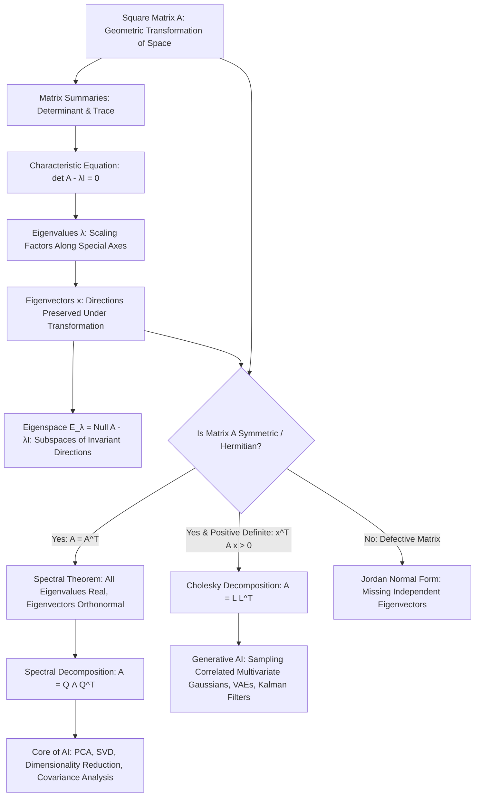
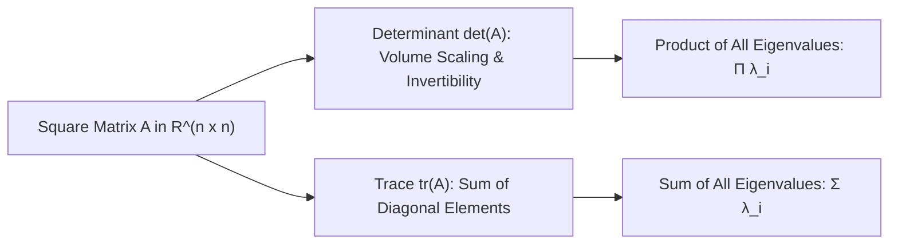
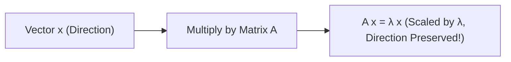
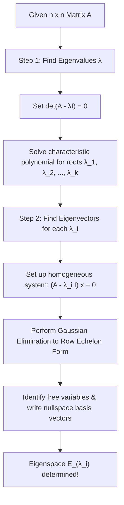
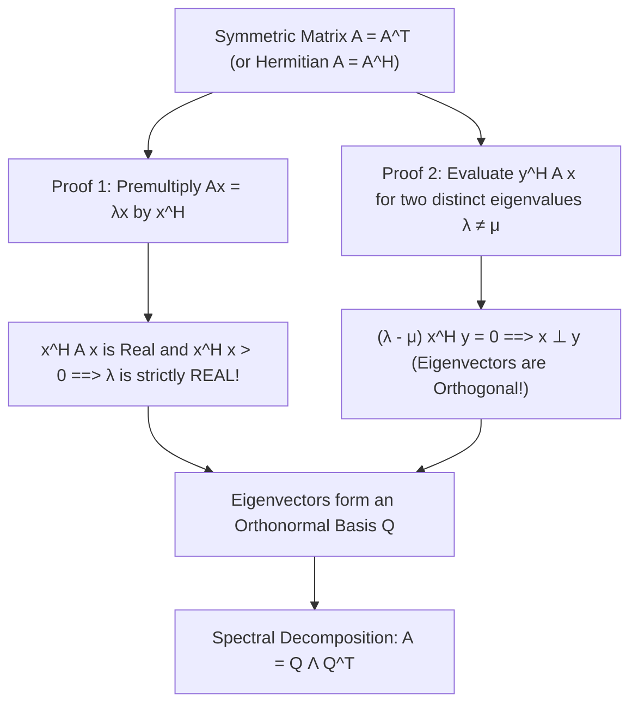
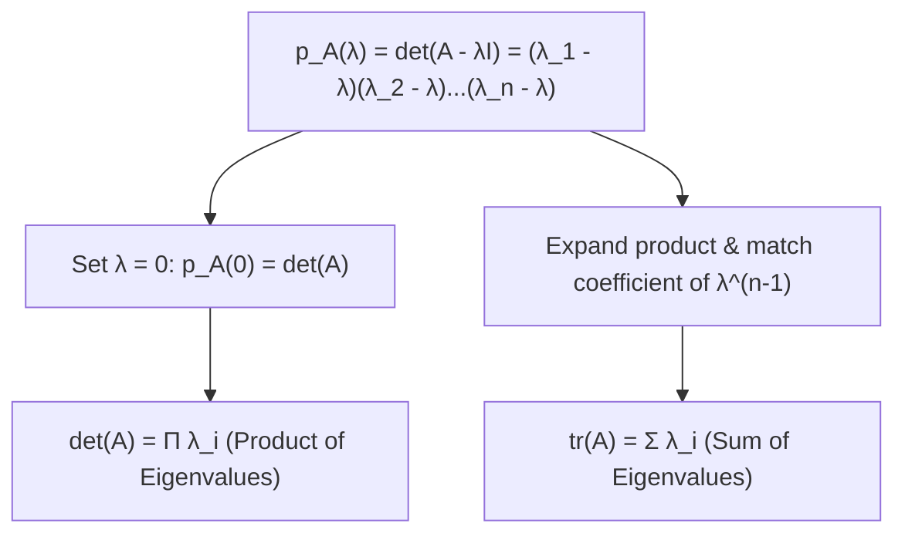
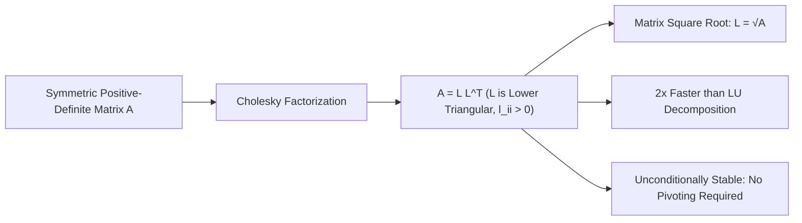
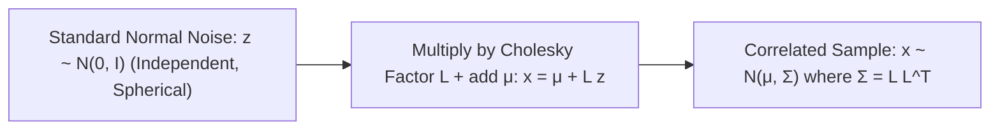

# Comprehensive Master Study Guide: Eigenvalues, Eigenvectors, and Matrix Decompositions
**Course:** Mathematical Foundations for Machine Learning & Data Science — Lecture 4  
**Target Audience:** Complete Beginners in Mathematics (Zero Knowledge Assumed $\to$ Path to Mastery)  
**Primary Reference:** Lecture 4 Presentation Slides (*BITS Pilani WILPD - CSIS / MFML & MFDS Team*)

---

## Welcome & Pedagogical Roadmap

Welcome to **Lecture 4**! Let us take a moment to look back at the intellectual journey we have traversed together so far:

* In **Lecture 1 (Linear Algebra & Systems of Equations)**, we learned the computational mechanics of solving systems of linear equations ($A\mathbf{x} = \mathbf{b}$), row operations, echelon forms, and matrix inverses. That was the study of **computation and linear equations**.
* In **Lecture 2 (Vector Spaces)**, we zoomed out to see the algebraic universe where vectors live: spans, linear independence, subspaces, bases, and dimension. That was the study of **structure and dimension**.
* In **Lecture 3 (Analytic Geometry)**, we equipped vector spaces with measuring tools: inner products, norms, metrics, angles, and orthogonality. We learned how to measure length, distance, and perpendicularity using tools like the Gram-Schmidt process. That was the study of **geometry and measurement**.

Now, in **Lecture 4**, we arrive at the intellectual crown jewel of linear algebra: **Eigenvalues, Eigenvectors, and Matrix Decompositions**.

Up to this point, you have seen matrices mostly as static grids of numbers or as systems of equations. But in modern mathematics and AI, **a matrix is an active transformation**. When a matrix $A$ multiplies a vector $\mathbf{x}$, it grabs space and stretches, rotates, shears, and reflects it.

In general, this transformation scrambles directions: a vector pointing northeast might end up pointing northwest. But are there **special, privileged directions** in space that *refuse to be rotated*? Directions where the matrix acts like a simple scalar number, merely stretching or shrinking vectors without changing their direction at all?

The answer is an emphatic **YES**! These privileged directions are called **Eigenvectors**, and the factor by which they stretch is their **Eigenvalue**.



---

### Why Eigenvalues and Decompositions are the Engine of Modern AI & Machine Learning

Every time you interact with modern machine learning algorithms, eigenvalue and matrix decomposition algorithms are running under the hood:

1. **Principal Component Analysis (PCA):** High-dimensional data (like images with 10,000 pixels) is impossible for humans to visualize and expensive for computers to process. By computing the eigenvectors of the data covariance matrix, PCA discovers the "principal axes" along which the data varies the most, allowing us to compress massive datasets with minimal loss of information.
2. **Singular Value Decomposition (SVD) & Recommender Systems:** SVD decomposes user-movie rating matrices (like Netflix's database) into latent preferences (e.g., how much a user loves sci-fi vs. comedy), powered entirely by the eigenvalues and eigenvectors of $A^T A$ and $A A^T$.
3. **Google's PageRank Algorithm:** How did Google rank billions of web pages? It modeled web surfers clicking links as a Markov transition matrix. The ultimate ranking of every webpage on the Internet is given by the **principal eigenvector** corresponding to $\lambda = 1$.
4. **Deep Neural Network Stability & Loss Landscapes:** Why do neural networks train smoothly or suffer from exploding/vanishing gradients? The curvature of the optimization landscape is governed by the **Hessian matrix** (the matrix of second derivatives). The eigenvalues of the Hessian determine whether the optimizer encounters steep canyons, flat plateaus, or saddle points.
5. **Generative Modeling & Diffusion Models / VAEs:** Sampling realistic synthetic data (e.g., generating faces, text, or stock price simulations) requires generating **multivariate Gaussian distributions**. This is made possible through the **Cholesky decomposition** ($A = L L^T$).

---

### Mathematical Symbol Glossary

To ensure complete clarity and zero confusion, here is every symbol used throughout this study guide:

| Symbol | Name / Meaning | Beginner Interpretation / Example |
| :---: | :--- | :--- |
| $\det(A)$ or $ert A ert$ | Determinant of square matrix $ | Scalar measuring the volume scaling factor and orientation change induced by $. |
| $\mathrm{tr}(A)$ | Trace of matrix $A$ | Sum of the main diagonal elements: $\sum_{i=1}^n a_{ii}$. |
| $\lambda$ | Greek letter *lambda*: Eigenvalue | The scalar factor by which an eigenvector is stretched or shrunk: $A\mathbf{x} = \lambda \mathbf{x}$. |
| $\mathbf{x}$ or $\mathbf{v}$ | Eigenvector | A non-zero vector whose direction remains invariant under transformation $A$. |
| $I$ or $I_n$ | $n \times n$ Identity Matrix | Matrix with $1$s on the diagonal and $0$s elsewhere ($I\mathbf{x} = \mathbf{x}$). |
| $p_A(\lambda)$ | Characteristic Polynomial | $\det(A - \lambda I)$, the polynomial whose roots are the eigenvalues of $A$. |
| $E_\lambda$ | Eigenspace corresponding to $\lambda$ | The vector subspace containing all eigenvectors of $\lambda$, plus the zero vector. |
| $\sigma(A)$ | Spectrum of $A$ | The set of all eigenvalues of matrix $A$: $\sigma(A) = \{\lambda_1, \lambda_2, \dots, \lambda_n\}$. |
| $\mathrm{AM}(\lambda)$ | Algebraic Multiplicity | The number of times $\lambda$ appears as a root of $p_A(\lambda)$. |
| $\mathrm{GM}(\lambda)$ | Geometric Multiplicity | $\dim(E_\lambda)$, the number of linearly independent eigenvectors for $\lambda$. |
| $A^T$ | Transpose of matrix $A$ | Swapping rows and columns ($a_{ij}^T = a_{ji}$). |
| $A^H$ or $A^*$ | Conjugate Transpose (Hermitian Adjoint) | Transpose plus taking the complex conjugate of every entry: $(\bar{A})^T$. |
| $\bar{z}$ | Complex Conjugate of $z = a + bi$ | $\bar{z} = a - bi$. Flips the sign of the imaginary part. |
| $ert z ert$ | Modulus / Absolute value of complex number | $ert a + bi ert = \sqrt{a^2 + b^2} = \sqrt{z ar{z}}$. |
| $Q$ | Orthogonal Matrix | Square matrix with orthonormal columns: $Q^T Q = Q Q^T = I$. |
| $\Lambda$ | Capital Greek letter *Lambda* | Diagonal matrix containing the eigenvalues: $\mathrm{diag}(\lambda_1, \dots, \lambda_n)$. |
| $L$ | Lower Triangular Matrix | Square matrix where all entries above the main diagonal are zero ($l_{ij} = 0$ for $j > i$). |
| $\mathcal{N}(\boldsymbol{\mu}, \boldsymbol{\Sigma})$ | Multivariate Gaussian Distribution | Normal distribution in high dimensions with mean vector $\boldsymbol{\mu}$ and covariance matrix $\boldsymbol{\Sigma}$. |
| $\mathbb{C}$ | Field of Complex Numbers | Numbers of the form $a + bi$ where $a, b \in \mathbb{R}$ and $i^2 = -1$. |
| $\mathbb{R}^{n \times n}$ | Space of $n \times n$ Real Matrices | All square grids of real numbers with $n$ rows and $n$ columns. |

---

## Part I: Summarizing Matrices — Determinant and Trace

Before we can decompose a matrix into its fundamental building blocks, we need tools to **summarize** its global behavior into simple, single-number measurements. The two most fundamental matrix summaries are the **Determinant** and the **Trace**.



---

### 1.1 The Geometric and Algebraic Essence of Determinants

#### What is a Determinant, Really?
For an $n \times n$ matrix $A$, the **determinant**, denoted $\det(A)$ or $|A|$, is a single scalar number that captures how the matrix scales areas, volumes, and orientations in space.

* **In 2D ($\mathbb{R}^2$):** Imagine the unit square formed by standard basis vectors $\mathbf{e}_1 = \begin{bmatrix} 1 \\ 0 \end{bmatrix}$ and $\mathbf{e}_2 = \begin{bmatrix} 0 \\ 1 \end{bmatrix}$, which has an area of $1$. When multiplied by $A$, these vectors become the columns of $A$: $\mathbf{a}_1$ and $\mathbf{a}_2$. They span a parallelogram. **The area of this transformed parallelogram is exactly $|\det(A)|$!**
* **In 3D ($\mathbb{R}^3$):** The unit cube of volume $1$ gets transformed into a 3D parallelepiped. **Its volume is exactly $|\det(A)|$!**
* **In $n$D ($\mathbb{R}^n$):** The unit hypercube of volume $1$ is transformed into an $n$-dimensional parallelotope whose hypervolume is $|\det(A)|$.

#### What Does the Sign of the Determinant Mean?
* **$\det(A) > 0$:** The transformation preserves spatial orientation (e.g., a right-handed coordinate system stays right-handed).
* **$\det(A) < 0$:** The transformation reverses spatial orientation (it includes an odd number of reflections, like looking in a mirror).
* **$\det(A) = 0$:** **The matrix squashes space into a lower dimension!** In 2D, the parallelogram is squashed flat into a 1D line (area $= 0$). In 3D, the volume is flattened into a 2D sheet or a line.
  * *Crucial Consequence:* When space is flattened, distinct points are squashed together. You cannot undo the transformation! Hence, **a matrix is invertible if and only if $\det(A) \ne 0$**.

---

### 1.2 The Laplace Cofactor Formula (Order $n \ge 2$)

Slide 4 and 5 define the general recursive method to compute determinants: the **Laplace Expansion** using minors and cofactors.

#### Formal Definitions:
1. **Minor ($M_{jk}$):** Let $A$ be an $n \times n$ matrix. The minor $M_{jk}$ is the determinant of the $(n-1) \times (n-1)$ submatrix obtained by deleting the $j$-th row and $k$-th column of $A$.
2. **Cofactor ($C_{jk}$):** The cofactor $C_{jk}$ is the signed minor:
   $$C_{jk} = (-1)^{j+k} M_{jk}$$
   The factor $(-1)^{j+k}$ creates a "checkerboard" pattern of alternating signs:
   $$\begin{bmatrix}
   + & - & + & - & \dots \\
   - & + & - & + & \dots \\
   + & - & + & - & \dots \\
   \vdots & \vdots & \vdots & \vdots & \ddots
   \end{bmatrix}$$

#### The Expansion Theorems (Slide 4):
* **Expansion along row $j$:**
  $$\det(A) = \sum_{k=1}^n a_{jk} C_{jk} = a_{j1} C_{j1} + a_{j2} C_{j2} + \dots + a_{jn} C_{jn}$$
* **Expansion along column $k$:**
  $$\det(A) = \sum_{j=1}^n a_{jk} C_{jk} = a_{1k} C_{1k} + a_{2k} C_{2k} + \dots + a_{nk} C_{nk}$$

You can expand along **any row or column** you choose! The resulting determinant will be identical. 

> [!TIP]
> **Pro-Tip for Beginners:** Always choose the row or column containing the most zeros! Every zero entry completely eliminates the need to calculate its corresponding minor.

#### Step-by-Step Base Cases:

* **$1 \times 1$ Matrix:**
  $$A = [a_{11}] \implies \det(A) = a_{11}$$

* **$2 \times 2$ Matrix:**
  $$A = \begin{bmatrix} a & b \\ c & d \end{bmatrix}$$
  Expand along Row 1 ($j=1$):
  * $a_{11} = a$, delete row 1 and column 1 $\implies M_{11} = \det([d]) = d$, $C_{11} = (-1)^{1+1} d = +d$.
  * $a_{12} = b$, delete row 1 and column 2 $\implies M_{12} = \det([c]) = c$, $C_{12} = (-1)^{1+2} c = -c$.
  $$\det(A) = a_{11} C_{11} + a_{12} C_{12} = ad - bc$$

---

### 1.3 Meticulous Walkthrough: 3x3 Determinant Expansion (Slide 6)

Slide 6 presents the calculation of a general $3 \times 3$ determinant by expanding along the **second row**:
$$D = \det(A) = \begin{vmatrix}
a_{11} & a_{12} & a_{13} \\
a_{21} & a_{22} & a_{23} \\
a_{31} & a_{32} & a_{33}
\end{vmatrix}$$

Let us follow every single step with zero intermediate steps skipped:

#### Step 1: Compute Minors for the Second Row ($j=2$)
* For element $a_{21}$ (row 2, column 1): cross out row 2 and column 1:
  $$M_{21} = \begin{vmatrix} a_{12} & a_{13} \\ a_{32} & a_{33} \end{vmatrix} = a_{12} a_{33} - a_{13} a_{32}$$
* For element $a_{22}$ (row 2, column 2): cross out row 2 and column 2:
  $$M_{22} = \begin{vmatrix} a_{11} & a_{13} \\ a_{31} & a_{33} \end{vmatrix} = a_{11} a_{33} - a_{13} a_{31}$$
* For element $a_{23}$ (row 2, column 3): cross out row 2 and column 3:
  $$M_{23} = \begin{vmatrix} a_{11} & a_{12} \\ a_{31} & a_{32} \end{vmatrix} = a_{11} a_{32} - a_{12} a_{31}$$

#### Step 2: Compute Cofactors by Applying Signs
* $C_{21} = (-1)^{2+1} M_{21} = (-1)^3 M_{21} = -M_{21}$
* $C_{22} = (-1)^{2+2} M_{22} = (-1)^4 M_{22} = +M_{22}$
* $C_{23} = (-1)^{2+3} M_{23} = (-1)^5 M_{23} = -M_{23}$

#### Step 3: Combine According to Laplace's Formula
$$D = a_{21} C_{21} + a_{22} C_{22} + a_{23} C_{23} = -a_{21} M_{21} + a_{22} M_{22} - a_{23} M_{23}$$
Substituting the $2 \times 2$ determinants:
$$D = -a_{21}(a_{12} a_{33} - a_{13} a_{32}) + a_{22}(a_{11} a_{33} - a_{13} a_{31}) - a_{23}(a_{11} a_{32} - a_{12} a_{31})$$

#### Concrete Numerical Example:
Let us calculate the determinant of:
$$A = \begin{bmatrix} 2 & 1 & 3 \\ 4 & 0 & 2 \\ 1 & 5 & 2 \end{bmatrix}$$
Notice row 2 has a zero at $a_{22} = 0$, making it an ideal choice for expansion!
* $a_{21} = 4$, $C_{21} = -\begin{vmatrix} 1 & 3 \\ 5 & 2 \end{vmatrix} = -((1)(2) - (3)(5)) = -(2 - 15) = -(-13) = 13$
* $a_{22} = 0$, $C_{22} = +\begin{vmatrix} 2 & 3 \\ 1 & 2 \end{vmatrix} = +((2)(2) - (3)(1)) = +(4 - 3) = 1$
* $a_{23} = 2$, $C_{23} = -\begin{vmatrix} 2 & 1 \\ 1 & 5 \end{vmatrix} = -((2)(5) - (1)(1)) = -(10 - 1) = -9$
Now sum them up:
$$\det(A) = 4(13) + 0(1) + 2(-9) = 52 + 0 - 18 = 34$$
The determinant is $34 \ne 0$. This confirms $A$ is non-singular and invertible!

---

### 1.4 Behavior of Determinants Under Elementary Row Operations (Slides 7–10)

How do row operations (the steps of Gaussian elimination from Lecture 1) affect the determinant?

| Elementary Row Operation | Notation | Effect on Determinant | Algebraic Formula |
| :--- | :---: | :--- | :---: |
| **1. Row Swap** | $R_i \leftrightarrow R_j$ | **Negates** the determinant | $\det(E_{swap} A) = -\det(A)$ |
| **2. Row Scaling** | $R_i \leftarrow c R_i$ | **Multiplies** by $c$ | $\det(E_{scale} A) = c \det(A)$ |
| **3. Row Addition** | $R_j \leftarrow R_j + c R_i$ | **Does NOT change** determinant | $\det(E_{add} A) = \det(A)$ |

Let us examine the rigorous proof sketches provided on Slides 7–10:

#### Proof Sketch 1: Why Interchanging Two Rows Negates the Determinant (Slides 7–8)
We prove this theorem by **mathematical induction** on the order $n$:

* **Base Case ($n=2$):**
  $$\begin{vmatrix} a & b \\ c & d \end{vmatrix} = ad - bc$$
  Now swap Row 1 and Row 2:
  $$\begin{vmatrix} c & d \\ a & b \end{vmatrix} = cb - da = -(ad - bc)$$
  The base case holds perfectly: swapping rows multiplies the determinant by $-1$.
* **Induction Hypothesis:** Assume that swapping any two rows in any $(n-1) \times (n-1)$ matrix multiplies its determinant by $-1$.
* **Induction Step:** Consider an $n \times n$ matrix with two rows $i$ and $j$ interchanged.
  Since $n \ge 3$, there is at least one row $r$ that was **not** involved in the swap ($r \ne i, j$).
  Expand the original determinant $D$ and the swapped determinant $E$ along this untouched row $r$:
  $$D = \sum_{k=1}^n (-1)^{r+k} a_{rk} M_{rk}, \qquad E = \sum_{k=1}^n (-1)^{r+k} a_{rk} N_{rk}$$
  Notice that $a_{rk}$ is identical in both matrices because row $r$ was untouched.
  Now look at the submatrices formed by crossing out row $r$ and column $k$: the minor $N_{rk}$ is simply the minor $M_{rk}$ with two of its rows interchanged!
  Since $M_{rk}$ and $N_{rk}$ are matrices of size $(n-1) \times (n-1)$, our induction hypothesis guarantees that:
  $$N_{rk} = -M_{rk}$$
  Substituting this into $E$:
  $$E = \sum_{k=1}^n (-1)^{r+k} a_{rk} (-M_{rk}) = -\sum_{k=1}^n (-1)^{r+k} a_{rk} M_{rk} = -D$$
  Thus, $E = -D$. Interchanging any two rows multiplies the determinant by $-1$. $\blacksquare$

---

#### Proof Sketch 2: Why Adding a Multiple of a Row Leaves Determinant Invariant (Slides 9–10)
Suppose we replace Row $j$ with $\text{Row } j + c \times \text{Row } i$. Let $D'$ be the new determinant.
Expanding along the modified $j$-th row:
$$D' = \sum_{k=1}^n (a_{jk} + c a_{ik}) (-1)^{j+k} M_{jk}$$
By the distributive property of multiplication over addition:
$$D' = \sum_{k=1}^n a_{jk} (-1)^{j+k} M_{jk} + c \sum_{k=1}^n a_{ik} (-1)^{j+k} M_{jk} = D_1 + c D_2$$
* Here, $D_1 = D$ is the original determinant.
* $D_2$ is the determinant of a matrix where row $j$ has been replaced by row $i$. This means row $i$ and row $j$ are **identical**!

**Slide 9 asks:** *"Thus two rows of $D_2$ are equal — this makes $D_2 = 0 \to$ why is this?"*

**Answer (Slide 10):**
Let $D_2$ have two identical rows, say Row $i$ and Row $j$.
* If we interchange Row $i$ and Row $j$, the matrix does not change at all, because the two rows are identical! Therefore, the determinant remains $D_2$.
* However, by our previous theorem, interchanging two rows must multiply the determinant by $-1$: the determinant becomes $-D_2$.
* Equating these two statements:
  $$D_2 = -D_2 \implies 2 D_2 = 0 \implies D_2 = 0$$
Any matrix with two identical rows has a determinant of exactly $0$!
Substituting $D_2 = 0$ back into our equation:
$$D' = D_1 + c(0) = D$$
**Bottom Line:** Adding a scalar multiple of one row to another row does **not** change the determinant at all!

---

### 1.5 Full Rank and Invertibility Theorem (Slides 11–12)

Slide 11 states one of the most fundamental theorems in all of linear algebra:

> **Theorem:** An $n \times n$ matrix $A$ has full rank $n$ (is invertible) if and only if $\det(A) \ne 0$.

Let us break down both directions of the proof sketch:

```mermaid
flowchart LR
    A[A has full rank n] <--> B[Nullspace is only {0}: Ax=0 has only x=0]
    B <--> C[Gaussian Elimination yields n non-zero pivots U_ii]
    C <--> D[det(U) = Π U_ii ≠ 0]
    D <--> E[det(A) = -1^s det(U) ≠ 0]
```

#### Direction 1: $A$ has full rank $n \implies \det(A) \ne 0$
1. By Gaussian elimination, any square matrix $A$ can be reduced to an upper-triangular echelon matrix $U = [U_{ij}]$ using only row additions and $s$ row interchanges.
2. Row additions do not change the determinant. Each row interchange multiplies the determinant by $-1$. Therefore:
   $$\det(A) = (-1)^s \det(U)$$
3. For an upper-triangular matrix $U$, expanding recursively along the first column shows that its determinant is simply the product of its diagonal elements (the pivots):
   $$\det(U) = \prod_{i=1}^n U_{ii} = U_{11} U_{22} \dots U_{nn}$$
4. Since $A$ has full rank $n$, its columns are linearly independent, which means the homogeneous system $A\mathbf{x} = \mathbf{0}$ has only the unique trivial solution $\mathbf{x} = \mathbf{0}$.
5. Since elementary row operations do not alter the solution set, $U\mathbf{x} = \mathbf{0}$ also has only the trivial solution $\mathbf{x} = \mathbf{0}$.
6. This requires that every single column of $U$ must be a pivot column! None of the diagonal entries $U_{ii}$ can be zero:
   $$U_{ii} \ne 0 \quad \forall i \in \{1, \dots, n\}$$
7. The product of non-zero numbers is non-zero: $\det(U) = \prod U_{ii} \ne 0$.
8. Hence, $\det(A) = (-1)^s \det(U) \ne 0$.

#### Direction 2: $\det(A) \ne 0 \implies A$ has full rank $n$
1. If $\det(A) \ne 0$, then $(-1)^s \prod_{i=1}^n U_{ii} \ne 0$.
2. This implies that no pivot $U_{ii}$ can be zero.
3. Therefore, $U$ has $n$ non-zero pivots, which means all $n$ columns are pivot columns.
4. With $n$ pivot columns and $0$ free variables, the nullspace of $U$ (and therefore of $A$) contains only $\{\mathbf{0}\}$.
5. By the Rank-Nullity Theorem:
   $$\mathrm{rank}(A) = n - \mathrm{nullity}(A) = n - 0 = n$$
Thus, $A$ has full rank $n$. $\blacksquare$

---

### 1.6 The Trace of a Matrix (Slide 13)

The **trace** of an $n \times n$ square matrix $A$, denoted $\mathrm{tr}(A)$, is the sum of its main diagonal elements:
$$\mathrm{tr}(A) = \sum_{i=1}^n a_{ii} = a_{11} + a_{22} + \dots + a_{nn}$$

#### Fundamental Properties of the Trace:

#### 1. Linearity of Addition:
$$\mathrm{tr}(A + B) = \mathrm{tr}(A) + \mathrm{tr}(B) \quad \forall A, B \in \mathbb{R}^{n \times n}$$
* **Proof:** The diagonal elements of $(A+B)$ are $(a_{ii} + b_{ii})$. Thus:
  $$\mathrm{tr}(A+B) = \sum_{i=1}^n (a_{ii} + b_{ii}) = \sum_{i=1}^n a_{ii} + \sum_{i=1}^n b_{ii} = \mathrm{tr}(A) + \mathrm{tr}(B)$$

#### 2. Linearity of Scalar Multiplication:
$$\mathrm{tr}(\alpha A) = \alpha \mathrm{tr}(A) \quad \forall \alpha \in \mathbb{R}$$
* **Proof:** $\mathrm{tr}(\alpha A) = \sum_{i=1}^n (\alpha a_{ii}) = \alpha \sum_{i=1}^n a_{ii} = \alpha \mathrm{tr}(A)$.

#### 3. Trace of the Identity Matrix:
$$\mathrm{tr}(I_n) = n$$
* **Proof:** $I_n$ has $n$ ones on its diagonal: $\sum_{i=1}^n 1 = n$.

#### 4. The Commutative (Cyclic) Property of Trace:
For $A \in \mathbb{R}^{n \times k}$ and $B \in \mathbb{R}^{k \times n}$:
$$\mathrm{tr}(AB) = \mathrm{tr}(BA)$$

> [!IMPORTANT]
> Notice how remarkable this property is: $A$ and $B$ do not even need to be square! If $A$ is $2 \times 5$ and $B$ is $5 \times 2$, then $AB$ is a $2 \times 2$ matrix, while $BA$ is a $5 \times 5$ matrix. Yet, their traces are **exactly equal**!

* **Meticulous Step-by-Step Proof:**
  Recall the formula for matrix multiplication. The $(i, i)$-th entry of matrix $C = AB$ is:
  $$(AB)_{ii} = \sum_{j=1}^k a_{ij} b_{ji}$$
  Therefore, the trace of $AB$ is the double summation:
  $$\mathrm{tr}(AB) = \sum_{i=1}^n (AB)_{ii} = \sum_{i=1}^n \sum_{j=1}^k a_{ij} b_{ji}$$
  Similarly, the $(j, j)$-th entry of matrix $BA$ is:
  $$(BA)_{jj} = \sum_{i=1}^n b_{ji} a_{ij}$$
  Therefore, the trace of $BA$ is:
  $$\mathrm{tr}(BA) = \sum_{j=1}^k (BA)_{jj} = \sum_{j=1}^k \sum_{i=1}^n b_{ji} a_{ij}$$
  Because real numbers commute under ordinary multiplication ($a_{ij} b_{ji} = b_{ji} a_{ij}$) and finite summations can be swapped:
  $$\sum_{i=1}^n \sum_{j=1}^k a_{ij} b_{ji} = \sum_{j=1}^k \sum_{i=1}^n b_{ji} a_{ij}$$
  Hence:
  $$\mathrm{tr}(AB) = \mathrm{tr}(BA) \quad \blacksquare$$

* **Extension to Multiple Matrices (Cyclic Permutation):**
  $$\mathrm{tr}(ABC) = \mathrm{tr}(BCA) = \mathrm{tr}(CAB)$$
  *(Warning: You can cyclically rotate matrices inside the trace, but you cannot randomly swap them! $\mathrm{tr}(ABC) \ne \mathrm{tr}(BAC)$ in general).*

---

## Part II: The Characteristic Polynomial

Now we connect the determinant and the trace to find the secret internal axes of a matrix: its **eigenvalues**.

### 2.1 Formulating the Characteristic Equation (Slide 14)

For a square matrix $A \in \mathbb{R}^{n \times n}$ and a scalar $\lambda \in \mathbb{R}$, consider the matrix:
$$(A - \lambda I) = \begin{bmatrix}
a_{11} - \lambda & a_{12} & \dots & a_{1n} \\
a_{21} & a_{22} - \lambda & \dots & a_{2n} \\
\vdots & \vdots & \ddots & \vdots \\
a_{n1} & a_{n2} & \dots & a_{nn} - \lambda
\end{bmatrix}$$

The **characteristic polynomial** of $A$, denoted $p_A(\lambda)$, is defined as:
$$p_A(\lambda) = \det(A - \lambda I)$$

This is a polynomial in the variable $\lambda$ of degree $n$:
$$p_A(\lambda) = (-1)^n \lambda^n + c_{n-1} \lambda^{n-1} + \dots + c_1 \lambda + c_0$$

Slide 14 highlights two profound facts about the coefficients of this polynomial:
1. The **constant term** $c_0$ is always the determinant: $c_0 = \det(A)$.
2. The **sub-leading coefficient** $c_{n-1}$ is always tied to the trace: $c_{n-1} = (-1)^{n-1} \mathrm{tr}(A)$.

Let us rigorously derive both facts so you never have to memorize them blindly!

---

### 2.2 Proof of the Constant Term: $c_0 = \det(A)$
Look at the polynomial expression:
$$p_A(\lambda) = c_0 + c_1 \lambda + c_2 \lambda^2 + \dots + (-1)^n \lambda^n$$
What happens if we evaluate this polynomial at $\lambda = 0$?
$$p_A(0) = c_0 + c_1(0) + c_2(0)^2 + \dots = c_0$$
Now look at the definition of $p_A(\lambda)$:
$$p_A(0) = \det(A - 0 \cdot I) = \det(A)$$
Equating both expressions gives the result immediately:
$$c_0 = \det(A) \quad \blacksquare$$

---

### 2.3 Proof of the Trace Coefficient: $c_{n-1} = (-1)^{n-1} \mathrm{tr}(A)$ (Slides 14–16)

Let us examine the $3 \times 3$ case given on Slide 14:
$$\det(A - \lambda I) = \begin{vmatrix}
a_{11} - \lambda & a_{12} & a_{13} \\
a_{21} & a_{22} - \lambda & a_{23} \\
a_{31} & a_{32} & a_{33} - \lambda
\end{vmatrix}$$

Expand this determinant along the first row:
$$\det(A - \lambda I) = (a_{11} - \lambda) C_{11} + a_{12} C_{12} + a_{13} C_{13}$$

Let us analyze the powers of $\lambda$ produced by each term:
1. **The First Term $(a_{11} - \lambda) C_{11}$:**
   The cofactor $C_{11}$ is:
   $$C_{11} = + \begin{vmatrix} a_{22} - \lambda & a_{23} \\ a_{32} & a_{33} - \lambda \end{vmatrix} = (a_{22} - \lambda)(a_{33} - \lambda) - a_{23} a_{32}$$
   Multiplying by $(a_{11} - \lambda)$:
   $$(a_{11} - \lambda) C_{11} = (a_{11} - \lambda)(a_{22} - \lambda)(a_{33} - \lambda) - (a_{11} - \lambda) a_{23} a_{32}$$
   Notice that the product:
   $$\prod_{i=1}^3 (a_{ii} - \lambda) = (a_{11} - \lambda)(a_{22} - \lambda)(a_{33} - \lambda)$$
   contains the term $(-\lambda)^3 = -\lambda^3$ and terms containing $\lambda^2$.
2. **The Other Terms $a_{12} C_{12}$ and $a_{13} C_{13}$:**
   The minor for $a_{12}$ is:
   $$M_{12} = \begin{vmatrix} a_{21} & a_{23} \\ a_{31} & a_{33} - \lambda \end{vmatrix} = a_{21}(a_{33} - \lambda) - a_{23} a_{31}$$
   Notice that $\lambda$ appears only to the **first power** (degree $1$)!
   The same holds for $a_{13} C_{13}$.

#### Generalization to $n \times n$ Matrices:
In any $n \times n$ determinant expansion, **only the product of the main diagonal entries contains powers $\lambda^n$ and $\lambda^{n-1}$**:
$$\prod_{i=1}^n (a_{ii} - \lambda) = (a_{11} - \lambda)(a_{22} - \lambda) \dots (a_{nn} - \lambda)$$
Every other term in the full Leibniz formula for the determinant must take at least two elements off the diagonal (say $a_{ij}$ and $a_{ji}$). Selecting two off-diagonal elements eliminates at least two diagonal factors $(a_{ii} - \lambda)$ and $(a_{jj} - \lambda)$, meaning its degree in $\lambda$ can be at most $n - 2$!

Therefore, the coefficients of $\lambda^n$ and $\lambda^{n-1}$ come **exclusively** from expanding the diagonal product:
$$(-\lambda + a_{11})(-\lambda + a_{22}) \dots (-\lambda + a_{nn})$$
Let us expand this product:
* To get $\lambda^n$: choose $(-\lambda)$ from all $n$ factors:
  $$(-\lambda)^n = (-1)^n \lambda^n$$
  *(Hence, the leading coefficient is always $(-1)^n$).*
* To get $\lambda^{n-1}$: choose $(-\lambda)$ from $(n-1)$ factors and $a_{ii}$ from the remaining $1$ factor:
  $$\sum_{i=1}^n a_{ii} (-\lambda)^{n-1} = \left( \sum_{i=1}^n a_{ii} \right) (-1)^{n-1} \lambda^{n-1} = (-1)^{n-1} \mathrm{tr}(A) \lambda^{n-1}$$
Thus, the coefficient of $\lambda^{n-1}$ is precisely:
$$c_{n-1} = (-1)^{n-1} \mathrm{tr}(A) \quad \blacksquare$$

---

## Part III: Eigenvalues and Eigenvectors — Foundations & Mechanics

### 3.1 The Geometric Heartbeat: Preserving Direction (Slide 17)

Let $A \in \mathbb{R}^{n \times n}$ be a square matrix. 

> **Definition:** A scalar $\lambda \in \mathbb{R}$ is called an **eigenvalue** of $A$, and a non-zero vector $\mathbf{x} \in \mathbb{R}^n \setminus \{\mathbf{0}\}$ is called its corresponding **eigenvector**, if:
> $$A \mathbf{x} = \lambda \mathbf{x}$$
> This is known as the **Eigenvalue Equation**.



#### Why is $\mathbf{x} \ne \mathbf{0}$ Required?
Notice that $A \mathbf{0} = \lambda \mathbf{0} = \mathbf{0}$ is trivially true for *every* scalar $\lambda$ and *every* matrix $A$. If we allowed $\mathbf{x} = \mathbf{0}$, every number in the universe would be an eigenvalue of every matrix! To make the concept meaningful, **eigenvectors must be strictly non-zero**. (Note: An eigenvalue $\lambda$ *can* be zero!).

#### Geometric Intuition:
* If $\lambda > 1$: $A$ stretches $\mathbf{x}$ in the same direction.
* If $0 < \lambda < 1$: $A$ shrinks $\mathbf{x}$ in the same direction.
* If $\lambda = 1$: $A$ leaves $\mathbf{x}$ completely unchanged ($A\mathbf{x} = \mathbf{x}$).
* If $\lambda = 0$: $A$ collapses $\mathbf{x}$ to the origin ($A\mathbf{x} = \mathbf{0}$, meaning $\mathbf{x}$ lies in the nullspace of $A$!).
* If $\lambda < 0$: $A$ flips the vector $180^\circ$ to point backwards, scaled by $|\lambda|$.

---

### 3.2 The Four Equivalent Statements (Slide 17)

Slide 17 states that for any square matrix $A \in \mathbb{R}^{n \times n}$ and scalar $\lambda \in \mathbb{R}$, the following four statements are logically equivalent:

1. **$\lambda$ is an eigenvalue of $A$.**
2. **There exists a non-zero vector $\mathbf{x} \ne \mathbf{0}$ such that $(A - \lambda I)\mathbf{x} = \mathbf{0}$.**
   * *Derivation:* $A\mathbf{x} = \lambda \mathbf{x} \iff A\mathbf{x} - \lambda I \mathbf{x} = \mathbf{0} \iff (A - \lambda I)\mathbf{x} = \mathbf{0}$.
3. **$\mathrm{rank}(A - \lambda I) < n$.**
   * *Derivation:* If $(A - \lambda I)\mathbf{x} = \mathbf{0}$ has a non-trivial solution $\mathbf{x} \ne \mathbf{0}$, its nullspace is not empty ($\mathrm{nullity} \ge 1$). By the Rank-Nullity Theorem, $\mathrm{rank} = n - \mathrm{nullity} < n$.
4. **$\det(A - \lambda I) = 0$.**
   * *Derivation:* By the Full Rank Theorem (Section 1.5), a matrix has non-trivial nullspace if and only if its determinant is zero.

#### Scaling Invariance of Eigenvectors:
If $\mathbf{x}$ is an eigenvector of $A$ corresponding to $\lambda$, then for any non-zero scalar $c \in \mathbb{R} \setminus \{0\}$, the scaled vector $c\mathbf{x}$ is **also** an eigenvector of $A$ for the same $\lambda$:
$$A(c\mathbf{x}) = c(A\mathbf{x}) = c(\lambda \mathbf{x}) = \lambda (c\mathbf{x})$$
Eigenvectors are not isolated arrows; they define **entire lines / axes** through the origin that remain invariant under $A$.

---

### 3.3 The General 2-Step Computational Recipe

To find the eigenvalues and eigenvectors of any square matrix $A$:



---

### 3.4 Fully Worked Slide Example: $A = \begin{bmatrix} 1 & 1 \\ 1 & 1 \end{bmatrix}$ (Slide 18)

Let us solve the exact example from Slide 18 step-by-step with complete algebraic details:

#### Step 1: Find the Eigenvalues
Form the characteristic matrix $A - \lambda I$:
$$A - \lambda I = \begin{bmatrix} 1 - \lambda & 1 \\ 1 & 1 - \lambda \end{bmatrix}$$
Calculate its determinant:
$$\det(A - \lambda I) = (1 - \lambda)(1 - \lambda) - (1)(1) = (1 - \lambda)^2 - 1$$
Expand the square:
$$(1 - 2\lambda + \lambda^2) - 1 = \lambda^2 - 2\lambda = \lambda(\lambda - 2)$$
Set the characteristic polynomial to zero:
$$\lambda(\lambda - 2) = 0$$
The roots are:
$$\lambda_1 = 0, \qquad \lambda_2 = 2$$

---

#### Step 2: Find the Eigenvectors for $\lambda_1 = 0$
Substitute $\lambda_1 = 0$ into $(A - \lambda I)\mathbf{x} = \mathbf{0}$:
$$(A - 0 \cdot I)\mathbf{x} = A\mathbf{x} = \begin{bmatrix} 1 & 1 \\ 1 & 1 \end{bmatrix} \begin{bmatrix} x_1 \\ x_2 \end{bmatrix} = \begin{bmatrix} 0 \\ 0 \end{bmatrix}$$
Perform Gaussian elimination: replace Row 2 with $\text{Row } 2 - \text{Row } 1$:
$$\begin{bmatrix} 1 & 1 \\ 0 & 0 \end{bmatrix} \begin{bmatrix} x_1 \\ x_2 \end{bmatrix} = \begin{bmatrix} 0 \\ 0 \end{bmatrix}$$
This yields a single equation:
$$x_1 + x_2 = 0 \implies x_1 = -x_2$$
Here, $x_2$ is a free variable. Setting $x_2 = 1$ gives $x_1 = -1$ (or setting $x_2 = -1$ gives $x_1 = 1$).
Thus, an eigenvector corresponding to $\lambda_1 = 0$ is:
$$\mathbf{v}_1 = \begin{bmatrix} 1 \\ -1 \end{bmatrix}$$
The eigenspace is:
$$E_0 = \mathrm{span}\left( \begin{bmatrix} 1 \\ -1 \end{bmatrix} \right)$$

---

#### Step 3: Find the Eigenvectors for $\lambda_2 = 2$
Substitute $\lambda_2 = 2$ into $(A - 2I)\mathbf{x} = \mathbf{0}$:
$$A - 2I = \begin{bmatrix} 1 - 2 & 1 \\ 1 & 1 - 2 \end{bmatrix} = \begin{bmatrix} -1 & 1 \\ 1 & -1 \end{bmatrix}$$
The system is:
$$\begin{bmatrix} -1 & 1 \\ 1 & -1 \end{bmatrix} \begin{bmatrix} x_1 \\ x_2 \end{bmatrix} = \begin{bmatrix} 0 \\ 0 \end{bmatrix}$$
Perform Gaussian elimination: replace Row 2 with $\text{Row } 2 + \text{Row } 1$:
$$\begin{bmatrix} -1 & 1 \\ 0 & 0 \end{bmatrix} \begin{bmatrix} x_1 \\ x_2 \end{bmatrix} = \begin{bmatrix} 0 \\ 0 \end{bmatrix}$$
This yields:
$$-x_1 + x_2 = 0 \implies x_1 = x_2$$
Setting free variable $x_2 = 1$ gives $x_1 = 1$.
Thus, an eigenvector corresponding to $\lambda_2 = 2$ is:
$$\mathbf{v}_2 = \begin{bmatrix} 1 \\ 1 \end{bmatrix}$$
The eigenspace is:
$$E_2 = \mathrm{span}\left( \begin{bmatrix} 1 \\ 1 \end{bmatrix} \right)$$

---

#### Step 4: Verification of Results
* For $\lambda_1 = 0$:
  $$A \mathbf{v}_1 = \begin{bmatrix} 1 & 1 \\ 1 & 1 \end{bmatrix} \begin{bmatrix} 1 \\ -1 \end{bmatrix} = \begin{bmatrix} 1(1) + 1(-1) \\ 1(1) + 1(-1) \end{bmatrix} = \begin{bmatrix} 0 \\ 0 \end{bmatrix} = 0 \cdot \begin{bmatrix} 1 \\ -1 \end{bmatrix} \quad \checkmark$$
* For $\lambda_2 = 2$:
  $$A \mathbf{v}_2 = \begin{bmatrix} 1 & 1 \\ 1 & 1 \end{bmatrix} \begin{bmatrix} 1 \\ 1 \end{bmatrix} = \begin{bmatrix} 1(1) + 1(1) \\ 1(1) + 1(1) \end{bmatrix} = \begin{bmatrix} 2 \\ 2 \end{bmatrix} = 2 \cdot \begin{bmatrix} 1 \\ 1 \end{bmatrix} \quad \checkmark$$

> [!NOTE]
> **Geometric Revelation:** Notice that $\mathbf{v}_1 \cdot \mathbf{v}_2 = (1)(1) + (-1)(1) = 0$! The two eigenvectors are **mutually perpendicular (orthogonal)**. This is not a coincidence: as we will prove in Part VII, symmetric matrices *always* have mutually orthogonal eigenvectors!

---

## Part IV: Deep Dive into Eigenspaces, Multiplicities, & Edge Cases

### 4.1 Spectrum and Eigenspaces (Slide 20)

* **Spectrum ($\sigma(A)$):** The set of all eigenvalues of $A$:
  $$\sigma(A) = \{\lambda_1, \lambda_2, \dots, \lambda_k\}$$
* **Eigenspace ($E_\lambda$):** For a given eigenvalue $\lambda$, the set of all its eigenvectors together with the zero vector $\mathbf{0}$:
  $$E_\lambda = \mathrm{Null}(A - \lambda I) = \{\mathbf{x} \in \mathbb{R}^n : (A - \lambda I)\mathbf{x} = \mathbf{0}\}$$

#### Why is $E_\lambda$ Guaranteed to be a Subspace?
Because the nullspace of *any* matrix is a valid vector subspace (as proven in Lecture 2):
1. **Contains $\mathbf{0}$:** $(A - \lambda I)\mathbf{0} = \mathbf{0}$.
2. **Closed under addition:** If $\mathbf{u}, \mathbf{v} \in E_\lambda$, then $A(\mathbf{u}+\mathbf{v}) = A\mathbf{u} + A\mathbf{v} = \lambda\mathbf{u} + \lambda\mathbf{v} = \lambda(\mathbf{u}+\mathbf{v})$.
3. **Closed under scalar multiplication:** If $\mathbf{u} \in E_\lambda$, then $A(c\mathbf{u}) = c(A\mathbf{u}) = c(\lambda\mathbf{u}) = \lambda(c\mathbf{u})$.

#### Example: The Identity Matrix $I_n$ (Slide 20)
For the $n \times n$ identity matrix $I_n$:
$$I_n \mathbf{x} = 1 \cdot \mathbf{x} \quad \forall \mathbf{x} \in \mathbb{R}^n$$
* It has only **one** eigenvalue: $\lambda = 1$.
* Its eigenspace is the **entire vector space $\mathbb{R}^n$**: $E_1 = \mathbb{R}^n$.
* Every non-zero vector in $\mathbb{R}^n$ is an eigenvector! Any canonical standard basis $\{\mathbf{e}_1, \dots, \mathbf{e}_n\}$ forms an orthonormal basis for $E_1$.

---

### 4.2 Algebraic Multiplicity vs. Geometric Multiplicity

When an eigenvalue repeats, two different notions of "multiplicity" emerge:

1. **Algebraic Multiplicity ($\mathrm{AM}$):** How many times $\lambda$ appears as a root of the characteristic polynomial $p_A(\lambda)$. (e.g., if $p_A(\lambda) = (\lambda - 3)^2(\lambda - 5)$, then $\mathrm{AM}(3) = 2$ and $\mathrm{AM}(5) = 1$).
2. **Geometric Multiplicity ($\mathrm{GM}$):** The dimension of the eigenspace $E_\lambda$:
   $$\mathrm{GM}(\lambda) = \dim(E_\lambda) = \mathrm{nullity}(A - \lambda I) = n - \mathrm{rank}(A - \lambda I)$$
   This represents the number of linearly independent eigenvectors associated with $\lambda$.

> **Fundamental Theorem of Multiplicities:**
> For every eigenvalue $\lambda$:
> $$1 \le \mathrm{GM}(\lambda) \le \mathrm{AM}(\lambda)$$
> The geometric multiplicity is always at least $1$ (otherwise it wouldn't be an eigenvalue), but it can never exceed the algebraic multiplicity!

---

### 4.3 Defective Matrices: Can a Matrix Run Out of Eigenvectors? (Slide 19)

**Slide 19 asks:** *"Does every $n \times n$ matrix have a full set of eigenvectors, i.e., $n$ eigenvectors? Look at $A = \begin{bmatrix} 0 & 1 \\ 0 & 0 \end{bmatrix}$."*

Let us analyze this matrix in detail:

#### Step 1: Characteristic Polynomial
$$p_A(\lambda) = \det\begin{bmatrix} 0 - \lambda & 1 \\ 0 & 0 - \lambda \end{bmatrix} = \det\begin{bmatrix} -\lambda & 1 \\ 0 & -\lambda \end{bmatrix} = (-\lambda)(-\lambda) - (1)(0) = \lambda^2 = 0$$
The eigenvalues are:
$$\lambda = 0 \quad \text{with Algebraic Multiplicity } \mathrm{AM}(0) = 2$$

#### Step 2: Finding the Eigenvectors
Solve $(A - 0I)\mathbf{x} = \mathbf{0}$:
$$\begin{bmatrix} 0 & 1 \\ 0 & 0 \end{bmatrix} \begin{bmatrix} x_1 \\ x_2 \end{bmatrix} = \begin{bmatrix} 0 \\ 0 \end{bmatrix}$$
This matrix is already in row echelon form!
* The first equation reads: $0x_1 + 1x_2 = 0 \implies x_2 = 0$.
* The variable $x_1$ has no pivot; it is a free variable!
Therefore, any eigenvector must have the form:
$$\mathbf{x} = \begin{bmatrix} x_1 \\ 0 \end{bmatrix} = x_1 \begin{bmatrix} 1 \\ 0 \end{bmatrix}$$
The eigenspace is:
$$E_0 = \mathrm{span}\left( \begin{bmatrix} 1 \\ 0 \end{bmatrix} \right)$$
Notice that $\dim(E_0) = 1$. Therefore:
$$\mathrm{GM}(0) = 1 < \mathrm{AM}(0) = 2$$

#### Conclusion:
This matrix needs $2$ linearly independent eigenvectors to span $\mathbb{R}^2$, but it only has **one**! 
A matrix where $\mathrm{GM}(\lambda) < \mathrm{AM}(\lambda)$ for any eigenvalue is called a **defective matrix**. Defective matrices cannot be diagonalized into $P D P^{-1}$.

---

### 4.4 Point to Ponder: Do Rotation Matrices Have Eigenvalues? (Slide 19)

**Slide 19 poses this fascinating question:**
*"Looking at the equation $A\mathbf{x} = \lambda \mathbf{x}$, it seems that the action of $A$ on $\mathbf{x}$ is to preserve the direction of $\mathbf{x}$ but scale it up or down according to $\lambda$. Does this mean that a rotation matrix has no eigenvalues and eigenvectors?"*

Let us investigate this mathematically!

Consider the standard 2D counter-clockwise rotation matrix by angle $\theta$:
$$R_\theta = \begin{bmatrix} \cos\theta & -\sin\theta \\ \sin\theta & \cos\theta \end{bmatrix}$$

#### The Geometric Perspective:
A rotation by $\theta$ turns *every* vector in the plane by $\theta$. 
If $\theta$ is not $0^\circ$ (the identity transformation) or $180^\circ$ (reversing all vectors, $\lambda = -1$), then **no vector in $\mathbb{R}^2$ can keep its original direction**! Every vector is rotated away from its span line.
Therefore, geometrically, **a 2D rotation matrix has NO REAL eigenvalues or eigenvectors**.

#### The Algebraic Perspective:
Let us calculate its characteristic equation:
$$\det(R_\theta - \lambda I) = \begin{vmatrix} \cos\theta - \lambda & -\sin\theta \\ \sin\theta & \cos\theta - \lambda \end{vmatrix} = (\cos\theta - \lambda)^2 - (-\sin^2\theta) = (\cos\theta - \lambda)^2 + \sin^2\theta$$
Expand:
$$\lambda^2 - 2\lambda\cos\theta + (\cos^2\theta + \sin^2\theta) = \lambda^2 - 2\lambda\cos\theta + 1 = 0$$
Using the quadratic formula:
$$\lambda = \frac{2\cos\theta \pm \sqrt{4\cos^2\theta - 4}}{2} = \cos\theta \pm \sqrt{\cos^2\theta - 1} = \cos\theta \pm \sqrt{-\sin^2\theta}$$
Since $\sqrt{-1} = i$:
$$\lambda = \cos\theta \pm i\sin\theta = e^{\pm i\theta}$$

#### The Deep Resolution:
1. Over the **Real Numbers** $\mathbb{R}$: For any angle $\theta \ne k\pi$, $\sin\theta \ne 0$, so $\lambda$ has a non-zero imaginary component. Thus, there are **no real eigenvalues**.
2. Over the **Complex Numbers** $\mathbb{C}$: There are **two complex eigenvalues**: $\lambda_1 = e^{i\theta}$ and $\lambda_2 = e^{-i\theta}$, with corresponding complex eigenvectors!
3. **What about 3D Rotations? (Euler's Rotation Theorem):**
   In 3D space, when you rotate an object (like the Earth spinning), the **axis of rotation does not move**! Any vector along the axis of rotation satisfies $R \mathbf{x} = 1 \cdot \mathbf{x}$. Therefore, **every 3D rotation matrix always has a real eigenvalue $\lambda = 1$**, and its eigenvector is the axis of rotation!

This leads directly to why modern linear algebra must embrace **complex vectors and Hermitian matrices**.

---

## Part V: Key Theorems and Foundations

### 5.1 Theorem: A Matrix and its Transpose Have Identical Eigenvalues (Slide 21)

> **Theorem:** For any square matrix $A \in \mathbb{R}^{n \times n}$, $A$ and $A^T$ have the exact same eigenvalues.

#### Proof (Slide 21):
1. Recall the determinant property from Lecture 1: for any square matrix $M$, $\det(M^T) = \det(M)$.
2. Now examine the characteristic polynomial of $A^T$:
   $$p_{A^T}(\lambda) = \det(A^T - \lambda I)$$
3. Since $I^T = I$, we can rewrite $(A^T - \lambda I)$ as $(A - \lambda I)^T$:
   $$p_{A^T}(\lambda) = \det\left( (A - \lambda I)^T \right)$$
4. Applying the determinant transpose property $\det(M^T) = \det(M)$ with $M = (A - \lambda I)$:
   $$\det\left( (A - \lambda I)^T \right) = \det(A - \lambda I) = p_A(\lambda)$$
5. Since $p_{A^T}(\lambda) = p_A(\lambda)$, the characteristic polynomials are **identical**.
6. Identical polynomials have the exact same roots. Therefore, $A$ and $A^T$ share the exact same spectrum of eigenvalues! $\blacksquare$

> [!WARNING]
> While $A$ and $A^T$ have the **same eigenvalues**, they generally have **different eigenvectors**! An eigenvector of $A^T$ is called a *left eigenvector* of $A$, because $\mathbf{y}^T A = \lambda \mathbf{y}^T$.

---

### 5.2 Theorem: Eigenvectors for Distinct Eigenvalues are Linearly Independent (Slide 22)

**Slide 22 poses the question:** *"The eigenvectors $\mathbf{x}_1, \mathbf{x}_2, \dots, \mathbf{x}_k$ of an $n \times n$ matrix $A$ with distinct eigenvalues are linearly independent $\to$ why?"*

Let us provide the complete, rigorous proof by induction:

#### Base Case ($k=1$):
By definition, an eigenvector $\mathbf{x}_1 \ne \mathbf{0}$. A set containing a single non-zero vector $\{\mathbf{x}_1\}$ is always linearly independent.

#### Induction Hypothesis:
Assume that any set of $(k-1)$ eigenvectors corresponding to distinct eigenvalues is linearly independent.

#### Induction Step:
Let $\lambda_1, \lambda_2, \dots, \lambda_k$ be distinct eigenvalues (so $\lambda_i \ne \lambda_j$ for $i \ne j$) with corresponding eigenvectors $\mathbf{x}_1, \dots, \mathbf{x}_k$.
To test linear independence, set up the linear combination:
$$c_1 \mathbf{x}_1 + c_2 \mathbf{x}_2 + \dots + c_k \mathbf{x}_k = \mathbf{0} \quad \text{--- (Equation 1)}$$
Multiply both sides of Equation 1 by matrix $A$:
$$c_1 A\mathbf{x}_1 + c_2 A\mathbf{x}_2 + \dots + c_k A\mathbf{x}_k = A\mathbf{0} = \mathbf{0}$$
Since $A\mathbf{x}_i = \lambda_i \mathbf{x}_i$:
$$c_1 \lambda_1 \mathbf{x}_1 + c_2 \lambda_2 \mathbf{x}_2 + \dots + c_k \lambda_k \mathbf{x}_k = \mathbf{0} \quad \text{--- (Equation 2)}$$
Now, multiply Equation 1 by the scalar $\lambda_k$:
$$c_1 \lambda_k \mathbf{x}_1 + c_2 \lambda_k \mathbf{x}_2 + \dots + c_k \lambda_k \mathbf{x}_k = \mathbf{0} \quad \text{--- (Equation 3)}$$
Subtract Equation 3 from Equation 2:
$$c_1(\lambda_1 - \lambda_k)\mathbf{x}_1 + c_2(\lambda_2 - \lambda_k)\mathbf{x}_2 + \dots + c_{k-1}(\lambda_{k-1} - \lambda_k)\mathbf{x}_{k-1} + c_k(\lambda_k - \lambda_k)\mathbf{x}_k = \mathbf{0}$$
Notice that the last term vanishes because $(\lambda_k - \lambda_k) = 0$:
$$c_1(\lambda_1 - \lambda_k)\mathbf{x}_1 + c_2(\lambda_2 - \lambda_k)\mathbf{x}_2 + \dots + c_{k-1}(\lambda_{k-1} - \lambda_k)\mathbf{x}_{k-1} = \mathbf{0}$$
This is a linear combination of the first $(k-1)$ eigenvectors!
By our induction hypothesis, the set $\{\mathbf{x}_1, \dots, \mathbf{x}_{k-1}\}$ is linearly independent. Therefore, every coefficient in this combination must be zero:
$$c_i (\lambda_i - \lambda_k) = 0 \quad \forall i \in \{1, \dots, k-1\}$$
Because all eigenvalues are **distinct**, $(\lambda_i - \lambda_k) \ne 0$.
Therefore, we must have:
$$c_1 = 0, \quad c_2 = 0, \quad \dots, \quad c_{k-1} = 0$$
Substitute these zeros back into Equation 1:
$$0\mathbf{x}_1 + \dots + 0\mathbf{x}_{k-1} + c_k \mathbf{x}_k = \mathbf{0} \implies c_k \mathbf{x}_k = \mathbf{0}$$
Since $\mathbf{x}_k \ne \mathbf{0}$, this forces $c_k = 0$.
All coefficients $c_1 = c_2 = \dots = c_k = 0$.
Thus, eigenvectors corresponding to distinct eigenvalues are **linearly independent**! $\blacksquare$

---

### 5.3 Theorem: $A^T A$ is Symmetric Positive-Definite (Slide 22)

**Slide 22 states:**
*"Given a matrix $A \in \mathbb{R}^{m \times n}$, we can show that $A^T A \in \mathbb{R}^{n \times n}$ is a symmetric, positive-definite matrix when $\mathrm{rank}(A) = n$. Why is this true?"*

This is one of the most practical results in data science:

#### Part 1: Proving Symmetry
To prove $A^T A$ is symmetric, we must show that $(A^T A)^T = A^T A$:
$$(A^T A)^T = A^T (A^T)^T = A^T A$$
Symmetry holds unconditionally for any matrix $A$!

#### Part 2: Proving Positive Definiteness
To prove $A^T A$ is positive definite, we must show that for every non-zero vector $\mathbf{x} \in \mathbb{R}^n \setminus \{\mathbf{0}\}$:
$$\mathbf{x}^T (A^T A) \mathbf{x} > 0$$
Let us evaluate the quadratic form:
$$\mathbf{x}^T (A^T A) \mathbf{x} = (A\mathbf{x})^T (A\mathbf{x}) = \|A\mathbf{x}\|_2^2$$
Because the Euclidean norm squared is the sum of squares, $\|A\mathbf{x}\|_2^2 \ge 0$ for all $\mathbf{x}$.
When could $\|A\mathbf{x}\|_2^2 = 0$?
$$\|A\mathbf{x}\|_2^2 = 0 \iff A\mathbf{x} = \mathbf{0}$$
The condition $A\mathbf{x} = \mathbf{0}$ means that $\mathbf{x}$ lies in the **nullspace** of $A$.
We are given that $\mathrm{rank}(A) = n$ (full column rank).
By the Rank-Nullity Theorem:
$$\mathrm{nullity}(A) = n - \mathrm{rank}(A) = n - n = 0$$
The nullspace of $A$ contains **only** the zero vector: $\mathrm{Null}(A) = \{\mathbf{0}\}$.
Therefore, if $\mathbf{x} \ne \mathbf{0}$, then $A\mathbf{x} \ne \mathbf{0}$, which guarantees that:
$$\mathbf{x}^T (A^T A) \mathbf{x} = \|A\mathbf{x}\|_2^2 > 0 \quad \forall \mathbf{x} \ne \mathbf{0}$$
Thus, $A^T A$ is strictly **symmetric positive-definite**! $\blacksquare$

#### Why This Matters in Machine Learning:
In Ordinary Least Squares (OLS) linear regression, the optimal weight vector is given by the **Normal Equations**:
$$\hat{\mathbf{w}} = (A^T A)^{-1} A^T \mathbf{y}$$
Because $A^T A$ is guaranteed to be symmetric positive-definite (as long as data features are linearly independent), its inverse $(A^T A)^{-1}$ is **guaranteed to exist**, and the regression problem has a unique, stable global minimum!

---

### 5.4 Theorem: Symmetric Positive-Definite Matrices Have Positive Eigenvalues (Slide 21)

> **Theorem:** If $A$ is a Symmetric Positive-Definite (SPD) matrix, all of its eigenvalues are strictly positive real numbers: $\lambda_i > 0$.

#### Proof:
Let $A$ be SPD, and let $\mathbf{x} \ne \mathbf{0}$ be an eigenvector with eigenvalue $\lambda$:
$$A\mathbf{x} = \lambda \mathbf{x}$$
Multiply both sides on the left by $\mathbf{x}^T$:
$$\mathbf{x}^T A \mathbf{x} = \mathbf{x}^T (\lambda \mathbf{x}) = \lambda (\mathbf{x}^T \mathbf{x}) = \lambda \|\mathbf{x}\|_2^2$$
Solve for $\lambda$:
$$\lambda = \frac{\mathbf{x}^T A \mathbf{x}}{\|\mathbf{x}\|_2^2}$$
1. Since $A$ is positive-definite and $\mathbf{x} \ne \mathbf{0}$, the numerator $\mathbf{x}^T A \mathbf{x} > 0$.
2. Since $\mathbf{x} \ne \mathbf{0}$, the denominator $\|\mathbf{x}\|_2^2 = \sum x_i^2 > 0$.
3. The quotient of two strictly positive real numbers is strictly positive:
   $$\lambda > 0 \quad \blacksquare$$

---

## Part VI: Complex Vectors and Hermitian Matrices

### 6.1 Why Real Vector Machinery Breaks Down (Slide 25)

In $\mathbb{R}^n$, the length squared of a real vector is given by the standard dot product:
$$\|\mathbf{x}\|^2 = \mathbf{x}^T \mathbf{x} = x_1^2 + x_2^2 + \dots + x_n^2$$
Notice that for real numbers, $x_i^2 \ge 0$, so $\|\mathbf{x}\|^2 \ge 0$ always.

Now, what happens if we blindly use this same formula for a vector with **complex numbers** $\mathbb{C}$?

#### Slide 25's Illuminating Counterexample:
Let:
$$\mathbf{x} = \begin{bmatrix} 1 + i \\ 2 + i \end{bmatrix} \in \mathbb{C}^2$$
Let us blindly calculate $\mathbf{x}^T \mathbf{x}$:
$$\mathbf{x}^T \mathbf{x} = (1 + i)^2 + (2 + i)^2$$
Compute each term using $i^2 = -1$:
$$(1 + i)^2 = 1^2 + 2i + i^2 = 1 + 2i - 1 = 2i$$
$$(2 + i)^2 = 2^2 + 4i + i^2 = 4 + 4i - 1 = 3 + 4i$$
Now add them:
$$\mathbf{x}^T \mathbf{x} = 2i + (3 + 4i) = 3 + 6i$$
**This is a disaster!** A physical length cannot be $3 + 6i$! Length must be a real, positive number. You cannot have a vector of length "three plus six times the imaginary unit".

---

### 6.2 The Conjugate Transpose (Hermitian Adjoint) (Slide 26)

To fix this, we recall the definition of the **modulus** (magnitude) of a complex number $z = a + bi$:
$$|z| = \sqrt{a^2 + b^2} = \sqrt{(a + bi)(a - bi)} = \sqrt{z \bar{z}}$$
where $\bar{z} = a - bi$ is the **complex conjugate**.
Notice that $z \bar{z} = a^2 + b^2$ is **always a real, non-negative number**!

Therefore, the correct definition of length squared for a complex vector is:
$$\|\mathbf{x}\|^2 = |x_1|^2 + |x_2|^2 + \dots + |x_n|^2 = \bar{x}_1 x_1 + \bar{x}_2 x_2 + \dots + \bar{x}_n x_n$$

To express this in matrix notation, we introduce the **Conjugate Transpose** (also called the **Hermitian Adjoint**), denoted by $\mathbf{x}^H$ or $\mathbf{x}^*$:
$$\mathbf{x}^H = (\bar{\mathbf{x}})^T = \overline{(\mathbf{x}^T)}$$
You take the transpose of the vector and then replace every entry with its complex conjugate.

#### Re-evaluating the Slide 25 Example:
For $\mathbf{x} = \begin{bmatrix} 1 + i \\ 2 + i \end{bmatrix}$:
$$\mathbf{x}^H = \begin{bmatrix} \overline{1+i} & \overline{2+i} \end{bmatrix} = \begin{bmatrix} 1 - i & 2 - i \end{bmatrix}$$
Now compute the inner product $\mathbf{x}^H \mathbf{x}$:
$$\mathbf{x}^H \mathbf{x} = (1 - i)(1 + i) + (2 - i)(2 + i) = (1^2 - i^2) + (2^2 - i^2) = (1 - (-1)) + (4 - (-1)) = 2 + 5 = 7$$
The result is $7$, a strictly positive real number! Geometric harmony is restored.

---

### 6.3 Hermitian Matrices (Slide 26)

Just as symmetric matrices ($A^T = A$) play the central role over real numbers, **Hermitian matrices** play the central role over complex numbers.

> **Definition:** A square matrix $A \in \mathbb{C}^{n \times n}$ is called **Hermitian** if it equals its conjugate transpose:
> $$A^H = A \quad \iff \quad \bar{a}_{ji} = a_{ij} \quad \forall i, j$$

#### Two Crucial Structural Properties of Hermitian Matrices:
1. **The diagonal elements must be purely real:**
   Since $a_{ii} = \bar{a}_{ii}$, the only numbers equal to their own complex conjugate are real numbers ($b = 0$).
2. **Off-diagonal elements are mirror complex conjugates:**
   $a_{ji} = \bar{a}_{ij}$.

#### Slide 26 Worked Example:
Consider:
$$A = \begin{bmatrix} 1 & 3 - i \\ 3 + i & 4 \end{bmatrix}$$
Let us check if $A$ is Hermitian:
1. Step 1: Take the transpose:
   $$A^T = \begin{bmatrix} 1 & 3 + i \\ 3 - i & 4 \end{bmatrix}$$
2. Step 2: Take the complex conjugate of every entry:
   $$A^H = \overline{A^T} = \begin{bmatrix} \bar{1} & \overline{3+i} \\ \overline{3-i} & \bar{4} \end{bmatrix} = \begin{bmatrix} 1 & 3 - i \\ 3 + i & 4 \end{bmatrix} = A$$
Since $A^H = A$, $A$ is indeed a **Hermitian matrix**!

---

## Part VII: The Spectral Theorem — The Crown Jewel of Linear Algebra

We now arrive at the central theorem of Lecture 4 (Slides 23–30): **The Spectral Theorem**.

> **The Spectral Theorem for Real Symmetric Matrices:**
> Let $A \in \mathbb{R}^{n \times n}$ be a real symmetric matrix ($A = A^T$). Then:
> 1. **Every eigenvalue of $A$ is a real number** (no imaginary numbers!).
> 2. **Eigenvectors corresponding to distinct eigenvalues are mutually orthogonal**.
> 3. **The geometric multiplicity equals the algebraic multiplicity for every eigenvalue** (a symmetric matrix is *never* defective!).
> 4. **There exists an orthonormal basis of $\mathbb{R}^n$ consisting entirely of eigenvectors of $A$**.

Let us walk through the magnificent proofs provided on Slides 27 and 28:



---

### 7.1 Proof 1: All Eigenvalues of a Symmetric/Hermitian Matrix are Real (Slide 27)

Let $A$ be Hermitian ($A^H = A$, which includes real symmetric matrices where $A^T = A$).
Let $\lambda$ be an eigenvalue of $A$ with eigenvector $\mathbf{x} \ne \mathbf{0}$:
$$A\mathbf{x} = \lambda \mathbf{x}$$

#### Step 1: Premultiply both sides by $\mathbf{x}^H$
$$\mathbf{x}^H A \mathbf{x} = \mathbf{x}^H (\lambda \mathbf{x}) = \lambda \mathbf{x}^H \mathbf{x} \quad \text{--- (Equation 1)}$$

#### Step 2: Examine the Left-Hand Side
Notice that $\mathbf{x}^H A \mathbf{x}$ is a $1 \times 1$ matrix (a scalar number).
Take the Hermitian conjugate of this scalar:
$$(\mathbf{x}^H A \mathbf{x})^H = \mathbf{x}^H A^H (\mathbf{x}^H)^H = \mathbf{x}^H A^H \mathbf{x}$$
Since $A$ is Hermitian, $A^H = A$:
$$(\mathbf{x}^H A \mathbf{x})^H = \mathbf{x}^H A \mathbf{x}$$
A scalar that equals its own complex conjugate **must be a purely real number**! (If $z = \bar{z}$, then $\mathrm{Im}(z) = 0$).
Therefore, $\mathbf{x}^H A \mathbf{x} \in \mathbb{R}$.

#### Step 3: Examine the Right-Hand Side
The quantity $\mathbf{x}^H \mathbf{x} = \sum_{i=1}^n |x_i|^2 = \|\mathbf{x}\|^2$ is a strictly positive real number:
$$\mathbf{x}^H \mathbf{x} \in \mathbb{R}_{>0}$$

#### Step 4: Solve for $\lambda$
From Equation 1:
$$\lambda = \frac{\mathbf{x}^H A \mathbf{x}}{\mathbf{x}^H \mathbf{x}} = \frac{\text{Real Number}}{\text{Real Number}} \in \mathbb{R}$$
Therefore, $\lambda$ **must be a real number**! 
Even if a matrix has complex entries, as long as it is Hermitian (or real symmetric), its eigenvalues can never have an imaginary part. $\blacksquare$

---

### 7.2 Proof 2: Eigenvectors for Distinct Eigenvalues are Orthogonal (Slide 28)

Let $A$ be a real symmetric (or Hermitian) matrix: $A^H = A$.
Suppose $\mathbf{x}$ and $\mathbf{y}$ are eigenvectors corresponding to two **different** eigenvalues $\lambda$ and $\mu$ (where $\lambda \ne \mu$):
$$A\mathbf{x} = \lambda \mathbf{x} \quad \text{and} \quad A\mathbf{y} = \mu \mathbf{y}$$
From Proof 1, we already know that both $\lambda$ and $\mu$ are real numbers (so $\bar{\lambda} = \lambda$ and $\bar{\mu} = \mu$).

#### Step 1: Multiply $A\mathbf{x} = \lambda \mathbf{x}$ on the left by $\mathbf{y}^H$
$$\mathbf{y}^H A \mathbf{x} = \lambda \mathbf{y}^H \mathbf{x} \quad \text{--- (Equation A)}$$

#### Step 2: Multiply $A\mathbf{y} = \mu \mathbf{y}$ on the left by $\mathbf{x}^H$
$$\mathbf{x}^H A \mathbf{y} = \mu \mathbf{x}^H \mathbf{y} \quad \text{--- (Equation B)}$$

#### Step 3: Connect the Two Equations Using the Hermitian Property
Take the Hermitian conjugate of both sides of Equation A:
$$(\mathbf{y}^H A \mathbf{x})^H = (\lambda \mathbf{y}^H \mathbf{x})^H$$
Apply the reverse-order conjugate transpose rule:
$$\mathbf{x}^H A^H \mathbf{y} = \bar{\lambda} \mathbf{x}^H \mathbf{y}$$
Since $A^H = A$ and $\bar{\lambda} = \lambda$:
$$\mathbf{x}^H A \mathbf{y} = \lambda \mathbf{x}^H \mathbf{y} \quad \text{--- (Equation C)}$$

#### Step 4: Compare Equation B and Equation C
Both equations equal $\mathbf{x}^H A \mathbf{y}$! Therefore, we can set their right-hand sides equal to each other:
$$\lambda \mathbf{x}^H \mathbf{y} = \mu \mathbf{x}^H \mathbf{y}$$
Rearranging:
$$(\lambda - \mu) \mathbf{x}^H \mathbf{y} = 0$$

#### Step 5: The Punchline
We started with the condition that the two eigenvalues are **distinct**: $\lambda \ne \mu$.
This means that $(\lambda - \mu) \ne 0$.
The only way the product of two numbers can be zero when the first number is non-zero is if the second number is zero:
$$\mathbf{x}^H \mathbf{y} = 0 \quad (\text{or } \mathbf{x}^T \mathbf{y} = 0 \text{ for real vectors})$$
Therefore, $\mathbf{x}$ and $\mathbf{y}$ are **orthogonal**! $\blacksquare$

---

### 7.3 The Spectral Decomposition: $A = Q \Lambda Q^T$ (Slide 30)

Because a real symmetric matrix $A \in \mathbb{R}^{n \times n}$ has $n$ mutually orthogonal eigenvectors, we can normalize each eigenvector to have unit length:
$$\mathbf{q}_i = \frac{\mathbf{v}_i}{\|\mathbf{v}_i\|_2}$$
Now, assemble these orthonormal eigenvectors as the columns of a matrix $Q$:
$$Q = \begin{bmatrix} \mathbf{q}_1 & \mathbf{q}_2 & \dots & \mathbf{q}_n \end{bmatrix}$$
Because the columns are orthonormal, $Q$ is an **orthogonal matrix** satisfying:
$$Q^T Q = Q Q^T = I \implies Q^{-1} = Q^T$$

Now evaluate the matrix product $A Q$:
$$A Q = A \begin{bmatrix} \mathbf{q}_1 & \dots & \mathbf{q}_n \end{bmatrix} = \begin{bmatrix} A\mathbf{q}_1 & \dots & A\mathbf{q}_n \end{bmatrix} = \begin{bmatrix} \lambda_1 \mathbf{q}_1 & \dots & \lambda_n \mathbf{q}_n \end{bmatrix}$$
This can be factored as $Q$ multiplied by a diagonal matrix of eigenvalues $\Lambda$:
$$\begin{bmatrix} \lambda_1 \mathbf{q}_1 & \dots & \lambda_n \mathbf{q}_n \end{bmatrix} = \begin{bmatrix} \mathbf{q}_1 & \dots & \mathbf{q}_n \end{bmatrix} \begin{bmatrix} \lambda_1 & 0 & \dots & 0 \\ 0 & \lambda_2 & \dots & 0 \\ \vdots & \vdots & \ddots & \vdots \\ 0 & 0 & \dots & \lambda_n \end{bmatrix} = Q \Lambda$$
Multiplying both sides on the right by $Q^T$:
$$A = Q \Lambda Q^T$$

#### The Outer Product (Rank-1 Projection) Form:
Multiplying out $Q \Lambda Q^T$ reveals a breathtaking structural representation:
$$A = \sum_{i=1}^n \lambda_i \mathbf{q}_i \mathbf{q}_i^T$$

* Each matrix $\mathbf{q}_i \mathbf{q}_i^T$ is an $n \times n$ **projection matrix of rank 1** onto the axis of eigenvector $\mathbf{q}_i$.
* **Geometric Interpretation:** Any symmetric matrix $A$ simply breaks down space into $n$ perpendicular directions, projects any incoming vector onto those directions, scales each projection by $\lambda_i$, and adds them back together!

---

## Part VIII: Fundamental Identities via Eigenvalues

Slide 31 presents two of the most elegant identities in linear algebra:



### 8.1 The Factorized Characteristic Polynomial (Slide 31)

By the Fundamental Theorem of Algebra, any polynomial of degree $n$ with roots $\lambda_1, \dots, \lambda_n$ can be factored completely into linear factors:
$$p_A(\lambda) = \det(A - \lambda I) = \prod_{i=1}^n (\lambda_i - \lambda) = (\lambda_1 - \lambda)(\lambda_2 - \lambda) \dots (\lambda_n - \lambda)$$

---

### 8.2 Identity 1: The Determinant is the Product of All Eigenvalues

#### Proof:
Evaluate the characteristic polynomial at $\lambda = 0$:
1. From the determinant definition:
   $$p_A(0) = \det(A - 0 \cdot I) = \det(A)$$
2. From the factored root expansion:
   $$p_A(0) = \prod_{i=1}^n (\lambda_i - 0) = \prod_{i=1}^n \lambda_i = \lambda_1 \lambda_2 \dots \lambda_n$$
Equating the two:
$$\det(A) = \prod_{i=1}^n \lambda_i \quad \blacksquare$$

#### Intuition for Beginners:
The determinant measures how much a matrix scales volume. If the matrix stretches along axis $1$ by $\lambda_1$, along axis $2$ by $\lambda_2$, and along axis $n$ by $\lambda_n$, the total volume scaling must naturally be the product of these individual stretch factors: $\lambda_1 \times \lambda_2 \times \dots \times \lambda_n$!
* If even a **single eigenvalue is $0$**, then $\det(A) = 0$, meaning space is flattened and the matrix is singular!

---

### 8.3 Identity 2: The Trace is the Sum of All Eigenvalues

#### Proof:
Expand the product $\prod_{i=1}^n (\lambda_i - \lambda)$:
$$(\lambda_1 - \lambda)(\lambda_2 - \lambda) \dots (\lambda_n - \lambda) = (-\lambda + \lambda_1)(-\lambda + \lambda_2) \dots (-\lambda + \lambda_n)$$
What is the coefficient of $\lambda^{n-1}$ in this expansion?
To get $\lambda^{n-1}$, we choose $(-\lambda)$ from $(n-1)$ factors and $\lambda_i$ from the remaining $1$ factor:
$$\sum_{i=1}^n \lambda_i (-\lambda)^{n-1} = (-1)^{n-1} \left( \sum_{i=1}^n \lambda_i \right) \lambda^{n-1}$$
However, back in **Section 2.3**, we proved by direct expansion of $\det(A - \lambda I)$ that the coefficient of $\lambda^{n-1}$ is:
$$(-1)^{n-1} \mathrm{tr}(A)$$
Equating these two coefficients:
$$(-1)^{n-1} \mathrm{tr}(A) = (-1)^{n-1} \sum_{i=1}^n \lambda_i$$
Divide both sides by $(-1)^{n-1}$:
$$\mathrm{tr}(A) = \sum_{i=1}^n \lambda_i \quad \blacksquare$$

---

## Part IX: The Cholesky Decomposition

Slide 32 introduces one of the most widely used matrix algorithms in scientific computing and machine learning: the **Cholesky Decomposition**.



> **The Cholesky Theorem:**
> Every real symmetric positive-definite (SPD) matrix $A \in \mathbb{R}^{n \times n}$ can be uniquely factored into the product:
> $$A = L L^T$$
> where $L$ is a lower-triangular matrix with strictly positive diagonal entries ($l_{ii} > 0$).

#### Why is Cholesky Called the "Matrix Square Root"?
In scalar arithmetic, if a number $a > 0$ is positive, we can write $a = \sqrt{a} \cdot \sqrt{a} = l \cdot l$.
The Cholesky decomposition is the exact matrix analog: for an SPD matrix $A$, $L$ acts like the square root, and $L L^T$ reconstructs $A$.

---

### 9.1 Deriving the $3 \times 3$ Formulas Step-by-Step (Slide 32)

Let us write out the matrix equation $A = L L^T$ for a general $3 \times 3$ matrix:
$$\begin{bmatrix}
a_{11} & a_{12} & a_{13} \\
a_{21} & a_{22} & a_{23} \\
a_{31} & a_{32} & a_{33}
\end{bmatrix} = \begin{bmatrix}
l_{11} & 0 & 0 \\
l_{21} & l_{22} & 0 \\
l_{31} & l_{32} & l_{33}
\end{bmatrix} \begin{bmatrix}
l_{11} & l_{21} & l_{31} \\
0 & l_{22} & l_{32} \\
0 & 0 & l_{33}
\end{bmatrix}$$

Multiply the matrices on the right-hand side row by row:

#### Row 1:
* **Entry $(1, 1)$:**
  $$a_{11} = l_{11}^2 \implies l_{11} = \sqrt{a_{11}}$$
  *(Since $A$ is SPD, $a_{11} > 0$, so the square root is guaranteed to be a real number!).*

#### Row 2:
* **Entry $(2, 1)$:**
  $$a_{21} = l_{21} l_{11} \implies l_{21} = \frac{a_{21}}{l_{11}}$$
* **Entry $(2, 2)$:**
  $$a_{22} = l_{21}^2 + l_{22}^2 \implies l_{22}^2 = a_{22} - l_{21}^2 \implies l_{22} = \sqrt{a_{22} - l_{21}^2}$$

#### Row 3:
* **Entry $(3, 1)$:**
  $$a_{31} = l_{31} l_{11} \implies l_{31} = \frac{a_{31}}{l_{11}}$$
* **Entry $(3, 2)$:**
  $$a_{32} = l_{31} l_{21} + l_{32} l_{22} \implies l_{32} l_{22} = a_{32} - l_{31} l_{21} \implies l_{32} = \frac{a_{32} - l_{31} l_{21}}{l_{22}}$$
* **Entry $(3, 3)$:**
  $$a_{33} = l_{31}^2 + l_{32}^2 + l_{33}^2 \implies l_{33}^2 = a_{33} - (l_{31}^2 + l_{32}^2) \implies l_{33} = \sqrt{a_{33} - (l_{31}^2 + l_{32}^2)}$$

All formulas from Slide 32 are derived cleanly without skipping a single algebraic step!

---

### 9.2 Fully Worked Numerical Example of Cholesky Decomposition

Let us compute the Cholesky factor $L$ for the following $3 \times 3$ SPD matrix:
$$A = \begin{bmatrix}
9 & 6 & 3 \\
6 & 20 & -2 \\
3 & -2 & 6
\end{bmatrix}$$

#### Step 1: Column 1 Elements
* Compute $l_{11}$:
  $$l_{11} = \sqrt{a_{11}} = \sqrt{9} = 3$$
* Compute $l_{21}$:
  $$l_{21} = \frac{a_{21}}{l_{11}} = \frac{6}{3} = 2$$
* Compute $l_{31}$:
  $$l_{31} = \frac{a_{31}}{l_{11}} = \frac{3}{3} = 1$$

#### Step 2: Column 2 Elements
* Compute $l_{22}$:
  $$l_{22} = \sqrt{a_{22} - l_{21}^2} = \sqrt{20 - 2^2} = \sqrt{20 - 4} = \sqrt{16} = 4$$
* Compute $l_{32}$:
  $$l_{32} = \frac{a_{32} - l_{31} l_{21}}{l_{22}} = \frac{-2 - (1)(2)}{4} = \frac{-2 - 2}{4} = \frac{-4}{4} = -1$$

#### Step 3: Column 3 Element
* Compute $l_{33}$:
  $$l_{33} = \sqrt{a_{33} - (l_{31}^2 + l_{32}^2)} = \sqrt{6 - (1^2 + (-1)^2)} = \sqrt{6 - (1 + 1)} = \sqrt{6 - 2} = \sqrt{4} = 2$$

#### Resulting Cholesky Factor $L$:
$$L = \begin{bmatrix}
3 & 0 & 0 \\
2 & 4 & 0 \\
1 & -1 & 2
\end{bmatrix}$$

#### Step 4: Verification ($L L^T = A$)
Let us multiply $L$ by $L^T$:
$$L L^T = \begin{bmatrix}
3 & 0 & 0 \\
2 & 4 & 0 \\
1 & -1 & 2
\end{bmatrix} \begin{bmatrix}
3 & 2 & 1 \\
0 & 4 & -1 \\
0 & 0 & 2
\end{bmatrix}$$

* Row 1:
  * $(1,1) = 3(3) + 0 + 0 = 9$
  * $(1,2) = 3(2) + 0 + 0 = 6$
  * $(1,3) = 3(1) + 0 + 0 = 3$
* Row 2:
  * $(2,1) = 2(3) + 4(0) + 0 = 6$
  * $(2,2) = 2(2) + 4(4) + 0 = 4 + 16 = 20$
  * $(2,3) = 2(1) + 4(-1) + 0 = 2 - 4 = -2$
* Row 3:
  * $(3,1) = 1(3) + (-1)(0) + 2(0) = 3$
  * $(3,2) = 1(2) + (-1)(4) + 2(0) = 2 - 4 = -2$
  * $(3,3) = 1(1) + (-1)(-1) + 2(2) = 1 + 1 + 4 = 6$

$$L L^T = \begin{bmatrix}
9 & 6 & 3 \\
6 & 20 & -2 \\
3 & -2 & 6
\end{bmatrix} = A \quad \checkmark$$
The decomposition is verified to be 100% exact!

---

### 9.3 General Algorithm and Computational Complexity

For an $n \times n$ SPD matrix, the general Cholesky formulas are:
$$l_{jj} = \sqrt{a_{jj} - \sum_{k=1}^{j-1} l_{jk}^2}$$
$$l_{ij} = \frac{1}{l_{jj}} \left( a_{ij} - \sum_{k=1}^{j-1} l_{ik} l_{jk} \right) \quad \text{for } i > j$$

#### Why Cholesky is Superior to Standard Gaussian Elimination ($LU$):
1. **Twice as Fast:** Standard $LU$ decomposition requires approximately $\frac{2}{3} n^3$ floating-point operations (FLOPs). Because $A$ is symmetric, Cholesky only computes the lower triangle, requiring only $\frac{1}{3} n^3$ FLOPs!
2. **Half the Memory:** You only need to store $L$ (which can overwrite the lower triangle of $A$).
3. **Unconditionally Stable:** Standard Gaussian elimination can suffer from dividing by near-zero pivots without row swapping (pivoting). Cholesky decomposition **never requires pivoting**; it is unconditionally stable for any SPD matrix!

---

## Part X: Real-World Applications in Machine Learning & Data Science

### 10.1 Sampling from Multivariate Gaussian Distributions (Slide 33)

In machine learning and statistics, data is often modeled using a **Multivariate Normal (Gaussian) Distribution**:
$$\mathbf{x} \sim \mathcal{N}(\boldsymbol{\mu}, \boldsymbol{\Sigma})$$
where:
* $\boldsymbol{\mu} \in \mathbb{R}^n$ is the **mean vector**.
* $\boldsymbol{\Sigma} \in \mathbb{R}^{n \times n}$ is the **covariance matrix**, which is always symmetric positive-definite.



#### The Fundamental Problem:
Computer random number generators can only generate independent, 1D standard normal numbers $z_i \sim \mathcal{N}(0, 1)$. This gives us a spherical "white noise" vector:
$$\mathbf{z} = \begin{bmatrix} z_1 \\ \vdots \\ z_n \end{bmatrix} \sim \mathcal{N}(\mathbf{0}, I)$$
How can we transform this uncorrelated noise $\mathbf{z}$ into data points that follow a complex, correlated covariance structure $\boldsymbol{\Sigma}$?

#### The Cholesky Solution (Slide 33):
1. Compute the Cholesky factorization of the covariance matrix: $\boldsymbol{\Sigma} = L L^T$.
2. Generate an independent standard normal vector: $\mathbf{z} \sim \mathcal{N}(\mathbf{0}, I)$.
3. Compute the transformed vector:
   $$\mathbf{x} = \boldsymbol{\mu} + L \mathbf{z}$$

#### Complete Mathematical Proof that $\mathbf{x} \sim \mathcal{N}(\boldsymbol{\mu}, \boldsymbol{\Sigma})$:

* **1. Verification of the Mean:**
  $$\mathbb{E}[\mathbf{x}] = \mathbb{E}[\boldsymbol{\mu} + L\mathbf{z}] = \boldsymbol{\mu} + L \mathbb{E}[\mathbf{z}]$$
  Since $\mathbf{z}$ has mean zero ($\mathbb{E}[\mathbf{z}] = \mathbf{0}$):
  $$\mathbb{E}[\mathbf{x}] = \boldsymbol{\mu} + L\mathbf{0} = \boldsymbol{\mu} \quad \checkmark$$

* **2. Verification of the Covariance:**
  By definition, the covariance of $\mathbf{x}$ is:
  $$\mathrm{Cov}(\mathbf{x}) = \mathbb{E}\left[ (\mathbf{x} - \mathbb{E}[\mathbf{x}]) (\mathbf{x} - \mathbb{E}[\mathbf{x}])^T \right]$$
  Substitute $\mathbf{x} - \boldsymbol{\mu} = L\mathbf{z}$:
  $$\mathrm{Cov}(\mathbf{x}) = \mathbb{E}\left[ (L\mathbf{z}) (L\mathbf{z})^T \right] = \mathbb{E}\left[ L \mathbf{z} \mathbf{z}^T L^T \right]$$
  Since $L$ is a constant matrix, we pull it outside the expectation:
  $$\mathrm{Cov}(\mathbf{x}) = L \, \mathbb{E}[\mathbf{z} \mathbf{z}^T] \, L^T$$
  Since $\mathbf{z}$ is standard normal noise with identity covariance, $\mathbb{E}[\mathbf{z} \mathbf{z}^T] = I$:
  $$\mathrm{Cov}(\mathbf{x}) = L \, I \, L^T = L L^T$$
  By the definition of Cholesky factorization, $L L^T = \boldsymbol{\Sigma}$!
  $$\mathrm{Cov}(\mathbf{x}) = \boldsymbol{\Sigma} \quad \checkmark$$

#### Machine Learning Significance:
* **Variational Autoencoders (VAEs):** The famous **Reparameterization Trick** that allows neural networks to backpropagate through stochastic layers is exactly this transformation: $\mathbf{z} = \boldsymbol{\mu} + \boldsymbol{\sigma} \odot \boldsymbol{\epsilon}$.
* **Gaussian Processes:** Regression over infinite-dimensional function spaces relies on computing $L$ from kernel covariance matrices to draw function samples.

---

### 10.2 Principal Component Analysis (PCA) & Dimensionality Reduction

Suppose you have a data matrix $X \in \mathbb{R}^{m \times n}$ containing $m$ data points across $n$ features, with mean zero.
The sample covariance matrix is:
$$\boldsymbol{\Sigma} = \frac{1}{m} X^T X \in \mathbb{R}^{n \times n}$$
* $\boldsymbol{\Sigma}$ is symmetric positive-semidefinite.
* By the Spectral Theorem, we can decompose it:
  $$\boldsymbol{\Sigma} = Q \Lambda Q^T$$
* The columns of $Q$ ($\mathbf{q}_1, \dots, \mathbf{q}_n$) are the **Principal Components**: the orthogonal axes of maximum variance.
* The diagonal entries of $\Lambda$ ($\lambda_1 \ge \lambda_2 \ge \dots \ge \lambda_n$) represent the **amount of variance explained** by each axis.
* By discarding the eigenvectors with tiny eigenvalues, we can project 1,000-dimensional data down to 2 or 3 dimensions while preserving 99% of the information!

---

### 10.3 Optimization & Deep Learning: Loss Landscapes & The Hessian

In training deep neural networks, we minimize a loss function $\mathcal{L}(\mathbf{w})$. The local shape of the loss landscape is described by the Taylor expansion:
$$\mathcal{L}(\mathbf{w} + \Delta \mathbf{w}) \approx \mathcal{L}(\mathbf{w}) + \nabla \mathcal{L}^T \Delta \mathbf{w} + \frac{1}{2} \Delta \mathbf{w}^T H \Delta \mathbf{w}$$
where $H = \nabla^2 \mathcal{L}$ is the **Hessian matrix** of second derivatives.
* By Schwarz's theorem, the Hessian $H$ is **symmetric**!
* By the Spectral Theorem, all eigenvalues of $H$ are real.
* **If all $\lambda_i > 0$:** $H$ is positive-definite $\implies$ local minimum (bottom of a bowl).
* **If all $\lambda_i < 0$:** $H$ is negative-definite $\implies$ local maximum (top of a hill).
* **If some $\lambda_i > 0$ and some $\lambda_j < 0$:** $H$ is indefinite $\implies$ **saddle point**!
* **Condition Number:** $\kappa = \frac{\lambda_{\max}}{\lambda_{\min}}$. If $\kappa \gg 1$, the loss surface is an extremely narrow, steep canyon. Gradient descent will oscillate wildly across the canyon walls rather than moving along the floor, motivating adaptive optimizers like Adam and RMSprop!

---

## Part XI: Comprehensive Summary & Quick Review Cheatsheet

### Master Comparison Table

| Concept | Mathematical Definition | Key Condition / Formula | Machine Learning Significance |
| :--- | :--- | :--- | :--- |
| **Determinant** | Volume scaling factor of linear mapping | $\det(A) = \sum_{k=1}^n a_{jk} C_{jk} = \prod_{i=1}^n \lambda_i$ | Invertibility test ($\det \ne 0$), change of variables in normalizing flows. |
| **Trace** | Sum of diagonal entries | $\mathrm{tr}(A) = \sum_{i=1}^n a_{ii} = \sum_{i=1}^n \lambda_i$ | Matrix norms (Frobenius norm $\Vert A \Vert_F^2 = \mathrm{tr}(A^T A)$), loss regularizers. |
| **Eigenvalue $\lambda$** | Scalar stretch factor along invariant axis | $A\mathbf{x} = \lambda \mathbf{x}, \; \mathbf{x} \ne \mathbf{0}$ | Variance in PCA, convergence rates of gradient descent. |
| **Characteristic Poly** | Polynomial whose roots are eigenvalues | $p_A(\lambda) = \det(A - \lambda I) = 0$ | Analytical method for finding eigenvalues. |
| **Eigenspace $E_\lambda$** | Subspace of all eigenvectors for $\lambda$ | $E_\lambda = \mathrm{Null}(A - \lambda I)$ | Invariant linear manifolds. |
| **Hermitian Matrix** | Complex generalization of symmetric matrix | $A^H = A$ (where $A^H = \bar{A}^T$) | Quantum computing, Fourier analysis, complex signal processing. |
| **Spectral Theorem** | Eigendecomposition of symmetric matrix | $A = Q \Lambda Q^T = \sum \lambda_i \mathbf{q}_i \mathbf{q}_i^T$ | Core of PCA, SVD, graph spectral clustering. |
| **Cholesky Decomp** | Matrix square root of an SPD matrix | $A = L L^T$ ($L$ lower-triangular, $l_{ii} > 0$) | Sampling Gaussian distributions, VAEs, Kalman filtering. |

---

### Step-by-Step Computational Recipes

#### Recipe 1: Finding Eigenvalues and Eigenvectors
1. **Set up determinant:** Write $(A - \lambda I)$ by subtracting $\lambda$ from the main diagonal of $A$.
2. **Compute characteristic polynomial:** Calculate $\det(A - \lambda I)$ using Laplace expansion or 2x2/3x3 shortcuts.
3. **Find roots:** Solve $p_A(\lambda) = 0$. These roots are your eigenvalues $\lambda_1, \dots, \lambda_k$.
4. **Find eigenvectors for each $\lambda_i$:**
   * Substitute $\lambda_i$ into $(A - \lambda_i I)\mathbf{x} = \mathbf{0}$.
   * Use Gaussian elimination to bring $(A - \lambda_i I)$ to row echelon form.
   * Express pivot variables in terms of free variables to write the basis vectors of $E_{\lambda_i}$.
5. **Sanity Check:** Verify that $\sum \lambda_i = \mathrm{tr}(A)$ and $\prod \lambda_i = \det(A)$.

#### Recipe 2: Performing Cholesky Factorization ($A = L L^T$)
1. **Verify $A$ is SPD:** Check that $A = A^T$ and $a_{11} > 0$.
2. **First Column:**
   * $l_{11} = \sqrt{a_{11}}$
   * $l_{i1} = \frac{a_{i1}}{l_{11}}$ for all $i > 1$.
3. **Subsequent Columns ($j = 2, \dots, n$):**
   * Diagonal entry: $l_{jj} = \sqrt{a_{jj} - \sum_{k=1}^{j-1} l_{jk}^2}$
   * Below-diagonal entries: $l_{ij} = \frac{1}{l_{jj}} \left( a_{ij} - \sum_{k=1}^{j-1} l_{ik} l_{jk} \right)$ for $i > j$.
4. **Sanity Check:** Multiply $L L^T$ to confirm it reconstructs $A$ exactly.

---

## Part XII: Practice Problems with Complete Step-by-Step Solutions

### Problem 1: Eigenvalues, Trace, and Determinant of a $2 \times 2$ Matrix
Find the eigenvalues, eigenvectors, trace, and determinant of:
$$A = \begin{bmatrix} 4 & 2 \\ 1 & 3 \end{bmatrix}$$
Verify that $\sum \lambda_i = \mathrm{tr}(A)$ and $\prod \lambda_i = \det(A)$.

#### Solution:
* **Step 1: Compute Trace and Determinant directly:**
  $$\mathrm{tr}(A) = 4 + 3 = 7$$
  $$\det(A) = (4)(3) - (2)(1) = 12 - 2 = 10$$
* **Step 2: Characteristic Equation:**
  $$\det(A - \lambda I) = \begin{vmatrix} 4 - \lambda & 2 \\ 1 & 3 - \lambda \end{vmatrix} = (4 - \lambda)(3 - \lambda) - 2 = \lambda^2 - 7\lambda + 12 - 2 = \lambda^2 - 7\lambda + 10 = 0$$
  Factor the quadratic:
  $$(\lambda - 5)(\lambda - 2) = 0 \implies \lambda_1 = 5, \quad \lambda_2 = 2$$
* **Step 3: Check Identities:**
  $$\sum \lambda_i = 5 + 2 = 7 = \mathrm{tr}(A) \quad \checkmark$$
  $$\prod \lambda_i = 5 \times 2 = 10 = \det(A) \quad \checkmark$$
* **Step 4: Eigenvector for $\lambda_1 = 5$:**
  $$(A - 5I)\mathbf{x} = \begin{bmatrix} 4 - 5 & 2 \\ 1 & 3 - 5 \end{bmatrix} \begin{bmatrix} x_1 \\ x_2 \end{bmatrix} = \begin{bmatrix} -1 & 2 \\ 1 & -2 \end{bmatrix} \begin{bmatrix} x_1 \\ x_2 \end{bmatrix} = \begin{bmatrix} 0 \\ 0 \end{bmatrix}$$
  Row 1: $-x_1 + 2x_2 = 0 \implies x_1 = 2x_2$.
  Choosing $x_2 = 1 \implies \mathbf{v}_1 = \begin{bmatrix} 2 \\ 1 \end{bmatrix}$.
* **Step 5: Eigenvector for $\lambda_2 = 2$:**
  $$(A - 2I)\mathbf{x} = \begin{bmatrix} 4 - 2 & 2 \\ 1 & 3 - 2 \end{bmatrix} \begin{bmatrix} x_1 \\ x_2 \end{bmatrix} = \begin{bmatrix} 2 & 2 \\ 1 & 1 \end{bmatrix} \begin{bmatrix} x_1 \\ x_2 \end{bmatrix} = \begin{bmatrix} 0 \\ 0 \end{bmatrix}$$
  Row 2: $x_1 + x_2 = 0 \implies x_1 = -x_2$.
  Choosing $x_2 = 1 \implies \mathbf{v}_2 = \begin{bmatrix} -1 \\ 1 \end{bmatrix}$.

---

### Problem 2: Spectral Decomposition of a Symmetric Matrix
Compute the full spectral decomposition $A = Q \Lambda Q^T$ for the symmetric matrix:
$$A = \begin{bmatrix} 3 & 2 \\ 2 & 6 \end{bmatrix}$$

#### Solution:
* **Step 1: Characteristic Equation:**
  $$\det(A - \lambda I) = \begin{vmatrix} 3 - \lambda & 2 \\ 2 & 6 - \lambda \end{vmatrix} = (3 - \lambda)(6 - \lambda) - 4 = \lambda^2 - 9\lambda + 18 - 4 = \lambda^2 - 9\lambda + 14 = 0$$
  Factor:
  $$(\lambda - 2)(\lambda - 7) = 0 \implies \lambda_1 = 2, \quad \lambda_2 = 7$$
* **Step 2: Eigenvector for $\lambda_1 = 2$:**
  $$(A - 2I)\mathbf{x} = \begin{bmatrix} 1 & 2 \\ 2 & 4 \end{bmatrix} \begin{bmatrix} x_1 \\ x_2 \end{bmatrix} = \begin{bmatrix} 0 \\ 0 \end{bmatrix} \implies x_1 + 2x_2 = 0 \implies x_1 = -2x_2$$
  Setting $x_2 = 1$ gives $\mathbf{v}_1 = \begin{bmatrix} -2 \\ 1 \end{bmatrix}$.
  Normalize to unit length: $\|\mathbf{v}_1\| = \sqrt{(-2)^2 + 1^2} = \sqrt{5}$.
  $$\mathbf{q}_1 = \frac{1}{\sqrt{5}} \begin{bmatrix} -2 \\ 1 \end{bmatrix}$$
* **Step 3: Eigenvector for $\lambda_2 = 7$:**
  $$(A - 7I)\mathbf{x} = \begin{bmatrix} -4 & 2 \\ 2 & -1 \end{bmatrix} \begin{bmatrix} x_1 \\ x_2 \end{bmatrix} = \begin{bmatrix} 0 \\ 0 \end{bmatrix} \implies -4x_1 + 2x_2 = 0 \implies x_2 = 2x_1$$
  Setting $x_1 = 1$ gives $\mathbf{v}_2 = \begin{bmatrix} 1 \\ 2 \end{bmatrix}$.
  Normalize to unit length: $\|\mathbf{v}_2\| = \sqrt{1^2 + 2^2} = \sqrt{5}$.
  $$\mathbf{q}_2 = \frac{1}{\sqrt{5}} \begin{bmatrix} 1 \\ 2 \end{bmatrix}$$
* **Step 4: Check Orthogonality:**
  $$\mathbf{q}_1 \cdot \mathbf{q}_2 = \frac{1}{5} [(-2)(1) + (1)(2)] = 0 \quad \checkmark$$
* **Step 5: Assemble $Q$ and $\Lambda$:**
  $$Q = \frac{1}{\sqrt{5}} \begin{bmatrix} -2 & 1 \\ 1 & 2 \end{bmatrix}, \qquad \Lambda = \begin{bmatrix} 2 & 0 \\ 0 & 7 \end{bmatrix}$$
* **Step 6: Verify $Q \Lambda Q^T = A$:**
  $$Q \Lambda = \frac{1}{\sqrt{5}} \begin{bmatrix} -2 & 1 \\ 1 & 2 \end{bmatrix} \begin{bmatrix} 2 & 0 \\ 0 & 7 \end{bmatrix} = \frac{1}{\sqrt{5}} \begin{bmatrix} -4 & 7 \\ 2 & 14 \end{bmatrix}$$
  $$Q \Lambda Q^T = \frac{1}{\sqrt{5}} \begin{bmatrix} -4 & 7 \\ 2 & 14 \end{bmatrix} \frac{1}{\sqrt{5}} \begin{bmatrix} -2 & 1 \\ 1 & 2 \end{bmatrix} = \frac{1}{5} \begin{bmatrix} (-4)(-2) + 7(1) & (-4)(1) + 7(2) \\ (2)(-2) + 14(1) & (2)(1) + 14(2) \end{bmatrix}$$
  $$= \frac{1}{5} \begin{bmatrix} 8 + 7 & -4 + 14 \\ -4 + 14 & 2 + 28 \end{bmatrix} = \frac{1}{5} \begin{bmatrix} 15 & 10 \\ 10 & 30 \end{bmatrix} = \begin{bmatrix} 3 & 2 \\ 2 & 6 \end{bmatrix} = A \quad \checkmark$$
The spectral decomposition is verified to be 100% exact!

---

### Problem 3: Cholesky Decomposition and 2D Gaussian Sampling
Given the $2 \times 2$ covariance matrix:
$$\boldsymbol{\Sigma} = \begin{bmatrix} 4 & 6 \\ 6 & 25 \end{bmatrix}$$
1. Find the Cholesky factor $L$ such that $\boldsymbol{\Sigma} = L L^T$.
2. Given a standard white noise sample $\mathbf{z} = \begin{bmatrix} 1.5 \\ -0.5 \end{bmatrix} \sim \mathcal{N}(\mathbf{0}, I)$ and mean vector $\boldsymbol{\mu} = \begin{bmatrix} 10 \\ 20 \end{bmatrix}$, compute the corresponding multivariate Gaussian sample $\mathbf{x}$.

#### Solution:
* **Part 1: Cholesky Factorization:**
  Let $L = \begin{bmatrix} l_{11} & 0 \\ l_{21} & l_{22} \end{bmatrix}$.
  * $l_{11} = \sqrt{a_{11}} = \sqrt{4} = 2$.
  * $l_{21} = \frac{a_{21}}{l_{11}} = \frac{6}{2} = 3$.
  * $l_{22} = \sqrt{a_{22} - l_{21}^2} = \sqrt{25 - 3^2} = \sqrt{25 - 9} = \sqrt{16} = 4$.
  Thus:
  $$L = \begin{bmatrix} 2 & 0 \\ 3 & 4 \end{bmatrix}$$
  *Verification:*
  $$L L^T = \begin{bmatrix} 2 & 0 \\ 3 & 4 \end{bmatrix} \begin{bmatrix} 2 & 3 \\ 0 & 4 \end{bmatrix} = \begin{bmatrix} 4 & 6 \\ 6 & 9 + 16 \end{bmatrix} = \begin{bmatrix} 4 & 6 \\ 6 & 25 \end{bmatrix} = \boldsymbol{\Sigma} \quad \checkmark$$
* **Part 2: Computing the Gaussian Sample:**
  $$\mathbf{x} = \boldsymbol{\mu} + L \mathbf{z}$$
  $$L \mathbf{z} = \begin{bmatrix} 2 & 0 \\ 3 & 4 \end{bmatrix} \begin{bmatrix} 1.5 \\ -0.5 \end{bmatrix} = \begin{bmatrix} 2(1.5) + 0(-0.5) \\ 3(1.5) + 4(-0.5) \end{bmatrix} = \begin{bmatrix} 3.0 \\ 4.5 - 2.0 \end{bmatrix} = \begin{bmatrix} 3.0 \\ 2.5 \end{bmatrix}$$
  Now add the mean vector:
  $$\mathbf{x} = \begin{bmatrix} 10 \\ 20 \end{bmatrix} + \begin{bmatrix} 3.0 \\ 2.5 \end{bmatrix} = \begin{bmatrix} 13.0 \\ 22.5 \end{bmatrix}$$
The generated sample point is $\mathbf{x} = \begin{bmatrix} 13.0 \\ 22.5 \end{bmatrix}$.

<!--stackedit_data:
eyJoaXN0b3J5IjpbLTEwNjcyMzcxNV19
-->