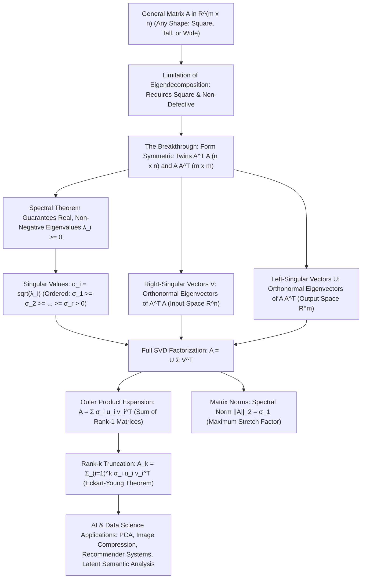
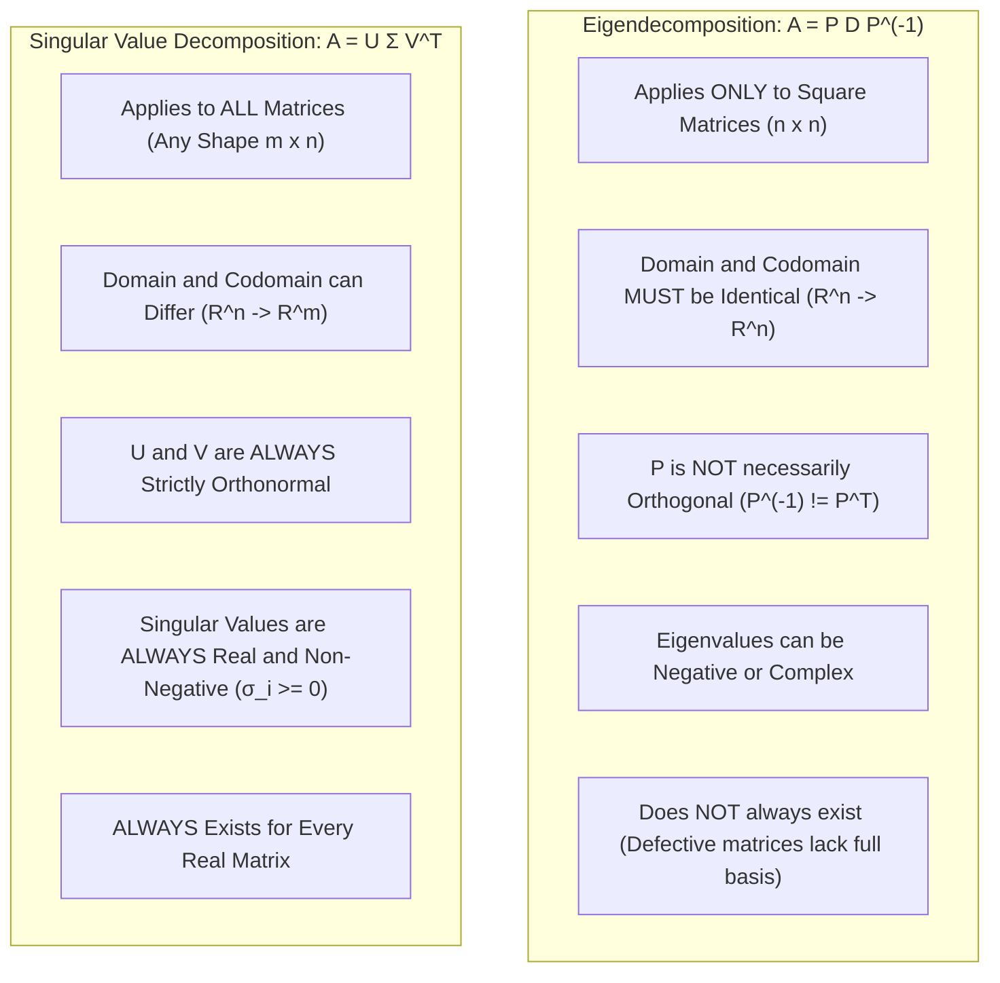

# Comprehensive Master Study Guide: Singular Value Decomposition (SVD) & Matrix Approximations
**Course:** Mathematical Foundations for Machine Learning & Data Science — Lecture 5  
**Target Audience:** Complete Beginners in Mathematics (Zero Knowledge Assumed $\to$ Path to Mastery)  
**Primary Reference:** Lecture 5 Presentation Slides (*BITS Pilani WILPD - CSIS / MFML & MFDS Team*)

---

## Welcome & Pedagogical Roadmap

Welcome to **Lecture 5**! Let us take a moment to appreciate the intellectual journey we have traversed together so far:

* In **Lecture 1 (Linear Algebra & Systems of Equations)**, we learned the computational mechanics of linear systems ($A\mathbf{x} = \mathbf{b}$), Gaussian elimination, row echelon forms, and matrix inverses. That was the study of **computation and linear equations**.
* In **Lecture 2 (Vector Spaces)**, we zoomed out to see the algebraic universe where vectors live: spans, linear independence, subspaces, bases, and dimension. That was the study of **structure and dimension**.
* In **Lecture 3 (Analytic Geometry)**, we equipped vector spaces with measuring tools: inner products, norms, metrics, angles, and orthogonality. We learned how to measure length, distance, and perpendicularity using tools like the Gram-Schmidt process. That was the study of **geometry and measurement**.
* In **Lecture 4 (Eigenvalues & Eigenvectors)**, we discovered the special invariant axes of square matrices: directions where a linear transformation acts as simple scalar multiplication ($A\mathbf{x} = \lambda \mathbf{x}$), culminating in the **Spectral Theorem** for symmetric matrices. That was the study of **square transformations and invariant directions**.

Now, in **Lecture 5**, we arrive at the absolute pinnacle of linear algebra: **The Singular Value Decomposition (SVD)**.



---

### The Fundamental Question: Why SVD?

In Lecture 4, we saw how satisfying it is to diagonalize a matrix:
$$A = P D P^{-1}$$
When a matrix is diagonalized, its complicated, coupled interactions untangle into simple, independent scalings along its eigenvector axes.

However, **Eigendecomposition has three severe real-world limitations**:
1. **It strictly requires a square matrix ($n \times n$).** But data in data science is almost *never* square! You might have $10{,}000$ customers ($m$ rows) and $50$ products ($n$ columns), or $50{,}000$ pixels ($m$ rows) across $500$ image samples ($n$ columns). A rectangular matrix cannot have eigenvalues because $A\mathbf{x}$ lives in an entirely different dimension ($\mathbb{R}^m$) than $\mathbf{x}$ ($\mathbb{R}^n$).
2. **Not all square matrices can be diagonalized.** If a matrix lacks a complete basis of linearly independent eigenvectors (a "defective" matrix), eigendecomposition completely breaks down.
3. **Eigenvalues can be complex or negative numbers**, which makes geometric interpretation as physical scaling factors difficult.

**Singular Value Decomposition (SVD) is the universal answer to these limitations.** SVD guarantees that **every single matrix**—square, rectangular, tall, short, invertible, or singular—can be cleanly decomposed into three geometric transformations:
$$\text{Rotation / Reflection} \longrightarrow \text{Independent Scaling} \longrightarrow \text{Rotation / Reflection}$$

Mathematically:
$$\mathbf{A = U \Sigma V^T}$$

---

### Why SVD is the Engine of Modern AI & Machine Learning

Every time you build a machine learning model, SVD is running behind the scenes:

1. **Dimensionality Reduction & Principal Component Analysis (PCA):** Modern machine learning models struggle with the "curse of dimensionality." SVD discovers the underlying low-dimensional hyperplane that captures the maximum variance in your data. In fact, PCA on centered data is computed directly using SVD.
2. **Image and Signal Compression:** An image is just a rectangular matrix of pixel intensities. SVD breaks the image into layers of "rank-1" matrices ordered by visual importance. By discarding tiny singular values, you can compress images by $80\%\text{--}90\%$ with almost zero perceptible loss in quality.
3. **Recommender Systems (The Netflix Prize):** How does Netflix predict which movies you will enjoy? By representing users and movies in a large rating matrix $A$, SVD decomposes the matrix into latent preferences (e.g., how much a user likes comedy vs. action, and how much a movie features comedy vs. action).
4. **Natural Language Processing & Latent Semantic Analysis (LSA):** SVD applied to term-document matrices reveals semantic relationships between words, identifying synonyms even if two words never appear in the same document.
5. **The Moore-Penrose Pseudoinverse & Over/Underdetermined Linear Systems:** When $A\mathbf{x} = \mathbf{b}$ has no exact solution (or infinitely many), SVD provides the pseudo-inverse $A^+ = V \Sigma^+ U^T$, giving the optimal least-squares solution used in linear regression.

---

### Mathematical Symbol Glossary

To ensure complete clarity and zero confusion, here is every symbol used throughout this study guide:

| Symbol | Name / Meaning | Beginner Interpretation / Example |
| :---: | :--- | :--- |
| $A \in \mathbb{R}^{m \times n}$ | Rectangular Matrix | A grid of real numbers with $m$ rows and $n$ columns. |
| $A^T$ | Matrix Transpose | Swapping rows and columns: entry $(i, j)$ moves to $(j, i)$. |
| $D$ | Diagonal Matrix | A square matrix with non-zero numbers only along the main diagonal. |
| $P$ | Modal Matrix | Matrix whose columns are the eigenvectors of a square matrix $A$. |
| $U \in \mathbb{R}^{m \times m}$ | Left-Singular Vector Matrix | An orthogonal matrix whose columns $\mathbf{u}_i$ form an orthonormal basis for the output space $\mathbb{R}^m$. |
| $V \in \mathbb{R}^{n \times n}$ | Right-Singular Vector Matrix | An orthogonal matrix whose columns $\mathbf{v}_i$ form an orthonormal basis for the input space $\mathbb{R}^n$. |
| $V^T \in \mathbb{R}^{n \times n}$ | Transpose of $V$ | The transpose of $V$; since $V$ is orthogonal, $V^T = V^{-1}$. |
| $\Sigma \in \mathbb{R}^{m \times n}$ | Singular Value Matrix | A rectangular matrix of the same size as $A$, containing singular values along the main diagonal and zeros elsewhere. |
| $\sigma_i$ | Singular Value ($i$-th) | The non-negative square root of the $i$-th eigenvalue of $A^T A$: $\sigma_i = \sqrt{\lambda_i(A^T A)}$. |
| $r = \mathrm{rank}(A)$ | Rank of Matrix $A$ | The number of linearly independent rows or columns; also the count of non-zero singular values. |
| $A^T A \in \mathbb{R}^{n \times n}$ | Input Covariance Twin | A square, symmetric, positive semi-definite matrix whose eigenvectors are $\mathbf{v}_i$. |
| $A A^T \in \mathbb{R}^{m \times m}$ | Output Covariance Twin | A square, symmetric, positive semi-definite matrix whose eigenvectors are $\mathbf{u}_i$. |
| $\mathbf{u}_i \mathbf{v}_i^T$ | Outer Product | A column vector ($m \times 1$) times a row vector ($1 \times n$), resulting in an $m \times n$ matrix of rank 1. |
| $A_k$ or $\widehat{A}^{(k)}$ | Rank-$k$ Approximation | The optimal low-rank matrix reconstructed using only the top $k$ singular values and vectors. |
| $\|A\|_2$ | Spectral Norm (Matrix 2-norm) | The maximum factor by which matrix $A$ can stretch any unit vector: $\|A\|_2 = \sigma_1$. |
| $\|A\|_F$ | Frobenius Norm | The Euclidean norm of all matrix entries: $\|A\|_F = \sqrt{\sum_{i,j} a_{ij}^2} = \sqrt{\sum \sigma_i^2}$. |
| $I$ or $I_n$ | Identity Matrix | Diagonal matrix of size $n \times n$ with $1$s on the diagonal and $0$s elsewhere. |
| $\delta_{ij}$ | Kronecker Delta | $\delta_{ij} = 1$ if $i = j$, and $0$ if $i \neq j$. |

---

## Part I: Foundational Bridge — Diagonal Matrices and Diagonalizability

Before we leap into the singular value decomposition of general rectangular matrices, we must thoroughly understand the simplest and most elegant matrices in mathematics: **Diagonal Matrices**, and what it means for a square matrix to be **Diagonalizable**.

---

### 1.1 What is a Diagonal Matrix?

A matrix $D \in \mathbb{R}^{n \times n}$ is called a **diagonal matrix** if every single entry outside the main diagonal is zero:
$$D = \begin{bmatrix} d_1 & 0 & \cdots & 0 \\ 0 & d_2 & \cdots & 0 \\ \vdots & \vdots & \ddots & \vdots \\ 0 & 0 & \cdots & d_n \end{bmatrix} = \mathrm{diag}(d_1, d_2, \dots, d_n)$$
Formally, entry $d_{ij} = 0$ whenever $i \neq j$. The diagonal entries $d_{ii} = d_i$ can be any real numbers (positive, negative, or zero).

#### The Geometric Intuition: Independent Axis Stretching
Imagine applying a linear transformation to a 2D plane:
$$\begin{bmatrix} x_{\text{new}} \\ y_{\text{new}} \end{bmatrix} = \begin{bmatrix} 3 & 0 \\ 0 & 0.5 \end{bmatrix} \begin{bmatrix} x \\ y \end{bmatrix} = \begin{bmatrix} 3x \\ 0.5y \end{bmatrix}$$
Notice what happened:
* The $x$-coordinate is multiplied by $3$, completely independent of $y$.
* The $y$-coordinate is multiplied by $0.5$, completely independent of $x$.

There is **zero cross-talk** and **zero mixing** between dimensions! A circle centered at the origin simply stretches along the coordinate axes into an ellipse aligned with the $x$ and $y$ axes.

```
       y                                       y
       ^                                       ^
       |                                       |
    1 -+  ***                                  |
       | *   *          Transformation         |     *****
-------+-------+--> x   =============>   ------+---------------+--> x
       | *   *          diag(3, 0.5)           |     *****
   -1 -+  ***                             -0.5 +
       |                                       |
    Unit Circle (Radius 1)               Stretched Ellipse (Axes along x and y)
```

---

### 1.2 The Three Magical Computational Properties of Diagonal Matrices

Diagonal matrices are the holy grail of scientific computing. Here is why:

#### 1. Determinant is Trivial to Compute
For a full $n \times n$ matrix, computing the determinant takes $O(n^3)$ operations. For a diagonal matrix, it is simply the product of its diagonal entries:
$$\det(D) = d_1 \cdot d_2 \cdots d_n = \prod_{i=1}^n d_i$$

*Example:*
$$\det\left(\begin{bmatrix} 4 & 0 & 0 \\ 0 & -2 & 0 \\ 0 & 0 & 5 \end{bmatrix}\right) = (4) \cdot (-2) \cdot (5) = -40$$

#### 2. Matrix Powers are Trivial
Multiplying an ordinary matrix by itself $k$ times ($A^k$) requires $k-1$ full matrix multiplications (millions of floating-point operations). For a diagonal matrix, you simply raise each diagonal entry to the power $k$:
$$D^k = \begin{bmatrix} d_1^k & 0 & \cdots & 0 \\ 0 & d_2^k & \cdots & 0 \\ \vdots & \vdots & \ddots & \vdots \\ 0 & 0 & \cdots & d_n^k \end{bmatrix}$$

*Example:*
$$\begin{bmatrix} 2 & 0 \\ 0 & 3 \end{bmatrix}^{10} = \begin{bmatrix} 2^{10} & 0 \\ 0 & 3^{10} \end{bmatrix} = \begin{bmatrix} 1024 & 0 \\ 0 & 59049 \end{bmatrix}$$

#### 3. Matrix Inverse is Trivial
Inverting a full $n \times n$ matrix is computationally expensive and numerically delicate. For a diagonal matrix, assuming none of the diagonal entries are zero ($d_i \neq 0$), the inverse is found simply by taking the reciprocal of each diagonal entry:
$$D^{-1} = \begin{bmatrix} \frac{1}{d_1} & 0 & \cdots & 0 \\ 0 & \frac{1}{d_2} & \cdots & 0 \\ \vdots & \vdots & \ddots & \vdots \\ 0 & 0 & \cdots & \frac{1}{d_n} \end{bmatrix}$$

*Example:*
$$\begin{bmatrix} 5 & 0 \\ 0 & -0.25 \end{bmatrix}^{-1} = \begin{bmatrix} \frac{1}{5} & 0 \\ 0 & \frac{1}{-0.25} \end{bmatrix} = \begin{bmatrix} 0.2 & 0 \\ 0 & -4 \end{bmatrix}$$

> [!NOTE]
> If any $d_i = 0$, then $\det(D) = 0$, meaning the matrix is singular (non-invertible). You cannot divide by zero!

---

### 1.3 What is a Diagonalizable Matrix?

Since diagonal matrices are so effortless to work with, mathematicians asked a natural question:
> *"If our matrix $A$ is not diagonal, can we change our point of view (change our coordinate system) so that $A$ acts like a diagonal matrix?"*

#### Formal Definition
A square matrix $A \in \mathbb{R}^{n \times n}$ is called **diagonalizable** if there exists an invertible matrix $P \in \mathbb{R}^{n \times n}$ and a diagonal matrix $D \in \mathbb{R}^{n \times n}$ such that:
$$D = P^{-1} A P \quad \Longleftrightarrow \quad A = P D P^{-1}$$

Let us understand the mechanics of this formula from first principles:
1. Multiply both sides on the left by $P$:
   $$P D = P (P^{-1} A P) = (P P^{-1}) A P = I A P = A P$$
   Therefore:
   $$A P = P D$$

2. Now let us look inside the matrices column by column. Let the columns of $P$ be denoted as $n$ vectors:
   $$P = \begin{bmatrix} \mathbf{p}_1 & \mathbf{p}_2 & \cdots & \mathbf{p}_n \end{bmatrix}$$
   And let $D$ have diagonal entries $\lambda_1, \lambda_2, \dots, \lambda_n$:
   $$D = \begin{bmatrix} \lambda_1 & 0 & \cdots & 0 \\ 0 & \lambda_2 & \cdots & 0 \\ \vdots & \vdots & \ddots & \vdots \\ 0 & 0 & \cdots & \lambda_n \end{bmatrix}$$

3. Compute the matrix product $AP$:
   $$AP = A \begin{bmatrix} \mathbf{p}_1 & \mathbf{p}_2 & \cdots & \mathbf{p}_n \end{bmatrix} = \begin{bmatrix} A\mathbf{p}_1 & A\mathbf{p}_2 & \cdots & A\mathbf{p}_n \end{bmatrix}$$

4. Compute the matrix product $PD$:
   $$PD = \begin{bmatrix} \mathbf{p}_1 & \mathbf{p}_2 & \cdots & \mathbf{p}_n \end{bmatrix} \begin{bmatrix} \lambda_1 & 0 & \cdots & 0 \\ 0 & \lambda_2 & \cdots & 0 \\ \vdots & \vdots & \ddots & \vdots \\ 0 & 0 & \cdots & \lambda_n \end{bmatrix} = \begin{bmatrix} \lambda_1 \mathbf{p}_1 & \lambda_2 \mathbf{p}_2 & \cdots & \lambda_n \mathbf{p}_n \end{bmatrix}$$

5. Equating the columns of $AP$ and $PD$:
   $$A\mathbf{p}_i = \lambda_i \mathbf{p}_i \quad \text{for every } i = 1, 2, \dots, n$$

Look at what we have just derived!
* This is the exact definition of an **eigenvector** and **eigenvalue** ($A\mathbf{x} = \lambda \mathbf{x}$)!
* The columns of $P$ must be the **eigenvectors** of $A$!
* The diagonal entries of $D$ must be the corresponding **eigenvalues** of $A$!
* Because $P$ must be invertible, its columns $\mathbf{p}_1, \dots, \mathbf{p}_n$ must be **linearly independent**.

> [!IMPORTANT]
> **The Fundamental Diagonalization Criterion:**
> An $n \times n$ matrix $A$ is diagonalizable **if and only if** it possesses $n$ linearly independent eigenvectors that form a basis for $\mathbb{R}^n$.

---

### 1.4 Step-by-Step Breakdown of Lecture Example 1

Let us verify this concept using the exact example presented on **Slide 6** of Lecture 5.

#### Problem Statement
Given the square matrix:
$$A = \begin{bmatrix} 1 & 4 \\ 2 & 3 \end{bmatrix}$$
and the candidate invertible matrix:
$$P = \begin{bmatrix} -2 & 1 \\ 1 & 1 \end{bmatrix}$$
Show that $P^{-1} A P$ produces a diagonal matrix $D$, and verify that the columns of $P$ are indeed eigenvectors of $A$.

---

#### Step 1: Compute the Matrix Inverse $P^{-1}$
Recall the formula for the inverse of any $2 \times 2$ matrix $M = \begin{bmatrix} a & b \\ c & d \end{bmatrix}$:
$$M^{-1} = \frac{1}{\det(M)} \begin{bmatrix} d & -b \\ -c & a \end{bmatrix} = \frac{1}{ad - bc} \begin{bmatrix} d & -b \\ -c & a \end{bmatrix}$$

For our matrix $P = \begin{bmatrix} -2 & 1 \\ 1 & 1 \end{bmatrix}$:
* $a = -2$, $b = 1$, $c = 1$, $d = 1$.
* Calculate the determinant:
  $$\det(P) = ad - bc = (-2)(1) - (1)(1) = -2 - 1 = -3$$
* Since $\det(P) = -3 \neq 0$, $P$ is invertible.
* Construct the adjugate matrix (swap diagonal elements, negate off-diagonal elements):
  $$\operatorname{adj}(P) = \begin{bmatrix} 1 & -1 \\ -1 & -2 \end{bmatrix}$$
* Multiply by $\frac{1}{\det(P)} = -\frac{1}{3}$:
  $$P^{-1} = -\frac{1}{3} \begin{bmatrix} 1 & -1 \\ -1 & -2 \end{bmatrix} = \begin{bmatrix} -\frac{1}{3} & \frac{1}{3} \\ \frac{1}{3} & \frac{2}{3} \end{bmatrix}$$

---

#### Step 2: Compute the Intermediate Matrix Product $AP$
Let us multiply $A$ by $P$:
$$AP = \begin{bmatrix} 1 & 4 \\ 2 & 3 \end{bmatrix} \begin{bmatrix} -2 & 1 \\ 1 & 1 \end{bmatrix}$$

We compute each of the four entries using row-by-column dot products:
* **Row 1, Column 1:** $(1)(-2) + (4)(1) = -2 + 4 = 2$
* **Row 1, Column 2:** $(1)(1) + (4)(1) = 1 + 4 = 5$
* **Row 2, Column 1:** $(2)(-2) + (3)(1) = -4 + 3 = -1$
* **Row 2, Column 2:** $(2)(1) + (3)(1) = 2 + 3 = 5$

Therefore:
$$AP = \begin{bmatrix} 2 & 5 \\ -1 & 5 \end{bmatrix}$$

---

#### Step 3: Compute the Final Product $P^{-1}(AP)$
Now, multiply $P^{-1}$ by $(AP)$:
$$D = P^{-1} (AP) = \begin{bmatrix} -\frac{1}{3} & \frac{1}{3} \\ \frac{1}{3} & \frac{2}{3} \end{bmatrix} \begin{bmatrix} 2 & 5 \\ -1 & 5 \end{bmatrix}$$

Let us compute each entry carefully:
* **Entry $(1,1)$:**
  $$\left(-\frac{1}{3}\right)(2) + \left(\frac{1}{3}\right)(-1) = -\frac{2}{3} - \frac{1}{3} = -\frac{3}{3} = -1$$
* **Entry $(1,2)$:**
  $$\left(-\frac{1}{3}\right)(5) + \left(\frac{1}{3}\right)(5) = -\frac{5}{3} + \frac{5}{3} = 0$$
* **Entry $(2,1)$:**
  $$\left(\frac{1}{3}\right)(2) + \left(\frac{2}{3}\right)(-1) = \frac{2}{3} - \frac{2}{3} = 0$$
* **Entry $(2,2)$:**
  $$\left(\frac{1}{3}\right)(5) + \left(\frac{2}{3}\right)(5) = \frac{5}{3} + \frac{10}{3} = \frac{15}{3} = 5$$

Putting it all together:
$$D = \begin{bmatrix} -1 & 0 \\ 0 & 5 \end{bmatrix}$$
This matches Slide 6 of Lecture 5.

---

#### Step 4: Verification of Eigenpairs
Notice the diagonal entries of $D$:
$$\lambda_1 = -1, \quad \lambda_2 = 5$$
Let us verify that the columns of $P$, namely $\mathbf{p}_1 = \begin{bmatrix} -2 \\ 1 \end{bmatrix}$ and $\mathbf{p}_2 = \begin{bmatrix} 1 \\ 1 \end{bmatrix}$, satisfy $A\mathbf{p} = \lambda \mathbf{p}$:

* For Column 1:
  $$A\mathbf{p}_1 = \begin{bmatrix} 1 & 4 \\ 2 & 3 \end{bmatrix} \begin{bmatrix} -2 \\ 1 \end{bmatrix} = \begin{bmatrix} (1)(-2) + (4)(1) \\ (2)(-2) + (3)(1) \end{bmatrix} = \begin{bmatrix} 2 \\ -1 \end{bmatrix} = -1 \begin{bmatrix} -2 \\ 1 \end{bmatrix} = \lambda_1 \mathbf{p}_1 \quad \checkmark$$
* For Column 2:
  $$A\mathbf{p}_2 = \begin{bmatrix} 1 & 4 \\ 2 & 3 \end{bmatrix} \begin{bmatrix} 1 \\ 1 \end{bmatrix} = \begin{bmatrix} (1)(1) + (4)(1) \\ (2)(1) + (3)(1) \end{bmatrix} = \begin{bmatrix} 5 \\ 5 \end{bmatrix} = 5 \begin{bmatrix} 1 \\ 1 \end{bmatrix} = \lambda_2 \mathbf{p}_2 \quad \checkmark$$

The columns of $P$ are confirmed to be the eigenvectors of $A$, and $D$ contains the corresponding eigenvalues.

---

## Part II: Eigendecomposition of Symmetric Matrices

Now let us examine what happens when our square matrix is **symmetric** ($A = A^T$). This leads directly to the **Spectral Theorem**, which serves as the theoretical bridge to SVD.

### 2.1 Symmetric Matrices & The Spectral Theorem

A real matrix $A \in \mathbb{R}^{n \times n}$ is called **symmetric** if it equals its own transpose:
$$A = A^T \quad \Longleftrightarrow \quad a_{ij} = a_{ji} \text{ for all } i, j$$

For example:
$$A = \begin{bmatrix} 2.5 & -1 \\ -1 & 2.5 \end{bmatrix}$$
The entry in row 1, col 2 is $-1$, and the entry in row 2, col 1 is also $-1$. It is symmetric.

> [!IMPORTANT]
> **The Spectral Theorem for Real Symmetric Matrices:**
> If $A \in \mathbb{R}^{n \times n}$ is real and symmetric, then:
> 1. All $n$ eigenvalues $\lambda_1, \lambda_2, \dots, \lambda_n$ are **guaranteed to be real numbers** (never complex numbers with imaginary components).
> 2. Eigenvectors corresponding to distinct eigenvalues are **mutually orthogonal** ($\mathbf{p}_i \cdot \mathbf{p}_j = 0$ for $i \neq j$).
> 3. $A$ can always be diagonalized by an **orthogonal matrix** $P$ whose columns are orthonormal eigenvectors:
>    $$P^T P = P P^T = I \quad \Longleftrightarrow \quad P^{-1} = P^T$$
> 4. The eigendecomposition takes the special orthogonal form:
>    $$A = P D P^T$$

Notice the massive computational benefit: **we never need to calculate a matrix inverse $P^{-1}$!** The inverse is simply the transpose $P^T$.

---

### 2.2 Step-by-Step Breakdown of Lecture Example 2

Let us solve the complete eigendecomposition problem presented on **Slides 8, 9, and 10** of Lecture 5.

#### Problem Statement
Compute the full eigendecomposition of the symmetric matrix:
$$A = \begin{bmatrix} 2.5 & -1 \\ -1 & 2.5 \end{bmatrix}$$

---

#### Step 1: Find the Eigenvalues using the Characteristic Equation
Recall that eigenvalues $\lambda$ satisfy:
$$\det(A - \lambda I) = 0$$

Let us construct the matrix $A - \lambda I$:
$$A - \lambda I = \begin{bmatrix} 2.5 & -1 \\ -1 & 2.5 \end{bmatrix} - \begin{bmatrix} \lambda & 0 \\ 0 & \lambda \end{bmatrix} = \begin{bmatrix} 2.5 - \lambda & -1 \\ -1 & 2.5 - \lambda \end{bmatrix}$$

Now, calculate its determinant:
$$\det(A - \lambda I) = (2.5 - \lambda)(2.5 - \lambda) - (-1)(-1) = (2.5 - \lambda)^2 - 1$$

Let us expand $(2.5 - \lambda)^2$:
$$(2.5 - \lambda)^2 = 2.5^2 - 2(2.5)\lambda + \lambda^2 = 6.25 - 5\lambda + \lambda^2$$

Subtract $1$:
$$\det(A - \lambda I) = \lambda^2 - 5\lambda + 6.25 - 1 = \lambda^2 - 5\lambda + 5.25$$

Notice that $5.25 = \frac{21}{4}$. Thus, the characteristic equation is:
$$\lambda^2 - 5\lambda + \frac{21}{4} = 0$$
This is the exact equation on **Slide 8**.

Let us solve this quadratic equation using the quadratic formula:
$$\lambda = \frac{-b \pm \sqrt{b^2 - 4ac}}{2a}$$
where $a = 1$, $b = -5$, and $c = \frac{21}{4}$:
* Discriminant:
  $$b^2 - 4ac = (-5)^2 - 4(1)\left(\frac{21}{4}\right) = 25 - 21 = 4$$
* Roots:
  $$\lambda = \frac{-(-5) \pm \sqrt{4}}{2(1)} = \frac{5 \pm 2}{2}$$

This yields two distinct real eigenvalues:
$$\lambda_1 = \frac{5 + 2}{2} = \frac{7}{2} = 3.5$$
$$\lambda_2 = \frac{5 - 2}{2} = \frac{3}{2} = 1.5$$

---

#### Step 2: Find the Eigenvector for $\lambda_1 = 3.5$
Substitute $\lambda_1 = 3.5$ into $(A - \lambda I)\mathbf{x} = \mathbf{0}$:
$$\begin{bmatrix} 2.5 - 3.5 & -1 \\ -1 & 2.5 - 3.5 \end{bmatrix} \begin{bmatrix} x_1 \\ x_2 \end{bmatrix} = \begin{bmatrix} 0 \\ 0 \end{bmatrix}$$
$$\begin{bmatrix} -1 & -1 \\ -1 & -1 \end{bmatrix} \begin{bmatrix} x_1 \\ x_2 \end{bmatrix} = \begin{bmatrix} 0 \\ 0 \end{bmatrix}$$

Both rows yield the identical linear equation:
$$-x_1 - x_2 = 0 \quad \implies \quad x_2 = -x_1$$

Choose a convenient value, say $x_1 = -1$, which gives $x_2 = 1$:
$$\mathbf{v}_1 = \begin{bmatrix} -1 \\ 1 \end{bmatrix}$$

Now, **normalize** $\mathbf{v}_1$ so it has unit length ($\|\mathbf{p}_1\|_2 = 1$):
$$\|\mathbf{v}_1\|_2 = \sqrt{(-1)^2 + (1)^2} = \sqrt{1 + 1} = \sqrt{2}$$
$$\mathbf{p}_1 = \frac{1}{\|\mathbf{v}_1\|_2} \mathbf{v}_1 = \frac{1}{\sqrt{2}} \begin{bmatrix} -1 \\ 1 \end{bmatrix} = \begin{bmatrix} -\frac{1}{\sqrt{2}} \\ \frac{1}{\sqrt{2}} \end{bmatrix}$$
This matches **Slide 9**.

---

#### Step 3: Find the Eigenvector for $\lambda_2 = 1.5$
Substitute $\lambda_2 = 1.5$ into $(A - \lambda I)\mathbf{x} = \mathbf{0}$:
$$\begin{bmatrix} 2.5 - 1.5 & -1 \\ -1 & 2.5 - 1.5 \end{bmatrix} \begin{bmatrix} x_1 \\ x_2 \end{bmatrix} = \begin{bmatrix} 0 \\ 0 \end{bmatrix}$$
$$\begin{bmatrix} 1 & -1 \\ -1 & 1 \end{bmatrix} \begin{bmatrix} x_1 \\ x_2 \end{bmatrix} = \begin{bmatrix} 0 \\ 0 \end{bmatrix}$$

Both rows yield the equation:
$$x_1 - x_2 = 0 \quad \implies \quad x_1 = x_2$$

Choose $x_1 = 1$, which gives $x_2 = 1$:
$$\mathbf{v}_2 = \begin{bmatrix} 1 \\ 1 \end{bmatrix}$$

Normalize $\mathbf{v}_2$ to unit length:
$$\|\mathbf{v}_2\|_2 = \sqrt{1^2 + 1^2} = \sqrt{2}$$
$$\mathbf{p}_2 = \frac{1}{\|\mathbf{v}_2\|_2} \mathbf{v}_2 = \frac{1}{\sqrt{2}} \begin{bmatrix} 1 \\ 1 \end{bmatrix} = \begin{bmatrix} \frac{1}{\sqrt{2}} \\ \frac{1}{\sqrt{2}} \end{bmatrix}$$
This matches **Slide 9**.

Check that $\mathbf{p}_1$ and $\mathbf{p}_2$ are orthogonal:
$$\mathbf{p}_1 \cdot \mathbf{p}_2 = \left(-\frac{1}{\sqrt{2}}\right)\left(\frac{1}{\sqrt{2}}\right) + \left(\frac{1}{\sqrt{2}}\right)\left(\frac{1}{\sqrt{2}}\right) = -\frac{1}{2} + \frac{1}{2} = 0 \quad \checkmark$$

---

#### Step 4: Construct the Transformation Matrices $P$, $D$, and $P^{-1}$
Place the normalized eigenvectors as the columns of $P$:
$$P = \begin{bmatrix} \mathbf{p}_1 & \mathbf{p}_2 \end{bmatrix} = \begin{bmatrix} -\frac{1}{\sqrt{2}} & \frac{1}{\sqrt{2}} \\ \frac{1}{\sqrt{2}} & \frac{1}{\sqrt{2}} \end{bmatrix}$$

Place the corresponding eigenvalues along the diagonal of $D$:
$$D = \begin{bmatrix} \lambda_1 & 0 \\ 0 & \lambda_2 \end{bmatrix} = \begin{bmatrix} 3.5 & 0 \\ 0 & 1.5 \end{bmatrix}$$

Because $P$ is an orthogonal matrix, $P^{-1} = P^T$:
$$P^{-1} = P^T = \begin{bmatrix} -\frac{1}{\sqrt{2}} & \frac{1}{\sqrt{2}} \\ \frac{1}{\sqrt{2}} & \frac{1}{\sqrt{2}} \end{bmatrix}$$
*(Note: Because this specific $P$ is symmetric, $P^T = P$, so $P^{-1} = P$. On Slide 10, the presentation orders columns slightly differently; both orderings are mathematically identical as long as eigenvalues match their respective eigenvectors.)*

---

#### Step 5: Verify the Factorization $A = P D P^T$
Let us multiply $P D P^T$ to confirm it reconstitutes $A$:
1. Multiply $P D$:
   $$PD = \begin{bmatrix} -\frac{1}{\sqrt{2}} & \frac{1}{\sqrt{2}} \\ \frac{1}{\sqrt{2}} & \frac{1}{\sqrt{2}} \end{bmatrix} \begin{bmatrix} 3.5 & 0 \\ 0 & 1.5 \end{bmatrix} = \begin{bmatrix} -\frac{3.5}{\sqrt{2}} & \frac{1.5}{\sqrt{2}} \\ \frac{3.5}{\sqrt{2}} & \frac{1.5}{\sqrt{2}} \end{bmatrix}$$

2. Multiply $(PD) P^T$:
   $$A = \begin{bmatrix} -\frac{3.5}{\sqrt{2}} & \frac{1.5}{\sqrt{2}} \\ \frac{3.5}{\sqrt{2}} & \frac{1.5}{\sqrt{2}} \end{bmatrix} \begin{bmatrix} -\frac{1}{\sqrt{2}} & \frac{1}{\sqrt{2}} \\ \frac{1}{\sqrt{2}} & \frac{1}{\sqrt{2}} \end{bmatrix}$$

   * Entry $(1,1)$:
     $$\left(-\frac{3.5}{\sqrt{2}}\right)\left(-\frac{1}{\sqrt{2}}\right) + \left(\frac{1.5}{\sqrt{2}}\right)\left(\frac{1}{\sqrt{2}}\right) = \frac{3.5}{2} + \frac{1.5}{2} = \frac{5.0}{2} = 2.5 \quad \checkmark$$
   * Entry $(1,2)$:
     $$\left(-\frac{3.5}{\sqrt{2}}\right)\left(\frac{1}{\sqrt{2}}\right) + \left(\frac{1.5}{\sqrt{2}}\right)\left(\frac{1}{\sqrt{2}}\right) = -\frac{3.5}{2} + \frac{1.5}{2} = -\frac{2.0}{2} = -1.0 \quad \checkmark$$
   * Entry $(2,1)$:
     $$\left(\frac{3.5}{\sqrt{2}}\right)\left(-\frac{1}{\sqrt{2}}\right) + \left(\frac{1.5}{\sqrt{2}}\right)\left(\frac{1}{\sqrt{2}}\right) = -\frac{3.5}{2} + \frac{1.5}{2} = -\frac{2.0}{2} = -1.0 \quad \checkmark$$
   * Entry $(2,2)$:
     $$\left(\frac{3.5}{\sqrt{2}}\right)\left(\frac{1}{\sqrt{2}}\right) + \left(\frac{1.5}{\sqrt{2}}\right)\left(\frac{1}{\sqrt{2}}\right) = \frac{3.5}{2} + \frac{1.5}{2} = \frac{5.0}{2} = 2.5 \quad \checkmark$$

The product exactly yields $\begin{bmatrix} 2.5 & -1 \\ -1 & 2.5 \end{bmatrix} = A$. The factorization is verified.

---

## Part III: The Singular Value Decomposition (SVD) Theorem

We now move from the realm of square, symmetric matrices to **arbitrary rectangular matrices**. This is the core theme of Lecture 5.

### 3.1 The Geometry of SVD: Hyper-Spheres to Hyper-Ellipsoids

What does a rectangular matrix $A \in \mathbb{R}^{m \times n}$ do geometrically?
* It takes vectors from an $n$-dimensional input space $\mathbb{R}^n$ and maps them into an $m$-dimensional output space $\mathbb{R}^m$.
* If you take a **unit hyper-sphere** in the input space ($S = \{\mathbf{x} \in \mathbb{R}^n \mid \|\mathbf{x}\|_2 = 1\}$), the linear mapping $A$ deforms it into a **hyper-ellipsoid** in the output space $\mathbb{R}^m$!

```
     Input Space R^n                                   Output Space R^m
           v_2                                               u_2
            ^                                                 ^
            |                                                 |   .-------.
            |                                                 |  /    |    \
     -------+-------> v_1     === Matrix Mapping A ===>  -----+-------+-----> u_1
            |                                                 |  \  σ_2| σ_1/
            |                                                 |   '-------'
     Unit Sphere ||x|| = 1                              Hyper-Ellipsoid Ax
```

The geometric interpretation of SVD:
1. The **principal semi-axes** of this output ellipsoid have lengths $\sigma_1, \sigma_2, \dots, \sigma_r$. These lengths are the **Singular Values**.
2. The unit directions along these principal semi-axes are the vectors $\mathbf{u}_1, \mathbf{u}_2, \dots, \mathbf{u}_m$. These are the **Left-Singular Vectors**.
3. The unit vectors in the input space that map directly onto these semi-axes are $\mathbf{v}_1, \mathbf{v}_2, \dots, \mathbf{v}_n$. These are the **Right-Singular Vectors**.

Therefore:
$$A \mathbf{v}_i = \sigma_i \mathbf{u}_i$$

---

### 3.2 Formal Statement of the SVD Theorem

> [!IMPORTANT]
> **The Singular Value Decomposition Theorem (Slide 13):**
> Let $A \in \mathbb{R}^{m \times n}$ be any real rectangular matrix of rank $r$. Then $A$ can be factored as:
> $$A = U \Sigma V^T$$
> where:
> 1. $U \in \mathbb{R}^{m \times m}$ is an **orthogonal matrix** whose columns $\mathbf{u}_1, \dots, \mathbf{u}_m$ are called the **left-singular vectors** of $A$ ($U^T U = U U^T = I_m$).
> 2. $V \in \mathbb{R}^{n \times n}$ is an **orthogonal matrix** whose columns $\mathbf{v}_1, \dots, \mathbf{v}_n$ are called the **right-singular vectors** of $A$ ($V^T V = V V^T = I_n$).
> 3. $\Sigma \in \mathbb{R}^{m \times n}$ is an $m \times n$ **rectangular diagonal matrix** containing the singular values $\sigma_i$ along its main diagonal:
>    $$\Sigma_{ii} = \sigma_i \quad \text{for } i = 1, 2, \dots, r$$
>    The singular values are strictly positive and conventionally arranged in non-increasing order:
>    $$\sigma_1 \ge \sigma_2 \ge \cdots \ge \sigma_r > 0$$
>    All other entries of $\Sigma$ are zero.

---

### 3.3 Anatomy and Dimensions of $\Sigma$ (Slide 14)

A common point of confusion for beginners is that $\Sigma$ is **not square** unless $A$ is square. $\Sigma$ has the exact same dimensions as $A$ ($m$ rows and $n$ columns).

Let us visualize the structure for the three possible cases:

#### Case 1: Tall Matrix ($m > n$, more rows than columns)
Here, $A$ has more rows than columns (e.g., $4 \times 2$). The matrix $\Sigma$ consists of an $n \times n$ diagonal submatrix followed by rows of pure zeros at the bottom:
$$\Sigma = \begin{bmatrix} \sigma_1 & 0 \\ 0 & \sigma_2 \\ 0 & 0 \\ 0 & 0 \end{bmatrix} = \begin{bmatrix} \Sigma_{\text{diag}} \\ \mathbf{0} \end{bmatrix}$$

#### Case 2: Wide Matrix ($m < n$, more columns than rows)
Here, $A$ has fewer rows than columns (e.g., $2 \times 3$, like the lecture example). The matrix $\Sigma$ consists of an $m \times m$ diagonal submatrix followed by columns of pure zeros on the right:
$$\Sigma = \begin{bmatrix} \sigma_1 & 0 & 0 \\ 0 & \sigma_2 & 0 \end{bmatrix} = \begin{bmatrix} \Sigma_{\text{diag}} & \mathbf{0} \end{bmatrix}$$

#### Case 3: Square Matrix ($m = n$)
$$\Sigma = \begin{bmatrix} \sigma_1 & 0 \\ 0 & \sigma_2 \end{bmatrix}$$

> [!NOTE]
> While the singular vectors $U$ and $V$ are not uniquely determined (for example, you can multiply both $\mathbf{u}_i$ and $\mathbf{v}_i$ by $-1$ and the decomposition still holds), the **singular values $\sigma_1, \sigma_2, \dots, \sigma_r$ and the matrix $\Sigma$ are completely UNIQUE!**

---

## Part IV: The Mathematical Construction of $U$, $\Sigma$, and $V$

How do we actually discover $U$, $\Sigma$, and $V$? We use a clever trick: we multiply $A$ by its transpose $A^T$ to construct two symmetric "twin" matrices.

### 4.1 The Symmetric Twins: $A^T A$ and $A A^T$

Given any rectangular matrix $A \in \mathbb{R}^{m \times n}$:
1. **The Input Twin ($A^T A$):**
   * Size: $(n \times m) \times (m \times n) = \mathbf{n \times n}$ (square!).
   * Symmetry: $(A^T A)^T = A^T (A^T)^T = A^T A$ (symmetric!).
2. **The Output Twin ($A A^T$):**
   * Size: $(m \times n) \times (n \times m) = \mathbf{m \times m}$ (square!).
   * Symmetry: $(A A^T)^T = (A^T)^T A^T = A A^T$ (symmetric!).

Because both $A^T A$ and $A A^T$ are real symmetric matrices, the **Spectral Theorem** guarantees they can be orthogonally diagonalized!

---

### 4.2 Deriving the Right-Singular Vectors $V$ and $\Sigma$ (Slide 15)

Assume that the SVD exists: $A = U \Sigma V^T$. Let us compute $A^T A$:
$$A^T A = (U \Sigma V^T)^T (U \Sigma V^T) = (V \Sigma^T U^T) (U \Sigma V^T)$$

Since $U$ is an orthogonal matrix, $U^T U = I_m$:
$$A^T A = V \Sigma^T (U^T U) \Sigma V^T = V (\Sigma^T \Sigma) V^T$$

Notice the form of this equation:
$$A^T A = V (\Sigma^T \Sigma) V^T$$
Compare this with the standard orthogonal eigendecomposition of a symmetric matrix:
$$S = P D P^T$$

This provides two direct insights:
1. **$V$ is the orthogonal matrix of eigenvectors of $A^T A$!** The columns of $V$ ($\mathbf{v}_1, \dots, \mathbf{v}_n$) are the eigenvectors of $A^T A$.
2. **The diagonal entries of $\Sigma^T \Sigma$ are the eigenvalues of $A^T A$!**
   $$\lambda_i(A^T A) = \sigma_i^2 \quad \implies \quad \sigma_i = \sqrt{\lambda_i(A^T A)}$$

---

### 4.3 Deriving the Left-Singular Vectors $U$ (Slides 16 & 17)

Now let us compute $A A^T$:
$$A A^T = (U \Sigma V^T) (U \Sigma V^T)^T = (U \Sigma V^T) (V \Sigma^T U^T)$$

Since $V$ is an orthogonal matrix, $V^T V = I_n$:
$$A A^T = U \Sigma (V^T V) \Sigma^T U^T = U (\Sigma \Sigma^T) U^T$$

Again, compare this with $S = P D P^T$:
* **$U$ is the orthogonal matrix of eigenvectors of $A A^T$!**
* The non-zero diagonal entries of $\Sigma \Sigma^T$ are the exact same non-zero eigenvalues $\lambda_i(A A^T) = \sigma_i^2$.

---

### 4.4 The Critical Connecting Equation: Why You Should NOT Compute $U$ Independently

We could find $U$ by finding the eigenvectors of $AA^T$, but **doing so independently carries a major trap for beginners**:
Eigenvectors have an arbitrary sign ($\pm \mathbf{u}_i$). If you independently compute eigenvectors of $A^T A$ to get $V$ and eigenvectors of $AA^T$ to get $U$, their relative signs might not match, causing $U \Sigma V^T = -A$ instead of $A$!

To avoid this pitfall, we use the **Connecting Equation** from **Slide 17**:
$$A = U \Sigma V^T$$

Multiply both sides on the right by $V$:
$$A V = U \Sigma (V^T V) = U \Sigma I_n = U \Sigma$$

Looking at column $i$ on both sides:
$$A \mathbf{v}_i = \sigma_i \mathbf{u}_i$$

Since $\sigma_i > 0$, we can divide both sides by $\sigma_i$:
$$\mathbf{u}_i = \frac{1}{\sigma_i} A \mathbf{v}_i \quad \text{for } i = 1, 2, \dots, r$$

> [!TIP]
> **The Golden Recipe for SVD:**
> 1. Form the smaller of the two matrices ($A^T A$ or $AA^T$). Usually, if $m < n$, $AA^T$ is smaller ($m \times m$); if $m > n$, $A^T A$ is smaller ($n \times n$).
> 2. Find the eigenvalues $\lambda_i$ and sort them: $\lambda_1 \ge \lambda_2 \ge \dots > 0$.
> 3. Compute the singular values: $\sigma_i = \sqrt{\lambda_i}$.
> 4. Find the orthonormal eigenvectors $\mathbf{v}_i$ of $A^T A$.
> 5. Generate each left-singular vector using $\mathbf{u}_i = \frac{1}{\sigma_i} A \mathbf{v}_i$. This guarantees consistent signs.

---

## Part V: Deep-Dive Master Calculation — The Complete SVD of Lecture Example 3

Let us now walk step-by-step through the numerical example that spans **Slides 18, 19, 20, 21, and 22** of Lecture 5. No intermediate algebraic or arithmetic step will be skipped.

### Problem Statement
Find the full Singular Value Decomposition ($A = U \Sigma V^T$) of the rectangular $2 \times 3$ matrix:
$$A = \begin{bmatrix} 1 & 0 & 1 \\ -2 & 1 & 0 \end{bmatrix}$$

---

### Step 1: Compute the Transpose $A^T$ and the Product $A^T A$
The matrix $A$ has $m = 2$ rows and $n = 3$ columns.
Its transpose $A^T$ swaps rows and columns, resulting in a $3 \times 2$ matrix:
$$A^T = \begin{bmatrix} 1 & -2 \\ 0 & 1 \\ 1 & 0 \end{bmatrix}$$

Now, let us compute the $3 \times 3$ matrix $A^T A$:
$$A^T A = \begin{bmatrix} 1 & -2 \\ 0 & 1 \\ 1 & 0 \end{bmatrix} \begin{bmatrix} 1 & 0 & 1 \\ -2 & 1 & 0 \end{bmatrix}$$

Let us compute all 9 entries using dot products of the rows of $A^T$ with the columns of $A$:
* **Row 1 $\cdot$ Column 1:** $(1)(1) + (-2)(-2) = 1 + 4 = 5$
* **Row 1 $\cdot$ Column 2:** $(1)(0) + (-2)(1) = 0 - 2 = -2$
* **Row 1 $\cdot$ Column 3:** $(1)(1) + (-2)(0) = 1 + 0 = 1$
* **Row 2 $\cdot$ Column 1:** $(0)(1) + (1)(-2) = 0 - 2 = -2$
* **Row 2 $\cdot$ Column 2:** $(0)(0) + (1)(1) = 0 + 1 = 1$
* **Row 2 $\cdot$ Column 3:** $(0)(1) + (1)(0) = 0 + 0 = 0$
* **Row 3 $\cdot$ Column 1:** $(1)(1) + (0)(-2) = 1 + 0 = 1$
* **Row 3 $\cdot$ Column 2:** $(1)(0) + (0)(1) = 0 + 0 = 0$
* **Row 3 $\cdot$ Column 3:** $(1)(1) + (0)(0) = 1 + 0 = 1$

Putting these entries together:
$$A^T A = \begin{bmatrix} 5 & -2 & 1 \\ -2 & 1 & 0 \\ 1 & 0 & 1 \end{bmatrix}$$
This matches **Slide 18**. Notice that $A^T A$ is symmetric ($(-2) = (-2)$, $1 = 1$, $0 = 0$).

---

### Step 2: Set Up and Solve the Characteristic Equation of $A^T A$
We seek the eigenvalues $\lambda$ satisfying $\det(A^T A - \lambda I) = 0$:
$$\det\begin{bmatrix} 5 - \lambda & -2 & 1 \\ -2 & 1 - \lambda & 0 \\ 1 & 0 & 1 - \lambda \end{bmatrix} = 0$$

Let us expand this $3 \times 3$ determinant along **Row 3** (because it contains a zero, making calculation easier):
$$\det = a_{31} C_{31} + a_{32} C_{32} + a_{33} C_{33}$$
where $C_{ij} = (-1)^{i+j} M_{ij}$.

1. **First term ($a_{31} = 1$, position sign $(-1)^{3+1} = +1$):**
   $$+1 \cdot \det\begin{bmatrix} -2 & 1 \\ 1 - \lambda & 0 \end{bmatrix} = 1 \cdot \Big( (-2)(0) - (1)(1 - \lambda) \Big) = -(1 - \lambda)$$

2. **Second term ($a_{32} = 0$, position sign $(-1)^{3+2} = -1$):**
   $$-0 \cdot \det(\dots) = 0$$

3. **Third term ($a_{33} = 1 - \lambda$, position sign $(-1)^{3+3} = +1$):**
   $$+(1 - \lambda) \cdot \det\begin{bmatrix} 5 - \lambda & -2 \\ -2 & 1 - \lambda \end{bmatrix} = (1 - \lambda) \Big( (5 - \lambda)(1 - \lambda) - (-2)(-2) \Big)$$
   Let us expand $(5 - \lambda)(1 - \lambda) - 4$:
   $$(5 - \lambda)(1 - \lambda) - 4 = (5 - 5\lambda - \lambda + \lambda^2) - 4 = \lambda^2 - 6\lambda + 5 - 4 = \lambda^2 - 6\lambda + 1$$
   So the third term is:
   $$(1 - \lambda)(\lambda^2 - 6\lambda + 1)$$

4. **Combine all terms:**
   $$\det(A^T A - \lambda I) = -(1 - \lambda) + (1 - \lambda)(\lambda^2 - 6\lambda + 1)$$

   Notice that $(1 - \lambda)$ is a **common factor**! Let us factor it out:
   $$\det = (1 - \lambda) \Big[ -1 + (\lambda^2 - 6\lambda + 1) \Big]$$
   $$-1 + 1 \text{ cancels out}:$$
   $$\det = (1 - \lambda) (\lambda^2 - 6\lambda) = (1 - \lambda) \lambda (\lambda - 6)$$

5. **Set the determinant to zero:**
   $$\lambda (1 - \lambda) (6 - \lambda) = 0 \quad \Longleftrightarrow \quad -\lambda (\lambda - 1) (\lambda - 6) = 0$$

The three eigenvalues are:
$$\lambda_1 = 6, \quad \lambda_2 = 1, \quad \lambda_3 = 0$$

Sort them in descending order:
$$\lambda_1 = 6 \ge \lambda_2 = 1 \ge \lambda_3 = 0$$

---

### Step 3: Compute the Singular Values $\Sigma$ (Slide 20)
The singular values are the square roots of the non-negative eigenvalues:
$$\sigma_1 = \sqrt{\lambda_1} = \sqrt{6}$$
$$\sigma_2 = \sqrt{\lambda_2} = \sqrt{1} = 1$$
$$\sigma_3 = \sqrt{\lambda_3} = \sqrt{0} = 0$$

Since $A$ is $2 \times 3$, its rank is $r = 2$ (the number of non-zero singular values).
The matrix $\Sigma$ must have the exact shape of $A$ ($2 \times 3$):
$$\Sigma = \begin{bmatrix} \sigma_1 & 0 & 0 \\ 0 & \sigma_2 & 0 \end{bmatrix} = \begin{bmatrix} \sqrt{6} & 0 & 0 \\ 0 & 1 & 0 \end{bmatrix}$$
This matches **Slide 20**. The last column is entirely zeros because the rank is 2.

---

### Step 4: Find the Right-Singular Vectors $\mathbf{v}_1, \mathbf{v}_2, \mathbf{v}_3$ (Slide 19)

We find the eigenvectors of $A^T A$ for each eigenvalue by solving $(A^T A - \lambda I)\mathbf{v} = \mathbf{0}$.

#### Calculation 4A: Eigenvector for $\lambda_1 = 6$
Substitute $\lambda = 6$ into $(A^T A - \lambda I)\mathbf{v} = \mathbf{0}$:
$$\begin{bmatrix} 5 - 6 & -2 & 1 \\ -2 & 1 - 6 & 0 \\ 1 & 0 & 1 - 6 \end{bmatrix} \begin{bmatrix} x \\ y \\ z \end{bmatrix} = \begin{bmatrix} -1 & -2 & 1 \\ -2 & -5 & 0 \\ 1 & 0 & -5 \end{bmatrix} \begin{bmatrix} x \\ y \\ z \end{bmatrix} = \begin{bmatrix} 0 \\ 0 \\ 0 \end{bmatrix}$$

Let us write out the system of equations:
1. $-x - 2y + z = 0$
2. $-2x - 5y = 0 \implies 5y = -2x \implies y = -\frac{2}{5}x$
3. $x - 5z = 0 \implies x = 5z \implies z = \frac{1}{5}x$

To eliminate fractions, let $z = 1$:
* From Equation 3: $x = 5(1) = 5$
* From Equation 2: $y = -\frac{2}{5}(5) = -2$
* Check Equation 1: $-(5) - 2(-2) + (1) = -5 + 4 + 1 = 0 \quad \checkmark$

So the eigenvector is:
$$\mathbf{v}_1' = \begin{bmatrix} 5 \\ -2 \\ 1 \end{bmatrix}$$

Now, compute its Euclidean length (norm):
$$\|\mathbf{v}_1'\|_2 = \sqrt{5^2 + (-2)^2 + 1^2} = \sqrt{25 + 4 + 1} = \sqrt{30}$$

Normalize by dividing by $\sqrt{30}$:
$$\mathbf{v}_1 = \frac{1}{\sqrt{30}} \begin{bmatrix} 5 \\ -2 \\ 1 \end{bmatrix} = \begin{bmatrix} \frac{5}{\sqrt{30}} \\ -\frac{2}{\sqrt{30}} \\ \frac{1}{\sqrt{30}} \end{bmatrix}$$

---

#### Calculation 4B: Eigenvector for $\lambda_2 = 1$
Substitute $\lambda = 1$ into $(A^T A - \lambda I)\mathbf{v} = \mathbf{0}$:
$$\begin{bmatrix} 5 - 1 & -2 & 1 \\ -2 & 1 - 1 & 0 \\ 1 & 0 & 1 - 1 \end{bmatrix} \begin{bmatrix} x \\ y \\ z \end{bmatrix} = \begin{bmatrix} 4 & -2 & 1 \\ -2 & 0 & 0 \\ 1 & 0 & 0 \end{bmatrix} \begin{bmatrix} x \\ y \\ z \end{bmatrix} = \begin{bmatrix} 0 \\ 0 \\ 0 \end{bmatrix}$$

Look at the third row:
$$1x + 0y + 0z = 0 \implies x = 0$$

Substitute $x = 0$ into the first row:
$$4(0) - 2y + z = 0 \implies -2y + z = 0 \implies z = 2y$$

Choose $y = 1$:
* $x = 0$
* $y = 1$
* $z = 2(1) = 2$

So the eigenvector is:
$$\mathbf{v}_2' = \begin{bmatrix} 0 \\ 1 \\ 2 \end{bmatrix}$$

Compute its length:
$$\|\mathbf{v}_2'\|_2 = \sqrt{0^2 + 1^2 + 2^2} = \sqrt{0 + 1 + 4} = \sqrt{5}$$

Normalize:
$$\mathbf{v}_2 = \frac{1}{\sqrt{5}} \begin{bmatrix} 0 \\ 1 \\ 2 \end{bmatrix} = \begin{bmatrix} 0 \\ \frac{1}{\sqrt{5}} \\ \frac{2}{\sqrt{5}} \end{bmatrix}$$

---

#### Calculation 4C: Eigenvector for $\lambda_3 = 0$
Substitute $\lambda = 0$ into $(A^T A - \lambda I)\mathbf{v} = \mathbf{0}$:
$$\begin{bmatrix} 5 & -2 & 1 \\ -2 & 1 & 0 \\ 1 & 0 & 1 \end{bmatrix} \begin{bmatrix} x \\ y \\ z \end{bmatrix} = \begin{bmatrix} 0 \\ 0 \\ 0 \end{bmatrix}$$

From row 3:
$$x + z = 0 \implies z = -x$$

From row 2:
$$-2x + y = 0 \implies y = 2x$$

Check row 1:
$$5x - 2(2x) + (-x) = 5x - 4x - x = 0 \quad \checkmark$$

On Slide 19, they selected $x = -1$:
* $x = -1$
* $y = 2(-1) = -2$
* $z = -(-1) = 1$

So the eigenvector is:
$$\mathbf{v}_3' = \begin{bmatrix} -1 \\ -2 \\ 1 \end{bmatrix}$$

Compute its length:
$$\|\mathbf{v}_3'\|_2 = \sqrt{(-1)^2 + (-2)^2 + 1^2} = \sqrt{1 + 4 + 1} = \sqrt{6}$$

Normalize:
$$\mathbf{v}_3 = \frac{1}{\sqrt{6}} \begin{bmatrix} -1 \\ -2 \\ 1 \end{bmatrix} = \begin{bmatrix} -\frac{1}{\sqrt{6}} \\ -\frac{2}{\sqrt{6}} \\ \frac{1}{\sqrt{6}} \end{bmatrix}$$

---

#### Construct the Complete Matrix $V$
Assemble the three orthonormal columns:
$$V = \begin{bmatrix} \mathbf{v}_1 & \mathbf{v}_2 & \mathbf{v}_3 \end{bmatrix} = \begin{bmatrix} \frac{5}{\sqrt{30}} & 0 & -\frac{1}{\sqrt{6}} \\ -\frac{2}{\sqrt{30}} & \frac{1}{\sqrt{5}} & -\frac{2}{\sqrt{6}} \\ \frac{1}{\sqrt{30}} & \frac{2}{\sqrt{5}} & \frac{1}{\sqrt{6}} \end{bmatrix}$$
This matches the matrix $P$ shown on **Slide 19**.

---

### Step 5: Compute the Left-Singular Vectors $\mathbf{u}_1, \mathbf{u}_2$ (Slide 21)

We use the fundamental formula $\mathbf{u}_i = \frac{1}{\sigma_i} A \mathbf{v}_i$.

#### Computing $\mathbf{u}_1$:
$$\mathbf{u}_1 = \frac{1}{\sigma_1} A \mathbf{v}_1 = \frac{1}{\sqrt{6}} \begin{bmatrix} 1 & 0 & 1 \\ -2 & 1 & 0 \end{bmatrix} \begin{bmatrix} \frac{5}{\sqrt{30}} \\ -\frac{2}{\sqrt{30}} \\ \frac{1}{\sqrt{30}} \end{bmatrix}$$

First, calculate the matrix-vector product $A \mathbf{v}_1$:
* Row 1:
  $$(1)\left(\frac{5}{\sqrt{30}}\right) + (0)\left(-\frac{2}{\sqrt{30}}\right) + (1)\left(\frac{1}{\sqrt{30}}\right) = \frac{5 + 0 + 1}{\sqrt{30}} = \frac{6}{\sqrt{30}}$$
* Row 2:
  $$(-2)\left(\frac{5}{\sqrt{30}}\right) + (1)\left(-\frac{2}{\sqrt{30}}\right) + (0)\left(\frac{1}{\sqrt{30}}\right) = \frac{-10 - 2 + 0}{\sqrt{30}} = \frac{-12}{\sqrt{30}}$$

So:
$$A \mathbf{v}_1 = \begin{bmatrix} \frac{6}{\sqrt{30}} \\ -\frac{12}{\sqrt{30}} \end{bmatrix}$$

Now, multiply by $\frac{1}{\sigma_1} = \frac{1}{\sqrt{6}}$:
$$\mathbf{u}_1 = \frac{1}{\sqrt{6}} \begin{bmatrix} \frac{6}{\sqrt{30}} \\ -\frac{12}{\sqrt{30}} \end{bmatrix} = \begin{bmatrix} \frac{6}{\sqrt{180}} \\ -\frac{12}{\sqrt{180}} \end{bmatrix}$$

Simplify the radical $\sqrt{180}$:
$$\sqrt{180} = \sqrt{36 \times 5} = 6\sqrt{5}$$

Therefore:
$$\mathbf{u}_1 = \begin{bmatrix} \frac{6}{6\sqrt{5}} \\ -\frac{12}{6\sqrt{5}} \end{bmatrix} = \begin{bmatrix} \frac{1}{\sqrt{5}} \\ -\frac{2}{\sqrt{5}} \end{bmatrix}$$
This matches **Slide 21**.

Check unit norm:
$$\|\mathbf{u}_1\|_2 = \sqrt{\left(\frac{1}{\sqrt{5}}\right)^2 + \left(-\frac{2}{\sqrt{5}}\right)^2} = \sqrt{\frac{1}{5} + \frac{4}{5}} = \sqrt{1} = 1 \quad \checkmark$$

---

#### Computing $\mathbf{u}_2$:
$$\mathbf{u}_2 = \frac{1}{\sigma_2} A \mathbf{v}_2 = \frac{1}{1} \begin{bmatrix} 1 & 0 & 1 \\ -2 & 1 & 0 \end{bmatrix} \begin{bmatrix} 0 \\ \frac{1}{\sqrt{5}} \\ \frac{2}{\sqrt{5}} \end{bmatrix}$$

Calculate the matrix-vector product $A \mathbf{v}_2$:
* Row 1:
  $$(1)(0) + (0)\left(\frac{1}{\sqrt{5}}\right) + (1)\left(\frac{2}{\sqrt{5}}\right) = \frac{2}{\sqrt{5}}$$
* Row 2:
  $$(-2)(0) + (1)\left(\frac{1}{\sqrt{5}}\right) + (0)\left(\frac{2}{\sqrt{5}}\right) = \frac{1}{\sqrt{5}}$$

Therefore:
$$\mathbf{u}_2 = \begin{bmatrix} \frac{2}{\sqrt{5}} \\ \frac{1}{\sqrt{5}} \end{bmatrix}$$
This matches **Slide 21**.

Check unit norm:
$$\|\mathbf{u}_2\|_2 = \sqrt{\left(\frac{2}{\sqrt{5}}\right)^2 + \left(\frac{1}{\sqrt{5}}\right)^2} = \sqrt{\frac{4}{5} + \frac{1}{5}} = 1 \quad \checkmark$$

Check orthogonality between $\mathbf{u}_1$ and $\mathbf{u}_2$:
$$\mathbf{u}_1 \cdot \mathbf{u}_2 = \left(\frac{1}{\sqrt{5}}\right)\left(\frac{2}{\sqrt{5}}\right) + \left(-\frac{2}{\sqrt{5}}\right)\left(\frac{1}{\sqrt{5}}\right) = \frac{2}{5} - \frac{2}{5} = 0 \quad \checkmark$$

---

#### Construct the Matrix $U$
Assemble the orthonormal columns:
$$U = \begin{bmatrix} \mathbf{u}_1 & \mathbf{u}_2 \end{bmatrix} = \begin{bmatrix} \frac{1}{\sqrt{5}} & \frac{2}{\sqrt{5}} \\ -\frac{2}{\sqrt{5}} & \frac{1}{\sqrt{5}} \end{bmatrix}$$

---

### Step 6: Final Assembly and Verification of $A = U \Sigma V^T$ (Slide 22)

Putting all three matrices together:
$$A = U \Sigma V^T$$
$$A = \begin{bmatrix} \frac{1}{\sqrt{5}} & \frac{2}{\sqrt{5}} \\ -\frac{2}{\sqrt{5}} & \frac{1}{\sqrt{5}} \end{bmatrix} \begin{bmatrix} \sqrt{6} & 0 & 0 \\ 0 & 1 & 0 \end{bmatrix} \begin{bmatrix} \frac{5}{\sqrt{30}} & 0 & -\frac{1}{\sqrt{6}} \\ -\frac{2}{\sqrt{30}} & \frac{1}{\sqrt{5}} & -\frac{2}{\sqrt{6}} \\ \frac{1}{\sqrt{30}} & \frac{2}{\sqrt{5}} & \frac{1}{\sqrt{6}} \end{bmatrix}^T$$

Let us explicitly multiply these matrices to verify that they reproduce $A$:

#### 1. Compute the product $U \Sigma$:
$$U \Sigma = \begin{bmatrix} \frac{1}{\sqrt{5}} & \frac{2}{\sqrt{5}} \\ -\frac{2}{\sqrt{5}} & \frac{1}{\sqrt{5}} \end{bmatrix} \begin{bmatrix} \sqrt{6} & 0 & 0 \\ 0 & 1 & 0 \end{bmatrix} = \begin{bmatrix} \frac{\sqrt{6}}{\sqrt{5}} & \frac{2}{\sqrt{5}} & 0 \\ -\frac{2\sqrt{6}}{\sqrt{5}} & \frac{1}{\sqrt{5}} & 0 \end{bmatrix}$$

#### 2. Write out $V^T$ (transposing $V$):
$$V^T = \begin{bmatrix} \frac{5}{\sqrt{30}} & -\frac{2}{\sqrt{30}} & \frac{1}{\sqrt{30}} \\ 0 & \frac{1}{\sqrt{5}} & \frac{2}{\sqrt{5}} \\ -\frac{1}{\sqrt{6}} & -\frac{2}{\sqrt{6}} & \frac{1}{\sqrt{6}} \end{bmatrix}$$

#### 3. Compute $(U \Sigma) V^T$:
* **Entry $(1,1)$:**
  $$\left(\frac{\sqrt{6}}{\sqrt{5}}\right)\left(\frac{5}{\sqrt{30}}\right) + \left(\frac{2}{\sqrt{5}}\right)(0) + (0)\left(-\frac{1}{\sqrt{6}}\right) = \frac{5\sqrt{6}}{\sqrt{150}} + 0 + 0$$
  Since $\sqrt{150} = \sqrt{25 \times 6} = 5\sqrt{6}$:
  $$\text{Entry }(1,1) = \frac{5\sqrt{6}}{5\sqrt{6}} = 1 \quad \checkmark$$

* **Entry $(1,2)$:**
  $$\left(\frac{\sqrt{6}}{\sqrt{5}}\right)\left(-\frac{2}{\sqrt{30}}\right) + \left(\frac{2}{\sqrt{5}}\right)\left(\frac{1}{\sqrt{5}}\right) + (0)\left(-\frac{2}{\sqrt{6}}\right) = -\frac{2\sqrt{6}}{\sqrt{150}} + \frac{2}{5} = -\frac{2\sqrt{6}}{5\sqrt{6}} + \frac{2}{5} = -\frac{2}{5} + \frac{2}{5} = 0 \quad \checkmark$$

* **Entry $(1,3)$:**
  $$\left(\frac{\sqrt{6}}{\sqrt{5}}\right)\left(\frac{1}{\sqrt{30}}\right) + \left(\frac{2}{\sqrt{5}}\right)\left(\frac{2}{\sqrt{5}}\right) + 0 = \frac{\sqrt{6}}{\sqrt{150}} + \frac{4}{5} = \frac{\sqrt{6}}{5\sqrt{6}} + \frac{4}{5} = \frac{1}{5} + \frac{4}{5} = \frac{5}{5} = 1 \quad \checkmark$$

* **Entry $(2,1)$:**
  $$\left(-\frac{2\sqrt{6}}{\sqrt{5}}\right)\left(\frac{5}{\sqrt{30}}\right) + \left(\frac{1}{\sqrt{5}}\right)(0) + 0 = -\frac{10\sqrt{6}}{\sqrt{150}} = -\frac{10\sqrt{6}}{5\sqrt{6}} = -2 \quad \checkmark$$

* **Entry $(2,2)$:**
  $$\left(-\frac{2\sqrt{6}}{\sqrt{5}}\right)\left(-\frac{2}{\sqrt{30}}\right) + \left(\frac{1}{\sqrt{5}}\right)\left(\frac{1}{\sqrt{5}}\right) + 0 = \frac{4\sqrt{6}}{\sqrt{150}} + \frac{1}{5} = \frac{4\sqrt{6}}{5\sqrt{6}} + \frac{1}{5} = \frac{4}{5} + \frac{1}{5} = 1 \quad \checkmark$$

* **Entry $(2,3)$:**
  $$\left(-\frac{2\sqrt{6}}{\sqrt{5}}\right)\left(\frac{1}{\sqrt{30}}\right) + \left(\frac{1}{\sqrt{5}}\right)\left(\frac{2}{\sqrt{5}}\right) + 0 = -\frac{2\sqrt{6}}{5\sqrt{6}} + \frac{2}{5} = -\frac{2}{5} + \frac{2}{5} = 0 \quad \checkmark$$

Assembling these entries:
$$(U\Sigma) V^T = \begin{bmatrix} 1 & 0 & 1 \\ -2 & 1 & 0 \end{bmatrix} = A$$
The decomposition is accurate down to the smallest fraction.

---

## Part VI: SVD vs. Eigendecomposition (EVD) — The Comprehensive Comparison

Slides 23, 24, and 25 of Lecture 5 emphasize the deep distinctions between Eigendecomposition (EVD) and Singular Value Decomposition (SVD). Understanding these differences is essential for machine learning interviews and advanced coursework.



---

### Detailed Comparison Table

| Feature / Property | Eigendecomposition (EVD: $A = PDP^{-1}$) | Singular Value Decomposition (SVD: $A = U\Sigma V^T$) |
| :--- | :--- | :--- |
| **Applicability** | Only square matrices ($n \times n$). | **Every rectangular matrix** ($m \times n$). |
| **Existence** | Not guaranteed (fails for defective matrices). | **Always guaranteed to exist** for any matrix. |
| **Basis Vectors** | Uses a single basis $P$ (and its inverse $P^{-1}$). | Uses **two distinct bases**: input basis $V$ and output basis $U$. |
| **Orthogonality** | Columns of $P$ are generally *not* orthogonal (unless $A$ is symmetric). | Columns of $U$ and $V$ are **always strictly orthonormal** ($U^T U = I_m, V^T V = I_n$). |
| **Domain / Codomain** | Maps from a space to itself: $\mathbb{R}^n \to \mathbb{R}^n$. | Can map between different spaces: $\mathbb{R}^n \to \mathbb{R}^m$. |
| **Values along Diagonal** | Eigenvalues $\lambda_i$ can be **negative, zero, or complex**. | Singular values $\sigma_i$ are **always real, non-negative, and sorted**: $\sigma_1 \ge \sigma_2 \ge \dots \ge 0$. |
| **Geometric Meaning** | Directions that do not rotate ($A\mathbf{x} = \lambda \mathbf{x}$). | Semi-axes lengths of the hyper-ellipsoid formed by transforming the unit sphere. |
| **Matrix Relationships** | Diagonalizing matrices are inverses: $P$ and $P^{-1}$. | $U$ and $V$ are generally independent matrices of different sizes ($m \times m$ vs $n \times n$). |
| **Connection to Covariance** | Eigendecomposition of $A$ has no direct covariance link. | $V$ diagonalizes $A^T A$ (input covariance); $U$ diagonalizes $AA^T$ (output covariance). |

---

## Part VII: Matrix Approximation & The Outer Product Expansion

In modern data science, you rarely keep the full SVD. Instead, SVD's greatest superpower is its ability to represent a massive matrix as a sum of simple building blocks, enabling **data compression** and **noise filtering**.

### 7.1 The Outer Product Expansion (Slides 26 & 27)

Recall from Lecture 2 that if $\mathbf{u} \in \mathbb{R}^m$ is a column vector ($m \times 1$) and $\mathbf{v} \in \mathbb{R}^n$ is a column vector ($n \times 1$), then their **outer product** $\mathbf{u}\mathbf{v}^T$ is an $m \times n$ matrix of rank 1:
$$\mathbf{u} \mathbf{v}^T = \begin{bmatrix} u_1 \\ u_2 \\ \vdots \\ u_m \end{bmatrix} \begin{bmatrix} v_1 & v_2 & \cdots & v_n \end{bmatrix} = \begin{bmatrix} u_1 v_1 & u_1 v_2 & \cdots & u_1 v_n \\ u_2 v_1 & u_2 v_2 & \cdots & u_2 v_n \\ \vdots & \vdots & \ddots & \vdots \\ u_m v_1 & u_m v_2 & \cdots & u_m v_n \end{bmatrix}$$

Because $\Sigma$ is a diagonal matrix, the matrix multiplication $A = U \Sigma V^T$ can be rewritten as a sum of rank-1 matrices weighted by their singular values:

$$A = \sum_{i=1}^r \sigma_i \mathbf{u}_i \mathbf{v}_i^T = \sigma_1 \mathbf{u}_1 \mathbf{v}_1^T + \sigma_2 \mathbf{u}_2 \mathbf{v}_2^T + \cdots + \sigma_r \mathbf{u}_r \mathbf{v}_r^T$$

Each piece $A_i = \sigma_i \mathbf{u}_i \mathbf{v}_i^T$ is called a **rank-1 component**.

---

### 7.2 Numerical Demonstration: Deconstructing the Lecture Example

Let us take the values from our solved example and explicitly compute the rank-1 outer product matrices!

Recall:
$$\sigma_1 = \sqrt{6}, \quad \mathbf{u}_1 = \begin{bmatrix} \frac{1}{\sqrt{5}} \\ -\frac{2}{\sqrt{5}} \end{bmatrix}, \quad \mathbf{v}_1 = \begin{bmatrix} \frac{5}{\sqrt{30}} \\ -\frac{2}{\sqrt{30}} \\ \frac{1}{\sqrt{30}} \end{bmatrix}$$
$$\sigma_2 = 1, \quad \mathbf{u}_2 = \begin{bmatrix} \frac{2}{\sqrt{5}} \\ \frac{1}{\sqrt{5}} \end{bmatrix}, \quad \mathbf{v}_2 = \begin{bmatrix} 0 \\ \frac{1}{\sqrt{5}} \\ \frac{2}{\sqrt{5}} \end{bmatrix}$$

#### Term 1: $\sigma_1 \mathbf{u}_1 \mathbf{v}_1^T$
$$\sigma_1 \mathbf{u}_1 \mathbf{v}_1^T = \sqrt{6} \begin{bmatrix} \frac{1}{\sqrt{5}} \\ -\frac{2}{\sqrt{5}} \end{bmatrix} \begin{bmatrix} \frac{5}{\sqrt{30}} & -\frac{2}{\sqrt{30}} & \frac{1}{\sqrt{30}} \end{bmatrix}$$

Combine the scalars in front:
$$\sqrt{6} \cdot \frac{1}{\sqrt{5}} \cdot \frac{1}{\sqrt{30}} = \frac{\sqrt{6}}{\sqrt{150}} = \frac{\sqrt{6}}{5\sqrt{6}} = \frac{1}{5}$$

Now compute the outer product of $\begin{bmatrix} 1 \\ -2 \end{bmatrix}$ and $\begin{bmatrix} 5 & -2 & 1 \end{bmatrix}$:
$$\begin{bmatrix} 1 \\ -2 \end{bmatrix} \begin{bmatrix} 5 & -2 & 1 \end{bmatrix} = \begin{bmatrix} (1)(5) & (1)(-2) & (1)(1) \\ (-2)(5) & (-2)(-2) & (-2)(1) \end{bmatrix} = \begin{bmatrix} 5 & -2 & 1 \\ -10 & 4 & -2 \end{bmatrix}$$

Multiply by the scalar $\frac{1}{5}$:
$$\sigma_1 \mathbf{u}_1 \mathbf{v}_1^T = \frac{1}{5} \begin{bmatrix} 5 & -2 & 1 \\ -10 & 4 & -2 \end{bmatrix} = \begin{bmatrix} 1 & -0.4 & 0.2 \\ -2 & 0.8 & -0.4 \end{bmatrix}$$

---

#### Term 2: $\sigma_2 \mathbf{u}_2 \mathbf{v}_2^T$
$$\sigma_2 \mathbf{u}_2 \mathbf{v}_2^T = 1 \cdot \begin{bmatrix} \frac{2}{\sqrt{5}} \\ \frac{1}{\sqrt{5}} \end{bmatrix} \begin{bmatrix} 0 & \frac{1}{\sqrt{5}} & \frac{2}{\sqrt{5}} \end{bmatrix}$$

Combine the scalars:
$$\frac{1}{\sqrt{5}} \cdot \frac{1}{\sqrt{5}} = \frac{1}{5}$$

Compute the outer product of $\begin{bmatrix} 2 \\ 1 \end{bmatrix}$ and $\begin{bmatrix} 0 & 1 & 2 \end{bmatrix}$:
$$\begin{bmatrix} 2 \\ 1 \end{bmatrix} \begin{bmatrix} 0 & 1 & 2 \end{bmatrix} = \begin{bmatrix} (2)(0) & (2)(1) & (2)(2) \\ (1)(0) & (1)(1) & (1)(2) \end{bmatrix} = \begin{bmatrix} 0 & 2 & 4 \\ 0 & 1 & 2 \end{bmatrix}$$

Multiply by $\frac{1}{5}$:
$$\sigma_2 \mathbf{u}_2 \mathbf{v}_2^T = \frac{1}{5} \begin{bmatrix} 0 & 2 & 4 \\ 0 & 1 & 2 \end{bmatrix} = \begin{bmatrix} 0 & 0.4 & 0.8 \\ 0 & 0.2 & 0.4 \end{bmatrix}$$

---

#### Sum the Two Rank-1 Matrices:
$$\sigma_1 \mathbf{u}_1 \mathbf{v}_1^T + \sigma_2 \mathbf{u}_2 \mathbf{v}_2^T = \begin{bmatrix} 1 & -0.4 & 0.2 \\ -2 & 0.8 & -0.4 \end{bmatrix} + \begin{bmatrix} 0 & 0.4 & 0.8 \\ 0 & 0.2 & 0.4 \end{bmatrix}$$
$$= \begin{bmatrix} 1 + 0 & -0.4 + 0.4 & 0.2 + 0.8 \\ -2 + 0 & 0.8 + 0.2 & -0.4 + 0.4 \end{bmatrix} = \begin{bmatrix} 1 & 0 & 1 \\ -2 & 1 & 0 \end{bmatrix} = A \quad \checkmark$$

The outer product expansion works as intended.

---

### 7.3 Rank-$k$ Approximation (Slide 28)

What if a matrix has rank $r = 1000$, but we only want to keep the most important patterns?
Because the singular values are sorted in decreasing order ($\sigma_1 \ge \sigma_2 \ge \dots$), the earlier terms carry the vast majority of the "energy" or "information" of the matrix, while the later terms represent fine details or random noise.

If we stop the summation at $k < r$, we obtain the **Rank-$k$ Approximation** $A_k$ (also denoted $\widehat{A}^{(k)}$):
$$A_k = \sum_{i=1}^k \sigma_i \mathbf{u}_i \mathbf{v}_i^T = \sigma_1 \mathbf{u}_1 \mathbf{v}_1^T + \sigma_2 \mathbf{u}_2 \mathbf{v}_2^T + \cdots + \sigma_k \mathbf{u}_k \mathbf{v}_k^T$$

```
   Full Matrix A (m x n)                  Rank-k Approximation A_k
+-------------------------+             +-------------------------+
|                         |             |                         |
|   m x n Numbers         |    ====>    |  U_k (m x k)            |
|   Massive Storage       |             |  Σ_k (k x k)            |
|                         |             |  V_k^T (k x n)          |
+-------------------------+             +-------------------------+
                                        Stores only k(m + n + 1) numbers!
```

#### Massive Storage Savings
* Storing the original matrix $A$: requires **$m \times n$** numbers.
* Storing the rank-$k$ approximation: you only need to store $k$ vectors of $\mathbf{u}_i$ ($m \times k$), $k$ singular values ($k$), and $k$ vectors of $\mathbf{v}_i$ ($n \times k$).
  $$\text{Storage Required} = k(m + n + 1)$$

*Real-World Example:*
Suppose you have a high-resolution image of size $2000 \times 3000$ pixels.
* Raw image: $2000 \times 3000 = 6{,}000{,}000$ numbers.
* Rank-$50$ approximation ($k = 50$):
  $$50 \times (2000 + 3000 + 1) = 50 \times 5001 \approx 250{,}050 \text{ numbers}$$
* **Compression Ratio:** $\frac{250{,}050}{6{,}000{,}000} \approx 4.1\%$ of the original size! You achieve a **$96\%$ memory reduction** while preserving the visual features of the image.

---

### 7.4 The Eckart-Young-Mirsky Theorem

How do we know that $A_k$ is the *best* possible approximation? Could someone design a different rank-$k$ matrix that is closer to $A$?

The answer is **NO**. This is guaranteed by one of the most famous theorems in applied mathematics:

> [!IMPORTANT]
> **The Eckart-Young-Mirsky Theorem (1936):**
> Let $A \in \mathbb{R}^{m \times n}$ have rank $r$, and let $k < r$. The truncated SVD approximation:
> $$A_k = \sum_{i=1}^k \sigma_i \mathbf{u}_i \mathbf{v}_i^T$$
> is the **globally optimal** rank-$k$ approximation of $A$ that minimizes the error under both the Spectral Norm and the Frobenius Norm:
> $$\min_{\operatorname{rank}(B) \le k} \|A - B\|_2 = \|A - A_k\|_2 = \sigma_{k+1}$$
> $$\min_{\operatorname{rank}(B) \le k} \|A - B\|_F = \|A - A_k\|_F = \sqrt{\sum_{i=k+1}^r \sigma_i^2}$$

This theorem states:
* The error of the best rank-$k$ approximation under the spectral norm is **precisely the first discarded singular value** $\sigma_{k+1}$!
* If the singular values drop off rapidly (which happens in real data), the error drops to near zero very quickly.

---

## Part VIII: The Spectral Norm of a Matrix

To measure the distance between matrices, or to quantify how much a matrix can amplify a vector, we need the concept of a **matrix norm**.

### 8.1 What is an Induced Matrix Norm? (Slide 29)

For a vector $\mathbf{x} \in \mathbb{R}^n$, the Euclidean length is given by:
$$\|\mathbf{x}\|_2 = \sqrt{x_1^2 + x_2^2 + \cdots + x_n^2}$$

When a matrix $A$ acts on a vector $\mathbf{x}$, it outputs a new vector $A\mathbf{x}$.
How much can $A$ stretch the length of $\mathbf{x}$?
The **Spectral Norm** (also called the **matrix 2-norm**) is defined as the maximum amplification factor achievable for any non-zero vector:
$$\|A\|_2 = \max_{\mathbf{x} \neq \mathbf{0}} \frac{\|A\mathbf{x}\|_2}{\|\mathbf{x}\|_2} = \max_{\|\mathbf{x}\|_2 = 1} \|A\mathbf{x}\|_2$$

---

### 8.2 Theorem: The Spectral Norm is the Largest Singular Value

> [!IMPORTANT]
> **Theorem (Slide 29):**
> For any real matrix $A \in \mathbb{R}^{m \times n}$, its spectral norm is equal to its **largest singular value**:
> $$\|A\|_2 = \sigma_1 = \sqrt{\lambda_{\max}(A^T A)}$$

#### Intuitive Proof:
Using the SVD $A = U \Sigma V^T$:
$$\|A\mathbf{x}\|_2 = \|U \Sigma V^T \mathbf{x}\|_2$$
Because $U$ is an orthogonal matrix, multiplying by $U$ preserves Euclidean length ($\|U\mathbf{y}\|_2 = \|\mathbf{y}\|_2$ for any vector $\mathbf{y}$). Therefore:
$$\|A\mathbf{x}\|_2 = \|\Sigma (V^T \mathbf{x})\|_2$$
Let $\mathbf{z} = V^T \mathbf{x}$. Because $V^T$ is also orthogonal, it preserves length, meaning $\|\mathbf{z}\|_2 = \|\mathbf{x}\|_2 = 1$.
Now:
$$\|\Sigma \mathbf{z}\|_2 = \sqrt{\sigma_1^2 z_1^2 + \sigma_2^2 z_2^2 + \cdots + \sigma_r^2 z_r^2}$$
Since $\sigma_1 \ge \sigma_2 \ge \dots \ge \sigma_r > 0$ and $\sum z_i^2 = 1$, this sum is maximized when $z_1 = 1$ and all other $z_i = 0$:
$$\max_{\|\mathbf{z}\|_2 = 1} \|\Sigma \mathbf{z}\|_2 = \sqrt{\sigma_1^2(1) + 0 + \cdots} = \sigma_1$$
Thus, $\|A\|_2 = \sigma_1$. $\blacksquare$

---

### 8.3 Step-by-Step Breakdown of Lecture Example 4 (Slide 30)

Let us solve the exact example on **Slide 30** of Lecture 5 with all algebraic steps visible.

#### Problem Statement
Find the spectral norm $\|A\|_2$ of the matrix:
$$A = \begin{bmatrix} 1 & 2 \\ 3 & 4 \end{bmatrix}$$

---

#### Step 1: Compute $A^T A$
$$A^T = \begin{bmatrix} 1 & 3 \\ 2 & 4 \end{bmatrix}$$
$$A^T A = \begin{bmatrix} 1 & 3 \\ 2 & 4 \end{bmatrix} \begin{bmatrix} 1 & 2 \\ 3 & 4 \end{bmatrix}$$

Let us compute the 4 entries:
* **Row 1, Column 1:** $(1)(1) + (3)(3) = 1 + 9 = 10$
* **Row 1, Column 2:** $(1)(2) + (3)(4) = 2 + 12 = 14$
* **Row 2, Column 1:** $(2)(1) + (4)(3) = 2 + 12 = 14$
* **Row 2, Column 2:** $(2)(2) + (4)(4) = 4 + 16 = 20$

$$A^T A = \begin{bmatrix} 10 & 14 \\ 14 & 20 \end{bmatrix}$$

---

#### Step 2: Compute the Eigenvalues of $A^T A$
Set up the characteristic equation $\det(A^T A - \lambda I) = 0$:
$$\det\begin{bmatrix} 10 - \lambda & 14 \\ 14 & 20 - \lambda \end{bmatrix} = 0$$
$$(10 - \lambda)(20 - \lambda) - (14)(14) = 0$$

Expand the product:
$$200 - 10\lambda - 20\lambda + \lambda^2 - 196 = 0$$
$$\lambda^2 - 30\lambda + 4 = 0$$

Solve this quadratic equation using the quadratic formula:
$$\lambda = \frac{-b \pm \sqrt{b^2 - 4ac}}{2a} = \frac{30 \pm \sqrt{(-30)^2 - 4(1)(4)}}{2(1)}$$
$$(-30)^2 - 16 = 900 - 16 = 884$$
$$\lambda = \frac{30 \pm \sqrt{884}}{2}$$

Simplify $\sqrt{884}$:
$$\sqrt{884} = \sqrt{4 \times 221} = 2\sqrt{221}$$
$$\lambda = \frac{30 \pm 2\sqrt{221}}{2} = 15 \pm \sqrt{221}$$

Let us compute the decimal values:
$$\sqrt{221} \approx 14.8660687$$
* Largest eigenvalue:
  $$\lambda_1 = 15 + 14.8660687 = 29.8660687$$
* Smallest eigenvalue:
  $$\lambda_2 = 15 - 14.8660687 = 0.1339313$$

---

#### Step 3: Compute the Singular Values
Take the square root of the eigenvalues:
* **Largest Singular Value $\sigma_1$:**
  $$\sigma_1 = \sqrt{\lambda_1} = \sqrt{29.8660687} \approx 5.4649857 \approx 5.4650$$
* **Second Singular Value $\sigma_2$:**
  $$\sigma_2 = \sqrt{\lambda_2} = \sqrt{0.1339313} \approx 0.365966 \approx 0.3660$$

Thus, the singular value matrix is:
$$\Sigma = \begin{bmatrix} 5.4650 & 0 \\ 0 & 0.3660 \end{bmatrix}$$
This matches the numbers on **Slide 30**.

---

#### Step 4: Determine the Spectral Norm
By definition, the spectral norm is the largest singular value:
$$\|A\|_2 = \sigma_1 \approx 5.4650$$
This matches Slide 30.

---

## Part IX: SVD and the Four Fundamental Subspaces

In Lecture 2, we learned about the **Four Fundamental Subspaces** associated with any matrix $A \in \mathbb{R}^{m \times n}$:
1. The **Column Space** $\operatorname{Col}(A) \subseteq \mathbb{R}^m$ of dimension $r$.
2. The **Row Space** $\operatorname{Row}(A) = \operatorname{Col}(A^T) \subseteq \mathbb{R}^n$ of dimension $r$.
3. The **Null Space** $\operatorname{Null}(A) \subseteq \mathbb{R}^n$ of dimension $n - r$.
4. The **Left Null Space** $\operatorname{Null}(A^T) \subseteq \mathbb{R}^m$ of dimension $m - r$.

Gilbert Strang famously called this **"The Fundamental Theorem of Linear Algebra."** SVD serves as the master key that cleanly unlocks and diagonalizes all four subspaces simultaneously.

```
       Input Space R^n                                  Output Space R^m
+-----------------------------+                  +-----------------------------+
|                             |                  |                             |
|  Row Space Row(A)           |                  |  Column Space Col(A)        |
|  Basis: {v_1, v_2, ..., v_r}| === A v_i ===>   |  Basis: {u_1, u_2, ..., u_r}|
|                             |     = σ_i u_i    |                             |
+-----------------------------+                  +-----------------------------+
|                             |                  |                             |
|  Null Space Null(A)         |                  |  Left Null Space Null(A^T)  |
|  Basis: {v_(r+1), ..., v_n} | === A v_j ===>   |  Basis: {u_(r+1), ..., u_m} |
|                             |     = 0          |                             |
+-----------------------------+                  +-----------------------------+
```

### The SVD Orthonormal Bases for the Four Subspaces

Let $A = U \Sigma V^T$ with rank $r$:
* **Right-Singular Vectors $V = [\mathbf{v}_1, \dots, \mathbf{v}_r \mid \mathbf{v}_{r+1}, \dots, \mathbf{v}_n]$:**
  * The first $r$ vectors $\{\mathbf{v}_1, \dots, \mathbf{v}_r\}$ form an **orthonormal basis for the Row Space $\operatorname{Row}(A)$**.
  * The remaining $n - r$ vectors $\{\mathbf{v}_{r+1}, \dots, \mathbf{v}_n\}$ form an **orthonormal basis for the Null Space $\operatorname{Null}(A)$**.
* **Left-Singular Vectors $U = [\mathbf{u}_1, \dots, \mathbf{u}_r \mid \mathbf{u}_{r+1}, \dots, \mathbf{u}_m]$:**
  * The first $r$ vectors $\{\mathbf{u}_1, \dots, \mathbf{u}_r\}$ form an **orthonormal basis for the Column Space $\operatorname{Col}(A)$**.
  * The remaining $m - r$ vectors $\{\mathbf{u}_{r+1}, \dots, \mathbf{u}_m\}$ form an **orthonormal basis for the Left Null Space $\operatorname{Null}(A^T)$**.

This means SVD provides an explicit, orthogonal coordinate system that uncouples the mapping $A$:
* Every vector in the row space maps to an orthogonal axis in the column space, stretched by $\sigma_i$.
* Every vector in the null space is crushed to $\mathbf{0}$.

---

## Part X: Real-World Applications in Machine Learning & Data Science

### 10.1 Image Compression via Low-Rank Truncation

A grayscale digital image is nothing more than an $m \times n$ matrix where each entry represents the brightness of a pixel (e.g., $0 = \text{black}$, $255 = \text{white}$).

#### Algorithmic Workflow:
1. Load image as matrix $A \in \mathbb{R}^{m \times n}$.
2. Compute full SVD: $A = U \Sigma V^T$.
3. Choose a rank $k \ll \min(m, n)$ (e.g., $k = 20$).
4. Compute the compressed image:
   $$A_k = \sum_{i=1}^k \sigma_i \mathbf{u}_i \mathbf{v}_i^T$$
5. Store only the first $k$ columns of $U$, $k$ singular values of $\Sigma$, and $k$ columns of $V$.

#### Visual Progression:
* **$k = 5$:** Coarse shapes and broad illumination gradients visible; high compression.
* **$k = 20$:** Distinct objects, faces, and text readable; noise eliminated.
* **$k = 100$:** Visually indistinguishable from the original image; file size reduced significantly.

---

### 10.2 Principal Component Analysis (PCA) via SVD

In machine learning, **PCA** is the most widely used unsupervised learning technique for dimensionality reduction.

Suppose we have a dataset of $N$ data samples, each with $D$ features.
1. Center the data so that every feature has mean zero:
   $$X \in \mathbb{R}^{N \times D} \quad \text{where } \sum_{i=1}^N x_{ij} = 0$$
2. The sample covariance matrix is:
   $$C = \frac{1}{N - 1} X^T X \in \mathbb{R}^{D \times D}$$
3. Standard PCA requires finding the eigenvalues and eigenvectors of $C$. But computing $X^T X$ directly is computationally expensive and can double floating-point numerical errors!
4. **The Modern SVD Approach:** Instead of forming $X^T X$, simply compute the SVD of the centered data matrix directly:
   $$X = U \Sigma V^T$$
   Then:
   $$X^T X = (V \Sigma^T U^T)(U \Sigma V^T) = V (\Sigma^T \Sigma) V^T$$
   * The **principal directions** (eigenvectors of covariance $C$) are the columns of $V$!
   * The **variances** along principal directions are $\frac{\sigma_i^2}{N - 1}$.
   * The low-dimensional coordinates of the data points are given by $U \Sigma$.

Every machine learning library (such as Python's `scikit-learn` `PCA()`) uses SVD under the hood for this reason.

---

### 10.3 The Moore-Penrose Pseudoinverse ($A^+$)

In linear regression, we seek to solve $A\mathbf{x} = \mathbf{b}$.
* If $A$ is square and invertible: $\mathbf{x} = A^{-1} \mathbf{b}$.
* What if $A$ is rectangular, singular, or non-invertible?

Using SVD, $A = U \Sigma V^T$.
The **pseudoinverse** $A^+ \in \mathbb{R}^{n \times m}$ is defined as:
$$A^+ = V \Sigma^+ U^T$$
where $\Sigma^+ \in \mathbb{R}^{n \times m}$ is obtained by taking the reciprocal of every non-zero singular value ($\frac{1}{\sigma_i}$) and transposing the matrix:
$$\Sigma^+ = \begin{bmatrix} \frac{1}{\sigma_1} & 0 & \cdots & 0 \\ 0 & \frac{1}{\sigma_2} & \cdots & 0 \\ \vdots & \vdots & \ddots & \vdots \\ 0 & 0 & \cdots & 0 \end{bmatrix}$$

The optimal least-squares solution to any linear system $A\mathbf{x} = \mathbf{b}$ is given by:
$$\widehat{\mathbf{x}} = A^+ \mathbf{b} = V \Sigma^+ U^T \mathbf{b}$$
This solution is guaranteed to exist and have minimum Euclidean norm $\|\mathbf{x}\|_2$ among all possible solutions.

---

## Part XI: Comprehensive Summary & Quick Review Cheatsheet

### 1. Key Definitions & Formulas

```
+----------------------------------------------------------------------------------------+
| 1. SVD Factorization:       A = U Σ V^T                                                |
|    - A: m x n arbitrary matrix, rank r                                                 |
|    - U: m x m orthogonal matrix (columns u_i are left-singular vectors)                |
|    - Σ: m x n diagonal matrix (entries σ_1 >= σ_2 >= ... >= σ_r > 0)                   |
|    - V: n x n orthogonal matrix (columns v_i are right-singular vectors)               |
+----------------------------------------------------------------------------------------+
| 2. Connection to Twins:     A^T A = V (Σ^T Σ) V^T  ==> v_i are eigenvectors of A^T A   |
|                             A A^T = U (Σ Σ^T) U^T  ==> u_i are eigenvectors of A A^T   |
|                             σ_i = sqrt(λ_i(A^T A)) = sqrt(λ_i(A A^T))                  |
+----------------------------------------------------------------------------------------+
| 3. Generating Formula:      u_i = (1 / σ_i) A v_i    for i = 1, 2, ..., r              |
+----------------------------------------------------------------------------------------+
| 4. Outer Product Form:      A = Σ_(i=1)^r  σ_i u_i v_i^T                               |
+----------------------------------------------------------------------------------------+
| 5. Rank-k Approximation:    A_k = Σ_(i=1)^k  σ_i u_i v_i^T    (Optimal by Eckart-Young)|
+----------------------------------------------------------------------------------------+
| 6. Spectral Norm:           ||A||_2 = max_(||x||=1) ||Ax||_2 = σ_1 (Largest Singular)  |
|    Approximation Error:     ||A - A_k||_2 = σ_(k+1)                                    |
+----------------------------------------------------------------------------------------+
```

---

### 2. Common Beginner Pitfalls & How to Avoid Them

* **Pitfall 1: Confusing $\Sigma$ size with $A^T A$ size.**
  * *Correction:* $A^T A$ is always square ($n \times n$), but $\Sigma$ is the **same size as $A$** ($m \times n$). If $A$ is $2 \times 3$, $\Sigma$ must be $2 \times 3$!
* **Pitfall 2: Finding $U$ and $V$ independently and getting wrong signs.**
  * *Correction:* Never calculate both $U$ and $V$ as separate eigenvector problems. Always find $V$ first from $A^T A$, then calculate $U$ using $\mathbf{u}_i = \frac{1}{\sigma_i} A \mathbf{v}_i$. This ensures signs match.
* **Pitfall 3: Forgetting to transpose $V$ in $A = U \Sigma V^T$.**
  * *Correction:* The columns of $V$ are $\mathbf{v}_i$. Therefore, the rows of $V^T$ are $\mathbf{v}_i^T$.
* **Pitfall 4: Assuming singular values can be negative.**
  * *Correction:* Eigenvalues can be negative; **singular values are strictly non-negative ($\sigma_i \ge 0$)** because they represent physical lengths (semi-axis lengths of an ellipsoid).
* **Pitfall 5: Forgetting to normalize eigenvectors.**
  * *Correction:* The columns of $U$ and $V$ must be **orthonormal** (length 1). Always divide every raw eigenvector by its Euclidean norm $\sqrt{\sum x_i^2}$.

---

## Part XII: Practice Problems with Complete Step-by-Step Solutions

To solidify your understanding, work through these practice problems.

---

### Practice Problem 1: Full SVD of a Square Matrix

#### Problem:
Compute the complete Singular Value Decomposition ($A = U \Sigma V^T$) of the $2 \times 2$ matrix:
$$A = \begin{bmatrix} 3 & 0 \\ 0 & -2 \end{bmatrix}$$

---

#### Solution:

**Step 1: Compute $A^T A$**
$$A^T = \begin{bmatrix} 3 & 0 \\ 0 & -2 \end{bmatrix}$$
$$A^T A = \begin{bmatrix} 3 & 0 \\ 0 & -2 \end{bmatrix} \begin{bmatrix} 3 & 0 \\ 0 & -2 \end{bmatrix} = \begin{bmatrix} 9 & 0 \\ 0 & 4 \end{bmatrix}$$

**Step 2: Find Eigenvalues of $A^T A$ and Singular Values**
Since $A^T A$ is already diagonal, its eigenvalues are simply its diagonal entries:
$$\lambda_1 = 9, \quad \lambda_2 = 4$$
The singular values are the square roots:
$$\sigma_1 = \sqrt{9} = 3$$
$$\sigma_2 = \sqrt{4} = 2$$
Therefore:
$$\Sigma = \begin{bmatrix} 3 & 0 \\ 0 & 2 \end{bmatrix}$$

**Step 3: Find Right-Singular Vectors $V$**
The eigenvectors of $A^T A = \begin{bmatrix} 9 & 0 \\ 0 & 4 \end{bmatrix}$ are the standard basis vectors:
$$\mathbf{v}_1 = \begin{bmatrix} 1 \\ 0 \end{bmatrix}, \quad \mathbf{v}_2 = \begin{bmatrix} 0 \\ 1 \end{bmatrix}$$
$$V = \begin{bmatrix} 1 & 0 \\ 0 & 1 \end{bmatrix} = I_2 \quad \implies \quad V^T = \begin{bmatrix} 1 & 0 \\ 0 & 1 \end{bmatrix}$$

**Step 4: Find Left-Singular Vectors $U$ using $\mathbf{u}_i = \frac{1}{\sigma_i} A \mathbf{v}_i$**
* For $i = 1$:
  $$\mathbf{u}_1 = \frac{1}{\sigma_1} A \mathbf{v}_1 = \frac{1}{3} \begin{bmatrix} 3 & 0 \\ 0 & -2 \end{bmatrix} \begin{bmatrix} 1 \\ 0 \end{bmatrix} = \frac{1}{3} \begin{bmatrix} 3 \\ 0 \end{bmatrix} = \begin{bmatrix} 1 \\ 0 \end{bmatrix}$$
* For $i = 2$:
  $$\mathbf{u}_2 = \frac{1}{\sigma_2} A \mathbf{v}_2 = \frac{1}{2} \begin{bmatrix} 3 & 0 \\ 0 & -2 \end{bmatrix} \begin{bmatrix} 0 \\ 1 \end{bmatrix} = \frac{1}{2} \begin{bmatrix} 0 \\ -2 \end{bmatrix} = \begin{bmatrix} 0 \\ -1 \end{bmatrix}$$

Assemble $U$:
$$U = \begin{bmatrix} 1 & 0 \\ 0 & -1 \end{bmatrix}$$

**Step 5: Verify $U \Sigma V^T$**
$$U \Sigma V^T = \begin{bmatrix} 1 & 0 \\ 0 & -1 \end{bmatrix} \begin{bmatrix} 3 & 0 \\ 0 & 2 \end{bmatrix} \begin{bmatrix} 1 & 0 \\ 0 & 1 \end{bmatrix} = \begin{bmatrix} 3 & 0 \\ 0 & -2 \end{bmatrix} = A \quad \checkmark$$

> [!NOTE]
> Notice how the minus sign in $-2$ was absorbed into the left-singular vector $\mathbf{u}_2 = \begin{bmatrix} 0 \\ -1 \end{bmatrix}$, keeping the singular value $\sigma_2 = +2$ strictly positive! SVD handles negative orientations through reflection in $U$.

---

### Practice Problem 2: SVD of a Rank-1 Matrix

#### Problem:
Find the singular values and rank-1 SVD of:
$$A = \begin{bmatrix} 1 & 2 \\ 2 & 4 \end{bmatrix}$$

---

#### Solution:

**Step 1: Compute $A^T A$**
$$A^T A = \begin{bmatrix} 1 & 2 \\ 2 & 4 \end{bmatrix} \begin{bmatrix} 1 & 2 \\ 2 & 4 \end{bmatrix} = \begin{bmatrix} 1+4 & 2+8 \\ 2+8 & 4+16 \end{bmatrix} = \begin{bmatrix} 5 & 10 \\ 10 & 20 \end{bmatrix}$$

**Step 2: Characteristic Equation of $A^T A$**
$$\det\begin{bmatrix} 5 - \lambda & 10 \\ 10 & 20 - \lambda \end{bmatrix} = (5 - \lambda)(20 - \lambda) - 100 = \lambda^2 - 25\lambda + 100 - 100 = \lambda^2 - 25\lambda = 0$$
$$\lambda(\lambda - 25) = 0$$
$$\lambda_1 = 25, \quad \lambda_2 = 0$$

Singular values:
$$\sigma_1 = \sqrt{25} = 5, \quad \sigma_2 = 0$$
$$\Sigma = \begin{bmatrix} 5 & 0 \\ 0 & 0 \end{bmatrix}$$

**Step 3: Eigenvector $\mathbf{v}_1$ for $\lambda_1 = 25$**
$$\begin{bmatrix} 5 - 25 & 10 \\ 10 & 20 - 25 \end{bmatrix} \begin{bmatrix} x_1 \\ x_2 \end{bmatrix} = \begin{bmatrix} -20 & 10 \\ 10 & -5 \end{bmatrix} \begin{bmatrix} x_1 \\ x_2 \end{bmatrix} = \begin{bmatrix} 0 \\ 0 \end{bmatrix}$$
$$10x_1 - 5x_2 = 0 \implies x_2 = 2x_1$$
Choose $x_1 = 1 \implies x_2 = 2$.
Length $= \sqrt{1^2 + 2^2} = \sqrt{5}$.
$$\mathbf{v}_1 = \frac{1}{\sqrt{5}} \begin{bmatrix} 1 \\ 2 \end{bmatrix}$$

**Step 4: Compute $\mathbf{u}_1$**
$$\mathbf{u}_1 = \frac{1}{\sigma_1} A \mathbf{v}_1 = \frac{1}{5} \begin{bmatrix} 1 & 2 \\ 2 & 4 \end{bmatrix} \left(\frac{1}{\sqrt{5}} \begin{bmatrix} 1 \\ 2 \end{bmatrix}\right) = \frac{1}{5\sqrt{5}} \begin{bmatrix} 1(1) + 2(2) \\ 2(1) + 4(2) \end{bmatrix} = \frac{1}{5\sqrt{5}} \begin{bmatrix} 5 \\ 10 \end{bmatrix} = \frac{1}{\sqrt{5}} \begin{bmatrix} 1 \\ 2 \end{bmatrix}$$

**Step 5: Outer Product Verification**
Since $\sigma_2 = 0$, the matrix is fully described by rank 1:
$$A = \sigma_1 \mathbf{u}_1 \mathbf{v}_1^T = 5 \left(\frac{1}{\sqrt{5}}\begin{bmatrix} 1 \\ 2 \end{bmatrix}\right) \left(\frac{1}{\sqrt{5}}\begin{bmatrix} 1 & 2 \end{bmatrix}\right) = 5 \cdot \frac{1}{5} \begin{bmatrix} 1 \\ 2 \end{bmatrix} \begin{bmatrix} 1 & 2 \end{bmatrix} = \begin{bmatrix} 1 & 2 \\ 2 & 4 \end{bmatrix} = A \quad \checkmark$$

---

### Practice Problem 3: Spectral Norm and Approximation Error

#### Problem:
A $100 \times 100$ data matrix $A$ has singular values:
$$\sigma_1 = 50, \quad \sigma_2 = 30, \quad \sigma_3 = 10, \quad \sigma_4 = 2, \quad \sigma_5 = 0.5, \quad \sigma_6 = \dots = \sigma_{100} = 0.01$$
1. What is the spectral norm $\|A\|_2$?
2. If we approximate $A$ using a rank-2 matrix $A_2$, what is the spectral norm error $\|A - A_2\|_2$?
3. If we approximate $A$ using a rank-3 matrix $A_3$, what is the spectral norm error $\|A - A_3\|_2$?

---

#### Solution:
1. **Spectral Norm:**
   $$\|A\|_2 = \sigma_1 = 50$$
2. **Rank-2 Approximation Error:**
   By the Eckart-Young-Mirsky Theorem, the spectral error is the first neglected singular value:
   $$\|A - A_2\|_2 = \sigma_{2+1} = \sigma_3 = 10$$
3. **Rank-3 Approximation Error:**
   $$\|A - A_3\|_2 = \sigma_{3+1} = \sigma_4 = 2$$

Notice how rapidly the approximation error dropped from $10$ to $2$ just by adding one additional rank-1 component.

---

## Final Concluding Words & Next Steps

You have now mastered **Lecture 5: Singular Value Decomposition**! You understand:
* How SVD generalizes eigendecomposition from square matrices to arbitrary rectangular matrices.
* How to construct $U$, $\Sigma$, and $V$ using the symmetric twins $A^T A$ and $A A^T$.
* Why $\mathbf{u}_i = \frac{1}{\sigma_i} A \mathbf{v}_i$ prevents sign errors.
* How outer product expansion ($\sum \sigma_i \mathbf{u}_i \mathbf{v}_i^T$) underpins modern AI techniques such as image compression, PCA, and recommender systems.
* How the Spectral Norm $\|A\|_2 = \sigma_1$ measures maximum matrix amplification and bounds low-rank approximation error.

You are now prepared to proceed to **Lecture 6**! Keep this study guide open as a reference whenever you encounter high-dimensional data, machine learning pipelines, or matrix factorization tasks.


<!--stackedit_data:
eyJoaXN0b3J5IjpbOTk2OTQyMjI5XX0=
-->