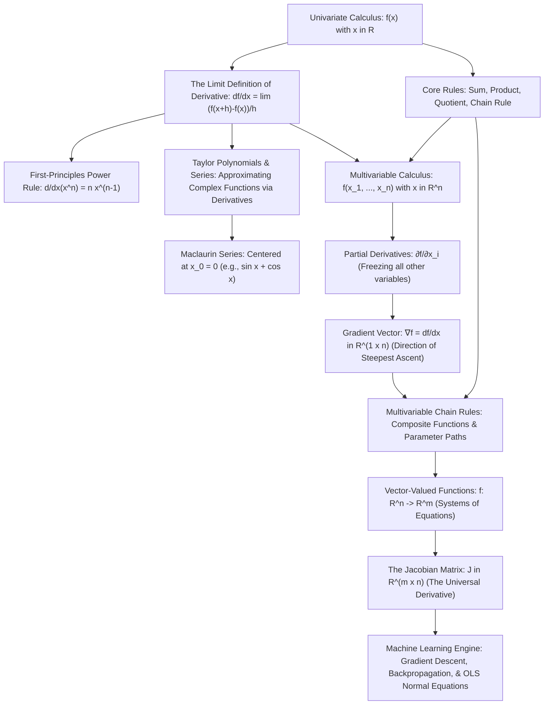
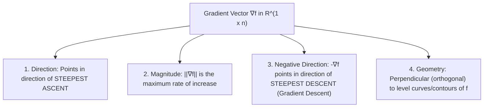
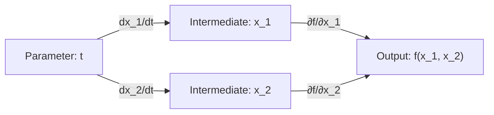
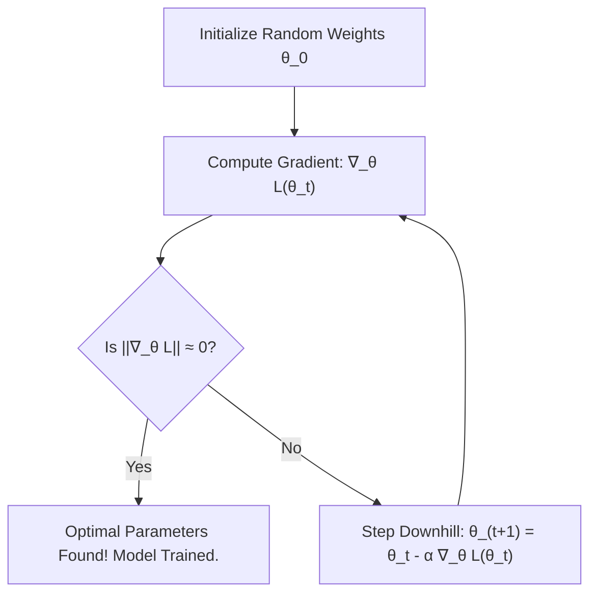

# Comprehensive Master Study Guide: Differentiation, Gradients, and Vector Calculus
**Course:** Mathematical Foundations for Machine Learning & Data Science — Lecture 6  
**Target Audience:** Complete Beginners in Mathematics (Zero Knowledge Assumed $\to$ Path to Mastery)  
**Primary Reference:** Lecture 6 Presentation Slides (*BITS Pilani WILPD - CSIS / MFML & MFDS Team*) & *Mathematics for Machine Learning* (Deisenroth, Faisal, Ong - Chapter 5)

---

## Welcome & Pedagogical Roadmap

Welcome to **Lecture 6**! Take a breath and celebrate: you have crossed a major threshold in your mathematical journey.

Let us look back at the intellectual terrain we have conquered together across Lectures 1 through 5:
* In **Lecture 1 (Linear Algebra & Systems of Equations)**, we mastered Gaussian elimination, matrix operations, and the computational mechanics of solving $A\mathbf{x} = \mathbf{b}$. That was the study of **linear equations**.
* In **Lecture 2 (Vector Spaces)**, we explored the algebraic universe where vectors reside: spans, subspaces, linear independence, bases, and dimension. That was the study of **algebraic structure**.
* In **Lecture 3 (Analytic Geometry)**, we equipped vector spaces with geometric rulers and protractors: inner products, Euclidean norms, distances, angles, and orthogonal projections. That was the study of **geometry and measurement**.
* In **Lecture 4 (Eigenvalues & Eigenvectors)**, we discovered the invariant axes of transformations: the privileged directions where matrices act as pure scalar stretchers. That was the study of **invariant directions**.
* In **Lecture 5 (Singular Value Decomposition)**, we united geometry and algebra to factorize *any* rectangular matrix into orthogonal rotations and diagonal scaling, unlocking data compression and pseudoinverses. That was the study of **matrix factorization**.

Across all five lectures, everything was **static and linear**. We analyzed fixed vector spaces, static matrices, and straight lines/planes.

Now, in **Lecture 6**, we make **The Grand Pivot** from Linear Algebra to **Calculus and Optimization**.

```
Linear Algebra (Lectures 1–5): The Static Stage (Vectors, Spaces, Matrices)
                         ⬇
Calculus & Differentiation (Lecture 6): The Dynamic Motion (Rates of Change, Curves, Slopes)
                         ⬇
Machine Learning & Optimization (Future Lectures): The Training Engine (Gradient Descent, Learning)
```

In the real world and in machine learning, relationships are rarely linear. Loss surfaces are curved valleys, neural network activations bend spaces non-linearly, and data curves through high dimensions. 

How do we optimize a machine learning model with millions of parameters? We cannot solve it in a single static step. Instead, we must **navigate** the curved landscape of error: we ask, *"If I nudge this parameter by a tiny fraction, will my model's error go up or down, and by how much?"*

The mathematical tool that answers that question with supreme precision is **Differentiation**.

---

### The Global Architecture of Lecture 6

Here is the visual roadmap of how the concepts in this lecture connect and build upon one another:



---

### Why Differentiation is the Beating Heart of Machine Learning & AI

If Linear Algebra provides the skeleton of AI, Calculus is its nervous system and muscles. Every algorithm that "learns" does so through calculus:

1. **Training Deep Neural Networks via Gradient Descent:** When ChatGPT, Gemini, or a vision classifier learns, it computes an objective function (Loss $\mathcal{L}$) measuring how far its predictions are from reality. To reduce error, it computes the **gradient** $\nabla_{\boldsymbol{\theta}} \mathcal{L}$ with respect to all model weights $\boldsymbol{\theta}$ and updates them:
   $$\boldsymbol{\theta}_{\text{new}} = \boldsymbol{\theta}_{\text{old}} - \alpha \nabla_{\boldsymbol{\theta}} \mathcal{L}$$
   Without differentiation, modern deep learning cannot exist.
2. **Backpropagation is the Multivariate Chain Rule:** A neural network is simply a deep composition of functions: $\hat{\mathbf{y}} = f_L(f_{L-1}(\dots f_1(\mathbf{x})\dots))$. Computing the derivative of the error with respect to an early layer's weights is literally the multivariate chain rule applied repeatedly from output to input.
3. **Linear Regression & Ordinary Least Squares (OLS):** Finding the optimal weights that minimize squared prediction error is solved by setting the matrix gradient $\nabla_{\mathbf{w}} \|X\mathbf{w} - \mathbf{y}\|^2 = \mathbf{0}$, directly yielding the famous Normal Equations $(X^T X)\mathbf{w} = X^T \mathbf{y}$.
4. **Second-Order Optimization (Newton-Raphson & Hessians):** The curvature of an optimization landscape is governed by the second-order Taylor expansion. Understanding Taylor series allows us to build faster, curvature-aware optimization algorithms.
5. **Feature Sensitivity & Saliency Maps:** In computer vision and medical imaging, how do we know which pixels caused an AI to classify an MRI scan as a tumor? We take the **Jacobian** of the prediction score with respect to the input pixels. The largest partial derivatives highlight the most critical features.

---

### Comprehensive Mathematical Symbol Glossary

To ensure zero confusion for beginners, here is every symbol used in this lecture, its formal name, its plain-English meaning, and a concrete example:

| Symbol | Name / Notation | Beginner Interpretation | Concrete Example |
| :---: | :--- | :--- | :--- |
| $f: \mathbb{R} \to \mathbb{R}$ | Univariate Function | A machine taking 1 real number in and outputting 1 real number. | $f(x) = x^2 + 3x$ |
| $f: \mathbb{R}^n \to \mathbb{R}$ | Multivariable Scalar Function | Takes a vector of $n$ numbers, outputs a single scalar number (like Loss). | $\mathcal{L}(w_1, w_2) = w_1^2 + w_2^2$ |
| $f: \mathbb{R}^n \to \mathbb{R}^m$ | Vector-Valued Function | Takes an $n$-dimensional input vector, outputs an $m$-dimensional vector. | $f(x_1, x_2) = \begin{bmatrix} x_1 + x_2 \\ x_1 x_2 \end{bmatrix}$ |
| $h$ or $\Delta x$ | Perturbation / Nudge | An infinitesimally small nudge added to the input to test sensitivity. | $x + h$ where $h \to 0$ |
| $\lim_{h \to 0}$ | Limit as $h$ approaches 0 | The value that an expression approaches as $h$ gets infinitely close to 0 (without dividing by 0). | $\lim_{h \to 0} (2x + h) = 2x$ |
| $\frac{df}{dx}$ or $f'(x)$ | Derivative (Leibniz / Lagrange) | The instantaneous rate of change of $f$ with respect to $x$; slope of tangent line. | $\frac{d}{dx}(x^3) = 3x^2$ |
| $f^{(k)}(x)$ | $k$-th Order Derivative | Differentiating function $f$ repeatedly $k$ times ($f^{(0)}=f, f^{(1)}=f', f^{(2)}=f''$). | For $f(x)=x^4$, $f^{(3)}(x)=24x$ |
| $k!$ | Factorial of $k$ | The product of all positive integers up to $k$: $k! = k \times (k-1) \times \dots \times 1$. ($0! = 1$). | $4! = 4 \times 3 \times 2 \times 1 = 24$ |
| $\binom{n}{i}$ | Binomial Coefficient ("$n$ choose $i$") | The number of ways to pick $i$ items from $n$: $\frac{n!}{i!(n-i)!}$. | $\binom{4}{2} = \frac{24}{2 \times 2} = 6$ |
| $T_n(x)$ | Taylor Polynomial of degree $n$ | An $n$-degree polynomial designed to mimic function $f$ around point $x_0$. | $T_2(x) = f(x_0) + f'(x_0)(x-x_0) + \frac{f''(x_0)}{2}(x-x_0)^2$ |
| $T_\infty(x)$ | Taylor Series | An infinite polynomial series that exactly equals a smooth function. | $\sum_{k=0}^\infty \frac{f^{(k)}(x_0)}{k!} (x-x_0)^k$ |
| $\sum_{k=0}^n$ | Summation Notation | Add up all terms as integer index $k$ runs from $0$ to $n$. | $\sum_{k=1}^3 k^2 = 1^2 + 2^2 + 3^2 = 14$ |
| $\partial$ | Partial Derivative Symbol ("del") | Represents the derivative with respect to one variable while all others are held frozen. | $\frac{\partial}{\partial x}(x^2 y) = 2xy$ (treating $y$ as a constant) |
| $\nabla f$ or $\text{grad} f$ | Gradient of $f$ | The row vector containing all first-order partial derivatives of scalar $f$. | $\nabla f = \begin{bmatrix} \frac{\partial f}{\partial x_1} & \frac{\partial f}{\partial x_2} \end{bmatrix}$ |
| $J$ or $\frac{df}{dx}$ | Jacobian Matrix | An $m \times n$ matrix containing all partial derivatives of a vector function $f: \mathbb{R}^n \to \mathbb{R}^m$. | $J_{ij} = \frac{\partial f_i}{\partial x_j}$ |
| $\circ$ | Function Composition | Applying one function after another: $(g \circ f)(x) = g(f(x))$. | If $f(x)=2x, g(u)=u^2$, $(g \circ f)(x) = 4x^2$ |
| $\exp(z)$ or $e^z$ | Natural Exponential Function | The base $e \approx 2.71828$ raised to power $z$; its derivative is itself: $\frac{d}{dz} e^z = e^z$. | $\exp(0) = 1, \exp(1) \approx 2.718$ |
| $\mathbb{R}^{m \times n}$ | Space of $m \times n$ Real Matrices | Grids of numbers with $m$ rows and $n$ columns. | A Jacobian of 3 equations with 2 inputs is in $\mathbb{R}^{3 \times 2}$ |

---


## Part I: The Intuition of Calculus — Univariate Differentiation

Before we dive into symbols and algebraic manipulation, let us build rock-solid physical and geometric intuition. What problem was calculus invented to solve?

---

### 1.1 What is a Function?

Imagine a function $f$ as a mathematical machine. You drop an input number $x$ into the top, the machine performs a calculation, and it outputs a single number $y = f(x)$.

* For example, if $f(x) = x^2$, dropping in $x = 3$ yields $f(3) = 3^2 = 9$.
* On a 2D Cartesian graph, every pair of `(input, output)` forms a point $(x, f(x))$. Connecting these points creates a curve.

If the curve is a straight line, its steepness (slope) is constant everywhere:
$$\text{Slope} = \frac{\text{Change in Output } (\Delta y)}{\text{Change in Input } (\Delta x)} = \frac{y_2 - y_1}{x_2 - x_1}$$
A slope of $3$ means: *"For every 1 unit you step to the right, the line climbs up by 3 units."*

**The Problem:** Most interesting relationships in the universe—and in machine learning—are **curved**! On a curved graph (like $y = x^2$), the steepness is different at every single point. Near $x=0$, the curve is almost flat; near $x=10$, it is a terrifying cliff. How do we measure the slope of a curve at a single, exact instant?

---

### 1.2 Average Rate of Change vs. Instantaneous Rate of Change

Consider a real-world analogy: **Driving a Car**.

Suppose you drive your car $100$ kilometers, and the trip takes exactly $2$ hours.
Your **average velocity** over the trip is:
$$\text{Average Velocity} = \frac{\Delta \text{Distance}}{\Delta \text{Time}} = \frac{100 \text{ km}}{2 \text{ hours}} = 50 \text{ km/h}$$

Does this mean your car was traveling at exactly $50\text{ km/h}$ the entire trip? Absolutely not!
* You were stopped at red lights ($0\text{ km/h}$).
* You cruised on the highway ($110\text{ km/h}$).
* You slowed down around curves ($30\text{ km/h}$).

If a police officer with a radar gun clocks you at $110\text{ km/h}$ on the highway, you cannot argue: *"Officer, my average speed over the past 2 hours was only 50 km/h!"* The radar gun measures your **instantaneous velocity**—your rate of change at one single, frozen moment in time.

> [!NOTE]
> **Key Intuition:** Calculus is the mathematics of moving from **averages over intervals** to **instantaneous values at a point**.

---

### 1.3 The Geometric Bridge: From Secant Line to Tangent Line

How does a mathematician measure the slope of a curved graph $y = f(x)$ at an exact point $x$?


1. **Step 1:** Choose the point where you want to know the slope: $P = (x, f(x))$.
2. **Step 2:** Choose a neighboring point a small distance $h$ away: $Q = (x + h, f(x + h))$.
3. **Step 3:** Draw a straight line passing through both points $P$ and $Q$. In geometry, a line cutting through two points on a curve is called a **Secant Line**.
   The slope of this secant line is the average rate of change over the interval from $x$ to $x+h$:
   $$\text{Slope of Secant} = \frac{\Delta y}{\Delta x} = \frac{f(x + h) - f(x)}{(x + h) - x} = \frac{f(x + h) - f(x)}{h}$$
4. **Step 4:** Now, gently push $h$ closer and closer to zero ($h \to 0$).
   As $h$ shrinks, the neighboring point $Q$ slides along the curve right into $P$. The secant line pivots around $P$ until, in the limiting moment when $h$ vanishes, it grazes the curve at just the single point $P$.
5. **Step 5:** This grazing line is the **Tangent Line**. Its slope is the **Derivative** of $f$ at $x$!

---

### 1.4 The Limit Definition of the Derivative (Slide 4, Eq 1)

In the lecture presentation (Slide 4), this geometric process is formalized mathematically:

> [!IMPORTANT]
> **Definition (Derivative of a Univariate Function):**  
> For $h > 0$ (and more generally for $h \to 0$ from both sides), the derivative of $f: \mathbb{R} \to \mathbb{R}$ at point $x$ is defined as the limit:
> $$\frac{df}{dx} = \lim_{h \to 0} \frac{f(x+h) - f(x)}{h} \tag{1}$$

#### What Does "$\lim_{h \to 0}$" Really Mean to a Beginner?
Beginners often ask: *"Why don't we just plug in $h = 0$?"*
Look what happens if you set $h = 0$ directly into the fraction:
$$\frac{f(x + 0) - f(x)}{0} = \frac{f(x) - f(x)}{0} = \frac{0}{0}$$
In mathematics, $\frac{0}{0}$ is **undefined** (an indeterminate form). You cannot divide by zero!

The limit notation $\lim_{h \to 0}$ is mathematicians' ingenious solution: it says:
> *"Do NOT plug in $h = 0$ yet. First, use algebra to cancel the $h$ in the denominator. Once the division by zero is eliminated, observe what number the remaining expression approaches as $h$ becomes infinitely small ($0.1, 0.01, 0.00001, \dots$)."*

---

### 1.5 Geometric Meaning: Slope and Steepest Ascent in 1D

Slide 4 includes a vital remark that directly connects calculus to machine learning:

> *"The derivative of $f$ points in the direction of steepest ascent of $f$."*

Let us understand what this means for a scalar function on a line:
* **If $\frac{df}{dx} > 0$ (Positive Slope):** The function is tilting upward to the right. Stepping in the positive $x$ direction ($+1$) causes $f(x)$ to increase (ascent). Stepping in the negative $x$ direction ($-1$) causes $f(x)$ to decrease (descent).
* **If $\frac{df}{dx} < 0$ (Negative Slope):** The function is tilting downward to the right. Stepping in the negative $x$ direction causes $f(x)$ to increase (ascent).
* **If $\frac{df}{dx} = 0$ (Zero Slope):** The tangent line is completely horizontal. You are standing on a peak (maximum), the bottom of a valley (minimum), or a flat terrace (inflection point).

In 1D, there are only two directions to move: left or right. The derivative tells you which direction goes uphill ("steepest ascent") and which goes downhill ("steepest descent"). When we generalize this to 2D, 3D, and $10,000$D in neural networks, this very concept becomes the **Gradient Vector**!

---

### 1.6 Common Notations in Mathematics and ML

Different fields of science and engineering write derivatives using different notations. You will encounter all of them:

| Notation Name | Written Symbol | How to Read It | Typical Context |
| :---: | :---: | :--- | :--- |
| **Leibniz's Notation** | $\frac{df}{dx}$ or $\frac{d}{dx}f(x)$ | "d f by d x" or "derivative of f with respect to x" | Best for vector calculus, chain rule, and physics because it looks like a fraction of infinitesimals. |
| **Lagrange's Notation** | $f'(x)$ or $f''(x)$ | "f prime of x", "f double prime" | Clean and compact; standard in single-variable calculus and pure mathematics. |
| **Euler's Notation** | $D_x f$ or $D f$ | "differential operator D applied to f" | Used in operator theory and advanced functional analysis. |
| **Newton's Notation** | $\dot{x}$ or $\ddot{x}$ | "x dot", "x double dot" | Exclusively used in physics and robotics for derivatives with respect to time $t$ (e.g., velocity $\dot{x}$, acceleration $\ddot{x}$). |

---

## Part II: First-Principles Proofs — The Derivative of a Monomial ($x^n$)

Now let us follow Slides 5 and 6 of the lecture presentation, where the fundamental power rule of calculus is derived rigorously from first principles.

---

### 2.1 The Goal: Proving the Power Rule

We want to prove that for any positive integer power $n \in \{1, 2, 3, \dots\}$, the derivative of the polynomial function:
$$f(x) = x^n$$
is given by the formula:
$$\frac{df}{dx} = n x^{n-1}$$

---

### 2.2 Prerequisite: The Binomial Theorem Explained from Scratch

To evaluate $f(x+h) = (x+h)^n$, we need to expand a bracket raised to the $n$-th power. 

Let us write out the first few powers by hand to see the pattern:
* For $n = 1$:
  $$(x+h)^1 = x + h$$
* For $n = 2$:
  $$(x+h)^2 = (x+h)(x+h) = x^2 + 2xh + h^2$$
* For $n = 3$:
  $$(x+h)^3 = (x^2 + 2xh + h^2)(x+h) = x^3 + 3x^2 h + 3x h^2 + h^3$$
* For $n = 4$:
  $$(x+h)^4 = x^4 + 4x^3 h + 6x^2 h^2 + 4x h^3 + h^4$$

Look closely at the terms in each expansion:
1. The **first term** is always $x^n$ (with no $h$).
2. The **second term** is always $n x^{n-1} h$ (with exactly one $h$ to the power of 1).
3. **All subsequent terms** contain higher powers of $h$: $h^2, h^3, \dots, h^n$.

The general rule for this expansion is called the **Binomial Theorem**:
$$(x+h)^n = \sum_{i=0}^n \binom{n}{i} x^{n-i} h^i$$
where $\binom{n}{i}$ (read "$n$ choose $i$") is the binomial coefficient:
$$\binom{n}{i} = \frac{n!}{i!(n-i)!}$$
Specifically:
* For $i = 0$: $\binom{n}{0} = \frac{n!}{0! n!} = 1 \implies$ Term is $1 \cdot x^n \cdot h^0 = x^n$.
* For $i = 1$: $\binom{n}{1} = \frac{n!}{1! (n-1)!} = \frac{n \times (n-1)!}{1 \times (n-1)!} = n \implies$ Term is $n x^{n-1} h^1 = n x^{n-1} h$.

Therefore, we can write the expansion as:
$$(x+h)^n = x^n + n x^{n-1} h + \sum_{i=2}^n \binom{n}{i} x^{n-i} h^i$$

---

### 2.3 Step-by-Step Derivation of $\frac{d}{dx}(x^n)$ with ZERO Skipped Steps (Slides 5–6)

Now let us execute the derivation from the lecture slides, line by line, explaining every algebraic transition:

**Step 1: Write down the limit definition of the derivative (Slide 5, Eq 1):**
$$\frac{df}{dx} = \lim_{h \to 0} \frac{f(x+h) - f(x)}{h}$$

**Step 2: Substitute $f(x) = x^n$ and $f(x+h) = (x+h)^n$:**
$$\frac{df}{dx} = \lim_{h \to 0} \frac{(x+h)^n - x^n}{h}$$

**Step 3: Replace $(x+h)^n$ with its Binomial summation:**
$$\frac{df}{dx} = \lim_{h \to 0} \frac{\sum_{i=0}^n \binom{n}{i} x^{n-i} h^i - x^n}{h}$$

**Step 4: Pull out the $i=0$ term from the summation:**
The $i=0$ term is $\binom{n}{0} x^{n-0} h^0 = 1 \cdot x^n \cdot 1 = x^n$.
So the summation splits into:
$$\sum_{i=0}^n \binom{n}{i} x^{n-i} h^i = x^n + \sum_{i=1}^n \binom{n}{i} x^{n-i} h^i$$

Substitute this back into the numerator:
$$\frac{df}{dx} = \lim_{h \to 0} \frac{\left( x^n + \sum_{i=1}^n \binom{n}{i} x^{n-i} h^i \right) - x^n}{h}$$

**Step 5: Cancel the opposing $x^n$ terms in the numerator ($x^n - x^n = 0$):**
$$\frac{df}{dx} = \lim_{h \to 0} \frac{\sum_{i=1}^n \binom{n}{i} x^{n-i} h^i}{h} \tag{Slide 5, Eq 2}$$

Notice what has happened: **Every single remaining term in the numerator contains at least one factor of $h$!**

**Step 6: Divide each term in the summation by $h$ (Slide 6):**
Since $\frac{h^i}{h} = h^{i-1}$, dividing through gives:
$$\frac{df}{dx} = \lim_{h \to 0} \sum_{i=1}^n \binom{n}{i} x^{n-i} h^{i-1}$$

**Step 7: Separate the $i=1$ term from the higher-order terms ($i \ge 2$):**
When $i = 1$:
$$\binom{n}{1} x^{n-1} h^{1-1} = n x^{n-1} h^0 = n x^{n-1} \cdot 1 = n x^{n-1}$$

For terms from $i = 2$ to $n$:
$$\sum_{i=2}^n \binom{n}{i} x^{n-i} h^{i-1}$$
Notice that for every term in this second sum, the power of $h$ is $i - 1 \ge 2 - 1 = 1$. That means every term has at least one $h$ multiplying it ($h^1, h^2, \dots, h^{n-1}$).

Writing this out:
$$\frac{df}{dx} = \lim_{h \to 0} \left[ \binom{n}{1} x^{n-1} + \sum_{i=2}^n \binom{n}{i} x^{n-i} h^{i-1} \right]$$
Using the linearity of limits ($\lim(A + B) = \lim A + \lim B$):
$$\frac{df}{dx} = \lim_{h \to 0} \left[ \binom{n}{1} x^{n-1} \right] + \lim_{h \to 0} \left[ \sum_{i=2}^n \binom{n}{i} x^{n-i} h^{i-1} \right]$$

**Step 8: Evaluate the limit as $h \to 0$:**
* In the first term, $\binom{n}{1} x^{n-1} = n x^{n-1}$ contains no $h$ at all! It is unaffected by $h \to 0$.
* In the second term, because every single summand is multiplied by a positive power of $h$ ($h^1, h^2, \dots$), as $h \to 0$, each term is multiplied by zero:
  $$\lim_{h \to 0} \left[ \sum_{i=2}^n \binom{n}{i} x^{n-i} h^{i-1} \right] = 0$$

Therefore, the entire second sum vanishes completely:
$$\frac{df}{dx} = n x^{n-1} + 0 = n x^{n-1} \tag{Slide 6, Eq 3}$$

$\blacksquare$ **Q.E.D. (Quod Erat Demonstrandum — Which Was to be Demonstrated)**

---

### 2.4 Concrete Worked Examples for Beginners

Let us test our formula on simple functions to build muscle memory:

#### Example A: $f(x) = x^1$ (A 45-degree straight line)
* Apply rule with $n = 1$:
  $$\frac{df}{dx} = 1 \cdot x^{1-1} = 1 \cdot x^0 = 1 \cdot 1 = 1$$
* *Geometric Check:* The graph of $y = x$ is a line with slope $1$ everywhere. The calculus answer matches basic geometry!

#### Example B: $f(x) = x^2$ (The standard parabola)
* Apply rule with $n = 2$:
  $$\frac{df}{dx} = 2 \cdot x^{2-1} = 2x^1 = 2x$$
* *Interpretation:* At $x = 0$, slope is $2(0) = 0$ (the bottom of the bowl). At $x = 3$, slope is $2(3) = 6$ (steep climb). At $x = -2$, slope is $2(-2) = -4$ (steep downward plunge).

#### Example C: $f(x) = x^3$ (Cubic curve)
* Apply rule with $n = 3$:
  $$\frac{df}{dx} = 3 \cdot x^{3-1} = 3x^2$$

#### Example D: $f(x) = x^4$ (Quartic curve — featured on Slide 9)
* Apply rule with $n = 4$:
  $$\frac{df}{dx} = 4 \cdot x^{4-1} = 4x^3$$

---

### 2.5 Extending the Power Rule to All Real Exponents

Although Slides 5–6 prove the power rule for natural numbers $n \in \mathbb{N}$, one of the miracles of calculus is that the Power Rule holds for **any real exponent** $\alpha \in \mathbb{R}$ (positive, negative, or fraction):

$$\frac{d}{dx} [x^\alpha] = \alpha x^{\alpha - 1}$$

#### Two Essential Cases for Machine Learning:

1. **Negative Powers (Fractions with $x$ in the denominator):**
   Consider $f(x) = \frac{1}{x} = x^{-1}$. Here $\alpha = -1$:
   $$\frac{d}{dx}\left(\frac{1}{x}\right) = \frac{d}{dx}(x^{-1}) = (-1) x^{-1 - 1} = -1 \cdot x^{-2} = -\frac{1}{x^2}$$

2. **Fractional Powers (Square roots and radicals):**
   Consider $f(x) = \sqrt{x} = x^{1/2}$. Here $\alpha = \frac{1}{2}$:
   $$\frac{d}{dx}(\sqrt{x}) = \frac{d}{dx}\left(x^{1/2}\right) = \frac{1}{2} x^{\frac{1}{2} - 1} = \frac{1}{2} x^{-1/2} = \frac{1}{2 \sqrt{x}}$$
   This derivative appears constantly in machine learning when calculating the derivative of the Euclidean distance ($L_2$ norm) $\|\mathbf{x}\|_2 = \sqrt{\sum x_i^2}$.

---


## Part III: Approximating the Unknown — Taylor Polynomials & Taylor Series

In this section, we explore one of the most powerful and sublime ideas in all of applied mathematics: **Taylor's Theorem**. 

If you have ever wondered how a computer calculates $\sin(0.42)$, $e^{1.7}$, or $\sqrt{9.1}$ with instant precision—given that computer hardware can only do simple additions and multiplications—the answer is **Taylor polynomials**.

---

### 3.1 The Philosophy: Why Polynomials?

Consider different mathematical functions:
* **Transcendental functions:** $\sin(x), \cos(x), e^x, \ln(x), \tanh(x)$ (used in neural networks). These functions cannot be computed with a finite number of basic arithmetic steps ($+, -, \times, \div$).
* **Polynomial functions:** $P(x) = a_0 + a_1 x + a_2 x^2 + \dots + a_n x^n$. These are the friendliest functions in mathematics. They are trivial to evaluate, simple to store, and remarkably easy to differentiate and integrate.

**The Big Idea of Brook Taylor (1715):**  
Can we construct a "custom-fitted" polynomial that acts as a near-perfect clone of *any* complicated, smooth function $f(x)$ around a chosen anchor point $x_0$?

The answer is **yes**, by matching the function's value and all its successive derivatives at $x_0$!

---

### 3.2 Building from Scratch: The Hierarchy of Approximations

Suppose you are given an unknown function $f(x)$ and you want to approximate it near an anchor point $x_0$:

```mermaid
flowchart TD
    Order0["Order 0 Approximation: T_0(x) = f(x_0)"] -->|Match Slope f'(x_0)| Order1["Order 1 Approximation (Tangent Line): T_1(x) = f(x_0) + f'(x_0)(x - x_0)"]
    Order1 -->|Match Curvature f''(x_0)| Order2["Order 2 Approximation (Parabola): T_2(x) = T_1(x) + (f''(x_0)/2!)(x - x_0)^2"]
    Order2 -->|Match Higher Derivatives| OrderN["Order n Taylor Polynomial: T_n(x) = Σ (f^(k)(x_0)/k!) (x - x_0)^k"]
```

1. **Order 0 (Matching Value):**  
   The simplest approximation is a constant horizontal line that passes through $(x_0, f(x_0))$:
   $$T_0(x) = f(x_0)$$
   *Quality:* Terrible everywhere except right at $x = x_0$.

2. **Order 1 (Matching Value and Slope — The Tangent Line):**  
   We want a straight line that passes through $(x_0, f(x_0))$ **and** shares the exact same slope $f'(x_0)$:
   $$T_1(x) = f(x_0) + f'(x_0)(x - x_0)$$
   *Quality:* Excellent for points very close to $x_0$, but bends away if the true function curves.

3. **Order 2 (Matching Value, Slope, and Curvature — The Parabola):**  
   We add a quadratic term to capture how the curve bends (its second derivative $f''(x_0)$):
   $$T_2(x) = f(x_0) + f'(x_0)(x - x_0) + \frac{f''(x_0)}{2!}(x - x_0)^2$$
   *Quality:* Much wider zone of accuracy! Captures both the direction and the bowl-shaped bending.

By continuing this process to match higher-order rates of change ($f^{(3)}, f^{(4)}, \dots, f^{(n)}$), the polynomial hugs the true curve over an increasingly wide neighborhood.

---

### 3.3 The Formal Definition of Taylor Polynomial (Slide 7, Eq 4)

In Slide 7, the lecture defines the Taylor polynomial of degree $n$:

> [!IMPORTANT]
> **Definition (Taylor Polynomial):**  
> The Taylor polynomial of degree $n$ of a function $f: \mathbb{R} \to \mathbb{R}$ at anchor point $x_0$ is defined as:
> $$T_n(x) = \sum_{k=0}^n \frac{f^{(k)}(x_0)}{k!} (x - x_0)^k \tag{4}$$
> where $f^{(k)}(x_0)$ denotes the $k$-th derivative of $f$ evaluated at $x_0$ (with $f^{(0)}(x_0) = f(x_0)$ and $0! = 1$).

Expanding the summation explicitly term by term:
$$T_n(x) = f(x_0) + \frac{f'(x_0)}{1!}(x - x_0) + \frac{f''(x_0)}{2!}(x - x_0)^2 + \frac{f^{(3)}(x_0)}{3!}(x - x_0)^3 + \dots + \frac{f^{(n)}(x_0)}{n!}(x - x_0)^n$$

---

### 3.4 Why Factorials ($k!$)? Unraveling the Denominator Mystery

Many beginners find the factorial $k!$ in the denominator mysterious: *"Where does $k!$ come from?"*

Let us solve this mystery once and for all!

Suppose we want to construct a polynomial $P(x) = c_0 + c_1(x - x_0) + c_2(x - x_0)^2 + \dots + c_k(x - x_0)^k$ whose derivatives match $f$ at $x_0$.
Let us differentiate the single power term $(x - x_0)^k$ repeatedly:
* 1st derivative: $\frac{d}{dx} [(x - x_0)^k] = k (x - x_0)^{k-1}$
* 2nd derivative: $\frac{d^2}{dx^2} [(x - x_0)^k] = k(k-1) (x - x_0)^{k-2}$
* 3rd derivative: $\frac{d^3}{dx^3} [(x - x_0)^k] = k(k-1)(k-2) (x - x_0)^{k-3}$
* ...
* **$k$-th derivative:** $\frac{d^k}{dx^k} [(x - x_0)^k] = k \times (k-1) \times (k-2) \times \dots \times 1 = k!$

Every time you differentiate, the exponent steps down into the front as a multiplier. By the time you reach the $k$-th derivative, you have multiplied $k \times (k-1) \times \dots \times 1 = k!$.

Now evaluate this $k$-th derivative at $x = x_0$:
$$P^{(k)}(x_0) = k! \cdot c_k$$
We need this to match the true function's $k$-th derivative:
$$k! \cdot c_k = f^{(k)}(x_0) \implies c_k = \frac{f^{(k)}(x_0)}{k!}$$

> [!TIP]
> **The Factorial Mystery Solved:**  
> The $k!$ in the denominator exists specifically to cancel out the cascade of multipliers produced by repeated power-rule differentiation!

---

### 3.5 Smooth Functions and the Taylor Series (Slide 8, Eq 5)

When a function can be differentiated infinitely many times without breaking, it is called a **smooth function** (denoted $C^\infty$). Examples include $e^x, \sin(x), \cos(x)$, and all polynomials.

For smooth functions, we can let the degree $n$ go all the way to infinity:

> [!IMPORTANT]
> **Definition (Taylor Series):**  
> The Taylor series of a smooth function $f: \mathbb{R} \to \mathbb{R}$ at anchor point $x_0$ is defined as the infinite series:
> $$T_\infty(x) = \sum_{k=0}^\infty \frac{f^{(k)}(x_0)}{k!} (x - x_0)^k \tag{5}$$

#### The Special Case: Maclaurin Series (Slide 8)
When the anchor point is chosen to be zero ($x_0 = 0$), the formula simplifies because $(x - 0)^k = x^k$. This special case is called the **Maclaurin Series**:
$$T_\infty(x) = \sum_{k=0}^\infty \frac{f^{(k)}(0)}{k!} x^k = f(0) + \frac{f'(0)}{1!} x + \frac{f''(0)}{2!} x^2 + \frac{f^{(3)}(0)}{3!} x^3 + \dots$$

---

### 3.6 Remark: Approximation vs. Exact Representation (Slide 8)

Slide 8 contains a profound remark that is critical to understand:

> *"In general, a Taylor polynomial of degree $n$ is an approximation of a function, which does not need to be a polynomial. The Taylor polynomial is similar to $f$ in a neighborhood around $x_0$.  
> However, a Taylor polynomial of degree $n$ is an **exact representation** of a polynomial $f$ of degree $k \le n$ since all derivatives $f^{(i)} = 0$ for $i > k$."*

#### Why does this happen?
If you have a polynomial of degree $k$ (for example, $f(x) = x^4$, degree $4$):
* Its 1st derivative has degree 3 ($4x^3$).
* Its 2nd derivative has degree 2 ($12x^2$).
* Its 3rd derivative has degree 1 ($24x$).
* Its 4th derivative is a constant ($24$).
* Its 5th derivative is zero ($0$).
* Its 6th, 7th, 8th... derivatives are **all identically zero**!

Because every derivative beyond degree $k$ vanishes, the remainder error of the Taylor series becomes exactly zero. Therefore, if $n \ge k$, the Taylor polynomial $T_n(x)$ is not an approximation—it is an **exact algebraic copy** of $f(x)$!

---

### 3.7 Deep-Dive Master Calculation 1: Slide 9 Example — $f(x) = x^4$ at $x_0 = 1$

Let us meticulously solve the example on Slide 9.

**Problem Statement:**  
Consider the polynomial $f(x) = x^4$. Find the Taylor polynomial $T_6(x)$ evaluated at the anchor point $x_0 = 1$.

#### Step 1: Compute all derivatives up to order $k = 6$
We apply the power rule repeatedly:
* $k = 0$: $f(x) = x^4 \implies f(1) = 1^4 = 1$
* $k = 1$: $f'(x) = 4x^3 \implies f'(1) = 4(1)^3 = 4$
* $k = 2$: $f''(x) = \frac{d}{dx}(4x^3) = 12x^2 \implies f''(1) = 12(1)^2 = 12$
* $k = 3$: $f^{(3)}(x) = \frac{d}{dx}(12x^2) = 24x \implies f^{(3)}(1) = 24(1) = 24$
* $k = 4$: $f^{(4)}(x) = \frac{d}{dx}(24x) = 24 \implies f^{(4)}(1) = 24$
* $k = 5$: $f^{(5)}(x) = \frac{d}{dx}(24) = 0 \implies f^{(5)}(1) = 0$
* $k = 6$: $f^{(6)}(x) = \frac{d}{dx}(0) = 0 \implies f^{(6)}(1) = 0$

#### Step 2: Compute the Taylor coefficients $c_k = \frac{f^{(k)}(1)}{k!}$
* $k = 0$: $c_0 = \frac{f(1)}{0!} = \frac{1}{1} = 1$
* $k = 1$: $c_1 = \frac{f'(1)}{1!} = \frac{4}{1} = 4$
* $k = 2$: $c_2 = \frac{f''(1)}{2!} = \frac{12}{2 \times 1} = \frac{12}{2} = 6$
* $k = 3$: $c_3 = \frac{f^{(3)}(1)}{3!} = \frac{24}{3 \times 2 \times 1} = \frac{24}{6} = 4$
* $k = 4$: $c_4 = \frac{f^{(4)}(1)}{4!} = \frac{24}{4 \times 3 \times 2 \times 1} = \frac{24}{24} = 1$
* $k = 5$: $c_5 = \frac{0}{5!} = 0$
* $k = 6$: $c_6 = \frac{0}{6!} = 0$

#### Step 3: Assemble the Taylor polynomial $T_6(x)$
$$T_6(x) = \sum_{k=0}^6 \frac{f^{(k)}(1)}{k!} (x - 1)^k$$
$$T_6(x) = 1 + 4(x - 1) + 6(x - 1)^2 + 4(x - 1)^3 + 1(x - 1)^4$$

#### Step 4: Algebraic Verification — Does this equal $x^4$?
Let us expand each power of $(x - 1)$ to verify:
* $(x - 1)^1 = x - 1$
* $(x - 1)^2 = x^2 - 2x + 1$
* $(x - 1)^3 = x^3 - 3x^2 + 3x - 1$
* $(x - 1)^4 = x^4 - 4x^3 + 6x^2 - 4x + 1$

Now substitute these expansions into our expression for $T_6(x)$:
$$\begin{aligned}
T_6(x) &= 1 \\
&\quad + 4(x - 1) \\
&\quad + 6(x^2 - 2x + 1) \\
&\quad + 4(x^3 - 3x^2 + 3x - 1) \\
&\quad + 1(x^4 - 4x^3 + 6x^2 - 4x + 1)
\end{aligned}$$

Distribute all the scalar multipliers:
$$\begin{aligned}
T_6(x) &= 1 \\
&\quad + 4x - 4 \\
&\quad + 6x^2 - 12x + 6 \\
&\quad + 4x^3 - 12x^2 + 12x - 4 \\
&\quad + x^4 - 4x^3 + 6x^2 - 4x + 1
\end{aligned}$$

Now group like powers of $x$:
* **$x^4$ terms:** $+1x^4 = x^4$
* **$x^3$ terms:** $4x^3 - 4x^3 = 0x^3$
* **$x^2$ terms:** $6x^2 - 12x^2 + 6x^2 = (6 - 12 + 6)x^2 = 0x^2$
* **$x^1$ terms:** $4x - 12x + 12x - 4x = (4 - 12 + 12 - 4)x = 0x$
* **Constant terms:** $1 - 4 + 6 - 4 + 1 = (1 + 6 + 1) - (4 + 4) = 8 - 8 = 0$

Summing all groups together:
$$T_6(x) = x^4 + 0 + 0 + 0 + 0 = x^4$$
It matches the original function $f(x) = x^4$ with **100% mathematical perfection**!

---

> [!WARNING]
> ### Critical Pedagogical Alert: Slide 9 Presentation Typo Dissected
> In Slide 9 of the official lecture presentation, the author wrote:
> $$T_6(x) = 1 + 4(x-1) + 12(x-1)^2 + 24(x-1)^3 + 24(x-1)^4 = x^4 = f(x) \tag{Slide 9, Eq 6}$$
> 
> **Notice what happened on the slide:**
> * In the formula line right above it, the slide correctly prints $\frac{f^{(k)}(x_0)}{k!}$.
> * But in the expanded line, the slide author accidentally printed the raw derivatives $f^{(k)}(1) = \{1, 4, 12, 24, 24\}$ without dividing by the factorials $k! = \{1, 1, 2, 6, 24\}$!
> * If you do not divide by $k!$, the expansion gives $1 + 4(x-1) + 12(x-1)^2 + 24(x-1)^3 + 24(x-1)^4$. If you expand this, you get $24x^4 - 72x^3 + 84x^2 - 44x + 9 \ne x^4$!
> * As we proved rigorously above, the true coefficients are $\frac{12}{2!} = 6$, $\frac{24}{3!} = 4$, and $\frac{24}{4!} = 1$, which give the exact binomial coefficients that recombine to $x^4$.
> * Keep this in mind for university exams: always apply the division by $k!$!

---

### 3.8 Deep-Dive Master Calculation 2: Slides 10–11 Example — Maclaurin Series of $f(x) = \sin(x) + \cos(x)$

Now let us tackle the beautiful example on Slides 10 and 11.

**Problem Statement:**  
Consider the smooth function $f(x) = \sin(x) + \cos(x)$. Compute its Taylor series expansion at the anchor point $x_0 = 0$ (the Maclaurin series).

#### Step 1: Recall the basic trigonometric derivatives
* $\frac{d}{dx}\sin(x) = \cos(x)$
* $\frac{d}{dx}\cos(x) = -\sin(x)$
* $\sin(0) = 0$
* $\cos(0) = 1$

#### Step 2: Compute derivatives of $f(x) = \sin(x) + \cos(x)$ at $x_0 = 0$
Let us differentiate repeatedly and observe the pattern:

* **$k = 0$ (Original Function):**
  $$f(x) = \sin(x) + \cos(x) \implies f(0) = \sin(0) + \cos(0) = 0 + 1 = 1$$

* **$k = 1$ (1st Derivative):**
  $$f'(x) = \cos(x) - \sin(x) \implies f'(0) = \cos(0) - \sin(0) = 1 - 0 = 1$$

* **$k = 2$ (2nd Derivative):**
  $$f''(x) = -\sin(x) - \cos(x) \implies f''(0) = -\sin(0) - \cos(0) = 0 - 1 = -1$$

* **$k = 3$ (3rd Derivative):**
  $$f^{(3)}(x) = -\cos(x) + \sin(x) \implies f^{(3)}(0) = -\cos(0) + \sin(0) = -1 + 0 = -1$$

* **$k = 4$ (4th Derivative):**
  $$f^{(4)}(x) = \sin(x) + \cos(x) = f(x) \implies f^{(4)}(0) = \sin(0) + \cos(0) = 1$$

Notice the remarkable property stated on Slide 10:
> $$f^{(k+4)}(0) = f^{(k)}(0)$$
The derivatives cycle in a repeating 4-step sequence:
$$\{+1, +1, -1, -1, +1, +1, -1, -1, +1, +1, -1, -1, \dots\}$$
Each sign ($+1$ or $-1$) appears **twice** before flipping to the other!

#### Step 3: Write out the Maclaurin series terms (Slide 11)
Using the formula $T_\infty(x) = \sum_{k=0}^\infty \frac{f^{(k)}(0)}{k!} x^k$:
$$T_\infty(x) = \frac{f(0)}{0!} x^0 + \frac{f'(0)}{1!} x^1 + \frac{f''(0)}{2!} x^2 + \frac{f^{(3)}(0)}{3!} x^3 + \frac{f^{(4)}(0)}{4!} x^4 + \frac{f^{(5)}(0)}{5!} x^5 + \dots$$

Substitute the values of the derivatives:
$$T_\infty(x) = \frac{1}{1} \cdot 1 + \frac{1}{1} x - \frac{1}{2!} x^2 - \frac{1}{3!} x^3 + \frac{1}{4!} x^4 + \frac{1}{5!} x^5 - \frac{1}{6!} x^6 - \frac{1}{7!} x^7 + \dots$$
$$T_\infty(x) = 1 + x - \frac{1}{2!} x^2 - \frac{1}{3!} x^3 + \frac{1}{4!} x^4 + \frac{1}{5!} x^5 - \dots$$

#### Step 4: Decompose into Even and Odd Powers
Look closely at the powers of $x$. We can split the terms into two groups:

1. **Even Powers of $x$ ($x^0, x^2, x^4, x^6, \dots$):**
   $$1 - \frac{1}{2!} x^2 + \frac{1}{4!} x^4 - \frac{1}{6!} x^6 + \dots = \sum_{k=0}^\infty (-1)^k \frac{x^{2k}}{(2k)!}$$
   This is the well-known Taylor series for **$\cos(x)$**!

2. **Odd Powers of $x$ ($x^1, x^3, x^5, x^7, \dots$):**
   $$x - \frac{1}{3!} x^3 + \frac{1}{5!} x^5 - \frac{1}{7!} x^7 + \dots = \sum_{k=0}^\infty (-1)^k \frac{x^{2k+1}}{(2k+1)!}$$
   This is the well-known Taylor series for **$\sin(x)$**!

#### Step 5: Final Compact Formulation (Slide 11, Eq 7)
Combining both summations:
$$T_\infty(x) = \sum_{k=0}^\infty (-1)^k \frac{1}{(2k)!} x^{2k} + \sum_{k=0}^\infty (-1)^k \frac{1}{(2k+1)!} x^{2k+1} = \cos(x) + \sin(x) \tag{7}$$

The Taylor series reconstructs the original trigonometric function with absolute algebraic fidelity!

---


## Part IV: The Core Toolkit — Fundamental Differentiation Rules

When calculating derivatives of complex functions, we do not want to evaluate limit fractions $\lim_{h \to 0} \frac{f(x+h)-f(x)}{h}$ every single time. 

Instead, calculus provides four fundamental algebraic rules (Slide 12) that allow us to differentiate virtually any function by decomposing it into basic building blocks.

---

### 4.1 The Linearity Rules: Constant Multiple and Sum Rule

Differentiation is a **linear operator**. This gives us two intuitive properties:

1. **The Constant Multiple Rule:**  
   If you multiply a function by a fixed constant $c \in \mathbb{R}$, its derivative is multiplied by the same constant:
   $$\frac{d}{dx} [c \cdot f(x)] = c \cdot f'(x)$$
   *Example:* If $f(x) = x^3$, then $\frac{d}{dx}[5x^3] = 5 \cdot \frac{d}{dx}[x^3] = 5(3x^2) = 15x^2$.

2. **The Sum Rule (Slide 12):**  
   The derivative of a sum is the sum of the derivatives:
   $$(f(x) + g(x))' = f'(x) + g'(x)$$
   Similarly for subtraction: $(f(x) - g(x))' = f'(x) - g'(x)$.

---

### 4.2 The Product Rule (Slide 12)

When two functions are multiplied together, beginners often make the catastrophic mistake of writing $(f \cdot g)' = f' \cdot g'$. **This is completely wrong!**

> [!IMPORTANT]
> **The Product Rule:**
> $$(f(x)g(x))' = f'(x)g(x) + f(x)g'(x)$$

#### Geometric Intuition: The Expanding Rectangle
Imagine a rectangle whose width is $u = f(x)$ and height is $v = g(x)$.
The area of this rectangle is $A = u \cdot v$.

Now let $x$ increase by a tiny nudge $\Delta x$. 
* The width grows by $\Delta u$.
* The height grows by $\Delta v$.

```
+-------------------+---------+
|                   |         |
|   u * Δv          | Δu * Δv |  <-- Tiny corner (vanishes in the limit)
|                   |         |
+-------------------+---------+
|                   |         |
|   Original Area   | v * Δu  |
|      u * v        |         |
+-------------------+---------+
```

The new area is $(u + \Delta u)(v + \Delta v) = uv + u \Delta v + v \Delta u + \Delta u \Delta v$.
The **change in area** is:
$$\Delta A = u \Delta v + v \Delta u + \Delta u \Delta v$$

Divide by $\Delta x$:
$$\frac{\Delta A}{\Delta x} = u \frac{\Delta v}{\Delta x} + v \frac{\Delta u}{\Delta x} + \Delta u \frac{\Delta v}{\Delta x}$$

As $\Delta x \to 0$, $\Delta u$ shrinks to zero, so the tiny corner term $\Delta u \frac{\Delta v}{\Delta x}$ vanishes to $0$!
We are left with:
$$\frac{dA}{dx} = u \frac{dv}{dx} + v \frac{du}{dx} = f(x)g'(x) + g(x)f'(x)$$

---

### 4.3 The Quotient Rule (Slide 12)

When one function is divided by another:

> [!IMPORTANT]
> **The Quotient Rule:**
> $$\left( \frac{f(x)}{g(x)} \right)' = \frac{f'(x)g(x) - f(x)g'(x)}{(g(x))^2}$$
> provided $g(x) \ne 0$.

*Memory Mnemonic:* If you call $f$ "High" and $g$ "Low":
$$\text{Derivative} = \frac{\text{Low } d(\text{High}) - \text{High } d(\text{Low})}{\text{Low}^2}$$

#### Elegant Proof via Product Rule:
Write $\frac{f(x)}{g(x)} = f(x) \cdot [g(x)]^{-1}$.
Apply the product rule and the power rule:
$$\left( f \cdot g^{-1} \right)' = f' \cdot g^{-1} + f \cdot \left( -1 \cdot g^{-2} \cdot g' \right) = \frac{f'}{g} - \frac{f g'}{g^2}$$
Find a common denominator of $g^2$:
$$= \frac{f' g}{g^2} - \frac{f g'}{g^2} = \frac{f'g - fg'}{g^2}$$

---

### 4.4 The Chain Rule for Single-Variable Functions (Slide 12)

The **Chain Rule** is arguably the most important rule in all of machine learning. It describes how to differentiate **composite functions** (functions nested inside other functions).

> [!IMPORTANT]
> **The Chain Rule:**
> $$(g(f(x)))' = (g \circ f)'(x) = g'(f(x)) \cdot f'(x)$$
> In Leibniz notation, if $y = g(u)$ and $u = f(x)$:
> $$\frac{dy}{dx} = \frac{dy}{du} \cdot \frac{du}{dx}$$

#### Intuitive Analogy: The Gear Transmission
Imagine a machine with three connected gears: Gear $X$, Gear $U$, and Gear $Y$.
* When Gear $X$ turns 1 rotation, Gear $U$ turns 2 rotations ($\frac{du}{dx} = 2$).
* When Gear $U$ turns 1 rotation, Gear $Y$ turns 4 rotations ($\frac{dy}{du} = 4$).

If Gear $X$ turns 1 rotation, how many times does Gear $Y$ turn?
$$\frac{dy}{dx} = \frac{dy}{du} \times \frac{du}{dx} = 4 \times 2 = 8 \text{ rotations!}$$
You simply multiply the individual transmission rates.

---

### 4.5 Deep-Dive Master Calculation: Slide 13 Example — $h(x) = (2x+1)^4$

Let us solve the exact example on Slide 13 step-by-step.

**Problem Statement:**  
Compute the derivative of the function:
$$h(x) = (2x + 1)^4$$

#### Step 1: Identify the inner and outer functions
Notice that $h(x)$ is a composite function $h(x) = g(f(x))$:
* **Inner function:** $f(x) = 2x + 1$
* **Outer function:** $g(u) = u^4$ (where $u = f(x)$)

#### Step 2: Differentiate the inner and outer functions separately
* Derivative of the inner function:
  $$f'(x) = \frac{d}{dx}(2x + 1) = 2(1) + 0 = 2$$
* Derivative of the outer function with respect to its argument $u$:
  $$g'(u) = \frac{d}{du}(u^4) = 4u^3$$
  Substitute back $u = f(x) = 2x + 1$:
  $$g'(f(x)) = 4(2x + 1)^3$$

#### Step 3: Apply the Chain Rule formula
$$h'(x) = g'(f(x)) \cdot f'(x)$$
$$h'(x) = \left[ 4(2x + 1)^3 \right] \cdot [2]$$
$$h'(x) = 8(2x + 1)^3 \tag{Slide 13}$$

#### Step 4: Verification by Direct Expansion (Beginner Sanity Check)
What if we did not know the chain rule? Could we expand $(2x+1)^4$ using the Binomial Theorem and differentiate term by term?
$$(2x+1)^4 = 16x^4 + 32x^3 + 24x^2 + 8x + 1$$
Differentiating term by term:
$$h'(x) = 16(4x^3) + 32(3x^2) + 24(2x) + 8(1) + 0 = 64x^3 + 96x^2 + 48x + 8$$

Now expand our chain rule answer $8(2x+1)^3$:
$$(2x+1)^3 = 8x^3 + 12x^2 + 6x + 1$$
$$8(2x+1)^3 = 8(8x^3 + 12x^2 + 6x + 1) = 64x^3 + 96x^2 + 48x + 8$$
Both methods match identically! The chain rule saves us from tedious polynomial expansion.

---

## Part V: Stepping into Higher Dimensions — Partial Differentiation and the Gradient

Up to this point, all functions had a single scalar input ($x \in \mathbb{R}$). 

In machine learning and data science, our models depend on **many variables simultaneously**:
* In housing price prediction: $f(\text{area}, \text{bedrooms}, \text{age})$.
* In neural networks: Loss $\mathcal{L}(w_1, w_2, \dots, w_D)$ where $D$ can be billions of weights!

We now generalize calculus to functions of several variables: $f: \mathbb{R}^n \to \mathbb{R}$.

---

### 5.1 What is a Multivariable Scalar Function?

A function $f: \mathbb{R}^n \to \mathbb{R}$ takes a vector of $n$ numbers $\mathbf{x} = [x_1, x_2, \dots, x_n]^T \in \mathbb{R}^n$ and returns a single real scalar number.

* In 2D ($\mathbb{R}^2 \to \mathbb{R}$): Think of a 3D terrain or mountain range. The coordinates $(x, y)$ represent your GPS position (latitude and longitude), and the output $z = f(x, y)$ represents your **elevation above sea level**.

---

### 5.2 The Concept of Partial Differentiation: "Freezing" Variables

If you are standing on a mountainside, what is your "slope"? 
Unlike a 1D curve where you can only go forward or backward, on a mountain your slope depends entirely on **which direction you walk**!
* If you walk directly East, you might be climbing steeply uphill.
* If you walk directly North, you might be walking along a flat contour ridge.
* If you walk directly West, you might plunge downhill.

How do we capture this mathematically?

> [!NOTE]
> **The Golden Rule of Partial Differentiation:**  
> To find the partial derivative with respect to one variable, **treat that chosen variable as the only variable**, and treat **all other variables as frozen constants**!

---

### 5.3 Formal Definition of Partial Derivatives via Limits (Slide 15)

Slide 15 provides the rigorous limit definition:

> [!IMPORTANT]
> **Definition (Partial Derivatives):**  
> For a function $f: \mathbb{R}^n \to \mathbb{R}$ of $n$ variables $\mathbf{x} = [x_1, x_2, \dots, x_n]^T$, the partial derivative with respect to variable $x_i$ is defined as:
> $$\frac{\partial f}{\partial x_i} = \lim_{h \to 0} \frac{f(x_1, \dots, x_{i-1}, x_i + h, x_{i+1}, \dots, x_n) - f(x_1, \dots, x_n)}{h}$$

Notice that only the $i$-th coordinate is nudged by $h$; all other coordinates ($x_1, \dots, x_{i-1}, x_{i+1}, \dots, x_n$) remain completely unchanged.

The symbol $\partial$ (pronounced "del" or "curly d") is used instead of the ordinary $d$ to remind the reader that other variables exist in the background.

---

### 5.4 The Gradient Vector / Jacobian for Scalar Functions (Slide 16, Eq 8)

When we compute all $n$ partial derivatives, how should we organize them?

> [!IMPORTANT]
> **Definition (The Gradient / Jacobian of a Scalar Function):**  
> We collect all $n$ partial derivatives into a **row vector** called the **gradient** of $f$ (or the Jacobian of $f$):
> $$\nabla_{\mathbf{x}} f = \text{grad } f = \frac{df}{d\mathbf{x}} = \begin{bmatrix} \frac{\partial f(\mathbf{x})}{\partial x_1}, & \frac{\partial f(\mathbf{x})}{\partial x_2}, & \dots, & \frac{\partial f(\mathbf{x})}{\partial x_n} \end{bmatrix} \in \mathbb{R}^{1 \times n} \tag{8}$$

#### Row Vector vs. Column Vector: A Crucial Clarification for Beginners
Depending on which textbook you read, you will see two conventions for the gradient:

| Convention | Layout | Used In | Why it is used |
| :---: | :---: | :---: | :--- |
| **Row Vector Convention ($\mathbb{R}^{1 \times n}$)** | $\begin{bmatrix} \frac{\partial f}{\partial x_1} & \dots & \frac{\partial f}{\partial x_n} \end{bmatrix}$ | Lecture 6 Slides & *Mathematics for Machine Learning* (Deisenroth et al.) | Treats the gradient as a special case of the Jacobian matrix ($1 \times n$). The multivariable chain rule is simple matrix multiplication without needing transposes! |
| **Column Vector Convention ($\mathbb{R}^{n \times 1}$)** | $\begin{bmatrix} \frac{\partial f}{\partial x_1} \\ \vdots \\ \frac{\partial f}{\partial x_n} \end{bmatrix}$ | Physics, Classic Vector Calculus, and PyTorch optimizer updates | Emphasizes that the gradient is a directional vector living in the input space $\mathbb{R}^n$. |

Both conventions represent the exact same partial derivatives! In this study guide and in BITS Pilani MFML/MFDS, we follow the **row vector convention** ($\frac{df}{dx} \in \mathbb{R}^{1 \times n}$) as defined on Slide 16.

---

### 5.5 Geometric Properties of the Gradient Vector

The gradient vector $\nabla f$ possesses four profound geometric properties:



1. **Direction of Steepest Ascent:** If you want to increase the value of $f(\mathbf{x})$ as fast as possible, step in the direction of the gradient $\nabla f$.
2. **Magnitude is Maximum Rate of Change:** The Euclidean length $\|\nabla f\|$ is the steepest slope at that point.
3. **Direction of Steepest Descent ($-\nabla f$):** Stepping in the exact opposite direction ($-\nabla f$) decreases $f(\mathbf{x})$ as fast as possible. This is the entire foundation of **Gradient Descent** in Machine Learning!
4. **Orthogonal to Level Sets (Contours):** The gradient vector is always perpendicular to the contour lines (lines of constant elevation) of $f$.

---

### 5.6 Deep-Dive Master Calculation 1: Slide 16 Example — $f(x, y) = (x + 2y^3)^2$

Let us solve Example 1 from Slide 16.

**Problem Statement:**  
Find the partial derivatives and gradient of the function:
$$f(x, y) = (x + 2y^3)^2$$

#### Part A: Compute $\frac{\partial f}{\partial x}$
* We differentiate with respect to $x$, treating $y$ as a fixed constant.
* Let the inner expression be $u = x + 2y^3$. Then $f = u^2$.
* By the chain rule:
  $$\frac{\partial f}{\partial x} = \frac{df}{du} \cdot \frac{\partial u}{\partial x} = 2u \cdot \frac{\partial}{\partial x}(x + 2y^3)$$
* Differentiate $(x + 2y^3)$ with respect to $x$:
  * The derivative of $x$ is $1$.
  * Since $y$ is treated as a constant, $2y^3$ is a constant, so its derivative is $0$!
  $$\frac{\partial}{\partial x}(x + 2y^3) = 1 + 0 = 1$$
* Multiply together:
  $$\frac{\partial f(x, y)}{\partial x} = 2(x + 2y^3) \cdot 1 = 2(x + 2y^3) \tag{Slide 16, Eq 9}$$

#### Part B: Compute $\frac{\partial f}{\partial y}$
* We differentiate with respect to $y$, treating $x$ as a fixed constant.
* By the chain rule:
  $$\frac{\partial f}{\partial y} = \frac{df}{du} \cdot \frac{\partial u}{\partial y} = 2u \cdot \frac{\partial}{\partial y}(x + 2y^3)$$
* Differentiate $(x + 2y^3)$ with respect to $y$:
  * Since $x$ is treated as a constant, its derivative is $0$.
  * The derivative of $2y^3$ with respect to $y$ is $2(3y^2) = 6y^2$.
  $$\frac{\partial}{\partial y}(x + 2y^3) = 0 + 6y^2 = 6y^2$$
* Multiply together:
  $$\frac{\partial f(x, y)}{\partial y} = 2(x + 2y^3) \cdot 6y^2 = 12y^2(x + 2y^3) \tag{Slide 16, Eq 10}$$

#### Part C: Assemble the Gradient Row Vector
$$\nabla f(x, y) = \frac{df}{d[x, y]} = \begin{bmatrix} 2(x + 2y^3) & 12y^2(x + 2y^3) \end{bmatrix} \in \mathbb{R}^{1 \times 2}$$

---

### 5.7 Deep-Dive Master Calculation 2: Slide 17 Example — $f(x_1, x_2) = x_1^2 x_2 + x_1 x_2^3$

Let us solve Example 2 from Slide 17.

**Problem Statement:**  
Find the partial derivatives and gradient of:
$$f(x_1, x_2) = x_1^2 x_2 + x_1 x_2^3$$

#### Part A: Compute $\frac{\partial f}{\partial x_1}$
* Treat $x_2$ as a constant.
* Differentiate each term with respect to $x_1$:
  * First term: $\frac{\partial}{\partial x_1}(x_1^2 x_2) = (2x_1) \cdot x_2 = 2x_1 x_2$
  * Second term: $\frac{\partial}{\partial x_1}(x_1 x_2^3) = (1) \cdot x_2^3 = x_2^3$
* Sum the results:
  $$\frac{\partial f(x_1, x_2)}{\partial x_1} = 2x_1 x_2 + x_2^3 \tag{Slide 17, Eq 11}$$

#### Part B: Compute $\frac{\partial f}{\partial x_2}$
* Treat $x_1$ as a constant.
* Differentiate each term with respect to $x_2$:
  * First term: $\frac{\partial}{\partial x_2}(x_1^2 x_2) = x_1^2 \cdot (1) = x_1^2$
  * Second term: $\frac{\partial}{\partial x_2}(x_1 x_2^3) = x_1 \cdot (3x_2^2) = 3x_1 x_2^2$
* Sum the results:
  $$\frac{\partial f(x_1, x_2)}{\partial x_2} = x_1^2 + 3x_1 x_2^2 \tag{Slide 17, Eq 12}$$

#### Part C: Assemble the Gradient Row Vector
Following Slide 17 Eq 13:
$$\frac{df}{d\mathbf{x}} = \begin{bmatrix} \frac{\partial f(x_1, x_2)}{\partial x_1}, & \frac{\partial f(x_1, x_2)}{\partial x_2} \end{bmatrix} = \begin{bmatrix} 2x_1 x_2 + x_2^3, & x_1^2 + 3x_1 x_2^2 \end{bmatrix} \in \mathbb{R}^{1 \times 2} \tag{Slide 17, Eq 13}$$

---


## Part VI: Multivariable Chain Rules & Vector Compositions

In deep learning and physics, functions do not exist in isolation. Variables depend on intermediate variables, which in turn depend on underlying parameters. 

For example, a neural network loss $\mathcal{L}$ depends on activations $\mathbf{a}$, which depend on weighted sums $\mathbf{z}$, which depend on weight matrices $W$. To compute $\frac{\partial \mathcal{L}}{\partial W}$, we must chain these relationships together.

---

### 6.1 Basic Rules of Vector Partial Differentiation (Slide 18)

When differentiating with respect to vectors and matrices, the classical rules of differentiation still apply, but with **one critical caveat**:

> [!CAUTION]
> **The Non-Commutativity Warning (Slide 18):**  
> *"When we compute derivatives with respect to vectors $\mathbf{x} \in \mathbb{R}^n$, we need to pay attention: Our gradients now involve vectors and matrices, and **matrix multiplication is not commutative** ($AB \ne BA$). The order of terms matters!"*

The fundamental rules in vector notation are:

1. **Product Rule (Slide 18, Eq 14):**
   $$\frac{\partial}{\partial \mathbf{x}} (f(\mathbf{x}) g(\mathbf{x})) = \frac{\partial f}{\partial \mathbf{x}} g(\mathbf{x}) + f(\mathbf{x}) \frac{\partial g}{\partial \mathbf{x}}$$

2. **Sum Rule (Slide 18, Eq 15):**
   $$\frac{\partial}{\partial \mathbf{x}} (f(\mathbf{x}) + g(\mathbf{x})) = \frac{\partial f}{\partial \mathbf{x}} + \frac{\partial g}{\partial \mathbf{x}}$$

3. **Chain Rule (Slide 18, Eq 16):**
   $$\frac{\partial}{\partial \mathbf{x}} (g \circ f)(\mathbf{x}) = \frac{\partial}{\partial \mathbf{x}} (g(f(\mathbf{x}))) = \frac{\partial g}{\partial f} \frac{\partial f}{\partial \mathbf{x}}$$
   Notice the strict order: the outer derivative $\frac{\partial g}{\partial f}$ multiplies the inner derivative $\frac{\partial f}{\partial \mathbf{x}}$ from the left!

---

### 6.2 Case 1: Scalar Function with Single Parameter $t$ via Intermediates (Slides 19–20)

Consider a function $f(x_1, x_2)$ of two intermediate variables $x_1$ and $x_2$. 
Suppose both $x_1$ and $x_2$ are themselves driven by a single underlying parameter $t$ (for example, time $t$):
$$x_1 = x_1(t), \quad x_2 = x_2(t)$$

How does $f$ change as time $t$ ticks forward?



As $t$ changes, it influences $f$ along **two simultaneous pathways**:
* Pathway 1: $t \to x_1 \to f$
* Pathway 2: $t \to x_2 \to f$

To find the total derivative $\frac{df}{dt}$, we must **sum the contributions from all pathways** (Slide 19, Eq 17):
$$\frac{df}{dt} = \frac{\partial f}{\partial x_1} \frac{dx_1}{dt} + \frac{\partial f}{\partial x_2} \frac{dx_2}{dt}$$

#### Beautiful Matrix Multiplication Representation:
We can write this summation compactly as the product of a **row vector** and a **column vector**:
$$\frac{df}{dt} = \begin{bmatrix} \frac{\partial f}{\partial x_1} & \frac{\partial f}{\partial x_2} \end{bmatrix} \begin{bmatrix} \frac{dx_1(t)}{dt} \\ \frac{dx_2(t)}{dt} \end{bmatrix} = \frac{\partial f}{\partial \mathbf{x}} \frac{d\mathbf{x}}{dt}$$

*Dimension Check:*
$$\underbrace{\left[\frac{\partial f}{\partial \mathbf{x}}\right]}_{1 \times 2} \times \underbrace{\left[\frac{d\mathbf{x}}{dt}\right]}_{2 \times 1} = \underbrace{\left[\frac{df}{dt}\right]}_{1 \times 1 \text{ (Scalar)}}$$
The matrix dimensions fit like a key in a lock!

---

### 6.3 Deep-Dive Master Calculation: Slide 20 Example

Let us solve the exact problem on Slide 20 step-by-step.

**Problem Statement:**  
Consider the function:
$$f(x_1, x_2) = x_1^2 + 2x_2$$
where the intermediate variables are defined in terms of $t$ as:
$$x_1(t) = \sin(t), \quad x_2(t) = \cos(t)$$
Find the total derivative $\frac{df}{dt}$.

#### Step 1: Compute the partial derivatives of $f$ with respect to $x_1$ and $x_2$
* Differentiate $f$ with respect to $x_1$ (treating $x_2$ as constant):
  $$\frac{\partial f}{\partial x_1} = \frac{\partial}{\partial x_1}(x_1^2 + 2x_2) = 2x_1 + 0 = 2x_1$$
  Since $x_1 = \sin(t)$:
  $$\frac{\partial f}{\partial x_1} = 2\sin(t)$$
* Differentiate $f$ with respect to $x_2$ (treating $x_1$ as constant):
  $$\frac{\partial f}{\partial x_2} = \frac{\partial}{\partial x_2}(x_1^2 + 2x_2) = 0 + 2 = 2$$

#### Step 2: Compute the derivatives of $x_1(t)$ and $x_2(t)$ with respect to $t$
* Differentiate $x_1(t) = \sin(t)$:
  $$\frac{dx_1}{dt} = \frac{d}{dt}\sin(t) = \cos(t)$$
* Differentiate $x_2(t) = \cos(t)$:
  $$\frac{dx_2}{dt} = \frac{d}{dt}\cos(t) = -\sin(t)$$

#### Step 3: Apply the Multivariate Chain Rule Formula
$$\frac{df}{dt} = \frac{\partial f}{\partial x_1} \frac{dx_1}{dt} + \frac{\partial f}{\partial x_2} \frac{dx_2}{dt}$$
Substitute our components:
$$\frac{df}{dt} = (2\sin t)(\cos t) + (2)(-\sin t)$$
$$\frac{df}{dt} = 2\sin(t)\cos(t) - 2\sin(t)$$

#### Step 4: Factor out the common term $2\sin(t)$
$$\frac{df}{dt} = 2\sin(t)(\cos(t) - 1) \tag{Slide 20}$$

#### Step 5: Verification by Direct Substitution (Sanity Check)
What if we substitute $x_1 = \sin t$ and $x_2 = \cos t$ directly into $f$ before differentiating?
$$f(t) = (\sin t)^2 + 2\cos t = \sin^2(t) + 2\cos(t)$$
Differentiate with respect to $t$ using single-variable calculus:
* $\frac{d}{dt}(\sin^2 t) = 2\sin(t) \cdot \cos(t)$ (by single-variable chain rule)
* $\frac{d}{dt}(2\cos t) = 2(-\sin t) = -2\sin(t)$
$$\frac{df}{dt} = 2\sin(t)\cos(t) - 2\sin(t) = 2\sin(t)(\cos t - 1)$$
The answers match identically!

---

### 6.4 Case 2: Scalar Function with Multiple Parameters $(s, t)$ (Slides 21–22)

Now suppose the intermediate variables $x_1$ and $x_2$ depend on **two** parameters, $s$ and $t$:
$$x_1 = x_1(s, t), \quad x_2 = x_2(s, t)$$

Now we cannot talk about a single "total derivative" because there are two independent parameters. Instead, we compute **partial derivatives** with respect to $s$ and with respect to $t$:

* **Rate of change with respect to $s$ (Slide 21, Eq 18):**
  $$\frac{\partial f}{\partial s} = \frac{\partial f}{\partial x_1} \frac{\partial x_1}{\partial s} + \frac{\partial f}{\partial x_2} \frac{\partial x_2}{\partial s}$$
* **Rate of change with respect to $t$ (Slide 21, Eq 19):**
  $$\frac{\partial f}{\partial t} = \frac{\partial f}{\partial x_1} \frac{\partial x_1}{\partial t} + \frac{\partial f}{\partial x_2} \frac{\partial x_2}{\partial t}$$

#### Matrix Formulation (Slide 22):
Collect both partial derivatives into the gradient row vector with respect to $[s, t]$:
$$\frac{df}{d(s, t)} = \begin{bmatrix} \frac{\partial f}{\partial s} & \frac{\partial f}{\partial t} \end{bmatrix} \in \mathbb{R}^{1 \times 2}$$

This row vector is obtained via clean matrix multiplication:
$$\frac{df}{d(s, t)} = \frac{\partial f}{\partial \mathbf{x}} \frac{\partial \mathbf{x}}{\partial (s, t)} = \begin{bmatrix} \frac{\partial f}{\partial x_1} & \frac{\partial f}{\partial x_2} \end{bmatrix} \begin{bmatrix} \frac{\partial x_1}{\partial s} & \frac{\partial x_1}{\partial t} \\ \frac{\partial x_2}{\partial s} & \frac{\partial x_2}{\partial t} \end{bmatrix} \tag{Slide 22}$$

*Dimension Check:*
$$\underbrace{\left[\frac{df}{d(s, t)}\right]}_{1 \times 2} = \underbrace{\left[\frac{\partial f}{\partial \mathbf{x}}\right]}_{1 \times 2} \times \underbrace{\left[\frac{\partial \mathbf{x}}{\partial (s, t)}\right]}_{2 \times 2}$$
The intermediate $2 \times 2$ matrix is our first encounter with a multivariable transformation matrix: **The Jacobian**!

---

## Part VII: Vector-Valued Functions and the Jacobian Matrix

We have arrived at the pinnacle of multivariable calculus: **Vector-Valued Functions** and their universal derivative, **The Jacobian Matrix**.

---

### 7.1 What is a Vector-Valued Function? (Slide 23, Eq 20)

Up to now, our functions produced a single scalar number as output. 
In the most general case, a function takes an $n$-dimensional input vector $\mathbf{x} \in \mathbb{R}^n$ and outputs an $m$-dimensional vector $\mathbf{f}(\mathbf{x}) \in \mathbb{R}^m$, where $n \ge 1$ and $m > 1$.

$$\mathbf{f}: \mathbb{R}^n \to \mathbb{R}^m$$

We can write the output vector as a stack of $m$ individual scalar-valued coordinate functions:
$$\mathbf{f}(\mathbf{x}) = \begin{bmatrix} f_1(\mathbf{x}) \\ f_2(\mathbf{x}) \\ \vdots \\ f_m(\mathbf{x}) \end{bmatrix} = \begin{bmatrix} f_1(x_1, \dots, x_n) \\ f_2(x_1, \dots, x_n) \\ \vdots \\ f_m(x_1, \dots, x_n) \end{bmatrix} \in \mathbb{R}^m \tag{20}$$
where each component $f_i: \mathbb{R}^n \to \mathbb{R}$ is an ordinary multivariable scalar function.

#### Real-World Examples:
* **Robotics:** A robotic arm has 3 motor joint angles $\boldsymbol{\theta} = (\theta_1, \theta_2, \theta_3) \in \mathbb{R}^3$. The end-effector hand position has 3D spatial coordinates $(x, y, z) \in \mathbb{R}^3$. The forward kinematics map is a vector function $\mathbf{f}: \mathbb{R}^3 \to \mathbb{R}^3$.
* **Neural Network Layers:** A hidden layer takes $n$ incoming features $\mathbf{x} \in \mathbb{R}^n$ and transforms them via weights and activation into $m$ hidden neurons $\mathbf{h} \in \mathbb{R}^m$. This is a vector-valued function $\mathbf{f}: \mathbb{R}^n \to \mathbb{R}^m$.

---

### 7.2 Partial Derivatives of Vector-Valued Functions (Slide 24)

If you perturb just **one** input coordinate $x_i$ by $h$, how does the output vector respond?
Every single component function $f_1, f_2, \dots, f_m$ can change!

Therefore, the partial derivative of a vector-valued function $\mathbf{f}$ with respect to a single scalar variable $x_i$ is itself a **column vector** of size $m \times 1$:

$$\frac{\partial \mathbf{f}}{\partial x_i} = \begin{bmatrix} \frac{\partial f_1}{\partial x_i} \\ \frac{\partial f_2}{\partial x_i} \\ \vdots \\ \frac{\partial f_m}{\partial x_i} \end{bmatrix} = \begin{bmatrix} \lim_{h \to 0} \frac{f_1(x_1, \dots, x_i + h, \dots, x_n) - f_1(\mathbf{x})}{h} \\ \vdots \\ \lim_{h \to 0} \frac{f_m(x_1, \dots, x_i + h, \dots, x_n) - f_m(\mathbf{x})}{h} \end{bmatrix} \in \mathbb{R}^m \tag{Slide 24}$$

---

### 7.3 The Jacobian Matrix (Slide 25)

We know that:
* The derivative of a function with respect to an input vector $\mathbf{x} = [x_1, \dots, x_n]^T$ is formed by collecting the partial derivatives w.r.t each $x_i$ side-by-side.
* Each partial derivative $\frac{\partial \mathbf{f}}{\partial x_i}$ is a column vector of length $m$.

Placing these $n$ column vectors side-by-side creates an **$m \times n$ matrix**! This matrix is the **Jacobian Matrix**:

> [!IMPORTANT]
> **Definition (The Jacobian Matrix — Slide 25):**  
> For a vector-valued function $\mathbf{f}: \mathbb{R}^n \to \mathbb{R}^m$, the gradient of $\mathbf{f}$ with respect to $\mathbf{x}$ is the $m \times n$ matrix:
> $$J = \frac{d\mathbf{f}(\mathbf{x})}{d\mathbf{x}} = \begin{bmatrix} \frac{\partial \mathbf{f}(\mathbf{x})}{\partial x_1} & \frac{\partial \mathbf{f}(\mathbf{x})}{\partial x_2} & \dots & \frac{\partial \mathbf{f}(\mathbf{x})}{\partial x_n} \end{bmatrix} = \begin{bmatrix} \frac{\partial f_1(\mathbf{x})}{\partial x_1} & \frac{\partial f_1(\mathbf{x})}{\partial x_2} & \dots & \frac{\partial f_1(\mathbf{x})}{\partial x_n} \\ \frac{\partial f_2(\mathbf{x})}{\partial x_1} & \frac{\partial f_2(\mathbf{x})}{\partial x_2} & \dots & \frac{\partial f_2(\mathbf{x})}{\partial x_n} \\ \vdots & \vdots & \ddots & \vdots \\ \frac{\partial f_m(\mathbf{x})}{\partial x_1} & \frac{\partial f_m(\mathbf{x})}{\partial x_2} & \dots & \frac{\partial f_m(\mathbf{x})}{\partial x_n} \end{bmatrix} \in \mathbb{R}^{m \times n}$$

#### The Anatomy of the Jacobian Matrix:
* **Dimensions:** $m \times n$ ($m$ rows, $n$ columns).
  * $m = \text{Dimension of Output Space (Codomain } \mathbb{R}^m)$
  * $n = \text{Dimension of Input Space (Domain } \mathbb{R}^n)$
* **Rows:** Each **row** $i$ is the gradient row vector of the $i$-th scalar output function $f_i$:
  $$\text{Row } i = \nabla_{\mathbf{x}} f_i = \begin{bmatrix} \frac{\partial f_i}{\partial x_1} & \dots & \frac{\partial f_i}{\partial x_n} \end{bmatrix} \in \mathbb{R}^{1 \times n}$$
* **Columns:** Each **column** $j$ is the derivative of the entire output vector with respect to the single input variable $x_j$:
  $$\text{Column } j = \frac{\partial \mathbf{f}}{\partial x_j} = \begin{bmatrix} \frac{\partial f_1}{\partial x_j} \\ \vdots \\ \frac{\partial f_m}{\partial x_j} \end{bmatrix} \in \mathbb{R}^{m \times 1}$$

```
                          Input Variables: x_1, x_2, ..., x_n (n Columns)
                                    ------------------>
               ┌                                                    ┐
Output f_1     │  ∂f_1/∂x_1       ∂f_1/∂x_2       ...   ∂f_1/∂x_n   │  <-- Gradient of f_1
Output f_2     │  ∂f_2/∂x_1       ∂f_2/∂x_2       ...   ∂f_2/∂x_n   │  <-- Gradient of f_2
  ...          │     :               :                     :        │
Output f_m     │  ∂f_m/∂x_1       ∂f_m/∂x_2       ...   ∂f_m/∂x_n   │  <-- Gradient of f_m
               └                                                    ┘
                                    m Rows
```

---

### 7.4 Deep-Dive Master Calculation 1: Slide 26 Example — Linear Transformation $\mathbf{f}(\mathbf{x}) = A\mathbf{x}$

Let us solve Example 1 on Slide 26, which establishes the fundamental link between Linear Algebra and Vector Calculus.

**Problem Statement:**  
Given a linear mapping $\mathbf{f}(\mathbf{x}) = A\mathbf{x}$, where:
$$\mathbf{x} \in \mathbb{R}^N, \quad A \in \mathbb{R}^{M \times N}, \quad \mathbf{f}(\mathbf{x}) \in \mathbb{R}^M$$
Compute the gradient $\frac{d\mathbf{f}}{d\mathbf{x}}$.

#### Step 1: Write the $i$-th component of the output vector
Recall how matrix-vector multiplication $A\mathbf{x}$ works. The $i$-th row of $A$ takes an inner product with vector $\mathbf{x}$:
$$f_i(\mathbf{x}) = \sum_{j=1}^N A_{ij} x_j = A_{i1} x_1 + A_{i2} x_2 + \dots + A_{iN} x_N$$

> [!NOTE]
> **Slide Typo Clarification:**  
> On Slide 26, the summation is printed as $f_i(x) = \sum_{i=1}^N A_{ij} x_j$. This is a typographical slip where the summation index was written as $i$ instead of $j$. The summation index must be $j=1$ to $N$ because $j$ indexes the columns of $A$ and components of $\mathbf{x}$.

#### Step 2: Compute the partial derivative $\frac{\partial f_i}{\partial x_k}$
Now differentiate the $i$-th component $f_i(\mathbf{x})$ with respect to a specific input variable $x_k$ (where $k \in \{1, 2, \dots, N\}$):
$$\frac{\partial f_i}{\partial x_k} = \frac{\partial}{\partial x_k} \left( A_{i1} x_1 + A_{i2} x_2 + \dots + A_{ik} x_k + \dots + A_{iN} x_N \right)$$

Because all variables other than $x_k$ are treated as constants:
* For all $j \ne k$: $\frac{\partial}{\partial x_k}(A_{ij} x_j) = 0$.
* For $j = k$: $\frac{\partial}{\partial x_k}(A_{ik} x_k) = A_{ik} \cdot 1 = A_{ik}$.

Therefore:
$$\frac{\partial f_i}{\partial x_k} = A_{ik} \tag{Slide 26, Eq 21}$$

#### Step 3: Populate the Jacobian matrix
The entry in row $i$ and column $k$ of the Jacobian matrix is precisely $\frac{\partial f_i}{\partial x_k} = A_{ik}$.
Writing this out as a full matrix:
$$\frac{d\mathbf{f}}{d\mathbf{x}} = \begin{bmatrix} \frac{\partial f_1}{\partial x_1} & \frac{\partial f_1}{\partial x_2} & \dots & \frac{\partial f_1}{\partial x_N} \\ \frac{\partial f_2}{\partial x_1} & \frac{\partial f_2}{\partial x_2} & \dots & \frac{\partial f_2}{\partial x_N} \\ \vdots & \vdots & \ddots & \vdots \\ \frac{\partial f_M}{\partial x_1} & \frac{\partial f_M}{\partial x_2} & \dots & \frac{\partial f_M}{\partial x_N} \end{bmatrix} = \begin{bmatrix} A_{11} & A_{12} & \dots & A_{1N} \\ A_{21} & A_{22} & \dots & A_{2N} \\ \vdots & \vdots & \ddots & \vdots \\ A_{M1} & A_{M2} & \dots & A_{MN} \end{bmatrix} = A \tag{Slide 26, Eq 22}$$

Therefore:
$$\frac{d}{d\mathbf{x}} (A\mathbf{x}) = A \in \mathbb{R}^{M \times N}$$

#### A Sublime Conceptual Connection for Beginners:
In 1D elementary calculus:
$$\frac{d}{dx}(a \cdot x) = a$$
The derivative of a linear line is just its constant slope $a$.

In multivariable vector calculus:
$$\frac{d}{d\mathbf{x}}(A \mathbf{x}) = A$$
The derivative of a linear mapping is just its constant transformation matrix $A$! Calculus and Linear Algebra unite in perfect harmony.

---

### 7.5 Deep-Dive Master Calculation 2: Slides 27–28 Example — Composite Vector Chain Rule

Let us master the grand finale problem of the lecture slides: Example 2 on Slides 27 and 28.

**Problem Statement:**  
Consider the scalar function $h: \mathbb{R} \to \mathbb{R}$ defined by the composition $h(t) = (f \circ g)(t) = f(g(t))$, where:
$$f(\mathbf{x}) = \exp(x_1 x_2^2)$$
$$\mathbf{x} = \begin{bmatrix} x_1 \\ x_2 \end{bmatrix} = g(t) = \begin{bmatrix} t \cos(t) \\ t \sin(t) \end{bmatrix} \tag{Slide 27, Eq 23}$$
Compute the gradient $\frac{dh}{dt}$.

---

#### Step 1: Map the Function Chain and Verify Dimensions (Slide 27, Eq 24)
Let us trace the flow of variables:
$$t \in \mathbb{R}^1 \xrightarrow{\quad g \quad} \mathbf{x} \in \mathbb{R}^2 \xrightarrow{\quad f \quad} h \in \mathbb{R}^1$$

* Function $g: \mathbb{R}^1 \to \mathbb{R}^2$ maps $1$ input variable ($t$) to $2$ output variables ($x_1, x_2$).
  Its Jacobian $\frac{\partial g}{\partial t}$ has dimensions:
  $$\frac{\partial g}{\partial t} = \frac{\partial \mathbf{x}}{\partial t} \in \mathbb{R}^{2 \times 1}$$
* Function $f: \mathbb{R}^2 \to \mathbb{R}^1$ maps $2$ input variables ($x_1, x_2$) to $1$ scalar output.
  Its gradient row vector $\frac{\partial f}{\partial \mathbf{x}}$ has dimensions:
  $$\frac{\partial f}{\partial \mathbf{x}} \in \mathbb{R}^{1 \times 2}$$
* The composite function $h: \mathbb{R}^1 \to \mathbb{R}^1$ maps $1$ input to $1$ output.
  By the chain rule, its derivative is given by matrix multiplication:
  $$\frac{dh}{dt} = \underbrace{\frac{\partial f}{\partial \mathbf{x}}}_{1 \times 2} \times \underbrace{\frac{\partial \mathbf{x}}{\partial t}}_{2 \times 1} \in \mathbb{R}^{1 \times 1} \text{ (Scalar)}$$

---

#### Step 2: Compute the Gradient Row Vector $\frac{\partial f}{\partial \mathbf{x}} \in \mathbb{R}^{1 \times 2}$
We are given $f(x_1, x_2) = \exp(x_1 x_2^2) = e^{x_1 x_2^2}$.
Recall that for the exponential function, $\frac{d}{du}(e^u) = e^u \frac{du}{dx}$.
Let $u = x_1 x_2^2$. Then $f = e^u$.

* **Compute $\frac{\partial f}{\partial x_1}$ (treating $x_2$ as constant):**
  $$\frac{\partial u}{\partial x_1} = \frac{\partial}{\partial x_1}(x_1 x_2^2) = 1 \cdot x_2^2 = x_2^2$$
  $$\frac{\partial f}{\partial x_1} = e^u \cdot \frac{\partial u}{\partial x_1} = \exp(x_1 x_2^2) \cdot x_2^2 = x_2^2 \exp(x_1 x_2^2)$$

* **Compute $\frac{\partial f}{\partial x_2}$ (treating $x_1$ as constant):**
  $$\frac{\partial u}{\partial x_2} = \frac{\partial}{\partial x_2}(x_1 x_2^2) = x_1 \cdot (2x_2) = 2x_1 x_2$$
  $$\frac{\partial f}{\partial x_2} = e^u \cdot \frac{\partial u}{\partial x_2} = \exp(x_1 x_2^2) \cdot (2x_1 x_2) = 2x_1 x_2 \exp(x_1 x_2^2)$$

Assemble the row vector:
$$\frac{\partial f}{\partial \mathbf{x}} = \begin{bmatrix} \frac{\partial f}{\partial x_1} & \frac{\partial f}{\partial x_2} \end{bmatrix} = \begin{bmatrix} x_2^2 \exp(x_1 x_2^2) & 2x_1 x_2 \exp(x_1 x_2^2) \end{bmatrix}$$
We can factor out the scalar exponential term:
$$\frac{\partial f}{\partial \mathbf{x}} = \exp(x_1 x_2^2) \begin{bmatrix} x_2^2 & 2x_1 x_2 \end{bmatrix}$$

---

#### Step 3: Compute the Vector Derivative $\frac{\partial \mathbf{x}}{\partial t} \in \mathbb{R}^{2 \times 1}$
We are given $\mathbf{x}(t) = \begin{bmatrix} x_1(t) \\ x_2(t) \end{bmatrix} = \begin{bmatrix} t \cos(t) \\ t \sin(t) \end{bmatrix}$.
Both components are products of two functions of $t$, so we apply the **Product Rule** $(u v)' = u' v + u v'$ to each:

* **Compute $\frac{dx_1}{dt} = \frac{d}{dt}(t \cos t)$:**
  $$\frac{dx_1}{dt} = \left(\frac{d}{dt} t\right) \cos(t) + t \left(\frac{d}{dt}\cos t\right) = 1 \cdot \cos(t) + t(-\sin t) = \cos(t) - t\sin(t)$$

* **Compute $\frac{dx_2}{dt} = \frac{d}{dt}(t \sin t)$:**
  $$\frac{dx_2}{dt} = \left(\frac{d}{dt} t\right) \sin(t) + t \left(\frac{d}{dt}\sin t\right) = 1 \cdot \sin(t) + t(\cos t) = \sin(t) + t\cos(t)$$

Assemble the column vector:
$$\frac{\partial \mathbf{x}}{\partial t} = \begin{bmatrix} \frac{dx_1}{dt} \\ \frac{dx_2}{dt} \end{bmatrix} = \begin{bmatrix} \cos(t) - t\sin(t) \\ \sin(t) + t\cos(t) \end{bmatrix}$$

---

#### Step 4: Multiply Using the Chain Rule (Slide 28)
Now perform the matrix multiplication:
$$\frac{dh}{dt} = \frac{\partial f}{\partial \mathbf{x}} \frac{\partial \mathbf{x}}{\partial t} = \begin{bmatrix} x_2^2 \exp(x_1 x_2^2) & 2x_1 x_2 \exp(x_1 x_2^2) \end{bmatrix} \begin{bmatrix} \cos(t) - t\sin(t) \\ \sin(t) + t\cos(t) \end{bmatrix}$$

Multiply the row vector by the column vector (dot product):
$$\frac{dh}{dt} = \left[ x_2^2 \exp(x_1 x_2^2) \right] \cdot \left[ \cos(t) - t\sin(t) \right] + \left[ 2x_1 x_2 \exp(x_1 x_2^2) \right] \cdot \left[ \sin(t) + t\cos(t) \right]$$

Factor out the common term $\exp(x_1 x_2^2)$:
$$\frac{dh}{dt} = \exp(x_1 x_2^2) \Big( x_2^2 (\cos t - t\sin t) + 2x_1 x_2 (\sin t + t\cos t) \Big) \tag{Slide 28}$$
where $x_1 = t\cos(t)$ and $x_2 = t\sin(t)$.

---

#### Step 5: Express Purely in Terms of Parameter $t$ (The Full Mathematical Resolution)
To obtain the ultimate derivative purely as an explicit function of $t$, let us substitute $x_1 = t\cos t$ and $x_2 = t\sin t$ into the formula:
* The exponent:
  $$x_1 x_2^2 = (t\cos t)(t\sin t)^2 = t^3 \cos(t) \sin^2(t)$$
* The $x_2^2$ multiplier:
  $$x_2^2 = (t\sin t)^2 = t^2 \sin^2(t)$$
* The $2x_1 x_2$ multiplier:
  $$2x_1 x_2 = 2(t\cos t)(t\sin t) = 2t^2 \sin(t)\cos(t) = t^2 \sin(2t)$$

Substitute these expressions into the bracket:
$$\begin{aligned}
\text{Bracket} &= t^2 \sin^2(t) (\cos t - t\sin t) + 2t^2 \sin(t)\cos(t) (\sin t + t\cos t) \\
&= t^2 \left[ \sin^2(t)\cos(t) - t\sin^3(t) + 2\sin^2(t)\cos(t) + 2t\sin(t)\cos^2(t) \right] \\
&= t^2 \left[ 3\sin^2(t)\cos(t) + t\sin(t) \left( 2\cos^2(t) - \sin^2(t) \right) \right]
\end{aligned}$$

Multiplying by the exponential factor:
$$\frac{dh}{dt} = \exp\left(t^3 \cos(t) \sin^2(t)\right) \cdot t^2 \left[ 3\sin^2(t)\cos(t) + t\sin(t) (2\cos^2(t) - \sin^2(t)) \right]$$

This demonstrates the extraordinary power of matrix calculus: by breaking a wildly complicated composite derivative into neat row and column vectors, the chain rule handles all the complexity without breaking a sweat!

---


## Part VIII: Real-World Applications in Machine Learning & Data Science

How do the abstract mathematical tools we just derived translate into the working mechanics of modern artificial intelligence? Let us explore five core pillars.

---

### 8.1 Gradient Descent: The Universal Training Engine

In machine learning, we define an objective function called a **Loss Function** (or Cost Function) $\mathcal{L}(\boldsymbol{\theta})$, where $\boldsymbol{\theta} \in \mathbb{R}^D$ is a vector containing all the parameters (weights and biases) of the model.
* The loss $\mathcal{L}(\boldsymbol{\theta})$ measures **how wrong** the model is on training data.
* Our goal is to find parameter values $\boldsymbol{\theta}^*$ that make $\mathcal{L}(\boldsymbol{\theta})$ as small as possible (global minimum).



#### Why Stepping Along $-\nabla \mathcal{L}$ Works:
As we proved in Part V, the gradient vector $\nabla_{\boldsymbol{\theta}} \mathcal{L}$ points in the direction of **steepest ascent** (uphill).
Therefore, the **negative gradient** $-\nabla_{\boldsymbol{\theta}} \mathcal{L}$ points in the direction of **steepest descent** (downhill)!

The fundamental **Gradient Descent** update rule is:
$$\boldsymbol{\theta}_{t+1} = \boldsymbol{\theta}_t - \alpha \left(\nabla_{\boldsymbol{\theta}} \mathcal{L}(\boldsymbol{\theta}_t)\right)^T$$
where:
* $\boldsymbol{\theta}_t$ is the current parameter vector at iteration $t$.
* $\alpha > 0$ is the **Learning Rate** (step size). If $\alpha$ is too small, training takes forever; if $\alpha$ is too large, the optimizer overshoots the valley and diverges.
* The transpose converts the $1 \times D$ gradient row vector into a $D \times 1$ column vector matching $\boldsymbol{\theta}$.

---

### 8.2 Backpropagation: The Multivariate Chain Rule at Scale

A deep neural network is essentially an enormous chain of nested functions:
$$\hat{\mathbf{y}} = f_L(f_{L-1}(\dots f_2(f_1(\mathbf{x}; W_1); W_2)\dots; W_L))$$

To train the network, we need the gradient of the loss $\mathcal{L}$ with respect to the weight matrix $W_l$ of some early layer $l$:
$$\frac{\partial \mathcal{L}}{\partial W_l}$$

How do frameworks like PyTorch and TensorFlow compute this across hundreds of layers?
They use **Backpropagation**, which is an efficient computational implementation of the **Multivariate Chain Rule** (Reverse-Mode Automatic Differentiation):

```mermaid
flowchart LR
    Input["Input x"] -->|Forward Pass| L1["Layer 1: z_1 = W_1 x"]
    L1 -->|Forward Pass| L2["Layer 2: z_2 = W_2 a_1"]
    L2 -->|Forward Pass| Out["Output y_hat"]
    Out -->|Loss Calculation| Loss["Loss L(y_hat, y)"]
    
    Loss -->|∂L/∂y_hat| BOut["Output Gradient"]
    BOut -->|∂L/∂z_2 = (∂L/∂y_hat) J_2| BL2["Layer 2 Gradients"]
    BL2 -->|∂L/∂z_1 = (∂L/∂z_2) J_1| BL1["Layer 1 Gradients"]
    BL1 -->|∂L/∂W_1| BFinal["Weight Update"]
```

During the **Forward Pass**, inputs flow from left to right, computing activations.  
During the **Backward Pass**, error gradients flow from right to left: each layer simply multiplies the incoming gradient vector by its local **Jacobian Matrix**!

---

### 8.3 Ordinary Least Squares & Linear Regression: Deriving Normal Equations

Let us solve the most celebrated optimization problem in data science using vector calculus.

Suppose we have a dataset of $N$ data points with $D$ features, stored in a matrix $X \in \mathbb{R}^{N \times D}$, and true target values $\mathbf{y} \in \mathbb{R}^N$.
We want to find the weight vector $\mathbf{w} \in \mathbb{R}^D$ such that $X\mathbf{w} \approx \mathbf{y}$.

We define the **Residual Sum of Squares (RSS)** Loss:
$$\mathcal{L}(\mathbf{w}) = \frac{1}{2} \|X\mathbf{w} - \mathbf{y}\|_2^2 = \frac{1}{2} (X\mathbf{w} - \mathbf{y})^T (X\mathbf{w} - \mathbf{y})$$

Let us expand the quadratic form:
$$\mathcal{L}(\mathbf{w}) = \frac{1}{2} \left( \mathbf{w}^T X^T X \mathbf{w} - \mathbf{w}^T X^T \mathbf{y} - \mathbf{y}^T X \mathbf{w} + \mathbf{y}^T \mathbf{y} \right)$$
Since $\mathbf{w}^T X^T \mathbf{y}$ is a scalar, it equals its transpose $\mathbf{y}^T X \mathbf{w}$. Thus:
$$\mathcal{L}(\mathbf{w}) = \frac{1}{2} \mathbf{w}^T (X^T X) \mathbf{w} - \mathbf{y}^T X \mathbf{w} + \frac{1}{2} \mathbf{y}^T \mathbf{y}$$

Now, take the gradient with respect to vector $\mathbf{w}$ using vector calculus rules:
* The derivative of $\frac{1}{2} \mathbf{w}^T A \mathbf{w}$ (with symmetric $A = X^T X$) is $\mathbf{w}^T (X^T X)$.
* The derivative of $\mathbf{y}^T X \mathbf{w} = (X^T \mathbf{y})^T \mathbf{w}$ is $(X^T \mathbf{y})^T = \mathbf{y}^T X$.
* The derivative of constant $\frac{1}{2}\mathbf{y}^T \mathbf{y}$ is $\mathbf{0}$.

Therefore:
$$\nabla_{\mathbf{w}} \mathcal{L} = \mathbf{w}^T X^T X - \mathbf{y}^T X$$

To find the minimum, set the gradient to zero:
$$\mathbf{w}^T X^T X - \mathbf{y}^T X = \mathbf{0} \implies \mathbf{w}^T X^T X = \mathbf{y}^T X$$
Take the transpose of both sides (remembering $(AB)^T = B^T A^T$):
$$(X^T X) \mathbf{w} = X^T \mathbf{y}$$

These are the legendary **Normal Equations**!  
Multiplying both sides by the inverse $(X^T X)^{-1}$ gives the exact optimal weights in one closed-form shot:
$$\mathbf{w}^* = (X^T X)^{-1} X^T \mathbf{y}$$

---

### 8.4 Second-Order Optimization & The Hessian Matrix

In Part III, we learned that a 2nd-order Taylor polynomial approximates a function with a quadratic parabola.
In multiple dimensions ($\mathbf{x} \in \mathbb{R}^n$), the 2nd-order Taylor expansion of a scalar function $f(\mathbf{x})$ around $\mathbf{x}_0$ is:
$$f(\mathbf{x}) \approx f(\mathbf{x}_0) + \nabla f(\mathbf{x}_0)(\mathbf{x} - \mathbf{x}_0) + \frac{1}{2} (\mathbf{x} - \mathbf{x}_0)^T H (\mathbf{x} - \mathbf{x}_0)$$
where $H \in \mathbb{R}^{n \times n}$ is the matrix of second partial derivatives, called the **Hessian Matrix**:
$$H_{ij} = \frac{\partial^2 f}{\partial x_i \partial x_j}$$

* **Why the Hessian matters:**  
  While the gradient $\nabla f$ gives the slope (direction), the Hessian $H$ gives the **curvature** (how quickly the slope is changing).
* **Newton's Optimization Method:**  
  Instead of taking small gradient steps, Newton's method jumps directly to the minimum of this local quadratic bowl:
  $$\mathbf{x}_{t+1} = \mathbf{x}_t - H^{-1} \left(\nabla f(\mathbf{x}_t)\right)^T$$
  When near a minimum, Newton's method converges quadratically (dramatically faster than gradient descent)!

---

### 8.5 Autoencoders & Feature Sensitivity via Jacobians

In unsupervised learning, an **Autoencoder** compresses high-dimensional inputs $\mathbf{x} \in \mathbb{R}^D$ (e.g., images) into a compact latent code $\mathbf{z} \in \mathbb{R}^d$ ($d \ll D$) using an encoder $\mathbf{z} = \text{enc}(\mathbf{x})$, and reconstructs them using a decoder $\hat{\mathbf{x}} = \text{dec}(\mathbf{z})$.

* **Contractive Autoencoders:** We want the learned representation $\mathbf{z}$ to be robust to tiny noise in the inputs. To enforce this, researchers add a penalty on the Frobenius norm of the **encoder's Jacobian Matrix**:
  $$\Omega = \|J_{\text{enc}}(\mathbf{x})\|_F^2 = \sum_{i=1}^d \sum_{j=1}^D \left( \frac{\partial z_i}{\partial x_j} \right)^2$$
  Minimizing this Jacobian penalty forces the model to be flat and invariant to irrelevant perturbations!

---

## Part IX: Comprehensive Summary & Quick Review Cheatsheet

### 9.1 The Master Differentiation Rules Reference Table

| Rule Name | Mathematical Statement | Plain-English Interpretation |
| :--- | :--- | :--- |
| **Limit Definition** | $\frac{df}{dx} = \lim_{h \to 0} \frac{f(x+h) - f(x)}{h}$ | Slope of the tangent line as the secant interval shrinks to zero. |
| **Power Rule** | $\frac{d}{dx}[x^\alpha] = \alpha x^{\alpha - 1}$ | Pull exponent down to the front, reduce old exponent by 1. |
| **Constant Rule** | $\frac{d}{dx}[c] = 0$ | A flat horizontal line has zero slope. |
| **Constant Multiple** | $\frac{d}{dx}[c \cdot f(x)] = c \cdot f'(x)$ | Constants scale the derivative proportionally. |
| **Sum Rule** | $(f \pm g)' = f' \pm g'$ | The derivative of a sum is the sum of derivatives. |
| **Product Rule** | $(fg)' = f'g + fg'$ | Derivative of first times second plus first times derivative of second. |
| **Quotient Rule** | $\left(\frac{f}{g}\right)' = \frac{f'g - fg'}{g^2}$ | (Low d-High minus High d-Low) over Low squared. |
| **Chain Rule (1D)** | $(g(f(x)))' = g'(f(x)) \cdot f'(x)$ | Derivative of outer function evaluated at inner, times derivative of inner. |
| **Partial Derivative** | $\frac{\partial f}{\partial x_i}$ | Differentiate with respect to $x_i$ while treating all other variables as frozen constants. |
| **Gradient Vector** | $\nabla f = \left[ \frac{\partial f}{\partial x_1}, \dots, \frac{\partial f}{\partial x_n} \right] \in \mathbb{R}^{1 \times n}$ | Row vector of all partial derivatives; points in direction of steepest ascent. |
| **Vector Chain Rule** | $\frac{df}{dt} = \frac{\partial f}{\partial \mathbf{x}} \frac{d\mathbf{x}}{dt}$ | Row vector times column vector = scalar rate of change. |
| **Jacobian Matrix** | $J = \left[ \frac{\partial f_i}{\partial x_j} \right] \in \mathbb{R}^{m \times n}$ | Matrix containing all first-order partial derivatives of vector function $\mathbf{f}: \mathbb{R}^n \to \mathbb{R}^m$. |
| **Linear Map Derivative** | $\frac{d}{d\mathbf{x}}(A\mathbf{x}) = A \in \mathbb{R}^{M \times N}$ | The derivative of a linear mapping is the matrix itself. |

---

### 9.2 The Universal Matrix Dimension Compatibility Cheatsheet

Always check dimensions before multiplying derivatives!

| Function Mapping | Input Dimension | Output Dimension | Derivative / Gradient Object | Matrix Dimensions |
| :---: | :---: | :---: | :---: | :---: |
| $f: \mathbb{R} \to \mathbb{R}$ | $1$ | $1$ | Ordinary Derivative $f'(x)$ | $1 \times 1$ (Scalar) |
| $f: \mathbb{R}^n \to \mathbb{R}$ | $n$ | $1$ | Gradient Vector $\nabla_{\mathbf{x}} f$ | $1 \times n$ (Row Vector) |
| $\mathbf{f}: \mathbb{R} \to \mathbb{R}^m$ | $1$ | $m$ | Velocity / Tangent Vector $\frac{d\mathbf{f}}{dt}$ | $m \times 1$ (Column Vector) |
| $\mathbf{f}: \mathbb{R}^n \to \mathbb{R}^m$ | $n$ | $m$ | Jacobian Matrix $J$ | $m \times n$ (Matrix) |

---

### 9.3 Common Taylor & Maclaurin Series Expansions (Centered at $x_0 = 0$)

| Function $f(x)$ | Series Expansion $T_\infty(x)$ | Compact Summation | Valid Interval |
| :---: | :--- | :---: | :---: |
| $\frac{1}{1 - x}$ | $1 + x + x^2 + x^3 + x^4 + \dots$ | $\sum_{k=0}^\infty x^k$ | $|x| < 1$ |
| $e^x$ | $1 + x + \frac{x^2}{2!} + \frac{x^3}{3!} + \frac{x^4}{4!} + \dots$ | $\sum_{k=0}^\infty \frac{x^k}{k!}$ | All $x \in \mathbb{R}$ |
| $\cos(x)$ | $1 - \frac{x^2}{2!} + \frac{x^4}{4!} - \frac{x^6}{6!} + \dots$ | $\sum_{k=0}^\infty (-1)^k \frac{x^{2k}}{(2k)!}$ | All $x \in \mathbb{R}$ |
| $\sin(x)$ | $x - \frac{x^3}{3!} + \frac{x^5}{5!} - \frac{x^7}{7!} + \dots$ | $\sum_{k=0}^\infty (-1)^k \frac{x^{2k+1}}{(2k+1)!}$ | All $x \in \mathbb{R}$ |
| $\ln(1 + x)$ | $x - \frac{x^2}{2} + \frac{x^3}{3} - \frac{x^4}{4} + \dots$ | $\sum_{k=1}^\infty (-1)^{k-1} \frac{x^k}{k}$ | $-1 < x \le 1$ |

---

### 9.4 Common Beginner Pitfalls & How to Avoid Them

1. **The Product Rule Fallacy:**  
   *Wrong:* $\frac{d}{dx}[f(x)g(x)] = f'(x)g'(x)$.  
   *Correction:* Always use $(fg)' = f'g + fg'$.
2. **Forgetting Inner Derivatives in the Chain Rule:**  
   *Wrong:* $\frac{d}{dx} \sin(3x) = \cos(3x)$.  
   *Correction:* Don't forget to multiply by the derivative of the inside: $\cos(3x) \cdot \frac{d}{dx}(3x) = 3\cos(3x)$.
3. **Treating Variables as Constants in the Wrong Context:**  
   When computing $\frac{\partial}{\partial x}(xy)$, remember $y$ is constant, so the answer is $y(1) = y$.  
   When computing $\frac{\partial}{\partial x}(x + y)$, $y$ is a constant added on, so its derivative is $0$, giving $1 + 0 = 1$.
4. **Forgetting Factorials in Taylor Polynomials:**  
   Never write $T_n(x) = \sum f^{(k)}(x_0)(x - x_0)^k$ without dividing by $k!$ (as occurred on Slide 9!).
5. **Transposing the Jacobian:**  
   Remember: **Rows = Outputs ($m$)**, **Columns = Inputs ($n$)**. A mapping from 2 inputs to 3 outputs has a $3 \times 2$ Jacobian, NOT $2 \times 3$.

---

## Part X: Practice Problems with Complete Step-by-Step Solutions

To solidify your mastery and prepare you for any examination or interview, work through these six diverse problems. Every intermediate step is laid out completely.

---

### Practice Problem 1: First-Principles Derivative of a Quadratic Polynomial

**Problem:**  
Using only the limit definition of the derivative:
$$\frac{df}{dx} = \lim_{h \to 0} \frac{f(x+h) - f(x)}{h}$$
calculate the derivative of $f(x) = 3x^2 + 5x - 2$.

#### Step-by-Step Solution:
* **Step 1: Write down $f(x+h)$:**
  $$f(x+h) = 3(x+h)^2 + 5(x+h) - 2$$
  Expand the bracket $(x+h)^2 = x^2 + 2xh + h^2$:
  $$f(x+h) = 3(x^2 + 2xh + h^2) + 5x + 5h - 2 = 3x^2 + 6xh + 3h^2 + 5x + 5h - 2$$

* **Step 2: Form the difference $f(x+h) - f(x)$:**
  $$f(x+h) - f(x) = \left( 3x^2 + 6xh + 3h^2 + 5x + 5h - 2 \right) - \left( 3x^2 + 5x - 2 \right)$$
  Cancel like terms ($3x^2 - 3x^2 = 0$, $5x - 5x = 0$, $-2 - (-2) = 0$):
  $$f(x+h) - f(x) = 6xh + 3h^2 + 5h$$

* **Step 3: Divide by $h$:**
  $$\frac{f(x+h) - f(x)}{h} = \frac{6xh + 3h^2 + 5h}{h} = \frac{h(6x + 3h + 5)}{h} = 6x + 3h + 5$$

* **Step 4: Take the limit as $h \to 0$:**
  $$\frac{df}{dx} = \lim_{h \to 0} (6x + 3h + 5) = 6x + 3(0) + 5 = 6x + 5$$

* **Verification:** By the power rule: $\frac{d}{dx}(3x^2 + 5x - 2) = 3(2x) + 5(1) - 0 = 6x + 5$. Matches perfectly!

---

### Practice Problem 2: Approximating Roots via Taylor Polynomials

**Problem:**  
1. Find the 2nd-degree Taylor polynomial $T_2(x)$ for $f(x) = \sqrt{x}$ centered at anchor point $x_0 = 4$.
2. Use $T_2(x)$ to approximate $\sqrt{4.2}$ by hand and compare with the true value $\approx 2.04939$.

#### Step-by-Step Solution:
* **Step 1: Compute derivatives of $f(x) = x^{1/2}$ at $x_0 = 4$:**
  * $k = 0$: $f(4) = \sqrt{4} = 2$.
  * $k = 1$: $f'(x) = \frac{1}{2} x^{-1/2} = \frac{1}{2\sqrt{x}} \implies f'(4) = \frac{1}{2\sqrt{4}} = \frac{1}{2 \times 2} = \frac{1}{4} = 0.25$.
  * $k = 2$: $f''(x) = \frac{1}{2} \left(-\frac{1}{2} x^{-3/2}\right) = -\frac{1}{4 x^{3/2}} = -\frac{1}{4 (\sqrt{x})^3}$.
    $$f''(4) = -\frac{1}{4 (\sqrt{4})^3} = -\frac{1}{4(8)} = -\frac{1}{32} = -0.03125$$

* **Step 2: Assemble $T_2(x)$ using formula (4):**
  $$T_2(x) = f(4) + \frac{f'(4)}{1!} (x - 4) + \frac{f''(4)}{2!} (x - 4)^2$$
  $$T_2(x) = 2 + \frac{1}{4} (x - 4) + \frac{-1/32}{2} (x - 4)^2 = 2 + \frac{1}{4}(x - 4) - \frac{1}{64}(x - 4)^2$$

* **Step 3: Approximate $\sqrt{4.2}$ by plugging in $x = 4.2$:**
  Here $(x - 4) = 4.2 - 4 = 0.2 = \frac{1}{5}$.
  $$T_2(4.2) = 2 + \frac{1}{4}(0.2) - \frac{1}{64}(0.2)^2$$
  * First correction term: $\frac{1}{4}(0.2) = 0.05$.
  * Second correction term: $\frac{1}{64}(0.04) = \frac{0.04}{64} = \frac{1}{1600} = 0.000625$.
  $$T_2(4.2) = 2 + 0.05 - 0.000625 = 2.049375$$

* **Accuracy Check:**  
  True calculator value: $\sqrt{4.2} = 2.049390...$  
  Taylor approximation: $2.049375...$  
  Error: $|2.049390 - 2.049375| = 0.000015$ (accurate to **4 decimal places** with just 2 terms!).

---

### Practice Problem 3: Gradient Row Vector & Steepest Ascent Direction

**Problem:**  
Given the scalar function:
$$f(x, y) = 3x^2 y - 4y^2 + 5x$$
1. Find the gradient row vector $\nabla f(x, y)$.
2. Evaluate the gradient at the point $P = (1, 2)$.
3. Find the unit vector pointing in the direction of steepest ascent at $P$.

#### Step-by-Step Solution:
* **Step 1: Compute partial derivatives:**
  * $\frac{\partial f}{\partial x}$: Treat $y$ as constant:
    $$\frac{\partial f}{\partial x} = 3(2x)y - 0 + 5(1) = 6xy + 5$$
  * $\frac{\partial f}{\partial y}$: Treat $x$ as constant:
    $$\frac{\partial f}{\partial y} = 3x^2(1) - 4(2y) + 0 = 3x^2 - 8y$$

* **Step 2: Assemble and evaluate the gradient row vector:**
  $$\nabla f(x, y) = \begin{bmatrix} 6xy + 5 & 3x^2 - 8y \end{bmatrix}$$
  At $(x, y) = (1, 2)$:
  * $\frac{\partial f}{\partial x}(1, 2) = 6(1)(2) + 5 = 12 + 5 = 17$
  * $\frac{\partial f}{\partial y}(1, 2) = 3(1)^2 - 8(2) = 3 - 16 = -13$
  $$\nabla f(1, 2) = \begin{bmatrix} 17 & -13 \end{bmatrix} \in \mathbb{R}^{1 \times 2}$$

* **Step 3: Compute the unit vector of steepest ascent:**
  The direction of steepest ascent is given by the gradient vector itself.
  To find the unit vector $\mathbf{u}$, divide by its Euclidean norm $\|\nabla f\|_2$:
  $$\|\nabla f\|_2 = \sqrt{17^2 + (-13)^2} = \sqrt{289 + 169} = \sqrt{458} \approx 21.40$$
  $$\mathbf{u} = \frac{1}{\sqrt{458}} \begin{bmatrix} 17 & -13 \end{bmatrix} \approx \begin{bmatrix} 0.794 & -0.607 \end{bmatrix}$$

---

### Practice Problem 4: Multivariate Chain Rule with Two Parameters

**Problem:**  
Let $f(x, y) = x^2 y + 3x y^2$, where the intermediate variables depend on parameters $s$ and $t$ as:
$$x(s, t) = s \cdot t, \quad y(s, t) = \frac{s}{t}$$
Compute the partial derivative $\frac{\partial f}{\partial s}$ using the multivariable chain rule.

#### Step-by-Step Solution:
* **Step 1: Write down the chain rule formula for $\frac{\partial f}{\partial s}$ (Slide 21, Eq 18):**
  $$\frac{\partial f}{\partial s} = \frac{\partial f}{\partial x} \frac{\partial x}{\partial s} + \frac{\partial f}{\partial y} \frac{\partial y}{\partial s}$$

* **Step 2: Compute the partial derivatives of $f(x, y)$:**
  * $\frac{\partial f}{\partial x} = \frac{\partial}{\partial x}(x^2 y + 3x y^2) = 2xy + 3y^2$
  * $\frac{\partial f}{\partial y} = \frac{\partial}{\partial y}(x^2 y + 3x y^2) = x^2 + 6xy$

* **Step 3: Compute the partial derivatives of $x$ and $y$ with respect to $s$:**
  * $\frac{\partial x}{\partial s} = \frac{\partial}{\partial s}(st) = 1 \cdot t = t$
  * $\frac{\partial y}{\partial s} = \frac{\partial}{\partial s}\left(\frac{s}{t}\right) = \frac{1}{t} \cdot 1 = \frac{1}{t}$

* **Step 4: Combine using the chain rule:**
  $$\frac{\partial f}{\partial s} = (2xy + 3y^2) \cdot t + (x^2 + 6xy) \cdot \frac{1}{t}$$
  $$= 2xyt + 3y^2 t + \frac{x^2}{t} + \frac{6xy}{t}$$

* **Step 5: Substitute $x = st$ and $y = \frac{s}{t}$ into the expression:**
  * $xy = (st)\left(\frac{s}{t}\right) = s^2$
  * $y^2 = \left(\frac{s}{t}\right)^2 = \frac{s^2}{t^2}$
  * $x^2 = (st)^2 = s^2 t^2$
  Substitute:
  $$\frac{\partial f}{\partial s} = 2(s^2)t + 3\left(\frac{s^2}{t^2}\right)t + \frac{s^2 t^2}{t} + \frac{6s^2}{t}$$
  $$= 2s^2 t + \frac{3s^2}{t} + s^2 t + \frac{6s^2}{t} = 3s^2 t + \frac{9s^2}{t} = 3s^2 \left( t + \frac{3}{t} \right)$$

---

### Practice Problem 5: The Jacobian Matrix of Polar Coordinates

**Problem:**  
In robotics, computer vision, and calculus, points in the plane can be represented in polar coordinates $(r, \theta)$, where $r$ is the radial distance and $\theta$ is the angle.
The transformation from polar coordinates to Cartesian coordinates $(x, y)$ is given by the vector-valued function:
$$\mathbf{f}(r, \theta) = \begin{bmatrix} x(r, \theta) \\ y(r, \theta) \end{bmatrix} = \begin{bmatrix} r \cos(\theta) \\ r \sin(\theta) \end{bmatrix}$$
1. Find the $2 \times 2$ Jacobian matrix $J = \frac{d\mathbf{f}}{d[r, \theta]}$.
2. Compute the determinant of the Jacobian $\det(J)$.

#### Step-by-Step Solution:
* **Step 1: Identify inputs and outputs:**
  Inputs: $\begin{bmatrix} r \\ \theta \end{bmatrix} \in \mathbb{R}^2$ ($n = 2$).  
  Outputs: $\begin{bmatrix} f_1 \\ f_2 \end{bmatrix} = \begin{bmatrix} r \cos \theta \\ r \sin \theta \end{bmatrix} \in \mathbb{R}^2$ ($m = 2$).  
  The Jacobian has dimensions $m \times n = 2 \times 2$.

* **Step 2: Compute all 4 partial derivatives:**
  * Row 1 (derivatives of $f_1 = r \cos \theta$):
    * $\frac{\partial f_1}{\partial r} = \frac{\partial}{\partial r}(r \cos \theta) = 1 \cdot \cos \theta = \cos \theta$
    * $\frac{\partial f_1}{\partial \theta} = \frac{\partial}{\partial \theta}(r \cos \theta) = r(-\sin \theta) = -r \sin \theta$
  * Row 2 (derivatives of $f_2 = r \sin \theta$):
    * $\frac{\partial f_2}{\partial r} = \frac{\partial}{\partial r}(r \sin \theta) = 1 \cdot \sin \theta = \sin \theta$
    * $\frac{\partial f_2}{\partial \theta} = \frac{\partial}{\partial \theta}(r \sin \theta) = r(\cos \theta) = r \cos \theta$

* **Step 3: Assemble the Jacobian Matrix:**
  $$J = \begin{bmatrix} \frac{\partial f_1}{\partial r} & \frac{\partial f_1}{\partial \theta} \\ \frac{\partial f_2}{\partial r} & \frac{\partial f_2}{\partial \theta} \end{bmatrix} = \begin{bmatrix} \cos(\theta) & -r\sin(\theta) \\ \sin(\theta) & r\cos(\theta) \end{bmatrix} \in \mathbb{R}^{2 \times 2}$$

* **Step 4: Compute the determinant $\det(J)$:**
  $$\det(J) = (\cos \theta)(r \cos \theta) - (-r \sin \theta)(\sin \theta)$$
  $$\det(J) = r \cos^2(\theta) + r \sin^2(\theta) = r \left( \cos^2(\theta) + \sin^2(\theta) \right)$$
  Using the fundamental Pythagorean identity $\cos^2(\theta) + \sin^2(\theta) = 1$:
  $$\det(J) = r(1) = r$$

> [!NOTE]
> **Why this is famous in Machine Learning & Statistics:**  
> When performing variable transformations in continuous probability density functions (such as in **Normalizing Flows** in Generative AI), the probability density transforms by the absolute determinant of the Jacobian: $p(\mathbf{x}) = p(\mathbf{z}) |\det J|^{-1}$. The factor $r$ is also the area element $dA = r \, dr \, d\theta$ from multivariable integration!

---

### Practice Problem 6: Matrix Calculus Derivative of a Quadratic Form

**Problem:**  
Let $A \in \mathbb{R}^{n \times n}$ be a constant matrix, and let $\mathbf{x} \in \mathbb{R}^n$ be a column vector.
Consider the quadratic scalar function:
$$f(\mathbf{x}) = \mathbf{x}^T A \mathbf{x}$$
1. Using component summation notation, prove that the gradient row vector is:
   $$\nabla_{\mathbf{x}} f = \mathbf{x}^T (A + A^T) \in \mathbb{R}^{1 \times n}$$
2. What does this formula reduce to if $A$ is a symmetric matrix ($A = A^T$)?

#### Step-by-Step Solution:
* **Step 1: Write $f(\mathbf{x})$ in explicit double summation form:**
  Recall from linear algebra that:
  $$f(\mathbf{x}) = \mathbf{x}^T (A \mathbf{x}) = \sum_{i=1}^n \sum_{j=1}^n A_{ij} x_i x_j$$

* **Step 2: Differentiate with respect to a single coordinate $x_k$:**
  We want to compute $\frac{\partial f}{\partial x_k}$. 
  Notice that $x_k$ appears in the double sum in two distinct ways:
  1. When row index $i = k$ (where $j$ runs from $1$ to $n$): the terms are $\sum_{j=1}^n A_{kj} x_k x_j$.
  2. When column index $j = k$ (where $i$ runs from $1$ to $n$): the terms are $\sum_{i=1}^n A_{ik} x_i x_k$.
  3. When both $i = k$ and $j = k$: the term is $A_{kk} x_k^2$.

  Let us differentiate each term with respect to $x_k$:
  * For $i = k$ and $j \ne k$: $\frac{\partial}{\partial x_k}(A_{kj} x_k x_j) = A_{kj} x_j$.
  * For $j = k$ and $i \ne k$: $\frac{\partial}{\partial x_k}(A_{ik} x_i x_k) = A_{ik} x_i$.
  * For $i = k$ and $j = k$: $\frac{\partial}{\partial x_k}(A_{kk} x_k^2) = 2 A_{kk} x_k = A_{kk} x_k + A_{kk} x_k$.

  Combining all non-zero terms together:
  $$\frac{\partial f}{\partial x_k} = \sum_{j=1}^n A_{kj} x_j + \sum_{i=1}^n A_{ik} x_i$$
  In the second sum, rename the dummy index $i$ to $j$:
  $$\frac{\partial f}{\partial x_k} = \sum_{j=1}^n A_{kj} x_j + \sum_{j=1}^n A_{jk} x_j = \sum_{j=1}^n \left( A_{kj} + A_{jk} \right) x_j$$

* **Step 3: Convert back to vector-matrix notation:**
  Notice that:
  * $\sum_{j=1}^n A_{kj} x_j$ is the $k$-th entry of the row vector $\mathbf{x}^T A^T$ (or row $k$ of $A\mathbf{x}$).
  * $\sum_{j=1}^n A_{jk} x_j$ is the $k$-th entry of the row vector $\mathbf{x}^T A$.

  Therefore, collecting all components $k = 1, \dots, n$ into the gradient row vector:
  $$\nabla_{\mathbf{x}} f = \frac{df}{d\mathbf{x}} = \mathbf{x}^T A^T + \mathbf{x}^T A = \mathbf{x}^T (A^T + A) \in \mathbb{R}^{1 \times n}$$

* **Step 4: The Symmetric Case ($A = A^T$):**
  If $A$ is symmetric (which is almost always true in machine learning, such as covariance matrices $\Sigma$ or Hessian matrices $H$):
  $$A + A^T = A + A = 2A$$
  Therefore:
  $$\nabla_{\mathbf{x}} (\mathbf{x}^T A \mathbf{x}) = 2\mathbf{x}^T A \in \mathbb{R}^{1 \times n}$$
  *(Or in column-vector gradient convention: $\nabla_{\mathbf{x}} (\mathbf{x}^T A \mathbf{x}) = 2A\mathbf{x}$)*.

$\blacksquare$ **Q.E.D.**

---

## Final Concluding Words & Next Steps

Congratulations! You have completed **Lecture 6** and successfully crossed the bridge from static Linear Algebra into the dynamic world of **Calculus and Optimization**.

Let us review the profound mental milestones you have achieved in this lecture:
1. **From Secants to Tangents:** You grasped how limits turn average velocities over intervals into instantaneous rates of change at a single point.
2. **First-Principles Proofs:** You proved the power rule $\frac{d}{dx}[x^n] = n x^{n-1}$ from the raw binomial theorem without skipping a single algebraic step.
3. **Approximating the Complex:** You mastered Taylor polynomials and infinite Taylor series, unraveled why factorials appear in denominators, and analyzed how polynomials mimic transcendental functions like $\sin(x) + \cos(x)$.
4. **Higher Dimensions & Gradients:** You learned to freeze variables to compute partial derivatives, assembled them into gradient row vectors, and understood why the negative gradient $-\nabla f$ is the guiding compass of **Gradient Descent**.
5. **Universal Derivatives & Jacobians:** You generalized the concept of a derivative to vector-valued functions $\mathbf{f}: \mathbb{R}^n \to \mathbb{R}^m$, understanding the $m \times n$ Jacobian matrix as the universal linear approximation of any multidimensional transformation.
6. **The Matrix Chain Rule:** You navigated composite functions using matrix multiplication, setting the stage for deep learning **Backpropagation**.

In **Lecture 7**, we will build directly upon this foundation to explore **Constrained and Unconstrained Optimization**, Lagrange multipliers, and convex loss surfaces. 

Keep your pencils sharp, review the practice problems, and step boldly forward into the future of mathematics and artificial intelligence!


<!--stackedit_data:
eyJoaXN0b3J5IjpbMTE4MTM2OTkwM119
-->