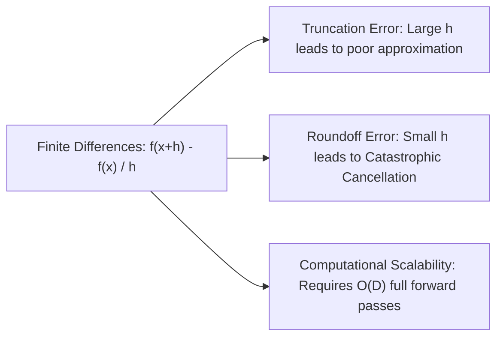
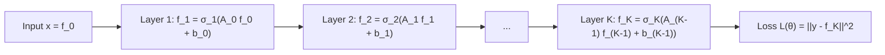
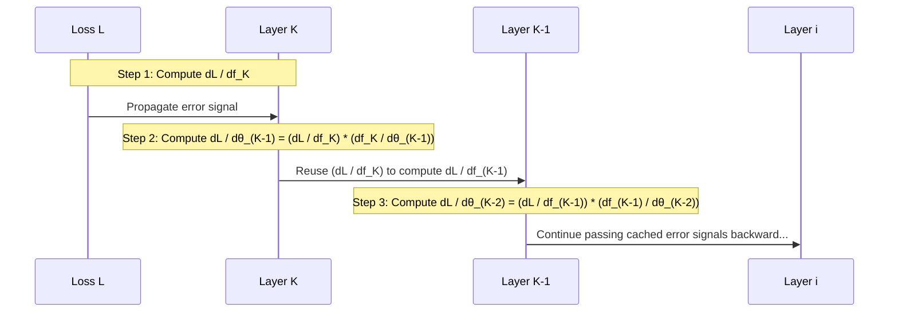
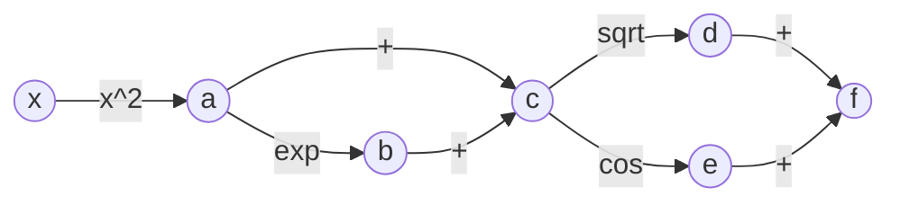
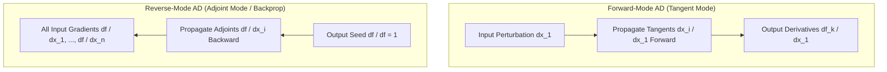
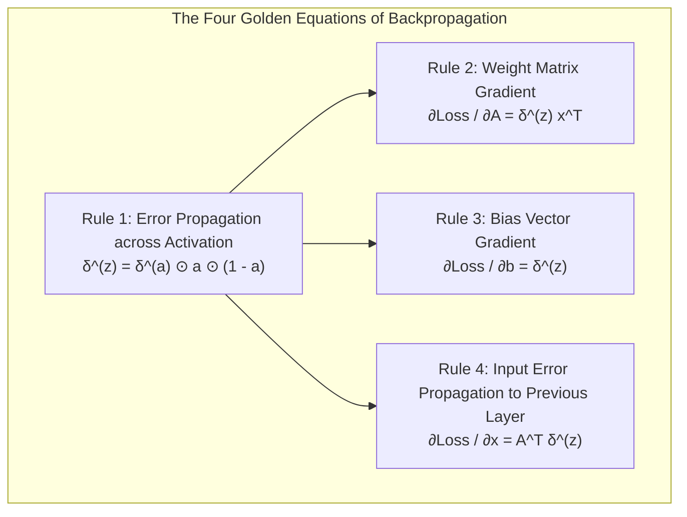

# Comprehensive Master Study Guide: Backpropagation and Automatic Differentiation
**Course:** Mathematical Foundations for Machine Learning & Data Science (ZC416) — Lecture 7  
**Target Audience:** Complete Beginners in Mathematics (Zero Knowledge Assumed $\to$ Path to Mastery)  
**Primary Reference:** Lecture 7 Presentation Slides (*BITS Pilani WILPD - CSIS / MFML & MFDS Team*)

---

## Welcome & Pedagogical Roadmap

Welcome to **Lecture 7**! Let us take a moment to look back at the grand intellectual journey we have traversed across this course:

* In **Lecture 1 (Linear Algebra & Systems of Equations)**, we mastered solving systems of linear equations ($A\mathbf{x} = \mathbf{b}$), Gaussian elimination, row echelon forms, and matrix inverses. That was the study of **computation and linear equations**.
* In **Lecture 2 (Vector Spaces)**, we explored the structural universe where vectors live: spans, linear independence, subspaces, bases, and dimension. That was the study of **algebraic structure**.
* In **Lecture 3 (Analytic Geometry)**, we equipped vector spaces with geometric tools: inner products, norms, angles, projections, and orthogonality. That was the study of **geometry and distance**.
* In **Lecture 4 (Eigenvalues & Eigenvectors)**, we uncovered invariant directions of transformations, spectral theorems, and matrix decompositions. That was the study of **matrix structure and coordinate alignment**.
* In **Lecture 5 (Singular Value Decomposition)**, we extended spectral analysis to arbitrary rectangular matrices, unlocking low-rank approximations and data compression. That was the study of **optimal low-rank representation**.
* In **Lecture 6 (Vector Calculus & Differentiation)**, we stepped from static linear algebra into dynamic calculus: univariate rates of change, partial derivatives, directional derivatives, the gradient vector ($\nabla f$), and the Jacobian and Hessian matrices. That was the study of **multivariate rates of change**.

Now, in **Lecture 7**, we arrive at the computational engine of modern Artificial Intelligence: **Backpropagation and Automatic Differentiation**.

In Lecture 6, you learned *what* a gradient is mathematically. But in practical machine learning, models like Large Language Models (e.g., GPT-4, Gemini) contain **hundreds of billions of parameters**. 
* How does a computer compute the exact derivative of a scalar loss function with respect to hundreds of billions of weights without crashing, without taking centuries, and without accumulating disastrous numerical errors?
* Why do symbolic equations from high school calculus completely break down when applied to deep neural networks?
* How does the chain rule transform into a dynamic programming algorithm that runs in linear time?

The answer is **Reverse-Mode Automatic Differentiation**, implemented in neural networks as the celebrated **Backpropagation Algorithm**.

```mermaid
flowchart TD
    A[Real-World Machine Learning Problem: Minimize Loss L] --> B[Model Architecture: Composed Vector Layers]
    B --> C[Forward Pass: Input x --> Layer 1 --> Layer 2 --> Output y_hat]
    C --> D[Loss Evaluation: L = ||y - y_hat||^2]
    
    D --> E{How to Compute Gradients of L w.r.t All Weights?}
    E -->|Numerical Differences| F[Finite Differences: O D Evaluations, Truncation & Roundoff Error - FAILS]
    E -->|Symbolic Calculus| G[Symbolic Differentiation: Expression Swell & Massive Redundancy - FAILS]
    E -->|Dynamic Graph Evaluation| H[Automatic Differentiation: Reverse-Mode / Backpropagation - WINS]
    
    H --> I[Step 1: Build Directed Acyclic Graph DAG of Elementary Ops]
    H --> J[Step 2: Forward Pass caches intermediate numerical values]
    H --> K[Step 3: Backward Pass propagates Adjoints / Error Signals delta from Loss to Inputs]
    
    K --> L[Core Rules: Hadamard Products, Transposed Weights, Outer Products]
    L --> M[Gradient Descent Update: theta_new = theta_old - eta * grad_theta L]
```

---

### Why Backpropagation and Automatic Differentiation are the Engine of Modern AI

Every breakthrough in Artificial Intelligence over the last decade—from computer vision and autonomous vehicles to natural language processing, speech recognition, and generative diffusion models—relies on gradient-based optimization:

1. **Scalability to Billions of Parameters:** If we used high-school numerical finite differences to compute gradients for a model with 100 billion parameters, computing a *single* gradient update step would require evaluating the neural network 100 billion times! With Backpropagation, the entire gradient vector with respect to all 100 billion parameters is obtained in **just one single backward pass**, which takes roughly the same computational time as two forward passes!
2. **Exact Numerical Precision:** Unlike numerical approximations, automatic differentiation produces mathematically exact derivatives (up to standard machine floating-point precision) without any step-size truncation errors ($O(h)$ or $O(h^2)$).
3. **The Foundation of Deep Learning Frameworks:** Frameworks like **PyTorch (`torch.autograd`)**, **TensorFlow (`tf.GradientTape`)**, and **JAX** are not just linear algebra libraries; they are fundamentally automatic differentiation engines built on computation graphs.
4. **General Scientific Computing:** Beyond AI, reverse-mode differentiation is revolutionizing computational physics, quantitative finance (computing Greek sensitivities), structural engineering, weather forecasting, and molecular dynamics.

---

### Mathematical Symbol Glossary

To ensure complete clarity and eliminate any ambiguity, here is every symbol used throughout this study guide:

| Symbol | Name / Meaning | Plain English Interpretation / Example |
| :---: | :--- | :--- |
| $\mathbf{x}, \mathbf{y}$ | Vectors (bold lowercase) | An ordered array of numbers: $\mathbf{x} = \begin{bmatrix} x_1 \\ x_2 \\ \dots \\ x_n \end{bmatrix} \in \mathbb{R}^n$. |
| $A, B, X, W$ | Matrices (capital letters) | A 2D rectangular grid of numbers: $A \in \mathbb{R}^{m \times n}$ has $m$ rows and $n$ columns. |
| $A_{ij}$ | Matrix entry | The scalar number sitting in row $i$, column $j$ of matrix $A$. |
| $\mathbf{x}^T, A^T$ | Transpose | Swapping rows and columns: $(A^T)_{ij} = A_{ji}$. Turns a column vector into a row vector. |
| $\mathbf{x}^T \mathbf{a}$ | Inner Product (Dot Product) | Sum of element-by-element products: $\mathbf{x}^T \mathbf{a} = \sum_{i=1}^n x_i a_i$. Result is a **scalar**. |
| $\mathbf{u} \mathbf{v}^T$ | Outer Product | Column vector times row vector: $(\mathbf{u}\mathbf{v}^T)_{ij} = u_i v_j$. Result is an $m \times n$ **matrix** of rank 1. |
| $\odot$ | Hadamard Product | Elementwise multiplication of two vectors or matrices of identical dimensions: $(A \odot B)_{ij} = A_{ij} B_{ij}$. |
| $\frac{\partial f}{\partial x}$ | Partial Derivative | Rate of change of scalar $f$ when variable $x$ changes, holding all other variables constant. |
| $\frac{\partial f}{\partial \mathbf{x}}$ | Gradient / Vector Derivative | Vector of partial derivatives of scalar $f$ with respect to each component of $\mathbf{x}$. |
| $J = \frac{\partial \mathbf{f}}{\partial \mathbf{x}}$ | Jacobian Matrix | Matrix of all first-order partial derivatives of a vector-valued function: $J_{ij} = \frac{\partial f_i}{\partial x_j}$. |
| $\operatorname{diag}(\mathbf{v})$ | Diagonal Matrix | A square matrix with the elements of vector $\mathbf{v}$ along the main diagonal, and zeros everywhere else. |
| $\sigma(z)$ | Logistic Sigmoid Function | S-shaped activation function: $\sigma(z) = \frac{1}{1 + e^{-z}}$, maps $\mathbb{R} \to (0, 1)$. |
| $\sigma'(z)$ | Derivative of Sigmoid | Rate of change of sigmoid: $\sigma'(z) = \sigma(z)(1 - \sigma(z))$. |
| $\mathbf{z}$ | Pre-activation vector | Linear combination inside a neural network layer before non-linearity: $\mathbf{z} = A\mathbf{x} + \mathbf{b}$. |
| $\mathbf{a}$ | Activation vector | The output of a neural network layer after applying non-linearity: $\mathbf{a} = \sigma(\mathbf{z})$. |
| $L$ or $\mathcal{L}$ | Loss Function (Cost / Objective) | A scalar metric measuring how far predictions are from ground-truth targets: $L = \|\mathbf{y} - \hat{\mathbf{y}}\|^2$. |
| $\boldsymbol{\delta}^{(z)}$ | Error signal (Adjoint of $\mathbf{z}$) | Vector of partial derivatives of loss with respect to pre-activations: $\boldsymbol{\delta}^{(z)} = \frac{\partial L}{\partial \mathbf{z}}$. |
| $\boldsymbol{\delta}^{(a)}$ | Adjoint of activations $\mathbf{a}$ | Vector of partial derivatives of loss with respect to activations: $\boldsymbol{\delta}^{(a)} = \frac{\partial L}{\partial \mathbf{a}}$. |
| $\mathrm{Pa}(x_i)$ | Parent nodes | In a computation graph, the set of nodes whose outputs directly feed into $x_i$. |
| $\mathrm{Ch}(x_i)$ | Child nodes | In a computation graph, the set of nodes that take $x_i$ as a direct input. |
| $\bar{x}_i$ | Adjoint variable | Shorthand notation in automatic differentiation for $\frac{\partial f}{\partial x_i}$ (the sensitivity of final output to $x_i$). |

---

## Part I: Essential Matrix & Vector Calculus Identities (Slide 4)

Slide 4 of the lecture presents five fundamental gradient identities used relentlessly throughout machine learning, optimization, and neural network theory.

Before deriving them, let us clarify the two common layout conventions in matrix calculus to avoid any future confusion:
* **Numerator Layout (Jacobian Convention):** The derivative of a scalar $f$ with respect to a column vector $\mathbf{x} \in \mathbb{R}^{n \times 1}$ is formatted as a **row vector** of size $1 \times n$:
  $$\frac{\partial f}{\partial \mathbf{x}} = \begin{bmatrix} \frac{\partial f}{\partial x_1} & \frac{\partial f}{\partial x_2} & \dots & \frac{\partial f}{\partial x_n} \end{bmatrix} \in \mathbb{R}^{1 \times n}$$
  *(This is the exact convention adopted by the lecture slides on Slide 4).*
* **Denominator Layout (Gradient Convention):** The derivative of a scalar $f$ with respect to a column vector $\mathbf{x} \in \mathbb{R}^{n \times 1}$ is formatted as a **column vector** of size $n \times 1$:
  $$\nabla_\mathbf{x} f = \left( \frac{\partial f}{\partial \mathbf{x}} \right)^T = \begin{bmatrix} \frac{\partial f}{\partial x_1} \\ \frac{\partial f}{\partial x_2} \\ \vdots \\ \frac{\partial f}{\partial x_n} \end{bmatrix} \in \mathbb{R}^{n \times 1}$$

Let us now rigorously derive all five identities step-by-step from elementary scalar calculus, assuming zero prior matrix calculus knowledge.

---

### 1.1 Identity 1: Derivative of $\mathbf{x}^T \mathbf{a}$ with Respect to $\mathbf{x}$

$$\frac{\partial (\mathbf{x}^T \mathbf{a})}{\partial \mathbf{x}} = \mathbf{a}^T$$

#### Step-by-Step Derivation:
1. Let $\mathbf{x} = \begin{bmatrix} x_1 \\ x_2 \\ \vdots \\ x_n \end{bmatrix} \in \mathbb{R}^n$ and $\mathbf{a} = \begin{bmatrix} a_1 \\ a_2 \\ \vdots \\ a_n \end{bmatrix} \in \mathbb{R}^n$ be two vectors.
2. The expression $\mathbf{x}^T \mathbf{a}$ is the inner product (a single scalar number):
   $$\mathbf{x}^T \mathbf{a} = \begin{bmatrix} x_1 & x_2 & \dots & x_n \end{bmatrix} \begin{bmatrix} a_1 \\ a_2 \\ \vdots \\ a_n \end{bmatrix} = x_1 a_1 + x_2 a_2 + \dots + x_n a_n = \sum_{i=1}^n x_i a_i$$
3. Let $f(\mathbf{x}) = \sum_{i=1}^n x_i a_i$. We take the partial derivative of this scalar sum with respect to a single component $x_k$ (where $k \in \{1, 2, \dots, n\}$).
4. Notice that every term in the sum where $i \ne k$ does not contain $x_k$, so its derivative with respect to $x_k$ is $0$:
   $$\frac{\partial f}{\partial x_k} = \frac{\partial}{\partial x_k} (x_1 a_1 + \dots + x_k a_k + \dots + x_n a_n) = 0 + \dots + \frac{\partial}{\partial x_k}(x_k a_k) + \dots + 0 = a_k$$
5. Now, we assemble the individual partial derivatives $\frac{\partial f}{\partial x_k} = a_k$ into the row vector layout:
   $$\frac{\partial f}{\partial \mathbf{x}} = \begin{bmatrix} \frac{\partial f}{\partial x_1} & \frac{\partial f}{\partial x_2} & \dots & \frac{\partial f}{\partial x_n} \end{bmatrix} = \begin{bmatrix} a_1 & a_2 & \dots & a_n \end{bmatrix} = \mathbf{a}^T$$
   $$\blacksquare$$

> [!NOTE]
> If using denominator layout, the result is $\nabla_\mathbf{x}(\mathbf{x}^T \mathbf{a}) = \mathbf{a}$. Notice that $\mathbf{a}^T$ and $\mathbf{a}$ contain the exact same numbers, differing only in whether they are laid out horizontally or vertically.

---

### 1.2 Identity 2: Derivative of $\mathbf{a}^T \mathbf{x}$ with Respect to $\mathbf{x}$

$$\frac{\partial (\mathbf{a}^T \mathbf{x})}{\partial \mathbf{x}} = \mathbf{a}^T$$

#### Step-by-Step Derivation:
1. Recall from basic linear algebra that the inner product of real vectors is commutative (the order does not matter):
   $$\mathbf{a}^T \mathbf{x} = \sum_{i=1}^n a_i x_i = \sum_{i=1}^n x_i a_i = \mathbf{x}^T \mathbf{a}$$
2. Furthermore, since $\mathbf{a}^T \mathbf{x}$ is a $1 \times 1$ matrix (a scalar), it is equal to its own transpose:
   $$\mathbf{a}^T \mathbf{x} = (\mathbf{a}^T \mathbf{x})^T = \mathbf{x}^T (\mathbf{a}^T)^T = \mathbf{x}^T \mathbf{a}$$
3. Applying Identity 1 directly:
   $$\frac{\partial (\mathbf{a}^T \mathbf{x})}{\partial \mathbf{x}} = \frac{\partial (\mathbf{x}^T \mathbf{a})}{\partial \mathbf{x}} = \mathbf{a}^T \quad \blacksquare$$

---

### 1.3 Identity 3: Derivative of Bilinear Form $\mathbf{a}^T X \mathbf{b}$ with Respect to Matrix $X$

$$\frac{\partial (\mathbf{a}^T X \mathbf{b})}{\partial X} = \mathbf{a} \mathbf{b}^T$$

#### What Do the Dimensions Mean?
Let $\mathbf{a} \in \mathbb{R}^m$, $X \in \mathbb{R}^{m \times n}$, and $\mathbf{b} \in \mathbb{R}^n$.
* $\mathbf{a}^T$ has dimension $1 \times m$.
* $X$ has dimension $m \times n$.
* $\mathbf{b}$ has dimension $n \times 1$.
* The product $\mathbf{a}^T X \mathbf{b}$ has dimension $(1 \times m) \times (m \times n) \times (n \times 1) = 1 \times 1$, which is a **scalar**.
* Since we are taking the derivative of a scalar with respect to an $m \times n$ matrix $X$, the derivative must also be an $m \times n$ matrix:
  $$\left( \frac{\partial (\mathbf{a}^T X \mathbf{b})}{\partial X} \right)_{ij} = \frac{\partial (\mathbf{a}^T X \mathbf{b})}{\partial X_{ij}}$$

#### Step-by-Step Derivation:
1. Write the scalar quantity $f(X) = \mathbf{a}^T X \mathbf{b}$ explicitly using double summation notation:
   $$X\mathbf{b} = \begin{bmatrix} \sum_{j=1}^n X_{1j} b_j \\ \sum_{j=1}^n X_{2j} b_j \\ \vdots \\ \sum_{j=1}^n X_{mj} b_j \end{bmatrix}$$
   Multiplying by $\mathbf{a}^T = \begin{bmatrix} a_1 & a_2 & \dots & a_m \end{bmatrix}$:
   $$f(X) = \mathbf{a}^T (X\mathbf{b}) = \sum_{i=1}^m a_i \left( \sum_{j=1}^n X_{ij} b_j \right) = \sum_{i=1}^m \sum_{j=1}^n a_i X_{ij} b_j$$
2. Now differentiate this scalar sum with respect to a specific entry of the matrix, say $X_{kl}$ (row $k$, column $l$):
   $$\frac{\partial f}{\partial X_{kl}} = \frac{\partial}{\partial X_{kl}} \left( \sum_{i=1}^m \sum_{j=1}^n a_i X_{ij} b_j \right)$$
3. In this entire double sum of $m \times n$ terms, the specific variable $X_{kl}$ appears in **only one single term**: the term where $i = k$ and $j = l$. Every other term is treated as a constant, so its derivative is zero:
   $$\frac{\partial f}{\partial X_{kl}} = a_k b_l$$
4. Now examine the outer product matrix $\mathbf{a}\mathbf{b}^T$:
   $$\mathbf{a} \mathbf{b}^T = \begin{bmatrix} a_1 \\ a_2 \\ \vdots \\ a_m \end{bmatrix} \begin{bmatrix} b_1 & b_2 & \dots & b_n \end{bmatrix} = \begin{bmatrix} 
   a_1 b_1 & a_1 b_2 & \dots & a_1 b_n \\
   a_2 b_1 & a_2 b_2 & \dots & a_2 b_n \\
   \vdots & \vdots & \ddots & \vdots \\
   a_m b_1 & a_m b_2 & \dots & a_m b_n
   \end{bmatrix}$$
5. The entry in row $k$, column $l$ of the matrix $\mathbf{a}\mathbf{b}^T$ is precisely $a_k b_l$.
6. Since $\frac{\partial f}{\partial X_{kl}} = a_k b_l = (\mathbf{a}\mathbf{b}^T)_{kl}$ for every single row $k$ and column $l$, the entire matrix of derivatives is:
   $$\frac{\partial (\mathbf{a}^T X \mathbf{b})}{\partial X} = \mathbf{a} \mathbf{b}^T \quad \blacksquare$$

---

### 1.4 Identity 4: Derivative of Quadratic Form $\mathbf{x}^T B \mathbf{x}$ with Respect to $\mathbf{x}$

$$\frac{\partial (\mathbf{x}^T B \mathbf{x})}{\partial \mathbf{x}} = \mathbf{x}^T (B + B^T)$$

*Special Case:* If matrix $B$ is symmetric ($B = B^T$), then $B + B^T = B + B = 2B$, yielding:
$$\frac{\partial (\mathbf{x}^T B \mathbf{x})}{\partial \mathbf{x}} = 2\mathbf{x}^T B$$

#### Step-by-Step Derivation:
1. Let $\mathbf{x} \in \mathbb{R}^n$ and $B \in \mathbb{R}^{n \times n}$. The quadratic form is the scalar:
   $$f(\mathbf{x}) = \mathbf{x}^T B \mathbf{x} = \sum_{i=1}^n \sum_{j=1}^n x_i B_{ij} x_j$$
2. Notice that the variable vector $\mathbf{x}$ appears **twice** in every product $x_i B_{ij} x_j$: once as $x_i$ and once as $x_j$.
3. We take the partial derivative with respect to an arbitrary component $x_k$ using the single-variable **Product Rule** ($\frac{d}{dx}[u \cdot v] = \frac{du}{dx} v + u \frac{dv}{dx}$):
   $$\frac{\partial}{\partial x_k}(x_i x_j) = \left( \frac{\partial x_i}{\partial x_k} \right) x_j + x_i \left( \frac{\partial x_j}{\partial x_k} \right)$$
4. The derivative $\frac{\partial x_i}{\partial x_k}$ is equal to $1$ if $i = k$, and $0$ if $i \ne k$. This is known as the **Kronecker delta** ($\delta_{ik}$):
   $$\frac{\partial f}{\partial x_k} = \sum_{i=1}^n \sum_{j=1}^n B_{ij} \left[ \delta_{ik} x_j + x_i \delta_{jk} \right]$$
5. Split this into two separate sums:
   $$\frac{\partial f}{\partial x_k} = \sum_{i=1}^n \sum_{j=1}^n B_{ij} \delta_{ik} x_j + \sum_{i=1}^n \sum_{j=1}^n B_{ij} x_i \delta_{jk}$$
   * In the first sum, the Kronecker delta $\delta_{ik}$ collapses the summation over $i$, leaving only the term where $i = k$:
     $$\sum_{j=1}^n B_{kj} x_j = (B\mathbf{x})_k$$
   * In the second sum, the Kronecker delta $\delta_{jk}$ collapses the summation over $j$, leaving only the term where $j = k$:
     $$\sum_{i=1}^n B_{ik} x_i = \sum_{i=1}^n x_i B_{ik} = (\mathbf{x}^T B)_k$$
6. Combining these two terms gives the $k$-th entry of the derivative vector:
   $$\frac{\partial f}{\partial x_k} = (B\mathbf{x})_k + (\mathbf{x}^T B)_k$$
7. Now let us express $(B\mathbf{x})_k$ as a row-vector entry:
   $$(B\mathbf{x})_k = ((B\mathbf{x})^T)_k = (\mathbf{x}^T B^T)_k$$
8. Therefore:
   $$\frac{\partial f}{\partial x_k} = (\mathbf{x}^T B^T)_k + (\mathbf{x}^T B)_k = [\mathbf{x}^T (B^T + B)]_k = [\mathbf{x}^T (B + B^T)]_k$$
9. Stacking this for all $k = 1, 2, \dots, n$ in row vector layout gives:
   $$\frac{\partial (\mathbf{x}^T B \mathbf{x})}{\partial \mathbf{x}} = \mathbf{x}^T (B + B^T) \quad \blacksquare$$

---

### 1.5 Identity 5: Derivative of Weighted Residual Quadratic Form (Weighted Least Squares)

For a symmetric matrix $W$ ($W = W^T$),
$$\frac{\partial}{\partial \mathbf{s}} \left[ (\mathbf{x} - A\mathbf{s})^T W (\mathbf{x} - A\mathbf{s}) \right] = -2(\mathbf{x} - A\mathbf{s})^T W A$$

#### Why This Formula Matters:
This is the mathematical core of **Weighted Least Squares Regression** and **Linear Kalman Filtering**. Here:
* $\mathbf{x}$ is the observed target vector.
* $A\mathbf{s}$ is the linear model's prediction parameterized by $\mathbf{s}$.
* $\mathbf{e} = (\mathbf{x} - A\mathbf{s})$ is the error (residual) vector.
* $W$ is a symmetric positive-definite weighting matrix (often the inverse covariance matrix of the noise, $W = \Sigma^{-1}$).
* We wish to find the parameter vector $\mathbf{s}$ that minimizes this total weighted squared error.

#### Derivation Method 1: Expanding the Quadratic Form Algebraically
Let us expand the quadratic form term-by-term:
$$g(\mathbf{s}) = (\mathbf{x} - A\mathbf{s})^T W (\mathbf{x} - A\mathbf{s})$$

1. Distribute the transpose across the difference: $(\mathbf{x} - A\mathbf{s})^T = (\mathbf{x}^T - \mathbf{s}^T A^T)$.
2. Substitute into the expression:
   $$g(\mathbf{s}) = (\mathbf{x}^T - \mathbf{s}^T A^T) W (\mathbf{x} - A\mathbf{s})$$
3. Distribute $W$:
   $$g(\mathbf{s}) = (\mathbf{x}^T - \mathbf{s}^T A^T) (W\mathbf{x} - WA\mathbf{s})$$
4. Expand using FOIL (First, Outer, Inner, Last):
   $$g(\mathbf{s}) = \underbrace{\mathbf{x}^T W \mathbf{x}}_{\text{Term 1}} - \underbrace{\mathbf{x}^T W A \mathbf{s}}_{\text{Term 2}} - \underbrace{\mathbf{s}^T A^T W \mathbf{x}}_{\text{Term 3}} + \underbrace{\mathbf{s}^T A^T W A \mathbf{s}}_{\text{Term 4}}$$
5. Notice that Term 3 is a scalar ($1 \times 1$ matrix). Any scalar equals its own transpose!
   $$(\mathbf{s}^T A^T W \mathbf{x})^T = \mathbf{x}^T W^T (A^T)^T (\mathbf{s}^T)^T = \mathbf{x}^T W^T A \mathbf{s}$$
6. Since $W$ is symmetric ($W^T = W$), we have:
   $$\mathbf{x}^T W^T A \mathbf{s} = \mathbf{x}^T W A \mathbf{s}$$
   This means **Term 3 is identical to Term 2**! We combine them:
   $$-\mathbf{x}^T W A \mathbf{s} - \mathbf{s}^T A^T W \mathbf{x} = -2\mathbf{x}^T W A \mathbf{s}$$
7. Rewrite the expanded function:
   $$g(\mathbf{s}) = \mathbf{x}^T W \mathbf{x} - 2\mathbf{x}^T W A \mathbf{s} + \mathbf{s}^T (A^T W A) \mathbf{s}$$
8. Now differentiate each term with respect to $\mathbf{s}$:
   * **Derivative of Term 1 ($\mathbf{x}^T W \mathbf{x}$):** This term contains no $\mathbf{s}$. It is a constant with respect to $\mathbf{s}$.
     $$\frac{\partial}{\partial \mathbf{s}} (\mathbf{x}^T W \mathbf{x}) = \mathbf{0}$$
   * **Derivative of Term 2 ($-2\mathbf{x}^T W A \mathbf{s}$):** Let $\mathbf{a}^T = -2\mathbf{x}^T W A$. This has the form $\mathbf{a}^T \mathbf{s}$. By Identity 2:
     $$\frac{\partial}{\partial \mathbf{s}} (-2\mathbf{x}^T W A \mathbf{s}) = -2\mathbf{x}^T W A$$
   * **Derivative of Term 4 ($\mathbf{s}^T (A^T W A) \mathbf{s}$):** Let $B = A^T W A$. Is $B$ symmetric?
     $$B^T = (A^T W A)^T = A^T W^T (A^T)^T = A^T W A = B$$
     Yes, $B$ is symmetric! Therefore, by Identity 4 (special symmetric case):
     $$\frac{\partial}{\partial \mathbf{s}} (\mathbf{s}^T B \mathbf{s}) = 2\mathbf{s}^T B = 2\mathbf{s}^T (A^T W A)$$
9. Add the results together:
   $$\frac{\partial g}{\partial \mathbf{s}} = \mathbf{0} - 2\mathbf{x}^T W A + 2\mathbf{s}^T A^T W A$$
10. Factor out $-2$ on the left and $W A$ on the right:
    $$\frac{\partial g}{\partial \mathbf{s}} = -2 (\mathbf{x}^T - \mathbf{s}^T A^T) W A = -2 (\mathbf{x} - A\mathbf{s})^T W A \quad \blacksquare$$

#### Derivation Method 2: Multivariate Chain Rule
1. Define the intermediate residual vector $\mathbf{u}(\mathbf{s}) = \mathbf{x} - A\mathbf{s}$.
2. Then $g(\mathbf{u}) = \mathbf{u}^T W \mathbf{u}$.
3. By the multivariate chain rule (in numerator layout):
   $$\frac{\partial g}{\partial \mathbf{s}} = \frac{\partial g}{\partial \mathbf{u}} \frac{\partial \mathbf{u}}{\partial \mathbf{s}}$$
4. By Identity 4, since $W$ is symmetric:
   $$\frac{\partial g}{\partial \mathbf{u}} = 2\mathbf{u}^T W = 2(\mathbf{x} - A\mathbf{s})^T W$$
5. For the linear vector function $\mathbf{u}(\mathbf{s}) = \mathbf{x} - A\mathbf{s}$, its Jacobian with respect to $\mathbf{s}$ is:
   $$\frac{\partial \mathbf{u}}{\partial \mathbf{s}} = -A$$
6. Multiplying them directly:
   $$\frac{\partial g}{\partial \mathbf{s}} = \left[ 2(\mathbf{x} - A\mathbf{s})^T W \right] (-A) = -2(\mathbf{x} - A\mathbf{s})^T W A \quad \blacksquare$$

---

## Part II: The Dilemma of Differentiation — Why Symbolic and Numerical Methods Fail (Slides 5–6)

In machine learning, model training is formulated as an optimization problem: we want to minimize an error function (loss) with respect to the model's parameters $\boldsymbol{\theta}$.

To use gradient-based optimization (such as Gradient Descent: $\boldsymbol{\theta} \leftarrow \boldsymbol{\theta} - \eta \nabla_{\boldsymbol{\theta}} L$), we must compute the gradient $\nabla_{\boldsymbol{\theta}} L$.

Before automatic differentiation, how did people compute derivatives? There were two classical ways:
1. **Numerical Differentiation (Finite Differences)**
2. **Symbolic Differentiation (Computer Algebra)**

As Slide 6 emphasizes, both methods fail catastrophically when applied to modern machine learning. Let us see why.

---

### 2.1 The Failure of Numerical Differentiation (Finite Differences)

The definition of a derivative from introductory calculus is:
$$\frac{df}{dx} = \lim_{h \to 0} \frac{f(x + h) - f(x)}{h}$$

On a computer, we cannot take the limit as $h \to 0$, so we choose a tiny step size, say $h = 10^{-5}$, and compute the finite difference approximation:
$$\frac{\partial f}{\partial \theta_i} \approx \frac{f(\theta_1, \dots, \theta_i + h, \dots, \theta_D) - f(\theta_1, \dots, \theta_i, \dots, \theta_D)}{h}$$

#### Why Numerical Differentiation Fails:
1. **Computational Catastrophe ($O(D)$ Complexity):**
   To compute the gradient with respect to $D$ parameters, you must perturb parameter $\theta_1$, re-run the entire neural network, perturb $\theta_2$, re-run the neural network, and repeat this $D$ times!
   * In a modern network with $D = 10^9$ (1 billion) parameters, computing a single gradient step would require **1 billion forward passes**. This would take weeks for a single training step!
2. **Numerical Instability & Catastrophic Cancellation:**
   * If $h$ is chosen **too large**, the approximation error (truncation error of $O(h)$ or $O(h^2)$) is massive.
   * If $h$ is chosen **too small** (e.g., $h \le 10^{-16}$ in 64-bit floating point), $f(\theta + h)$ and $f(\theta)$ are nearly identical. Subtracting two nearly equal floating-point numbers causes **catastrophic cancellation**, destroying significant digits and introducing pure numerical noise.



---

### 2.2 The Failure of Symbolic Differentiation & "Expression Swell" (Slide 5)

Symbolic differentiation treats mathematical functions as strings of algebraic symbols and applies formal transformation rules (product rule, chain rule, quotient rule) exactly as you would on paper with a pen.

Slide 5 illustrates the fatal flaw of symbolic differentiation using a seemingly innocent function:
$$f(x) = \sqrt{x^2 + \exp(x^2)} + \cos(x^2 + \exp(x^2))$$

Let us calculate its derivative symbolically, step-by-step:

#### Step 1: Identify the Outer and Inner Functions
Notice that the composite expression $u(x) = x^2 + \exp(x^2)$ appears in both terms!
The function can be written as:
$$f(x) = \sqrt{u(x)} + \cos(u(x)) = [u(x)]^{1/2} + \cos(u(x))$$

#### Step 2: Differentiate the Inner Function $u(x)$
Using the sum rule and the chain rule on $\exp(x^2)$:
$$\frac{du}{dx} = \frac{d}{dx}[x^2] + \frac{d}{dx}[\exp(x^2)] = 2x + \exp(x^2) \cdot \frac{d}{dx}[x^2] = 2x + 2x\exp(x^2) = 2x(1 + \exp(x^2))$$

#### Step 3: Differentiate $f(x)$ with Respect to $x$ using the Chain Rule
$$\frac{df}{dx} = \frac{d}{du}[\sqrt{u}] \cdot \frac{du}{dx} + \frac{d}{du}[\cos(u)] \cdot \frac{du}{dx}$$
$$\frac{df}{dx} = \left( \frac{1}{2\sqrt{u}} \right) \frac{du}{dx} + (-\sin(u)) \frac{du}{dx} = \left( \frac{1}{2\sqrt{u}} - \sin(u) \right) \frac{du}{dx}$$

#### Step 4: Substitute $u(x)$ and $\frac{du}{dx}$ Back into the Expression (Slide 5)
$$\frac{df}{dx} = \frac{2x + 2x\exp(x^2)}{2\sqrt{x^2 + \exp(x^2)}} - \sin(x^2 + \exp(x^2))(2x + 2x\exp(x^2))$$
Factoring out $2x(1 + \exp(x^2))$:
$$\frac{df}{dx} = 2x \left( \frac{1}{2\sqrt{x^2 + \exp(x^2)}} - \sin(x^2 + \exp(x^2)) \right) (1 + \exp(x^2))$$

#### The Crucial Observation (Slide 6):
Look closely at the symbolic derivative expression:
* The sub-expression $x^2$ is evaluated **5 times**!
* The sub-expression $\exp(x^2)$ is evaluated **4 times**!
* The sub-expression $x^2 + \exp(x^2)$ is evaluated **3 times**!

This phenomenon is called **Expression Swell**. When symbolic differentiation is applied to a deep neural network with dozens of nested compositions, the length of the mathematical expression grows **exponentially** with depth! 

Evaluating such an expanded symbolic formula requires massively redundant computations, making it completely impractical for machine learning.

---

### 2.3 The Solution: Automatic Differentiation (Algorithmic Differentiation)

**Automatic Differentiation (AD)** is neither numerical differentiation nor symbolic differentiation:
* Unlike numerical differentiation, AD computes derivatives that are **exact to machine precision** (zero truncation error).
* Unlike symbolic differentiation, AD **does not produce a massive symbolic formula**. Instead, it executes numerical computations directly on intermediate numerical values stored during execution.

AD exploits the fundamental truth that **every computer program, no matter how complex, is merely a sequence of elementary arithmetic operations ($+, -, \times, \div$) and elementary functions ($\exp, \ln, \sin, \cos, \sqrt{\cdot}$)**.

By applying the chain rule to these intermediate steps and caching repeated values, AD computes the exact gradient in $O(1)$ evaluations of the original function!

| Property | Numerical Differentiation | Symbolic Differentiation | Automatic Differentiation (Backprop) |
| :--- | :--- | :--- | :--- |
| **Method** | Finite difference quotient $\frac{f(x+h)-f(x)}{h}$ | Algebraic transformation rules | Execution of chain rule on computational graph |
| **Accuracy** | Approximate (truncation + roundoff errors) | Exact algebraic expression | **Exact to machine precision** |
| **Time Complexity** | $O(D \cdot \text{Cost}(f))$ for $D$ parameters | Can blow up exponentially ($O(2^L)$) | **$O(1 \cdot \text{Cost}(f))$ — Independent of $D$!** |
| **Expression Swell** | None | Massive / Catastrophic | **Zero expression swell** |
| **Suitability for Deep AI**| Completely unusable | Completely unusable | **The universal standard of modern AI** |

---

## Part III: Neural Networks as Composed Vector Functions (Slides 7–8)

Slides 7 and 8 define the formal mathematical architecture of a deep feedforward neural network (Multilayer Perceptron).



---

### 3.1 The Mathematical Structure of a Layer (Slide 7)

In a neural network with $K$ layers:
* Let $\mathbf{x}_{i-1}$ (or $\mathbf{f}_{i-1}$) denote the output vector of layer $i-1$.
* The transformation performed by layer $i$ is given by:
  $$\mathbf{f}_i(\mathbf{x}_{i-1}) = \sigma(A_{i-1} \mathbf{x}_{i-1} + \mathbf{b}_{i-1})$$
  where:
  * $\mathbf{x}_{i-1} \in \mathbb{R}^{n_{i-1}}$ is the input to layer $i$ (dimension $n_{i-1} \times 1$).
  * $A_{i-1} \in \mathbb{R}^{n_i \times n_{i-1}}$ is the **weight matrix** connecting layer $i-1$ to layer $i$.
  * $\mathbf{b}_{i-1} \in \mathbb{R}^{n_i}$ is the **bias vector** of layer $i$.
  * $\sigma(\cdot)$ is an **activation function** applied element-by-element (such as Sigmoid, ReLU, or Tanh).

> [!NOTE]
> **Why do we need the activation function $\sigma$?**  
> If $\sigma$ were omitted (or were linear, $\sigma(z) = z$), then a 100-layer neural network would simply multiply 100 matrices together: $A_{99} A_{98} \dots A_0 \mathbf{x} = A_{\text{total}} \mathbf{x}$. By linear algebra, the product of linear transformations is just another single linear transformation! Such a network could never learn non-linear patterns (like computer vision or language). The activation function injects the crucial non-linearity that allows neural networks to approximate any continuous function (Universal Approximation Theorem).

---

### 3.2 The Global Forward Pass and Loss Minimization (Slide 8)

Let $\mathbf{x}$ be the network's input vector. We define the recursive forward evaluation:
$$\mathbf{f}_0 := \mathbf{x}$$
$$\mathbf{f}_i := \sigma_i(A_{i-1} \mathbf{f}_{i-1} + \mathbf{b}_{i-1}), \quad \text{for } i = 1, 2, \dots, K$$

The final layer output $\mathbf{f}_K(\boldsymbol{\theta}, \mathbf{x})$ is the network's ultimate prediction $\hat{\mathbf{y}}$.

#### The Model Parameters:
All tunable parameters of the neural network are collected into a single set $\boldsymbol{\theta}$:
$$\boldsymbol{\theta} = \{A_0, \mathbf{b}_0, A_1, \mathbf{b}_1, \dots, A_{K-1}, \mathbf{b}_{K-1}\}$$
Each pair $\boldsymbol{\theta}_j = \{A_j, \mathbf{b}_j\}$ represents the weights and biases of layer $j+1$.

#### The Optimization Objective:
Given a training sample with ground-truth label $\mathbf{y}$, we measure prediction error using the **Squared Error Loss**:
$$L(\boldsymbol{\theta}) = \|\mathbf{y} - \mathbf{f}_K(\boldsymbol{\theta}, \mathbf{x})\|^2 = \sum_{j=1}^{n_K} (y_j - (\mathbf{f}_K)_j)^2$$

Our goal is to find the optimal parameters $\boldsymbol{\theta}^*$ that minimize $L(\boldsymbol{\theta})$:
$$\boldsymbol{\theta}^* = \arg\min_{\boldsymbol{\theta}} L(\boldsymbol{\theta})$$

To update parameters using gradient descent:
$$\boldsymbol{\theta}_j \leftarrow \boldsymbol{\theta}_j - \eta \frac{\partial L}{\partial \boldsymbol{\theta}_j}$$
we must compute the partial derivative of $L$ with respect to **every weight matrix $A_j$ and bias vector $\mathbf{b}_j$ across every layer $j = 0, 1, \dots, K-1$**.

---

## Part IV: The Chain Rule Across Layers & The Core Principle of Backpropagation (Slides 9–10)

Slide 9 demonstrates how the multivariate chain rule propagates derivatives backward from the output layer through the hidden layers.

---

### 4.1 Layer-by-Layer Derivation via the Chain Rule (Slide 9)

Let us observe the function composition:
$$L \longleftarrow \mathbf{f}_K \longleftarrow \mathbf{f}_{K-1} \longleftarrow \mathbf{f}_{K-2} \longleftarrow \dots \longleftarrow \mathbf{f}_{i+1} \longleftarrow \mathbf{f}_i \longleftarrow \dots \longleftarrow \mathbf{f}_1 \longleftarrow \mathbf{f}_0 = \mathbf{x}$$

Now, apply the chain rule to differentiate $L$ with respect to each layer's parameter set $\boldsymbol{\theta}_j$:

1. **For the final layer parameters $\boldsymbol{\theta}_{K-1}$:**
   The loss $L$ depends directly on $\mathbf{f}_K$, and $\mathbf{f}_K$ depends directly on $\boldsymbol{\theta}_{K-1}$:
   $$\frac{\partial L}{\partial \boldsymbol{\theta}_{K-1}} = \frac{\partial L}{\partial \mathbf{f}_K} \frac{\partial \mathbf{f}_K}{\partial \boldsymbol{\theta}_{K-1}}$$

2. **For the second-to-last layer parameters $\boldsymbol{\theta}_{K-2}$:**
   The loss $L$ affects $\mathbf{f}_K$, which depends on $\mathbf{f}_{K-1}$, which depends on $\boldsymbol{\theta}_{K-2}$:
   $$\frac{\partial L}{\partial \boldsymbol{\theta}_{K-2}} = \underbrace{\frac{\partial L}{\partial \mathbf{f}_K} \frac{\partial \mathbf{f}_K}{\partial \mathbf{f}_{K-1}}}_{\text{Sensitivity to } \mathbf{f}_{K-1}} \frac{\partial \mathbf{f}_{K-1}}{\partial \boldsymbol{\theta}_{K-2}}$$

3. **For the third-to-last layer parameters $\boldsymbol{\theta}_{K-3}$:**
   $$\frac{\partial L}{\partial \boldsymbol{\theta}_{K-3}} = \underbrace{\frac{\partial L}{\partial \mathbf{f}_K} \frac{\partial \mathbf{f}_K}{\partial \mathbf{f}_{K-1}} \frac{\partial \mathbf{f}_{K-1}}{\partial \mathbf{f}_{K-2}}}_{\text{Sensitivity to } \mathbf{f}_{K-2}} \frac{\partial \mathbf{f}_{K-2}}{\partial \boldsymbol{\theta}_{K-3}}$$

4. **In general, for any arbitrary layer $i$ ($i = 0, 1, \dots, K-1$):**
   $$\frac{\partial L}{\partial \boldsymbol{\theta}_i} = \left( \frac{\partial L}{\partial \mathbf{f}_K} \frac{\partial \mathbf{f}_K}{\partial \mathbf{f}_{K-1}} \frac{\partial \mathbf{f}_{K-1}}{\partial \mathbf{f}_{K-2}} \dots \frac{\partial \mathbf{f}_{i+2}}{\partial \mathbf{f}_{i+1}} \right) \frac{\partial \mathbf{f}_{i+1}}{\partial \boldsymbol{\theta}_i}$$

---

### 4.2 The Dynamic Programming Insight (Slide 10)

Slide 10 presents the foundational insight that makes backpropagation practical:

> **Slide 10:** *"If the partial derivatives $\frac{\partial L}{\partial \boldsymbol{\theta}_{i+1}}$ (and the intermediate layer sensitivities $\frac{\partial L}{\partial \mathbf{f}_{i+1}}$) are computed, then the computation can be reused to compute $\frac{\partial L}{\partial \boldsymbol{\theta}_i}$."*

Look closely at the chain rule expansion:
$$\frac{\partial L}{\partial \mathbf{f}_i} = \underbrace{\left( \frac{\partial L}{\partial \mathbf{f}_K} \frac{\partial \mathbf{f}_K}{\partial \mathbf{f}_{K-1}} \dots \frac{\partial \mathbf{f}_{i+2}}{\partial \mathbf{f}_{i+1}} \right)}_{\text{Exactly equal to } \frac{\partial L}{\partial \mathbf{f}_{i+1}}!} \frac{\partial \mathbf{f}_{i+1}}{\partial \mathbf{f}_i}$$

This gives the clean recurrence relation:
$$\frac{\partial L}{\partial \mathbf{f}_i} = \frac{\partial L}{\partial \mathbf{f}_{i+1}} \frac{\partial \mathbf{f}_{i+1}}{\partial \mathbf{f}_i}$$



Instead of computing the long product of Jacobians from scratch for every single layer (which would require $O(K^2)$ matrix multiplications), we compute the sensitivity backward starting from the loss:
* We compute $\frac{\partial L}{\partial \mathbf{f}_K}$ once.
* Multiply by $\frac{\partial \mathbf{f}_K}{\partial \mathbf{f}_{K-1}}$ to get $\frac{\partial L}{\partial \mathbf{f}_{K-1}}$.
* Multiply by $\frac{\partial \mathbf{f}_{K-1}}{\partial \mathbf{f}_{K-2}}$ to get $\frac{\partial L}{\partial \mathbf{f}_{K-2}}$.
* And so on, until we reach the input!

This dynamic programming caching strategy reduces the computational cost from $O(K^2)$ down to **$O(K)$ linear time**!

---

## Part V: Meticulous Walkthrough of Computation Graphs & Reverse-Mode Differentiation (Slides 11–14)

To make this abstract idea completely concrete, Slides 11–14 re-examine the complex function from Slide 5:
$$f(x) = \sqrt{x^2 + \exp(x^2)} + \cos(x^2 + \exp(x^2))$$
and demonstrate how a **Computation Graph** solves the expression swell problem completely.

---

### 5.1 Deconstructing the Function into Elementary Steps (Slide 11)

Instead of treating $f(x)$ as a single monolithic equation, we break it down into a sequence of simple, atomic operations where each variable depends only on previously computed variables:

1. $a = x^2$ *(square the input)*
2. $b = \exp(a)$ *(exponentiate $a$)*
3. $c = a + b$ *(sum $a$ and $b$)*
4. $d = \sqrt{c}$ *(take square root of $c$)*
5. $e = \cos(c)$ *(take cosine of $c$)*
6. $f = d + e$ *(sum $d$ and $e$ to produce final output)*

This decomposition forms a **Directed Acyclic Graph (DAG)**:



---

### 5.2 Computing Local Elementary Derivatives (Slide 12)

For every single node in this graph, we compute its **local derivative** with respect to its immediate parents. These are simple high-school single-variable calculus derivatives:

| Intermediate Node | Elementary Operation | Parents | Local Derivative(s) |
| :---: | :---: | :---: | :--- |
| $a$ | $a = x^2$ | $x$ | $\frac{\partial a}{\partial x} = 2x$ |
| $b$ | $b = \exp(a)$ | $a$ | $\frac{\partial b}{\partial a} = \exp(a)$ |
| $c$ | $c = a + b$ | $a, b$ | $\frac{\partial c}{\partial a} = 1, \quad \frac{\partial c}{\partial b} = 1$ |
| $d$ | $d = \sqrt{c} = c^{1/2}$ | $c$ | $\frac{\partial d}{\partial c} = \frac{1}{2} c^{-1/2} = \frac{1}{2\sqrt{c}}$ |
| $e$ | $e = \cos(c)$ | $c$ | $\frac{\partial e}{\partial c} = -\sin(c)$ |
| $f$ | $f = d + e$ | $d, e$ | $\frac{\partial f}{\partial d} = 1, \quad \frac{\partial f}{\partial e} = 1$ |

Notice how simple every single derivative in this table is! No messy formulas, no giant fractions.

---

### 5.3 The Reverse Pass: Adjoint Propagation (Slide 13–14)

In automatic differentiation, we define the **adjoint** (or error sensitivity) of any variable $v$ as:
$$\bar{v} = \frac{\partial f}{\partial v}$$
This measures: *"If I wiggle variable $v$ by a tiny amount $\epsilon$, by how much does the final output $f$ change?"*

We propagate adjoints in reverse order: from output $f$ back to input $x$.

#### Step 1: Base Case (The Output Node)
The rate of change of $f$ with respect to itself is obviously $1$:
$$\bar{f} = \frac{\partial f}{\partial f} = 1$$

#### Step 2: Adjoints of Nodes $d$ and $e$
The only node that takes $d$ as input is $f$:
$$\bar{d} = \frac{\partial f}{\partial d} = \frac{\partial f}{\partial f} \frac{\partial f}{\partial d} = \bar{f} \cdot 1 = 1 \cdot 1 = 1$$
Similarly, the only node that takes $e$ as input is $f$:
$$\bar{e} = \frac{\partial f}{\partial e} = \frac{\partial f}{\partial f} \frac{\partial f}{\partial e} = \bar{f} \cdot 1 = 1 \cdot 1 = 1$$

#### Step 3: Adjoint of Node $c$ (Slide 13)
Notice that node $c$ forks into **two** downstream children: $d$ and $e$!  
By the multivariable chain rule, we must **sum the contributions from all children**:
$$\bar{c} = \frac{\partial f}{\partial c} = \frac{\partial f}{\partial d} \frac{\partial d}{\partial c} + \frac{\partial f}{\partial e} \frac{\partial e}{\partial c}$$
Substituting the local derivatives:
$$\bar{c} = \bar{d} \cdot \left(\frac{1}{2\sqrt{c}}\right) + \bar{e} \cdot (-\sin(c)) = 1 \cdot \left(\frac{1}{2\sqrt{c}}\right) + 1 \cdot (-\sin(c)) = \frac{1}{2\sqrt{c}} - \sin(c)$$

#### Step 4: Adjoint of Node $b$ (Slide 13)
Node $b$ feeds only into node $c$:
$$\bar{b} = \frac{\partial f}{\partial b} = \frac{\partial f}{\partial c} \frac{\partial c}{\partial b} = \bar{c} \cdot 1 = \bar{c}$$

#### Step 5: Adjoint of Node $a$ (Slide 13)
Node $a$ feeds into **two** nodes: $b$ and $c$!  
Again, we sum the contributions from both children:
$$\bar{a} = \frac{\partial f}{\partial a} = \frac{\partial f}{\partial b} \frac{\partial b}{\partial a} + \frac{\partial f}{\partial c} \frac{\partial c}{\partial a}$$
Substituting the known adjoints and local derivatives:
$$\bar{a} = \bar{b} \cdot \exp(a) + \bar{c} \cdot 1$$
Since $\bar{b} = \bar{c}$, we can factor out $\bar{c}$:
$$\bar{a} = \bar{c} \exp(a) + \bar{c} = \bar{c}(\exp(a) + 1)$$

#### Step 6: Adjoint of the Input Variable $x$ (Slide 13–14)
Node $x$ feeds only into $a$:
$$\bar{x} = \frac{\partial f}{\partial x} = \frac{\partial f}{\partial a} \frac{\partial a}{\partial x} = \bar{a} \cdot (2x) = 2x \bar{a}$$

#### Step 7: Final Assembly
Substitute $\bar{a}$ and $\bar{c}$ backward:
$$\bar{x} = 2x \cdot \left[ \bar{c} (\exp(a) + 1) \right] = 2x \left( \frac{1}{2\sqrt{c}} - \sin(c) \right) (\exp(a) + 1)$$
Finally, substitute $a = x^2$ and $c = x^2 + \exp(x^2)$:
$$\frac{df}{dx} = 2x \left( \frac{1}{2\sqrt{x^2 + \exp(x^2)}} - \sin(x^2 + \exp(x^2)) \right) (1 + \exp(x^2))$$

> [!IMPORTANT]
> **Look at the Magic That Just Happened:**  
> We obtained the **exact same formula** as the painful symbolic derivative on Slide 5!  
> But on a computer running automatic differentiation, **we never write down the symbolic formula at all**. We simply evaluate the numbers forward, and then evaluate the numbers backward!  
> Every repeated sub-expression ($x^2$, $\exp(x^2)$, $c$) is evaluated **exactly once**, eliminating all redundant work.

---

### 5.4 Concrete Numerical Demonstration at $x = 1.0$

Let us trace through this exact algorithm with real numbers at $x = 1.0$:

#### 1. Forward Pass (Computing Values):
1. $a = x^2 = 1.0^2 = 1.000000$
2. $b = \exp(a) = e^{1.0} \approx 2.718282$
3. $c = a + b = 1.000000 + 2.718282 = 3.718282$
4. $d = \sqrt{c} = \sqrt{3.718282} \approx 1.928285$
5. $e = \cos(c) = \cos(3.718282 \text{ radians}) \approx -0.838272$
6. $f = d + e = 1.928285 + (-0.838272) = 1.090012$

#### 2. Backward Pass (Computing Derivatives):
1. $\bar{f} = 1.000000$
2. $\bar{d} = \bar{f} \cdot 1 = 1.000000$
3. $\bar{e} = \bar{f} \cdot 1 = 1.000000$
4. Local derivatives at $c = 3.718282$:
   * $\frac{\partial d}{\partial c} = \frac{1}{2\sqrt{3.718282}} = \frac{1}{2(1.928285)} \approx 0.259298$
   * $\frac{\partial e}{\partial c} = -\sin(3.718282) \approx -(-0.545251) = +0.545251$
5. $\bar{c} = \bar{d} \frac{\partial d}{\partial c} + \bar{e} \frac{\partial e}{\partial c} = (1.0)(0.259298) + (1.0)(0.545251) = 0.804549$
6. $\bar{b} = \bar{c} \cdot 1 = 0.804549$
7. $\bar{a} = \bar{b} \exp(a) + \bar{c} \cdot 1 = (0.804549)(2.718282) + (0.804549)(1) = 2.186991 + 0.804549 = 2.991541$
8. $\bar{x} = \bar{a} \cdot 2x = (2.991541) \cdot 2(1.0) = 5.983083$

#### Verification with Analytical Formula:
$$f'(1.0) = 2(1.0) \left[ \frac{1}{2\sqrt{3.718282}} - \sin(3.718282) \right] (1 + e^1)$$
$$f'(1.0) = 2 \cdot [0.259298 - (-0.545251)] \cdot [1 + 2.718282]$$
$$f'(1.0) = 2 \cdot [0.804549] \cdot [3.718282] = 5.983083$$
The results match to 6 decimal places!

---

## Part VI: Formal Mathematical Framework of Automatic Differentiation (Slides 15–16)

Slides 15 and 16 formalize the computation graph into a rigorous general mathematical framework.

---

### 6.1 The Directed Acyclic Graph (DAG) Formalism (Slide 15)

Let a computational process be represented as an ordered sequence of variables indexed from $1$ to $D$:
1. **Input Variables:** $x_1, x_2, \dots, x_d$ (the external inputs, such as training data and network parameters $\boldsymbol{\theta}$).
2. **Intermediate Variables:** $x_{d+1}, x_{d+2}, \dots, x_{D-1}$ (the intermediate calculations).
3. **Output Variable:** $x_D$ (the scalar objective function, such as the total Loss $L$).

Every variable $x_i$ ($i > d$) is defined as an elementary function $g_i$ of its direct **parent nodes**:
$$x_i = g_i(x_{\mathrm{Pa}(x_i)})$$
where $\mathrm{Pa}(x_i)$ is the set of indices of nodes that directly feed into $x_i$:
$$\mathrm{Pa}(x_i) = \{j \mid \text{there is a directed edge from } x_j \to x_i\}$$

---

### 6.2 The Master Backpropagation Equation (Slide 16)

Slide 16 provides the universal chain rule on computation graphs:

#### 1. Base Case:
The final node $f = x_D$ has sensitivity $1$ with respect to itself:
$$\frac{\partial f}{\partial x_D} = 1$$

#### 2. Reverse Recurrence for Any Other Node $x_i$ ($i < D$):
To compute how the final output $f$ changes when node $x_i$ changes, we must sum over all child nodes $x_j$ that consume $x_i$ (i.e., all $x_j$ such that $x_i \in \mathrm{Pa}(x_j)$):
$$\frac{\partial f}{\partial x_i} = \sum_{x_j : x_i \in \mathrm{Pa}(x_j)} \frac{\partial f}{\partial x_j} \frac{\partial x_j}{\partial x_i}$$
Since $x_j = g_j(x_{\mathrm{Pa}(x_j)})$, this is written as:
$$\frac{\partial f}{\partial x_i} = \sum_{x_j : x_i \in \mathrm{Pa}(x_j)} \frac{\partial f}{\partial x_j} \frac{\partial g_j}{\partial x_i}$$

Using adjoint notation ($\bar{x}_i \equiv \frac{\partial f}{\partial x_i}$):
$$\bar{x}_i = \sum_{j \in \mathrm{Ch}(x_i)} \bar{x}_j \frac{\partial g_j}{\partial x_i}$$
where $\mathrm{Ch}(x_i)$ denotes the set of children of $x_i$.

> [!NOTE]
> **Slide 16 Remark:** *"For neural network training, we backpropagate the error of the prediction with respect to the label."*  
> The scalar output $x_D$ is the scalar Loss function $L(\mathbf{y}, \hat{\mathbf{y}})$, and the input variables $x_1, \dots, x_d$ include all weights and biases. Backpropagation is simply this exact graph recurrence applied to deep neural networks!

---

### 6.3 Forward-Mode vs. Reverse-Mode Automatic Differentiation

A critical conceptual distinction every machine learning practitioner must master is the difference between **Forward-Mode** and **Reverse-Mode** Automatic Differentiation.



#### What is Forward-Mode AD?
In Forward-Mode, derivatives are computed **simultaneously alongside the forward evaluation** of the function:
* We initialize an input direction vector (tangent vector) $\dot{\mathbf{x}} = \mathbf{v}$.
* At every elementary operation, we evaluate the function value $x_i$ AND its directional derivative $\dot{x}_i = \sum_{p \in \mathrm{Pa}(x_i)} \frac{\partial g_i}{\partial x_p} \dot{x}_p$.
* In a single forward pass, Forward-Mode computes the directional derivative with respect to **one single input variable**.

#### When to Use Which?
Suppose a function maps $n$ inputs to $m$ outputs: $f: \mathbb{R}^n \to \mathbb{R}^m$. Its Jacobian matrix $J = \frac{\partial f}{\partial \mathbf{x}}$ has size $m \times n$.
* **Forward-Mode AD** computes one **column** of the Jacobian per pass (a Jacobian-Vector Product, **JVP**).
  * To compute the full Jacobian, it requires **$n$ forward passes**.
  * Ideal when $n \ll m$ (few inputs, many outputs).
* **Reverse-Mode AD (Backpropagation)** computes one **row** of the Jacobian per pass (a Vector-Jacobian Product, **VJP**).
  * To compute the full gradient of a scalar function ($m = 1$), it requires **only $1$ backward pass**, regardless of how large $n$ is!
  * Ideal when $n \gg m$ (many inputs, few outputs).

#### Why Machine Learning Uses Reverse-Mode:
In deep learning:
* Number of outputs: $m = 1$ (the scalar loss $L$).
* Number of inputs (parameters): $n = 10^9$ (one billion weights).

If we used Forward-Mode AD, we would have to run the network **1 billion times** to get the gradient!  
With Reverse-Mode AD (Backpropagation), we get all 1 billion derivatives in **1 single backward pass**!

---

## Part VII: Complete Step-by-Step Derivation: Backpropagation Through a Sigmoid Layer (Slides 17–25)

Slides 17 through 25 present the crowning technical derivation of Lecture 7: a complete, mathematically rigorous derivation of backpropagation through a fully connected neural network layer equipped with a sigmoid activation function.

---

### 7.1 Layer Definitions and Setup (Slide 17)

Consider a standard neural network layer:
$$\mathbf{z} = A\mathbf{x} + \mathbf{b} \quad \text{--- (Equation 1: Pre-activation)}$$
$$\mathbf{a} = \sigma(\mathbf{z}) \quad \text{--- (Equation 2: Activation)}$$

Let us carefully list the dimensions of every mathematical object:
* $\mathbf{x} \in \mathbb{R}^n$ is the input column vector ($n \times 1$).
* $A \in \mathbb{R}^{m \times n}$ is the weight matrix ($m$ rows, $n$ columns).
* $\mathbf{b} \in \mathbb{R}^m$ is the bias column vector ($m \times 1$).
* $\mathbf{z} \in \mathbb{R}^m$ is the pre-activation column vector ($m \times 1$).
* $\mathbf{a} \in \mathbb{R}^m$ is the activation column vector ($m \times 1$).
* $\sigma(z)$ is the standard logistic sigmoid function:
  $$\sigma(z) = \frac{1}{1 + e^{-z}} = (1 + e^{-z})^{-1}$$
  applied elementwise to each component of $\mathbf{z}$:
  $$\mathbf{a} = \begin{bmatrix} a_1 \\ a_2 \\ \vdots \\ a_m \end{bmatrix} = \begin{bmatrix} \sigma(z_1) \\ \sigma(z_2) \\ \vdots \\ \sigma(z_m) \end{bmatrix}$$

---

### 7.2 The Loss Function & Error Signals (Adjoints) (Slide 18)

Let the loss function be a scalar value $\mathrm{Loss} \in \mathbb{R}$.
We define the backpropagated error signals (adjoints) for activations and pre-activations:
$$\boldsymbol{\delta}^{(a)} = \frac{\partial \mathrm{Loss}}{\partial \mathbf{a}} \quad \text{--- (Equation 3)}$$
$$\boldsymbol{\delta}^{(z)} = \frac{\partial \mathrm{Loss}}{\partial \mathbf{z}} \quad \text{--- (Equation 4)}$$

*Component-wise definitions:*
$$\delta^{(a)}_i = \frac{\partial \mathrm{Loss}}{\partial a_i}, \qquad \delta^{(z)}_i = \frac{\partial \mathrm{Loss}}{\partial z_i}$$

---

### 7.3 Rigorous Proof: The Derivative of the Logistic Sigmoid (Slide 18)

Slide 18 states:
$$\sigma'(z) = \sigma(z)(1 - \sigma(z)) \implies \frac{\partial a_i}{\partial z_i} = a_i(1 - a_i)$$

Let us prove this step-by-step without skipping any intermediate algebra:

1. Express $\sigma(z)$ using negative powers:
   $$\sigma(z) = (1 + e^{-z})^{-1}$$
2. Apply the single-variable **Power Rule** ($\frac{d}{dz}[u^{-1}] = -u^{-2} \frac{du}{dz}$):
   $$\sigma'(z) = \frac{d}{dz} \left[ (1 + e^{-z})^{-1} \right] = -(1 + e^{-z})^{-2} \cdot \frac{d}{dz}(1 + e^{-z})$$
3. Compute the derivative of the inner function $(1 + e^{-z})$:
   $$\frac{d}{dz}(1 + e^{-z}) = 0 + e^{-z} \cdot \frac{d}{dz}(-z) = -e^{-z}$$
4. Multiply the terms together:
   $$\sigma'(z) = -(1 + e^{-z})^{-2} \cdot (-e^{-z}) = \frac{e^{-z}}{(1 + e^{-z})^2}$$
5. Now split the fraction into two factors:
   $$\sigma'(z) = \frac{1}{1 + e^{-z}} \cdot \frac{e^{-z}}{1 + e^{-z}}$$
6. Look at the second factor: add and subtract $1$ in its numerator:
   $$\frac{e^{-z}}{1 + e^{-z}} = \frac{(1 + e^{-z}) - 1}{1 + e^{-z}} = \frac{1 + e^{-z}}{1 + e^{-z}} - \frac{1}{1 + e^{-z}} = 1 - \frac{1}{1 + e^{-z}}$$
7. Substitute this back:
   $$\sigma'(z) = \underbrace{\left( \frac{1}{1 + e^{-z}} \right)}_{\sigma(z)} \cdot \underbrace{\left( 1 - \frac{1}{1 + e^{-z}} \right)}_{1 - \sigma(z)}$$
   $$\sigma'(z) = \sigma(z)(1 - \sigma(z)) \quad \blacksquare$$

Since $a_i = \sigma(z_i)$, this immediately gives:
$$\frac{\partial a_i}{\partial z_i} = a_i (1 - a_i)$$

---

### 7.4 The Elementwise Property and the Jacobian Matrix (Slides 19–20)

Because the sigmoid activation is applied **elementwise**:
* Activation $a_1$ depends **only** on $z_1$. It does not depend on $z_2, z_3, \dots, z_m$.
* In general, $a_i = \sigma(z_i)$ depends strictly on $z_i$.

Therefore, for any $i \ne j$:
$$\frac{\partial a_i}{\partial z_j} = 0 \quad (\text{for } i \ne j)$$

Now, let us construct the full $m \times m$ **Jacobian matrix** $\frac{\partial \mathbf{a}}{\partial \mathbf{z}}$:
$$\frac{\partial \mathbf{a}}{\partial \mathbf{z}} = \begin{bmatrix}
\frac{\partial a_1}{\partial z_1} & \frac{\partial a_1}{\partial z_2} & \dots & \frac{\partial a_1}{\partial z_m} \\
\frac{\partial a_2}{\partial z_1} & \frac{\partial a_2}{\partial z_2} & \dots & \frac{\partial a_2}{\partial z_m} \\
\vdots & \vdots & \ddots & \vdots \\
\frac{\partial a_m}{\partial z_1} & \frac{\partial a_m}{\partial z_2} & \dots & \frac{\partial a_m}{\partial z_m}
\end{bmatrix}$$

Substituting $\frac{\partial a_i}{\partial z_i} = a_i(1 - a_i)$ and $\frac{\partial a_i}{\partial z_j} = 0$ for $i \ne j$:
$$\frac{\partial \mathbf{a}}{\partial \mathbf{z}} = \begin{bmatrix}
a_1(1 - a_1) & 0 & \dots & 0 \\
0 & a_2(1 - a_2) & \dots & 0 \\
\vdots & \vdots & \ddots & \vdots \\
0 & 0 & \dots & a_m(1 - a_m)
\end{bmatrix}$$

This is a **pure diagonal matrix**!

---

### 7.5 The Hadamard Product and Computing $\boldsymbol{\delta}^{(z)}$ (Slides 21–22)

In compact mathematical form, the diagonal Jacobian is written as:
$$\frac{\partial \mathbf{a}}{\partial \mathbf{z}} = \operatorname{diag}(\mathbf{a} \odot (\mathbf{1} - \mathbf{a}))$$

#### What is the Hadamard Product ($\odot$)?
Slide 21 reminds us:
The **Hadamard product** (also known as the entrywise or elementwise product), denoted by $\odot$, multiplies corresponding components of two vectors or matrices of the same shape:
$$\mathbf{u} \odot \mathbf{v} = \begin{bmatrix} u_1 \\ u_2 \\ \vdots \\ u_m \end{bmatrix} \odot \begin{bmatrix} v_1 \\ v_2 \\ \vdots \\ v_m \end{bmatrix} = \begin{bmatrix} u_1 v_1 \\ u_2 v_2 \\ \vdots \\ u_m v_m \end{bmatrix}$$

#### Applying the Chain Rule to Find $\delta^{(z)}_i$:
By the multivariable chain rule, the sensitivity of the loss to pre-activation $z_i$ is:
$$\frac{\partial \mathrm{Loss}}{\partial z_i} = \sum_{k=1}^m \frac{\partial \mathrm{Loss}}{\partial a_k} \frac{\partial a_k}{\partial z_i}$$
Since $\frac{\partial a_k}{\partial z_i} = 0$ for all $k \ne i$, all terms in the summation vanish except when $k = i$:
$$\frac{\partial \mathrm{Loss}}{\partial z_i} = \frac{\partial \mathrm{Loss}}{\partial a_i} \frac{\partial a_i}{\partial z_i}$$
Substitute $\frac{\partial \mathrm{Loss}}{\partial a_i} = \delta^{(a)}_i$ and $\frac{\partial a_i}{\partial z_i} = a_i(1 - a_i)$:
$$\delta^{(z)}_i = \delta^{(a)}_i \cdot a_i (1 - a_i)$$

Stacking these scalar equations for all $i = 1, 2, \dots, m$ into a single vector equation gives **Equation 5** of the lecture:
$$\boldsymbol{\delta}^{(z)} = \boldsymbol{\delta}^{(a)} \odot \mathbf{a} \odot (\mathbf{1} - \mathbf{a})$$

---

### 7.6 Gradients with Respect to Weights $A$ (Slides 22–23)

Now we must determine how the loss changes when we adjust the weight matrix $A$.
Recall Equation 1:
$$\mathbf{z} = A\mathbf{x} + \mathbf{b}$$
In scalar component form, the $i$-th entry of $\mathbf{z}$ is the dot product of the $i$-th row of $A$ with $\mathbf{x}$, plus $b_i$:
$$z_i = \sum_{j=1}^n A_{ij} x_j + b_i = A_{i1} x_1 + A_{i2} x_2 + \dots + A_{in} x_n + b_i$$

#### Step 1: Differentiate $z_i$ with Respect to $A_{ij}$ (Slide 23)
In the sum for $z_i$, the weight $A_{ij}$ appears only once, multiplied by $x_j$. 
For any other row $k \ne i$, $z_k$ does not depend on $A_{ij}$ at all:
$$\frac{\partial z_i}{\partial A_{ij}} = x_j$$
$$\frac{\partial z_k}{\partial A_{ij}} = 0 \quad (\text{for } k \ne i)$$

#### Step 2: Apply the Chain Rule for $\frac{\partial \mathrm{Loss}}{\partial A_{ij}}$
$$\frac{\partial \mathrm{Loss}}{\partial A_{ij}} = \sum_{k=1}^m \frac{\partial \mathrm{Loss}}{\partial z_k} \frac{\partial z_k}{\partial A_{ij}} = \frac{\partial \mathrm{Loss}}{\partial z_i} \frac{\partial z_i}{\partial A_{ij}} = \delta^{(z)}_i x_j$$

#### Step 3: Express in Matrix Form (Slide 23)
Look at the scalar result $\frac{\partial \mathrm{Loss}}{\partial A_{ij}} = \delta^{(z)}_i x_j$:
* $\delta^{(z)}_i$ is the $i$-th component of column vector $\boldsymbol{\delta}^{(z)} \in \mathbb{R}^{m \times 1}$.
* $x_j$ is the $j$-th component of column vector $\mathbf{x} \in \mathbb{R}^{n \times 1}$.
* What matrix has $\delta^{(z)}_i x_j$ at row $i$, column $j$?
  It is precisely the **outer product** $\boldsymbol{\delta}^{(z)} \mathbf{x}^T$:
  $$\boldsymbol{\delta}^{(z)} \mathbf{x}^T = \begin{bmatrix} \delta^{(z)}_1 \\ \delta^{(z)}_2 \\ \vdots \\ \delta^{(z)}_m \end{bmatrix} \begin{bmatrix} x_1 & x_2 & \dots & x_n \end{bmatrix} = \begin{bmatrix}
  \delta^{(z)}_1 x_1 & \delta^{(z)}_1 x_2 & \dots & \delta^{(z)}_1 x_n \\
  \delta^{(z)}_2 x_1 & \delta^{(z)}_2 x_2 & \dots & \delta^{(z)}_2 x_n \\
  \vdots & \vdots & \ddots & \vdots \\
  \delta^{(z)}_m x_1 & \delta^{(z)}_m x_2 & \dots & \delta^{(z)}_m x_n
  \end{bmatrix}$$

Therefore, in compact matrix notation, we have **Equation 6**:
$$\frac{\partial \mathrm{Loss}}{\partial A} = \boldsymbol{\delta}^{(z)} \mathbf{x}^T$$

> [!TIP]
> **Dimension Check:**
> * $A$ has dimension $m \times n$.
> * $\boldsymbol{\delta}^{(z)}$ has dimension $m \times 1$.
> * $\mathbf{x}^T$ has dimension $1 \times n$.
> * $\boldsymbol{\delta}^{(z)} \mathbf{x}^T$ has dimension $(m \times 1) \times (1 \times n) = m \times n$.
> The dimensions match perfectly!

---

### 7.7 Gradients with Respect to Biases $\mathbf{b}$ and Inputs $\mathbf{x}$ (Slide 24)

#### 1. Gradient with Respect to Bias $\mathbf{b}$:
From $z_i = \sum_{j=1}^n A_{ij} x_j + b_i$:
$$\frac{\partial z_i}{\partial b_i} = 1, \qquad \frac{\partial z_k}{\partial b_i} = 0 \quad (\text{for } k \ne i)$$
Applying the chain rule:
$$\frac{\partial \mathrm{Loss}}{\partial b_i} = \sum_{k=1}^m \frac{\partial \mathrm{Loss}}{\partial z_k} \frac{\partial z_k}{\partial b_i} = \frac{\partial \mathrm{Loss}}{\partial z_i} \cdot 1 = \delta^{(z)}_i$$
Stacking for all $i = 1, \dots, m$ yields **Equation 7**:
$$\frac{\partial \mathrm{Loss}}{\partial \mathbf{b}} = \boldsymbol{\delta}^{(z)}$$

#### 2. Gradient with Respect to Input Vector $\mathbf{x}$:
Why do we need the gradient with respect to $\mathbf{x}$?
Because in a multi-layer network, the input $\mathbf{x}$ to this layer is the activation $\mathbf{a}_{\text{prev}}$ of the **previous layer**! To continue backpropagating into earlier layers, we must know $\frac{\partial \mathrm{Loss}}{\partial \mathbf{x}}$.

From $z_i = \sum_{k=1}^n A_{ik} x_k + b_i$, differentiate with respect to component $x_j$:
$$\frac{\partial z_i}{\partial x_j} = A_{ij}$$
Notice that $x_j$ influences **all** pre-activations $z_1, z_2, \dots, z_m$. Therefore, by the chain rule, we must sum over all $i = 1, \dots, m$:
$$\frac{\partial \mathrm{Loss}}{\partial x_j} = \sum_{i=1}^m \frac{\partial \mathrm{Loss}}{\partial z_i} \frac{\partial z_i}{\partial x_j} = \sum_{i=1}^m \delta^{(z)}_i A_{ij}$$
Now rewrite this sum:
$$\sum_{i=1}^m \delta^{(z)}_i A_{ij} = \sum_{i=1}^m A_{ij} \delta^{(z)}_i = \sum_{i=1}^m (A^T)_{ji} \delta^{(z)}_i = (A^T \boldsymbol{\delta}^{(z)})_j$$
This is precisely the $j$-th entry of the matrix-vector product $A^T \boldsymbol{\delta}^{(z)}$!

Stacking for all $j = 1, \dots, n$ yields **Equation 8**:
$$\frac{\partial \mathrm{Loss}}{\partial \mathbf{x}} = A^T \boldsymbol{\delta}^{(z)}$$

> [!TIP]
> **Dimension Check:**
> * $A$ is $m \times n \implies A^T$ is $n \times m$.
> * $\boldsymbol{\delta}^{(z)}$ is $m \times 1$.
> * $A^T \boldsymbol{\delta}^{(z)}$ has dimension $(n \times m) \times (m \times 1) = n \times 1$.
> * The input $\mathbf{x}$ is $n \times 1$.
> The dimensions match!

---

### 7.8 The Four Fundamental Backpropagation Rules (Slide 25)

Slide 25 brings everything together into the **Four Fundamental Equations of Backpropagation**:



$$\boxed{
\begin{aligned}
\boldsymbol{\delta}^{(z)} &= \boldsymbol{\delta}^{(a)} \odot \mathbf{a} \odot (\mathbf{1} - \mathbf{a}) &\quad \text{--- [Eq. 5: Activation Error Signal]} \\
\frac{\partial \mathrm{Loss}}{\partial A} &= \boldsymbol{\delta}^{(z)} \mathbf{x}^T &\quad \text{--- [Eq. 6: Weight Gradient]} \\
\frac{\partial \mathrm{Loss}}{\partial \mathbf{b}} &= \boldsymbol{\delta}^{(z)} &\quad \text{--- [Eq. 7: Bias Gradient]} \\
\frac{\partial \mathrm{Loss}}{\partial \mathbf{x}} &= A^T \boldsymbol{\delta}^{(z)} &\quad \text{--- [Eq. 8: Input / Prior Layer Gradient]}
\end{aligned}
}$$

These four elegant equations are all you need to implement backpropagation through any fully connected sigmoid neural network of arbitrary depth!

---

## Part VIII: Complete End-to-End Numerical Walkthrough of a 2-Layer Neural Network

To ensure you can compute these formulas by hand without any ambiguity, let us execute a complete, end-to-end numerical calculation on a 2-layer neural network.

### Network Architecture:
* **Input Layer:** $\mathbf{x} = \begin{bmatrix} 0.5 \\ -1.0 \end{bmatrix} \in \mathbb{R}^2$ ($n = 2$).
* **Hidden Layer (Layer 1):** 2 neurons ($m_1 = 2$) with sigmoid activation:
  $$A^{[1]} = \begin{bmatrix} 0.2 & -0.4 \\ 0.5 & 0.1 \end{bmatrix}, \qquad \mathbf{b}^{[1]} = \begin{bmatrix} 0.1 \\ -0.2 \end{bmatrix}$$
* **Output Layer (Layer 2):** 1 neuron ($m_2 = 1$) with sigmoid activation:
  $$A^{[2]} = \begin{bmatrix} 0.6 & -0.3 \end{bmatrix}, \qquad \mathbf{b}^{[2]} = \begin{bmatrix} 0.05 \end{bmatrix}$$
* **Target Label:** $y = 1.0$.
* **Loss Function:** Squared error loss:
  $$\mathrm{Loss} = (y - a^{[2]})^2$$
* **Learning Rate:** $\eta = 0.5$.

---

### Step 1: Forward Pass

#### 1. Hidden Layer Pre-activations $\mathbf{z}^{[1]}$:
$$\mathbf{z}^{[1]} = A^{[1]} \mathbf{x} + \mathbf{b}^{[1]} = \begin{bmatrix} 0.2 & -0.4 \\ 0.5 & 0.1 \end{bmatrix} \begin{bmatrix} 0.5 \\ -1.0 \end{bmatrix} + \begin{bmatrix} 0.1 \\ -0.2 \end{bmatrix}$$
* $z^{[1]}_1 = (0.2)(0.5) + (-0.4)(-1.0) + 0.1 = 0.10 + 0.40 + 0.10 = 0.60$
* $z^{[1]}_2 = (0.5)(0.5) + (0.1)(-1.0) + (-0.2) = 0.25 - 0.10 - 0.20 = -0.05$
$$\mathbf{z}^{[1]} = \begin{bmatrix} 0.60 \\ -0.05 \end{bmatrix}$$

#### 2. Hidden Layer Activations $\mathbf{a}^{[1]}$:
$$a^{[1]}_1 = \sigma(0.60) = \frac{1}{1 + e^{-0.60}} \approx 0.645656$$
$$a^{[1]}_2 = \sigma(-0.05) = \frac{1}{1 + e^{0.05}} \approx 0.487503$$
$$\mathbf{a}^{[1]} = \begin{bmatrix} 0.645656 \\ 0.487503 \end{bmatrix}$$

#### 3. Output Layer Pre-activation $z^{[2]}$:
$$z^{[2]} = A^{[2]} \mathbf{a}^{[1]} + \mathbf{b}^{[2]} = \begin{bmatrix} 0.6 & -0.3 \end{bmatrix} \begin{bmatrix} 0.645656 \\ 0.487503 \end{bmatrix} + 0.05$$
$$z^{[2]} = (0.6)(0.645656) + (-0.3)(0.487503) + 0.05 = 0.387394 - 0.146251 + 0.05 = 0.291143$$

#### 4. Output Layer Prediction $a^{[2]}$:
$$\hat{y} = a^{[2]} = \sigma(0.291143) = \frac{1}{1 + e^{-0.291143}} \approx 0.572276$$

#### 5. Compute Initial Loss:
$$\mathrm{Loss} = (y - \hat{y})^2 = (1.0 - 0.572276)^2 = (0.427724)^2 \approx 0.182948$$

---

### Step 2: Backward Pass (Applying the 4 Golden Rules)

#### 1. Error Signal at the Output Activation:
Since $\mathrm{Loss} = (y - a^{[2]})^2$:
$$\delta^{(a)[2]} = \frac{\partial \mathrm{Loss}}{\partial a^{[2]}} = -2(y - a^{[2]}) = -2(1.0 - 0.572276) = -2(0.427724) = -0.855448$$

#### 2. Apply Rule 1 to Output Layer ($\boldsymbol{\delta}^{(z)[2]}$):
$$\delta^{(z)[2]} = \delta^{(a)[2]} \cdot a^{[2]} (1 - a^{[2]})$$
$$a^{[2]} (1 - a^{[2]}) = 0.572276 \cdot (1 - 0.572276) = 0.572276 \cdot 0.427724 \approx 0.244776$$
$$\delta^{(z)[2]} = (-0.855448) \cdot (0.244776) \approx -0.209393$$

#### 3. Apply Rule 2 & Rule 3 to Output Layer Weights and Bias:
* **Weight Gradient:**
  $$\frac{\partial \mathrm{Loss}}{\partial A^{[2]}} = \delta^{(z)[2]} (\mathbf{a}^{[1]})^T = [-0.209393] \begin{bmatrix} 0.645656 & 0.487503 \end{bmatrix} = \begin{bmatrix} -0.135196 & -0.102080 \end{bmatrix}$$
* **Bias Gradient:**
  $$\frac{\partial \mathrm{Loss}}{\partial b^{[2]}} = \delta^{(z)[2]} = -0.209393$$

#### 4. Apply Rule 4 to Propagate Error to Hidden Layer Activations ($\boldsymbol{\delta}^{(a)[1]}$):
$$\boldsymbol{\delta}^{(a)[1]} = (A^{[2]})^T \delta^{(z)[2]} = \begin{bmatrix} 0.6 \\ -0.3 \end{bmatrix} [-0.209393] = \begin{bmatrix} -0.125636 \\ 0.062818 \end{bmatrix}$$

#### 5. Apply Rule 1 to Hidden Layer ($\boldsymbol{\delta}^{(z)[1]}$):
$$\boldsymbol{\delta}^{(z)[1]} = \boldsymbol{\delta}^{(a)[1]} \odot \mathbf{a}^{[1]} \odot (\mathbf{1} - \mathbf{a}^{[1]})$$
* For neuron 1:
  $$a^{[1]}_1(1 - a^{[1]}_1) = 0.645656(1 - 0.645656) = 0.645656(0.354344) \approx 0.228784$$
  $$\delta^{(z)[1]}_1 = (-0.125636)(0.228784) \approx -0.028744$$
* For neuron 2:
  $$a^{[1]}_2(1 - a^{[1]}_2) = 0.487503(1 - 0.487503) = 0.487503(0.512497) \approx 0.249844$$
  $$\delta^{(z)[1]}_2 = (0.062818)(0.249844) \approx 0.015695$$
$$\boldsymbol{\delta}^{(z)[1]} = \begin{bmatrix} -0.028744 \\ 0.015695 \end{bmatrix}$$

#### 6. Apply Rule 2 & Rule 3 to Hidden Layer Weights and Biases:
* **Weight Gradient:**
  $$\frac{\partial \mathrm{Loss}}{\partial A^{[1]}} = \boldsymbol{\delta}^{(z)[1]} \mathbf{x}^T = \begin{bmatrix} -0.028744 \\ 0.015695 \end{bmatrix} \begin{bmatrix} 0.5 & -1.0 \end{bmatrix} = \begin{bmatrix} -0.014372 & 0.028744 \\ 0.007847 & -0.015695 \end{bmatrix}$$
* **Bias Gradient:**
  $$\frac{\partial \mathrm{Loss}}{\partial \mathbf{b}^{[1]}} = \boldsymbol{\delta}^{(z)[1]} = \begin{bmatrix} -0.028744 \\ 0.015695 \end{bmatrix}$$

---

### Step 3: Parameter Update via Gradient Descent

With learning rate $\eta = 0.5$, update all parameters: $\boldsymbol{\theta}_{\text{new}} = \boldsymbol{\theta}_{\text{old}} - \eta \frac{\partial \mathrm{Loss}}{\partial \boldsymbol{\theta}}$:

* **Output Weights $A^{[2]}$:**
  $$A^{[2]}_{\text{new}} = \begin{bmatrix} 0.6 & -0.3 \end{bmatrix} - 0.5 \begin{bmatrix} -0.135196 & -0.102080 \end{bmatrix} = \begin{bmatrix} 0.667598 & -0.248960 \end{bmatrix}$$
* **Output Bias $b^{[2]}$:**
  $$b^{[2]}_{\text{new}} = 0.05 - 0.5(-0.209393) = 0.154697$$
* **Hidden Weights $A^{[1]}$:**
  $$A^{[1]}_{\text{new}} = \begin{bmatrix} 0.2 & -0.4 \\ 0.5 & 0.1 \end{bmatrix} - 0.5 \begin{bmatrix} -0.014372 & 0.028744 \\ 0.007847 & -0.015695 \end{bmatrix} = \begin{bmatrix} 0.207186 & -0.414372 \\ 0.496076 & 0.107847 \end{bmatrix}$$
* **Hidden Bias $\mathbf{b}^{[1]}$:**
  $$\mathbf{b}^{[1]}_{\text{new}} = \begin{bmatrix} 0.1 \\ -0.2 \end{bmatrix} - 0.5 \begin{bmatrix} -0.028744 \\ 0.015695 \end{bmatrix} = \begin{bmatrix} 0.114372 \\ -0.207847 \end{bmatrix}$$

---

### Step 4: Verification — Did the Loss Decrease?

Let us re-run the forward pass with the updated parameters:
1. $\mathbf{z}^{[1]}_{\text{new}} = A^{[1]}_{\text{new}} \mathbf{x} + \mathbf{b}^{[1]}_{\text{new}} = \begin{bmatrix} (0.207186)(0.5) + (-0.414372)(-1.0) + 0.114372 \\ (0.496076)(0.5) + (0.107847)(-1.0) - 0.207847 \end{bmatrix} = \begin{bmatrix} 0.632337 \\ -0.067809 \end{bmatrix}$
2. $\mathbf{a}^{[1]}_{\text{new}} = \begin{bmatrix} \sigma(0.632337) \\ \sigma(-0.067809) \end{bmatrix} = \begin{bmatrix} 0.653018 \\ 0.483058 \end{bmatrix}$
3. $z^{[2]}_{\text{new}} = (0.667598)(0.653018) + (-0.248960)(0.483058) + 0.154697 = 0.435954 - 0.120262 + 0.154697 = 0.470389$
4. $\hat{y}_{\text{new}} = a^{[2]}_{\text{new}} = \sigma(0.470389) \approx 0.615477$
5. $\mathrm{Loss}_{\text{new}} = (1.0 - 0.615477)^2 = (0.384523)^2 \approx \mathbf{0.147860}$

* **Initial Loss:** $0.182948$
* **New Loss:** $0.147860$
* **Loss Reduction:** $-0.035088$ (a $19.2\%$ reduction in error after just one single step!)

The math works flawlessly.

---

## Part IX: Real-World Deep Learning Insights & Practical Challenges

### 9.1 The Vanishing Gradient Problem

Look closely at the sigmoid derivative formula:
$$\sigma'(z) = \sigma(z)(1 - \sigma(z))$$
* Since $\sigma(z) \in (0, 1)$, what is the maximum possible value of $\sigma(z)(1 - \sigma(z))$?
* By calculus, the maximum occurs at $\sigma(z) = 0.5$ (when $z = 0$):
  $$\max \sigma'(z) = (0.5)(1 - 0.5) = 0.25$$

Now consider a deep network with $K = 20$ layers. By the chain rule (Slide 9), the backpropagated error signal multiplies the activation derivatives together:
$$\delta^{[1]} \propto \prod_{l=1}^{20} \sigma'(z^{[l]}) \le (0.25)^{20} \approx 9 \times 10^{-13}$$

The error signal shrinks exponentially as it travels toward earlier layers!  
By the time the signal reaches the first few layers, **the gradients are effectively zero**. The weights in the early layers stop learning completely. This is the notorious **Vanishing Gradient Problem**.

#### How Modern AI Solved This:
1. **ReLU Activation (Rectified Linear Unit):**
   $$\mathrm{ReLU}(z) = \max(0, z) \implies \frac{d}{dz}\mathrm{ReLU}(z) = \begin{cases} 1 & \text{if } z > 0 \\ 0 & \text{if } z < 0 \end{cases}$$
   For all positive inputs, the derivative is exactly $1$, completely eliminating exponential gradient decay!
2. **Residual Connections (ResNets):**
   $$\mathbf{x}_{l+1} = \mathbf{x}_l + \mathcal{F}(\mathbf{x}_l) \implies \frac{\partial \mathbf{x}_{l+1}}{\partial \mathbf{x}_l} = I + \frac{\partial \mathcal{F}}{\partial \mathbf{x}_l}$$
   The identity term $+I$ creates a clean "gradient highway" that lets gradients flow backward across hundreds of layers without attenuation.

---

### 9.2 How PyTorch Autograd Implements This in Practice

Under the hood, deep learning libraries do not manually derive equations like we just did. They use **dynamic computation graphs**:

```python
import torch

# Define input and parameters (require_grad=True marks them as graph leaves)
x = torch.tensor([[0.5], [-1.0]], requires_grad=False)
A = torch.tensor([[0.2, -0.4], [0.5, 0.1]], requires_grad=True)
b = torch.tensor([[0.1], [-0.2]], requires_grad=True)

# Forward Pass: PyTorch dynamically builds the DAG
z = torch.matmul(A, x) + b       # z.grad_fn = <AddBackward0>
a = torch.sigmoid(z)             # a.grad_fn = <SigmoidBackward0>

# Loss computation
loss = torch.sum((a - 1.0) ** 2) # loss.grad_fn = <MseBackward0>

# Backward Pass: PyTorch executes Reverse-Mode AD!
loss.backward()

# Gradients are now stored in .grad attributes:
print("Gradient w.r.t A:\n", A.grad)
print("Gradient w.r.t b:\n", b.grad)
```

Every tensor created during the forward pass stores a `grad_fn` pointer. When `loss.backward()` is called, PyTorch traverses this linked list in reverse topological order, evaluating the vector-Jacobian products (VJPs) using the exact formulas we derived on Slides 17–25!

---

## Part X: Comprehensive Summary & Quick Revision Cheatsheet

### 10.1 Master Matrix Calculus Cheat Sheet (Slide 4)

| Expression $f$ | Differentiated w.r.t | Result (Numerator Layout) | Result (Denominator Layout) | Notes |
| :--- | :---: | :---: | :---: | :--- |
| $\mathbf{x}^T \mathbf{a}$ | $\mathbf{x}$ | $\mathbf{a}^T$ | $\mathbf{a}$ | Linear dot product |
| $\mathbf{a}^T \mathbf{x}$ | $\mathbf{x}$ | $\mathbf{a}^T$ | $\mathbf{a}$ | Commutative property of dot product |
| $\mathbf{a}^T X \mathbf{b}$ | $X$ | $\mathbf{a} \mathbf{b}^T$ | $\mathbf{a} \mathbf{b}^T$ | Outer product of vectors $\mathbf{a}$ and $\mathbf{b}$ |
| $\mathbf{x}^T B \mathbf{x}$ | $\mathbf{x}$ | $\mathbf{x}^T (B + B^T)$ | $(B + B^T)\mathbf{x}$ | General quadratic form |
| $\mathbf{x}^T B \mathbf{x}$ ($B$ symmetric) | $\mathbf{x}$ | $2\mathbf{x}^T B$ | $2 B \mathbf{x}$ | Symmetric quadratic form ($B = B^T$) |
| $(\mathbf{x} - A\mathbf{s})^T W (\mathbf{x} - A\mathbf{s})$ | $\mathbf{s}$ | $-2(\mathbf{x} - A\mathbf{s})^T W A$ | $-2 A^T W (\mathbf{x} - A\mathbf{s})$ | Weighted Least Squares ($W = W^T$) |

---

### 10.2 The 4 Golden Backpropagation Equations (Slide 25)

| Step | Mathematical Formula | Tensor Dimensions | Physical / Computational Meaning |
| :---: | :---: | :---: | :--- |
| **1** | $\boldsymbol{\delta}^{(z)} = \boldsymbol{\delta}^{(a)} \odot \mathbf{a} \odot (\mathbf{1} - \mathbf{a})$ | $m \times 1$ | Converts activation error to pre-activation error by scaling by sigmoid slope. |
| **2** | $\frac{\partial \mathrm{Loss}}{\partial A} = \boldsymbol{\delta}^{(z)} \mathbf{x}^T$ | $m \times n$ | Outer product of incoming error signal and forward input. |
| **3** | $\frac{\partial \mathrm{Loss}}{\partial \mathbf{b}} = \boldsymbol{\delta}^{(z)}$ | $m \times 1$ | Bias gradient is identical to pre-activation error signal. |
| **4** | $\frac{\partial \mathrm{Loss}}{\partial \mathbf{x}} = A^T \boldsymbol{\delta}^{(z)}$ | $n \times 1$ | Projects error signal backward through transposed weight matrix into previous layer. |

---

## Part XI: Practice Problems with Complete Step-by-Step Solutions

### Problem 1: Explicit Matrix Calculus Verification
Let $\mathbf{x} = \begin{bmatrix} x_1 \\ x_2 \end{bmatrix}$ and $B = \begin{bmatrix} 3 & 1 \\ 5 & 2 \end{bmatrix}$.  
Notice that $B$ is **not** symmetric ($B_{12} = 1 \ne B_{21} = 5$).
1. Expand the quadratic form $f(\mathbf{x}) = \mathbf{x}^T B \mathbf{x}$ algebraically in terms of $x_1$ and $x_2$.
2. Compute the partial derivatives $\frac{\partial f}{\partial x_1}$ and $\frac{\partial f}{\partial x_2}$ by direct scalar calculus.
3. Compute the gradient vector using Identity 4: $\frac{\partial f}{\partial \mathbf{x}} = \mathbf{x}^T (B + B^T)$.
4. Confirm that both methods produce the exact same result!

#### Solution:
**Step 1: Algebraic Expansion:**
$$B\mathbf{x} = \begin{bmatrix} 3 & 1 \\ 5 & 2 \end{bmatrix} \begin{bmatrix} x_1 \\ x_2 \end{bmatrix} = \begin{bmatrix} 3x_1 + x_2 \\ 5x_1 + 2x_2 \end{bmatrix}$$
$$f(\mathbf{x}) = \mathbf{x}^T (B\mathbf{x}) = \begin{bmatrix} x_1 & x_2 \end{bmatrix} \begin{bmatrix} 3x_1 + x_2 \\ 5x_1 + 2x_2 \end{bmatrix} = x_1(3x_1 + x_2) + x_2(5x_1 + 2x_2)$$
$$f(\mathbf{x}) = 3x_1^2 + x_1 x_2 + 5x_1 x_2 + 2x_2^2 = 3x_1^2 + 6x_1 x_2 + 2x_2^2$$

**Step 2: Direct Scalar Differentiation:**
* $\frac{\partial f}{\partial x_1} = \frac{\partial}{\partial x_1}(3x_1^2 + 6x_1 x_2 + 2x_2^2) = 6x_1 + 6x_2$
* $\frac{\partial f}{\partial x_2} = \frac{\partial}{\partial x_2}(3x_1^2 + 6x_1 x_2 + 2x_2^2) = 6x_1 + 4x_2$
In row vector layout:
$$\frac{\partial f}{\partial \mathbf{x}} = \begin{bmatrix} 6x_1 + 6x_2 & 6x_1 + 4x_2 \end{bmatrix}$$

**Step 3: Using Identity 4:**
First, compute $B^T$:
$$B^T = \begin{bmatrix} 3 & 5 \\ 1 & 2 \end{bmatrix}$$
Now compute $B + B^T$:
$$B + B^T = \begin{bmatrix} 3 & 1 \\ 5 & 2 \end{bmatrix} + \begin{bmatrix} 3 & 5 \\ 1 & 2 \end{bmatrix} = \begin{bmatrix} 6 & 6 \\ 6 & 4 \end{bmatrix}$$
Multiply by $\mathbf{x}^T$ on the left:
$$\mathbf{x}^T (B + B^T) = \begin{bmatrix} x_1 & x_2 \end{bmatrix} \begin{bmatrix} 6 & 6 \\ 6 & 4 \end{bmatrix} = \begin{bmatrix} 6x_1 + 6x_2 & 6x_1 + 4x_2 \end{bmatrix}$$

**Step 4: Comparison:**
Both results are identical! $\blacksquare$

---

### Problem 2: Reverse-Mode AD on a Multi-Input Computation Graph
Consider the function with two inputs:
$$f(x_1, x_2) = (x_1 x_2 + \sin(x_1)) \cdot x_2$$
1. Deconstruct the function into an elementary computation graph (variables $v_1, v_2, \dots, v_6$).
2. Evaluate the forward pass at $x_1 = \pi \approx 3.141593$ and $x_2 = 2.0$.
3. Compute all local derivatives.
4. Execute the backward pass to compute $\frac{\partial f}{\partial x_1}$ and $\frac{\partial f}{\partial x_2}$.
5. Verify the result against the analytical derivative obtained by product rule.

#### Solution:
**Step 1: Graph Deconstruction:**
* $v_1 = x_1$
* $v_2 = x_2$
* $v_3 = v_1 \cdot v_2$
* $v_4 = \sin(v_1)$
* $v_5 = v_3 + v_4$
* $v_6 = v_5 \cdot v_2 = f$

**Step 2: Forward Pass at $x_1 = \pi, x_2 = 2$:**
* $v_1 = \pi \approx 3.141593$
* $v_2 = 2.0$
* $v_3 = (\pi)(2.0) = 2\pi \approx 6.283185$
* $v_4 = \sin(\pi) = 0.0$
* $v_5 = 2\pi + 0 = 2\pi \approx 6.283185$
* $v_6 = (2\pi)(2.0) = 4\pi \approx 12.566371$

**Step 3 & 4: Backward Pass (Adjoint Propagation):**
1. $\bar{v}_6 = 1.0$
2. For $v_6 = v_5 \cdot v_2$:
   * $\bar{v}_5 = \bar{v}_6 \cdot \frac{\partial v_6}{\partial v_5} = 1.0 \cdot v_2 = 2.0$
   * Contribution to $\bar{v}_2$: $\bar{v}_6 \cdot \frac{\partial v_6}{\partial v_2} = 1.0 \cdot v_5 = 2\pi \approx 6.283185$
3. For $v_5 = v_3 + v_4$:
   * $\bar{v}_3 = \bar{v}_5 \cdot 1 = 2.0$
   * $\bar{v}_4 = \bar{v}_5 \cdot 1 = 2.0$
4. For $v_4 = \sin(v_1)$:
   * Contribution to $\bar{v}_1$: $\bar{v}_4 \cdot \cos(v_1) = 2.0 \cdot \cos(\pi) = 2.0 \cdot (-1) = -2.0$
5. For $v_3 = v_1 \cdot v_2$:
   * Contribution to $\bar{v}_1$: $\bar{v}_3 \cdot v_2 = 2.0 \cdot 2.0 = 4.0$
   * Contribution to $\bar{v}_2$: $\bar{v}_3 \cdot v_1 = 2.0 \cdot \pi = 2\pi \approx 6.283185$
6. Accumulate total adjoint for $x_1$ ($v_1$):
   $$\bar{x}_1 = \bar{v}_1 = (\text{from } v_4) + (\text{from } v_3) = -2.0 + 4.0 = \mathbf{2.0}$$
7. Accumulate total adjoint for $x_2$ ($v_2$):
   $$\bar{x}_2 = \bar{v}_2 = (\text{from } v_6) + (\text{from } v_3) = 2\pi + 2\pi = 4\pi \approx \mathbf{12.566371}$$

**Step 5: Analytical Verification:**
$$f(x_1, x_2) = x_1 x_2^2 + x_2 \sin(x_1)$$
* $\frac{\partial f}{\partial x_1} = x_2^2 + x_2 \cos(x_1) = (2)^2 + 2\cos(\pi) = 4 + 2(-1) = \mathbf{2.0}$
* $\frac{\partial f}{\partial x_2} = 2 x_1 x_2 + \sin(x_1) = 2(\pi)(2) + \sin(\pi) = 4\pi + 0 = \mathbf{4\pi \approx 12.566371}$
Exact match! $\blacksquare$

---

### Problem 3: Deriving the Softmax + Cross-Entropy Gradient
In modern classification networks, the output layer uses the **Softmax** function instead of sigmoid, paired with the **Cross-Entropy Loss**:
* Pre-activations: $\mathbf{z} \in \mathbb{R}^C$.
* Softmax activation: $\hat{y}_i = \frac{e^{z_i}}{\sum_{k=1}^C e^{z_k}}$ for $i = 1, \dots, C$.
* One-hot target vector: $\mathbf{y} \in \mathbb{R}^C$ (where $y_c = 1$ for true class $c$, and $0$ elsewhere).
* Cross-Entropy Loss: $\mathrm{Loss} = -\sum_{k=1}^C y_k \ln(\hat{y}_k)$.

**Prove that the pre-activation error signal simplifies to the remarkably beautiful formula:**
$$\boldsymbol{\delta}^{(z)} = \frac{\partial \mathrm{Loss}}{\partial \mathbf{z}} = \hat{\mathbf{y}} - \mathbf{y}$$

#### Solution:
**Step 1: Compute the Jacobian of Softmax ($\frac{\partial \hat{y}_i}{\partial z_j}$):**
Let $S = \sum_{k=1}^C e^{z_k}$, so $\hat{y}_i = \frac{e^{z_i}}{S}$.
* **Case 1: $i = j$ (Diagonal entries):**
  Using the quotient rule:
  $$\frac{\partial \hat{y}_i}{\partial z_i} = \frac{\frac{\partial (e^{z_i})}{\partial z_i} \cdot S - e^{z_i} \cdot \frac{\partial S}{\partial z_i}}{S^2} = \frac{e^{z_i} S - e^{z_i} e^{z_i}}{S^2} = \frac{e^{z_i}}{S} \left( \frac{S - e^{z_i}}{S} \right) = \hat{y}_i (1 - \hat{y}_i)$$
* **Case 2: $i \ne j$ (Off-diagonal entries):**
  $$\frac{\partial \hat{y}_i}{\partial z_j} = \frac{0 \cdot S - e^{z_i} \cdot \frac{\partial S}{\partial z_j}}{S^2} = \frac{-e^{z_i} e^{z_j}}{S^2} = -\left(\frac{e^{z_i}}{S}\right) \left(\frac{e^{z_j}}{S}\right) = -\hat{y}_i \hat{y}_j$$

**Step 2: Differentiate the Cross-Entropy Loss with respect to $z_j$:**
By the multivariable chain rule:
$$\frac{\partial \mathrm{Loss}}{\partial z_j} = \sum_{i=1}^C \frac{\partial \mathrm{Loss}}{\partial \hat{y}_i} \frac{\partial \hat{y}_i}{\partial z_j}$$
Since $\mathrm{Loss} = -\sum_{k=1}^C y_k \ln(\hat{y}_k)$, we have:
$$\frac{\partial \mathrm{Loss}}{\partial \hat{y}_i} = -\frac{y_i}{\hat{y}_i}$$
Substitute this into the chain rule sum:
$$\frac{\partial \mathrm{Loss}}{\partial z_j} = \sum_{i=1}^C \left( -\frac{y_i}{\hat{y}_i} \right) \frac{\partial \hat{y}_i}{\partial z_j}$$

**Step 3: Separate the sum into the $i = j$ term and the $i \ne j$ terms:**
$$\frac{\partial \mathrm{Loss}}{\partial z_j} = -\frac{y_j}{\hat{y}_j} \underbrace{\frac{\partial \hat{y}_j}{\partial z_j}}_{\hat{y}_j (1 - \hat{y}_j)} + \sum_{i \ne j} \left( -\frac{y_i}{\hat{y}_i} \right) \underbrace{\frac{\partial \hat{y}_i}{\partial z_j}}_{-\hat{y}_i \hat{y}_j}$$
Simplify the cancellations:
$$\frac{\partial \mathrm{Loss}}{\partial z_j} = -y_j (1 - \hat{y}_j) + \sum_{i \ne j} y_i \hat{y}_j$$
$$-y_j + y_j \hat{y}_j + \sum_{i \ne j} y_i \hat{y}_j = -y_j + \hat{y}_j \left( y_j + \sum_{i \ne j} y_i \right) = -y_j + \hat{y}_j \sum_{i=1}^C y_i$$
Since $\mathbf{y}$ is a one-hot probability distribution, the sum of its entries is exactly $1$:
$$\sum_{i=1}^C y_i = 1$$
Therefore:
$$\frac{\partial \mathrm{Loss}}{\partial z_j} = -y_j + \hat{y}_j (1) = \hat{y}_j - y_j$$
In vector form:
$$\boldsymbol{\delta}^{(z)} = \hat{\mathbf{y}} - \mathbf{y} \quad \blacksquare$$

> [!NOTE]
> This extraordinary result shows that for Softmax + Cross-Entropy, the error signal passed into the network is simply **(Prediction - Target)**! There is no vanishing gradient factor, which is why Softmax with Cross-Entropy is the universal standard for classification across all modern AI.


<!--stackedit_data:
eyJoaXN0b3J5IjpbLTE3NzkzNjg0MDFdfQ==
-->