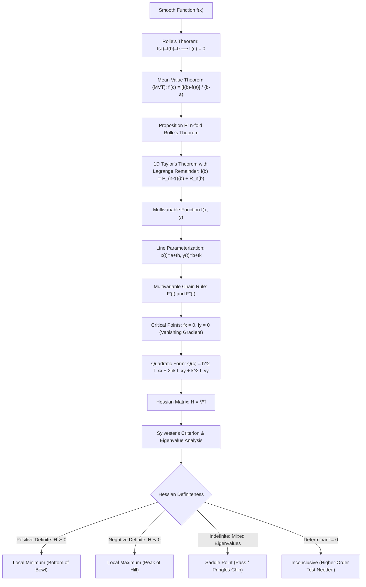
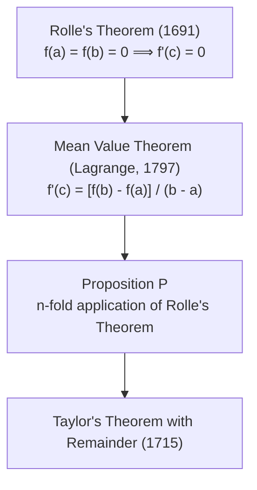
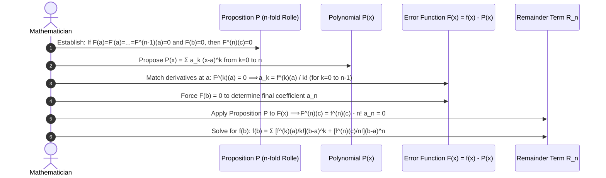
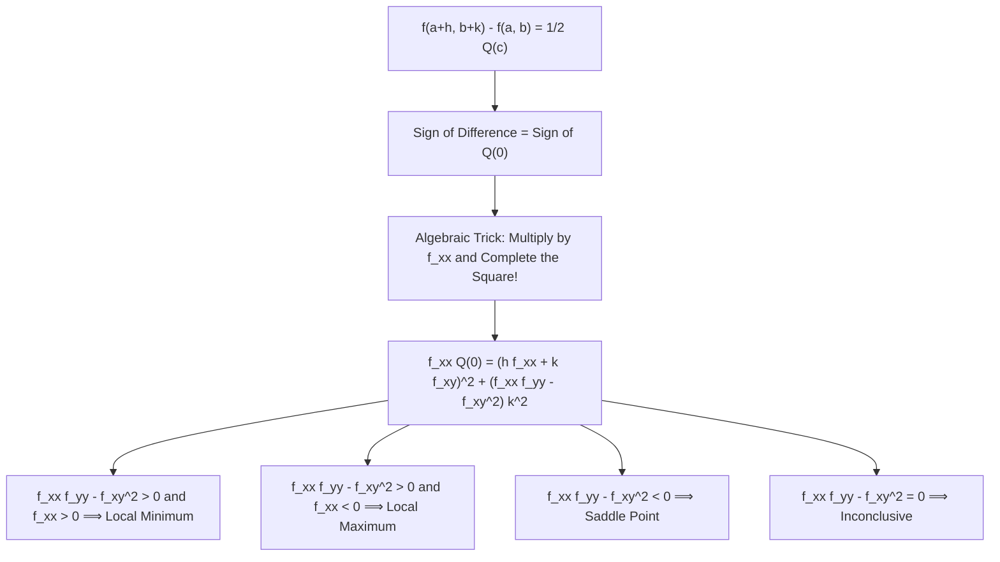
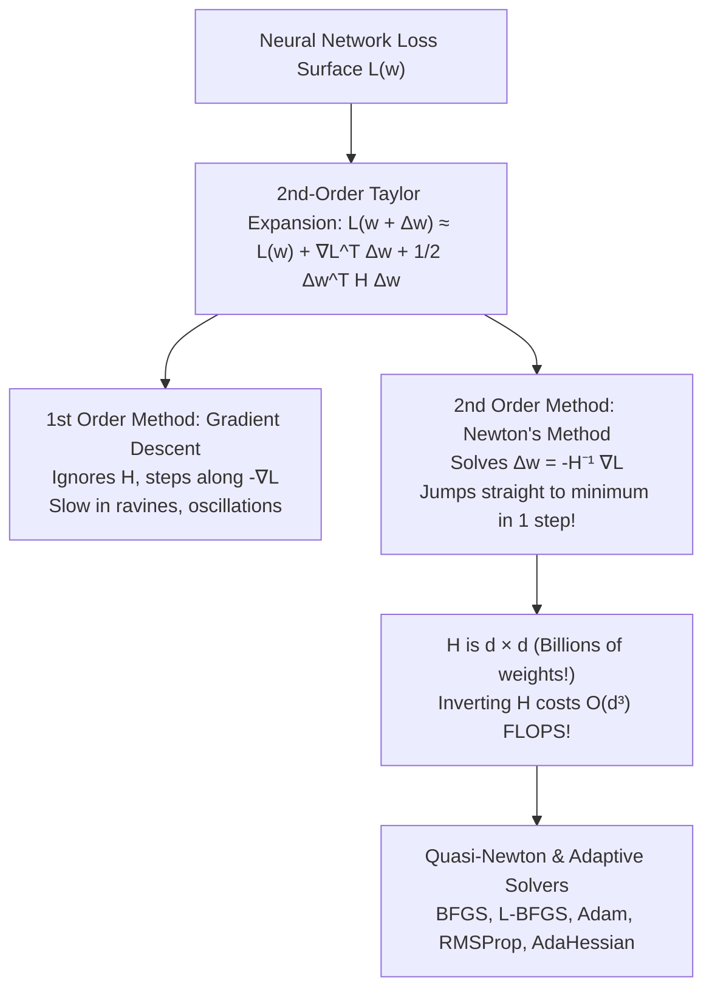

# Comprehensive Master Study Guide: Taylor Series, Remainder Theorems, and the Hessian Matrix
**Course:** Mathematical Foundations for Machine Learning & Data Science (ZC416) — Lecture 8  
**Target Audience:** Complete Beginners in Mathematics (Zero Knowledge Assumed $\to$ Path to Mastery)  
**Primary Reference:** Lecture 8 Presentation Slides (*BITS Pilani WILPD - CSIS / MFML & MFDS Team*)

---

## Welcome & Pedagogical Roadmap

Welcome to **Lecture 8**! In our journey through mathematical foundations, you have already built strong intuition:
* In **Linear Algebra (Lectures 1–4)**, you mastered vectors, linear transformations, matrices, determinants, eigenvalues, and positive-definite matrices.
* In **Multivariate Calculus (Lectures 5–7)**, you discovered functions of several variables, partial derivatives, directional derivatives, and gradient vectors.

Now, in **Lecture 8**, these two vast streams of mathematics converge into one of the most powerful engines of modern science and Artificial Intelligence: **Taylor Series Approximations, the Mean Value Theorem, and the Hessian Matrix**.

### The Big Question: Why Do We Need Taylor Series?
Imagine you are building a computer program or training an AI model. In mathematics, we frequently encounter complex, nonlinear equations:
$$f(x) = e^{-x^2} \sin(x) + \ln(1 + x^2)$$
Computers do not intrinsically understand transcendental functions like $\sin(x)$, $\cos(x)$, or $e^x$. At the silicon hardware level, a computer chip can only perform **addition, subtraction, and multiplication**.

How can a computer compute $\sin(0.1)$ or $e^{0.5}$ to 10 decimal places in a nanosecond?
**Answer:** It replaces the complicated, curving function with a **polynomial**! Polynomials like:
$$P(x) = a_0 + a_1 x + a_2 x^2 + a_3 x^3 + \dots$$
are constructed purely from addition and multiplication. 

**Taylor's Theorem is the mathematical bridge that allows us to replace virtually any smooth, complicated function with a simple polynomial, while knowing with mathematical certainty the exact upper bound on the approximation error.**

### The Bridge to Modern AI and Machine Learning
In Machine Learning and Deep Learning, Taylor Series and the Hessian matrix are everywhere:
1. **The Loss Surface of Neural Networks:** When training a neural network with billions of parameters, the loss function $L(\mathbf{w})$ is an intricate, high-dimensional mountain range. How does an optimizer navigate this terrain? It approximates the landscape locally using a **second-order Taylor series**!
2. **Gradient Descent vs. Newton's Method:** First-order optimization (Gradient Descent) uses a linear Taylor approximation (degree 1). Second-order optimization (Newton's Method) uses a quadratic Taylor approximation (degree 2), which requires computing and inverting the **Hessian matrix**.
3. **Escaping Saddle Points:** In deep learning, saddle points (where the gradient is zero, but some directions curve up while others curve down) are vastly more common than local minima. Determining whether a critical point is a minimum, maximum, or saddle point is decided entirely by the **eigenvalues and Sylvester's criterion of the Hessian matrix**.

---

### Visual Learning Flowchart



---

### Mathematical Symbol Glossary

To ensure there are zero knowledge gaps, here is every symbol used in this study guide:

| Symbol | Formal Name | Plain-English Meaning & Intuitive Analogy |
| :---: | :--- | :--- |
| $f(x)$ | Single-variable function | A mathematical machine that takes an input number $x$ and outputs a value $y = f(x)$. |
| $f(x, y)$ | Two-variable function | A function that takes a point $(x, y)$ on a 2D floor and outputs a height $z = f(x, y)$ (a surface). |
| $f'(x)$ or $\frac{df}{dx}$ | First derivative | The instantaneous rate of change or slope of the tangent line to $f(x)$. |
| $f''(x)$ or $\frac{d^2f}{dx^2}$ | Second derivative | The rate of change of the slope; measures curvature (concave up or concave down). |
| $f^{(k)}(x)$ | $k$-th derivative | Differentiating the function $k$ times consecutively. |
| $k!$ | $k$ factorial | The product of all positive integers up to $k$: $k! = k \times (k-1) \times \dots \times 2 \times 1$. ($0! = 1$). |
| $\sum_{k=0}^{n-1}$ | Summation notation | Add up all terms starting from index $k = 0$ up to $k = n-1$. |
| $[a, b]$ | Closed interval | All numbers $x$ such that $a \le x \le b$ (the endpoints $a$ and $b$ **are included**). |
| $(a, b)$ | Open interval | All numbers $x$ such that $a < x < b$ (the endpoints $a$ and $b$ **are excluded**). |
| $\in$ | Element of | Belongs to / is inside. For example, $c \in (a, b)$ means "$c$ is a number strictly between $a$ and $b$". |
| $\exists$ | Existential quantifier | "There exists at least one..." |
| $f_x, f_y$ | First partial derivatives | $\frac{\partial f}{\partial x}$ and $\frac{\partial f}{\partial y}$: slope along the $x$-direction and $y$-direction respectively. |
| $f_{xx}, f_{yy}$ | Second pure partials | $\frac{\partial^2 f}{\partial x^2}$ and $\frac{\partial^2 f}{\partial y^2}$: curvature along the $x$-axis and $y$-axis. |
| $f_{xy}, f_{yx}$ | Mixed partial derivatives | $\frac{\partial^2 f}{\partial y \partial x}$ and $\frac{\partial^2 f}{\partial x \partial y}$: cross-curvature (twisting of the surface). |
| $\nabla f$ | Gradient vector | The vector $\begin{bmatrix} f_x \\ f_y \end{bmatrix}$ pointing in the direction of steepest ascent on a surface. |
| $\nabla^2 f$ or $H$ | Hessian matrix | The $2 \times 2$ (or $n \times n$) symmetric matrix containing all second-order partial derivatives. |
| $h, k$ | Increments / Perturbations | Small step sizes in the $x$ and $y$ directions: $x = a + h$, $y = b + k$. |
| $Q(c)$ | Quadratic form | A homogeneous polynomial where every term is of degree 2: $A h^2 + 2B hk + C k^2$. |
| $\det(H)$ | Determinant of the Hessian | The quantity $f_{xx} f_{yy} - f_{xy}^2$; measures the combined curvature product minus cross-twist. |
| $\lambda_1, \lambda_2$ | Eigenvalues of the Hessian | The principal curvatures of the surface along orthogonal directions. |

---

## Part I: The Philosophy and Mechanics of Approximation

### 1.1 Why Polynomials? The Simplest Mathematical Building Blocks
Imagine you want to sculpt a statue. You start with a block of clay and gradually shape it to match your subject:
* **Degree 0 (A Flat Line):** $P_0(x) = f(a)$.  
  You anchor your approximation so it touches the curve at point $a$. If $x$ is very close to $a$, this is a rough guess, but it ignores any slope.
* **Degree 1 (A Tangent Line):** $P_1(x) = f(a) + f'(a)(x - a)$.  
  You now match the slope. This is the **linear approximation**. If you zoom in close enough to any smooth curve on a graphing calculator, it looks like a straight line!
* **Degree 2 (A Parabola):** $P_2(x) = f(a) + f'(a)(x - a) + \frac{f''(a)}{2}(x - a)^2$.  
  You now match the **curvature** (how fast the slope is turning). If the curve bends upward like a smile, the parabola curves upward too.
* **Degree $n$ (A Degree-$n$ Polynomial):**  
  You match all derivatives up to the $n$-th derivative at point $a$!

```
Curve f(x):                ~ ~ ~ (Wavy, complex real curve)
Degree 0 Approximation:    ------------------- (Matches height at x = a)
Degree 1 Approximation:    / (Matches height AND slope at x = a)
Degree 2 Approximation:    \_/ (Matches height, slope, AND curvature at x = a)
Degree n Approximation:    Almost completely hugs the real curve over a wide region!
```

---

### 1.2 The "Mystery" of the Factorial: Why Does $k!$ Appear?
Beginners often ask: *Why is there a factorial $k! = 1 \times 2 \times 3 \times \dots \times k$ in the denominator of Taylor's formula?*

Let us solve this mystery once and for all using pure high-school algebra!

Suppose we want to construct a polynomial:
$$P(x) = a_0 + a_1(x - a) + a_2(x - a)^2 + a_3(x - a)^3 + \dots + a_k(x - a)^k + \dots$$
We want this polynomial to have the exact same derivatives as our target function $f(x)$ at the point $x = a$:
$$P(a) = f(a), \quad P'(a) = f'(a), \quad P''(a) = f''(a), \quad \dots, \quad P^{(k)}(a) = f^{(k)}(a)$$

Let us differentiate $P(x)$ step by step and plug in $x = a$:

#### Step 1: Zero-th Derivative (Value at $x = a$)
$$P(x) = a_0 + a_1(x - a) + a_2(x - a)^2 + a_3(x - a)^3 + \dots$$
Plugging in $x = a$, every term with $(x - a)$ becomes $(a - a) = 0$:
$$P(a) = a_0 + 0 + 0 + \dots = a_0$$
We want $P(a) = f(a)$, so:
$$a_0 = \frac{f(a)}{0!} = f(a) \quad (\text{since } 0! = 1)$$

#### Step 2: First Derivative
Differentiating $P(x)$ using the power rule $\frac{d}{dx}(x - a)^m = m(x - a)^{m-1}$:
$$P'(x) = 0 + a_1 \cdot 1 + a_2 \cdot 2(x - a) + a_3 \cdot 3(x - a)^2 + \dots$$
Plugging in $x = a$:
$$P'(a) = a_1 + 0 + 0 + \dots = a_1$$
We want $P'(a) = f'(a)$, so:
$$a_1 = \frac{f'(a)}{1!} = f'(a) \quad (\text{since } 1! = 1)$$

#### Step 3: Second Derivative
Differentiating again:
$$P''(x) = 0 + 0 + a_2 \cdot (2 \cdot 1) + a_3 \cdot (3 \cdot 2)(x - a) + \dots$$
Plugging in $x = a$:
$$P''(a) = 2 \cdot 1 \cdot a_2 = 2! \cdot a_2$$
We want $P''(a) = f''(a)$, so dividing both sides by $2!$:
$$a_2 = \frac{f''(a)}{2!} = \frac{f''(a)}{2}$$

#### Step 4: Third Derivative
Differentiating a third time:
$$P'''(x) = a_3 \cdot (3 \cdot 2 \cdot 1) + a_4 \cdot (4 \cdot 3 \cdot 2)(x - a) + \dots$$
Plugging in $x = a$:
$$P'''(a) = 3 \cdot 2 \cdot 1 \cdot a_3 = 3! \cdot a_3$$
Solving for $a_3$:
$$a_3 = \frac{f'''(a)}{3!} = \frac{f'''(a)}{6}$$

#### The General Rule for Any Degree $k$:
Every time you take a derivative of $(x - a)^k$, the power rule brings down the exponent:
$$\frac{d}{dx}(x - a)^k = k(x - a)^{k-1}$$
$$\frac{d^2}{dx^2}(x - a)^k = k(k-1)(x - a)^{k-2}$$
$$\dots$$
$$\frac{d^k}{dx^k}(x - a)^k = k(k-1)(k-2)\dots(2)(1) = k!$$
When evaluated at $x = a$, all higher terms vanish, leaving:
$$P^{(k)}(a) = k! \cdot a_k$$
To make $P^{(k)}(a) = f^{(k)}(a)$, we **must** set:
$$\mathbf{a_k = \frac{f^{(k)}(a)}{k!}}$$
This is why factorials appear in every Taylor series! They are the mathematical residue of repeated power-rule differentiation.

---

## Part II: The Foundation Stones — Rolle's Theorem and the Mean Value Theorem

Before proving the full Taylor's theorem, Lecture 8 builds directly on two classical theorems of calculus: **Rolle's Theorem** and the **Mean Value Theorem (MVT)**.



---

### 2.1 Rolle's Theorem (Slide 7)

#### Formal Mathematical Statement:
Let $f$ be a function that satisfies three conditions:
1. $f$ is **continuous** on the closed interval $[a, b]$.
2. $f$ is **differentiable** on the open interval $(a, b)$.
3. $f(a) = f(b) = 0$ (the function starts and ends at zero).

Then, **there exists at least one point $c \in (a, b)$ such that:**
$$f'(c) = 0$$

```
   y ^
     |           Peak: f'(c) = 0 (Horizontal Tangent!)
     |          .--.
     |         /    \
     |        /      \
     |       /        \
  ---+------*----------*--------> x
     |      a    c     b
     |     f(a)=0     f(b)=0
```

#### Beginner Intuition & Real-World Analogy:
* **The Rollercoaster Analogy:** If you take a rollercoaster ride that starts at ground level ($f(a) = 0$) and finishes at ground level ($f(b) = 0$), and the track is completely smooth (no sudden sharp breaks or teleports), then at some moment during the ride, you must have reached a highest peak or lowest dip where your vertical velocity was **momentarily zero** ($f'(c) = 0$, a perfectly flat tangent line).
* **Why $(a, b)$ is open for differentiability:** The function only needs to be smooth *between* $a$ and $b$. At the very edge boundary points $a$ and $b$, you can only approach from one side, so two-sided derivatives are not required at the endpoints.

---

### 2.2 The Mean Value Theorem (Slides 5 & 6)

#### Formal Mathematical Statement:
If a function $f$ is continuous on the closed interval $[a, b]$ and differentiable on the open interval $(a, b)$, then **there exists at least one number $c \in (a, b)$ such that:**
$$f'(c) = \frac{f(b) - f(a)}{b - a}$$

```
   y ^
     |                             * (b, f(b))
     |                           /
     |                 * (c, f(c)) [Tangent line slope = Secant line slope!]
     |               /   /
     |             /   /
     |   (a, f(a)) * /
     |           |
  ---+-----------+-----+-----------+-------> x
     0           a     c           b
```

#### Geometric Meaning:
* **Secant Line:** Connect the start point $(a, f(a))$ and end point $(b, f(b))$ with a straight chord. The slope of this secant line is:
  $$\text{Slope}_{\text{secant}} = \frac{\Delta y}{\Delta x} = \frac{f(b) - f(a)}{b - a}$$
* **Tangent Line:** The slope of the curve at any point $c$ is the instantaneous derivative $f'(c)$.
* **The Theorem asserts:** Somewhere between $a$ and $b$, the curve's instantaneous slope is **strictly parallel** to the average slope!

#### Real-World Analogy: The Highway Speed Camera
Suppose you enter a toll highway at 10:00 AM at mile marker $0$ ($a = 0, f(a) = 0$). You exit the highway at 12:00 PM (2 hours later) at mile marker $140$ ($b = 2, f(b) = 140$).
Your average speed over the trip was:
$$\text{Average Speed} = \frac{140 - 0}{2 - 0} = 70 \text{ miles per hour}$$
Even if you claim you never sped, the **Mean Value Theorem guarantees** that at some exact instant $c$ between 10:00 AM and 12:00 PM, your car's speedometer was pointing at **precisely 70 mph** ($f'(c) = 70$).

---

### 2.3 Why Differentiability is Mandatory: Dissecting Slide 6's Counterexample

Slide 6 highlights a critical warning:
> *"Note that the requirement that $f$ be a differentiable function in the mean-value theorem is needed as the theorem is not valid for functions $f$ that are not differentiable."*

Slide 6 shows a hand-drawn diagram of a function with a **sharp triangle peak** (a cusp/corner):

```
   y ^
     |               /\ (Sharp corner at peak: NOT differentiable!)
     |              /  \
     |             /    \
     |            /      \
     |           /        \
  ---+----------*----------*--------> x
     0          a          b
```

Let us construct a concrete mathematical formula for this picture and see mathematically why the theorem fails!

#### The Absolute Value Counterexample:
Consider the function $f(x) = 1 - |x|$ on the interval $[-1, 1]$:
* $a = -1$, so $f(-1) = 1 - |-1| = 1 - 1 = 0$.
* $b = 1$, so $f(1) = 1 - |1| = 1 - 1 = 0$.
* Average slope (secant):
  $$\frac{f(b) - f(a)}{b - a} = \frac{0 - 0}{1 - (-1)} = \frac{0}{2} = 0$$

Does there exist any point $c \in (-1, 1)$ where $f'(c) = 0$?
Let us compute the derivative:
* For $x < 0$, $|x| = -x \implies f(x) = 1 - (-x) = 1 + x \implies f'(x) = +1$.
* For $x > 0$, $|x| = x \implies f(x) = 1 - x \implies f'(x) = -1$.
* At $x = 0$, the left-hand limit of the derivative is $+1$, but the right-hand limit is $-1$. Because the one-sided derivatives do not match, **$f'(0)$ does not exist**!

**Conclusion:** The derivative is $+1$ everywhere to the left, and $-1$ everywhere to the right. It is **never equal to $0$ anywhere**! Rolle's theorem and the Mean Value Theorem fail completely because the function possesses a sharp corner where differentiability breaks down.

---

### 2.4 Deriving the Mean Value Theorem from Rolle's Theorem (Step-by-Step)

How did mathematicians prove the Mean Value Theorem? They cleverly transformed the tilted secant line back into a flat line that touches zero, allowing them to apply Rolle's theorem!

#### Step 1: Write the Equation of the Secant Line
The straight line passing through $(a, f(a))$ with slope $m = \frac{f(b)-f(a)}{b-a}$ has equation:
$$L(x) = f(a) + \frac{f(b) - f(a)}{b - a}(x - a)$$

#### Step 2: Define the "Vertical Gap" Function $g(x)$
Let $g(x)$ be the vertical distance between the actual function $f(x)$ and the straight line $L(x)$:
$$g(x) = f(x) - L(x) = f(x) - f(a) - \frac{f(b) - f(a)}{b - a}(x - a)$$

#### Step 3: Test $g(x)$ at the Endpoints
* At $x = a$:
  $$g(a) = f(a) - f(a) - \frac{f(b) - f(a)}{b - a}(a - a) = 0 - 0 = 0$$
* At $x = b$:
  $$g(b) = f(b) - f(a) - \frac{f(b) - f(a)}{b - a}(b - a) = f(b) - f(a) - [f(b) - f(a)] = 0$$

#### Step 4: Apply Rolle's Theorem
Since $f$ is continuous on $[a, b]$ and differentiable on $(a, b)$, and $L(x)$ is a simple polynomial (infinitely smooth), $g(x)$ is also continuous on $[a, b]$ and differentiable on $(a, b)$.
Because $g(a) = g(b) = 0$, **Rolle's Theorem guarantees that there is some point $c \in (a, b)$ where $g'(c) = 0$!**

#### Step 5: Differentiate $g(x)$ and Solve
$$g'(x) = \frac{d}{dx}\left[ f(x) - f(a) - \frac{f(b) - f(a)}{b - a}(x - a) \right]$$
Notice:
* $\frac{d}{dx}[f(x)] = f'(x)$
* $\frac{d}{dx}[f(a)] = 0$ (since $f(a)$ is a constant number!)
* $\frac{d}{dx}\left[\frac{f(b)-f(a)}{b-a}(x-a)\right] = \frac{f(b)-f(a)}{b-a} \cdot 1$

Therefore:
$$g'(x) = f'(x) - \frac{f(b) - f(a)}{b - a}$$
Setting $g'(c) = 0$:
$$f'(c) - \frac{f(b) - f(a)}{b - a} = 0 \implies \mathbf{f'(c) = \frac{f(b) - f(a)}{b - a}}$$
This completes the proof! Notice that if we multiply both sides by $(b - a)$:
$$f(b) = f(a) + f'(c)(b - a)$$
**Look closely at this equation:** It says the value at $b$ equals the starting value at $a$ plus the slope at an intermediate point times the distance! This is **Taylor's theorem for $n = 1$**!

---

## Part III: The Rigorous Development of Taylor's Theorem and the Remainder Term

Now we follow the exact sequence of slides 4, 8, 9, 10, and 11 from the lecture presentation to build the general Taylor series with the exact **Lagrange form of the remainder**.



---

### 3.1 Proposition P: The $n$-Fold Application of Rolle's Theorem (Slides 8 & 9)

#### Statement of Proposition P:
Let $F(x)$ be a function over an interval containing $a$ and $b$ ($a < b$) such that:
1. $F(a) = 0$
2. $F'(a) = 0$
3. $F''(a) = 0$
4. $\dots$
5. $F^{(n-1)}(a) = 0$
6. $F(b) = 0$

Then **there exists at least one point $c \in (a, b)$ such that $F^{(n)}(c) = 0$.**

#### Step-by-Step Proof by Induction ($n$-Fold Rolle's):
Let us trace the domino effect of Rolle's Theorem:

* **Domino 1:** Look at $F(x)$ on the interval $[a, b]$.  
  We know $F(a) = 0$ and $F(b) = 0$. By Rolle's theorem, there must be a point $c_1 \in (a, b)$ where:
  $$F'(c_1) = 0$$
* **Domino 2:** Now focus on the derivative $F'(x)$ on the smaller interval $[a, c_1]$.  
  We know $F'(a) = 0$ (by assumption) and $F'(c_1) = 0$ (from Domino 1).  
  Applying Rolle's theorem to $F'(x)$ on $[a, c_1]$, there must exist a point $c_2 \in (a, c_1)$ where the derivative of $F'$, which is $F''$, is zero:
  $$F''(c_2) = 0$$
* **Domino 3:** Now focus on $F''(x)$ on the even smaller interval $[a, c_2]$.  
  We know $F''(a) = 0$ and $F''(c_2) = 0$.  
  Applying Rolle's theorem to $F''(x)$, there must exist a point $c_3 \in (a, c_2)$ where:
  $$F'''(c_3) = 0$$
* **Domino $n$:** We repeat this exact logic $n$ times! At each stage, the new zero of the derivative is squeezed strictly to the left of the previous one:
  $$a < c_n < c_{n-1} < \dots < c_2 < c_1 < b$$
At the $n$-th step, on the interval $[a, c_{n-1}]$, we have $F^{(n-1)}(a) = 0$ and $F^{(n-1)}(c_{n-1}) = 0$.  
Therefore, by Rolle's theorem:
$$\mathbf{F^{(n)}(c_n) = 0}$$
Setting $c = c_n$, we have proven that there exists a point $c \in (a, b)$ where $F^{(n)}(c) = 0$. **Proposition P is proved.**

---

### 3.2 Constructing the Approximating Polynomial (Slide 9)

We want to approximate our function $f(x)$ near $x = a$ using a polynomial $P(x)$ of degree $n$:
$$P(x) = \sum_{k=0}^n a_k (x - a)^k = a_0 + a_1(x - a) + a_2(x - a)^2 + \dots + a_n(x - a)^n$$

Now define the **error function** $F(x)$, which represents the difference between the true function and our polynomial:
$$F(x) = f(x) - P(x)$$

We want to engineer this polynomial so that $F(x)$ satisfies all the hypotheses of Proposition P! That means we need:
$$F(a) = 0, \quad F'(a) = 0, \quad F''(a) = 0, \quad \dots, \quad F^{(n-1)}(a) = 0, \quad \text{and} \quad F(b) = 0$$

Let us determine what the coefficients $a_0, a_1, \dots, a_{n-1}$ must be.
Recall from Section 1.2:
$$P^{(k)}(a) = k! \cdot a_k$$
Therefore, differentiating $F(x) = f(x) - P(x)$ $k$ times and evaluating at $x = a$:
$$F^{(k)}(a) = f^{(k)}(a) - P^{(k)}(a) = f^{(k)}(a) - k! \cdot a_k$$
To make $F^{(k)}(a) = 0$, we simply set:
$$f^{(k)}(a) - k! \cdot a_k = 0 \implies \mathbf{a_k = \frac{f^{(k)}(a)}{k!}} \quad \text{for } k = 0, 1, 2, \dots, n-1$$

This fixes the first $n$ coefficients ($a_0$ through $a_{n-1}$) to be the standard Taylor coefficients!

---

### 3.3 Solving for the Final Coefficient $a_n$ (Slide 10)

Only one coefficient remains unknown: **$a_n$** (the coefficient of $(x - a)^n$).
To find $a_n$, we use the final condition of Proposition P: **$F(b) = 0$**.

Let us substitute $x = b$ into $F(x)$:
$$F(b) = f(b) - P(b) = 0$$
Write out $P(b)$ by splitting the summation into the first $n-1$ terms and the final $n$-th term:
$$P(b) = \sum_{k=0}^n a_k (b - a)^k = \sum_{k=0}^{n-1} a_k (b - a)^k + a_n(b - a)^n$$
Substitute the known values $a_k = \frac{f^{(k)}(a)}{k!}$ into the sum:
$$F(b) = f(b) - \sum_{k=0}^{n-1} \frac{f^{(k)}(a)}{k!} (b - a)^k - a_n(b - a)^n = 0$$

Now, let us isolate and solve for $a_n$ step by step:
1. Add $a_n(b - a)^n$ to both sides:
   $$a_n(b - a)^n = f(b) - \sum_{k=0}^{n-1} \frac{f^{(k)}(a)}{k!} (b - a)^k$$
2. Divide both sides by $(b - a)^n$:
   $$\mathbf{a_n = \frac{1}{(b - a)^n} \left[ f(b) - \sum_{k=0}^{n-1} \frac{f^{(k)}(a)}{k!} (b - a)^k \right]}$$

This matches equation on Slide 10 exactly!

---

### 3.4 Deriving the Final Taylor's Formula with Lagrange Remainder (Slide 11)

With this value of $a_n$, our function $F(x)$ satisfies every single requirement of **Proposition P**:
* $F(a) = F'(a) = F''(a) = \dots = F^{(n-1)}(a) = 0$
* $F(b) = 0$

Therefore, by Proposition P, **there exists some number $c \in (a, b)$ such that:**
$$F^{(n)}(c) = 0$$

Let us evaluate $F^{(n)}(c)$:
$$F(x) = f(x) - P(x)$$
Differentiating $n$ times:
$$F^{(n)}(x) = f^{(n)}(x) - P^{(n)}(x)$$

What is $P^{(n)}(x)$?  
$P(x)$ is a polynomial of degree $n$:
$$P(x) = a_0 + a_1(x-a) + \dots + a_{n-1}(x-a)^{n-1} + a_n(x-a)^n$$
When we differentiate a polynomial of degree $n$ exactly $n$ times:
* All lower powers $(x - a)^0, (x - a)^1, \dots, (x - a)^{n-1}$ become zero.
* The term $a_n(x - a)^n$ differentiates to $a_n \cdot n!$.
Therefore, for any value of $x$:
$$P^{(n)}(x) = n! \cdot a_n$$

Plugging $x = c$ into $F^{(n)}(x) = 0$:
$$F^{(n)}(c) = f^{(n)}(c) - n! \cdot a_n = 0$$
$$f^{(n)}(c) = n! \cdot a_n$$

Now, substitute our formula for $a_n$ from Section 3.3 into this equation:
$$f^{(n)}(c) - n! \left( \frac{1}{(b - a)^n} \left[ f(b) - \sum_{k=0}^{n-1} \frac{f^{(k)}(a)}{k!} (b - a)^k \right] \right) = 0$$

Let us rearrange this to isolate $f(b)$:
1. Multiply both sides by $\frac{(b - a)^n}{n!}$:
   $$\frac{f^{(n)}(c)}{n!} (b - a)^n - \left[ f(b) - \sum_{k=0}^{n-1} \frac{f^{(k)}(a)}{k!} (b - a)^k \right] = 0$$
2. Move $f(b)$ to the other side:
   $$\mathbf{f(b) = \sum_{k=0}^{n-1} \frac{f^{(k)}(a)}{k!} (b - a)^k + \frac{f^{(n)}(c)}{n!} (b - a)^n}$$

This is the celebrated **Taylor's Theorem with the Lagrange Form of the Remainder** (Slide 4 and Slide 11)!

---

### 3.5 Anatomy of the Taylor Formula

Let us inspect the formula to understand what each part means:
$$\underbrace{f(b)}_{\text{Exact Value}} = \underbrace{\sum_{k=0}^{n-1} \frac{f^{(k)}(a)}{k!} (b - a)^k}_{\text{Polynomial Approximation } P_{n-1}(b)} + \underbrace{\frac{f^{(n)}(c)}{n!} (b - a)^n}_{\text{Remainder Term } R_n(b)}$$

* **The Truncated Polynomial $P_{n-1}(b)$:** This is what we calculate using known information strictly at the base point $a$.
* **The Remainder Term $R_n(b) = \frac{f^{(n)}(c)}{n!} (b - a)^n$:** This represents the **exact error** between our polynomial approximation and the true value $f(b)$.
* **Where is $c$?** We do not know the exact numerical value of $c$, but we know with 100% certainty that **$c$ is strictly between $a$ and $b$** ($a < c < b$).
* **How is this useful in practice?** If we can find the maximum possible value that $|f^{(n)}(t)|$ could take for any $t \in [a, b]$, say $M = \max |f^{(n)}(t)|$, then the error is bounded by:
  $$\text{Error} = |R_n(b)| \le \frac{M}{n!} |b - a|^n$$
  Because $n!$ grows faster than any exponential power, as we add more terms ($n \to \infty$), the error shrinks to zero!

#### The Special Case: MacLaurin Series
When the center point is chosen to be zero ($a = 0$), the expansion is called a **MacLaurin Series**:
$$f(x) = \sum_{k=0}^{n-1} \frac{f^{(k)}(0)}{k!} x^k + \frac{f^{(n)}(c)}{n!} x^n \quad \text{for some } c \text{ between } 0 \text{ and } x$$

---

## Part IV: Multivariate Taylor Series in Two Variables

In real-world data science, machine learning, and neural networks, functions almost never depend on just one variable $x$. A neural network's loss depends on millions of weights $\mathbf{w} = (w_1, w_2, \dots, w_d)$.

Slides 12 through 14 show how to generalize Taylor's theorem to a function of two variables $f(x, y)$.

```mermaid
graph LR
    P["Base Point P(a, b)"] -->|Step (h, k)| S["Nearby Point S(a+h, b+k)"]
    subgraph 2D Space
        P
        S
        PS["Line Segment PS: x(t) = a + th, y(t) = b + tk"]
    end
    PS --> SingleVar["Auxiliary 1D Function: F(t) = f(x(t), y(t))"]
    SingleVar --> ChainRule["Apply Single-Variable Taylor & Chain Rule!"]
```

---

### 4.1 The Ingenious Dimensionality Reduction Trick (Slide 12)

Suppose we have a function $f(x, y)$ that defines a 2D surface (height $z = f(x, y)$).  
We want to understand how the function changes when we take a small step from a base point $P(a, b)$ to a nearby point $S(a + h, b + k)$.
* Increment in $x$: $h$
* Increment in $y$: $k$

How can we apply our 1D single-variable Taylor's theorem to this 2D surface?
**The Trick:** We walk along the straight line connecting $P(a, b)$ and $S(a+h, b+k)$!

#### Parameterizing the Line Segment $PS$:
Let $t$ be a parameter that runs from $0$ to $1$:
* At $t = 0$, we are at the start point $P(a, b)$.
* At $t = 1$, we are at the destination point $S(a + h, b + k)$.

The parametric equations of this line are:
$$x(t) = a + t h$$
$$y(t) = b + t k$$
$$\text{for } t \in [0, 1]$$

Now define an auxiliary function of the single variable $t$:
$$\mathbf{F(t) = f(x(t), y(t)) = f(a + t h, b + t k)}$$
Notice that:
* $F(0) = f(a + 0, b + 0) = f(a, b)$
* $F(1) = f(a + h, b + k)$

We have turned a 2D multivariable problem into a 1D single-variable problem in $t$!

---

### 4.2 Calculating the First Derivative $F'(t)$ via the Chain Rule (Slide 12)

By the multivariable chain rule, since $x$ and $y$ both depend on $t$:
$$\frac{dF}{dt} = \frac{\partial f}{\partial x} \frac{dx}{dt} + \frac{\partial f}{\partial y} \frac{dy}{dt}$$

Let us compute the components:
* $\frac{dx}{dt} = \frac{d}{dt}(a + th) = h$
* $\frac{dy}{dt} = \frac{d}{dt}(b + tk) = k$
* $\frac{\partial f}{\partial x} = f_x$
* $\frac{\partial f}{\partial y} = f_y$

Substituting these into the chain rule gives:
$$\mathbf{F'(t) = h f_x + k f_y}$$

---

### 4.3 Calculating the Second Derivative $F''(t)$ (Slide 13)

Now we differentiate $F'(t)$ a second time with respect to $t$:
$$F''(t) = \frac{d}{dt}\left[ F'(t) \right] = \frac{d}{dt}\left[ h f_x + k f_y \right]$$

Applying the multivariable chain rule to the expression $F' = h f_x + k f_y$:
$$F''(t) = \frac{\partial F'}{\partial x} \frac{dx}{dt} + \frac{\partial F'}{\partial y} \frac{dy}{dt}$$

Substitute $\frac{dx}{dt} = h$ and $\frac{dy}{dt} = k$:
$$F''(t) = \frac{\partial(h f_x + k f_y)}{\partial x} h + \frac{\partial(h f_x + k f_y)}{\partial y} k$$

Let us expand each partial derivative carefully:
1. First bracket: Differentiate with respect to $x$:
   $$\frac{\partial}{\partial x}(h f_x + k f_y) = h \frac{\partial f_x}{\partial x} + k \frac{\partial f_y}{\partial x} = h f_{xx} + k f_{yx}$$
2. Second bracket: Differentiate with respect to $y$:
   $$\frac{\partial}{\partial y}(h f_x + k f_y) = h \frac{\partial f_x}{\partial y} + k \frac{\partial f_y}{\partial y} = h f_{xy} + k f_{yy}$$

Now plug these back into the formula for $F''(t)$:
$$F''(t) = [h f_{xx} + k f_{yx}] h + [h f_{xy} + k f_{yy}] k$$
Distribute $h$ and $k$:
$$F''(t) = h^2 f_{xx} + h k f_{yx} + h k f_{xy} + k^2 f_{yy}$$

#### Clairaut's / Schwarz's Theorem on Mixed Partials:
For any function with continuous second partial derivatives, the order of differentiation does not matter:
$$f_{xy} = f_{yx} \quad \left( \frac{\partial^2 f}{\partial y \partial x} = \frac{\partial^2 f}{\partial x \partial y} \right)$$
Therefore, the two middle cross-terms combine:
$$h k f_{yx} + h k f_{xy} = 2 h k f_{xy}$$
We obtain:
$$\mathbf{F''(t) = h^2 f_{xx} + 2hk f_{xy} + k^2 f_{yy}}$$

---

### 4.4 Applying 1D Taylor's Theorem to $F(t)$ (Slide 13)

Now apply the single-variable Taylor's theorem to $F(t)$ on the interval $[0, 1]$ around $t = 0$:
$$F(1) = F(0) + F'(0)(1 - 0) + \frac{1}{2!} F''(c)(1 - 0)^2 \quad \text{for some } c \in (0, 1)$$
Simplifying:
$$F(1) = F(0) + F'(0) + \frac{1}{2} F''(c)$$

Now translate every term back into our original 2D functions:
* $F(1) = f(a + h, b + k)$
* $F(0) = f(a, b)$
* $F'(0) = h f_x(a, b) + k f_y(a, b)$
* $F''(c) = \left[ h^2 f_{xx} + 2hk f_{xy} + k^2 f_{yy} \right]_{(a + ch, b + ck)}$

Putting it all together:
$$\mathbf{f(a + h, b + k) = f(a, b) + h f_x(a, b) + k f_y(a, b) + \frac{1}{2} \left[ h^2 f_{xx} + 2hk f_{xy} + k^2 f_{yy} \right]_{(a + ch, b + ck)}}$$

This is the full **Second-Order Taylor Formula for Functions of Two Variables**!

---

### 4.5 Behavior at Critical Points (Slide 14)

In optimization and machine learning, we are especially interested in **critical points** (candidates for minima and maxima).
* **Definition of Critical Point:** A point $(a, b)$ where the gradient vector vanishes:
  $$\nabla f(a, b) = \begin{bmatrix} f_x(a, b) \\ f_y(a, b) \end{bmatrix} = \begin{bmatrix} 0 \\ 0 \end{bmatrix}$$
  That is, $f_x(a, b) = 0$ and $f_y(a, b) = 0$.

When we evaluate the Taylor expansion at a critical point, the entire first-order linear term vanishes:
$$h f_x(a, b) + k f_y(a, b) = h(0) + k(0) = 0$$

Subtracting $f(a, b)$ from both sides, our equation simplifies dramatically to:
$$\mathbf{f(a + h, b + k) - f(a, b) = \frac{1}{2} Q(c)}$$
where:
$$\mathbf{Q(c) = \left[ h^2 f_{xx} + 2hk f_{xy} + k^2 f_{yy} \right]_{(a + ch, b + ck)}}$$

---

## Part V: The Quadratic Form, Discriminant, and Hessian Matrix

Now we arrive at the core theoretical breakthrough of Lecture 8 (Slides 14–19): **How do we classify critical points in multiple dimensions?**



---

### 5.1 Why the Sign of $Q(c)$ Tells Us Everything

Look at the difference:
$$\Delta f = f(a + h, b + k) - f(a, b) = \frac{1}{2} Q(c)$$
* If $\Delta f > 0$ for all small steps $(h, k)$: Moving in *any* direction away from $(a, b)$ causes the function value to **increase**. That means $(a, b)$ is the lowest point in its neighborhood — a **Local Minimum**!
* If $\Delta f < 0$ for all small steps $(h, k)$: Moving in *any* direction causes the function value to **decrease**. That means $(a, b)$ is the highest point in its neighborhood — a **Local Maximum**!
* If $\Delta f > 0$ in some directions, but $\Delta f < 0$ in other directions: In some directions you go uphill, in other directions you go downhill. That point is a mountain pass or **Saddle Point**!

Because second derivatives are continuous, as $h \to 0$ and $k \to 0$, the intermediate evaluation point $(a + ch, b + ck)$ approaches $(a, b)$.  
Therefore, **for sufficiently small $h$ and $k$, the sign of $Q(c)$ is identical to the sign of $Q(0)$**:
$$Q(0) = h^2 f_{xx}(a, b) + 2hk f_{xy}(a, b) + k^2 f_{yy}(a, b)$$

---

### 5.2 The Algebraic Masterstroke: Completing the Square (Slide 15)

How can we determine the sign of $Q(0) = h^2 f_{xx} + 2hk f_{xy} + k^2 f_{yy}$ for arbitrary non-zero numbers $h$ and $k$?
Slide 15 presents a brilliant algebraic rearrangement: **multiply by $f_{xx}$ and complete the square!**

Let us walk through this derivation line by line without skipping a single step:

#### Step 1: Write the expression for $Q(0)$
$$Q(0) = h^2 f_{xx} + 2hk f_{xy} + k^2 f_{yy}$$

#### Step 2: Multiply both sides by $f_{xx}$
$$f_{xx} Q(0) = f_{xx} \left( h^2 f_{xx} + 2hk f_{xy} + k^2 f_{yy} \right)$$
Distribute $f_{xx}$:
$$f_{xx} Q(0) = h^2 f_{xx}^2 + 2hk f_{xx} f_{xy} + k^2 f_{xx} f_{yy}$$

#### Step 3: Rearrange to reveal a perfect square
Look at the first two terms:
$$h^2 f_{xx}^2 + 2hk f_{xx} f_{xy} = (h f_{xx})^2 + 2(h f_{xx})(k f_{xy})$$
Recall the high-school identity for a perfect square:
$$(u + v)^2 = u^2 + 2uv + v^2 \implies u^2 + 2uv = (u + v)^2 - v^2$$
Let $u = h f_{xx}$ and $v = k f_{xy}$. Then:
$$h^2 f_{xx}^2 + 2hk f_{xx} f_{xy} = (h f_{xx} + k f_{xy})^2 - (k f_{xy})^2 = (h f_{xx} + k f_{xy})^2 - k^2 f_{xy}^2$$

#### Step 4: Substitute this back into our equation
$$f_{xx} Q(0) = \left[ (h f_{xx} + k f_{xy})^2 - k^2 f_{xy}^2 \right] + k^2 f_{xx} f_{yy}$$

#### Step 5: Factor out $k^2$ from the remaining two terms
$$f_{xx} Q(0) = (h f_{xx} + k f_{xy})^2 + k^2 f_{xx} f_{yy} - k^2 f_{xy}^2$$
$$\mathbf{f_{xx} Q(0) = (h f_{xx} + k f_{xy})^2 + (f_{xx} f_{yy} - f_{xy}^2) k^2}$$

This is the exact formula on Slide 15!

---

### 5.3 Meticulous Case Analysis (Slide 16)

Look at the right-hand side of our identity:
$$\text{RHS} = \underbrace{(h f_{xx} + k f_{xy})^2}_{\ge 0 \text{ (Always a squared number!})} + \underbrace{(f_{xx} f_{yy} - f_{xy}^2)}_{\text{Discriminant } D} \underbrace{k^2}_{\ge 0}$$

Let us define the **Discriminant** (often denoted $D$):
$$\mathbf{D = f_{xx} f_{yy} - f_{xy}^2}$$

Notice that $(h f_{xx} + k f_{xy})^2 \ge 0$ and $k^2 \ge 0$ for all real numbers! Therefore, the sign of the right-hand side is dominated by the sign of $D$.

#### Case 1: $D > 0$ and $f_{xx} > 0$ $\implies$ Local Minimum (Slide 16, Bullet 2)
* Since $D = f_{xx} f_{yy} - f_{xy}^2 > 0$, both terms on the RHS are positive (and cannot both be zero unless $h = 0, k = 0$).
* Thus, $\text{RHS} > 0$.
* That means $f_{xx} Q(0) > 0$.
* Since we assumed $f_{xx} > 0$, dividing both sides by the positive number $f_{xx}$ maintains the inequality:
  $$Q(0) > 0$$
* Since $Q(0) > 0$ for all small non-zero $(h, k)$, the function curves upward in every single direction!
* **Conclusion:** $f$ has a **Local Minimum** at $(a, b)$.

#### Case 2: $D > 0$ and $f_{xx} < 0$ $\implies$ Local Maximum (Slide 16, Bullet 1)
* As in Case 1, because $D > 0$, the RHS is strictly positive: $\text{RHS} > 0$.
* Thus, $f_{xx} Q(0) > 0$.
* But now, $f_{xx} < 0$ (it is negative!).
* When you divide an inequality by a negative number, **the inequality sign flips**:
  $$Q(0) = \frac{\text{RHS}}{f_{xx}} = \frac{\text{Positive}}{\text{Negative}} < 0$$
* Since $Q(0) < 0$ for all small non-zero $(h, k)$, the function curves downward in every single direction!
* **Conclusion:** $f$ has a **Local Maximum** at $(a, b)$.

#### Case 3: $D < 0$ $\implies$ Saddle Point (Slide 16, Bullet 3)
* If $D = f_{xx} f_{yy} - f_{xy}^2 < 0$, the two terms on the RHS have **opposite signs**!
* If we choose $k = 0$ and $h \ne 0$:
  $$f_{xx} Q(0) = (h f_{xx})^2 + 0 > 0 \implies Q(0) \text{ has the same sign as } f_{xx}$$
* But if we pick $h$ and $k$ such that $h f_{xx} + k f_{xy} = 0$ (set $h = -k \frac{f_{xy}}{f_{xx}}$):
  $$f_{xx} Q(0) = 0 + D k^2 < 0 \quad (\text{since } D < 0 \text{ and } k^2 > 0)$$
  Here, $Q(0)$ has the **opposite sign**!
* Along one path, the function curves up; along another path, it curves down.
* **Conclusion:** $f$ has a **Saddle Point** at $(a, b)$!

```
               ^ z
               |        (Curves DOWN along one axis: like a horse saddle)
             .-'-.
            /  |  \
     <-----+---|---+-----> x
          / \  |  / \
         '   '-.-'   '  (Curves UP along the perpendicular axis)
              /
             v y
```

#### Case 4: $D = 0$ $\implies$ Test Inconclusive (Slide 16, Bullet 4)
* If $D = f_{xx} f_{yy} - f_{xy}^2 = 0$, our second-order term becomes degenerate (like a flat trough or gutter where one curvature is zero).
* The second derivatives cannot tell us whether the function goes up, down, or stays flat.
* **Conclusion:** Another test is needed (e.g., examining third- or fourth-order Taylor terms or direct algebraic inspection).

---

### 5.4 Formulating the Hessian Matrix (Slide 17)

All the information about these second-order derivatives can be arranged cleanly in a matrix called the **Hessian Matrix**, denoted $\nabla^2 f$ or $H$:
$$\mathbf{H = \nabla_{x,y}^2 f(x, y) = \begin{bmatrix} f_{xx} & f_{xy} \\ f_{xy} & f_{yy} \end{bmatrix}}$$

#### Why is the Hessian Symmetric? (Slide 19)
By Clairaut's theorem, $f_{xy} = f_{yx}$ for smooth functions. Therefore:
$$H^T = \begin{bmatrix} f_{xx} & f_{xy} \\ f_{xy} & f_{yy} \end{bmatrix}^T = \begin{bmatrix} f_{xx} & f_{xy} \\ f_{xy} & f_{yy} \end{bmatrix} = H$$
The Hessian matrix is always a **symmetric matrix**!

#### Matrix-Vector Representation of $Q(0)$:
Let $\mathbf{v} = \begin{bmatrix} h \\ k \end{bmatrix}$ be the displacement vector. Let us multiply:
$$\mathbf{v}^T H \mathbf{v} = \begin{bmatrix} h & k \end{bmatrix} \begin{bmatrix} f_{xx} & f_{xy} \\ f_{xy} & f_{yy} \end{bmatrix} \begin{bmatrix} h \\ k \end{bmatrix}$$
Let us do the multiplication step by step:
1. Multiply $H \mathbf{v}$:
   $$\begin{bmatrix} f_{xx} & f_{xy} \\ f_{xy} & f_{yy} \end{bmatrix} \begin{bmatrix} h \\ k \end{bmatrix} = \begin{bmatrix} h f_{xx} + k f_{xy} \\ h f_{xy} + k f_{yy} \end{bmatrix}$$
2. Multiply $\mathbf{v}^T$ by this resulting vector:
   $$\begin{bmatrix} h & k \end{bmatrix} \begin{bmatrix} h f_{xx} + k f_{xy} \\ h f_{xy} + k f_{yy} \end{bmatrix} = h(h f_{xx} + k f_{xy}) + k(h f_{xy} + k f_{yy})$$
   $$= h^2 f_{xx} + hk f_{xy} + hk f_{xy} + k^2 f_{yy} = h^2 f_{xx} + 2hk f_{xy} + k^2 f_{yy} = \mathbf{Q(0)}$$

This is remarkable: **The quadratic form $Q(0)$ is simply the matrix quadratic form $\mathbf{v}^T H \mathbf{v}$!**

---

### 5.5 Sylvester's Criterion and Eigenvalues (Slides 18 & 19)

How do we check whether a symmetric matrix $H$ satisfies $\mathbf{v}^T H \mathbf{v} > 0$ for all non-zero vectors $\mathbf{v}$?
Slide 18 introduces **Sylvester's Criterion**.

#### Leading Principal Minors:
For a $2 \times 2$ matrix $H = \begin{bmatrix} f_{xx} & f_{xy} \\ f_{xy} & f_{yy} \end{bmatrix}$:
1. **First Leading Principal Minor ($\Delta_1$):** The upper-left $1 \times 1$ submatrix:
   $$\Delta_1 = \det([f_{xx}]) = f_{xx}$$
2. **Second Leading Principal Minor ($\Delta_2$):** The entire $2 \times 2$ matrix determinant:
   $$\Delta_2 = \det(H) = f_{xx} f_{yy} - f_{xy}^2$$

Notice that $\Delta_2$ is **exactly our discriminant $D$!**

#### The Three Fundamental Definiteness Conditions:

| Matrix Classification | Determinant Conditions (Sylvester's Criterion) | Eigenvalues ($\lambda_1, \lambda_2$) | Geometric Surface Shape | Critical Point Classification |
| :--- | :--- | :--- | :--- | :--- |
| **Positive Definite** ($H \succ 0$) | $\Delta_1 = f_{xx} > 0$ and $\Delta_2 = \det(H) > 0$ | Both strictly positive: $\lambda_1 > 0, \lambda_2 > 0$ | Cup / Bowl facing UP | **Local Minimum** |
| **Negative Definite** ($H \prec 0$) | $\Delta_1 = f_{xx} < 0$ and $\Delta_2 = \det(H) > 0$ | Both strictly negative: $\lambda_1 < 0, \lambda_2 < 0$ | Dome / Cap facing DOWN | **Local Maximum** |
| **Indefinite** | $\Delta_2 = \det(H) < 0$ | Opposite signs: one positive, one negative ($\lambda_1 > 0, \lambda_2 < 0$) | Saddle / Pringles chip | **Saddle Point** |
| **Semi-Definite / Degenerate** | $\Delta_2 = \det(H) = 0$ | At least one eigenvalue is zero: $\lambda = 0$ | Flat trough / Gutter | **Inconclusive** |

#### Why Sylvester's Criterion Works for Negative Definite Matrices (Slide 19):
Beginners frequently make this mistake: *If positive definite requires all minors to be positive, does negative definite require all minors to be negative?*  
**NO!** Slide 19 explicitly explains:
> *"In this case, the determinant of every upper left $m \times m$ submatrix is negative if $m$ is odd, and positive if $m$ is even."*

Why?
If all eigenvalues are negative: $\lambda_1 < 0, \lambda_2 < 0$:
* $\Delta_1 = \lambda_1 < 0$ (Odd dimension $m = 1 \implies$ **Negative**)
* $\Delta_2 = \lambda_1 \lambda_2 = (\text{negative}) \times (\text{negative}) > 0$ (Even dimension $m = 2 \implies$ **Positive!**)

The signs of the principal minors **must alternate**:
$$\Delta_1 < 0, \quad \Delta_2 > 0, \quad \Delta_3 < 0, \quad \Delta_4 > 0, \quad \dots$$

#### The Connection to Linear Algebra (Lecture 4):
From the **Spectral Theorem** in Lecture 4, any real symmetric matrix can be factored as:
$$H = Q \Lambda Q^T$$
where $Q$ is an orthogonal matrix of eigenvectors and $\Lambda = \begin{bmatrix} \lambda_1 & 0 \\ 0 & \lambda_2 \end{bmatrix}$ is the diagonal matrix of eigenvalues.
* If you rotate your coordinates along the eigenvectors, the quadratic form decouples:
  $$Q(0) = \lambda_1 u_1^2 + \lambda_2 u_2^2$$
* If $\lambda_1 > 0$ and $\lambda_2 > 0$, then $\lambda_1 u_1^2 + \lambda_2 u_2^2$ is obviously strictly positive for any non-zero displacement! This directly proves why positive eigenvalues guarantee a local minimum.

---

## Part VI: Connections to Machine Learning & Deep Learning

Why did the course instructors dedicate Lecture 8 to Taylor expansions and the Hessian matrix? Because they form the absolute mathematical foundation for training AI models.



---

### 6.1 Taylor Series as the Foundation of Optimization

When training a model with loss function $L(\mathbf{w})$ where $\mathbf{w}$ is the parameter vector:

#### 1. First-Order Optimization: Gradient Descent
Using a degree-1 Taylor series:
$$L(\mathbf{w} + \Delta \mathbf{w}) \approx L(\mathbf{w}) + \nabla L(\mathbf{w})^T \Delta \mathbf{w}$$
To make the loss decrease as fast as possible, we choose our step $\Delta \mathbf{w}$ in the direction opposite to the gradient:
$$\mathbf{w}_{t+1} = \mathbf{w}_t - \eta \nabla L(\mathbf{w}_t)$$
where $\eta > 0$ is the **learning rate**.

#### 2. Second-Order Optimization: Newton's Method
Using a degree-2 Taylor series:
$$L(\mathbf{w} + \Delta \mathbf{w}) \approx L(\mathbf{w}) + \nabla L(\mathbf{w})^T \Delta \mathbf{w} + \frac{1}{2} \Delta \mathbf{w}^T H \Delta \mathbf{w}$$
To find the step $\Delta \mathbf{w}$ that minimizes this quadratic approximation, we differentiate with respect to $\Delta \mathbf{w}$ and set it to zero:
$$\nabla_{\Delta \mathbf{w}} \left[ L(\mathbf{w}) + \nabla L(\mathbf{w})^T \Delta \mathbf{w} + \frac{1}{2} \Delta \mathbf{w}^T H \Delta \mathbf{w} \right] = \nabla L(\mathbf{w}) + H \Delta \mathbf{w} = \mathbf{0}$$
Solving for $\Delta \mathbf{w}$:
$$H \Delta \mathbf{w} = -\nabla L(\mathbf{w}) \implies \mathbf{\Delta \mathbf{w} = -H^{-1} \nabla L(\mathbf{w})}$$
This gives **Newton's Optimization Step**:
$$\mathbf{w}_{t+1} = \mathbf{w}_t - H^{-1} \nabla L(\mathbf{w}_t)$$
Newton's method automatically adjusts step sizes along each axis according to curvature! Along steep directions, it takes small, cautious steps; along flat directions, it takes large, bold steps.

---

### 6.2 The Curse of Saddle Points in Deep Learning

In high school calculus, we are taught to fear local minima (getting stuck in a sub-optimal valley).  
In deep learning, groundbreaking research (Dauphin et al., 2014) showed that **local minima are almost never the problem; saddle points are!**

Why?
Consider a neural network with $d = 1,000,000$ weights:
* For a critical point to be a **Local Minimum**, every single one of its $1,000,000$ eigenvalues must be positive:
  $$\lambda_1 > 0, \quad \lambda_2 > 0, \quad \dots, \quad \lambda_{1,000,000} > 0$$
* If the signs of the eigenvalues at a random critical point were like coin flips (50% chance positive, 50% chance negative), the probability that all $1,000,000$ eigenvalues are positive is:
  $$\left(\frac{1}{2}\right)^{1,000,000} \approx 0$$
* Almost every critical point encountered by an optimizer has thousands of positive eigenvalues and thousands of negative eigenvalues! By definition, **it is a Saddle Point**.
* First-order gradient descent can grind to a halt near saddle points because the gradient $\nabla L \approx \mathbf{0}$. Understanding the Hessian's negative eigenvalues allows modern optimizers (like Saddle-Free Newton methods or Stochastic Gradient Descent with noise) to find escape routes along negative-curvature directions!

---

### 6.3 Ill-Conditioned Hessians and "Ravines"

The **condition number** of the Hessian matrix is the ratio of its largest eigenvalue to its smallest eigenvalue:
$$\kappa(H) = \frac{\lambda_{\max}}{\lambda_{\min}}$$
* If $\kappa(H) \approx 1$: The loss surface is shaped like a circular bowl. Gradient descent points straight toward the minimum.
* If $\kappa(H) \gg 1$ (e.g., $\kappa = 10,000$): The loss surface is a **narrow ravine** or steep canyon with a very gently sloping floor.
  * Along the steep canyon walls ($\lambda_{\max}$), the gradient is huge, causing the optimizer to bounce violently back and forth between the walls.
  * Along the ravine floor ($\lambda_{\min}$), the gradient is minuscule, making forward progress agonizingly slow.

This geometric pathology, diagnosed purely by the Hessian's eigenvalues, is why machine learning practitioners use **Momentum**, **RMSprop**, and **Adam** (which approximate diagonal elements of the Hessian to rescale gradients).

---

## Part VII: Fully Solved Step-by-Step Mathematical Problems

Every calculation below is written out in full detail. No steps are skipped.

---

### Problem 1: Taylor Polynomial with Explicit Remainder Bound
**Problem:** Let $f(x) = \ln(1 + x)$.
1. Find the 3rd-degree MacLaurin polynomial ($a = 0$) for $f(x)$.
2. Write down the exact Lagrange form of the remainder $R_4(x)$.
3. Use the remainder term to compute a strict upper bound on the error when approximating $\ln(1.2)$ using this 3rd-degree polynomial.

#### Step-by-Step Solution:

##### Step 1: Compute the first 4 derivatives of $f(x) = \ln(1 + x)$
* **$k = 0$ (Function value):**
  $$f(x) = \ln(1 + x) \implies f(0) = \ln(1) = 0$$
* **$k = 1$ (1st derivative):**
  $$f'(x) = \frac{1}{1 + x} = (1 + x)^{-1} \implies f'(0) = (1 + 0)^{-1} = 1$$
* **$k = 2$ (2nd derivative):**
  $$f''(x) = -1(1 + x)^{-2} = -\frac{1}{(1 + x)^2} \implies f''(0) = -\frac{1}{(1 + 0)^2} = -1$$
* **$k = 3$ (3rd derivative):**
  $$f'''(x) = (-1)(-2)(1 + x)^{-3} = \frac{2}{(1 + x)^3} \implies f'''(0) = \frac{2}{(1 + 0)^3} = 2$$
* **$k = 4$ (4th derivative, needed for the remainder):**
  $$f^{(4)}(x) = (2)(-3)(1 + x)^{-4} = -\frac{6}{(1 + x)^4}$$

##### Step 2: Compute the Taylor coefficients $a_k = \frac{f^{(k)}(0)}{k!}$
* $a_0 = \frac{f(0)}{0!} = \frac{0}{1} = 0$
* $a_1 = \frac{f'(0)}{1!} = \frac{1}{1} = 1$
* $a_2 = \frac{f''(0)}{2!} = \frac{-1}{2 \times 1} = -\frac{1}{2}$
* $a_3 = \frac{f'''(0)}{3!} = \frac{2}{3 \times 2 \times 1} = \frac{2}{6} = \frac{1}{3}$

##### Step 3: Write down the 3rd-degree polynomial $P_3(x)$
$$P_3(x) = a_0 + a_1 x + a_2 x^2 + a_3 x^3$$
$$\mathbf{P_3(x) = x - \frac{x^2}{2} + \frac{x^3}{3}}$$

##### Step 4: Write down the Lagrange Remainder Term $R_4(x)$
According to Taylor's Theorem for $n = 4$:
$$R_4(x) = \frac{f^{(4)}(c)}{4!} x^4 \quad \text{for some } c \text{ between } 0 \text{ and } x$$
Substitute $f^{(4)}(c) = -\frac{6}{(1 + c)^4}$ and $4! = 24$:
$$R_4(x) = \frac{-\frac{6}{(1 + c)^4}}{24} x^4 = -\frac{6}{24 (1 + c)^4} x^4 = \mathbf{-\frac{x^4}{4 (1 + c)^4}}$$

##### Step 5: Approximate $\ln(1.2)$ and bound the error
To approximate $\ln(1.2)$, we set $1 + x = 1.2 \implies x = 0.2 = \frac{1}{5}$.
* Polynomial approximation:
  $$P_3(0.2) = 0.2 - \frac{(0.2)^2}{2} + \frac{(0.2)^3}{3}$$
  $$(0.2)^2 = 0.04 \implies \frac{0.04}{2} = 0.02$$
  $$(0.2)^3 = 0.008 \implies \frac{0.008}{3} = 0.002666...$$
  $$P_3(0.2) = 0.2 - 0.02 + 0.002666... = \mathbf{0.182666...}$$

* Error bound from $R_4(0.2)$:
  $$|R_4(0.2)| = \left| -\frac{(0.2)^4}{4(1 + c)^4} \right| = \frac{0.0016}{4(1 + c)^4} = \frac{0.0004}{(1 + c)^4}$$
  Since $c$ lies strictly between $0$ and $0.2$ ($0 < c < 0.2$):
  * The smallest possible value of the denominator occurs when $c = 0$, giving $(1 + 0)^4 = 1$.
  * Thus, the error cannot possibly exceed:
    $$\text{Error} \le \frac{0.0004}{(1 + 0)^4} = \mathbf{0.0004}$$
* True value check: $\ln(1.2) \approx 0.182321557...$  
  Actual error: $|0.182321557 - 0.182666666| = 0.000345$, which is indeed strictly less than our guaranteed theoretical bound $0.0004$!

---

### Problem 2: Rigorous Verification of Rolle's Theorem
**Problem:** Verify Rolle's Theorem for the function $f(x) = x^3 - 4x$ on the closed interval $[0, 2]$. Find all numbers $c$ guaranteed by the theorem.

#### Step-by-Step Solution:

##### Step 1: Check Hypothesis 1 (Continuity)
$f(x) = x^3 - 4x$ is a polynomial. All polynomials are continuous on all of $\mathbb{R}$. Therefore, $f$ is continuous on $[0, 2]$.

##### Step 2: Check Hypothesis 2 (Differentiability)
$f'(x) = 3x^2 - 4$, which exists for every real number. Therefore, $f$ is differentiable on $(0, 2)$.

##### Step 3: Check Hypothesis 3 (Endpoint values equal zero)
* At $a = 0$:
  $$f(0) = (0)^3 - 4(0) = 0 - 0 = 0$$
* At $b = 2$:
  $$f(2) = (2)^3 - 4(2) = 8 - 8 = 0$$
Both endpoint values equal zero: $f(0) = f(2) = 0$.

##### Step 4: Find the point $c \in (0, 2)$ where $f'(c) = 0$
Set the derivative equal to zero:
$$f'(c) = 3c^2 - 4 = 0$$
Add 4 to both sides:
$$3c^2 = 4$$
Divide by 3:
$$c^2 = \frac{4}{3}$$
Take the square root of both sides:
$$c = \pm \sqrt{\frac{4}{3}} = \pm \frac{2}{\sqrt{3}}$$

##### Step 5: Verify if $c$ lies strictly inside $(0, 2)$
* Negative root: $c_1 = -\frac{2}{\sqrt{3}} \approx -1.1547$. This is outside $(0, 2)$.
* Positive root: $c_2 = \frac{2}{\sqrt{3}} \approx \frac{2}{1.732} \approx 1.1547$.
  $$0 < 1.1547 < 2$$
$c = \frac{2}{\sqrt{3}}$ lies strictly inside the open interval $(0, 2)$!  
Rolle's Theorem is fully verified.

---

### Problem 3: Complete Verification of the Mean Value Theorem
**Problem:** Let $f(x) = x^3 - x$ on the interval $[0, 2]$. Find the exact value of $c \in (0, 2)$ satisfying the Mean Value Theorem.

#### Step-by-Step Solution:

##### Step 1: Verify the hypotheses
$f(x)$ is a polynomial, so it is continuous on $[0, 2]$ and differentiable on $(0, 2)$.

##### Step 2: Compute the average rate of change (secant slope)
* $a = 0 \implies f(0) = 0^3 - 0 = 0$
* $b = 2 \implies f(2) = 2^3 - 2 = 8 - 2 = 6$
$$\text{Secant Slope} = \frac{f(b) - f(a)}{b - a} = \frac{6 - 0}{2 - 0} = \frac{6}{2} = 3$$

##### Step 3: Compute $f'(x)$ and set it equal to the secant slope
$$f'(x) = \frac{d}{dx}(x^3 - x) = 3x^2 - 1$$
Set $f'(c) = 3$:
$$3c^2 - 1 = 3$$
Add 1 to both sides:
$$3c^2 = 4 \implies c^2 = \frac{4}{3} \implies c = \pm \frac{2}{\sqrt{3}}$$

##### Step 4: Select the root inside $(0, 2)$
Only the positive root $c = \frac{2}{\sqrt{3}} \approx 1.1547$ lies inside $(0, 2)$.  
At this exact point, the tangent line to the curve is strictly parallel to the secant line connecting $(0, 0)$ and $(2, 6)$!

---

### Problem 4: Finding and Classifying Critical Points Using the Hessian Matrix
**Problem:** Consider the 2D function:
$$f(x, y) = 2x^2 + y^2 - 2xy + 2x - 4y$$
1. Find all critical points of $f(x, y)$.
2. Construct the Hessian matrix.
3. Classify each critical point using Sylvester's criterion and eigenvalues.

#### Step-by-Step Solution:

##### Step 1: Compute first-order partial derivatives
* Differentiate with respect to $x$ (treating $y$ as a constant):
  $$f_x = \frac{\partial}{\partial x}(2x^2 + y^2 - 2xy + 2x - 4y) = 4x - 2y + 2$$
* Differentiate with respect to $y$ (treating $x$ as a constant):
  $$f_y = \frac{\partial}{\partial y}(2x^2 + y^2 - 2xy + 2x - 4y) = 2y - 2x - 4$$

##### Step 2: Set partial derivatives to zero (Find Critical Points)
We must solve the simultaneous system of linear equations:
$$\begin{cases} 4x - 2y + 2 = 0 &\implies 4x - 2y = -2 \quad \text{--- (Equation 1)} \\ -2x + 2y - 4 = 0 &\implies -2x + 2y = 4 \quad \text{--- (Equation 2)} \end{cases}$$

Let us solve using elimination:
Add Equation 1 and Equation 2 directly:
$$(4x - 2y) + (-2x + 2y) = -2 + 4$$
$$2x + 0 = 2 \implies \mathbf{x = 1}$$

Now substitute $x = 1$ into Equation 2:
$$-2(1) + 2y = 4$$
$$-2 + 2y = 4 \implies 2y = 6 \implies \mathbf{y = 3}$$

There is exactly one critical point: **$P(1, 3)$**.

##### Step 3: Compute the second-order partial derivatives
* $f_{xx} = \frac{\partial}{\partial x}(4x - 2y + 2) = 4$
* $f_{yy} = \frac{\partial}{\partial y}(2y - 2x - 4) = 2$
* $f_{xy} = \frac{\partial}{\partial y}(4x - 2y + 2) = -2$
* $f_{yx} = \frac{\partial}{\partial x}(2y - 2x - 4) = -2$ (Notice $f_{xy} = f_{yx} = -2$, confirming symmetry!)

##### Step 4: Construct the Hessian Matrix $H$
$$\mathbf{H = \begin{bmatrix} f_{xx} & f_{xy} \\ f_{xy} & f_{yy} \end{bmatrix} = \begin{bmatrix} 4 & -2 \\ -2 & 2 \end{bmatrix}}$$
(Note: Since all second derivatives are constant numbers, this Hessian is identical across the entire $xy$-plane).

##### Step 5: Classify the point using Sylvester's Criterion (Slide 18)
* **First leading principal minor:**
  $$\Delta_1 = f_{xx} = 4 > 0$$
* **Second leading principal minor (Determinant of $H$):**
  $$\Delta_2 = \det(H) = (4)(2) - (-2)(-2) = 8 - 4 = 4 > 0$$

Since both $\Delta_1 > 0$ and $\Delta_2 > 0$, the Hessian matrix is **Positive Definite** ($H \succ 0$).

##### Step 6: Verify via Eigenvalues (Lecture 4 Connection)
Let us compute the eigenvalues by solving the characteristic equation $\det(H - \lambda I) = 0$:
$$\det \begin{bmatrix} 4 - \lambda & -2 \\ -2 & 2 - \lambda \end{bmatrix} = 0$$
$$(4 - \lambda)(2 - \lambda) - (-2)(-2) = 0$$
$$8 - 4\lambda - 2\lambda + \lambda^2 - 4 = 0$$
$$\lambda^2 - 6\lambda + 4 = 0$$
Using the quadratic formula $\lambda = \frac{-(-6) \pm \sqrt{(-6)^2 - 4(1)(4)}}{2(1)}$:
$$\lambda = \frac{6 \pm \sqrt{36 - 16}}{2} = \frac{6 \pm \sqrt{20}}{2} = \frac{6 \pm 2\sqrt{5}}{2} = 3 \pm \sqrt{5}$$
* $\lambda_1 = 3 + \sqrt{5} \approx 3 + 2.236 = 5.236 > 0$
* $\lambda_2 = 3 - \sqrt{5} \approx 3 - 2.236 = 0.764 > 0$

Both eigenvalues are strictly positive real numbers!
$$\lambda_1 > 0 \quad \text{and} \quad \lambda_2 > 0$$
**Final Conclusion:** The function has a strict **Local Minimum** at $(1, 3)$.

---

### Problem 5: Rigorous Analysis of a Saddle Point Function
**Problem:** Analyze the function:
$$f(x, y) = x^3 + y^3 - 3xy$$
Find all critical points and classify each one using the Hessian matrix.

#### Step-by-Step Solution:

##### Step 1: Compute first-order partial derivatives
* $f_x = 3x^2 - 3y$
* $f_y = 3y^2 - 3x$

##### Step 2: Set both equal to zero
$$\begin{cases} 3x^2 - 3y = 0 \implies y = x^2 \quad \text{--- (Equation 1)} \\ 3y^2 - 3x = 0 \implies x = y^2 \quad \text{--- (Equation 2)} \end{cases}$$

Substitute Equation 1 into Equation 2:
$$x = (x^2)^2 = x^4$$
Subtract $x$ from both sides:
$$x^4 - x = 0$$
Factor out $x$:
$$x(x^3 - 1) = 0$$
Using the difference of cubes factorization $x^3 - 1 = (x - 1)(x^2 + x + 1)$:
$$x(x - 1)(x^2 + x + 1) = 0$$
For real numbers, $x^2 + x + 1 = 0$ has no real roots. Thus:
$$x = 0 \quad \text{or} \quad x = 1$$

* If $x = 0$: $y = (0)^2 = 0 \implies$ **Point 1: $(0, 0)$**
* If $x = 1$: $y = (1)^2 = 1 \implies$ **Point 2: $(1, 1)$**

##### Step 3: Compute the general second-order derivatives
* $f_{xx} = \frac{\partial}{\partial x}(3x^2 - 3y) = 6x$
* $f_{yy} = \frac{\partial}{\partial y}(3y^2 - 3x) = 6y$
* $f_{xy} = \frac{\partial}{\partial y}(3x^2 - 3y) = -3$

The general Hessian matrix is:
$$H(x, y) = \begin{bmatrix} 6x & -3 \\ -3 & 6y \end{bmatrix}$$
The discriminant is:
$$D(x, y) = \det(H) = (6x)(6y) - (-3)^2 = 36xy - 9$$

##### Step 4: Evaluate and Classify Point 1: $(0, 0)$
Evaluate $H$ at $(0, 0)$:
$$H(0, 0) = \begin{bmatrix} 6(0) & -3 \\ -3 & 6(0) \end{bmatrix} = \begin{bmatrix} 0 & -3 \\ -3 & 0 \end{bmatrix}$$
Compute the determinant:
$$\det(H) = (0)(0) - (-3)(-3) = 0 - 9 = \mathbf{-9 < 0}$$
According to Slide 16 (Bullet 3): If $f_{xx} f_{yy} - f_{xy}^2 < 0$, the Hessian is **indefinite**.  
* Eigenvalues: $\det \begin{bmatrix} -\lambda & -3 \\ -3 & -\lambda \end{bmatrix} = \lambda^2 - 9 = 0 \implies \lambda = \pm 3$.
One positive eigenvalue ($\lambda = +3$) and one negative eigenvalue ($\lambda = -3$).
**Conclusion for $(0, 0)$:** It is a **Saddle Point**!

##### Step 5: Evaluate and Classify Point 2: $(1, 1)$
Evaluate $H$ at $(1, 1)$:
$$H(1, 1) = \begin{bmatrix} 6(1) & -3 \\ -3 & 6(1) \end{bmatrix} = \begin{bmatrix} 6 & -3 \\ -3 & 6 \end{bmatrix}$$
Apply Sylvester's criterion:
* $\Delta_1 = f_{xx} = 6 > 0$
* $\Delta_2 = \det(H) = (6)(6) - (-3)(-3) = 36 - 9 = 27 > 0$

Since both $\Delta_1 > 0$ and $\Delta_2 > 0$, the Hessian matrix is **Positive Definite**.  
* Eigenvalues: $\det \begin{bmatrix} 6 - \lambda & -3 \\ -3 & 6 - \lambda \end{bmatrix} = (6 - \lambda)^2 - 9 = 0 \implies 6 - \lambda = \pm 3 \implies \lambda = 3 \text{ or } 9$. Both $> 0$.
**Conclusion for $(1, 1)$:** It is a **Local Minimum**!

---

## Part VIII: Common Beginner Pitfalls & Mental Models

To ensure you master this material with zero ambiguity, avoid these five common traps:

### Pitfall 1: Confusing Derivatives with Powers in Taylor's Notation
* **The Mistake:** Looking at $f^{(k)}(a)$ and thinking it means raising $f(a)$ to the $k$-th power: $(f(a))^k$.
* **The Correction:** Parentheses around the superscript, like $f^{(3)}(x)$ or $f^3(x)$ in slide notation, mean **differentiating 3 times**, NOT multiplying the function by itself 3 times!
  $$f^{(3)}(x) = \frac{d^3f}{dx^3} \ne (f(x))^3$$

### Pitfall 2: Forgetting the Factorial $k!$ in the Denominator
* **The Mistake:** Writing $f(x) \approx f(a) + f'(a)(x-a) + f''(a)(x-a)^2 + f'''(a)(x-a)^3$.
* **The Correction:** Without the factorial $k!$, differentiating your polynomial will generate unwanted multiples ($2, 6, 24, \dots$) that do not match the true derivatives of $f$. Always divide by $k!$:
  $$\frac{f''(a)}{2!}, \quad \frac{f'''(a)}{3!}, \quad \dots$$

### Pitfall 3: Assuming Non-Differentiable Functions Obey the Mean Value Theorem
* **The Mistake:** Believing that as long as a curve connects $(a, f(a))$ and $(b, f(b))$ without lifting the pen (continuity), MVT must hold.
* **The Correction:** Remember Slide 6! A function with a sharp spike or crease (like $y = |x|$) has a slope that abruptly jumps without ever passing through the secant slope. Differentiability on $(a, b)$ is **non-negotiable**.

### Pitfall 4: Misapplying Sylvester's Criterion for Negative Definiteness
* **The Mistake:** Thinking that for a matrix to be negative definite, all of its principal minors must be negative ($\Delta_1 < 0$ and $\Delta_2 < 0$).
* **The Correction:** The determinant of a $2 \times 2$ negative definite matrix is the product of two negative eigenvalues:
  $$\Delta_2 = \lambda_1 \lambda_2 = (-)(-) > 0$$
  Therefore, $\Delta_2$ must be **POSITIVE**! The minors must strictly alternate signs:
  $$\Delta_1 < 0, \quad \Delta_2 > 0$$
  If $\Delta_2 < 0$, the matrix is **Indefinite (Saddle Point)**, NOT negative definite!

### Pitfall 5: Believing $\det(H) = 0$ Implies a Saddle Point
* **The Mistake:** Concluding that if $f_{xx} f_{yy} - f_{xy}^2 = 0$, the point must be a saddle.
* **The Correction:** When $\det(H) = 0$, the second derivative test is completely **inconclusive**. The function could be a minimum (like $f(x, y) = x^4 + y^4$ at $(0, 0)$), a maximum (like $f(x, y) = -(x^4 + y^4)$), or a saddle (like $f(x, y) = x^4 - y^4$). Higher-order derivatives or algebraic analysis must be used.

---

## Part IX: Comprehensive Summary & Quick-Reference Sheet

### Core Theorems at a Glance

| Theorem | Hypotheses / Conditions | Exact Mathematical Formula | Intuitive Takeaway |
| :--- | :--- | :--- | :--- |
| **Rolle's Theorem** | 1. $f$ continuous on $[a, b]$<br>2. $f$ diff. on $(a, b)$<br>3. $f(a) = f(b) = 0$ | $\exists c \in (a, b) \text{ such that } f'(c) = 0$ | What goes up must level out before coming down to the same height. |
| **Mean Value Theorem (MVT)** | 1. $f$ continuous on $[a, b]$<br>2. $f$ diff. on $(a, b)$ | $\exists c \in (a, b) \text{ such that } f'(c) = \frac{f(b) - f(a)}{b - a}$ | At some instant, your speedometer must match your trip's average speed. |
| **Proposition P** | $F(a) = F'(a) = \dots = F^{(n-1)}(a) = 0$ and $F(b) = 0$ | $\exists c \in (a, b) \text{ such that } F^{(n)}(c) = 0$ | Repeating Rolle's theorem $n$ times pushes zero-slopes into higher derivatives. |
| **1D Taylor's Theorem** | $f$ $n$-times differentiable on $(a, b)$, smooth on $[a, b]$ | $f(b) = \sum_{k=0}^{n-1} \frac{f^{(k)}(a)}{k!}(b-a)^k + \frac{f^{(n)}(c)}{n!}(b-a)^n$ | Approximates any smooth curve with a polynomial; remainder $R_n$ bounds the error. |
| **2D Taylor's Theorem** | Smooth $f(x, y)$, critical point $(a, b)$ where $\nabla f = \mathbf{0}$ | $f(a+h, b+k) - f(a, b) = \frac{1}{2}\left[ h^2 f_{xx} + 2hk f_{xy} + k^2 f_{yy} \right]_{(a+ch, b+ck)}$ | Quadratic approximation of a 2D surface near a critical point. |

---

### Critical Point Classification Matrix for 2D Functions

Given a critical point $(a, b)$ where $f_x(a, b) = 0$ and $f_y(a, b) = 0$, compute:
$$H = \begin{bmatrix} f_{xx} & f_{xy} \\ f_{xy} & f_{yy} \end{bmatrix}, \quad D = \det(H) = f_{xx} f_{yy} - f_{xy}^2$$

```
                                 [ Compute D = f_xx f_yy - (f_xy)^2 ]
                                                  |
                    +-----------------------------+-----------------------------+
                    |                                                           |
                 D > 0                                                       D < 0
                    |                                                           |
         +----------+----------+                                         [ SADDLE POINT ]
         |                     |                                     (Opposite Eigenvalues:
      f_xx > 0              f_xx < 0                                   λ_1 > 0, λ_2 < 0)
         |                     |
  [ LOCAL MINIMUM ]     [ LOCAL MAXIMUM ]
(Positive Definite:    (Negative Definite:
 λ_1 > 0, λ_2 > 0)      λ_1 < 0, λ_2 < 0)
```

---

### 10-Minute Rapid Review Quiz
Test your conceptual mastery by answering these four questions:
1. *Why does the 1D Taylor remainder term have $n!$ in the denominator?*  
   **Answer:** Because repeated differentiation of $(x-a)^n$ brings down powers $n \times (n-1) \times \dots \times 1 = n!$.
2. *If $f(x)$ is continuous on $[0, 2]$, why might Rolle's Theorem fail if there is a sharp corner at $x = 1$?*  
   **Answer:** At a sharp corner, the left-hand and right-hand slopes differ, so the derivative does not exist. Without differentiability on $(0, 2)$, Rolle's theorem does not apply.
3. *A critical point of a loss function has Hessian determinant $\det(H) = -5$. Can this point be a local minimum?*  
   **Answer:** No. $\det(H) = \lambda_1 \lambda_2 = -5 < 0$ proves the eigenvalues have opposite signs. It is strictly a **Saddle Point**.
4. *How does Newton's optimization method use the Hessian matrix?*  
   **Answer:** It uses the quadratic Taylor approximation to jump directly to the estimated extremum via $\Delta \mathbf{w} = -H^{-1} \nabla L(\mathbf{w})$.


<!--stackedit_data:
eyJoaXN0b3J5IjpbMTcwMzg2NzY4M119
-->