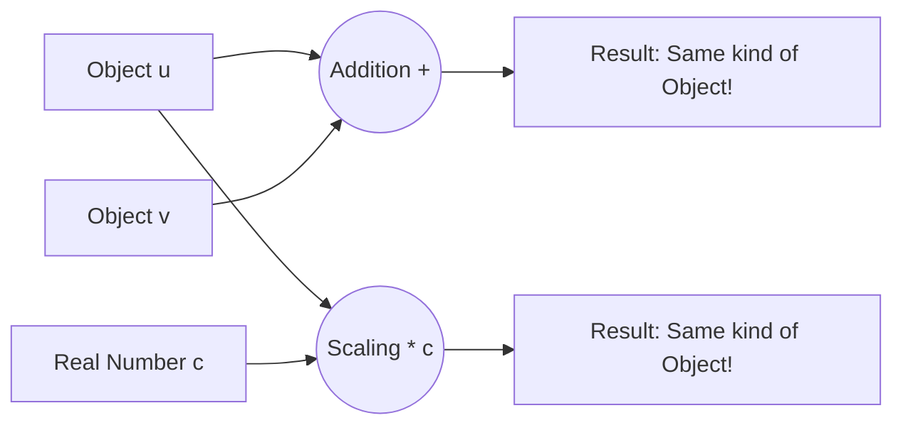
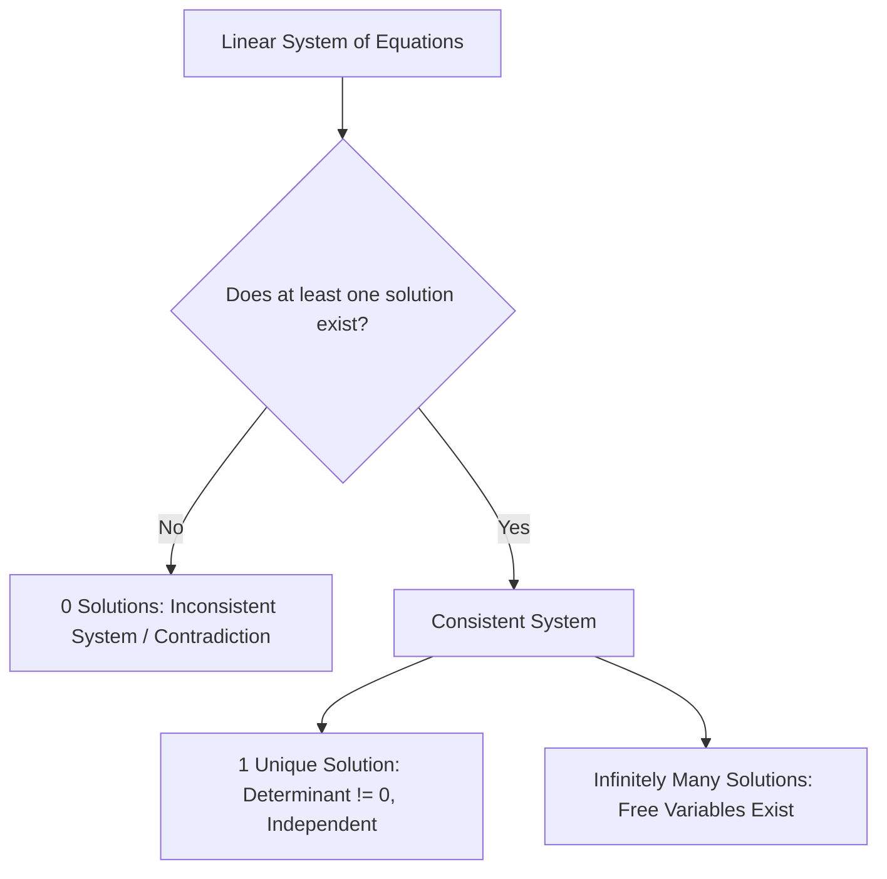
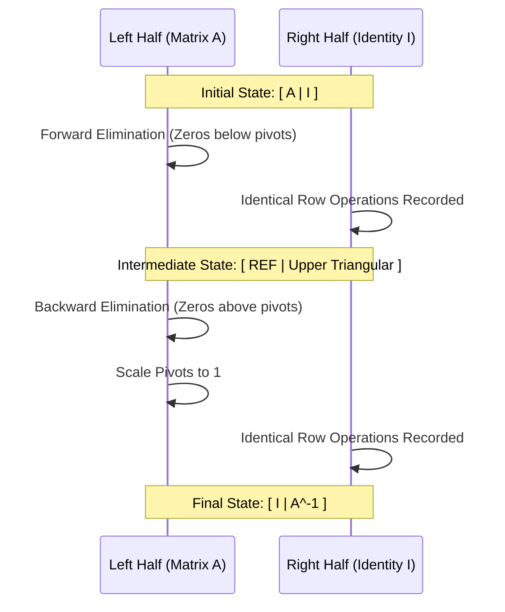

# Comprehensive Master Study Guide: Linear Systems, Matrix Algebra, and Gaussian Elimination
**Course:** Mathematical Foundations for Machine Learning & Data Science — Lecture 1  
**Target Audience:** Complete Beginners in Mathematics (Zero Knowledge Assumed $\to$ Path to Mastery)  
**Primary Reference:** Lecture 1 Presentation Slides (*Math Foundations Team*)

---

## Welcome & Pedagogical Roadmap

Welcome to the foundation of modern mathematics! If you are a beginner and have ever felt intimidated by algebraic symbols, matrices, or Greek letters, take heart: **linear algebra is the most intuitive, visual, and practical branch of mathematics ever created**. It is the universal language of computer science, data science, artificial intelligence, robotics, economics, and physics.

Whenever Netflix recommends a movie, Spotify curates your playlist, ChatGPT generates text, or an autonomous vehicle detects a pedestrian, linear algebra is silently operating beneath the surface.

This study guide is engineered under the strict premise that **no prior knowledge is assumed**. Every single mathematical step is written out in full. No arithmetic jumps are made, no intermediate logic is glossed over, and every abstract formula is paired with an intuitive real-world analogy.

---

### Visual Learning Flowchart

```mermaid
flowchart TD
    A[Real-World Problem / Raw Data] --> B[Formulate System of Linear Equations]
    B --> C[Represent System as Matrix Equation: Ax = b]
    C --> D{Does a Solution Exist?}
    D -->|Overconstrained / Incompatible| E[No Solution: Inconsistent System]
    E --> F[ML Approach: Approximate via Linear Regression / Least Squares]
    D -->|Compatible / Solvable| G[Consistent System]
    G -->|Unique Point| H[One Unique Solution: Det != 0, Full Rank]
    G -->|Free Variables Exist| I[Infinitely Many Solutions: Parametric Family]
    C --> J[Algorithmic Solution Engine: Gaussian Elimination]
    J --> K[Elementary Row Operations EROs]
    K --> L[Row Echelon Form REF]
    L --> M[Reduced Row Echelon Form RREF]
    M --> N[Particular Solution x_p + Homogeneous Null Space x_h]
    M --> O[Matrix Inversion: [A | I] -> [I | A^-1]]
```

---

## 1. What is Linear Algebra?

### 1.1 The Classical vs. Modern Definition
In high school, you may have encountered geometry where a **vector** was described as an "arrow in space" having a magnitude (length) and a direction (pointing somewhere in 2D or 3D).

In university-level mathematics and machine learning, this definition is far too narrow.
* **Formal Definition:** **Linear algebra** is the mathematical branch that studies **vectors**, **vector spaces**, and the **linear transformations** (rules) that map vectors to other vectors.
* **The Generalized Vector:** A vector is **any mathematical object** that can be added to another object of the same kind, and multiplied by a regular number (a scalar), such that the result remains an object of that same kind.



### 1.2 Surprising Examples of Generalized Vectors
1. **Geometric Vectors (Euclidean Coordinates):**  
   $\mathbf{v} = \begin{bmatrix} 2 \\ 5 \end{bmatrix}$. If you add $\begin{bmatrix} 1 \\ 2 \end{bmatrix}$, you get $\begin{bmatrix} 3 \\ 7 \end{bmatrix}$, which is still a 2D coordinate.
2. **Polynomials as Vectors:**  
   Consider $p_1(x) = 3x^2 + 2x + 1$ and $p_2(x) = -x^2 + 4x + 5$.  
   Add them: $(p_1 + p_2)(x) = 2x^2 + 6x + 6$. The sum is still a quadratic polynomial!  
   Multiply $p_1(x)$ by $4$: $4p_1(x) = 12x^2 + 8x + 4$. It remains a quadratic polynomial.  
   Therefore, **polynomials are vectors**.
3. **Digital Images:**  
   A grayscale image is a grid of numbers representing brightness values (pixels). Adding two images pixel-by-pixel yields a new blended image. Scaling an image multiplies pixel brightness. Therefore, **images are vectors**.
4. **Audio Signals:**  
   Sound waves represented by amplitude over discrete time samples can be added (superposition of musical instruments) and amplified (scaled). Audio signals are vectors.

### 1.3 The Space $\mathbb{R}^n$
In this course, we focus primarily on vectors living in **real coordinate space**, denoted by the mathematical symbol $\mathbb{R}^n$:
* $\mathbb{R}$ stands for the set of all **Real Numbers** (decimals, negatives, fractions, whole numbers: $\pi, -2.5, 0, 100$).
* The superscript $n$ represents the **dimension** (the number of components/entries in the list).
* A vector $\mathbf{x} \in \mathbb{R}^n$ is an ordered sequence of $n$ real numbers:
$$\mathbf{x} = \begin{bmatrix} x_1 \\ x_2 \\ \vdots \\ x_n \end{bmatrix}, \quad \text{where each } x_i \in \mathbb{R}$$

> [!NOTE]
> * $\mathbb{R}^1$: The 1-dimensional number line.
> * $\mathbb{R}^2$: The 2-dimensional plane (Cartesian $x$-$y$ coordinates).
> * $\mathbb{R}^3$: The 3-dimensional physical world ($x$-$y$-$z$ space).
> * $\mathbb{R}^n$: An $n$-dimensional space (e.g., a customer profile with $100$ features: age, income, purchase history, etc.).

### 1.4 The Concept of Closure
The word **closure** sounds complex, but the idea is simple:
> **Intuitive Analogy (The Closed Club):**  
> Imagine a VIP club with a strict door policy. Whenever any two club members interact, or when a member is altered by a club rule, the resulting person must still belong inside the club. They never leave the room.

In mathematics, a set of objects is **closed under an operation** if performing that operation on elements of the set always yields an element that belongs to the same set.
1. **Closure under Vector Addition:**  
   If $\mathbf{u} \in V$ and $\mathbf{v} \in V$, then:
   $$\mathbf{u} + \mathbf{v} \in V$$
2. **Closure under Scalar Multiplication:**  
   If $\mathbf{u} \in V$ and $\lambda \in \mathbb{R}$, then:
   $$\lambda \mathbf{u} \in V$$

If a collection of objects satisfies these closure properties (along with 8 basic arithmetic axioms like commutativity and associativity), that collection is officially recognized as a **Vector Space**.

### 1.5 Why Linear Algebra Underpins Machine Learning
Machine Learning (ML) models do not understand text, images, or audio directly; they only process numbers.
* **Data Representation:** Every data point (a user, an image, a sentence) is encoded as a high-dimensional vector in $\mathbb{R}^n$.
* **Transformations:** Neural network layers multiply an input vector by a weight matrix ($W\mathbf{x} + \mathbf{b}$).
* **Optimization:** Training an AI model involves searching a multi-dimensional vector space to find the parameter vector that minimizes errors.

---

## 2. Systems of Linear Equations & Real-World Modeling

### 2.1 What is a Linear Equation?
An equation is **linear** if all variables appear only to the first power ($x^1 = x$), are never multiplied together (e.g., no $x_1 x_2$), and are not trapped inside non-linear functions (no $\sin(x), e^x, \sqrt{x}, \ln(x)$).

$$\begin{aligned}
3x_1 + 2x_2 - 5x_3 &= 10 \quad &&\color{green}{\text{[LINEAR: each variable to power 1, separated by + / -]}} \\
3x_1^2 + 2x_2 &= 7 \quad &&\color{red}{\text{[NON-LINEAR: variable squared]}} \\
x_1 x_2 + x_3 &= 0 \quad &&\color{red}{\text{[NON-LINEAR: product of two variables]}} \\
\sin(x_1) + x_2 &= 4 \quad &&\color{red}{\text{[NON-LINEAR: trigonometric function]}}
\end{aligned}$$

A **system of linear equations** is simply a collection of two or more linear equations involving the same set of variables that must all be true at the same time.

---

### 2.2 The Manufacturing Scenario: Furniture Production

Let us ground this mathematics in a concrete business problem from the lecture slides.

#### Scenario Context
A furniture company manufactures three distinct kits:
1. **Basic Chair Kit** (quantity to produce: $x_1$)
2. **Table Kit** (quantity to produce: $x_2$)
3. **Cabinet Kit** (quantity to produce: $x_3$)

Producing each kit consumes four shared, finite factory resources:
* **Wood** (measured in units)
* **Labor Hours** (measured in clock hours)
* **Machine Time** (measured in clock hours)
* **Shipping Effort** (measured in standardized effort units)

The company’s management mandates that **100% of available resources must be consumed** to maximize factory utilization without waste.

#### Resource Allocation Table

| Resource Type | Chair Kit ($x_1$) | Table Kit ($x_2$) | Cabinet Kit ($x_3$) | Total Available Inventory |
| :--- | :---: | :---: | :---: | :---: |
| **Wood** | $1\text{ unit}$ | $2\text{ units}$ | $1\text{ unit}$ | $9\text{ units}$ |
| **Labor** | $2\text{ hours}$ | $1\text{ hour}$ | $1\text{ hour}$ | $8\text{ hours}$ |
| **Machine Time** | $1\text{ hour}$ | $1\text{ hour}$ | $2\text{ hours}$ | $7\text{ hours}$ |
| **Shipping Effort** | $3\text{ units}$ | $1\text{ unit}$ | $2\text{ units}$ | $11\text{ units}$ |

---

### 2.3 Mathematical Translation of the Problem
From the table, we translate each resource budget into an exact mathematical equality:

$$\begin{aligned}
\text{Wood Constraint:} \quad & 1x_1 + 2x_2 + 1x_3 = 9 &\quad \text{--- [Equation 1]} \\
\text{Labor Constraint:} \quad & 2x_1 + 1x_2 + 1x_3 = 8 &\quad \text{--- [Equation 2]} \\
\text{Machine Constraint:} \quad & 1x_1 + 1x_2 + 2x_3 = 7 &\quad \text{--- [Equation 3]} \\
\text{Shipping Constraint:} \quad & 3x_1 + 1x_2 + 2x_3 = 11 &\quad \text{--- [Equation 4]}
\end{aligned}$$

This is a system of **4 equations** with **3 unknowns** ($x_1, x_2, x_3$).

---

### 2.4 Meticulous Step-by-Step Solution Breakdown
The lecture states the solution directly: $x_1 = 2, x_2 = 3, x_3 = 1$. Let us derive this from first principles with **every single intermediate step** revealed.

#### Step 1: Isolate a variable using Equations (3) and (4)
Notice the structural similarity between Equation (3) and Equation (4):
$$\begin{aligned}
\text{Eq (3):} \quad x_1 + x_2 + 2x_3 &= 7 \\
\text{Eq (4):} \quad 3x_1 + x_2 + 2x_3 &= 11
\end{aligned}$$
Observe that the block $(x_2 + 2x_3)$ is identical in both equations. Let us subtract Equation (3) from Equation (4):
$$(3x_1 + x_2 + 2x_3) - (x_1 + x_2 + 2x_3) = 11 - 7$$
Group like terms:
$$(3x_1 - x_1) + (x_2 - x_2) + (2x_3 - 2x_3) = 4$$
$$2x_1 + 0 + 0 = 4$$
$$2x_1 = 4$$
Divide both sides by $2$:
$$\mathbf{x_1 = 2}$$
We have cleanly found the exact number of Chair Kits to produce!

---

#### Step 2: Substitute $x_1 = 2$ into Equations (1) and (2)
Now that we know $x_1 = 2$, replace $x_1$ with the number $2$ in the first two equations:

* **From Equation (1):**
  $$1(2) + 2x_2 + x_3 = 9$$
  $$2 + 2x_2 + x_3 = 9$$
  Subtract $2$ from both sides:
  $$2x_2 + x_3 = 9 - 2$$
  $$2x_2 + x_3 = 7 \quad \text{--- [Equation 1A]}$$

* **From Equation (2):**
  $$2(2) + x_2 + x_3 = 8$$
  $$4 + x_2 + x_3 = 8$$
  Subtract $4$ from both sides:
  $$x_2 + x_3 = 8 - 4$$
  $$x_2 + x_3 = 4 \quad \text{--- [Equation 2A]}$$

---

#### Step 3: Solve the simplified 2-variable system
We now have a system of two equations with two variables:
$$\begin{aligned}
2x_2 + x_3 &= 7 \quad \text{--- [Eq 1A]} \\
x_2 + x_3 &= 4 \quad \text{--- [Eq 2A]}
\end{aligned}$$
Notice that $x_3$ has the exact same coefficient ($1$) in both equations. Subtract Equation (2A) from Equation (1A):
$$(2x_2 + x_3) - (x_2 + x_3) = 7 - 4$$
$$(2x_2 - x_2) + (x_3 - x_3) = 3$$
$$1x_2 + 0 = 3$$
$$\mathbf{x_2 = 3}$$
We have found the exact number of Table Kits to produce!

---

#### Step 4: Solve for the final variable $x_3$
Substitute $x_2 = 3$ back into Equation (2A):
$$3 + x_3 = 4$$
Subtract $3$ from both sides:
$$x_3 = 4 - 3$$
$$\mathbf{x_3 = 1}$$
We have found the exact number of Cabinet Kits to produce!

---

#### Step 5: Complete Verification across ALL Four Equations
In any real-world engineering or business system, finding values is not enough. You must plug the candidate solution back into **every single original constraint** to ensure consistency:

1. **Check Wood (Eq 1):**
   $$1(2) + 2(3) + 1(1) = 2 + 6 + 1 = 9 \quad \color{green}{\checkmark \text{ Matches inventory (9)}}$$
2. **Check Labor (Eq 2):**
   $$2(2) + 1(3) + 1(1) = 4 + 3 + 1 = 8 \quad \color{green}{\checkmark \text{ Matches inventory (8)}}$$
3. **Check Machine Time (Eq 3):**
   $$1(2) + 1(3) + 2(1) = 2 + 3 + 2 = 7 \quad \color{green}{\checkmark \text{ Matches inventory (7)}}$$
4. **Check Shipping (Eq 4):**
   $$3(2) + 1(3) + 2(1) = 6 + 3 + 2 = 11 \quad \color{green}{\checkmark \text{ Matches inventory (11)}}$$

#### Real-World Operational Decision:
* Manufacture **$2$ Basic Chair Kits**.
* Manufacture **$3$ Table Kits**.
* Manufacture **$1$ Cabinet Kit**.
* **Result:** Exactly zero waste. Every unit of wood, hour of labor, hour of machine time, and shipping slot is utilized.

---

## 3. The Fundamental Trichotomy of Linear Systems

One of the most profound mathematical truths in linear algebra is the **Trichotomy Theorem**:

> [!IMPORTANT]
> **The Fundamental Trichotomy:**  
> For *any* system of linear equations over real numbers, exactly one of the following three cases holds true:
> 1. **Zero solutions:** The system is contradictory (**Inconsistent**).
> 2. **Exactly one unique solution:** The constraints intersect at a single point (**Consistent & Independent**).
> 3. **Infinitely many solutions:** The constraints overlap or are redundant (**Consistent & Dependent**).
> 
> *There is no such thing as a linear system with exactly 2 solutions, or exactly 5 solutions.* It is always 0, 1, or $\infty$.



---

### 3.1 Case 1: Zero Solutions (Inconsistent System)

#### Given System:
$$\begin{aligned}
x_1 + x_2 + x_3 &= 3 \quad \text{--- [Eq 1]} \\
x_1 - x_2 + 2x_3 &= 2 \quad \text{--- [Eq 2]} \\
2x_1 + 3x_3 &= 1 \quad \text{--- [Eq 3]}
\end{aligned}$$

#### Step-by-Step Mathematical Demonstration:
Let us add Equation (1) and Equation (2) together:
$$\begin{aligned}
&(x_1 + x_2 + x_3) + (x_1 - x_2 + 2x_3) = 3 + 2 \\
&(x_1 + x_1) + (x_2 - x_2) + (x_3 + 2x_3) = 5 \\
&2x_1 + 0 + 3x_3 = 5 \\
&2x_1 + 3x_3 = 5 \quad \text{--- [Deduced Truth]}
\end{aligned}$$

Now, compare our deduced truth with Equation (3):
* Our deduction from Equations (1) and (2) says: **$2x_1 + 3x_3 = 5$**
* But Equation (3) insists: **$2x_1 + 3x_3 = 1$**

Subtract Equation (3) from our deduced equation:
$$(2x_1 + 3x_3) - (2x_1 + 3x_3) = 5 - 1$$
$$0 = 4 \quad \color{red}{\text{[MATHEMATICAL ABSURDITY / CONTRADICTION!]}}$$

Zero can never equal four. Because our logical algebraic deductions produced a falsehood, there is **no combination of real numbers $(x_1, x_2, x_3)$** that can satisfy all three equations simultaneously.
* **Solution Set:** $\emptyset$ (The Empty Set).
* **Classification:** Inconsistent.

---

### 3.2 Case 2: Exactly One Solution (Unique Solution)

#### Given System:
$$\begin{aligned}
x_1 + x_2 + x_3 &= 3 \quad \text{--- [Eq 1]} \\
x_1 - x_2 + 2x_3 &= 2 \quad \text{--- [Eq 2]} \\
x_2 + x_3 &= 2 \quad \text{--- [Eq 3]}
\end{aligned}$$

#### Step-by-Step Mathematical Demonstration:
Look at Equation (1) and Equation (3):
* Equation (1) can be grouped as: $x_1 + (x_2 + x_3) = 3$.
* But Equation (3) tells us that the quantity $(x_2 + x_3)$ is identically equal to $2$.

Substitute $(x_2 + x_3) = 2$ directly into Equation (1):
$$x_1 + 2 = 3$$
Subtract $2$ from both sides:
$$\mathbf{x_1 = 1}$$

Now substitute $x_1 = 1$ into Equation (2):
$$1 - x_2 + 2x_3 = 2$$
Subtract $1$ from both sides:
$$-x_2 + 2x_3 = 2 - 1$$
$$-x_2 + 2x_3 = 1 \quad \text{--- [Eq 2B]}$$

We now have two equations with two variables:
$$\begin{aligned}
-x_2 + 2x_3 &= 1 \quad \text{--- [Eq 2B]} \\
x_2 + x_3 &= 2 \quad \text{--- [Eq 3]}
\end{aligned}$$

Add Equation (2B) and Equation (3) together:
$$(-x_2 + 2x_3) + (x_2 + x_3) = 1 + 2$$
$$(-x_2 + x_2) + (2x_3 + x_3) = 3$$
$$0 + 3x_3 = 3$$
$$3x_3 = 3 \implies \mathbf{x_3 = 1}$$

Finally, substitute $x_3 = 1$ into Equation (3):
$$x_2 + 1 = 2 \implies \mathbf{x_2 = 1}$$

#### Verification:
* Eq 1: $1 + 1 + 1 = 3 \quad \checkmark$
* Eq 2: $1 - 1 + 2(1) = 2 \quad \checkmark$
* Eq 3: $1 + 1 = 2 \quad \checkmark$
* **Conclusion:** The system has the **single unique solution** $(x_1, x_2, x_3) = (1, 1, 1)$.

---

### 3.3 Case 3: Infinitely Many Solutions (Dependent System)

#### Given System:
$$\begin{aligned}
x_1 + x_2 + x_3 &= 3 \quad \text{--- [Eq 1]} \\
x_1 - x_2 + 2x_3 &= 2 \quad \text{--- [Eq 2]} \\
2x_1 + 3x_3 &= 5 \quad \text{--- [Eq 3]}
\end{aligned}$$

#### Step-by-Step Mathematical Demonstration:
Let us add Equation (1) and Equation (2) together:
$$(x_1 + x_1) + (x_2 - x_2) + (x_3 + 2x_3) = 3 + 2$$
$$2x_1 + 3x_3 = 5$$

Notice something remarkable: our deduced equation is **completely identical** to Equation (3)!
Equation (3) provides **zero new information**. It is mathematically redundant (dependent on the first two equations). We effectively have only **2 independent equations** to constrain **3 variables**.

#### Expressing the Infinite Solutions Parametrically:
When you have fewer independent equations than variables, at least one variable can roam completely free.
Let us choose $x_3$ to be the **free variable**. We now express $x_1$ and $x_2$ in terms of $x_3$:

1. **Find $x_1$ in terms of $x_3$:**
   From $2x_1 + 3x_3 = 5$:
   $$2x_1 = 5 - 3x_3$$
   Divide every term by $2$:
   $$\mathbf{x_1 = \frac{5}{2} - \frac{3}{2}x_3}$$

2. **Find $x_2$ in terms of $x_3$:**
   Subtract Equation (2) from Equation (1):
   $$(x_1 + x_2 + x_3) - (x_1 - x_2 + 2x_3) = 3 - 2$$
   $$(x_1 - x_1) + (x_2 - (-x_2)) + (x_3 - 2x_3) = 1$$
   $$0 + 2x_2 - x_3 = 1$$
   $$2x_2 = 1 + x_3$$
   Divide every term by $2$:
   $$\mathbf{x_2 = \frac{1}{2} + \frac{1}{2}x_3}$$

#### What does this mean?
You can pick **any real number you want** for $x_3$, and it will generate a valid solution:
* If you pick $x_3 = 1$:
  $$x_1 = \frac{5}{2} - \frac{3}{2}(1) = 1, \quad x_2 = \frac{1}{2} + \frac{1}{2}(1) = 1 \implies (1, 1, 1)$$
* If you pick $x_3 = 3$:
  $$x_1 = \frac{5}{2} - \frac{3}{2}(3) = \frac{5 - 9}{2} = -2, \quad x_2 = \frac{1}{2} + \frac{1}{2}(3) = \frac{1 + 3}{2} = 2 \implies (-2, 2, 3)$$
* If you pick $x_3 = -1$:
  $$x_1 = \frac{5}{2} - \frac{3}{2}(-1) = \frac{5+3}{2} = 4, \quad x_2 = \frac{1}{2} + \frac{1}{2}(-1) = 0 \implies (4, 0, -1)$$

All of these points—and infinitely many more along a continuous line in 3D space—satisfy the original system.
* **Terminology:**
  * $x_3$ is called the **Free Variable** (independent parameter).
  * $x_1$ and $x_2$ are called the **Pivot Variables** (dependent on the free variable).

---

### 3.4 The Machine Learning Connection: Overconstrained Systems & Linear Regression

In machine learning and statistics, you almost never have an exact number of equations matching variables:
* **The Reality of Data:** Suppose you want to predict house prices based on size ($x_1$) and bedrooms ($x_2$). You collect $100{,}000$ housing sales records.
* **The Math:** You have $100{,}000$ equations, but only $2$ unknowns!
* **Result:** Because real-world data contains sensor noise, measurement discrepancies, and human randomness, no single straight line can pass through all $100{,}000$ points. The system is **overconstrained** and has **zero exact solutions**.
* **How AI Solves This:** Rather than giving up, machine learning uses **Linear Regression** (via Least Squares or Gradient Descent) to find an **approximate solution** $\hat{\mathbf{x}}$ that minimizes the total squared error:
$$\min_{\mathbf{x}} \|A\mathbf{x} - \mathbf{b}\|^2$$

---

## 4. Geometric Interpretations of Linear Systems

Mathematics is not just abstract symbols on paper; it is geometry you can visualize.

### 4.1 Visualizing in Two Dimensions ($\mathbb{R}^2$)
In 2D space, every linear equation $a_1 x_1 + a_2 x_2 = b$ defines a **straight line**. Solving a system of two equations means finding the points where the two lines intersect.

```
Case 1: Unique Solution         Case 2: Infinite Solutions        Case 3: No Solution
   \       /                        ===================              /         /
    \     /                         (Both equations represent        /         /
     \   /                           the exact same line)           /         /
      \ /  <-- (Single Point)                                      /         /
       X                                                           /         /  (Parallel Lines
      / \                                                         /         /    Never Intersect)
     /   \
```

1. **Unique Solution (Single Intersection Point):**  
   The two lines have different slopes and cross at exactly one coordinate $(x_1, x_2)$.
2. **Infinite Solutions (Coincident Lines):**  
   The two equations are algebraic multiples of each other (e.g., $x_1 + x_2 = 2$ and $2x_1 + 2x_2 = 4$). Geometrically, both equations draw the **exact same line**. Every point on that line is a mutual solution.
3. **No Solution (Parallel Lines):**  
   The two lines have identical slopes but different intercepts (e.g., $x_1 + x_2 = 2$ and $x_1 + x_2 = 5$). They run parallel to infinity and never touch.

---

### 4.2 Visualizing in Three Dimensions ($\mathbb{R}^3$)
In 3D space, every linear equation $a_1 x_1 + a_2 x_2 + a_3 x_3 = b$ defines an infinite, flat **2D plane**.

1. **Unique Solution (Point):**  
   * The first two planes intersect along a line (like where two adjacent walls meet in the corner of a room).
   * The third plane (like the floor) slices through that line at a **single point**.
2. **Infinite Solutions (Line or Plane):**  
   * All three planes intersect along a single shared line (like the pages of an open book meeting at the spine). Every point along the spine is a solution!
   * Or all three equations represent the exact same plane.
3. **No Solution (Inconsistent):**  
   * Two or three planes are parallel and separated.
   * The three planes form a **triangular prism**: Plane 1 meets Plane 2 in a line, Plane 2 meets Plane 3 in a second line, and Plane 1 meets Plane 3 in a third line. The three intersection lines are parallel to each other, so there is no single point shared by all three planes simultaneously.

---

## 5. Matrix Algebra: Rules, Operations, and Proofs

### 5.1 Formal Definition of a Matrix
An **$m \times n$ matrix** $A$ is a rectangular array of numbers arranged into $m$ horizontal rows and $n$ vertical columns:

$$A = \begin{bmatrix}
a_{11} & a_{12} & \cdots & a_{1n} \\
a_{21} & a_{22} & \cdots & a_{2n} \\
\vdots & \vdots & \ddots & \vdots \\
a_{m1} & a_{m2} & \cdots & a_{mn}
\end{bmatrix} \in \mathbb{R}^{m \times n}$$

* **Index Convention:** The entry $a_{ij}$ lives at **Row $i$** and **Column $j$**.
  * *Memory Aid:* **RC** Cola $\to$ **R**ow first, **C**olumn second.
* **Row Vector:** A matrix with only 1 row: $A \in \mathbb{R}^{1 \times n}$.
* **Column Vector:** A matrix with only 1 column: $A \in \mathbb{R}^{m \times 1}$.
* **Square Matrix:** A matrix with equal rows and columns: $m = n$.

---

### 5.2 Matrix Addition and Subtraction
* **Rule:** You can only add or subtract matrices that have the **exact same dimensions** ($m \times n$).
* **Operation:** Addition is performed **element-by-element**:

$$\begin{bmatrix} a_{11} & a_{12} \\ a_{21} & a_{22} \end{bmatrix} + \begin{bmatrix} b_{11} & b_{12} \\ b_{21} & b_{22} \end{bmatrix} = \begin{bmatrix} a_{11} + b_{11} & a_{12} + b_{12} \\ a_{21} + b_{21} & a_{22} + b_{22} \end{bmatrix}$$

#### Step-by-Step Example:
$$\begin{bmatrix} 2 & -1 \\ 4 & 0 \end{bmatrix} + \begin{bmatrix} 3 & 5 \\ -2 & 1 \end{bmatrix} = \begin{bmatrix} 2+3 & -1+5 \\ 4+(-2) & 0+1 \end{bmatrix} = \begin{bmatrix} 5 & 4 \\ 2 & 1 \end{bmatrix}$$

---

### 5.3 Scalar Multiplication
Multiplying a matrix $A$ by a real number (scalar) $\lambda \in \mathbb{R}$ scales **every single entry** inside the matrix by $\lambda$:

$$\lambda A = \lambda \begin{bmatrix} a_{11} & a_{12} \\ a_{21} & a_{22} \end{bmatrix} = \begin{bmatrix} \lambda a_{11} & \lambda a_{12} \\ \lambda a_{21} & \lambda a_{22} \end{bmatrix}$$

#### Algebraic Properties of Scalar Multiplication:
For scalars $\lambda, \psi \in \mathbb{R}$ and matrices $A, B \in \mathbb{R}^{m \times n}$:
1. **Associativity of Scalars:** $(\lambda \psi)A = \lambda (\psi A)$.
2. **Distributivity over Matrix Addition:** $\lambda(A + B) = \lambda A + \lambda B$.
3. **Distributivity over Scalar Addition:** $(\lambda + \psi)A = \lambda A + \psi A$.
4. **Interaction with Transpose:** $(\lambda A)^T = \lambda A^T$ (since a scalar is equal to its own transpose: $\lambda = \lambda^T$).

---

### 5.4 Matrix Multiplication (The Row-by-Column Dot Product)

> [!WARNING]
> **The Golden Rule of Matrix Multiplication:**  
> Matrix multiplication is NOT element-wise! To multiply $A \times B$, the number of **columns in $A$** must be strictly equal to the number of **rows in $B$**.
>
> $$\underbrace{A}_{(m \times \mathbf{k})} \times \underbrace{B}_{(\mathbf{k} \times n)} = \underbrace{C}_{(m \times n)}$$
> The inner dimensions ($\mathbf{k}$) must match. The outer dimensions ($m \times n$) dictate the size of the final product.

#### The Mathematical Formula:
The entry in row $i$ and column $j$ of the product $C = AB$ is obtained by taking the **dot product** of the $i$-th row of $A$ and the $j$-th column of $B$:

$$c_{ij} = \sum_{l=1}^k a_{il} b_{lj} = a_{i1}b_{1j} + a_{i2}b_{2j} + \dots + a_{ik}b_{kj}$$

#### Concrete Step-by-Step Calculation:
Let $A = \begin{bmatrix} 1 & 2 \\ 3 & 4 \end{bmatrix}$ (size $2 \times 2$) and $B = \begin{bmatrix} 5 & 6 \\ 7 & 8 \end{bmatrix}$ (size $2 \times 2$).

$$\begin{aligned}
c_{11} &= (\text{Row 1 of } A) \cdot (\text{Col 1 of } B) = (1)(5) + (2)(7) = 5 + 14 = \mathbf{19} \\
c_{12} &= (\text{Row 1 of } A) \cdot (\text{Col 2 of } B) = (1)(6) + (2)(8) = 6 + 16 = \mathbf{22} \\
c_{21} &= (\text{Row 2 of } A) \cdot (\text{Col 1 of } B) = (3)(5) + (4)(7) = 15 + 28 = \mathbf{43} \\
c_{22} &= (\text{Row 2 of } A) \cdot (\text{Col 2 of } B) = (3)(6) + (4)(8) = 18 + 32 = \mathbf{50}
\end{aligned}$$

$$AB = \begin{bmatrix} 19 & 22 \\ 43 & 50 \end{bmatrix}$$

#### Critical Properties of Matrix Multiplication:
1. **Associative:** $(AB)C = A(BC)$ (Parentheses can be shifted without changing the result).
2. **Distributive:** $(A + B)C = AC + BC$ and $A(C + D) = AC + AD$.
3. **Identity Matrix ($I$):** The identity matrix is a square matrix with $1$s on the main diagonal and $0$s elsewhere:
   $$I_2 = \begin{bmatrix} 1 & 0 \\ 0 & 1 \end{bmatrix}, \quad I_3 = \begin{bmatrix} 1 & 0 & 0 \\ 0 & 1 & 0 \\ 0 & 0 & 1 \end{bmatrix}$$
   Multiplication by the identity matrix leaves any matrix unchanged:
   $$I_m A = A I_n = A$$
4. **NON-COMMUTATIVE (CRUCIAL!):** In ordinary arithmetic, $3 \times 5 = 5 \times 3$. In linear algebra:
   $$AB \neq BA \quad \text{(in general)}$$
   *Often, $BA$ cannot even be calculated because dimensions don't align! Even if both are square, $AB$ and $BA$ are almost never equal.*

---

### 5.5 Matrix Transposition
The **transpose** of a matrix $A \in \mathbb{R}^{m \times n}$, denoted $A^T \in \mathbb{R}^{n \times m}$, is formed by swapping its rows and columns:
$$\text{Entry } (i, j) \text{ of } A \implies \text{becomes Entry } (j, i) \text{ of } A^T$$

$$\begin{bmatrix} 1 & 2 & 3 \\ 4 & 5 & 6 \end{bmatrix}^T = \begin{bmatrix} 1 & 4 \\ 2 & 5 \\ 3 & 6 \end{bmatrix}$$

#### Properties of Transpose:
1. $(A^T)^T = A$ (Transposing twice returns the original matrix).
2. $(A + B)^T = A^T + B^T$ (Transpose distributes across sums).
3. $(\lambda A)^T = \lambda A^T$ for any scalar $\lambda$.
4. **Reverse-Order Multiplication Rule:**
   $$(AB)^T = B^T A^T$$

---

### 5.6 Rigorous Proof: Why $(AB)^T = B^T A^T$
*Why does the order reverse from $AB$ to $B^T A^T$? This is a famous exam question.*

#### Step-by-Step Proof:
1. Let $A \in \mathbb{R}^{m \times k}$ and $B \in \mathbb{R}^{k \times n}$.  
   Their product $M = AB$ is an $m \times n$ matrix.
2. By the definition of matrix multiplication, the entry at row $i$ and column $j$ of $M$ is:
   $$M_{ij} = (AB)_{ij} = \sum_{l=1}^k A_{il} B_{lj}$$
3. Now transpose the product matrix: $P = (AB)^T$. By the definition of transpose, the entry at row $j$ and column $i$ of $P$ is:
   $$P_{ji} = ((AB)^T)_{ji} = (AB)_{ij} = \sum_{l=1}^k A_{il} B_{lj} \quad \text{--- [Expression 1]}$$
4. Now examine the right-hand side: $C = B^T A^T$.
   * $B$ has size $k \times n$, so $B^T$ has size $n \times k$.
   * $A$ has size $m \times k$, so $A^T$ has size $k \times m$.
   * The matrix product $B^T A^T$ is well-defined and has size $n \times m$ (matching the size of $(AB)^T$!).
5. Let us calculate entry $(j, i)$ of $C = B^T A^T$:
   $$C_{ji} = (B^T A^T)_{ji} = \sum_{l=1}^k (B^T)_{jl} (A^T)_{li}$$
6. By definition of transpose, $(B^T)_{jl} = B_{lj}$ and $(A^T)_{li} = A_{il}$. Substitute these into the summation:
   $$C_{ji} = \sum_{l=1}^k B_{lj} A_{il}$$
7. Because $B_{lj}$ and $A_{il}$ are ordinary real numbers (scalars), scalar multiplication is commutative ($B_{lj} A_{il} = A_{il} B_{lj}$):
   $$C_{ji} = \sum_{l=1}^k A_{il} B_{lj} \quad \text{--- [Expression 2]}$$
8. Compare Expression 1 and Expression 2:
   $$((AB)^T)_{ji} = (B^T A^T)_{ji} \quad \text{for every index } j \text{ and } i$$
   Therefore, the two matrices are identical:
   $$\mathbf{(AB)^T = B^T A^T} \quad \blacksquare$$

---

## 6. Matrix Inverses and the $2 \times 2$ Case

### 6.1 What is an Inverse?
In scalar arithmetic, the number $1$ is the multiplicative identity ($x \times 1 = x$). The multiplicative inverse of a number $a$ (provided $a \neq 0$) is $a^{-1} = \frac{1}{a}$, because:
$$a \cdot a^{-1} = a \cdot \frac{1}{a} = 1$$

In matrix algebra, the **identity matrix** $I_n$ plays the role of $1$.
* **Definition:** A square matrix $A \in \mathbb{R}^{n \times n}$ is called **invertible** (or **non-singular**) if there exists a matrix $A^{-1} \in \mathbb{R}^{n \times n}$ such that:
$$A A^{-1} = A^{-1} A = I_n$$

> [!NOTE]
> * Only **square matrices** ($n \times n$) can have a standard two-sided inverse.
> * Not every square matrix has an inverse! If a matrix cannot be inverted, it is called **singular**.

---

### 6.2 Derivation of the $2 \times 2$ Matrix Inverse
Let us derive the exact algebraic conditions under which a general $2 \times 2$ matrix possesses an inverse, following the presentation slides.

Let:
$$A = \begin{bmatrix} a_{11} & a_{12} \\ a_{21} & a_{22} \end{bmatrix}$$

Let us propose an adjugate test matrix $B$ constructed by swapping the diagonal elements and negating the off-diagonal elements:
$$B = \begin{bmatrix} a_{22} & -a_{12} \\ -a_{21} & a_{11} \end{bmatrix}$$

Let us compute the matrix product $AB$ step-by-step:
$$AB = \begin{bmatrix} a_{11} & a_{12} \\ a_{21} & a_{22} \end{bmatrix} \begin{bmatrix} a_{22} & -a_{12} \\ -a_{21} & a_{11} \end{bmatrix}$$

Compute each entry:
$$\begin{aligned}
(AB)_{11} &= a_{11}a_{22} + a_{12}(-a_{21}) = a_{11}a_{22} - a_{12}a_{21} \\
(AB)_{12} &= a_{11}(-a_{12}) + a_{12}a_{11} = -a_{11}a_{12} + a_{11}a_{12} = \mathbf{0} \\
(AB)_{21} &= a_{21}a_{22} + a_{22}(-a_{21}) = a_{21}a_{22} - a_{21}a_{22} = \mathbf{0} \\
(AB)_{22} &= a_{21}(-a_{12}) + a_{22}a_{11} = -a_{21}a_{12} + a_{11}a_{22} = a_{11}a_{22} - a_{12}a_{21}
\end{aligned}$$

Look at the resulting matrix:
$$AB = \begin{bmatrix} (a_{11}a_{22} - a_{12}a_{21}) & 0 \\ 0 & (a_{11}a_{22} - a_{12}a_{21}) \end{bmatrix}$$

Notice that the scalar quantity $(a_{11}a_{22} - a_{12}a_{21})$ is common to both diagonal entries! Factor this scalar out:
$$AB = (a_{11}a_{22} - a_{12}a_{21}) \begin{bmatrix} 1 & 0 \\ 0 & 1 \end{bmatrix} = (a_{11}a_{22} - a_{12}a_{21}) I_2$$

Now, divide both sides by the scalar quantity $(a_{11}a_{22} - a_{12}a_{21})$:
$$A \cdot \left( \frac{1}{a_{11}a_{22} - a_{12}a_{21}} \begin{bmatrix} a_{22} & -a_{12} \\ -a_{21} & a_{11} \end{bmatrix} \right) = I_2$$

By definition, whatever matrix multiplies $A$ to yield the identity matrix $I$ **is the inverse $A^{-1}$**!

$$\mathbf{A^{-1} = \frac{1}{a_{11}a_{22} - a_{12}a_{21}} \begin{bmatrix} a_{22} & -a_{12} \\ -a_{21} & a_{11} \end{bmatrix}}$$

#### The Invertibility Condition: The Determinant
The denominator scalar is called the **Determinant** of the $2 \times 2$ matrix:
$$\det(A) = |A| = a_{11}a_{22} - a_{12}a_{21}$$

> [!IMPORTANT]
> A matrix $A$ possesses an inverse **if and only if its determinant is non-zero**:
> $$\det(A) \neq 0$$
> If $\det(A) = 0$, you would be dividing by zero, which is undefined. Hence, if $\det(A) = 0$, the inverse **does not exist**.

---

### 6.3 Critical Inverse Properties and Beginner Pitfalls

#### 1. Inversion of a Product: The Socks-and-Shoes Rule
$$(AB)^{-1} = B^{-1} A^{-1}$$
> **Analogy:**  
> When getting dressed, you put on your socks first, then your shoes ($A \to B$).  
> When undressing (inverting the process), you must take off your **shoes first**, then your **socks** ($B^{-1} \to A^{-1}$).

**Formal Verification:**
$$(AB)(B^{-1} A^{-1}) = A (B B^{-1}) A^{-1} = A (I) A^{-1} = A A^{-1} = I \quad \checkmark$$

#### 2. The Great Beginner Trap: Sum of Inverses
$$(A + B)^{-1} \neq A^{-1} + B^{-1} \quad \color{red}{\text{[FATAL ERROR TO AVOID]}}$$
Just like in elementary arithmetic where $\frac{1}{2 + 2} = \frac{1}{4} \neq \frac{1}{2} + \frac{1}{2} = 1$, the inverse of a sum is **never** the sum of inverses.

#### 3. Transpose of an Inverse
$$(A^T)^{-1} = (A^{-1})^T$$
Transposing and inverting can be performed in either order.

---

## 7. Compact Matrix Representation & Vector Geometry

### 7.1 From Equations to $A\mathbf{x} = \mathbf{b}$
Any linear system of $m$ equations with $n$ variables can be packaged into a single, compact matrix equation:

$$\begin{aligned}
a_{11}x_1 + a_{12}x_2 + \dots + a_{1n}x_n &= b_1 \\
a_{21}x_1 + a_{22}x_2 + \dots + a_{2n}x_n &= b_2 \\
&\vdots \\
a_{m1}x_1 + a_{m2}x_2 + \dots + a_{mn}x_n &= b_m
\end{aligned}
\iff
\underbrace{\begin{bmatrix}
a_{11} & a_{12} & \cdots & a_{1n} \\
a_{21} & a_{22} & \cdots & a_{2n} \\
\vdots & \vdots & \ddots & \vdots \\
a_{m1} & a_{m2} & \cdots & a_{mn}
\end{bmatrix}}_{A \in \mathbb{R}^{m \times n}}
\underbrace{\begin{bmatrix}
x_1 \\ x_2 \\ \vdots \\ x_n
\end{bmatrix}}_{\mathbf{x} \in \mathbb{R}^{n \times 1}}
=
\underbrace{\begin{bmatrix}
b_1 \\ b_2 \\ \vdots \\ b_m
\end{bmatrix}}_{\mathbf{b} \in \mathbb{R}^{m \times 1}}$$

#### Concrete Example:
$$\begin{aligned}
2x_1 + 3x_2 + 5x_3 &= 1 \\
4x_1 - 2x_2 - 7x_3 &= 8 \\
9x_1 + 5x_2 - 3x_3 &= 2
\end{aligned}
\iff
\begin{bmatrix}
2 & 3 & 5 \\
4 & -2 & -7 \\
9 & 5 & -3
\end{bmatrix}
\begin{bmatrix}
x_1 \\ x_2 \\ x_3
\end{bmatrix}
=
\begin{bmatrix}
1 \\ 8 \\ 2
\end{bmatrix}$$

---

### 7.2 The Column Picture (Linear Combination of Columns)
Most students are taught the "Row Picture" (dot product of rows with $\mathbf{x}$). But the **Column Picture** is far more powerful:

$$\mathbf{c}_1 x_1 + \mathbf{c}_2 x_2 + \dots + \mathbf{c}_n x_n = \mathbf{b}$$
$$x_1 \begin{bmatrix} 2 \\ 4 \\ 9 \end{bmatrix} + x_2 \begin{bmatrix} 3 \\ -2 \\ 5 \end{bmatrix} + x_3 \begin{bmatrix} 5 \\ -7 \\ -3 \end{bmatrix} = \begin{bmatrix} 1 \\ 8 \\ 2 \end{bmatrix}$$

> **Key Insight:**  
> Solving $A\mathbf{x} = \mathbf{b}$ asks a geometric question:  
> *"Can we stretch and scale the column vectors of matrix $A$ using weights $x_1, x_2, \dots, x_n$ such that their vector sum lands exactly on the target vector $\mathbf{b}$?"*

---

### 7.3 Detailed Walkthrough: Underconstrained System & Particular Solution

Let us solve the system presented in slides 30–37 step-by-step:

$$\begin{bmatrix} 1 & 0 & 8 & -4 \\ 0 & 1 & 2 & 12 \end{bmatrix}
\begin{bmatrix} x_1 \\ x_2 \\ x_3 \\ x_4 \end{bmatrix}
=
\begin{bmatrix} 42 \\ 8 \end{bmatrix}$$

This matrix has $2$ rows (equations) and $4$ columns (variables). Because there are more unknowns than equations ($4 > 2$), the system is **underconstrained**. We expect **infinitely many solutions**.

#### Step 1: Write as a Linear Combination of Columns
$$x_1 \begin{bmatrix} 1 \\ 0 \end{bmatrix} + x_2 \begin{bmatrix} 0 \\ 1 \end{bmatrix} + x_3 \begin{bmatrix} 8 \\ 2 \end{bmatrix} + x_4 \begin{bmatrix} -4 \\ 12 \end{bmatrix} = \begin{bmatrix} 42 \\ 8 \end{bmatrix}$$

Let:
$$\mathbf{c}_1 = \begin{bmatrix} 1 \\ 0 \end{bmatrix}, \quad \mathbf{c}_2 = \begin{bmatrix} 0 \\ 1 \end{bmatrix}, \quad \mathbf{c}_3 = \begin{bmatrix} 8 \\ 2 \end{bmatrix}, \quad \mathbf{c}_4 = \begin{bmatrix} -4 \\ 12 \end{bmatrix}$$

Notice that $\mathbf{c}_1$ and $\mathbf{c}_2$ are the standard canonical basis vectors!

#### Step 2: Finding a Particular Solution ($\mathbf{x}_p$)
A **particular solution** is any single, specific vector $\mathbf{x}_p$ that satisfies $A\mathbf{x}_p = \mathbf{b}$.
Because columns 1 and 2 are $\begin{bmatrix} 1 \\ 0 \end{bmatrix}$ and $\begin{bmatrix} 0 \\ 1 \end{bmatrix}$, we can effortlessly produce $\begin{bmatrix} 42 \\ 8 \end{bmatrix}$ by setting:
$$x_1 = 42, \quad x_2 = 8, \quad x_3 = 0, \quad x_4 = 0$$

Let us verify:
$$42 \begin{bmatrix} 1 \\ 0 \end{bmatrix} + 8 \begin{bmatrix} 0 \\ 1 \end{bmatrix} + 0 \begin{bmatrix} 8 \\ 2 \end{bmatrix} + 0 \begin{bmatrix} -4 \\ 12 \end{bmatrix} = \begin{bmatrix} 42 \\ 0 \end{bmatrix} + \begin{bmatrix} 0 \\ 8 \end{bmatrix} = \begin{bmatrix} 42 \\ 8 \end{bmatrix} \quad \checkmark$$

Thus, our **particular solution** is:
$$\mathbf{x}_p = \begin{bmatrix} 42 \\ 8 \\ 0 \\ 0 \end{bmatrix}$$

---

### 7.4 Finding the Homogeneous Solutions ($A\mathbf{x} = \mathbf{0}$)

To find the general solution, we must ask: *"What vectors can we add to $\mathbf{x}_p$ without changing the right-hand side $\mathbf{b}$?"*
If $A\mathbf{v} = \mathbf{0}$, then:
$$A(\mathbf{x}_p + \mathbf{v}) = A\mathbf{x}_p + A\mathbf{v} = \mathbf{b} + \mathbf{0} = \mathbf{b}$$

The set of all vectors $\mathbf{v}$ that satisfy $A\mathbf{v} = \mathbf{0}$ is called the **Null Space** (or Kernel) of matrix $A$.

#### Finding Null Vector 1 ($\mathbf{v}_1$ using Column 3):
Can we express column $\mathbf{c}_3 = \begin{bmatrix} 8 \\ 2 \end{bmatrix}$ using the canonical columns $\mathbf{c}_1$ and $\mathbf{c}_2$?
$$\begin{bmatrix} 8 \\ 2 \end{bmatrix} = 8 \begin{bmatrix} 1 \\ 0 \end{bmatrix} + 2 \begin{bmatrix} 0 \\ 1 \end{bmatrix} = 8\mathbf{c}_1 + 2\mathbf{c}_2$$
Move $\mathbf{c}_3$ to the other side:
$$8\mathbf{c}_1 + 2\mathbf{c}_2 - 1\mathbf{c}_3 + 0\mathbf{c}_4 = \begin{bmatrix} 0 \\ 0 \end{bmatrix}$$
The coefficients multiplying the columns are $(8, 2, -1, 0)$. In matrix form:
$$\begin{bmatrix} 1 & 0 & 8 & -4 \\ 0 & 1 & 2 & 12 \end{bmatrix}
\begin{bmatrix} 8 \\ 2 \\ -1 \\ 0 \end{bmatrix}
= \begin{bmatrix} 1(8) + 0(2) + 8(-1) + (-4)(0) \\ 0(8) + 1(2) + 2(-1) + 12(0) \end{bmatrix}
= \begin{bmatrix} 8 - 8 \\ 2 - 2 \end{bmatrix}
= \begin{bmatrix} 0 \\ 0 \end{bmatrix}$$

Thus, $\mathbf{v}_1 = \begin{bmatrix} 8 \\ 2 \\ -1 \\ 0 \end{bmatrix}$ is a homogeneous solution! Any scalar multiple $\lambda_1 \mathbf{v}_1$ also produces $\mathbf{0}$.

---

#### Finding Null Vector 2 ($\mathbf{v}_2$ using Column 4):
Can we express column $\mathbf{c}_4 = \begin{bmatrix} -4 \\ 12 \end{bmatrix}$ using the canonical columns $\mathbf{c}_1$ and $\mathbf{c}_2$?
$$\begin{bmatrix} -4 \\ 12 \end{bmatrix} = -4 \begin{bmatrix} 1 \\ 0 \end{bmatrix} + 12 \begin{bmatrix} 0 \\ 1 \end{bmatrix} = -4\mathbf{c}_1 + 12\mathbf{c}_2$$
Move $\mathbf{c}_4$ to the other side:
$$-4\mathbf{c}_1 + 12\mathbf{c}_2 + 0\mathbf{c}_3 - 1\mathbf{c}_4 = \begin{bmatrix} 0 \\ 0 \end{bmatrix}$$
The coefficients multiplying the columns are $(-4, 12, 0, -1)$. In matrix form:
$$\begin{bmatrix} 1 & 0 & 8 & -4 \\ 0 & 1 & 2 & 12 \end{bmatrix}
\begin{bmatrix} -4 \\ 12 \\ 0 \\ -1 \end{bmatrix}
= \begin{bmatrix} 1(-4) + 0(12) + 8(0) + (-4)(-1) \\ 0(-4) + 1(12) + 2(0) + 12(-1) \end{bmatrix}
= \begin{bmatrix} -4 + 4 \\ 12 - 12 \end{bmatrix}
= \begin{bmatrix} 0 \\ 0 \end{bmatrix}$$

Thus, $\mathbf{v}_2 = \begin{bmatrix} -4 \\ 12 \\ 0 \\ -1 \end{bmatrix}$ is our second independent homogeneous solution!

---

### 7.5 The Complete General Solution
Combining the particular solution with all possible linear combinations of the null space gives the complete set of solutions:

$$\mathbf{x} \in \mathbb{R}^4 : \mathbf{x} = \mathbf{x}_p + \lambda_1 \mathbf{v}_1 + \lambda_2 \mathbf{v}_2, \quad \lambda_1, \lambda_2 \in \mathbb{R}$$

$$\mathbf{x} = \begin{bmatrix} 42 \\ 8 \\ 0 \\ 0 \end{bmatrix} + \lambda_1 \begin{bmatrix} 8 \\ 2 \\ -1 \\ 0 \end{bmatrix} + \lambda_2 \begin{bmatrix} -4 \\ 12 \\ 0 \\ -1 \end{bmatrix}, \quad \lambda_1, \lambda_2 \in \mathbb{R}$$

> [!NOTE]
> **Why is neither the particular nor the general solution representation unique?**  
> 1. If you chose $x_3 = 1$ instead of $x_3 = 0$, you would find a different valid particular solution vector $\mathbf{x}_p'$.
> 2. Multiplying a basis vector by $-1$ gives another valid basis vector (e.g., $[-8, -2, 1, 0]^T$).
> 3. Even though the written vectors look different, they describe the **exact same geometric 2D plane** floating in 4-dimensional space!

---

## 8. Gaussian Elimination and Row Echelon Forms

In the previous problem, the matrix had convenient columns $\begin{bmatrix} 1 \\ 0 \end{bmatrix}$ and $\begin{bmatrix} 0 \\ 1 \end{bmatrix}$. Real-world matrices are messy. We need an **algorithm** that systematically transforms any complex matrix into a simple staircase form without changing its solution set. That algorithm is **Gaussian Elimination**.

### 8.1 The Three Elementary Row Operations (EROs)
You can alter the rows of an augmented matrix using three valid operations:
1. **Row Swap ($R_i \leftrightarrow R_j$):**  
   Swap the position of two rows. *(In equations: writing equation 2 above equation 1 does not change reality).*
2. **Row Scaling ($R_i \leftarrow \lambda R_i$, where $\lambda \neq 0$):**  
   Multiply all entries in a row by a non-zero scalar $\lambda$.  
   *Why must $\lambda \neq 0$? If you multiply by $0$, you destroy the equation into $0 = 0$, permanently losing information!*
3. **Row Addition/Replacement ($R_i \leftarrow R_i + c R_j$):**  
   Add a scalar multiple of row $j$ to row $i$.

---

### 8.2 Comprehensive Master Case Study: The 4-Equation, 5-Variable System with Parameter $a$

Let us meticulously solve the comprehensive problem from slides 41–49:

$$\begin{aligned}
-2x_1 + 4x_2 - 2x_3 - x_4 + 4x_5 &= -3 &\quad \text{--- [Row 1]} \\
4x_1 - 8x_2 + 3x_3 - 3x_4 + x_5 &= 2 &\quad \text{--- [Row 2]} \\
x_1 - 2x_2 + x_3 - x_4 + x_5 &= 0 &\quad \text{--- [Row 3]} \\
x_1 - 2x_2 + 0x_3 - 3x_4 + 4x_5 &= a &\quad \text{--- [Row 4]}
\end{aligned}$$

Where $a \in \mathbb{R}$ is an unknown real constant.

---

#### Step 1: Form the Augmented Matrix
Write the coefficients and constants in augmented matrix notation $[A \mid \mathbf{b}]$:

$$\left[\begin{array}{ccccc|c}
-2 & 4 & -2 & -1 & 4 & -3 \\
4 & -8 & 3 & -3 & 1 & 2 \\
1 & -2 & 1 & -1 & 1 & 0 \\
1 & -2 & 0 & -3 & 4 & a
\end{array}\right]$$

---

#### Step 2: Swap Rows to Place a $1$ on the Pivot ($R_1 \leftrightarrow R_3$)
To make our arithmetic clean, we prefer a leading coefficient of $1$ in Row 1. Swap Row 1 and Row 3:

$$\left[\begin{array}{ccccc|c}
\mathbf{1} & -2 & 1 & -1 & 1 & 0 \\
4 & -8 & 3 & -3 & 1 & 2 \\
-2 & 4 & -2 & -1 & 4 & -3 \\
1 & -2 & 0 & -3 & 4 & a
\end{array}\right]$$

---

#### Step 3: Eliminate Entries Below Pivot 1 (Column 1)
We now use the top row ($R_1$) to turn every other entry in column 1 into $0$.

1. **Eliminate Row 2 entry ($4$): Perform $R_2 \leftarrow R_2 - 4R_1$**
   $$\begin{aligned}
   R_2: \quad & [4, \quad -8, \quad 3, \quad -3, \quad 1 \quad \mid \quad 2] \\
   -4 R_1: \quad & [-4(1), \quad -4(-2), \quad -4(1), \quad -4(-1), \quad -4(1) \quad \mid \quad -4(0)] \\
   = \quad & [-4, \quad 8, \quad -4, \quad 4, \quad -4 \quad \mid \quad 0] \\
   \text{Sum: } \quad & [4-4, \quad -8+8, \quad 3-4, \quad -3+4, \quad 1-4 \quad \mid \quad 2+0] \\
   \mathbf{\text{New } R_2:} \quad & [\mathbf{0}, \quad \mathbf{0}, \quad \mathbf{-1}, \quad \mathbf{1}, \quad \mathbf{-3} \quad \mid \quad \mathbf{2}]
   \end{aligned}$$

2. **Eliminate Row 3 entry ($-2$): Perform $R_3 \leftarrow R_3 + 2R_1$**
   $$\begin{aligned}
   R_3: \quad & [-2, \quad 4, \quad -2, \quad -1, \quad 4 \quad \mid \quad -3] \\
   +2 R_1: \quad & [2(1), \quad 2(-2), \quad 2(1), \quad 2(-1), \quad 2(1) \quad \mid \quad 2(0)] \\
   = \quad & [2, \quad -4, \quad 2, \quad -2, \quad 2 \quad \mid \quad 0] \\
   \text{Sum: } \quad & [-2+2, \quad 4-4, \quad -2+2, \quad -1-2, \quad 4+2 \quad \mid \quad -3+0] \\
   \mathbf{\text{New } R_3:} \quad & [\mathbf{0}, \quad \mathbf{0}, \quad \mathbf{0}, \quad \mathbf{-3}, \quad \mathbf{6} \quad \mid \quad \mathbf{-3}]
   \end{aligned}$$

3. **Eliminate Row 4 entry ($1$): Perform $R_4 \leftarrow R_4 - R_1$**
   $$\begin{aligned}
   R_4: \quad & [1, \quad -2, \quad 0, \quad -3, \quad 4 \quad \mid \quad a] \\
   -1 R_1: \quad & [-1, \quad 2, \quad -1, \quad 1, \quad -1 \quad \mid \quad 0] \\
   \text{Sum: } \quad & [1-1, \quad -2+2, \quad 0-1, \quad -3+1, \quad 4-1 \quad \mid \quad a-0] \\
   \mathbf{\text{New } R_4:} \quad & [\mathbf{0}, \quad \mathbf{0}, \quad \mathbf{-1}, \quad \mathbf{-2}, \quad \mathbf{3} \quad \mid \quad \mathbf{a}]
   \end{aligned}$$

#### Current Intermediate Augmented Matrix:
$$\left[\begin{array}{ccccc|c}
1 & -2 & 1 & -1 & 1 & 0 \\
0 & 0 & -1 & 1 & -3 & 2 \\
0 & 0 & 0 & -3 & 6 & -3 \\
0 & 0 & -1 & -2 & 3 & a
\end{array}\right]$$

---

#### Step 4: Eliminate Entries in Column 3 ($R_4 \leftarrow R_4 - R_2 - R_3$)
Look at Row 4: it has a $-1$ in Column 3 and a $-2$ in Column 4.
Let us subtract Row 2 from Row 4:
$$\begin{aligned}
R_4 - R_2: \quad & [0, \quad 0, \quad -1-(-1), \quad -2-1, \quad 3-(-3) \quad \mid \quad a-2] \\
= \quad & [0, \quad 0, \quad 0, \quad -3, \quad 6 \quad \mid \quad a-2]
\end{aligned}$$

Now notice that this intermediate row has $[-3, 6]$ in columns 4 and 5, which exactly matches Row 3 ($[0, 0, 0, -3, 6 \mid -3]$)!
Subtract Row 3:
$$\begin{aligned}
(R_4 - R_2) - R_3: \quad & [0, \quad 0, \quad 0, \quad -3-(-3), \quad 6-6 \quad \mid \quad (a-2)-(-3)] \\
= \quad & [0, \quad 0, \quad 0, \quad 0, \quad 0 \quad \mid \quad a - 2 + 3] \\
\mathbf{\text{New } R_4:} \quad & [\mathbf{0}, \quad \mathbf{0}, \quad \mathbf{0}, \quad \mathbf{0}, \quad \mathbf{0} \quad \mid \quad \mathbf{a + 1}]
\end{aligned}$$

#### Current Matrix State:
$$\left[\begin{array}{ccccc|c}
1 & -2 & 1 & -1 & 1 & 0 \\
0 & 0 & -1 & 1 & -3 & 2 \\
0 & 0 & 0 & -3 & 6 & -3 \\
0 & 0 & 0 & 0 & 0 & a + 1
\end{array}\right]$$

---

#### Step 5: Normalize Pivots to $1$
* Multiply Row 2 by $-1$: $R_2 \leftarrow -1 \cdot R_2$:
  $$[-1(0), \quad -1(0), \quad -1(-1), \quad -1(1), \quad -1(-3) \quad \mid \quad -1(2)] \implies [0, 0, \mathbf{1}, -1, 3 \mid \mathbf{-2}]$$
* Multiply Row 3 by $-\frac{1}{3}$: $R_3 \leftarrow -\frac{1}{3} \cdot R_3$:
  $$\left[ 0, \quad 0, \quad 0, \quad -\frac{1}{3}(-3), \quad -\frac{1}{3}(6) \quad \mid \quad -\frac{1}{3}(-3) \right] \implies [0, 0, 0, \mathbf{1}, -2 \mid \mathbf{1}]$$

---

#### Step 6: The Final Row-Echelon Form (REF)

$$\left[\begin{array}{ccccc|c}
\mathbf{1} & -2 & 1 & -1 & 1 & 0 \\
0 & 0 & \mathbf{1} & -1 & 3 & -2 \\
0 & 0 & 0 & \mathbf{1} & -2 & 1 \\
0 & 0 & 0 & 0 & 0 & \mathbf{a + 1}
\end{array}\right]$$

Convert this augmented matrix back into standard algebraic equations:
$$\begin{aligned}
x_1 - 2x_2 + x_3 - x_4 + x_5 &= 0 &\quad \text{--- [Eq 1]} \\
x_3 - x_4 + 3x_5 &= -2 &\quad \text{--- [Eq 2]} \\
x_4 - 2x_5 &= 1 &\quad \text{--- [Eq 3]} \\
0 &= a + 1 &\quad \text{--- [Eq 4]}
\end{aligned}$$

---

### 8.3 Consistency Analysis: For what values of $a$ does a solution exist?
Look closely at Equation 4:
$$0x_1 + 0x_2 + 0x_3 + 0x_4 + 0x_5 = a + 1 \implies \mathbf{0 = a + 1}$$

1. **If $a \neq -1$:**  
   The right-hand side is a non-zero number (e.g., if $a = 2$, the equation says $0 = 3$). This is impossible.  
   **Conclusion:** If $a \neq -1$, the system has **ZERO solutions** (Inconsistent).
2. **If $a = -1$:**  
   The equation becomes $0 = -1 + 1 \implies 0 = 0$. This is universally true! The row of zeros vanishes cleanly.  
   **Conclusion:** A solution exists **if and only if $a = -1$**.

---

### 8.4 Deriving the Particular Solution ($\mathbf{x}_p$ when $a = -1$)
With $a = -1$, our system is consistent:
* **Pivot Columns (Pivots):** Columns 1, 3, and 4 $\implies$ **Pivot Variables:** $x_1, x_3, x_4$.
* **Non-Pivot Columns (No Pivots):** Columns 2 and 5 $\implies$ **Free Variables:** $x_2, x_5$.

To isolate a single **particular solution**, set all free variables to zero:
$$\mathbf{x_2 = 0}, \quad \mathbf{x_5 = 0}$$

Now perform **back-substitution** from the bottom non-zero equation upward:

1. **From Equation 3 ($x_4 - 2x_5 = 1$):**
   $$x_4 - 2(0) = 1 \implies \mathbf{x_4 = 1}$$
2. **From Equation 2 ($x_3 - x_4 + 3x_5 = -2$):**
   $$x_3 - (1) + 3(0) = -2$$
   $$x_3 - 1 = -2 \implies x_3 = -2 + 1 \implies \mathbf{x_3 = -1}$$
3. **From Equation 1 ($x_1 - 2x_2 + x_3 - x_4 + x_5 = 0$):**
   $$x_1 - 2(0) + (-1) - (1) + (0) = 0$$
   $$x_1 - 1 - 1 = 0 \implies x_1 - 2 = 0 \implies \mathbf{x_1 = 2}$$

#### The Particular Solution Vector:
$$\mathbf{x}_p = \begin{bmatrix} x_1 \\ x_2 \\ x_3 \\ x_4 \\ x_5 \end{bmatrix} = \begin{bmatrix} 2 \\ 0 \\ -1 \\ 1 \\ 0 \end{bmatrix}$$

---

### 8.5 Deriving the Homogeneous Null Space Vectors ($\mathbf{v}_1, \mathbf{v}_2$)
To find all solutions to the homogeneous system $A\mathbf{x} = \mathbf{0}$, set the right-hand side constants to zero:
$$\begin{aligned}
x_1 - 2x_2 + x_3 - x_4 + x_5 &= 0 \\
x_3 - x_4 + 3x_5 &= 0 \\
x_4 - 2x_5 &= 0
\end{aligned}$$

Since we have two free variables ($x_2$ and $x_5$), we find two independent basis vectors by setting each free variable to $1$ while setting the other to $0$.

#### Case A: Set $x_2 = 1, x_5 = 0$
1. $x_4 - 2(0) = 0 \implies \mathbf{x_4 = 0}$
2. $x_3 - (0) + 3(0) = 0 \implies \mathbf{x_3 = 0}$
3. $x_1 - 2(1) + 0 - 0 + 0 = 0 \implies x_1 - 2 = 0 \implies \mathbf{x_1 = 2}$

$$\mathbf{v}_1 = \begin{bmatrix} 2 \\ 1 \\ 0 \\ 0 \\ 0 \end{bmatrix}$$

#### Case B: Set $x_2 = 0, x_5 = 1$
1. $x_4 - 2(1) = 0 \implies \mathbf{x_4 = 2}$
2. $x_3 - (2) + 3(1) = 0 \implies x_3 - 2 + 3 = 0 \implies x_3 + 1 = 0 \implies \mathbf{x_3 = -1}$
3. $x_1 - 2(0) + (-1) - (2) + (1) = 0 \implies x_1 - 1 - 2 + 1 = 0 \implies x_1 - 2 = 0 \implies \mathbf{x_1 = 2}$

$$\mathbf{v}_2 = \begin{bmatrix} 2 \\ 0 \\ -1 \\ 2 \\ 1 \end{bmatrix}$$

---

### 8.6 The Complete General Solution Formula
$$\mathbf{x} \in \mathbb{R}^5 : \mathbf{x} = \begin{bmatrix} 2 \\ 0 \\ -1 \\ 1 \\ 0 \end{bmatrix} + \lambda_1 \begin{bmatrix} 2 \\ 1 \\ 0 \\ 0 \\ 0 \end{bmatrix} + \lambda_2 \begin{bmatrix} 2 \\ 0 \\ -1 \\ 2 \\ 1 \end{bmatrix}, \quad \lambda_1, \lambda_2 \in \mathbb{R}$$

*This matches slide 49 with 100% precision, having laid bare every single algebraic calculation.*

---

## 9. Row-Echelon Form (REF) vs. Reduced Row-Echelon Form (RREF)

### 9.1 Formal Definitions

| Property | Row Echelon Form (REF) | Reduced Row Echelon Form (RREF) |
| :--- | :--- | :--- |
| **Zero Rows** | All rows containing only zeros sit at the bottom. | All rows containing only zeros sit at the bottom. |
| **Pivot Placement** | The first non-zero number in a row (pivot) is strictly to the right of the pivot above it. | Same: strictly to the right of the pivot in the row above. |
| **Pivot Value** | Any non-zero real number (often scaled to $1$). | **Must be strictly equal to $1$**. |
| **Entries Below Pivots**| Must be all **$0$**. | Must be all **$0$**. |
| **Entries ABOVE Pivots**| Can be *any* arbitrary numbers. | **Must be strictly all $0$**. |
| **Appearance** | Upper-triangular staircase. | Pivot columns look like identity basis vectors $\mathbf{e}_i$. |

```
Row Echelon Form (REF):              Reduced Row Echelon Form (RREF):
[ 1   *   *   *   * ]                [ 1   0   *   0   * ]
[ 0   1   *   *   * ]                [ 0   1   *   0   * ]
[ 0   0   0   1   * ]                [ 0   0   0   1   * ]
[ 0   0   0   0   0 ]                [ 0   0   0   0   0 ]
(* = arbitrary real numbers)         (* = free variable coefficients)
```

---

### 9.2 Inspecting Solutions from RREF (Slide 54 Example)

Consider the matrix already reduced to RREF:

$$A = \begin{bmatrix}
1 & 3 & 0 & 0 & 3 \\
0 & 0 & 1 & 0 & 9 \\
0 & 0 & 0 & 1 & -4
\end{bmatrix}$$

Let us analyze its structure:
* **Size:** $3 \times 5$ (3 equations, 5 variables).
* **Pivots (Leading 1s):**
  * Row 1 pivot is in **Column 1** ($\mathbf{c}_1$).
  * Row 2 pivot is in **Column 3** ($\mathbf{c}_3$).
  * Row 3 pivot is in **Column 4** ($\mathbf{c}_4$).
* **Pivot Variables:** $x_1, x_3, x_4$.
* **Free Variables (Non-Pivot Columns):** Column 2 ($x_2$) and Column 5 ($x_5$).

#### Strategy: Column Cancellation to solve $A\mathbf{x} = \mathbf{0}$
The presentation notes that *the pivot columns are strong enough to generate all non-pivot columns*.

1. **Expressing Column 2 ($\mathbf{c}_2$):**
   Look at Column 2: $\mathbf{c}_2 = \begin{bmatrix} 3 \\ 0 \\ 0 \end{bmatrix}$.
   Notice that $\mathbf{c}_2$ is simply $3 \times \mathbf{c}_1 = 3 \begin{bmatrix} 1 \\ 0 \\ 0 \end{bmatrix}$!
   Therefore:
   $$3\mathbf{c}_1 - 1\mathbf{c}_2 = \mathbf{0}$$
   Assigning coefficients $(x_1, x_2, x_3, x_4, x_5)$:
   $$3\mathbf{c}_1 - 1\mathbf{c}_2 + 0\mathbf{c}_3 + 0\mathbf{c}_4 + 0\mathbf{c}_5 = \mathbf{0}$$
   This yields our first null space basis vector:
   $$\mathbf{v}_1 = \begin{bmatrix} 3 \\ -1 \\ 0 \\ 0 \\ 0 \end{bmatrix}$$

2. **Expressing Column 5 ($\mathbf{c}_5$):**
   Look at Column 5: $\mathbf{c}_5 = \begin{bmatrix} 3 \\ 9 \\ -4 \end{bmatrix}$.
   Examine the pivot columns:
   * $\mathbf{c}_1 = \begin{bmatrix} 1 \\ 0 \\ 0 \end{bmatrix} \implies 3\mathbf{c}_1 = \begin{bmatrix} 3 \\ 0 \\ 0 \end{bmatrix}$
   * $\mathbf{c}_3 = \begin{bmatrix} 0 \\ 1 \\ 0 \end{bmatrix} \implies 9\mathbf{c}_3 = \begin{bmatrix} 0 \\ 9 \\ 0 \end{bmatrix}$
   * $\mathbf{c}_4 = \begin{bmatrix} 0 \\ 0 \\ 1 \end{bmatrix} \implies -4\mathbf{c}_4 = \begin{bmatrix} 0 \\ 0 \\ -4 \end{bmatrix}$

   Add them together:
   $$3\mathbf{c}_1 + 9\mathbf{c}_3 - 4\mathbf{c}_4 = \begin{bmatrix} 3 \\ 9 \\ -4 \end{bmatrix} = \mathbf{c}_5$$
   Subtract $\mathbf{c}_5$ to set the combination to $\mathbf{0}$:
   $$3\mathbf{c}_1 + 0\mathbf{c}_2 + 9\mathbf{c}_3 - 4\mathbf{c}_4 - 1\mathbf{c}_5 = \mathbf{0}$$
   This gives our second null space basis vector:
   $$\mathbf{v}_2 = \begin{bmatrix} 3 \\ 0 \\ 9 \\ -4 \\ -1 \end{bmatrix}$$

#### General Solution to $A\mathbf{x} = \mathbf{0}$:
$$\mathbf{x} = \lambda_1 \begin{bmatrix} 3 \\ -1 \\ 0 \\ 0 \\ 0 \end{bmatrix} + \lambda_2 \begin{bmatrix} 3 \\ 0 \\ 9 \\ -4 \\ -1 \end{bmatrix}, \quad \lambda_1, \lambda_2 \in \mathbb{R}$$

*(Note: In standard textbook form where free variables are set to $+1$, you get the exact negative of these vectors, which spans the identical subspace).*

---

## 10. Calculating Matrix Inverses via Gauss-Jordan Elimination

Can the Gaussian elimination procedure be used to compute the inverse of an $n \times n$ matrix? **Yes!**

### 10.1 The Mathematical Principle
Recall that the columns of the $n \times n$ identity matrix $I_n$ are the canonical basis vectors $\mathbf{e}_1, \mathbf{e}_2, \dots, \mathbf{e}_n$:
$$I_n = \begin{bmatrix} \mathbf{e}_1 & \mathbf{e}_2 & \cdots & \mathbf{e}_n \end{bmatrix}$$

The definition of the matrix inverse is:
$$A A^{-1} = I_n$$

If we express $A^{-1}$ as a collection of unknown column vectors:
$$A^{-1} = \begin{bmatrix} \mathbf{x}_1 & \mathbf{x}_2 & \cdots & \mathbf{x}_n \end{bmatrix}$$

Then the equation $A A^{-1} = I_n$ splits into $n$ separate linear systems:
$$A\mathbf{x}_1 = \mathbf{e}_1, \quad A\mathbf{x}_2 = \mathbf{e}_2, \quad \dots, \quad A\mathbf{x}_n = \mathbf{e}_n$$

Rather than running Gaussian elimination $n$ separate times, we can solve all $n$ systems **simultaneously** by augmenting matrix $A$ with the entire identity matrix $I_n$!

---

### 10.2 The Super-Augmented Matrix Algorithm

$$[A \mid I_n] \xrightarrow{\text{Gauss-Jordan Row Operations}} [I_n \mid A^{-1}]$$



#### Why Does This Work?
Every elementary row operation is equivalent to multiplying the matrix on the left by an elementary matrix $E_k$.
If a sequence of row operations transforms $A$ into $I$:
$$(E_k \dots E_2 E_1) A = I_n$$
This proves that the composite operation matrix **is the inverse**:
$$(E_k \dots E_2 E_1) = A^{-1}$$
Therefore, applying those exact same operations to $I_n$ yields:
$$(E_k \dots E_2 E_1) I_n = A^{-1} I_n = A^{-1}$$

> [!WARNING]
> **Inversion Failure Detection:**  
> If, during Gaussian elimination, an entire row of zeros appears on the left-hand side, the matrix is **singular** ($\det(A) = 0$). **It has no inverse**, and the algorithm terminates.

---

### 10.3 Concrete Step-by-Step Worked Example: Inverting a Matrix

Let us invert the matrix:
$$A = \begin{bmatrix} 1 & 2 \\ 3 & 5 \end{bmatrix}$$

#### Step 1: Set up the Augmented Matrix $[A \mid I_2]$
$$\left[\begin{array}{cc|cc}
1 & 2 & 1 & 0 \\
3 & 5 & 0 & 1
\end{array}\right]$$

#### Step 2: Eliminate below Pivot 1 ($R_2 \leftarrow R_2 - 3R_1$)
$$\begin{aligned}
R_2: \quad & [3, \quad 5 \quad \mid \quad 0, \quad 1] \\
-3R_1: \quad & [-3(1), \quad -3(2) \quad \mid \quad -3(1), \quad -3(0)] = [-3, \quad -6 \quad \mid \quad -3, \quad 0] \\
\text{New } R_2: \quad & [3-3, \quad 5-6 \quad \mid \quad 0-3, \quad 1-0] = [\mathbf{0}, \quad \mathbf{-1} \quad \mid \quad \mathbf{-3}, \quad \mathbf{1}]
\end{aligned}$$

$$\left[\begin{array}{cc|cc}
1 & 2 & 1 & 0 \\
0 & -1 & -3 & 1
\end{array}\right]$$

#### Step 3: Scale Pivot 2 to $1$ ($R_2 \leftarrow -1 \cdot R_2$)
$$\left[\begin{array}{cc|cc}
1 & 2 & 1 & 0 \\
0 & \mathbf{1} & \mathbf{3} & \mathbf{-1}
\end{array}\right]$$

#### Step 4: Eliminate above Pivot 2 ($R_1 \leftarrow R_1 - 2R_2$)
$$\begin{aligned}
R_1: \quad & [1, \quad 2 \quad \mid \quad 1, \quad 0] \\
-2R_2: \quad & [0, \quad -2(1) \quad \mid \quad -2(3), \quad -2(-1)] = [0, \quad -2 \quad \mid \quad -6, \quad 2] \\
\text{New } R_1: \quad & [1+0, \quad 2-2 \quad \mid \quad 1-6, \quad 0+2] = [\mathbf{1}, \quad \mathbf{0} \quad \mid \quad \mathbf{-5}, \quad \mathbf{2}]
\end{aligned}$$

$$\left[\begin{array}{cc|cc}
\mathbf{1} & \mathbf{0} & -5 & 2 \\
\mathbf{0} & \mathbf{1} & 3 & -1
\end{array}\right]$$

The left side has become the identity matrix $I_2$! The right side is our inverse:
$$\mathbf{A^{-1} = \begin{bmatrix} -5 & 2 \\ 3 & -1 \end{bmatrix}}$$

#### Step 5: Verification
Multiply $A$ by our candidate $A^{-1}$:
$$A A^{-1} = \begin{bmatrix} 1 & 2 \\ 3 & 5 \end{bmatrix} \begin{bmatrix} -5 & 2 \\ 3 & -1 \end{bmatrix} = \begin{bmatrix} 1(-5) + 2(3) & 1(2) + 2(-1) \\ 3(-5) + 5(3) & 3(2) + 5(-1) \end{bmatrix} = \begin{bmatrix} -5+6 & 2-2 \\ -15+15 & 6-5 \end{bmatrix} = \begin{bmatrix} 1 & 0 \\ 0 & 1 \end{bmatrix} = I_2 \quad \checkmark$$

---

## 11. Common Pitfalls, Gotchas & Beginner Traps

1. **The Order in Matrix Multiplication Matters:**  
   Writing $AB$ as $BA$ will either produce an incorrect answer or fail completely due to incompatible dimensions. Always preserve multiplication order from left to right.
2. **Dividing by Matrices Does Not Exist:**  
   There is no such mathematical operation as $\frac{B}{A}$. You must multiply by the inverse: either $A^{-1}B$ or $B A^{-1}$.
3. **The Zero Multiplier Violation in EROs:**  
   You can scale a row by any non-zero number ($R_i \leftarrow c R_i$ with $c \neq 0$). Multiplying a row by $0$ destroys the equation, transforming a solvable system into garbage.
4. **Subtracting Rows in the Wrong Direction:**  
   When calculating $R_2 \leftarrow R_2 - 3R_1$, remember that $R_2$ is the row being modified. Do not accidentally replace $R_1$ instead.
5. **Forgetting to Reverse Order on Transpose of a Product:**  
   $(AB)^T$ is $B^T A^T$, NOT $A^T B^T$.
6. **Confusing Free Variables with Dependent Variables:**  
   Pivots correspond to dependent variables. Columns that contain **no pivots** correspond to free variables that can take any arbitrary real value $\lambda \in \mathbb{R}$.
7. **Assuming an Inconsistent System Has Free Variables:**  
   Always check for contradiction rows ($0 = c$ where $c \neq 0$) before setting up free parameters. If even one contradiction exists, the system has **zero solutions**, regardless of how many variables you have.

---

## 12. Practice Problems with Full Step-by-Step Solutions

### Problem 1: System Classification
**Question:** Classify the following system as having 0, 1, or $\infty$ solutions:
$$\begin{aligned}
x_1 + 2x_2 &= 5 \\
3x_1 + 6x_2 &= 15
\end{aligned}$$

**Step-by-Step Solution:**
1. Look at Equation 2: $3x_1 + 6x_2 = 15$.
2. Divide the entire equation by $3$:
   $$\frac{3}{3}x_1 + \frac{6}{3}x_2 = \frac{15}{3} \implies x_1 + 2x_2 = 5$$
3. This is identical to Equation 1. The two equations represent the exact same line.
4. **Answer:** **Infinitely many solutions** ($\infty$). Free variable $x_2 = t \implies x_1 = 5 - 2t$.

---

### Problem 2: Matrix Multiplicability
**Question:** Given $A \in \mathbb{R}^{3 \times 4}$ and $B \in \mathbb{R}^{4 \times 2}$:
1. Can $AB$ be computed? If so, what is its dimension?
2. Can $BA$ be computed? If so, what is its dimension?

**Step-by-Step Solution:**
1. For $AB$: Inner dimensions are $4$ and $4$ (match!). Outer dimensions are $3 \times 2$.  
   **Answer:** Yes, $AB$ exists and has dimension $3 \times 2$.
2. For $BA$: Inner dimensions are $(4 \times 2) \times (3 \times 4)$. The inner dimensions are $2$ and $3$ ($2 \neq 3$, mismatch!).  
   **Answer:** No, $BA$ is **undefined**.

---

### Problem 3: $2 \times 2$ Inversion
**Question:** Find the inverse of $M = \begin{bmatrix} 3 & 4 \\ 2 & 3 \end{bmatrix}$.

**Step-by-Step Solution:**
1. Compute determinant: $\det(M) = a_{11}a_{22} - a_{12}a_{21} = (3)(3) - (4)(2) = 9 - 8 = 1$.
2. Since $\det(M) = 1 \neq 0$, the inverse exists.
3. Apply formula: $M^{-1} = \frac{1}{\det(M)} \begin{bmatrix} a_{22} & -a_{12} \\ -a_{21} & a_{11} \end{bmatrix} = \frac{1}{1} \begin{bmatrix} 3 & -4 \\ -2 & 3 \end{bmatrix}$.
4. **Answer:** $M^{-1} = \begin{bmatrix} 3 & -4 \\ -2 & 3 \end{bmatrix}$.

---

## 13. Master Reference Summary & Glossary

### Quick-Reference Formulas

| Concept | Mathematical Formula | Key Condition / Note |
| :--- | :--- | :--- |
| **Linear Combination** | $\mathbf{v} = c_1 \mathbf{v}_1 + c_2 \mathbf{v}_2 + \dots + c_k \mathbf{v}_k$ | $c_i \in \mathbb{R}$ are scalar weights |
| **Matrix Product** | $c_{ij} = \sum_{l=1}^k a_{il} b_{lj}$ | Columns of $A$ must equal Rows of $B$ |
| **Transpose Product** | $(AB)^T = B^T A^T$ | Order reverses! |
| **Inverse Product** | $(AB)^{-1} = B^{-1} A^{-1}$ | Order reverses! |
| **$2 \times 2$ Determinant**| $\det(A) = a_{11}a_{22} - a_{12}a_{21}$ | Area scaling factor |
| **$2 \times 2$ Inverse** | $A^{-1} = \frac{1}{\det(A)} \begin{bmatrix} a_{22} & -a_{12} \\ -a_{21} & a_{11} \end{bmatrix}$ | Valid if and only if $\det(A) \neq 0$ |
| **Super-Augmented Inversion**| $[A \mid I_n] \xrightarrow{\text{Gauss-Jordan}} [I_n \mid A^{-1}]$ | Solves $n$ systems simultaneously |
| **General Solution Structure**| $\mathbf{x} = \mathbf{x}_p + \sum \lambda_i \mathbf{v}_i$ | Particular + Null space combination |

---

### Terminology Glossary
* **Augmented Matrix:** A matrix formed by appending the constants vector $\mathbf{b}$ as an extra column beside the coefficient matrix $A$, denoted $[A \mid \mathbf{b}]$.
* **Basis:** A minimal set of linearly independent vectors that spans a given vector space.
* **Canonical Basis Vector ($\mathbf{e}_i$):** A column vector consisting of a $1$ in the $i$-th entry and $0$s elsewhere.
* **Closure:** The property that operations performed on members of a set always result in another member of that same set.
* **Consistent System:** A linear system that has at least one valid solution (either 1 or $\infty$).
* **Elementary Row Operations (EROs):** Three permissible matrix row manipulations (swap, scale, add) that preserve the solution set.
* **Free Variable:** A variable in a linear system corresponding to a non-pivot column, able to take any independent scalar value.
* **Inconsistent System:** A system containing contradictory constraints that has zero solutions.
* **Kernel / Null Space:** The set of all vectors $\mathbf{x}$ that satisfy the homogeneous equation $A\mathbf{x} = \mathbf{0}$.
* **Overconstrained System:** A system with more equations than unknowns ($m > n$), typical of real-world data science datasets.
* **Pivot:** The first non-zero numerical entry in a row of a matrix during row-reduction.
* **Row Echelon Form (REF):** A staircase matrix structure where entries below each pivot are zero.
* **Reduced Row Echelon Form (RREF):** A refined matrix structure where all pivots are $1$, and each pivot is the sole non-zero entry in its entire column.
* **Scalar:** A single real number, distinguished from a multi-component vector or matrix.
* **Singular Matrix:** A square matrix that does not have an inverse ($\det(A) = 0$).
* **Vector Space:** A mathematical set endowed with vector addition and scalar multiplication satisfying the 8 closure and arithmetic axioms.


<!--stackedit_data:
eyJoaXN0b3J5IjpbLTE3NTE2NzI0MDNdfQ==
-->